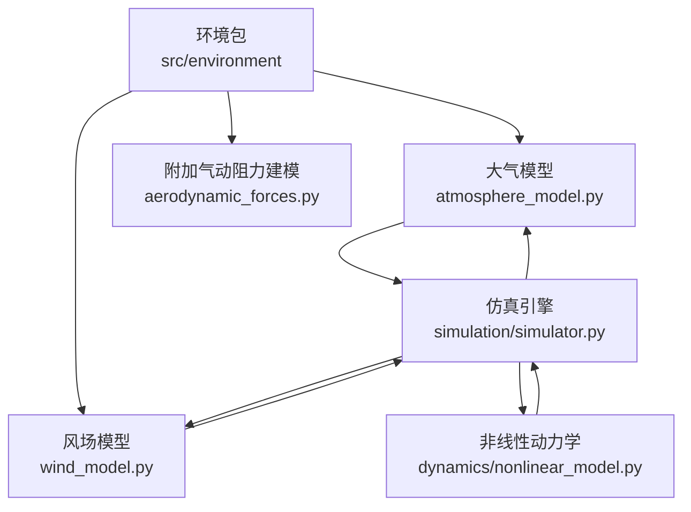
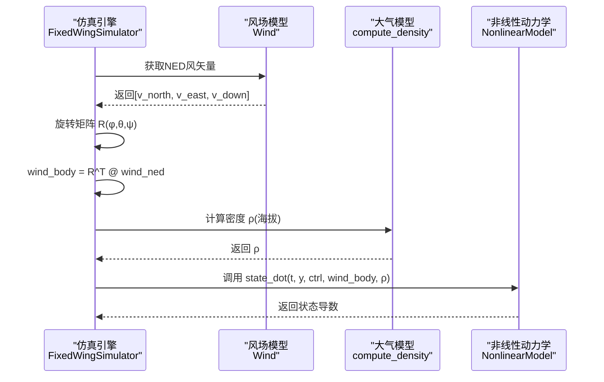
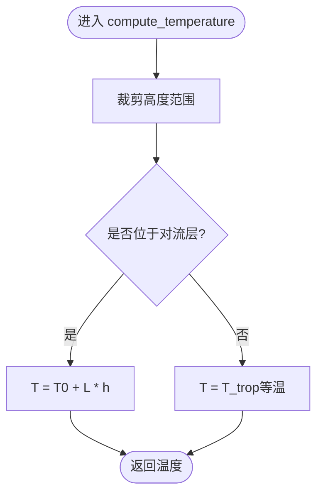
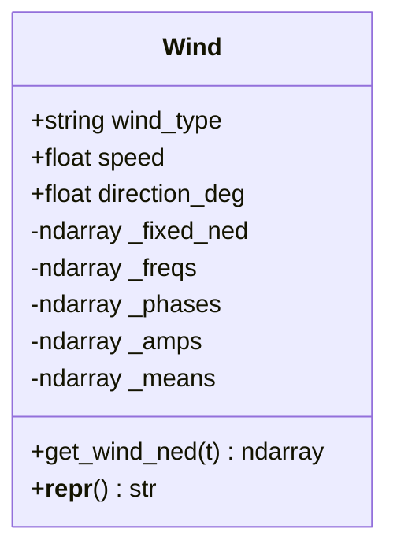
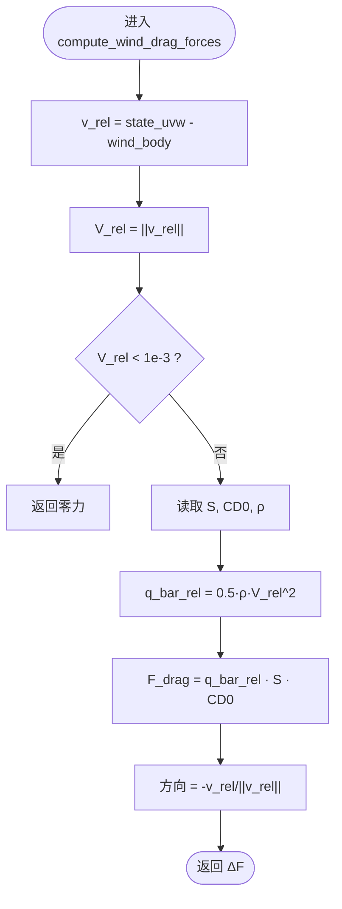
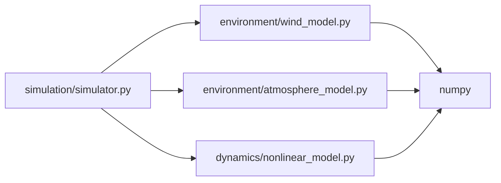

# 环境建模

<cite>
**本文引用的文件**
- [src/environment/__init__.py](file://src/environment/__init__.py)
- [src/environment/atmosphere_model.py](file://src/environment/atmosphere_model.py)
- [src/environment/wind_model.py](file://src/environment/wind_model.py)
- [src/environment/aerodynamic_forces.py](file://src/environment/aerodynamic_forces.py)
- [src/simulation/simulator.py](file://src/simulation/simulator.py)
- [src/dynamics/nonlinear_model.py](file://src/dynamics/nonlinear_model.py)
- [config/simulation.yaml](file://config/simulation.yaml)
- [examples/example_4_wind_resistance.py](file://examples/example_4_wind_resistance.py)
- [config/aircraft.yaml](file://config/aircraft.yaml)
</cite>

## 目录
1. [引言](#引言)
2. [项目结构](#项目结构)
3. [核心组件](#核心组件)
4. [架构总览](#架构总览)
5. [详细组件分析](#详细组件分析)
6. [依赖关系分析](#依赖关系分析)
7. [性能考量](#性能考量)
8. [故障排查指南](#故障排查指南)
9. [结论](#结论)
10. [附录](#附录)

## 引言
本技术文档聚焦于FixedWingSimulator的环境建模模块，系统阐述风场模型与大气模型的实现与使用方式，并说明其与气动模型的耦合关系、计算效率优化、参数设置与典型场景配置、不确定性与鲁棒性设计，以及环境参数的时空分布特性与测量方法。读者可据此在仿真中正确配置与扩展风场与大气条件，支撑从定常到扰动（如湍流）的多种飞行场景。

## 项目结构
环境建模模块位于src/environment目录，包含以下关键文件：
- 大气模型：atmosphere_model.py，实现国际标准大气（ISA）模型，提供温度、压力、密度与声速随高度的计算。
- 风场模型：wind_model.py，提供静态风、正弦叠加风、随机正弦风（类湍流）等类型，支持NED坐标系下的时间步风矢量生成。
- 气动阻力建模：aerodynamic_forces.py，基于相对风速估算由风引起的附加气动阻力（增量力），用于扰动/敏感性分析。
- 仿真集成：simulation/simulator.py，将风场与大气模型接入6自由度非线性动力学，实时计算密度并转换风矢量至机体系。
- 风场与密度接口：dynamics/nonlinear_model.py，提供make_ode_func接口以注入外部风场与密度函数。



图表来源
- [src/environment/__init__.py](file://src/environment/__init__.py#L1-L16)
- [src/environment/atmosphere_model.py](file://src/environment/atmosphere_model.py#L1-L77)
- [src/environment/wind_model.py](file://src/environment/wind_model.py#L1-L113)
- [src/environment/aerodynamic_forces.py](file://src/environment/aerodynamic_forces.py#L1-L54)
- [src/simulation/simulator.py](file://src/simulation/simulator.py#L1-L200)
- [src/dynamics/nonlinear_model.py](file://src/dynamics/nonlinear_model.py#L261-L281)

章节来源
- [src/environment/__init__.py](file://src/environment/__init__.py#L1-L16)
- [src/simulation/simulator.py](file://src/simulation/simulator.py#L130-L170)

## 核心组件
- 大气模型（ISA）
  - 提供温度、压力、密度、声速的函数接口，覆盖对流层至下平流层。
  - 提供一体化atmosphere函数一次性返回ρ、P、T、a。
- 风场模型（Wind）
  - 支持NONE、FIXED、SINE、RANDOMSINE四种类型。
  - 使用NED坐标系，风FROM方向约定为“风来自某方向”，风向与风速决定固定分量；随机/正弦分量通过频率、相位、振幅与均值模拟类湍流扰动。
- 附加气动阻力建模
  - 基于相对风速与机翼参考面积、零升阻力系数估算附加阻力增量，适用于小扰动分析。
- 仿真集成
  - 在仿真循环中按时间步获取风矢量，转换至机体系，结合高度计算密度，传入非线性动力学ODE求解器。

章节来源
- [src/environment/atmosphere_model.py](file://src/environment/atmosphere_model.py#L24-L76)
- [src/environment/wind_model.py](file://src/environment/wind_model.py#L18-L113)
- [src/environment/aerodynamic_forces.py](file://src/environment/aerodynamic_forces.py#L13-L53)
- [src/simulation/simulator.py](file://src/simulation/simulator.py#L329-L338)

## 架构总览
环境建模模块与仿真引擎的交互流程如下：仿真主循环每步调用Wind.get_wind_ned(t)，得到NED风矢量；随后通过旋转矩阵将其变换至机体系；同时根据当前海拔调用compute_density计算空气密度；最后将wind_body与rho传入非线性动力学ODE，驱动状态演化。



图表来源
- [src/simulation/simulator.py](file://src/simulation/simulator.py#L329-L338)
- [src/dynamics/nonlinear_model.py](file://src/dynamics/nonlinear_model.py#L261-L281)
- [src/environment/atmosphere_model.py](file://src/environment/atmosphere_model.py#L48-L52)

## 详细组件分析

### 大气模型（ISA）
- 物理基础
  - 对流层（0–11 km）采用线性温度递减模型；平流层（11–20 km）近似等温。
  - 基于理想气体定律与重力平衡推导静压与密度随高度的解析表达式。
  - 声速a = sqrt(γ·R·T)。
- 数学与实现要点
  - 温度：在允许范围内裁剪输入高度，对流层线性递减，超过转平层后保持常数。
  - 压力：对流层使用温度与基准压力的关系式；平流层使用指数衰减项。
  - 密度：由P与T直接计算；或由压力公式代入理想气体方程。
  - 声速：仅依赖温度。
- 性能与数值稳定性
  - 输入高度裁剪避免极端高度导致的不必要计算。
  - 平流层指数项避免了在边界处的数值抖动。



图表来源
- [src/environment/atmosphere_model.py](file://src/environment/atmosphere_model.py#L24-L34)

章节来源
- [src/environment/atmosphere_model.py](file://src/environment/atmosphere_model.py#L10-L76)

### 风场模型（Wind）
- 类型与数学描述
  - NONE：零风。
  - FIXED：恒定NED风矢量，由风速与FROM方向计算固定分量（垂直分量为0）。
  - SINE：每个轴向叠加若干正弦分量（默认3个），频率在0.1–0.5 Hz之间，相位随机。
  - RANDOMSINE：在SINE基础上引入均值扰动，使平均风速围绕目标值波动，更贴近真实湍流统计特征。
- 实现细节
  - 初始化时预计算固定NED单位向量；随机种子确保可复现性。
  - get_wind_ned按类型累加各轴分量，返回NED风矢量。
- 时空分布与测量
  - 时间分布：连续时间信号，适合实时仿真；离散步长由仿真dt决定。
  - 空间分布：点源风场，不随空间变化；若需空间扩展，可在外部封装为空间-时间场。
  - 测量方法：可通过传感器（如皮托管、多普勒雷达）估计地表风，再转换为FROM方向与速度。



图表来源
- [src/environment/wind_model.py](file://src/environment/wind_model.py#L18-L113)

章节来源
- [src/environment/wind_model.py](file://src/environment/wind_model.py#L18-L113)

### 附加气动阻力建模（风致阻力）
- 目标与适用范围
  - 估算由风引起的附加气动阻力增量，适用于小扰动/敏感性分析，不替代完整气动系数模型。
- 数学模型
  - 基于相对风速v_rel = [u,v,w]^T - [u_w,v_w,w_w]^T，计算相对速度大小V_rel。
  - 采用简化二阶模型ΔF = -0.5·ρ·S·CD0·V_rel·(v_rel/||v_rel||)，方向与相对速度相反。
- 参数与限制
  - 需要参考面积S与零升阻力系数CD0；密度ρ按当前海拔计算。
  - 当V_rel过小时返回零，避免数值不稳定。



图表来源
- [src/environment/aerodynamic_forces.py](file://src/environment/aerodynamic_forces.py#L13-L53)

章节来源
- [src/environment/aerodynamic_forces.py](file://src/environment/aerodynamic_forces.py#L13-L53)

### 与仿真引擎的耦合与数据流
- Wind与仿真主循环
  - 每步调用get_wind_ned(t)获取NED风矢量，经旋转矩阵变换至机体系wind_body。
  - 结合当前海拔调用compute_density得到ρ。
  - 将wind_body与ρ传入非线性动力学ODE，驱动状态演化。
- ODE接口与批处理
  - make_ode_func支持注入get_wind与get_rho函数，便于批处理或外部风场/密度源。

```mermaid
sequenceDiagram
participant Loop as "仿真主循环"
participant Wind as "Wind"
participant Rot as "旋转矩阵"
participant ATM as "compute_density"
participant Dyn as "NonlinearModel.state_dot"
Loop->>Wind : get_wind_ned(t)
Wind-->>Loop : wind_ned
Loop->>Rot : R(φ,θ,ψ)
Rot-->>Loop : R^T
Loop->>Loop : wind_body = R^T @ wind_ned
Loop->>ATM : ρ = compute_density(海拔)
ATM-->>Loop : ρ
Loop->>Dyn : state_dot(t, y, ctrl, wind_body, ρ)
Dyn-->>Loop : y_dot
```

图表来源
- [src/simulation/simulator.py](file://src/simulation/simulator.py#L329-L338)
- [src/dynamics/nonlinear_model.py](file://src/dynamics/nonlinear_model.py#L261-L281)

章节来源
- [src/simulation/simulator.py](file://src/simulation/simulator.py#L329-L338)
- [src/dynamics/nonlinear_model.py](file://src/dynamics/nonlinear_model.py#L261-L281)

## 依赖关系分析
- 组件内聚与耦合
  - 大气模型与风场模型均为纯函数/类，低耦合，便于替换与扩展。
  - 仿真引擎通过Wind与compute_density接口与环境模块交互，耦合点清晰。
- 外部依赖
  - NumPy用于数值计算与随机数生成。
  - 控制参数与仿真配置来源于配置文件，通过ConfigLoader加载。
- 可能的循环依赖
  - 未发现循环导入；环境模块不依赖控制/规划模块，形成清晰的单向数据流。



图表来源
- [src/simulation/simulator.py](file://src/simulation/simulator.py#L38-L52)
- [src/environment/wind_model.py](file://src/environment/wind_model.py#L14-L15)
- [src/environment/atmosphere_model.py](file://src/environment/atmosphere_model.py#L8-L9)
- [src/dynamics/nonlinear_model.py](file://src/dynamics/nonlinear_model.py#L261-L281)

章节来源
- [src/simulation/simulator.py](file://src/simulation/simulator.py#L38-L52)
- [src/environment/wind_model.py](file://src/environment/wind_model.py#L14-L15)
- [src/environment/atmosphere_model.py](file://src/environment/atmosphere_model.py#L8-L9)
- [src/dynamics/nonlinear_model.py](file://src/dynamics/nonlinear_model.py#L261-L281)

## 性能考量
- 计算开销
  - 大气模型为纯函数，开销极低；风场模型在SINE/RANDOMSINE模式下涉及多次三角函数运算，但通常远小于动力学求导。
  - 建议在批处理/批量分析中复用wind_body与ρ，减少重复计算。
- 数值稳定性
  - 风致附加阻力在V_rel过小（接近零）时返回零，避免除零与数值噪声。
  - 大气模型对高度进行裁剪，避免极端高度引发的不必要计算。
- 实时性
  - Wind.get_wind_ned为O(1)复杂度；仿真主循环瓶颈通常在ODE求解与气动计算，而非环境模块。

## 故障排查指南
- 风场类型错误
  - Wind构造函数会校验类型是否在允许集合内，若传入未知类型将抛出异常。请检查配置或调用参数。
- 风速/方向设置
  - FIXED类型使用“风FROM方向”约定，注意方向与风向的关系；初始化时已预计算固定NED分量，确保方向与速度一致。
- 附加阻力无效
  - 当相对风速过小（低于阈值）时，附加阻力为零。若期望观察到风阻影响，请确保飞行速度足够或风速与相对速度不抵消。
- 密度与高度
  - compute_density依赖海拔高度；若海拔异常或超出模型有效范围，可能导致密度异常。建议在仿真前检查初始条件与轨迹海拔。

章节来源
- [src/environment/wind_model.py](file://src/environment/wind_model.py#L39-L41)
- [src/environment/aerodynamic_forces.py](file://src/environment/aerodynamic_forces.py#L42-L43)
- [src/environment/atmosphere_model.py](file://src/environment/atmosphere_model.py#L30-L31)

## 结论
环境建模模块以简洁高效的ISA大气模型与灵活的风场模型为基础，提供了从定常风到类湍流扰动的仿真能力。通过明确的接口与清晰的数据流，它与非线性动力学紧密耦合，在保证数值稳定的同时兼顾实时性与可扩展性。建议在实际应用中结合配置文件与示例脚本，按需选择风场类型与参数，并关注密度与相对风速对气动响应的影响。

## 附录

### 环境参数设置指南与典型场景
- 配置文件入口
  - 仿真配置文件提供wind_type、wind_speed、wind_direction_deg三项关键参数，可覆盖环境模块默认设置。
- 典型场景配置
  - 无风：wind_type=NONE
  - 顺风/逆风：wind_type=FIXED，wind_direction_deg=0/180（北/南），配合wind_speed调节强度
  - 侧风：wind_type=FIXED，wind_direction_deg=90/270（东/西）
  - 湍流扰动：wind_type=RANDOMSINE，风速与频率范围已在实现中设定，满足慢湍流特征
- 示例脚本
  - 示例程序展示了在FBW_B模式下使用RANDOMSINE风扰动的完整流程，可作为快速上手模板。

章节来源
- [config/simulation.yaml](file://config/simulation.yaml#L22-L25)
- [examples/example_4_wind_resistance.py](file://examples/example_4_wind_resistance.py#L20-L36)

### 环境不确定性与鲁棒性设计
- 不确定性来源
  - 风场随机性：RANDOMSINE通过随机频率、相位与均值引入不确定性；可通过调整seed实现可复现性或不同样本。
  - 大气模型误差：ISA为平均模型，实际大气存在日变化、地形与天气影响。
- 鲁棒性建议
  - 在控制设计中加入抗风扰动机制（如TECS、L1导航），并在仿真中测试不同风况下的稳定性。
  - 对风速与方向进行敏感性分析，评估控制系统在最大风况下的性能。

### 环境模型与气动模型的耦合关系与效率优化
- 耦合关系
  - 风场通过wind_body与ρ参与气动力学计算，直接影响升阻比、侧力与力矩。
  - 附加气动阻力建模提供了一种低成本的扰动估计手段，适合快速评估风阻影响。
- 效率优化
  - 将风矢量与密度在仿真主循环中缓存，避免重复计算。
  - 在批处理场景中使用make_ode_func注入外部风场/密度函数，减少模块间切换成本。
  - 合理选择积分器与步长，在保证精度前提下提升实时性。

章节来源
- [src/simulation/simulator.py](file://src/simulation/simulator.py#L329-L338)
- [src/dynamics/nonlinear_model.py](file://src/dynamics/nonlinear_model.py#L261-L281)
- [src/environment/aerodynamic_forces.py](file://src/environment/aerodynamic_forces.py#L13-L53)