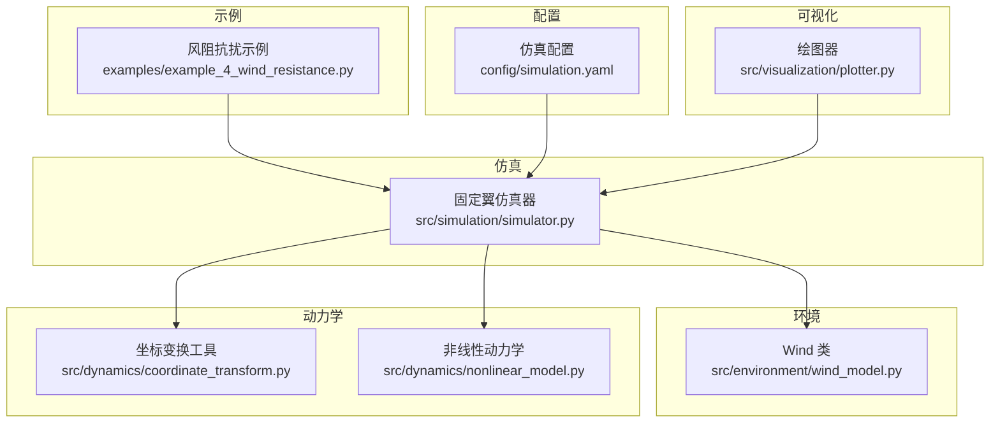
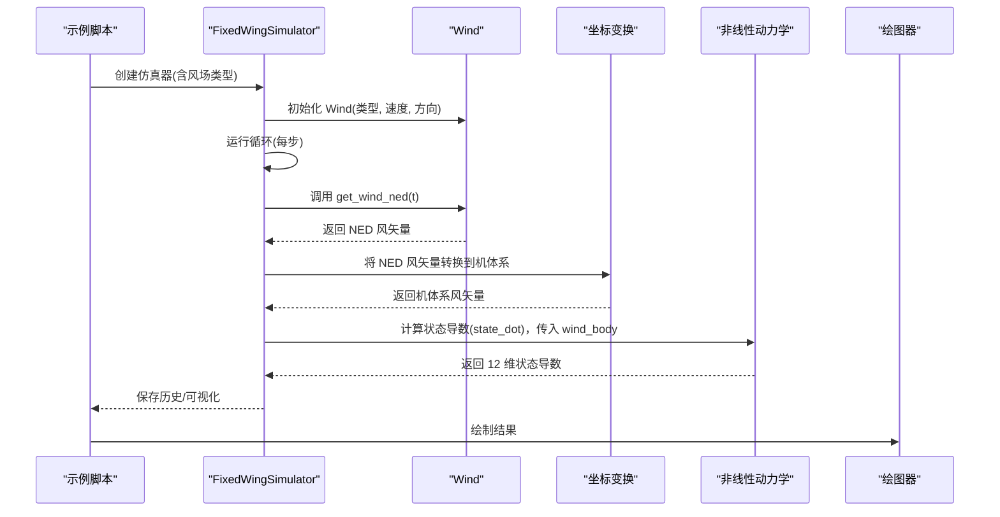
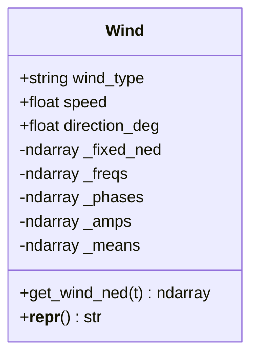
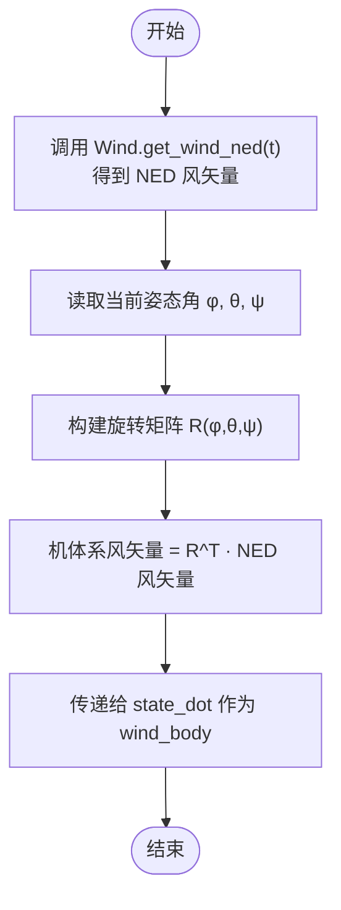
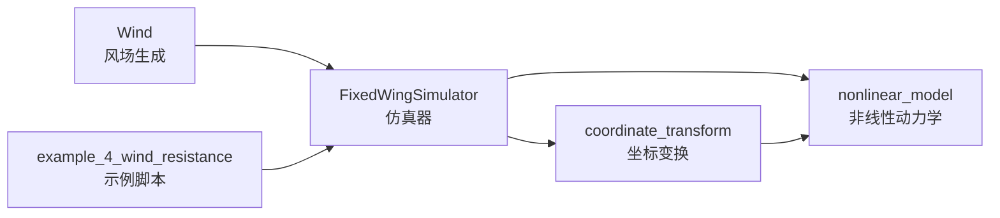

# 风场模型

<cite>
**本文引用的文件**
- [src/environment/wind_model.py](file://src/environment/wind_model.py)
- [src/simulation/simulator.py](file://src/simulation/simulator.py)
- [src/dynamics/coordinate_transform.py](file://src/dynamics/coordinate_transform.py)
- [src/dynamics/nonlinear_model.py](file://src/dynamics/nonlinear_model.py)
- [src/environment/aerodynamic_forces.py](file://src/environment/aerodynamic_forces.py)
- [src/visualization/plotter.py](file://src/visualization/plotter.py)
- [examples/example_4_wind_resistance.py](file://examples/example_4_wind_resistance.py)
- [config/simulation.yaml](file://config/simulation.yaml)
</cite>

## 目录
1. [简介](#简介)
2. [项目结构](#项目结构)
3. [核心组件](#核心组件)
4. [架构总览](#架构总览)
5. [详细组件分析](#详细组件分析)
6. [依赖关系分析](#依赖关系分析)
7. [性能考量](#性能考量)
8. [故障排查指南](#故障排查指南)
9. [结论](#结论)
10. [附录](#附录)

## 简介
本文件系统性地阐述 FixedWingSimulator 中的风场模型实现与使用方法，重点围绕 Wind 类及其四种风场类型：NONE（无风）、FIXED（恒定风）、SINE（正弦波动风）、RANDOMSINE（随机正弦湍流风）。文档将解释：
- 各风场类型的数学模型与物理意义
- NED 坐标系下的风矢量计算与方位角到笛卡尔坐标的转换
- 正弦波参数的随机生成机制（频率、振幅、相位）
- 风场参数的典型配置与应用场景
- 风场在仿真中的作用及对飞行性能的影响
- 风场可视化方法与调试技巧

## 项目结构
与风场模型直接相关的模块分布如下：
- 环境与风场：src/environment/wind_model.py
- 动力学与坐标变换：src/dynamics/coordinate_transform.py、src/dynamics/nonlinear_model.py
- 模拟器集成：src/simulation/simulator.py
- 可视化：src/visualization/plotter.py
- 示例：examples/example_4_wind_resistance.py
- 配置：config/simulation.yaml

图表来源
- [src/environment/wind_model.py](file://src/environment/wind_model.py#L1-L113)
- [src/simulation/simulator.py](file://src/simulation/simulator.py#L1-L200)
- [src/dynamics/coordinate_transform.py](file://src/dynamics/coordinate_transform.py#L1-L70)
- [src/dynamics/nonlinear_model.py](file://src/dynamics/nonlinear_model.py#L1-L386)
- [src/visualization/plotter.py](file://src/visualization/plotter.py#L1-L244)
- [examples/example_4_wind_resistance.py](file://examples/example_4_wind_resistance.py#L1-L52)
- [config/simulation.yaml](file://config/simulation.yaml#L1-L30)

章节来源
- [src/environment/wind_model.py](file://src/environment/wind_model.py#L1-L113)
- [src/simulation/simulator.py](file://src/simulation/simulator.py#L1-L200)
- [src/dynamics/coordinate_transform.py](file://src/dynamics/coordinate_transform.py#L1-L70)
- [src/dynamics/nonlinear_model.py](file://src/dynamics/nonlinear_model.py#L1-L386)
- [src/visualization/plotter.py](file://src/visualization/plotter.py#L1-L244)
- [examples/example_4_wind_resistance.py](file://examples/example_4_wind_resistance.py#L1-L52)
- [config/simulation.yaml](file://config/simulation.yaml#L1-L30)

## 核心组件
- Wind 类：提供四种风场类型，支持按时间返回 NED 坐标系下的风矢量。
- 固定翼仿真器：在每个时间步从 Wind 获取 NED 风矢量，并将其转换到机体系进行气动计算。
- 坐标变换工具：提供 NED 与机体系之间的向量转换函数。
- 非线性动力学：在状态导数中使用机体系风速参与气动力计算。
- 示例与配置：通过示例脚本与配置文件演示 RANDOMSINE 风扰下的飞行控制。

章节来源
- [src/environment/wind_model.py](file://src/environment/wind_model.py#L18-L113)
- [src/simulation/simulator.py](file://src/simulation/simulator.py#L130-L170)
- [src/dynamics/coordinate_transform.py](file://src/dynamics/coordinate_transform.py#L39-L70)
- [src/dynamics/nonlinear_model.py](file://src/dynamics/nonlinear_model.py#L160-L281)

## 架构总览
下图展示了风场模型在仿真流程中的位置与交互关系。

图表来源
- [src/simulation/simulator.py](file://src/simulation/simulator.py#L602-L641)
- [src/environment/wind_model.py](file://src/environment/wind_model.py#L76-L108)
- [src/dynamics/coordinate_transform.py](file://src/dynamics/coordinate_transform.py#L39-L70)
- [src/dynamics/nonlinear_model.py](file://src/dynamics/nonlinear_model.py#L160-L281)
- [src/visualization/plotter.py](file://src/visualization/plotter.py#L68-L111)

## 详细组件分析

### Wind 类与四种风场类型
- 支持类型：NONE、FIXED、SINE、RANDOMSINE
- 关键参数：
  - wind_type：风场类型字符串
  - speed：平均风速（m/s），用于 FIXED/SINE/RANDOMSINE 的基准
  - direction_deg：风“来自”方向（气象约定，单位度；0=北，90=东）
  - seed：随机种子，确保可复现的正弦参数初始化
- NED 单位风矢量：
  - “风来自 direction_deg”意味着风朝向（direction_deg + 180°）
  - 使用该角度的余弦与正弦构造 NED 单位向量，再乘以 speed 得到固定分量
- 正弦参数随机生成：
  - 对于 SINE：每轴 3 个谐波，振幅均分，相位随机，频率范围 0.1–0.5 Hz
  - 对于 RANDOMSINE：每轴 3 个谐波，振幅随机（0–speed），相位随机，均值随机（±0.5×speed），频率同上
- 时间步风矢量计算：
  - NONE：返回零矢量
  - FIXED：返回预计算的固定 NED 风矢量
  - SINE：对三轴分别累加各谐波的正弦项
  - RANDOMSINE：先加上均值，再叠加各谐波正弦项

图表来源
- [src/environment/wind_model.py](file://src/environment/wind_model.py#L18-L113)

章节来源
- [src/environment/wind_model.py](file://src/environment/wind_model.py#L32-L108)

### NED 坐标系与风矢量转换
- Wind.get_wind_ned 返回 NED 风矢量 [v_north, v_east, v_down]
- 在仿真器每步中，将 NED 风矢量转换到机体系：
  - 使用当前姿态角（phi, theta, psi）构建旋转矩阵
  - 机体系风矢量 = R^T · NED 风矢量
- 机体系风矢量随后传入非线性动力学的 state_dot，作为气动计算的一部分

图表来源
- [src/simulation/simulator.py](file://src/simulation/simulator.py#L619-L626)
- [src/dynamics/coordinate_transform.py](file://src/dynamics/coordinate_transform.py#L39-L53)
- [src/dynamics/nonlinear_model.py](file://src/dynamics/nonlinear_model.py#L271-L280)

章节来源
- [src/simulation/simulator.py](file://src/simulation/simulator.py#L619-L626)
- [src/dynamics/coordinate_transform.py](file://src/dynamics/coordinate_transform.py#L39-L53)
- [src/dynamics/nonlinear_model.py](file://src/dynamics/nonlinear_model.py#L271-L280)

### 风场类型详解与数学模型
- NONE
  - 物理意义：无风扰，常用于基线测试或理论分析
  - 数学模型：始终返回零矢量
- FIXED
  - 物理意义：恒定风，方向与强度固定
  - 数学模型：固定 NED 风矢量 = speed × 单位向量（基于 direction_deg）
  - 参数设置：speed（m/s），direction_deg（气象约定）
- SINE
  - 物理意义：三轴各叠加三个不同频率的正弦波，模拟周期性扰动
  - 数学模型：对三轴分别累加振幅×sin(2πft + φ)
  - 参数设置：speed 决定振幅分配；频率范围 0.1–0.5 Hz；相位随机
- RANDOMSINE
  - 物理意义：随机均值 + 正弦波动，更接近真实湍流特征
  - 数学模型：均值 + 对三轴分别累加振幅×sin(2πft + φ)
  - 参数设置：均值随机（±0.5×speed）；振幅随机（0–speed）；频率范围 0.1–0.5 Hz；相位随机

章节来源
- [src/environment/wind_model.py](file://src/environment/wind_model.py#L58-L108)

### 风场参数的典型配置与应用场景
- 配置来源
  - 配置文件 config/simulation.yaml 提供 wind_type、wind_speed、wind_direction_deg
  - 示例脚本 examples/example_4_wind_resistance.py 展示了 RANDOMSINE 风扰下的飞行模式
- 典型场景
  - FBW_B 模式 + RANDOMSINE：验证高度与空速保持控制器在风扰下的鲁棒性
  - FIXED 风：评估不同来流方向对稳定飞行的影响
  - SINE 风：研究周期性扰动对控制系统与轨迹跟踪的影响
- 参数建议
  - 风速：根据任务需求设定（如 5–15 m/s）
  - 风向：与任务环境一致（如顺风/逆风/侧风）
  - 随机性：RANDOMSINE 更贴近实际大气条件

章节来源
- [config/simulation.yaml](file://config/simulation.yaml#L22-L25)
- [examples/example_4_wind_resistance.py](file://examples/example_4_wind_resistance.py#L20-L36)

### 风场在仿真中的作用与对飞行性能的影响
- 风场直接影响相对气流，从而影响气动力与稳定性
- 在非线性动力学中，state_dot 使用机体系风速参与气动计算
- 示例脚本展示了在 RANDOMSINE 下，飞行器维持目标高度与空速的能力
- 风阻抗扰动可用于评估控制律的抗扰能力与稳态误差

章节来源
- [src/dynamics/nonlinear_model.py](file://src/dynamics/nonlinear_model.py#L160-L203)
- [examples/example_4_wind_resistance.py](file://examples/example_4_wind_resistance.py#L34-L51)

### 风场可视化与调试技巧
- 可视化
  - 使用 FixedWingPlotter 绘制 6-DOF 响应曲线，观察高度与空速变化
  - 示例脚本输出高度与空速随时间的变化图
- 调试技巧
  - 固定随机种子：在 Wind 初始化时设置 seed，便于复现实验
  - 分离风场类型：先用 NONE/FIXED 验证控制回路，再引入 SINE/RANDOMSINE
  - 观察相对气流：结合 airspeed_vector 与 wind_to_body_frame，检查机体系风速
  - 检查坐标变换：确认 NED→机体系转换是否正确（姿态角与风向一致性）

章节来源
- [src/visualization/plotter.py](file://src/visualization/plotter.py#L68-L111)
- [examples/example_4_wind_resistance.py](file://examples/example_4_wind_resistance.py#L38-L51)
- [src/dynamics/coordinate_transform.py](file://src/dynamics/coordinate_transform.py#L39-L70)

## 依赖关系分析
- Wind 类被 FixedWingSimulator 使用，后者在每步中调用 get_wind_ned 并进行坐标变换
- 非线性动力学在 state_dot 中接收 wind_body，用于气动计算
- 示例脚本通过配置与参数选择 RANDOMSINE 风扰，验证控制性能

图表来源
- [src/environment/wind_model.py](file://src/environment/wind_model.py#L76-L108)
- [src/simulation/simulator.py](file://src/simulation/simulator.py#L619-L626)
- [src/dynamics/coordinate_transform.py](file://src/dynamics/coordinate_transform.py#L39-L70)
- [src/dynamics/nonlinear_model.py](file://src/dynamics/nonlinear_model.py#L160-L203)
- [examples/example_4_wind_resistance.py](file://examples/example_4_wind_resistance.py#L20-L36)

章节来源
- [src/environment/wind_model.py](file://src/environment/wind_model.py#L76-L108)
- [src/simulation/simulator.py](file://src/simulation/simulator.py#L619-L626)
- [src/dynamics/coordinate_transform.py](file://src/dynamics/coordinate_transform.py#L39-L70)
- [src/dynamics/nonlinear_model.py](file://src/dynamics/nonlinear_model.py#L160-L203)
- [examples/example_4_wind_resistance.py](file://examples/example_4_wind_resistance.py#L20-L36)

## 性能考量
- 计算复杂度
  - Wind.get_wind_ned 对于 SINE/RANDOMSINE 需要对三轴、每轴多个谐波求和，但整体为常数级开销
  - 坐标变换仅涉及矩阵乘法，计算量小
- 实时性
  - dopri5 积分器用于实时循环，风场计算与坐标变换不会成为瓶颈
- 精度与数值稳定性
  - 频率范围 0.1–0.5 Hz 适合大多数固定翼任务
  - 随机参数通过固定种子可复现，便于对比实验

## 故障排查指南
- 风场类型错误
  - 现象：初始化时报错，提示未知风场类型
  - 处理：确认 wind_type 为 NONE/FIXED/SINE/RANDOMSINE 之一
- 风向与期望不符
  - 现象：风来自方向与预期相反
  - 处理：理解“风来自 direction_deg”含义为风朝向（direction_deg + 180°）
- 风扰过大导致不稳定
  - 现象：RANDOMSINE 下出现显著高度/空速波动
  - 处理：降低 wind_speed 或切换到 FIXED/SINE；检查控制参数
- 可视化异常
  - 现象：绘制高度/空速曲线不显示
  - 处理：确认已安装 matplotlib/plotly；检查示例脚本运行路径

章节来源
- [src/environment/wind_model.py](file://src/environment/wind_model.py#L39-L41)
- [src/simulation/simulator.py](file://src/simulation/simulator.py#L619-L626)
- [src/visualization/plotter.py](file://src/visualization/plotter.py#L161-L200)

## 结论
Wind 类提供了简洁而强大的风场建模能力，覆盖从无风到随机湍流的多种场景。其在 NED 坐标系下生成风矢量，并通过坐标变换进入机体系参与气动计算，最终影响非线性动力学的状态演化。通过合理的参数配置与可视化手段，用户可以有效评估控制系统的抗扰性能，并在不同风场条件下优化飞行策略。

## 附录
- 风场参数与配置要点
  - wind_type：NONE/FIXED/SINE/RANDOMSINE
  - wind_speed：m/s，决定风扰强度
  - wind_direction_deg：气象约定，0=北，90=东
  - seed：固定随机种子，保证可复现
- 相关函数与文件路径
  - Wind.get_wind_ned：返回 NED 风矢量
  - wind_to_body_frame：将 NED 风矢量转换到机体系
  - airspeed_vector：计算真空气速向量（体感风与速度差）
  - compute_wind_drag_forces：估算风引起的附加阻力（增量）

章节来源
- [src/environment/wind_model.py](file://src/environment/wind_model.py#L76-L108)
- [src/dynamics/coordinate_transform.py](file://src/dynamics/coordinate_transform.py#L39-L70)
- [src/environment/aerodynamic_forces.py](file://src/environment/aerodynamic_forces.py#L13-L53)