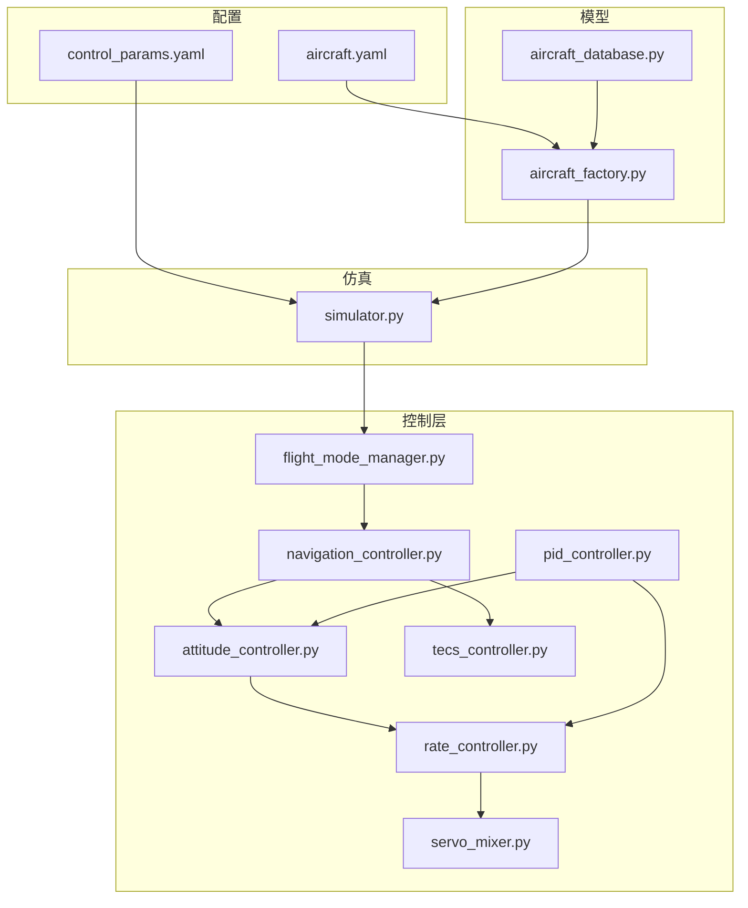
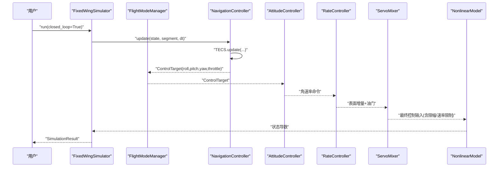
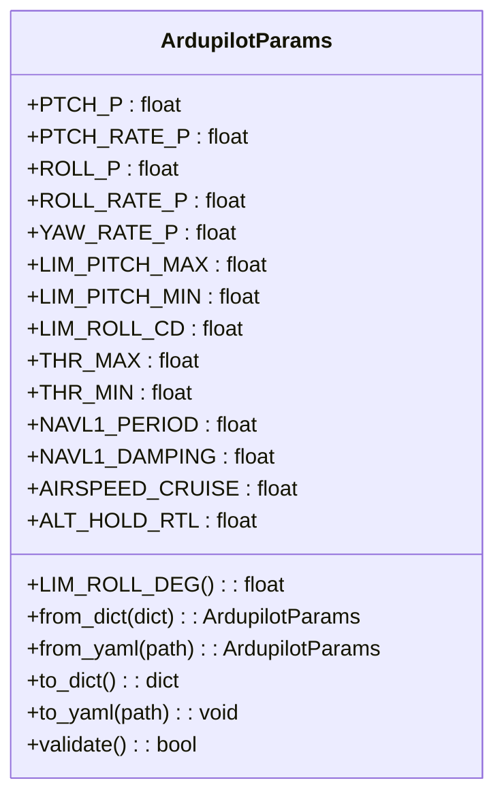
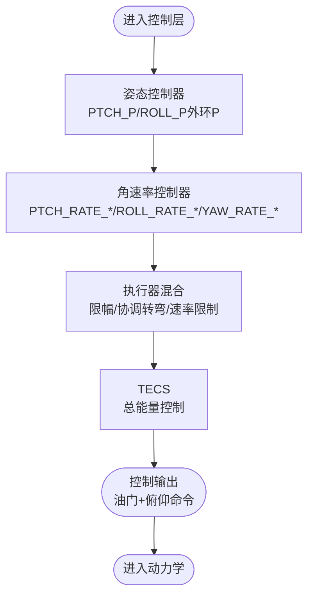
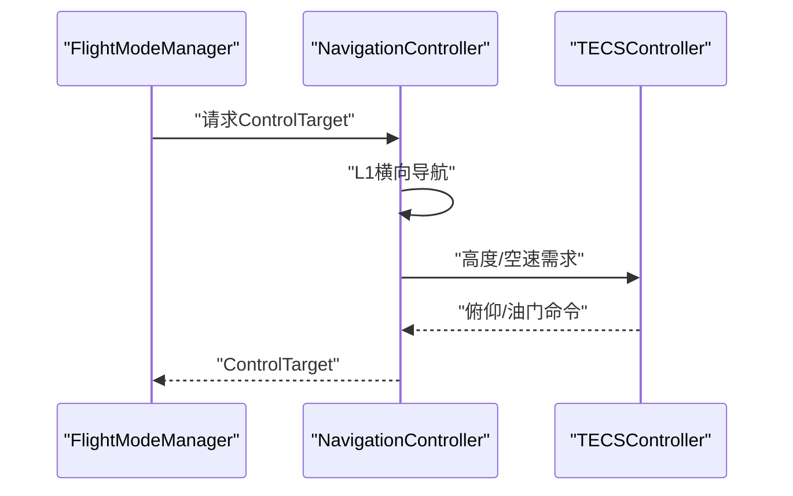
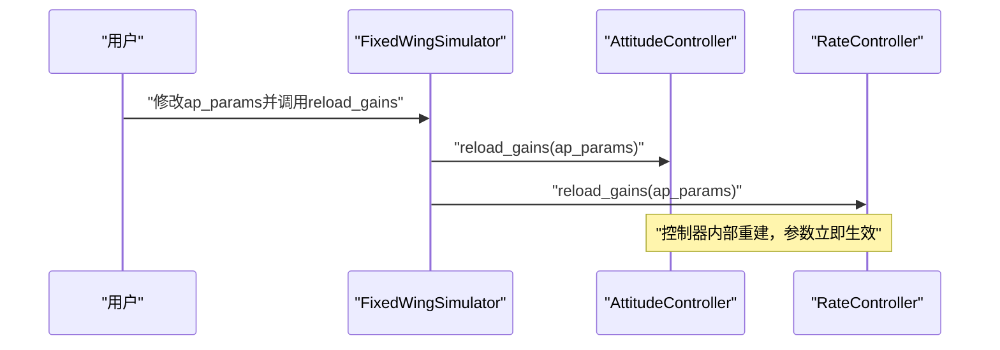
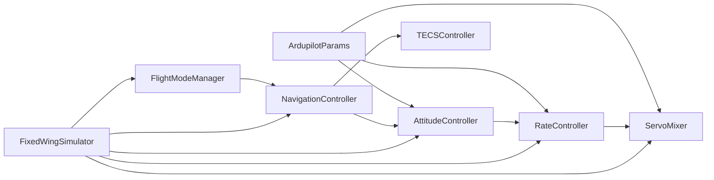

# ArduPilot参数适配

<cite>
**本文档引用的文件**
- [ardupilot_compat.py](file://src/control/ardupilot_compat.py)
- [example_6_ardupilot_parameters.py](file://examples/example_6_ardupilot_parameters.py)
- [control_params.yaml](file://config/control_params.yaml)
- [aircraft.yaml](file://config/aircraft.yaml)
- [aircraft_factory.py](file://src/models/aircraft_factory.py)
- [simulator.py](file://src/simulation/simulator.py)
- [attitude_controller.py](file://src/control/attitude_controller.py)
- [rate_controller.py](file://src/control/rate_controller.py)
- [tecs_controller.py](file://src/control/tecs_controller.py)
- [servo_mixer.py](file://src/control/servo_mixer.py)
- [navigation_controller.py](file://src/control/navigation_controller.py)
- [flight_mode_manager.py](file://src/control/flight_mode_manager.py)
- [pid_controller.py](file://src/control/pid_controller.py)
- [aircraft_database.py](file://src/models/aircraft_database.py)
</cite>

## 目录
1. [简介](#简介)
2. [项目结构](#项目结构)
3. [核心组件](#核心组件)
4. [架构总览](#架构总览)
5. [详细组件分析](#详细组件分析)
6. [依赖关系分析](#依赖关系分析)
7. [性能考量](#性能考量)
8. [故障排查指南](#故障排查指南)
9. [结论](#结论)
10. [附录](#附录)

## 简介
本文件面向FixedWingSimulator的ArduPilot参数适配，系统阐述ArduPilot参数体系与仿真器的兼容机制，涵盖参数映射、单位换算、控制链路对应关系与实现原理。文档重点包括：
- ArduPilot参数容器与YAML加载/导出
- PID参数转换与控制回路适配
- 传感器模型与执行器响应模拟
- ArduPilot飞控控制架构（姿态/导航/模式管理）
- 参数迁移、校准、验证与调试流程
- 参数优化建议与仿真验证最佳实践

## 项目结构
FixedWingSimulator采用模块化设计，围绕“飞参数据库→动力学→环境→控制层→规划→仿真器”的流水线组织代码。与ArduPilot参数适配相关的关键目录与文件如下：
- config：参数配置入口（aircraft.yaml、control_params.yaml）
- src/control：控制层（ArduPilot风格的五层控制链路）
- src/models：飞参数据库与工厂
- src/simulation：仿真引擎与状态管理
- examples：参数适配示例脚本

图表来源
- [aircraft.yaml](file://config/aircraft.yaml#L1-L13)
- [control_params.yaml](file://config/control_params.yaml#L1-L45)
- [aircraft_database.py](file://src/models/aircraft_database.py#L29-L133)
- [aircraft_factory.py](file://src/models/aircraft_factory.py#L39-L136)
- [simulator.py](file://src/simulation/simulator.py#L115-L234)
- [flight_mode_manager.py](file://src/control/flight_mode_manager.py#L115-L298)
- [navigation_controller.py](file://src/control/navigation_controller.py#L45-L293)
- [attitude_controller.py](file://src/control/attitude_controller.py#L33-L134)
- [rate_controller.py](file://src/control/rate_controller.py#L32-L109)
- [servo_mixer.py](file://src/control/servo_mixer.py#L54-L153)
- [tecs_controller.py](file://src/control/tecs_controller.py#L50-L647)
- [pid_controller.py](file://src/control/pid_controller.py#L17-L117)

章节来源
- [aircraft.yaml](file://config/aircraft.yaml#L1-L13)
- [control_params.yaml](file://config/control_params.yaml#L1-L45)
- [aircraft_database.py](file://src/models/aircraft_database.py#L29-L133)
- [aircraft_factory.py](file://src/models/aircraft_factory.py#L39-L136)
- [simulator.py](file://src/simulation/simulator.py#L115-L234)

## 核心组件
本节聚焦ArduPilot参数适配的核心构件及其职责。

- ArdupilotParams（参数容器）
  - 字段命名严格遵循ArduPilot Plane参数命名规范，支持从YAML加载、导出、字典转换与基本范围校验。
  - 提供LIM_ROLL_DEG等便捷属性，将centidegrees转换为degrees。
  - 支持from_yaml、to_yaml、from_dict、to_dict、validate等工厂与序列化方法。

- 控制层适配
  - 姿态控制器：基于ArduPilot Plane的PTCH_P、ROLL_P（外环P），无D项；Yaw无外环。
  - 角速率控制器：PTCH_RATE_*、ROLL_RATE_*、YAW_RATE_*三轴独立PID，支持FF前馈。
  - TECS：总能量控制系统，与ArduPilot AP_TECS对齐，支持爬升/下沉速率、油门/俯仰阻尼、坡度补偿等参数。
  - 执行器混合：限幅（LIM_PITCH_*、LIM_ROLL_CD→deg→rad）、速率限制、协调转弯补偿、最终归一化输出。

- 飞行模式管理
  - 支持MANUAL、STABILIZE、FBW_A、FBW_B、AUTO、LOITER、RTH等模式，模式间平滑过渡与目标生成。

- 飞参工厂与数据库
  - 从aircraft_database读取标准飞参，结合aircraft.yaml覆盖，导出ArduPilot .param文件。

章节来源
- [ardupilot_compat.py](file://src/control/ardupilot_compat.py#L17-L130)
- [attitude_controller.py](file://src/control/attitude_controller.py#L33-L134)
- [rate_controller.py](file://src/control/rate_controller.py#L32-L109)
- [tecs_controller.py](file://src/control/tecs_controller.py#L50-L647)
- [servo_mixer.py](file://src/control/servo_mixer.py#L54-L153)
- [flight_mode_manager.py](file://src/control/flight_mode_manager.py#L115-L298)
- [aircraft_factory.py](file://src/models/aircraft_factory.py#L39-L136)
- [aircraft_database.py](file://src/models/aircraft_database.py#L143-L166)

## 架构总览
ArduPilot参数适配贯穿“参数加载→控制链路→执行器响应→动力学仿真”的完整闭环。下图展示参数在仿真器中的流向与适配点：

图表来源
- [simulator.py](file://src/simulation/simulator.py#L239-L567)
- [navigation_controller.py](file://src/control/navigation_controller.py#L134-L202)
- [flight_mode_manager.py](file://src/control/flight_mode_manager.py#L173-L212)
- [attitude_controller.py](file://src/control/attitude_controller.py#L81-L123)
- [rate_controller.py](file://src/control/rate_controller.py#L68-L98)
- [servo_mixer.py](file://src/control/servo_mixer.py#L80-L149)

## 详细组件分析

### 参数容器与适配原理
- 参数命名与字段映射
  - 严格匹配ArduPilot Plane命名：PTCH_P/PTCH_RATE_*、ROLL_P/ROLL_RATE_*、YAW_RATE_*、LIM_*、NAVL1_*、AIRSPEED_*、ALT_HOLD_*、TECS_*。
  - 单位换算：LIM_ROLL_CD由centidegrees转换为degrees；角度限制由degrees转换为弧度；油门限幅[0,1]。
- 参数加载/导出
  - from_yaml：从control_params.yaml加载，忽略未知键；自动创建目录并保存to_yaml。
  - validate：范围检查并打印警告，保证参数在安全范围内。
- 导出到ArduPilot .param
  - aircraft_factory.export_ardupilot_params：合并aircraft_database参数与control_params.yaml，按“键,值”格式写出，便于ArduPilot侧导入。

图表来源
- [ardupilot_compat.py](file://src/control/ardupilot_compat.py#L17-L130)

章节来源
- [ardupilot_compat.py](file://src/control/ardupilot_compat.py#L17-L130)
- [aircraft_factory.py](file://src/models/aircraft_factory.py#L94-L136)
- [control_params.yaml](file://config/control_params.yaml#L1-L45)

### PID参数转换与控制链路适配
- 姿态控制（AttitudeController）
  - 外环：PTCH_P、ROLL_P为P控制，无D项；Yaw无外环（零增益）。
  - 输出限幅：roll±120 deg/s、pitch±60 deg/s、yaw±45 deg/s。
  - 热重载：reload_gains支持运行时更新参数并重建控制器。
- 角速率控制（RateController）
  - PTCH_RATE_*、ROLL_RATE_*、YAW_RATE_*三轴独立PID，支持FF前馈。
  - 输出归一化[-1,1]，作为执行器增量输入。
- TECS（Total Energy Control System）
  - 与ArduPilot AP_TECS一致：油门控制总比能量，俯仰控制比能量分配比（SEB）。
  - 关键参数：TECS_CLMB_MAX、TECS_SINK_MIN/Max、TECS_TIME_CONST、TECS_THR_DAMP、TECS_PTCH_DAMP、TECS_INTEG_GAIN、TECS_SPDWEIGHT、TECS_RLL2THR、TECS_PITCH_MIN/Max、TECS_THR_CRUISE、TECS_HDEM_TCONST。
  - 包含欠速保护、不可达下沉检测、自适应爬升/下沉缩放等鲁棒性机制。
- 执行器混合（ServoMixer）
  - 将rate控制器输出与throttle组合，应用：
    - LIM_PITCH_*（转换为弧度）与LIM_ROLL_CD（换算为等效副翼限幅）进行幅度限幅；
    - 协调转弯补偿（rudder）抵消副翼引起的偏航；
    - 速率限制（近似）防止控制量突变；
    - 最终输出：elevator/aileron/ruder∈[-1,1]，throttle∈[0,1]。

图表来源
- [attitude_controller.py](file://src/control/attitude_controller.py#L33-L134)
- [rate_controller.py](file://src/control/rate_controller.py#L32-L109)
- [servo_mixer.py](file://src/control/servo_mixer.py#L54-L153)
- [tecs_controller.py](file://src/control/tecs_controller.py#L50-L647)

章节来源
- [attitude_controller.py](file://src/control/attitude_controller.py#L33-L134)
- [rate_controller.py](file://src/control/rate_controller.py#L32-L109)
- [servo_mixer.py](file://src/control/servo_mixer.py#L54-L153)
- [tecs_controller.py](file://src/control/tecs_controller.py#L50-L647)

### 飞行模式管理与导航控制
- 飞行模式管理（FlightModeManager）
  - 支持MANUAL、STABILIZE、FBW_A、FBW_B、AUTO、LOITER、RTH；模式切换时保留过渡逻辑。
  - 生成ControlTarget（roll/pitch/yaw、角速率、空速/高度目标、油门、直通开关）。
- 导航控制（NavigationController）
  - L1横向导航律（NAVL1_PERIOD/NAVL1_DAMPING）计算期望滚转角；
  - TECS负责高度与空速控制，输出俯仰与油门命令；
  - 内置高度需求低通，避免轨迹超调导致的异常高度指令。

图表来源
- [flight_mode_manager.py](file://src/control/flight_mode_manager.py#L173-L212)
- [navigation_controller.py](file://src/control/navigation_controller.py#L134-L202)
- [tecs_controller.py](file://src/control/tecs_controller.py#L247-L315)

章节来源
- [flight_mode_manager.py](file://src/control/flight_mode_manager.py#L115-L298)
- [navigation_controller.py](file://src/control/navigation_controller.py#L45-L293)

### 仿真器集成与参数热重载
- 固定翼仿真器（FixedWingSimulator）
  - 从control_params.yaml加载ArduPilotParams并校验；
  - 构建模式管理器、导航控制器（含TECS）、姿态/速率控制器、执行器混合；
  - 支持热重载：修改ap_params后调用att_ctrl.reload_gains与rate_ctrl.reload_gains即时生效；
  - 自动更新TECS巡航油门以匹配机体重力与气动阻力平衡。

图表来源
- [simulator.py](file://src/simulation/simulator.py#L165-L171)
- [simulator.py](file://src/simulation/simulator.py#L501-L521)
- [attitude_controller.py](file://src/control/attitude_controller.py#L124-L127)
- [rate_controller.py](file://src/control/rate_controller.py#L100-L103)

章节来源
- [simulator.py](file://src/simulation/simulator.py#L115-L234)
- [simulator.py](file://src/simulation/simulator.py#L239-L567)

### 参数迁移、校准与验证流程
- 参数迁移
  - 从ArduPilot .param导出：使用aircraft_factory.export_ardupilot_params将aircraft_database与control_params.yaml合并导出。
  - 在仿真中加载：通过ArduPilotParams.from_yaml加载control_params.yaml；aircraft.yaml选择机型并可覆盖几何/气动参数。
- 参数校准
  - validate检查关键参数范围，避免过大/过小导致不稳定；
  - TECS_THR_CRUISE自动更新：仿真器根据trim计算并更新以匹配真实阻力。
- 性能验证
  - 示例脚本example_6_ardupilot_parameters演示：
    - 加载参数、验证、导出.param；
    - 热重载PTCH_P对比不同增益下的爬升跟踪性能；
    - 可视化高度与俯仰角响应，评估稳定性与超调。
- 调试方法
  - 模式切换时调用reset重置积分器；
  - 使用ControlTarget与TECSState辅助观测关键中间变量（如underspeed、bad_descent）。

章节来源
- [aircraft_factory.py](file://src/models/aircraft_factory.py#L94-L136)
- [control_params.yaml](file://config/control_params.yaml#L1-L45)
- [aircraft.yaml](file://config/aircraft.yaml#L1-L13)
- [example_6_ardupilot_parameters.py](file://examples/example_6_ardupilot_parameters.py#L1-L85)
- [simulator.py](file://src/simulation/simulator.py#L294-L299)

## 依赖关系分析
- 组件耦合
  - ArdupilotParams是控制层的唯一参数源，被姿态/速率控制器与导航/TECS共享；
  - FlightModeManager仅消费ControlTarget，不直接依赖具体控制算法；
  - ServoMixer依赖ArduPilotParams的限幅与速率参数，输出标准化控制量。
- 外部依赖
  - YAML解析（PyYAML）用于参数加载与导出；
  - NumPy用于数值计算与三角函数；
  - 仿真器依赖非线性动力学模型与风场/大气模型。

图表来源
- [ardupilot_compat.py](file://src/control/ardupilot_compat.py#L17-L130)
- [attitude_controller.py](file://src/control/attitude_controller.py#L33-L134)
- [rate_controller.py](file://src/control/rate_controller.py#L32-L109)
- [servo_mixer.py](file://src/control/servo_mixer.py#L54-L153)
- [navigation_controller.py](file://src/control/navigation_controller.py#L45-L293)
- [tecs_controller.py](file://src/control/tecs_controller.py#L50-L647)
- [flight_mode_manager.py](file://src/control/flight_mode_manager.py#L115-L298)
- [simulator.py](file://src/simulation/simulator.py#L115-L234)

章节来源
- [simulator.py](file://src/simulation/simulator.py#L115-L234)

## 性能考量
- 控制器采样与稳定性
  - dt过小会导致高频噪声与数值放大，过大则影响响应速度；建议与动力学步长一致。
- TECS鲁棒性
  - 合理设置TECS_TIME_CONST、TECS_THR_DAMP、TECS_PTCH_DAMP，避免油门/俯仰饱和与积分饱和。
- 执行器限幅与速率限制
  - LIM_PITCH_*、LIM_ROLL_CD与ServoMixer的速率限制共同约束控制量变化率，提升仿真与实飞一致性。
- 参数范围与热重载
  - validate提供基础保护；运行时reload_gains应配合reset避免积分器突变。

## 故障排查指南
- 参数越界
  - validate返回False时，检查PTCH_P/ROLL_P/YAW_RATE_P等是否超出范围；必要时降低增益。
- TECS异常
  - underspeed/bad_descent标志指示欠速或不可达下沉；检查TECS_SPDWEIGHT、TECS_RLL2THR、TECS_THR_CRUISE与airspeed包线。
- 控制器饱和
  - 检查限幅（LIM_PITCH_*、THR_*）与速率限制是否过严；适当放宽以改善动态响应。
- 模式切换抖动
  - 确保reset被调用；检查ControlTarget的is_direct标志与各层输出是否平滑过渡。

章节来源
- [ardupilot_compat.py](file://src/control/ardupilot_compat.py#L104-L129)
- [tecs_controller.py](file://src/control/tecs_controller.py#L432-L441)
- [tecs_controller.py](file://src/control/tecs_controller.py#L635-L646)
- [servo_mixer.py](file://src/control/servo_mixer.py#L134-L144)
- [flight_mode_manager.py](file://src/control/flight_mode_manager.py#L120-L131)

## 结论
FixedWingSimulator通过ArdupilotParams实现了与ArduPilot参数体系的高度兼容，控制链路严格遵循ArduPilot Plane的层级划分，并在TECS、L1导航与执行器混合等关键环节复刻了核心思想与参数命名。借助参数容器的工厂方法、热重载与导出功能，用户可以高效地完成参数迁移、校准与验证，形成从仿真到实飞的闭环适配路径。

## 附录
- 参数优化建议
  - 从保守增益开始，逐步提高PTCH_P/ROLL_P以改善响应；注意避免积分饱和与超调。
  - 调整TECS_TIME_CONST平滑响应，TECS_THR_DAMP与TECS_PTCH_DAMP抑制油门/俯仰振荡。
  - 根据机型几何与气动特性校准LIM_PITCH_*、LIM_ROLL_CD与TECS_THR_CRUISE。
- 仿真验证最佳实践
  - 使用示例脚本进行单参数敏感性分析（如PTCH_P）；
  - 对比不同模式（AUTO、FBW_B、STABILIZE）下的跟踪性能；
  - 记录TECSState关键标志（underspeed、bad_descent）辅助诊断。