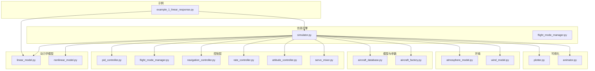
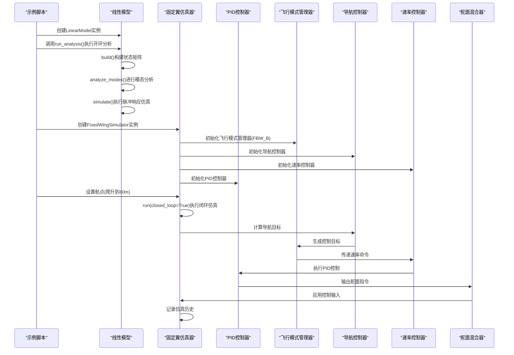
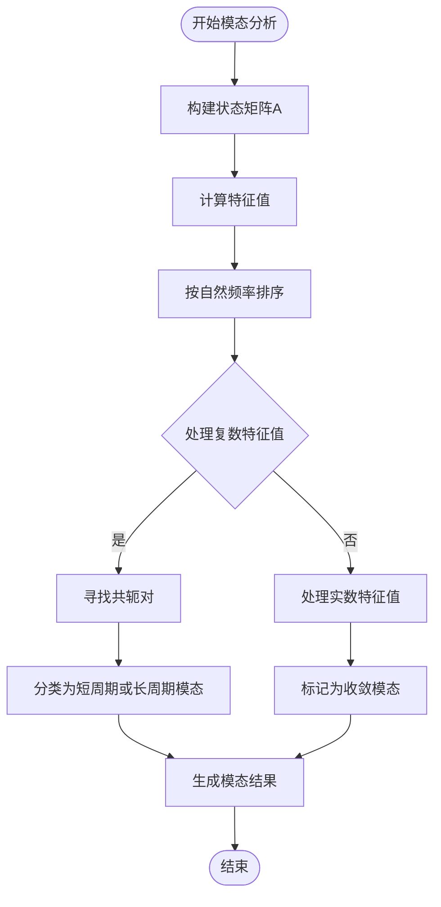
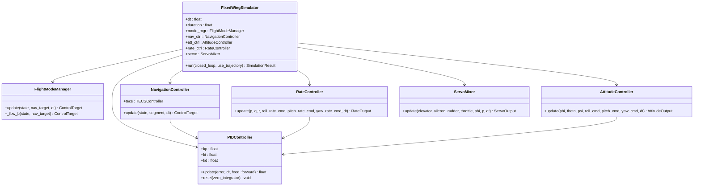
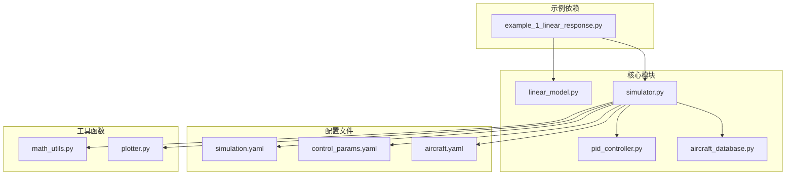

# 基础线性响应分析

<cite>
**本文引用的文件**
- [example_1_linear_response.py](file://examples/example_1_linear_response.py)
- [linear_model.py](file://src/dynamics/linear_model.py)
- [simulator.py](file://src/simulation/simulator.py)
- [aircraft_database.py](file://src/models/aircraft_database.py)
- [simulation.yaml](file://config/simulation.yaml)
- [control_params.yaml](file://config/control_params.yaml)
- [pid_controller.py](file://src/control/pid_controller.py)
- [plotter.py](file://src/visualization/plotter.py)
- [math_utils.py](file://src/utils/math_utils.py)
</cite>

## 目录
1. [简介](#简介)
2. [项目结构](#项目结构)
3. [核心组件](#核心组件)
4. [架构概览](#架构概览)
5. [详细组件分析](#详细组件分析)
6. [依赖关系分析](#依赖关系分析)
7. [性能考虑](#性能考虑)
8. [故障排除指南](#故障排除指南)
9. [结论](#结论)
10. [附录](#附录)

## 简介
本文件为FixedWingSimulator的基础线性响应分析示例提供详细的文档说明。该示例演示了四自由度（4-DOF）线性模型的脉冲响应分析，并与FBW_B模式下的闭环PID控制系统进行对比分析。通过该示例，用户可以深入理解：
- 开环模态分析（短周期模态和长周期模态）的实现原理与物理意义
- 4-DOF线性模型的数学建模过程
- 固定翼飞机在不同控制模式下的动态响应特性
- 示例中的参数设置、仿真配置和结果解读方法
- 如何从CSV数据中提取关键信息并生成对比图表

## 项目结构
FixedWingSimulator采用模块化设计，主要包含以下关键目录和文件：
- examples：示例脚本，包含线性响应分析示例
- src/dynamics：动力学模型实现（线性模型、非线性模型等）
- src/simulation：主仿真引擎
- src/control：控制层实现（PID控制器、飞行模式管理等）
- src/models：飞机参数数据库
- config：配置文件（仿真参数、控制参数等）
- output：输出目录（CSV数据和图表）

**图表来源**
- [example_1_linear_response.py](file://examples/example_1_linear_response.py#L1-L206)
- [simulator.py](file://src/simulation/simulator.py#L1-L642)
- [linear_model.py](file://src/dynamics/linear_model.py#L1-L319)

**章节来源**
- [example_1_linear_response.py](file://examples/example_1_linear_response.py#L1-L206)
- [simulator.py](file://src/simulation/simulator.py#L1-L642)

## 核心组件
本示例涉及以下核心组件：

### 1. 线性模型（LinearModel）
- 实现四自由度纵向线性化状态空间模型
- 提供模态分析功能，识别短周期模态和长周期模态
- 支持脉冲响应仿真

### 2. 固定翼仿真器（FixedWingSimulator）
- 主仿真引擎，支持开环和闭环仿真
- 实现FBW_B飞行模式（高度保持+空速保持）
- 集成ArduPilot兼容的五层控制链

### 3. PID控制器
- 通用PID控制器，具备抗饱和机制
- 支持一阶导数低通滤波
- 用于闭环控制系统的实现

### 4. 飞行模式管理器
- 管理不同的飞行模式
- FBW_B模式下实现高度保持和空速保持

**章节来源**
- [linear_model.py](file://src/dynamics/linear_model.py#L107-L319)
- [simulator.py](file://src/simulation/simulator.py#L115-L642)
- [pid_controller.py](file://src/control/pid_controller.py#L17-L117)

## 架构概览
示例程序展示了从线性模型到闭环控制的完整分析流程：

**图表来源**
- [example_1_linear_response.py](file://examples/example_1_linear_response.py#L88-L206)
- [simulator.py](file://src/simulation/simulator.py#L130-L567)

## 详细组件分析

### 线性模型分析
线性模型实现了四自由度纵向线性化状态空间模型，状态向量为[u_p, α, q, θ]，其中：
- u_p：前进速度扰动（归一化）
- α：攻角扰动（弧度）
- q：俯仰角速度（rad/s）
- θ：俯仰角扰动（弧度）

#### 模态分析实现
模态分析通过特征值分解识别系统的主要动态模式：

**图表来源**
- [linear_model.py](file://src/dynamics/linear_model.py#L206-L252)

#### 短周期模态与长周期模态
- **短周期模态**：高频、快速衰减的俯仰振动，主要由气动阻尼和惯性力平衡决定
- **长周期模态**：低频、缓慢衰减的振荡，涉及速度-高度耦合关系

**章节来源**
- [linear_model.py](file://src/dynamics/linear_model.py#L30-L252)

### 闭环PID控制系统
FBW_B模式下的闭环控制系统包含以下层次：

**图表来源**
- [simulator.py](file://src/simulation/simulator.py#L115-L642)
- [pid_controller.py](file://src/control/pid_controller.py#L17-L117)

**章节来源**
- [simulator.py](file://src/simulation/simulator.py#L174-L233)
- [pid_controller.py](file://src/control/pid_controller.py#L17-L117)

### 示例执行流程
示例程序执行三个主要部分：

#### 第一部分：开环线性分析
- 使用LinearModel.run_analysis()执行脉冲响应分析
- 分析短周期和长周期模态
- 保存开环响应数据到CSV文件

#### 第二部分：闭环PID步进响应
- 设置FBW_B飞行模式（高度保持+空速保持）
- 添加航点：从当前高度爬升到80米
- 执行闭环仿真，记录控制响应

#### 第三部分：结果对比与可视化
- 绘制开环与闭环响应对比图
- 保存图表到PNG文件
- 分析最大俯仰角和最终高度

**章节来源**
- [example_1_linear_response.py](file://examples/example_1_linear_response.py#L88-L206)

## 依赖关系分析

**图表来源**
- [example_1_linear_response.py](file://examples/example_1_linear_response.py#L30-L36)
- [simulator.py](file://src/simulation/simulator.py#L33-L52)

**章节来源**
- [example_1_linear_response.py](file://examples/example_1_linear_response.py#L30-L36)
- [simulator.py](file://src/simulation/simulator.py#L33-L52)

## 性能考虑
- **数值积分精度**：使用solve_ivp求解微分方程，相对容差1e-6，绝对容差1e-6
- **采样频率**：dt=0.01秒，确保足够的时间分辨率
- **内存管理**：使用NumPy数组进行高效数值计算
- **并行处理**：示例脚本使用多进程并行处理不同参数组合

## 故障排除指南

### 常见问题及解决方案

#### 1. 线性模型不稳定
**症状**：模态分析显示负实部特征值过大
**原因**：飞机参数设置不当或飞行条件超出设计范围
**解决方法**：
- 检查飞机参数数据库中的稳定性边界
- 调整飞行速度或高度条件
- 验证气动导数的合理性

#### 2. 闭环控制不收敛
**症状**：高度或空速响应出现持续振荡
**原因**：PID参数设置不当
**解决方法**：
- 调整比例、积分、微分增益
- 检查积分饱和保护设置
- 验证控制目标的合理性

#### 3. 数据保存失败
**症状**：CSV文件无法保存
**原因**：权限不足或路径不存在
**解决方法**：
- 确保输出目录存在且有写权限
- 检查磁盘空间是否充足
- 验证文件名格式正确

#### 4. 图表生成错误
**症状**：PNG文件生成失败
**原因**：Matplotlib后端配置问题
**解决方法**：
- 确保使用Agg后端进行无GUI渲染
- 检查matplotlib版本兼容性
- 验证绘图数据格式正确

**章节来源**
- [example_1_linear_response.py](file://examples/example_1_linear_response.py#L58-L81)
- [simulator.py](file://src/simulation/simulator.py#L558-L562)

## 结论
本示例成功展示了FixedWingSimulator在固定翼飞机线性响应分析方面的强大能力。通过开环模态分析和闭环PID控制对比，用户可以深入理解：
- 线性模型的数学基础和物理意义
- 不同控制模式对系统动态特性的影响
- 从理论分析到实际应用的完整流程
- 数据驱动的系统评估方法

该示例为后续更复杂的飞行控制研究奠定了坚实基础。

## 附录

### 参数设置说明
- **仿真参数**：dt=0.01秒，duration=15秒
- **飞机参数**：TB2型号，基于aircraft_database.py中的标准参数
- **控制参数**：来自control_params.yaml的PID增益设置
- **风场设置**：NONE模式，避免外部干扰

### 数据输出格式
- **CSV文件**：包含时间戳、状态变量、控制输入等
- **图表文件**：PNG格式，包含对比分析图
- **控制台输出**：模态分析摘要和统计信息

### 扩展应用
该示例可扩展应用于：
- 多种飞行器类型的对比分析
- 不同飞行条件下的系统性能评估
- 控制参数优化和调参辅助工具
- 飞行测试前的虚拟验证平台