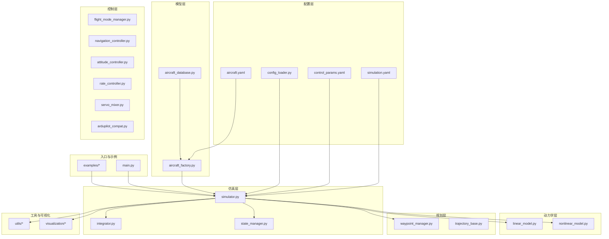
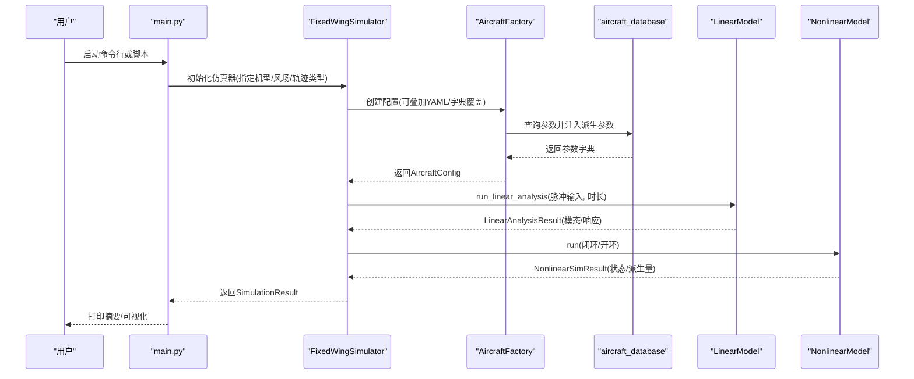
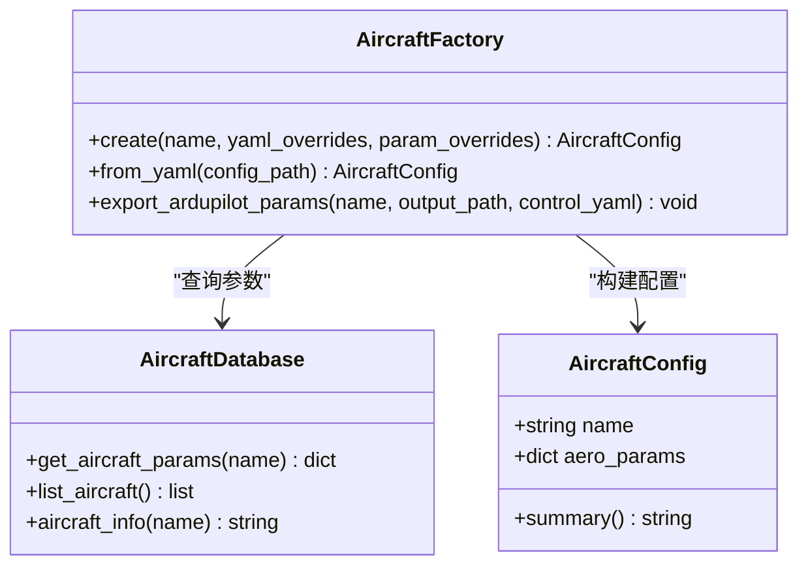
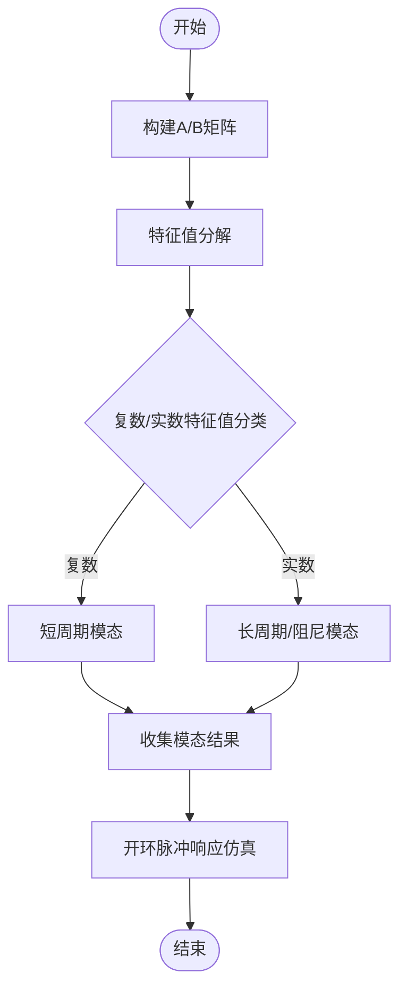
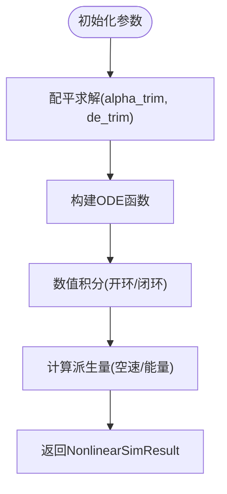
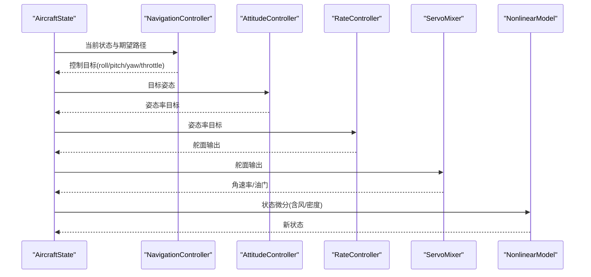
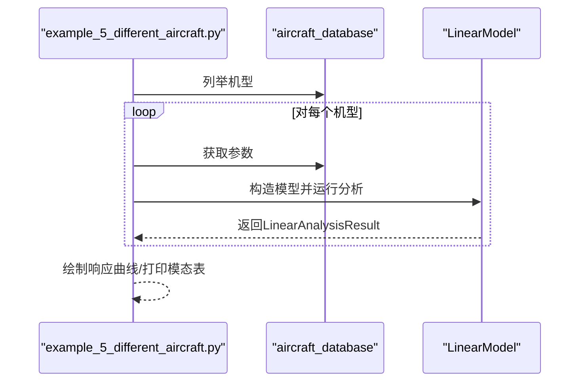
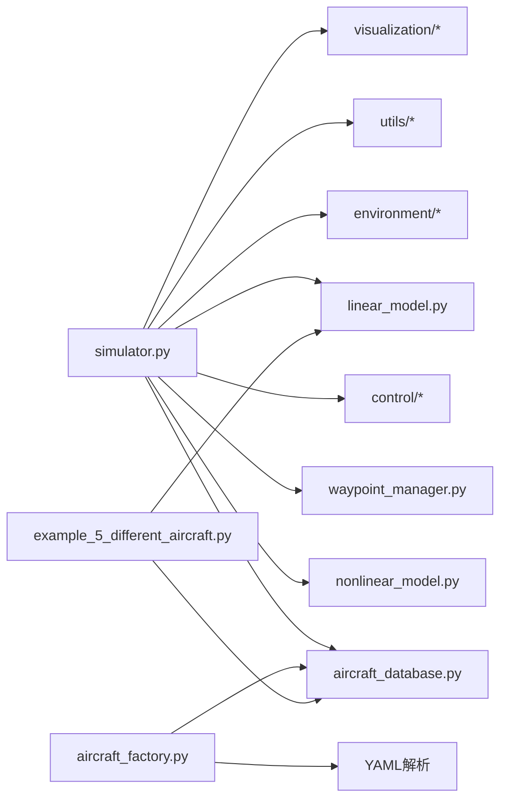

# 多飞机对比分析

<cite>
**本文档引用的文件**
- [README.md](file://README.md)
- [aircraft_database.py](file://src/models/aircraft_database.py)
- [aircraft_factory.py](file://src/models/aircraft_factory.py)
- [example_5_different_aircraft.py](file://examples/example_5_different_aircraft.py)
- [linear_model.py](file://src/dynamics/linear_model.py)
- [nonlinear_model.py](file://src/dynamics/nonlinear_model.py)
- [simulator.py](file://src/simulation/simulator.py)
- [simulation.yaml](file://config/simulation.yaml)
- [control_params.yaml](file://config/control_params.yaml)
- [config_loader.py](file://src/utils/config_loader.py)
- [waypoint_manager.py](file://src/planning/waypoint_manager.py)
- [main.py](file://main.py)
</cite>

## 目录
1. [简介](#简介)
2. [项目结构](#项目结构)
3. [核心组件](#核心组件)
4. [架构总览](#架构总览)
5. [详细组件分析](#详细组件分析)
6. [依赖关系分析](#依赖关系分析)
7. [性能考量](#性能考量)
8. [故障排查指南](#故障排查指南)
9. [结论](#结论)
10. [附录](#附录)

## 简介
本文件面向FixedWingSimulator的多飞机对比分析场景，系统化阐述如何基于飞机数据库与仿真引擎进行跨机型参数对比、性能预测与统一评估。文档覆盖以下关键目标：
- 解释不同飞机配置的关键参数差异（翼展、机翼面积、空重、发动机功率等）及其对性能的影响
- 说明飞机数据库的使用方法（参数查询、配置加载、ArduPilot参数导出）
- 展示在相同飞行条件下不同飞机的表现差异（起飞性能、巡航效率、机动能力、安全性指标）
- 提供完整的代码解析（多机配置的批量处理、性能指标的统一评估与对比分析方法）
- 给出基于任务需求的选型决策框架与最佳实践建议

## 项目结构
FixedWingSimulator采用模块化分层设计：模型层负责参数与工厂；动力学层提供线性/非线性模型；控制层实现ArduPilot兼容控制链；规划层管理航路点与轨迹；仿真层整合各模块并提供运行接口；配置层提供YAML配置加载与合并；示例与输出目录用于演示与可视化。

图表来源
- [simulator.py](file://src/simulation/simulator.py#L1-L642)
- [aircraft_database.py](file://src/models/aircraft_database.py#L1-L183)
- [aircraft_factory.py](file://src/models/aircraft_factory.py#L1-L136)
- [linear_model.py](file://src/dynamics/linear_model.py#L1-L319)
- [nonlinear_model.py](file://src/dynamics/nonlinear_model.py#L1-L386)
- [waypoint_manager.py](file://src/planning/waypoint_manager.py#L1-L208)
- [config_loader.py](file://src/utils/config_loader.py#L1-L82)
- [main.py](file://main.py#L1-L145)

章节来源
- [README.md](file://README.md)
- [main.py](file://main.py#L1-L145)

## 核心组件
- 飞机数据库与工厂
  - 数据库提供完整参数字典，包含几何/惯性、气动系数、ArduPilot默认参数等字段，并注入派生参数（如音速、密度、动态压强等）
  - 工厂支持从数据库加载、YAML覆盖与字典覆盖，生成统一的配置对象
- 动力学模型
  - 线性模型：4自由度纵向线性化状态空间，支持模态分析与开环脉冲响应
  - 非线性模型：6自由度全非线性方程，支持配平求解与开环/闭环仿真
- 控制系统
  - ArduPilot兼容控制链：导航控制器、姿态/速率控制器、舵面混合器
- 规划与仿真
  - 航路点管理与轨迹生成（最小Snap/最小Jerk），仿真引擎整合控制与环境
- 配置与示例
  - YAML配置加载与合并，示例展示多机对比分析流程

章节来源
- [aircraft_database.py](file://src/models/aircraft_database.py#L143-L183)
- [aircraft_factory.py](file://src/models/aircraft_factory.py#L39-L136)
- [linear_model.py](file://src/dynamics/linear_model.py#L107-L319)
- [nonlinear_model.py](file://src/dynamics/nonlinear_model.py#L104-L386)
- [simulator.py](file://src/simulation/simulator.py#L115-L642)
- [config_loader.py](file://src/utils/config_loader.py#L59-L82)
- [waypoint_manager.py](file://src/planning/waypoint_manager.py#L20-L208)

## 架构总览
下图展示了多飞机对比分析的端到端流程：从配置加载、参数注入、线性/非线性分析到结果汇总与可视化。

图表来源
- [main.py](file://main.py#L98-L141)
- [simulator.py](file://src/simulation/simulator.py#L115-L642)
- [aircraft_factory.py](file://src/models/aircraft_factory.py#L39-L136)
- [aircraft_database.py](file://src/models/aircraft_database.py#L143-L183)
- [linear_model.py](file://src/dynamics/linear_model.py#L312-L319)
- [nonlinear_model.py](file://src/dynamics/nonlinear_model.py#L287-L386)

## 详细组件分析

### 飞机数据库与工厂
- 数据库字段与派生参数
  - 关键几何与惯性：质量(mass)、机翼面积(S)、平均弦长(c)、翼展(b)、转动惯量(ixx, iyy, izz, ixz)
  - 气动系数：纵向(CX, CZ, Cm)，横向(CY, Cl, Cn)等
  - 派生参数：音速A_SOUND、海平面密度RHO0、动态压强q_bar、参考速度U0=Mach*A_SOUND
- 工厂配置流程
  - 从数据库读取参数，应用YAML覆盖（支持嵌套/扁平两种格式），再叠加字典覆盖
  - 导出ArduPilot参数：质量、机翼面积/展长/平均弦长、转动惯量、巡航空速等

图表来源
- [aircraft_factory.py](file://src/models/aircraft_factory.py#L15-L136)
- [aircraft_database.py](file://src/models/aircraft_database.py#L143-L183)

章节来源
- [aircraft_database.py](file://src/models/aircraft_database.py#L29-L183)
- [aircraft_factory.py](file://src/models/aircraft_factory.py#L39-L136)

### 线性模型与模态分析
- 状态空间与输入
  - 状态：前向扰度、攻角、俯仰速率、俯仰角
  - 输入：节流、升降舵偏角
- 分析流程
  - 构建A/B矩阵，计算特征值，识别短周期、长周期与阻尼模态
  - 开环脉冲响应：对升降舵阶跃输入进行时域仿真
- 结果容器
  - 包含时间序列、状态历史、模态列表、A/B矩阵与参考空速U0

图表来源
- [linear_model.py](file://src/dynamics/linear_model.py#L129-L252)
- [linear_model.py](file://src/dynamics/linear_model.py#L258-L319)

章节来源
- [linear_model.py](file://src/dynamics/linear_model.py#L107-L319)

### 非线性模型与配平
- 配平求解
  - 在水平平飞条件下求解攻角与升降舵配平，确保升力平衡
- 方程形式
  - 6自由度非线性ODE，包含气动力、推力、重力与欧拉角运动学
- 派生量
  - 计算空速、攻角、侧滑角、动能与位能等派生量，便于性能评估

图表来源
- [nonlinear_model.py](file://src/dynamics/nonlinear_model.py#L132-L154)
- [nonlinear_model.py](file://src/dynamics/nonlinear_model.py#L160-L281)
- [nonlinear_model.py](file://src/dynamics/nonlinear_model.py#L287-L386)

章节来源
- [nonlinear_model.py](file://src/dynamics/nonlinear_model.py#L104-L386)

### 仿真引擎与控制链
- 控制链路
  - 导航控制器(L1/TECS)、姿态/速率控制器、舵面混合器
  - 支持多种飞行模式（手动、稳定、全手动、自动、盘旋、返航）
- 仿真循环
  - 将控制目标转换为舵面输出，结合风场与密度变化进行6自由度积分
  - 记录状态历史与控制量，生成可视化与摘要

图表来源
- [simulator.py](file://src/simulation/simulator.py#L410-L567)
- [nonlinear_model.py](file://src/dynamics/nonlinear_model.py#L160-L281)

章节来源
- [simulator.py](file://src/simulation/simulator.py#L115-L642)

### 多飞机对比分析示例
- 示例流程
  - 遍历所有可用机型，加载参数，构建线性模型，施加相同的升降舵脉冲，记录模态与响应
  - 可视化不同机型的俯仰速率与角度响应，打印短周期模态稳定性与阻尼比
- 批量处理要点
  - 使用统一的脉冲输入与仿真时长，保证对比公平性
  - 通过结果容器的统一接口进行数据提取与比较

图表来源
- [example_5_different_aircraft.py](file://examples/example_5_different_aircraft.py#L24-L64)
- [aircraft_database.py](file://src/models/aircraft_database.py#L169-L172)
- [linear_model.py](file://src/dynamics/linear_model.py#L312-L319)

章节来源
- [example_5_different_aircraft.py](file://examples/example_5_different_aircraft.py#L1-L65)

## 依赖关系分析
- 模块耦合
  - simulator依赖models(参数)、dynamics(6DOF)、control(控制链)、planning(轨迹)、environment(风/大气)、utils(配置)、visualization(绘图)
  - aircraft_factory依赖aircraft_database与YAML解析
  - linear_model与nonlinear_model均依赖aircraft_database提供的参数字典
- 外部依赖
  - NumPy/SciPy用于数值计算与积分
  - Matplotlib用于结果可视化（示例中）

图表来源
- [simulator.py](file://src/simulation/simulator.py#L33-L52)
- [aircraft_factory.py](file://src/models/aircraft_factory.py#L12-L12)
- [example_5_different_aircraft.py](file://examples/example_5_different_aircraft.py#L18-L19)

章节来源
- [simulator.py](file://src/simulation/simulator.py#L1-L642)
- [aircraft_factory.py](file://src/models/aircraft_factory.py#L1-L136)
- [example_5_different_aircraft.py](file://examples/example_5_different_aircraft.py#L1-L65)

## 性能考量
- 线性分析
  - 适用于快速模态比较与稳定性判据（阻尼比ζ、自然频率ωn）
  - 适合在相同脉冲输入下进行跨机型对比
- 非线性仿真
  - 更贴近真实飞行，适合评估配平、轨迹跟踪与闭环控制性能
  - 计算成本更高，需合理设置步长与积分精度
- 风场与密度
  - 风场影响轨迹跟踪与能耗；密度随海拔变化影响气动与推力
- 可视化与日志
  - 输出CSV与图像便于后续离线分析与报告生成

## 故障排查指南
- 机型名称错误
  - 现象：初始化时报错提示未知机型
  - 处理：检查AIRCRAFT_NAMES与传入名称是否一致
- 配置文件缺失
  - 现象：找不到配置文件导致默认值覆盖
  - 处理：确认config目录存在且文件名正确
- 积分失败
  - 现象：数值积分报错
  - 处理：检查初始条件、控制输入幅值与风场设置，适当减小步长
- 模态不稳定
  - 现象：短周期阻尼比为负
  - 处理：调整控制参数或检查气动系数合理性

章节来源
- [simulator.py](file://src/simulation/simulator.py#L140-L141)
- [config_loader.py](file://src/utils/config_loader.py#L40-L45)
- [simulator.py](file://src/simulation/simulator.py#L558-L562)
- [linear_model.py](file://src/dynamics/linear_model.py#L30-L54)

## 结论
通过飞机数据库与工厂的参数统一注入、线性/非线性模型的对比分析以及仿真引擎的闭环/开环运行，FixedWingSimulator能够高效完成多飞机对比分析。建议在实际工程中：
- 明确任务目标（续航、载荷、机动、安全）并据此筛选机型
- 使用线性分析快速评估稳定性与模态特性，再用非线性仿真验证闭环性能
- 建立标准化的参数覆盖与导出流程，确保跨机型一致性
- 结合可视化与日志输出，形成可追溯的评估报告

## 附录

### 飞机数据库参数概览（关键字段）
- 幾何/惯性：质量、机翼面积、平均弦长、翼展、转动惯量
- 气动系数：纵向升/阻/力矩系数及导数，横向侧力/力矩系数及导数
- 派生参数：音速、密度、动态压强、参考空速

章节来源
- [aircraft_database.py](file://src/models/aircraft_database.py#L29-L133)

### 多机对比分析方法与指标
- 线性分析指标
  - 短周期阻尼比ζ、自然频率ωn、稳定性判定
  - 升降舵阶跃响应（俯仰速率/角度）
- 非线性仿真指标
  - 配平攻角与升降舵配平值
  - 空速、高度、轨迹跟踪误差
  - 能量（动能/势能）变化趋势
- 可视化建议
  - 响应曲线叠加对比、模态表格、轨迹2D/3D图

章节来源
- [linear_model.py](file://src/dynamics/linear_model.py#L30-L104)
- [nonlinear_model.py](file://src/dynamics/nonlinear_model.py#L54-L102)
- [example_5_different_aircraft.py](file://examples/example_5_different_aircraft.py#L35-L64)

### 配置与参数导出
- YAML配置加载与合并
  - 支持分层深度合并，优先级：字典覆盖 > YAML覆盖 > 默认值
- ArduPilot参数导出
  - 导出质量、机翼面积/展长/平均弦长、转动惯量、巡航空速等参数

章节来源
- [config_loader.py](file://src/utils/config_loader.py#L48-L82)
- [aircraft_factory.py](file://src/models/aircraft_factory.py#L95-L136)

### 任务驱动的选型决策框架
- 载荷能力
  - 依据质量与升力要求评估最大有效载荷
- 续航时间
  - 依据推重比与气动效率估算续航
- 操作复杂度
  - 依据稳定性与控制参数设定难度
- 安全性指标
  - 短周期阻尼比、长周期模态阻尼、最大过载与失速裕度

章节来源
- [nonlinear_model.py](file://src/dynamics/nonlinear_model.py#L132-L154)
- [linear_model.py](file://src/dynamics/linear_model.py#L206-L252)