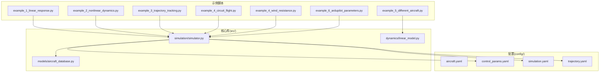
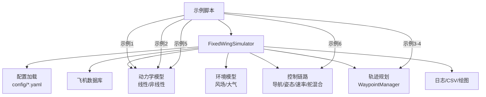
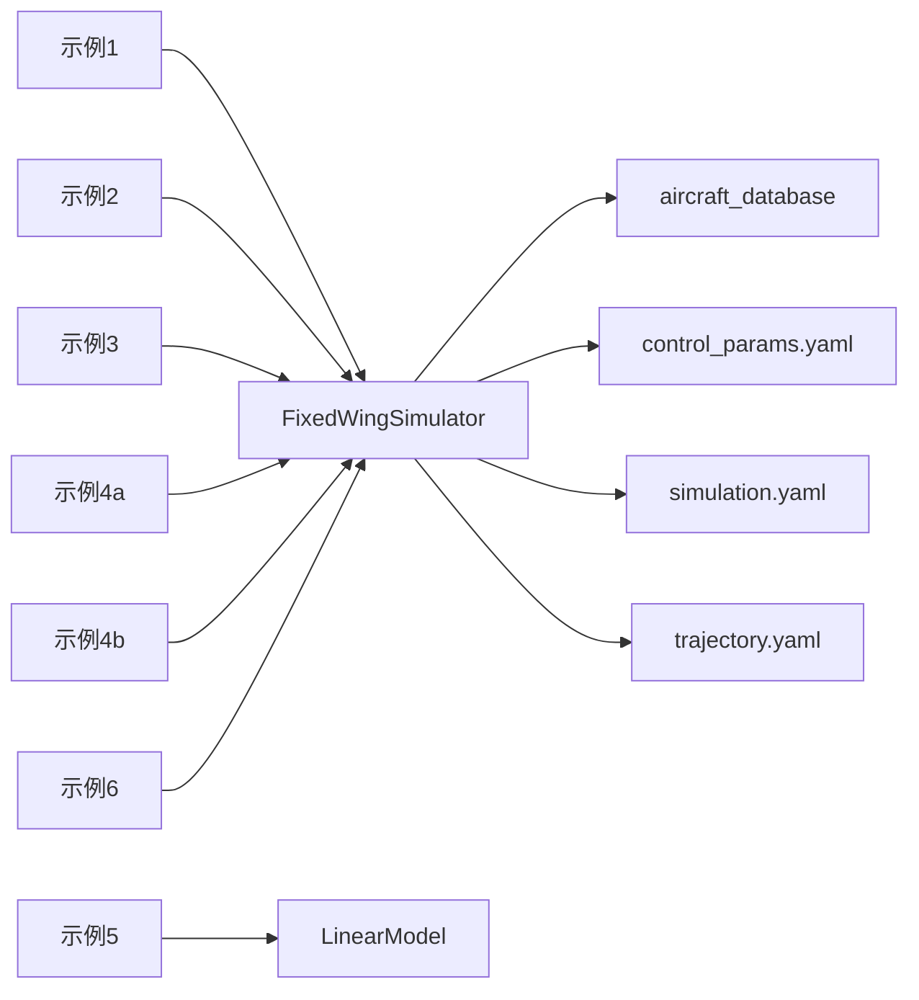

# 示例教程

<cite>
**本文引用的文件**
- [examples/example_1_linear_response.py](file://examples/example_1_linear_response.py)
- [examples/example_2_nonlinear_dynamics.py](file://examples/example_2_nonlinear_dynamics.py)
- [examples/example_3_trajectory_tracking.py](file://examples/example_3_trajectory_tracking.py)
- [examples/example_4_circuit_flight.py](file://examples/example_4_circuit_flight.py)
- [examples/example_4_wind_resistance.py](file://examples/example_4_wind_resistance.py)
- [examples/example_5_different_aircraft.py](file://examples/example_5_different_aircraft.py)
- [examples/example_6_ardupilot_parameters.py](file://examples/example_6_ardupilot_parameters.py)
- [src/simulation/simulator.py](file://src/simulation/simulator.py)
- [src/dynamics/linear_model.py](file://src/dynamics/linear_model.py)
- [src/models/aircraft_database.py](file://src/models/aircraft_database.py)
- [config/aircraft.yaml](file://config/aircraft.yaml)
- [config/control_params.yaml](file://config/control_params.yaml)
- [config/simulation.yaml](file://config/simulation.yaml)
- [config/trajectory.yaml](file://config/trajectory.yaml)
</cite>

## 目录
1. [简介](#简介)
2. [项目结构](#项目结构)
3. [核心组件](#核心组件)
4. [架构总览](#架构总览)
5. [详细示例解析与实践指南](#详细示例解析与实践指南)
6. [依赖关系分析](#依赖关系分析)
7. [性能与参数建议](#性能与参数建议)
8. [故障排查与调试](#故障排查与调试)
9. [结论](#结论)
10. [附录：参数速查与扩展建议](#附录参数速查与扩展建议)

## 简介
本教程面向希望系统掌握 FixedWingSimulator 的用户，围绕官方提供的7个示例脚本，提供从线性模态分析到复杂飞行任务的循序渐进学习路径。你将学会：
- 如何运行每个示例、配置参数、解读结果；
- 如何在单机仿真与多机对比之间切换；
- 如何基于 ArduPilot 控制参数进行调参与导出；
- 如何扩展与定制示例，开展二次开发。

## 项目结构
示例脚本位于 examples/ 目录，核心仿真引擎与模型位于 src/，配置文件位于 config/。输出结果默认保存在项目根目录的 output/ 下，包含 CSV 数据与 PNG 图像。

图表来源
- [examples/example_1_linear_response.py](file://examples/example_1_linear_response.py#L1-L206)
- [examples/example_2_nonlinear_dynamics.py](file://examples/example_2_nonlinear_dynamics.py#L1-L215)
- [examples/example_3_trajectory_tracking.py](file://examples/example_3_trajectory_tracking.py#L1-L194)
- [examples/example_4_circuit_flight.py](file://examples/example_4_circuit_flight.py#L1-L275)
- [examples/example_4_wind_resistance.py](file://examples/example_4_wind_resistance.py#L1-L52)
- [examples/example_5_different_aircraft.py](file://examples/example_5_different_aircraft.py#L1-L65)
- [examples/example_6_ardupilot_parameters.py](file://examples/example_6_ardupilot_parameters.py#L1-L85)
- [src/simulation/simulator.py](file://src/simulation/simulator.py#L1-L200)
- [src/dynamics/linear_model.py](file://src/dynamics/linear_model.py#L1-L200)
- [src/models/aircraft_database.py](file://src/models/aircraft_database.py#L1-L183)
- [config/aircraft.yaml](file://config/aircraft.yaml#L1-L13)
- [config/control_params.yaml](file://config/control_params.yaml#L1-L45)
- [config/simulation.yaml](file://config/simulation.yaml#L1-L30)
- [config/trajectory.yaml](file://config/trajectory.yaml#L1-L23)

章节来源
- [examples/example_1_linear_response.py](file://examples/example_1_linear_response.py#L1-L206)
- [examples/example_2_nonlinear_dynamics.py](file://examples/example_2_nonlinear_dynamics.py#L1-L215)
- [examples/example_3_trajectory_tracking.py](file://examples/example_3_trajectory_tracking.py#L1-L194)
- [examples/example_4_circuit_flight.py](file://examples/example_4_circuit_flight.py#L1-L275)
- [examples/example_4_wind_resistance.py](file://examples/example_4_wind_resistance.py#L1-L52)
- [examples/example_5_different_aircraft.py](file://examples/example_5_different_aircraft.py#L1-L65)
- [examples/example_6_ardupilot_parameters.py](file://examples/example_6_ardupilot_parameters.py#L1-L85)
- [src/simulation/simulator.py](file://src/simulation/simulator.py#L1-L200)
- [src/dynamics/linear_model.py](file://src/dynamics/linear_model.py#L1-L200)
- [src/models/aircraft_database.py](file://src/models/aircraft_database.py#L1-L183)
- [config/aircraft.yaml](file://config/aircraft.yaml#L1-L13)
- [config/control_params.yaml](file://config/control_params.yaml#L1-L45)
- [config/simulation.yaml](file://config/simulation.yaml#L1-L30)
- [config/trajectory.yaml](file://config/trajectory.yaml#L1-L23)

## 核心组件
- 固定翼仿真器 FixedWingSimulator：负责整合飞机参数、环境风场、控制链路、轨迹规划与数值积分，支持开环/闭环运行，并生成状态历史与摘要。
- 线性模型 LinearModel：构建纵向四自由度线性化状态空间，支持脉冲响应与模态分析。
- 飞机数据库 aircraft_database：内置7型无人机参数，提供统一访问接口与派生参数注入。
- 控制参数 ArdupilotParams：加载/校验/导出 ArduPilot 兼容参数，支持热更新。

章节来源
- [src/simulation/simulator.py](file://src/simulation/simulator.py#L115-L200)
- [src/dynamics/linear_model.py](file://src/dynamics/linear_model.py#L107-L200)
- [src/models/aircraft_database.py](file://src/models/aircraft_database.py#L143-L183)

## 架构总览
下图展示示例脚本如何通过 FixedWingSimulator 调用各子系统，以及配置文件对仿真行为的影响。

图表来源
- [src/simulation/simulator.py](file://src/simulation/simulator.py#L1-L200)
- [config/aircraft.yaml](file://config/aircraft.yaml#L1-L13)
- [config/control_params.yaml](file://config/control_params.yaml#L1-L45)
- [config/simulation.yaml](file://config/simulation.yaml#L1-L30)
- [config/trajectory.yaml](file://config/trajectory.yaml#L1-L23)

## 详细示例解析与实践指南

### 示例1：线性响应分析（开环模态 vs 闭环PID）
- 目标：演示线性4-DOF模型的脉冲响应与短周期/长周期模态；对比开环与闭环（FBW_B）下的俯仰角与俯仰速率响应。
- 关键步骤
  - 加载飞机参数并构建线性模型，施加升降舵阶跃输入，执行开环分析并保存CSV与图像。
  - 使用 FixedWingSimulator 在 FBW_B 模式下运行闭环仿真，记录高度、俯仰角、俯仰速率与舵面偏角。
  - 对比开环与闭环曲线，观察闭环控制器对短周期与稳态误差的抑制效果。
- 运行方法
  - 直接运行脚本，默认保存至 output/data 与 output/figures。
- 关键参数
  - dt、duration、initial_mode、wind_type、轨迹类型等由脚本内部设定；可通过修改脚本中的参数字典或复制到新脚本进行实验。
- 结果解读
  - 开环CSV包含时间、空速扰量、攻角、俯仰速率、俯仰角与升降舵偏角；闭环CSV包含完整状态通道。
  - 图像中应看到闭环在阶跃高度指令下更快达到目标高度，且俯仰角超调较小。
- 学习要点
  - 线性模型用于快速评估稳定性与模态特性；闭环仿真验证实际控制性能。

章节来源
- [examples/example_1_linear_response.py](file://examples/example_1_linear_response.py#L1-L206)
- [src/dynamics/linear_model.py](file://src/dynamics/linear_model.py#L57-L105)
- [src/simulation/simulator.py](file://src/simulation/simulator.py#L59-L110)

### 示例2：非线性动力学（开环脉冲 vs 闭环稳定）
- 目标：展示6-DOF非线性模型的水平面滚转脉冲响应，对比开环与闭环（STABILIZE）的滚转角与滚转速率。
- 关键步骤
  - 计算平飞配平，施加副翼阶跃输入，记录开环响应并保存CSV。
  - 在 STABILIZE 模式下保持100米高度，观察闭环对滚转扰动的抑制能力。
- 运行方法
  - 直接运行脚本，输出保存至 output/。
- 关键参数
  - 飞机名称、仿真步长、持续时间、风场类型、初始模式等在脚本内定义。
- 结果解读
  - 开环滚转角会持续偏转；闭环通过姿态控制迅速回归并抑制扰动。
- 学习要点
  - 非线性仿真更贴近真实飞行，适合验证控制策略在大角度与强耦合下的表现。

章节来源
- [examples/example_2_nonlinear_dynamics.py](file://examples/example_2_nonlinear_dynamics.py#L1-L215)
- [src/simulation/simulator.py](file://src/simulation/simulator.py#L115-L200)

### 示例3：轨迹跟踪（AUTO模式 + 最小急振）
- 目标：TB2在AUTO模式下跟踪方形轨迹，展示三维路径、速度、姿态、控制输入与状态通道。
- 关键步骤
  - 创建 FixedWingSimulator 并设置轨迹类型为 minimum_snap。
  - 定义方形航点列表，运行闭环仿真。
  - 生成位置/速度、姿态/角速率、控制输入与时域图，以及3D轨迹图。
- 运行方法
  - 直接运行脚本，输出保存至 output/。
- 关键参数
  - 航点坐标、仿真时长、轨迹类型、初始模式等在脚本内定义。
- 结果解读
  - 3D轨迹图应闭合成正方形；控制输入应平滑，避免过大抖动。
- 学习要点
  - AUTO模式结合导航控制器与TECS，适合研究路径跟踪与能量管理。

章节来源
- [examples/example_3_trajectory_tracking.py](file://examples/example_3_trajectory_tracking.py#L1-L194)
- [src/simulation/simulator.py](file://src/simulation/simulator.py#L115-L200)

### 示例4：环形航线（AUTO模式 + 航路点序列）
- 目标：TB2按顺序飞越四个航点构成矩形航线，验证L1导航与TECS在连续航段间的切换与稳态保持。
- 关键步骤
  - 定义矩形航路点，设置闭环运行、禁用多项式轨迹，启用循环模式与航路点切换距离。
  - 运行仿真后绘制位置/速度、姿态/角速率、控制输入、地面轨迹与高度/油门曲线。
  - 计算稳态阶段的高度误差指标（均方根、峰值、标准差）。
- 运行方法
  - 直接运行脚本，输出保存至 output/。
- 关键参数
  - 航线尺寸、仿真时长、航路点切换距离、是否循环等在脚本内定义。
- 结果解读
  - 地面轨迹应闭合；稳态阶段高度波动应较小；油门在不同航段间平滑过渡。
- 学习要点
  - 该示例强调航路点序列与导航切换策略，适合评估航路规划与控制链鲁棒性。

章节来源
- [examples/example_4_circuit_flight.py](file://examples/example_4_circuit_flight.py#L1-L275)
- [src/simulation/simulator.py](file://src/simulation/simulator.py#L115-L200)

### 示例4（补充）：风阻抗（FBW_B + 随机正弦风）
- 目标：在FBW_B模式下引入随机正弦风，评估高度与空速保持能力。
- 关键步骤
  - 创建仿真器并选择 RANDOMSINE 风模型，设置航路点以维持直线飞行。
  - 运行闭环仿真，绘制高度与空速随时间变化曲线。
- 运行方法
  - 直接运行脚本，显示图形窗口。
- 关键参数
  - 风类型、风速、风向等在脚本内定义。
- 结果解读
  - 高度与空速应能稳定在参考值附近，体现控制器的抗扰能力。
- 学习要点
  - 该示例直观展示环境扰动对飞行性能的影响。

章节来源
- [examples/example_4_wind_resistance.py](file://examples/example_4_wind_resistance.py#L1-L52)
- [src/simulation/simulator.py](file://src/simulation/simulator.py#L115-L200)

### 示例5：多机型对比（4-DOF线性响应）
- 目标：在同一开环条件下对7种机型施加相同的升降舵脉冲，比较短周期与长周期模态。
- 关键步骤
  - 遍历所有机型，使用 LinearModel 执行脉冲分析，绘制俯仰速率与俯仰角响应曲线。
  - 输出短周期模态对比表（阻尼比、无阻尼频率、稳定状态）。
- 运行方法
  - 直接运行脚本，显示图形窗口。
- 关键参数
  - 脉冲参数、仿真时长在脚本内定义。
- 结果解读
  - 不同机型的短周期阻尼比与自然频率差异明显，反映其纵向稳定性特征。
- 学习要点
  - 通过线性分析快速筛选机型与评估设计裕度。

章节来源
- [examples/example_5_different_aircraft.py](file://examples/example_5_different_aircraft.py#L1-L65)
- [src/dynamics/linear_model.py](file://src/dynamics/linear_model.py#L107-L200)
- [src/models/aircraft_database.py](file://src/models/aircraft_database.py#L143-L183)

### 示例6：ArduPilot参数适配与敏感性
- 目标：加载ArduPilot格式控制参数，调整PID增益，比较不同增益下的爬升跟踪性能。
- 关键步骤
  - 从 YAML 加载控制参数，进行参数校验并导出 ArduPilot .param 文件。
  - 修改某轴增益（如PTCH_P），热重载到控制器，运行闭环仿真并绘制高度与俯仰角曲线。
- 运行方法
  - 直接运行脚本，显示图形窗口。
- 关键参数
  - 控制参数文件路径、增益标签与目标航路点在脚本内定义。
- 结果解读
  - 提高比例增益通常可降低稳态误差但可能增加超调；需权衡稳定性和响应速度。
- 学习要点
  - 该示例展示了从参数导入、校验、导出到在线热更新的完整工作流。

章节来源
- [examples/example_6_ardupilot_parameters.py](file://examples/example_6_ardupilot_parameters.py#L1-L85)
- [src/simulation/simulator.py](file://src/simulation/simulator.py#L115-L200)

## 依赖关系分析
- 示例脚本与核心库的耦合
  - 示例1/2/3/4/4b/6 主要依赖 FixedWingSimulator，间接依赖 aircraft_database 与 control_params。
  - 示例5 仅依赖 LinearModel 与 aircraft_database。
- 配置文件的作用
  - aircraft.yaml 决定默认机型；
  - control_params.yaml 提供ArduPilot风格的控制参数；
  - simulation.yaml 控制仿真步长、时长、初始模式与风场；
  - trajectory.yaml 定义轨迹类型、航路点与循环策略。

图表来源
- [examples/example_1_linear_response.py](file://examples/example_1_linear_response.py#L34-L36)
- [examples/example_2_nonlinear_dynamics.py](file://examples/example_2_nonlinear_dynamics.py#L34-L36)
- [examples/example_3_trajectory_tracking.py](file://examples/example_3_trajectory_tracking.py#L35)
- [examples/example_4_circuit_flight.py](file://examples/example_4_circuit_flight.py#L81-L87)
- [examples/example_4_wind_resistance.py](file://examples/example_4_wind_resistance.py#L21-L28)
- [examples/example_5_different_aircraft.py](file://examples/example_5_different_aircraft.py#L19)
- [examples/example_6_ardupilot_parameters.py](file://examples/example_6_ardupilot_parameters.py#L20-L21)
- [src/simulation/simulator.py](file://src/simulation/simulator.py#L155-L171)
- [config/aircraft.yaml](file://config/aircraft.yaml#L1-L13)
- [config/control_params.yaml](file://config/control_params.yaml#L1-L45)
- [config/simulation.yaml](file://config/simulation.yaml#L1-L30)
- [config/trajectory.yaml](file://config/trajectory.yaml#L1-L23)

## 性能与参数建议
- 时间步长与积分器
  - 默认 dt=0.01s，积分器为 dopri5，适合实时闭环仿真；若进行批处理分析可考虑 rk45。
- 风场设置
  - NONE/FIXED/SINE/RANDOMSINE 适用于不同扰动场景；RANDOMSINE 更贴近真实大气湍流。
- 轨迹类型
  - minimum_snap 适合平滑跟踪；minimum_jerk 适合更严格的加加速度约束。
- 控制参数
  - TECS 类参数（如 TECS_TIME_CONST、TECS_THR_DAMP、TECS_PTCH_DAMP）对稳态与振荡有显著影响；可根据稳态误差与超调进行微调。
- 多机对比
  - 示例5 展示了快速横向对比方法，建议固定输入脉冲与仿真时长以保证可比性。

章节来源
- [config/simulation.yaml](file://config/simulation.yaml#L4-L12)
- [config/control_params.yaml](file://config/control_params.yaml#L30-L44)
- [examples/example_5_different_aircraft.py](file://examples/example_5_different_aircraft.py#L21-L22)

## 故障排查与调试
- 常见问题
  - 无法找到模块：确保示例脚本通过 sys.path 插入了 src 目录。
  - 风场不生效：确认 wind_type 设置与 wind_model 的匹配。
  - 参数未生效：检查 control_params.yaml 路径与参数键名，必要时使用 validate() 校验。
  - 输出目录权限：确保 output/figures 与 output/data 可写。
- 调试技巧
  - 将 initial_mode 设为 MANUAL 或 STABILIZE 快速验证传感器与控制回路。
  - 缩短 duration 与 dt，先验证闭环稳定性再扩大规模。
  - 使用 CSV 导出全状态历史，配合外部工具进行离线分析。
  - 在示例脚本中添加 print(result.summary()) 快速查看最终状态。

章节来源
- [examples/example_1_linear_response.py](file://examples/example_1_linear_response.py#L30-L30)
- [examples/example_4_wind_resistance.py](file://examples/example_4_wind_resistance.py#L21-L28)
- [src/simulation/simulator.py](file://src/simulation/simulator.py#L59-L110)

## 结论
通过这7个示例，你可以从线性模态分析起步，逐步深入到非线性闭环仿真、轨迹跟踪与环形航线、风阻抗测试、多机型对比以及ArduPilot参数适配。建议按照示例顺序逐个完成，理解每个环节的输入、流程与输出，再尝试扩展与定制，开展自己的研究与工程应用。

## 附录：参数速查与扩展建议
- 飞机参数
  - 支持机型：TB2、Anka、Aksungur、Karayel、Predator、Heron MK1、Heron MK2。
  - 可通过 get_aircraft_params(name) 获取完整参数字典。
- 控制参数
  - 包含航路点导航、姿态/速率控制、舵面混合与TECS等模块参数。
  - 可通过 ArdupilotParams.from_yaml()/to_yaml() 进行导入/导出与校验。
- 配置文件
  - aircraft.yaml：选择默认机型与可选覆盖项。
  - simulation.yaml：仿真步长、时长、初始模式、风场与日志开关。
  - trajectory.yaml：轨迹类型、平均速度、航向控制模式与航路点列表。
- 扩展建议
  - 自定义风场：在 environment/wind_model 中扩展新风模型并在 simulation.yaml 中启用。
  - 新增示例：复用 FixedWingSimulator 初始化与 run 流程，替换航路点或控制参数即可。
  - 多机对比：在示例5基础上封装函数，批量运行并合并绘图。
  - 参数敏感性：在示例6基础上扩展更多增益维度，建立参数扫描矩阵。

章节来源
- [src/models/aircraft_database.py](file://src/models/aircraft_database.py#L143-L183)
- [config/aircraft.yaml](file://config/aircraft.yaml#L1-L13)
- [config/control_params.yaml](file://config/control_params.yaml#L1-L45)
- [config/simulation.yaml](file://config/simulation.yaml#L1-L30)
- [config/trajectory.yaml](file://config/trajectory.yaml#L1-L23)
- [examples/example_6_ardupilot_parameters.py](file://examples/example_6_ardupilot_parameters.py#L23-L42)