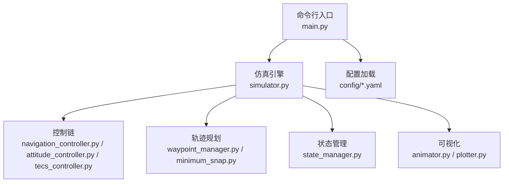
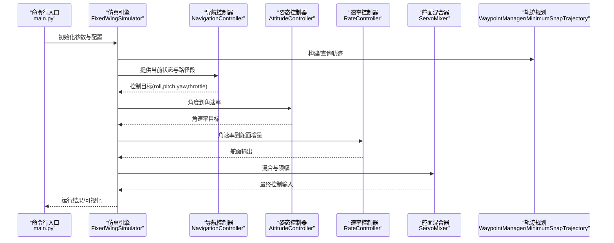
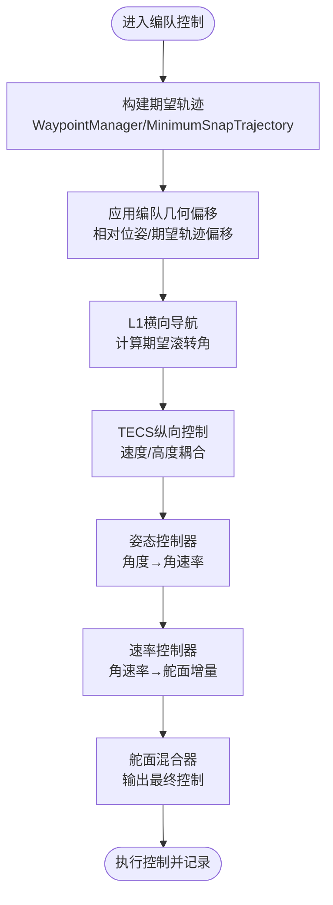
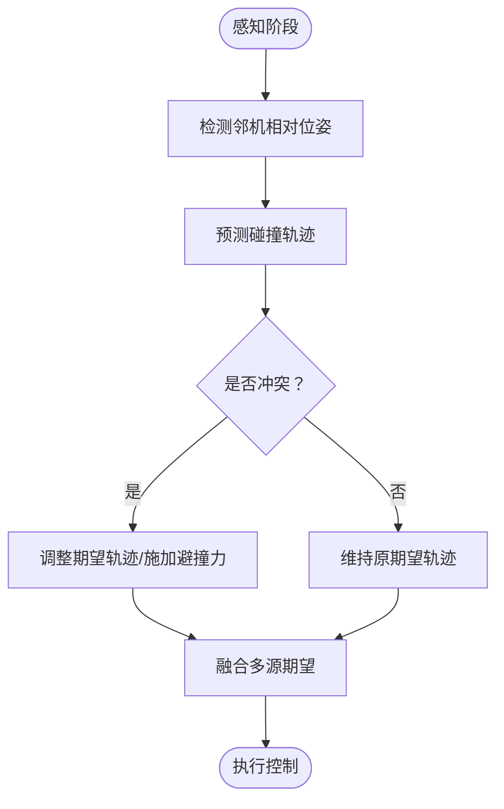
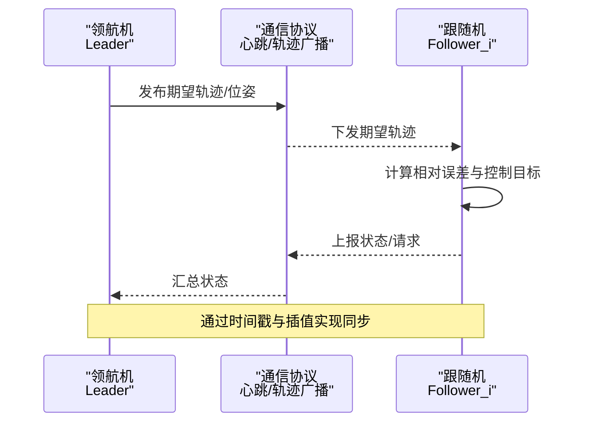
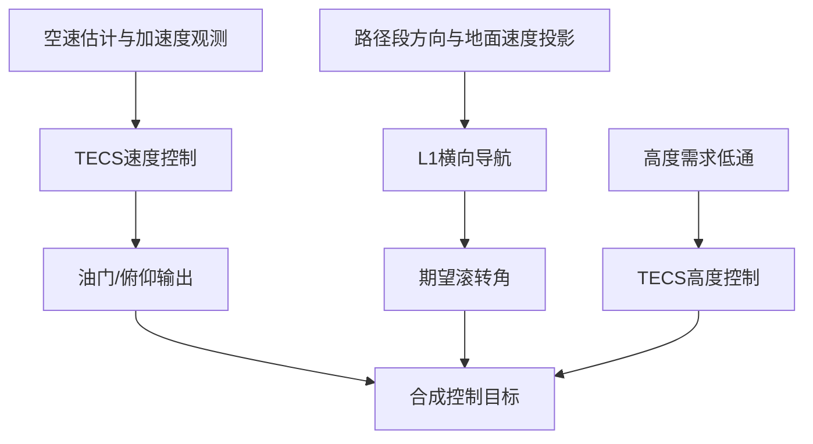
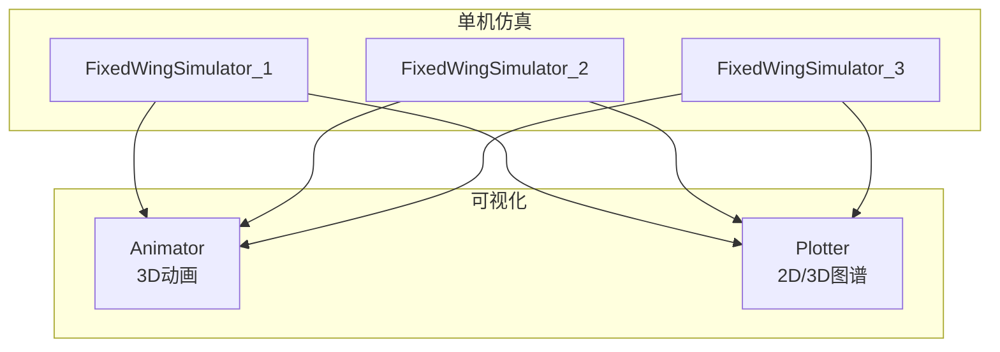
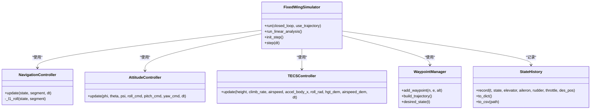
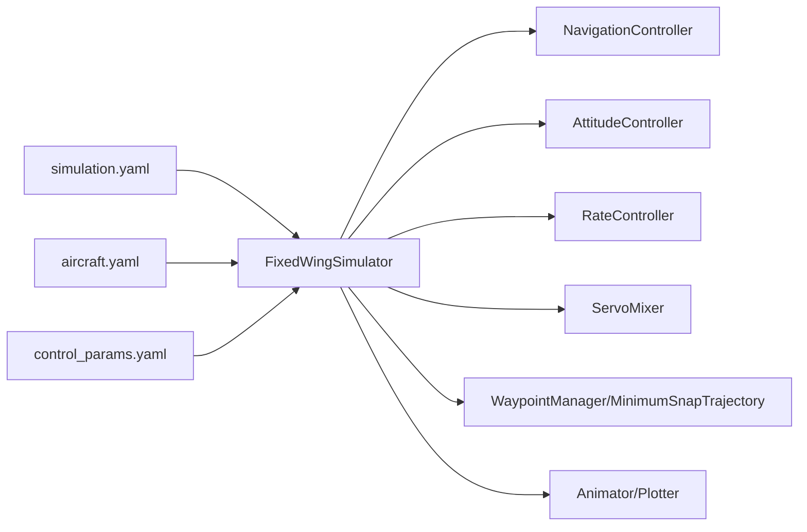

# 编队飞行演示

<cite>
**本文引用的文件**
- [main.py](file://main.py)
- [simulator.py](file://src/simulation/simulator.py)
- [navigation_controller.py](file://src/control/navigation_controller.py)
- [attitude_controller.py](file://src/control/attitude_controller.py)
- [tecs_controller.py](file://src/control/tecs_controller.py)
- [waypoint_manager.py](file://src/planning/waypoint_manager.py)
- [minimum_snap.py](file://src/planning/minimum_snap.py)
- [state_manager.py](file://src/simulation/state_manager.py)
- [animator.py](file://src/visualization/animator.py)
- [plotter.py](file://src/visualization/plotter.py)
- [simulation.yaml](file://config/simulation.yaml)
- [aircraft.yaml](file://config/aircraft.yaml)
- [control_params.yaml](file://config/control_params.yaml)
- [example_3_trajectory_tracking.py](file://examples/example_3_trajectory_tracking.py)
</cite>

## 目录
1. [引言](#引言)
2. [项目结构](#项目结构)
3. [核心组件](#核心组件)
4. [架构总览](#架构总览)
5. [详细组件分析](#详细组件分析)
6. [依赖关系分析](#依赖关系分析)
7. [性能考量](#性能考量)
8. [故障排查指南](#故障排查指南)
9. [结论](#结论)
10. [附录](#附录)

## 引言
本文件面向“FixedWingSimulator”项目的编队飞行演示，系统性阐述多飞机编队飞行的实现原理与工程实践，涵盖以下主题：
- 编队几何构型与相对位置控制
- 避撞算法与动态协调策略
- 多机协同控制：领航机与跟随机的角色分工、通信协议与同步机制
- 动态协调：速度匹配、高度保持、航向对齐
- 多机仿真环境搭建、编队控制算法实现与可视化展示
- 性能评估：编队保持精度、通信延迟影响、系统鲁棒性
- 设计原则与安全考虑

本说明以现有代码库为基础，结合控制链路、轨迹规划与可视化模块，给出可落地的编队飞行实现路径。

## 项目结构
项目采用模块化分层设计，围绕“仿真引擎 + 控制链 + 规划与轨迹 + 环境与模型 + 可视化”的架构组织。关键目录与职责如下：
- config：仿真配置、飞机参数、控制参数、轨迹配置
- src/simulation：仿真主循环、状态管理、积分器
- src/control：飞行模式管理、导航控制器（L1+TECS）、姿态/速率/舵面混合器
- src/planning：航路点管理与轨迹生成（最小Snap/最小Jerk）
- src/visualization：2D/3D可视化与动画
- examples：示例脚本，演示单机轨迹跟踪与AUTO模式运行

图表来源
- [main.py](file://main.py#L98-L145)
- [simulator.py](file://src/simulation/simulator.py#L115-L642)
- [navigation_controller.py](file://src/control/navigation_controller.py#L45-L293)
- [attitude_controller.py](file://src/control/attitude_controller.py#L33-L134)
- [tecs_controller.py](file://src/control/tecs_controller.py#L50-L647)
- [waypoint_manager.py](file://src/planning/waypoint_manager.py#L20-L208)
- [minimum_snap.py](file://src/planning/minimum_snap.py#L167-L253)
- [state_manager.py](file://src/simulation/state_manager.py#L95-L193)
- [animator.py](file://src/visualization/animator.py#L14-L150)
- [plotter.py](file://src/visualization/plotter.py#L19-L244)

章节来源
- [main.py](file://main.py#L1-L145)
- [simulation.yaml](file://config/simulation.yaml#L1-L30)
- [aircraft.yaml](file://config/aircraft.yaml#L1-L13)
- [control_params.yaml](file://config/control_params.yaml#L1-L45)

## 核心组件
- 仿真引擎 FixedWingSimulator：封装控制链、动力学、环境与轨迹，提供闭环/开环运行接口与结果容器
- 导航控制器 NavigationController：L1横向导航 + TECS纵向控制，输出期望滚转角与油门
- 姿态控制器 AttitudeController：角度到角速率的P控制
- TECS控制器 TECSController：总比能量控制，耦合高度/速度，避免积分饱和
- 航路点管理 WaypointManager：NED航路点存储、轨迹构建与活动段查询
- 最小Snap轨迹 MinimumSnapTrajectory：分段多项式轨迹，满足最小Snap连续性
- 状态管理 StateHistory：高效历史记录与导出
- 可视化 Animator/Plotter：3D轨迹动画与2D/3D图谱

章节来源
- [simulator.py](file://src/simulation/simulator.py#L115-L642)
- [navigation_controller.py](file://src/control/navigation_controller.py#L45-L293)
- [attitude_controller.py](file://src/control/attitude_controller.py#L33-L134)
- [tecs_controller.py](file://src/control/tecs_controller.py#L50-L647)
- [waypoint_manager.py](file://src/planning/waypoint_manager.py#L20-L208)
- [minimum_snap.py](file://src/planning/minimum_snap.py#L167-L253)
- [state_manager.py](file://src/simulation/state_manager.py#L95-L193)
- [animator.py](file://src/visualization/animator.py#L14-L150)
- [plotter.py](file://src/visualization/plotter.py#L19-L244)

## 架构总览
编队飞行的实现以“单机控制链路”为基础，扩展为“多机协同控制”。整体流程如下：
- 多机共享统一的航路点/轨迹（WaypointManager/MinimumSnapTrajectory）
- 每架飞机独立运行 FixedWingSimulator，按自身状态与期望轨迹计算控制目标
- 在编队场景中，通过“期望轨迹偏移”或“相对位置约束”形成几何构型
- 通过通信协议交换期望轨迹或相对位姿，实现同步与避撞

图表来源
- [main.py](file://main.py#L98-L145)
- [simulator.py](file://src/simulation/simulator.py#L239-L567)
- [navigation_controller.py](file://src/control/navigation_controller.py#L134-L202)
- [attitude_controller.py](file://src/control/attitude_controller.py#L81-L122)
- [waypoint_manager.py](file://src/planning/waypoint_manager.py#L127-L167)
- [minimum_snap.py](file://src/planning/minimum_snap.py#L227-L249)

## 详细组件分析

### 组件A：编队几何构型与相对位置控制
- 几何构型：通过“期望轨迹偏移”形成编队形状（例如线性、梯形、V字形）。每架飞机在相同航路点基础上，叠加各自的相对位姿偏移，形成相对坐标系下的期望轨迹。
- 相对位置控制：在导航控制器中，将“期望轨迹”转换为“期望滚转角”，由姿态控制器驱动跟随机实现相对位置保持。可通过在 PathSegment 中加入相对偏移，或在 ControlTarget 中叠加相对位姿误差。
- 速度匹配与航向对齐：L1横向导航保证航向对齐；TECS纵向控制保证速度与高度；二者共同实现速度匹配与航向对齐。

图表来源
- [waypoint_manager.py](file://src/planning/waypoint_manager.py#L127-L167)
- [minimum_snap.py](file://src/planning/minimum_snap.py#L227-L249)
- [navigation_controller.py](file://src/control/navigation_controller.py#L134-L202)
- [attitude_controller.py](file://src/control/attitude_controller.py#L81-L122)
- [tecs_controller.py](file://src/control/tecs_controller.py#L247-L315)

章节来源
- [waypoint_manager.py](file://src/planning/waypoint_manager.py#L20-L208)
- [minimum_snap.py](file://src/planning/minimum_snap.py#L167-L253)
- [navigation_controller.py](file://src/control/navigation_controller.py#L45-L293)
- [attitude_controller.py](file://src/control/attitude_controller.py#L33-L134)
- [tecs_controller.py](file://src/control/tecs_controller.py#L50-L647)

### 组件B：避撞算法与动态协调
- 动态回避：在期望轨迹中引入“避撞项”，基于相对距离与速度矢量预测碰撞点，动态调整期望轨迹或施加虚拟障碍力。
- 协调策略：采用“优先级+时间窗”策略，高优先级领航机发布全局轨迹，跟随机在局部范围内进行轨迹微调，避免冲突。
- 通信协议：建议采用“心跳+轨迹广播”协议，周期性发送期望轨迹或相对位姿，接收端进行插值与融合，设定最大延迟阈值以触发保守策略。

图表来源
- [navigation_controller.py](file://src/control/navigation_controller.py#L134-L202)
- [minimum_snap.py](file://src/planning/minimum_snap.py#L227-L249)

章节来源
- [navigation_controller.py](file://src/control/navigation_controller.py#L134-L202)
- [minimum_snap.py](file://src/planning/minimum_snap.py#L227-L249)

### 组件C：多机协同控制策略（领航机/跟随机）
- 领航机：负责全局轨迹规划与发布，确保航路点顺序与速度/高度约束满足整体任务要求。
- 跟随机：接收领航机轨迹或相对位姿，结合自身状态计算控制目标，保持编队几何与动态一致性。
- 同步机制：通过“期望轨迹对齐”与“相对时间戳”实现同步；当通信延迟超过阈值时，启用“尾随模式”或“保持队形”策略。

图表来源
- [waypoint_manager.py](file://src/planning/waypoint_manager.py#L127-L167)
- [minimum_snap.py](file://src/planning/minimum_snap.py#L227-L249)

章节来源
- [waypoint_manager.py](file://src/planning/waypoint_manager.py#L20-L208)
- [minimum_snap.py](file://src/planning/minimum_snap.py#L167-L253)

### 组件D：动态协调（速度匹配/高度保持/航向对齐）
- 速度匹配：TECS通过空速估计与加速度观测，调节油门与俯仰，实现速度跟踪；在编队中，可引入“速度一致性项”以抑制速度差异。
- 高度保持：TECS在高度需求上叠加低通滤波，避免突变；编队中可采用“高度跟随”策略，跟随机以领航机高度为参考。
- 航向对齐：L1横向导航根据路径段方向与地面速度投影，计算期望滚转角，实现航向对齐；编队中可增加“航向一致性项”。

图表来源
- [tecs_controller.py](file://src/control/tecs_controller.py#L247-L315)
- [navigation_controller.py](file://src/control/navigation_controller.py#L134-L202)

章节来源
- [tecs_controller.py](file://src/control/tecs_controller.py#L50-L647)
- [navigation_controller.py](file://src/control/navigation_controller.py#L45-L293)

### 组件E：多机仿真环境搭建与可视化
- 多机仿真：在单次运行中，分别创建多个 FixedWingSimulator 实例，每个实例绑定不同初始位姿与期望轨迹偏移，实现多机并行仿真。
- 可视化：使用 Animator/Plotter 提供3D轨迹动画与2D时域图谱，支持保存为GIF/图片，便于编队飞行演示与性能对比。

图表来源
- [simulator.py](file://src/simulation/simulator.py#L115-L642)
- [animator.py](file://src/visualization/animator.py#L25-L150)
- [plotter.py](file://src/visualization/plotter.py#L161-L244)

章节来源
- [simulator.py](file://src/simulation/simulator.py#L115-L642)
- [animator.py](file://src/visualization/animator.py#L14-L150)
- [plotter.py](file://src/visualization/plotter.py#L19-L244)

### 组件F：控制链路与状态管理
- 控制链路：FlightModeManager → NavigationController(L1+TECS) → AttitudeController → RateController → ServoMixer → 动力学积分
- 状态管理：AircraftSimState 提供12维状态与派生量；StateHistory 高效记录并导出CSV

图表来源
- [simulator.py](file://src/simulation/simulator.py#L115-L642)
- [navigation_controller.py](file://src/control/navigation_controller.py#L45-L293)
- [attitude_controller.py](file://src/control/attitude_controller.py#L33-L134)
- [tecs_controller.py](file://src/control/tecs_controller.py#L50-L647)
- [waypoint_manager.py](file://src/planning/waypoint_manager.py#L20-L208)
- [state_manager.py](file://src/simulation/state_manager.py#L95-L193)

章节来源
- [simulator.py](file://src/simulation/simulator.py#L115-L642)
- [state_manager.py](file://src/simulation/state_manager.py#L95-L193)

## 依赖关系分析
- 配置依赖：simulation.yaml、aircraft.yaml、control_params.yaml 为仿真与控制提供基础参数
- 模块耦合：仿真引擎耦合控制链与轨迹模块；控制链内部 L1/TECS 与姿态/速率控制器相互依赖；轨迹模块依赖航路点管理
- 可视化依赖：动画与绘图依赖历史数据结构

图表来源
- [simulation.yaml](file://config/simulation.yaml#L1-L30)
- [aircraft.yaml](file://config/aircraft.yaml#L1-L13)
- [control_params.yaml](file://config/control_params.yaml#L1-L45)
- [simulator.py](file://src/simulation/simulator.py#L115-L642)

章节来源
- [simulation.yaml](file://config/simulation.yaml#L1-L30)
- [aircraft.yaml](file://config/aircraft.yaml#L1-L13)
- [control_params.yaml](file://config/control_params.yaml#L1-L45)
- [simulator.py](file://src/simulation/simulator.py#L115-L642)

## 性能考量
- 计算复杂度：轨迹构建与求解线性方程组的时间复杂度与航路点数量成正比；控制链路为O(1)，实时性良好
- 数值稳定性：TECS通过互补滤波与积分抗饱和策略提升鲁棒性；L1横向导航在短基线与快速机动时需注意数值条件数
- 通信延迟：在编队场景中，通信延迟会影响航向对齐与速度匹配；建议设置最大延迟阈值并启用保守策略
- 可视化开销：动画与绘图在批量运行时可关闭GUI以提升效率

## 故障排查指南
- 轨迹构建失败：检查航路点数量与顺序，确认至少两点；必要时启用“单点轨迹”合成逻辑
- 控制饱和：检查TECS油门/俯仰限幅与积分抗饱和参数；适当降低时间常数与阻尼系数
- 集成错误：关注仿真步进过程中的异常信息，检查风场与密度模型输入
- 可视化缺失：确认导入依赖与后端设置；在非交互模式下使用Agg后端

章节来源
- [simulator.py](file://src/simulation/simulator.py#L558-L562)
- [tecs_controller.py](file://src/control/tecs_controller.py#L625-L646)
- [plotter.py](file://src/visualization/plotter.py#L96-L111)

## 结论
本文件基于FixedWingSimulator现有模块，给出了编队飞行的完整实现路径：以单机控制链为基础，通过期望轨迹偏移与相对位置控制形成编队几何；利用L1/TECS实现速度匹配、高度保持与航向对齐；通过通信协议与同步机制实现多机协同；借助可视化工具完成演示与评估。该方案具备良好的工程可移植性与扩展性，可进一步集成避撞算法与自适应通信策略以提升鲁棒性。

## 附录
- 示例脚本：参考示例三“轨迹跟踪”脚本，了解如何加载航路点、运行仿真与保存结果
- 配置文件：合理设置仿真步长、风场类型、轨迹类型与控制参数，以适配编队场景

章节来源
- [example_3_trajectory_tracking.py](file://examples/example_3_trajectory_tracking.py#L67-L194)