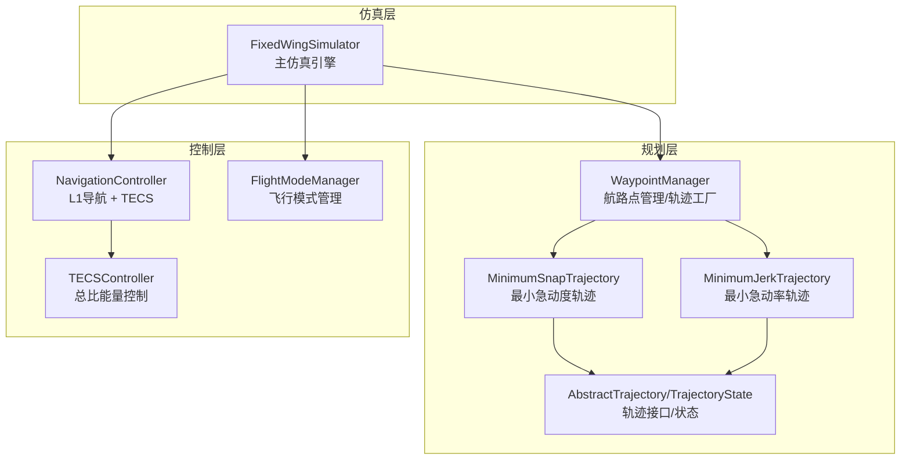
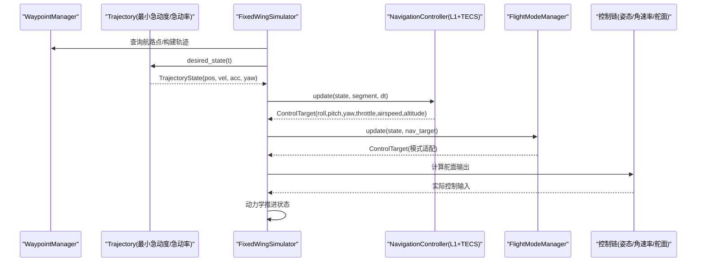
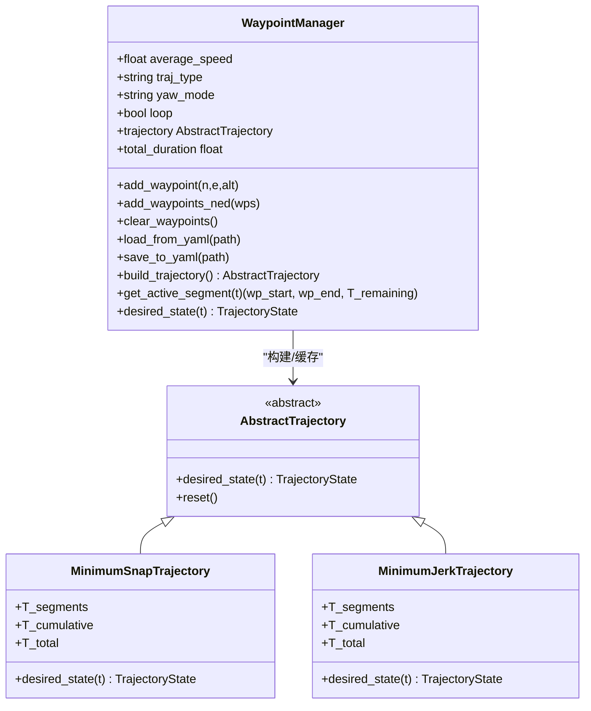
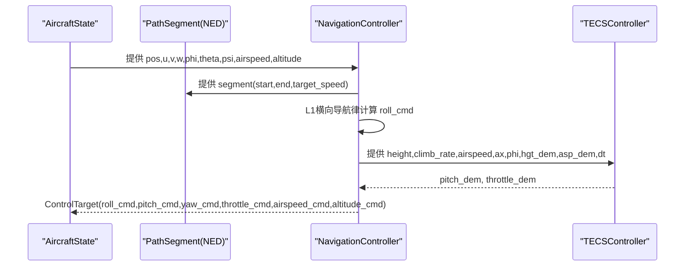
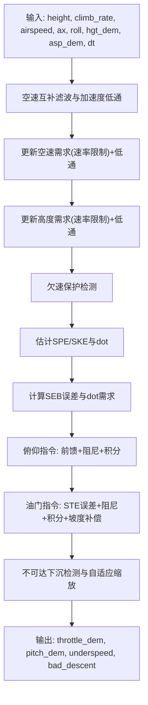
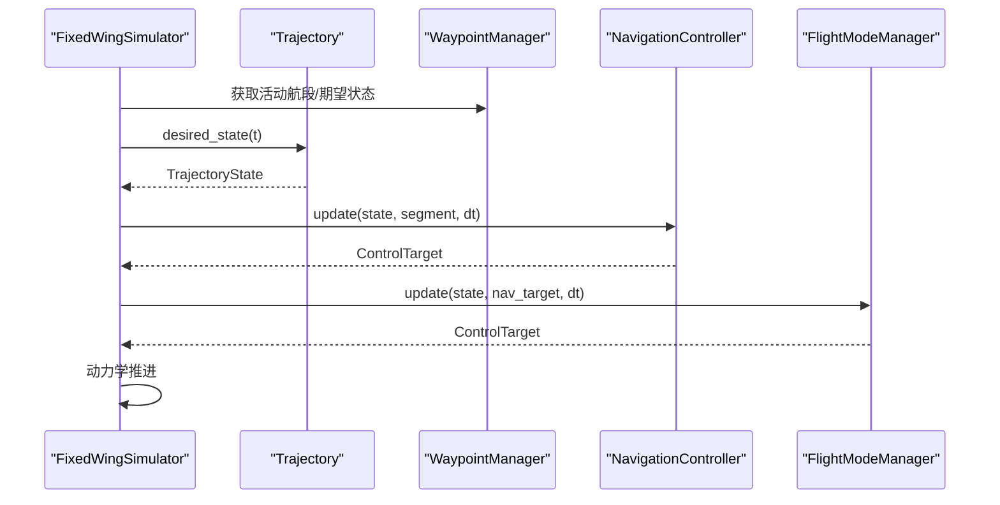
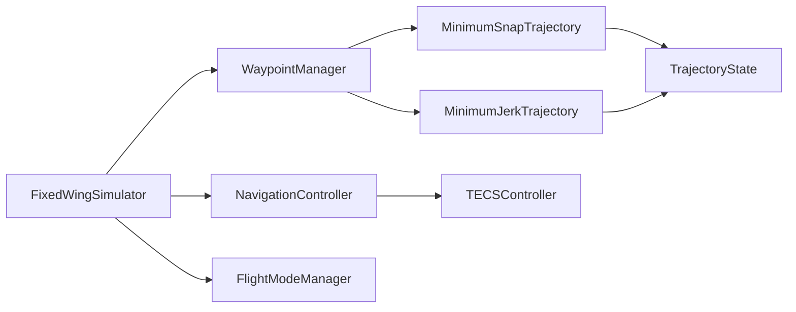

# 轨迹跟踪控制

<cite>
**本文引用的文件**
- [src/planning/waypoint_manager.py](file://src/planning/waypoint_manager.py)
- [src/planning/trajectory_base.py](file://src/planning/trajectory_base.py)
- [src/planning/minimum_snap.py](file://src/planning/minimum_snap.py)
- [src/planning/minimum_jerk.py](file://src/planning/minimum_jerk.py)
- [src/control/navigation_controller.py](file://src/control/navigation_controller.py)
- [src/control/tecs_controller.py](file://src/control/tecs_controller.py)
- [src/control/flight_mode_manager.py](file://src/control/flight_mode_manager.py)
- [src/simulation/simulator.py](file://src/simulation/simulator.py)
- [examples/example_3_trajectory_tracking.py](file://examples/example_3_trajectory_tracking.py)
- [config/trajectory.yaml](file://config/trajectory.yaml)
- [config/control_params.yaml](file://config/control_params.yaml)
- [tests/test_planning.py](file://tests/test_planning.py)
- [src/utils/math_utils.py](file://src/utils/math_utils.py)
</cite>

## 目录
1. [引言](#引言)
2. [项目结构](#项目结构)
3. [核心组件](#核心组件)
4. [架构总览](#架构总览)
5. [详细组件分析](#详细组件分析)
6. [依赖关系分析](#依赖关系分析)
7. [性能考量](#性能考量)
8. [故障排查指南](#故障排查指南)
9. [结论](#结论)
10. [附录](#附录)

## 引言
本文件面向FixedWingSimulator项目的轨迹跟踪控制系统，系统性阐述从参考轨迹生成、跟踪误差到控制输入生成的完整闭环流程。重点覆盖以下方面：
- WaypointManager的航路点管理、轨迹插值与速度规划机制
- 导航控制器（L1导航 + TECS）的状态反馈控制策略
- 仿真运行时的轨迹跟踪流程与参数配置
- 性能评估指标与最佳实践建议

## 项目结构
项目采用模块化分层设计，围绕“规划-控制-仿真”主线组织：
- 规划层：WaypointManager负责航路点管理与轨迹对象构建；Trajectory抽象定义统一接口；MinimumSnap与MinimumJerk提供多项式轨迹生成
- 控制层：NavigationController实现L1横向导航与TECS纵向控制；FlightModeManager提供飞行模式切换与目标生成
- 仿真层：FixedWingSimulator编排各模块，驱动6自由度非线性动力学与环境模型
- 示例与配置：examples展示典型轨迹跟踪场景；config提供轨迹与控制参数



图表来源
- [src/planning/waypoint_manager.py](file://src/planning/waypoint_manager.py#L20-L208)
- [src/planning/trajectory_base.py](file://src/planning/trajectory_base.py#L16-L47)
- [src/planning/minimum_snap.py](file://src/planning/minimum_snap.py#L167-L252)
- [src/planning/minimum_jerk.py](file://src/planning/minimum_jerk.py#L17-L71)
- [src/control/navigation_controller.py](file://src/control/navigation_controller.py#L45-L293)
- [src/control/tecs_controller.py](file://src/control/tecs_controller.py#L50-L647)
- [src/control/flight_mode_manager.py](file://src/control/flight_mode_manager.py#L115-L298)
- [src/simulation/simulator.py](file://src/simulation/simulator.py#L115-L642)

章节来源
- [src/simulation/simulator.py](file://src/simulation/simulator.py#L115-L642)

## 核心组件
- WaypointManager：维护NED航路点列表，按配置选择轨迹类型（最小急动度/最小急动率），提供当前时刻的期望状态与活动航段查询
- Trajectory抽象与具体实现：TrajectoryState统一描述位置、速度、加速度与偏航；MinimumSnapTrajectory与MinimumJerkTrajectory分别基于不同导数范数优化生成轨迹
- NavigationController：L1横向导航律生成横滚指令，结合TECS进行高度与空速控制
- TECSController：总比能量控制，解耦高度与速度控制，抑制积分饱和与油门/俯仰振荡
- FlightModeManager：在AUTO等模式下将导航目标转换为控制目标
- FixedWingSimulator：整合动力学、环境、控制与规划模块，执行闭环仿真

章节来源
- [src/planning/waypoint_manager.py](file://src/planning/waypoint_manager.py#L20-L208)
- [src/planning/trajectory_base.py](file://src/planning/trajectory_base.py#L16-L47)
- [src/planning/minimum_snap.py](file://src/planning/minimum_snap.py#L167-L252)
- [src/planning/minimum_jerk.py](file://src/planning/minimum_jerk.py#L17-L71)
- [src/control/navigation_controller.py](file://src/control/navigation_controller.py#L45-L293)
- [src/control/tecs_controller.py](file://src/control/tecs_controller.py#L50-L647)
- [src/control/flight_mode_manager.py](file://src/control/flight_mode_manager.py#L115-L298)
- [src/simulation/simulator.py](file://src/simulation/simulator.py#L115-L642)

## 架构总览
轨迹跟踪控制的端到端流程如下：
- WaypointManager接收航路点，构建轨迹对象
- FixedWingSimulator在每个时间步查询轨迹期望状态
- NavigationController基于期望状态与当前状态计算控制目标
- FlightModeManager在AUTO模式下直接采用导航目标
- 控制链路（姿态/角速率/舵面混控）将目标转化为实际控制输入
- 动力学模块推进状态，完成闭环



图表来源
- [src/simulation/simulator.py](file://src/simulation/simulator.py#L478-L521)
- [src/control/navigation_controller.py](file://src/control/navigation_controller.py#L134-L202)
- [src/control/flight_mode_manager.py](file://src/control/flight_mode_manager.py#L271-L297)
- [src/planning/minimum_snap.py](file://src/planning/minimum_snap.py#L227-L249)

## 详细组件分析

### WaypointManager：航路点管理与轨迹工厂
- 航路点存储与转换：以NED坐标存储，海拔（正向上）转换为NED down
- 轨迹类型选择：支持minimum_snap与minimum_jerk；可配置yaw模式（跟随速度/固定/零）
- 轨迹构建：根据航路点与平均速度计算分段时间，生成多项式系数；支持循环轨迹
- 活动航段查询：给定时间t返回当前航段起点/终点与剩余时间
- 期望状态查询：委托底层轨迹对象返回TrajectoryState



图表来源
- [src/planning/waypoint_manager.py](file://src/planning/waypoint_manager.py#L20-L208)
- [src/planning/trajectory_base.py](file://src/planning/trajectory_base.py#L26-L47)
- [src/planning/minimum_snap.py](file://src/planning/minimum_snap.py#L167-L252)
- [src/planning/minimum_jerk.py](file://src/planning/minimum_jerk.py#L17-L71)

章节来源
- [src/planning/waypoint_manager.py](file://src/planning/waypoint_manager.py#L20-L208)
- [src/planning/minimum_snap.py](file://src/planning/minimum_snap.py#L167-L252)
- [src/planning/minimum_jerk.py](file://src/planning/minimum_jerk.py#L17-L71)
- [tests/test_planning.py](file://tests/test_planning.py#L252-L328)

### TrajectoryState与轨迹插值：数学模型与数据结构
- TrajectoryState：包含位置、速度、加速度与偏航/偏航率，作为控制输入的期望参考
- 插值实现：每段使用多项式（最小急动度为8阶，最小急动率为6阶），满足边界条件与连续性约束
- 时间分配：若未显式给出分段时间，按平均速度估算；累积时间用于分段索引

```mermaid
flowchart TD
Start(["查询 t"]) --> Clamp["裁剪到 [0, T_total]"]
Clamp --> SearchSeg["二分查找当前分段"]
SearchSeg --> LocalT["计算局部时间 t_local"]
LocalT --> EvalPos["多项式求值(0阶)得到 pos"]
LocalT --> EvalVel["多项式求值(1阶)得到 vel"]
LocalT --> EvalAcc["多项式求值(2阶)得到 acc"]
EvalPos --> YawMode{"yaw_mode ?"}
EvalVel --> YawMode
EvalAcc --> YawMode
YawMode --> |yaw_follow 且 |vel_NE|>0| YawFromVel["yaw = atan2(vel_E, vel_N)"]
YawMode --> |否则| YawZero["yaw = 0"]
YawFromVel --> Out["返回 TrajectoryState"]
YawZero --> Out
```

图表来源
- [src/planning/minimum_snap.py](file://src/planning/minimum_snap.py#L227-L249)
- [src/planning/minimum_jerk.py](file://src/planning/minimum_jerk.py#L50-L67)

章节来源
- [src/planning/trajectory_base.py](file://src/planning/trajectory_base.py#L16-L47)
- [src/planning/minimum_snap.py](file://src/planning/minimum_snap.py#L167-L252)
- [src/planning/minimum_jerk.py](file://src/planning/minimum_jerk.py#L17-L71)

### 导航控制器：L1横向导航与TECS纵向控制
- L1横向导航律：基于Look-ahead点与当前地速轨迹计算横向加速度命令，进而换算为横滚角指令；考虑侧滑时使用体轴u/v投影到NED平面以提高精度
- TECS纵向控制：总比能量（SPE+SKE）控制，通过油门调节总比能量，通过俯仰分配比（SEB）控制能量分配；具备欠速保护、不可达下沉检测与自适应缩放



图表来源
- [src/control/navigation_controller.py](file://src/control/navigation_controller.py#L134-L202)
- [src/control/tecs_controller.py](file://src/control/tecs_controller.py#L247-L315)

章节来源
- [src/control/navigation_controller.py](file://src/control/navigation_controller.py#L45-L293)
- [src/control/tecs_controller.py](file://src/control/tecs_controller.py#L50-L647)

### TECS控制器：能量控制与鲁棒性设计
- 能量模型：SPE=gh，SKE=½V²；STE=SPE+SKE，SEB=SPE·w_spe − SKE·w_ske
- 控制策略：前馈+PD+积分，阻尼项抑制振荡；油门与俯仰协同，坡度补偿抵消转弯阻力
- 抗饱和与保护：积分抗饱和、速率限制、欠速保护、不可达下沉检测、高度需求低通与自适应缩放



图表来源
- [src/control/tecs_controller.py](file://src/control/tecs_controller.py#L247-L647)

章节来源
- [src/control/tecs_controller.py](file://src/control/tecs_controller.py#L50-L647)

### 仿真运行与轨迹跟踪流程
- 固定循环：FixedWingSimulator在每个dt推进状态，查询轨迹期望状态，经导航控制器与飞行模式管理生成控制目标，通过控制链路作用于动力学
- 轨迹对齐：当期望位置超出当前航段高度边界时进行裁剪，保证高度目标合理
- 单航路点模式：合成虚拟航段以启用TECS高度保持



图表来源
- [src/simulation/simulator.py](file://src/simulation/simulator.py#L478-L521)

章节来源
- [src/simulation/simulator.py](file://src/simulation/simulator.py#L239-L567)

## 依赖关系分析
- 模块内聚与耦合
  - WaypointManager与Trajectory实现松耦合，通过AbstractTrajectory接口交互
  - NavigationController依赖TrajectoryState与FlightModeManager提供的ControlTarget
  - TECSController独立性强，仅依赖状态估计与需求
  - FixedWingSimulator作为编排者，连接规划、控制与动力学
- 外部依赖
  - NumPy用于数值计算
  - 示例脚本依赖Matplotlib进行结果可视化



图表来源
- [src/planning/waypoint_manager.py](file://src/planning/waypoint_manager.py#L20-L208)
- [src/planning/minimum_snap.py](file://src/planning/minimum_snap.py#L167-L252)
- [src/planning/minimum_jerk.py](file://src/planning/minimum_jerk.py#L17-L71)
- [src/control/navigation_controller.py](file://src/control/navigation_controller.py#L45-L293)
- [src/control/tecs_controller.py](file://src/control/tecs_controller.py#L50-L647)
- [src/control/flight_mode_manager.py](file://src/control/flight_mode_manager.py#L115-L298)
- [src/simulation/simulator.py](file://src/simulation/simulator.py#L115-L642)

章节来源
- [src/simulation/simulator.py](file://src/simulation/simulator.py#L115-L642)

## 性能考量
- 轨迹质量
  - 最小急动度轨迹在3维空间与偏航维度均提供更高平滑度，适合高速飞行与强机动
  - 最小急动率轨迹阶次较低，计算更快，适用于对计算资源敏感场景
- 控制稳定性
  - TECS通过能量解耦与阻尼项有效抑制积分饱和与振荡
  - L1参数（周期与阻尼）影响横向响应与抗扰能力
- 实时性
  - 轨迹查询为O(log N)分段查找，控制链路计算量较小，满足实时要求
- 数值稳健性
  - 轨迹求解对大段时间可能产生病态矩阵，代码内置条件数检查与最小二乘兜底

[本节为通用指导，无需列出章节来源]

## 故障排查指南
- 轨迹构建失败
  - 症状：构建轨迹时报错“至少需要2个航路点”
  - 处理：确保至少添加两个航路点，或加载配置文件
  - 参考：[src/planning/waypoint_manager.py](file://src/planning/waypoint_manager.py#L139-L140)
- 轨迹查询越界
  - 症状：期望状态查询返回异常
  - 处理：确认时间t在[0, T_total]范围内；轨迹类内部已裁剪
  - 参考：[src/planning/minimum_snap.py](file://src/planning/minimum_snap.py#L227-L234)
- TECS油门饱和/振荡
  - 症状：油门长时间饱和或抖动
  - 处理：检查TECS参数（阻尼、积分增益、坡度补偿），适当降低积分增益与阻尼
  - 参考：[config/control_params.yaml](file://config/control_params.yaml#L30-L45)
- L1横向控制发散
  - 症状：横滚角过大或振荡
  - 处理：降低L1周期或阻尼，检查航路点间距与速度设定
  - 参考：[src/control/navigation_controller.py](file://src/control/navigation_controller.py#L57-L82)
- 偏航未对准
  - 症状：航路点间偏航不连续
  - 处理：确认yaw_mode设置为“yaw_follow”，并确保速度足够大以启用偏航跟随
  - 参考：[src/planning/minimum_snap.py](file://src/planning/minimum_snap.py#L240-L244)

章节来源
- [src/planning/waypoint_manager.py](file://src/planning/waypoint_manager.py#L139-L140)
- [src/planning/minimum_snap.py](file://src/planning/minimum_snap.py#L227-L244)
- [config/control_params.yaml](file://config/control_params.yaml#L30-L45)
- [src/control/navigation_controller.py](file://src/control/navigation_controller.py#L57-L82)

## 结论
本系统以最小急动度/急动率轨迹为核心，结合L1横向导航与TECS纵向控制，形成稳定高效的固定翼轨迹跟踪方案。WaypointManager提供灵活的航路点管理与轨迹工厂，FlightModeManager在AUTO模式下直接采用导航目标，简化了控制链路。通过合理的参数配置与稳健的数值实现，可在多种飞行条件下实现高精度跟踪。

[本节为总结性内容，无需列出章节来源]

## 附录

### 轨迹跟踪性能评估
- 跟踪误差分析
  - 位置误差：期望位置与实际位置差值的范数随时间统计
  - 速度误差：期望速度与实际速度差值的范数
  - 偏航误差：期望偏航与实际偏航差值（角度包裹）
- 控制精度评价
  - 横滚/俯仰/偏航角误差均方根（RMSE）
  - 油门/舵面指令幅度与变化率
- 实时性能监控
  - 控制周期抖动与最大步长时间
  - 积分器饱和次数与欠速/下沉保护触发次数

[本节为通用指导，无需列出章节来源]

### 轨迹规划最佳实践
- 航路点密度与间距：根据任务速度与机动需求合理设置航路点间距，避免过短分段导致病态矩阵
- 轨迹类型选择：高速/强机动选最小急动度；低计算负载选最小急动率
- 偏航模式：一般采用“yaw_follow”，确保偏航与速度方向一致
- 循环轨迹：首尾闭合时注意高度一致性，避免突变高度导致TECS过载
- 参数整定：先调TECS阻尼与积分增益，再调L1周期与阻尼，最后校准巡航空速与高度

[本节为通用指导，无需列出章节来源]

### 示例与配置要点
- 示例脚本：示例三展示了TB2在AUTO模式下的方形轨迹跟踪，包含数据记录与绘图
- 轨迹配置：trajectory.yaml定义轨迹类型、平均速度、偏航模式与航路点列表
- 控制参数：control_params.yaml定义ArduPilot风格参数与TECS关键参数

章节来源
- [examples/example_3_trajectory_tracking.py](file://examples/example_3_trajectory_tracking.py#L1-L194)
- [config/trajectory.yaml](file://config/trajectory.yaml#L1-L23)
- [config/control_params.yaml](file://config/control_params.yaml#L1-L45)