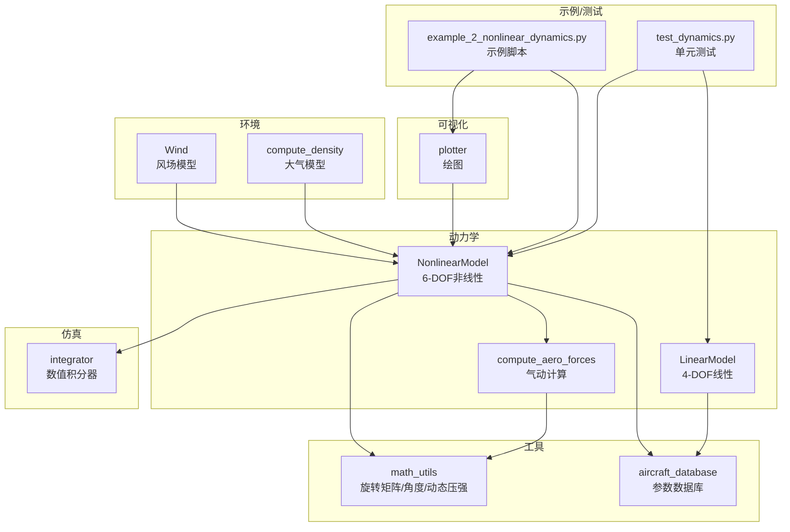
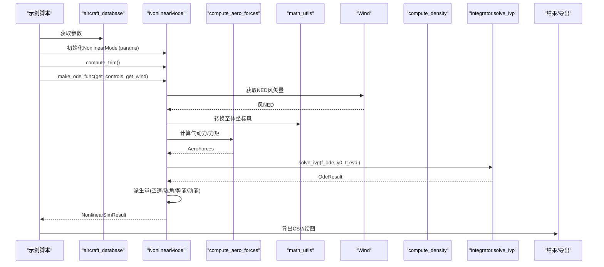
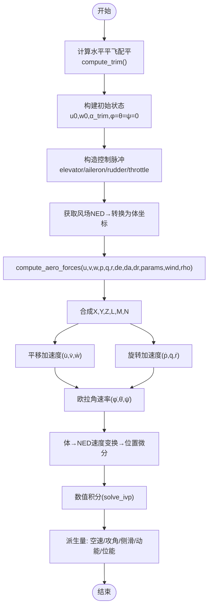
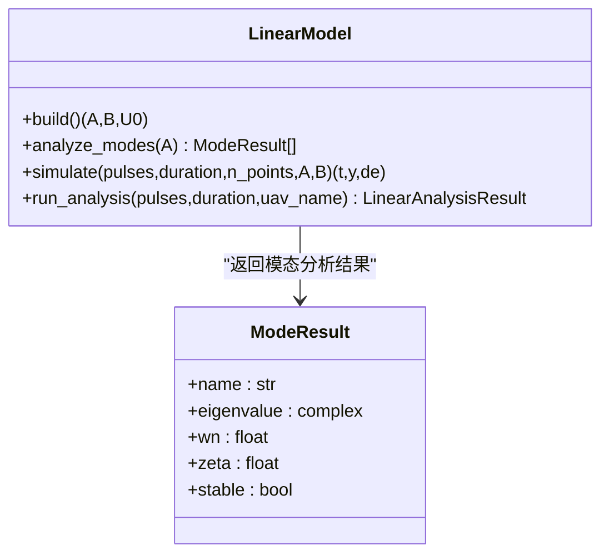
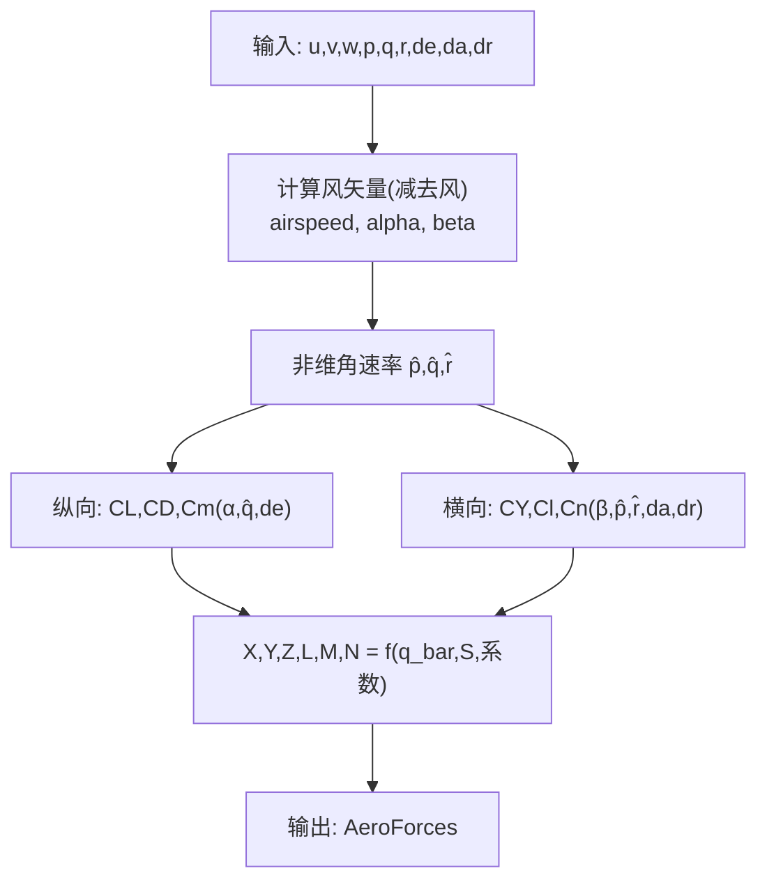
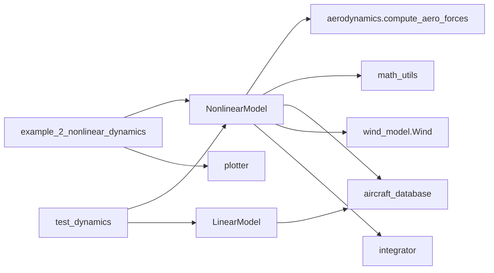

# 非线性动力学仿真

<cite>
**本文引用的文件**
- [nonlinear_model.py](file://src/dynamics/nonlinear_model.py)
- [linear_model.py](file://src/dynamics/linear_model.py)
- [aerodynamics.py](file://src/dynamics/aerodynamics.py)
- [math_utils.py](file://src/utils/math_utils.py)
- [aircraft_database.py](file://src/models/aircraft_database.py)
- [integrator.py](file://src/simulation/integrator.py)
- [wind_model.py](file://src/environment/wind_model.py)
- [atmosphere_model.py](file://src/environment/atmosphere_model.py)
- [plotter.py](file://src/visualization/plotter.py)
- [example_2_nonlinear_dynamics.py](file://examples/example_2_nonlinear_dynamics.py)
- [simulation.yaml](file://config/simulation.yaml)
- [aircraft.yaml](file://config/aircraft.yaml)
- [test_dynamics.py](file://tests/test_dynamics.py)
</cite>

## 目录
1. [简介](#简介)
2. [项目结构](#项目结构)
3. [核心组件](#核心组件)
4. [架构总览](#架构总览)
5. [详细组件分析](#详细组件分析)
6. [依赖关系分析](#依赖关系分析)
7. [性能考虑](#性能考虑)
8. [故障排查指南](#故障排查指南)
9. [结论](#结论)
10. [附录](#附录)

## 简介
本文件面向FixedWingSimulator项目的“非线性动力学仿真”模块，系统阐述6自由度（6-DOF）全非线性六自由度方程的实现原理、数值求解方法与工程实践要点。重点对比非线性模型与线性模型在气动系数、攻角影响、控制输入建模等方面的差异；解释仿真参数设置、初始条件配置与积分器选择的重要性；给出数学公式、状态变量物理意义、结果可视化方法，并提供稳定性分析、极限环与混沌行为的分析思路与注意事项，以及性能优化建议。

## 项目结构
本项目采用模块化分层设计：
- 动力学层：非线性6-DOF与线性4-DOF模型
- 气动层：气动力与力矩计算
- 环境层：风场与大气模型
- 控制层：ArduPilot兼容控制链
- 可视化层：Matplotlib/Plotly绘图
- 示例与测试：端到端示例脚本与单元测试

图表来源
- [nonlinear_model.py](file://src/dynamics/nonlinear_model.py#L104-L386)
- [linear_model.py](file://src/dynamics/linear_model.py#L107-L319)
- [aerodynamics.py](file://src/dynamics/aerodynamics.py#L35-L148)
- [math_utils.py](file://src/utils/math_utils.py#L43-L124)
- [aircraft_database.py](file://src/models/aircraft_database.py#L143-L167)
- [integrator.py](file://src/simulation/integrator.py#L17-L108)
- [wind_model.py](file://src/environment/wind_model.py#L18-L113)
- [atmosphere_model.py](file://src/environment/atmosphere_model.py#L48-L77)
- [plotter.py](file://src/visualization/plotter.py#L68-L112)
- [example_2_nonlinear_dynamics.py](file://examples/example_2_nonlinear_dynamics.py#L80-L215)
- [test_dynamics.py](file://tests/test_dynamics.py#L26-L336)

章节来源
- [nonlinear_model.py](file://src/dynamics/nonlinear_model.py#L1-L386)
- [linear_model.py](file://src/dynamics/linear_model.py#L1-L319)
- [aerodynamics.py](file://src/dynamics/aerodynamics.py#L1-L148)
- [math_utils.py](file://src/utils/math_utils.py#L1-L124)
- [aircraft_database.py](file://src/models/aircraft_database.py#L1-L183)
- [integrator.py](file://src/simulation/integrator.py#L1-L108)
- [wind_model.py](file://src/environment/wind_model.py#L1-L113)
- [atmosphere_model.py](file://src/environment/atmosphere_model.py#L1-L77)
- [plotter.py](file://src/visualization/plotter.py#L1-L200)
- [example_2_nonlinear_dynamics.py](file://examples/example_2_nonlinear_dynamics.py#L1-L215)
- [test_dynamics.py](file://tests/test_dynamics.py#L1-L336)

## 核心组件
- 非线性6-DOF模型：提供平移与旋转运动微分方程、气动力/力矩计算、推力模型、重力分解、欧拉角与位置变换、开环脉冲仿真与结果导出。
- 线性4-DOF模型：纵向线性化状态空间，提供特征值模态分析（短周期、长周期/阻尼振荡、阻尼漂移）。
- 气动计算：基于攻角/侧滑角与非维角速率，计算升力、阻力、俯仰力矩及侧向/方向力与滚转/偏航力矩。
- 数值积分器：支持批处理solve_ivp（RK45）与实时步进dopri5（ode），满足不同场景需求。
- 风与大气：提供固定/正弦/随机正弦风场与标准大气密度/声速计算。
- 可视化：Matplotlib/Plotly双通道输出，支持时间序列与轨迹绘制。

章节来源
- [nonlinear_model.py](file://src/dynamics/nonlinear_model.py#L104-L386)
- [linear_model.py](file://src/dynamics/linear_model.py#L107-L319)
- [aerodynamics.py](file://src/dynamics/aerodynamics.py#L35-L148)
- [integrator.py](file://src/simulation/integrator.py#L17-L108)
- [wind_model.py](file://src/environment/wind_model.py#L18-L113)
- [atmosphere_model.py](file://src/environment/atmosphere_model.py#L48-L77)
- [plotter.py](file://src/visualization/plotter.py#L68-L112)

## 架构总览
下图展示非线性仿真主流程：从参数加载、风场/大气模型接入，到非线性ODE构造、积分求解、派生量计算与结果导出。

图表来源
- [example_2_nonlinear_dynamics.py](file://examples/example_2_nonlinear_dynamics.py#L80-L215)
- [nonlinear_model.py](file://src/dynamics/nonlinear_model.py#L261-L386)
- [aerodynamics.py](file://src/dynamics/aerodynamics.py#L35-L148)
- [math_utils.py](file://src/utils/math_utils.py#L43-L124)
- [wind_model.py](file://src/environment/wind_model.py#L76-L108)
- [integrator.py](file://src/simulation/integrator.py#L85-L108)

## 详细组件分析

### 非线性6-DOF模型（NonlinearModel）
- 状态向量（12维，NED框架）：体速度(u,v,w)、机体角速度(p,q,r)、欧拉角(φ,θ,ψ)、NED位置(xN,xE,xD)。
- 动力学方程：
  - 平移：u̇、v̇、ẇ由气动力/推力/重力与科里奥利耦合项决定。
  - 旋转：欧拉角速率由体角速率与姿态耦合；转动惯量张量与耦合项决定ṗ、q̇、ṙ。
  - 位置：速度经体-导航变换（3-2-1欧拉）映射至NED。
- 控制输入：升降舵、副翼、方向舵、油门（归一化）。推力按质量、重力与目标爬升率设定。
- 空气动力：基于攻角、侧滑角与非维角速率的线性叠加，结合风场修正。
- 初始条件：通过trim计算水平平飞配平，构建初始状态；可叠加脉冲控制。
- 结果导出：包含时间序列、控制历史、派生量（空速、攻角、侧滑角、动能、位能）。

图表来源
- [nonlinear_model.py](file://src/dynamics/nonlinear_model.py#L132-L386)
- [aerodynamics.py](file://src/dynamics/aerodynamics.py#L35-L148)
- [math_utils.py](file://src/utils/math_utils.py#L43-L124)

章节来源
- [nonlinear_model.py](file://src/dynamics/nonlinear_model.py#L104-L386)

### 线性4-DOF模型（LinearModel）
- 纵向线性化状态：[u_p, α, q, θ]，其中u_p为速度扰动的归一化形式（Δu/U0）。
- 输入：[δ_T, δ_e]，分别为节流扰动与升降舵偏角。
- 状态矩阵A与输入矩阵B由气动导数与几何参数构建，随后进行特征值分解识别短周期、长周期/阻尼振荡与阻尼漂移模式。
- 适用范围：小扰动、定速飞行条件下的纵向动态分析。

图表来源
- [linear_model.py](file://src/dynamics/linear_model.py#L107-L319)

章节来源
- [linear_model.py](file://src/dynamics/linear_model.py#L107-L319)

### 气动计算（compute_aero_forces）
- 角度：攻角α=atan2(w,u)，侧滑角β=arcsin(v/V)，并提供动态压强q_bar=0.5·ρ·V^2。
- 非维角速率：p̂=pb/(2U0)，q̂=qc/(2U0)，r̂=rb/(2U0)。
- 升/阻/俯仰：CL、CD、Cm为α、q̂与升降舵偏角的线性组合；侧向/方向：CY、Cl、Cn为β、p̂、r̂与副/方向舵的线性组合。
- 力/力矩：X、Y、Z、L、M、N由q_bar、S、气动系数与几何参数计算。

图表来源
- [aerodynamics.py](file://src/dynamics/aerodynamics.py#L35-L148)
- [math_utils.py](file://src/utils/math_utils.py#L107-L124)

章节来源
- [aerodynamics.py](file://src/dynamics/aerodynamics.py#L35-L148)
- [math_utils.py](file://src/utils/math_utils.py#L107-L124)

### 数值积分器（integrator）
- RK45Integrator：solve_ivp（批处理），适合离线分析与结果导出。
- Dopri5Integrator：ode（dopri5），单步推进，适合实时闭环仿真。
- 共同点：支持相对/绝对容差与最大步长控制；失败时抛出异常。

章节来源
- [integrator.py](file://src/simulation/integrator.py#L17-L108)

### 风与大气模型
- Wind：支持NONE/FIXED/SINE/RANDOMSINE四种风类型，提供NED风矢量。
- Atmosphere：ISA模型，计算密度、压力、温度与声速随高度变化。

章节来源
- [wind_model.py](file://src/environment/wind_model.py#L18-L113)
- [atmosphere_model.py](file://src/environment/atmosphere_model.py#L48-L77)

### 可视化与示例
- Matplotlib/Plotly绘图：提供6-DOF时间序列与3D轨迹图。
- 示例脚本：对比开环非线性与闭环PID稳定（STABILIZE）响应，保存CSV与PNG。

章节来源
- [plotter.py](file://src/visualization/plotter.py#L68-L112)
- [example_2_nonlinear_dynamics.py](file://examples/example_2_nonlinear_dynamics.py#L80-L215)

## 依赖关系分析
- NonlinearModel依赖：
  - aerodynamics.compute_aero_forces：气动力/力矩
  - utils.math_utils：旋转矩阵、欧拉角速率、动态压强
  - models.aircraft_database：参数注入（U0、ρ、q_bar）
  - environment.wind_model：风场（NED→体坐标转换）
  - simulation.integrator：数值积分
- LinearModel依赖：
  - models.aircraft_database：参数
  - scipy.integrate.solve_ivp：线性系统求解
- 可视化与示例：
  - plotter.plot_6dof_matplotlib：静态图
  - example_2_nonlinear_dynamics：端到端对比

图表来源
- [nonlinear_model.py](file://src/dynamics/nonlinear_model.py#L261-L386)
- [linear_model.py](file://src/dynamics/linear_model.py#L129-L200)
- [aerodynamics.py](file://src/dynamics/aerodynamics.py#L35-L148)
- [math_utils.py](file://src/utils/math_utils.py#L43-L124)
- [aircraft_database.py](file://src/models/aircraft_database.py#L143-L167)
- [wind_model.py](file://src/environment/wind_model.py#L76-L108)
- [integrator.py](file://src/simulation/integrator.py#L85-L108)
- [example_2_nonlinear_dynamics.py](file://examples/example_2_nonlinear_dynamics.py#L80-L215)
- [plotter.py](file://src/visualization/plotter.py#L68-L112)
- [test_dynamics.py](file://tests/test_dynamics.py#L26-L336)

## 性能考虑
- 积分器选择
  - 批处理/离线分析：solve_ivp（RK45）更高效且便于批量导出。
  - 实时闭环：dopri5单步推进，便于与控制器同步迭代。
- 容差与步长
  - rtol/atol过严会增加计算量；过松可能引入误差。建议先用默认容差验证，再根据精度需求调整。
  - max_step过大可能导致数值不稳定；过小会增加步数。建议结合系统带宽与控制频率设置。
- 参数预计算
  - NonlinearModel在初始化时预存U0、ρ、q_bar等派生参数，避免每步重复计算。
- 气动模型稳定性
  - 当空速接近零时，动态压强有数值夹紧，避免除零或奇异；建议在仿真前检查初始条件与风场。
- 风场与密度
  - 高度变化导致密度变化，需在get_rho回调中传入海拔；风场类型影响非线性响应，建议在复杂工况下使用随机正弦风。

章节来源
- [nonlinear_model.py](file://src/dynamics/nonlinear_model.py#L114-L127)
- [integrator.py](file://src/simulation/integrator.py#L85-L108)
- [simulation.yaml](file://config/simulation.yaml#L7-L12)
- [atmosphere_model.py](file://src/environment/atmosphere_model.py#L48-L77)
- [wind_model.py](file://src/environment/wind_model.py#L76-L108)

## 故障排查指南
- 非线性模型
  - 状态导数异常：检查初始状态是否接近平衡点；确认气动系数与控制输入范围合理。
  - 积分失败：查看容差设置与最大步长；检查风场/密度回调是否正确传入。
  - 收敛问题：尝试更小的初始扰动或提高rtol/atol。
- 线性模型
  - 特征值不稳定：检查气动导数符号与矩阵构建；确认U0与几何参数一致性。
  - 模态识别异常：确保A矩阵已构建或显式传入。
- 单元测试参考
  - 坐标变换：DCM正交性、绕回路一致性、欧拉角速率近似。
  - 气动：升力方向、阻力正号、对称性、风效应对q_bar的影响。
  - 线性：A/B形状、有限性、模态数量与稳定性。
  - 非线性：trim收敛、状态导数维度、平衡点附近导数接近零、所有飞机均可配平。

章节来源
- [test_dynamics.py](file://tests/test_dynamics.py#L67-L336)

## 结论
本项目在工程上实现了高保真的固定翼6-DOF非线性仿真，并提供了与之互补的4-DOF线性模型用于模态分析。通过参数化数据库、可插拔风场/大气模型、灵活的积分器与可视化工具，用户可在不同应用场景下快速切换与评估。实践中应重视初始条件与积分器参数设置，关注风场与密度对非线性响应的影响，并结合线性模态分析辅助理解非线性系统的稳定性与边界。

## 附录

### 仿真参数与配置
- 仿真配置（simulation.yaml）
  - 时间步长、总时长、积分器类型（rk45/dopri5）、容差、初始位置/航向、风类型与强度、日志开关。
- 飞机配置（aircraft.yaml）
  - 选择飞机型号，支持参数覆盖。

章节来源
- [simulation.yaml](file://config/simulation.yaml#L1-L30)
- [aircraft.yaml](file://config/aircraft.yaml#L1-L13)

### 状态变量与派生量说明
- 状态变量（12维）
  - 体速度：u、v、w（m/s）
  - 机体角速度：p、q、r（rad/s）
  - 欧拉角：φ、θ、ψ（rad）
  - NED位置：xN、xE、xD（m）
- 派生量
  - 空速：sqrt(u^2+v^2+w^2)
  - 攻角：atan2(w,u)（deg）
  - 侧滑角：arcsin(v/V)（deg）
  - 动能：0.5·m·V^2
  - 位能：m·g·(-xD)

章节来源
- [nonlinear_model.py](file://src/dynamics/nonlinear_model.py#L4-L16)
- [nonlinear_model.py](file://src/dynamics/nonlinear_model.py#L364-L382)

### 非线性与线性模型的区别
- 气动系数
  - 非线性：基于真实攻角/侧滑角与非维角速率的线性叠加，考虑风场修正。
  - 线性：仅在定速条件下对纵向状态进行线性化，使用气动导数构建A、B。
- 控制输入
  - 非线性：油门直接映射推力；控制面偏角叠加于trim值。
  - 线性：以扰动形式输入（节流扰动、升降舵扰动）。
- 稳定性与模态
  - 非线性：全局非线性，可能出现极限环/混沌；需通过相平面/频域/李雅普诺夫方法分析。
  - 线性：局部稳定性由特征值实部判断；短周期/长周期模态提供定性指导。

章节来源
- [aerodynamics.py](file://src/dynamics/aerodynamics.py#L90-L126)
- [linear_model.py](file://src/dynamics/linear_model.py#L175-L200)
- [nonlinear_model.py](file://src/dynamics/nonlinear_model.py#L160-L256)

### 稳定性、极限环与混沌分析思路
- 局部稳定性：线性模型特征值实部小于零即稳定；短周期模态阻尼比ζ较高表示良好阻尼。
- 全局非线性：通过相轨迹观察极限环；计算最大李雅普诺夫指数判别混沌；利用分岔图研究参数敏感性。
- 工程实践：在控制器设计中结合线性模态与非线性仿真，确保在边界工况（低速、大攻角、强风）下稳定。

章节来源
- [linear_model.py](file://src/dynamics/linear_model.py#L206-L252)
- [nonlinear_model.py](file://src/dynamics/nonlinear_model.py#L160-L256)

### 实际应用注意事项
- 初始条件：尽量从trim出发，避免过大初始扰动导致瞬态发散。
- 风场：强风/乱流显著改变非线性响应，建议在闭环控制中加入风补偿策略。
- 数据导出：示例脚本自动保存CSV与PNG，便于离线分析与报告生成。
- 可视化：Matplotlib适合批量脚本，Plotly适合Web界面集成。

章节来源
- [example_2_nonlinear_dynamics.py](file://examples/example_2_nonlinear_dynamics.py#L110-L160)
- [plotter.py](file://src/visualization/plotter.py#L161-L200)