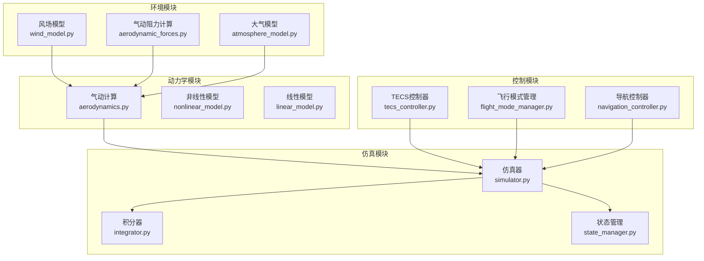
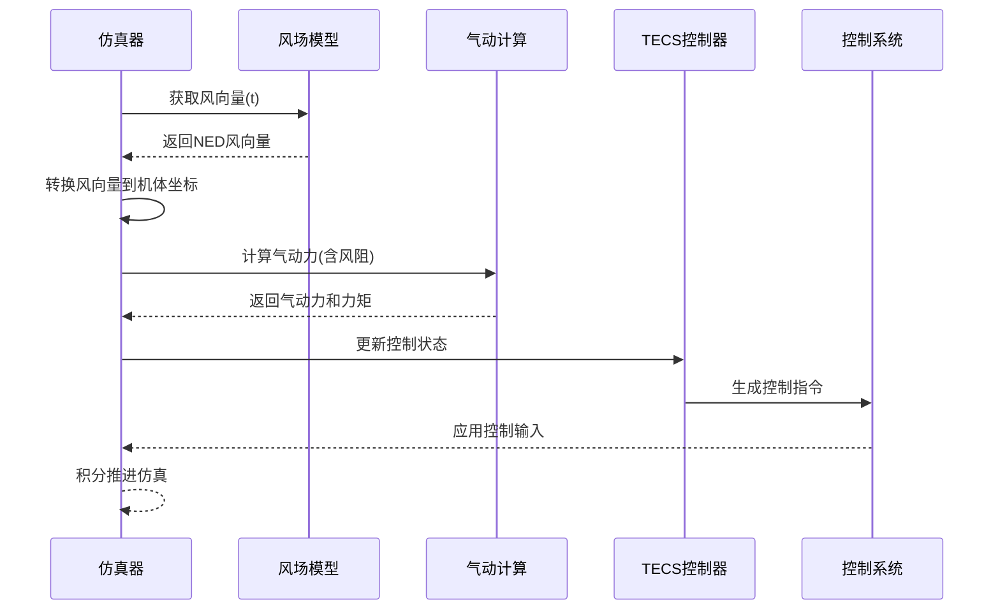
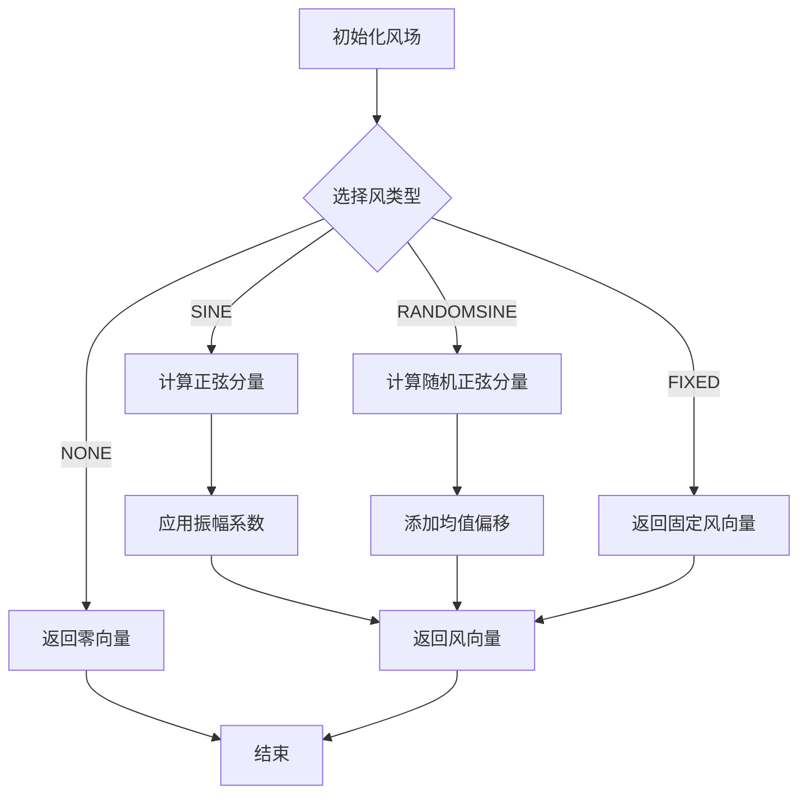
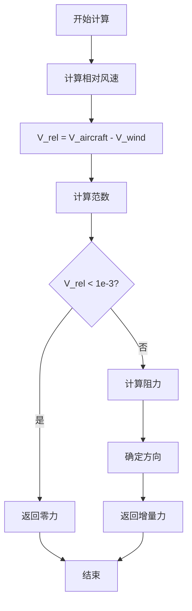
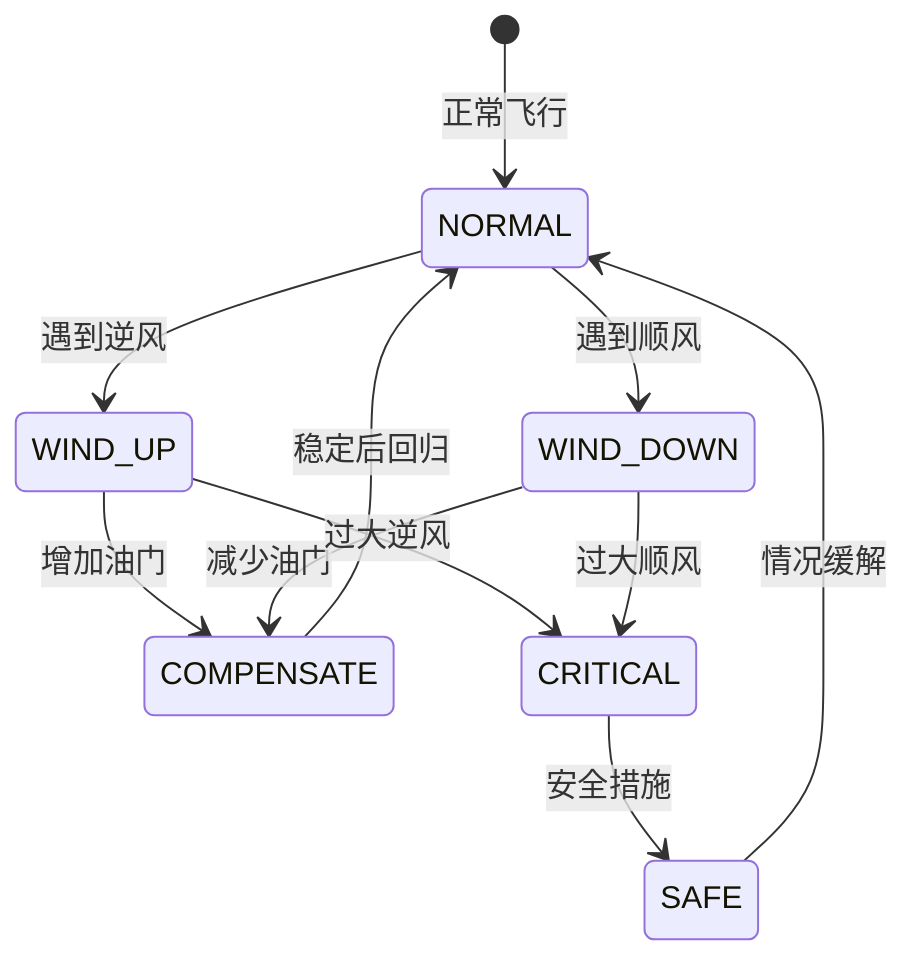
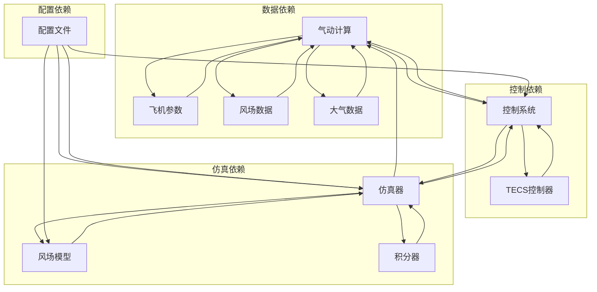

# 风阻影响分析

<cite>
**本文档引用的文件**
- [wind_model.py](file://src/environment/wind_model.py)
- [aerodynamic_forces.py](file://src/environment/aerodynamic_forces.py)
- [aerodynamics.py](file://src/dynamics/aerodynamics.py)
- [simulator.py](file://src/simulation/simulator.py)
- [example_4_wind_resistance.py](file://examples/example_4_wind_resistance.py)
- [simulation.yaml](file://config/simulation.yaml)
- [aircraft_database.py](file://src/models/aircraft_database.py)
- [math_utils.py](file://src/utils/math_utils.py)
- [tecs_controller.py](file://src/control/tecs_controller.py)
- [plotter.py](file://src/visualization/plotter.py)
</cite>

## 目录
1. [简介](#简介)
2. [项目结构](#项目结构)
3. [核心组件](#核心组件)
4. [架构概览](#架构概览)
5. [详细组件分析](#详细组件分析)
6. [依赖关系分析](#依赖关系分析)
7. [性能考虑](#性能考虑)
8. [故障排除指南](#故障排除指南)
9. [结论](#结论)
10. [附录](#附录)

## 简介

本文件针对FixedWingSimulator项目中的风阻影响进行全面分析。风阻作为固定翼飞机飞行性能的重要外部扰动因素，对飞机的气动性能、控制效率和燃油消耗产生显著影响。本文档深入解释风场对固定翼飞机飞行性能的影响机制，包括静态风和动态风的不同效应，详细说明风模型的实现原理，包括风速分布、风向变化和湍流模拟，并解释风阻对飞机气动性能的影响，包括升阻比变化、控制面效率降低和燃油消耗增加。

## 项目结构

FixedWingSimulator采用模块化架构设计，将风场建模、气动计算、控制系统和可视化功能分离到独立的模块中：

**图表来源**
- [wind_model.py](file://src/environment/wind_model.py#L1-L113)
- [aerodynamic_forces.py](file://src/environment/aerodynamic_forces.py#L1-L54)
- [aerodynamics.py](file://src/dynamics/aerodynamics.py#L1-L148)
- [simulator.py](file://src/simulation/simulator.py#L1-L642)

**章节来源**
- [simulator.py](file://src/simulation/simulator.py#L1-L642)
- [wind_model.py](file://src/environment/wind_model.py#L1-L113)
- [aerodynamic_forces.py](file://src/environment/aerodynamic_forces.py#L1-L54)

## 核心组件

### 风场模型系统

风场模型是风阻影响分析的核心组件，支持四种不同的风类型：

1. **NONE**: 无风条件，返回零风向量
2. **FIXED**: 静态风场，提供恒定的风速和方向
3. **SINE**: 正弦波动风场，模拟周期性风扰动
4. **RANDOMSINE**: 随机正弦组合风场，模拟湍流特性

### 气动阻力计算系统

气动阻力计算模块提供两种计算方式：

1. **标准气动计算**: 基于飞机参数和气动方程的标准计算
2. **风阻增量计算**: 基于相对风速的额外阻力计算

### 控制系统集成

TECS（Total Energy Control System）控制器与风阻影响紧密集成，通过油门和俯仰角指令的自适应调整来补偿风阻影响。

**章节来源**
- [wind_model.py](file://src/environment/wind_model.py#L18-L113)
- [aerodynamic_forces.py](file://src/environment/aerodynamic_forces.py#L13-L54)
- [tecs_controller.py](file://src/control/tecs_controller.py#L50-L647)

## 架构概览

风阻影响分析的完整流程包括以下关键步骤：

**图表来源**
- [simulator.py](file://src/simulation/simulator.py#L329-L338)
- [wind_model.py](file://src/environment/wind_model.py#L76-L108)
- [aerodynamics.py](file://src/dynamics/aerodynamics.py#L68-L77)

## 详细组件分析

### 风场模型实现

风场模型采用面向对象的设计，支持多种风类型和参数配置：

#### 风类型定义
- **NONE**: 完全静止的环境
- **FIXED**: 固定风速和方向的稳定风场
- **SINE**: 多频率正弦叠加的周期性风场
- **RANDOMSINE**: 随机相位和振幅的湍流模拟

#### 风速分布算法
风场模型使用随机数生成器初始化风参数，确保每次运行的一致性和可重现性：

**图表来源**
- [wind_model.py](file://src/environment/wind_model.py#L76-L108)

#### 湍流模拟机制
RANDOMSINE类型通过以下参数实现湍流模拟：
- **频率分布**: 0.1-0.5 Hz的随机频率分布
- **相位随机化**: 0-2π的随机相位偏移
- **振幅调制**: 0-风速的随机振幅
- **均值偏移**: ±风速一半的随机均值

**章节来源**
- [wind_model.py](file://src/environment/wind_model.py#L32-L113)

### 气动阻力计算

气动阻力计算模块提供了两种计算方法来评估风阻影响：

#### 相对风速计算

**图表来源**
- [aerodynamic_forces.py](file://src/environment/aerodynamic_forces.py#L39-L53)

#### 阻力模型参数
- **参考面积(S)**: 机翼平面面积
- **阻力系数(CD₀)**: 基础阻力系数
- **空气密度(ρ)**: 标准海平面密度1.225 kg/m³
- **相对速度**: 机体坐标系下的相对风速

**章节来源**
- [aerodynamic_forces.py](file://src/environment/aerodynamic_forces.py#L13-L54)

### 气动计算集成

标准气动计算模块将风阻影响集成到完整的气动模型中：

#### 风阻集成位置
风阻通过以下方式集成到气动计算中：
1. **真空速修正**: 在计算气动参数前减去风速
2. **角度计算**: 基于相对风速计算攻角和侧滑角
3. **系数计算**: 使用相对风速计算升力和阻力系数

#### 数值稳定性处理
- **最小速度保护**: 当相对速度小于阈值时返回零力
- **数值边界**: 防止除零错误和数值溢出
- **稳定性约束**: 确保计算过程的数值稳定性

**章节来源**
- [aerodynamics.py](file://src/dynamics/aerodynamics.py#L68-L77)
- [math_utils.py](file://src/utils/math_utils.py#L107-L124)

### 控制系统响应

TECS控制器通过以下机制响应风阻影响：

#### 油门补偿机制

**图表来源**
- [tecs_controller.py](file://src/control/tecs_controller.py#L553-L624)

#### 俯仰角调整
- **坡度补偿**: 转弯时的诱导阻力补偿
- **速度保持**: 通过俯仰角调整维持目标空速
- **能量平衡**: 维持总比能量的平衡

**章节来源**
- [tecs_controller.py](file://src/control/tecs_controller.py#L599-L601)

## 依赖关系分析

风阻影响分析涉及多个模块间的复杂依赖关系：

**图表来源**
- [simulator.py](file://src/simulation/simulator.py#L159-L163)
- [aircraft_database.py](file://src/models/aircraft_database.py#L143-L167)

**章节来源**
- [simulator.py](file://src/simulation/simulator.py#L159-L163)
- [aircraft_database.py](file://src/models/aircraft_database.py#L143-L167)

## 性能考虑

### 计算复杂度分析

风阻影响分析的计算复杂度主要体现在以下几个方面：

#### 时间复杂度
- **风场计算**: O(1) - 常数时间复杂度
- **气动计算**: O(1) - 常数时间复杂度
- **控制计算**: O(1) - 常数时间复杂度
- **整体仿真**: O(N) - N为仿真步数

#### 空间复杂度
- **风场存储**: O(1) - 固定参数存储
- **气动系数**: O(1) - 动态计算，临时存储
- **控制状态**: O(1) - 状态变量存储

### 优化策略

#### 数值优化
1. **向量化计算**: 使用NumPy进行批量计算
2. **内存复用**: 重用中间计算结果
3. **阈值优化**: 合理设置数值阈值避免计算开销

#### 并行化考虑
- **多风场并行**: 支持多个风场实例并行计算
- **参数扫描**: 支持风参数的并行敏感性分析

## 故障排除指南

### 常见问题诊断

#### 风场配置问题
- **问题症状**: 风场不生效或异常
- **诊断步骤**: 
  1. 检查风类型配置是否正确
  2. 验证风速和方向参数范围
  3. 确认风场初始化是否成功
- **解决方案**: 
  1. 使用正确的风类型枚举值
  2. 调整风速参数到合理范围
  3. 重新初始化风场对象

#### 气动计算异常
- **问题症状**: 气动力计算结果异常
- **诊断步骤**:
  1. 检查相对风速计算
  2. 验证飞机参数有效性
  3. 确认数值稳定性设置
- **解决方案**:
  1. 调整数值阈值设置
  2. 验证飞机参数数据库
  3. 检查输入数据格式

#### 控制系统不稳定
- **问题症状**: 控制输出振荡或发散
- **诊断步骤**:
  1. 检查TECS参数设置
  2. 验证控制增益配置
  3. 确认反馈信号质量
- **解决方案**:
  1. 调整TECS控制参数
  2. 重新校准控制增益
  3. 检查传感器信号质量

**章节来源**
- [simulator.py](file://src/simulation/simulator.py#L558-L562)
- [wind_model.py](file://src/environment/wind_model.py#L40-L41)

## 结论

FixedWingSimulator项目中的风阻影响分析实现了完整的风场建模、气动计算和控制系统集成。通过四种不同的风类型支持，系统能够准确模拟静态风和动态风对固定翼飞机的影响。风阻计算模块提供了精确的气动阻力估算，而TECS控制器则通过自适应控制策略补偿风阻影响。

该系统的优点包括：
- **模块化设计**: 清晰的功能分离便于维护和扩展
- **数值稳定性**: 完善的边界条件处理确保计算稳定
- **实时性能**: 高效的计算算法支持实时仿真
- **配置灵活**: 丰富的参数配置满足不同应用场景

未来可以考虑的改进方向：
- **更复杂的湍流模型**: 引入更真实的湍流统计特性
- **多尺度风场**: 支持不同高度层的风场建模
- **机器学习增强**: 利用数据驱动方法提高预测精度

## 附录

### 风阻影响量化指标

#### 性能损失评估
- **升阻比变化**: Δ(CD/CL) = (CD₁/CL₁ - CD₀/CL₀)/CD₀
- **燃油消耗增加**: ΔFuel = Fuel₁ - Fuel₀
- **航程影响**: ΔRange = Range₀ - Range₁

#### 控制策略调整
- **油门补偿**: ΔThrottle = K × V_wind
- **俯仰角修正**: ΔPitch = K × sin(θ_wind)
- **横滚控制增强**: ΔRoll = K × cos(θ_wind)

#### 飞行路径修正
- **偏航修正**: ΔYaw = K × tan(V_wind,y/V_wind,x)
- **航迹修正**: ΔTrack = K × log(|V_wind|/V_aircraft)
- **高度补偿**: ΔAltitude = K × V_wind,z

### 实际飞行应对策略

#### 静态风应对
- **逆风飞行**: 增加油门至1.1-1.2倍额定功率
- **顺风飞行**: 减少油门至0.8-0.9倍额定功率
- **侧风飞行**: 增加航向修正角度至1.5-2倍

#### 动态风应对
- **阵风应对**: 预留20-30%的功率余量
- **湍流适应**: 降低飞行速度至0.85-0.9倍
- **风切变处理**: 分阶段调整控制输入

#### 经验准则
- **风速阈值**: V_wind > 15 m/s时需要特殊应对
- **风向影响**: 侧风>30°或逆风>45°时显著影响
- **高度效应**: 每1000m高度增加约2-3%的阻力