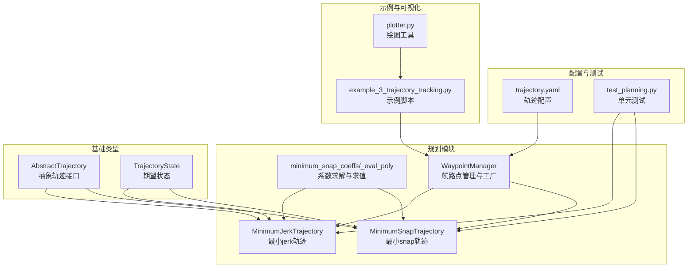
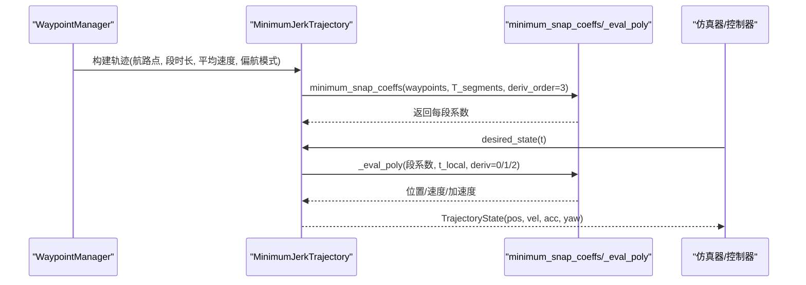
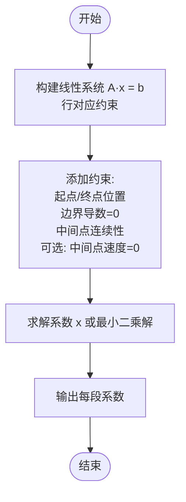
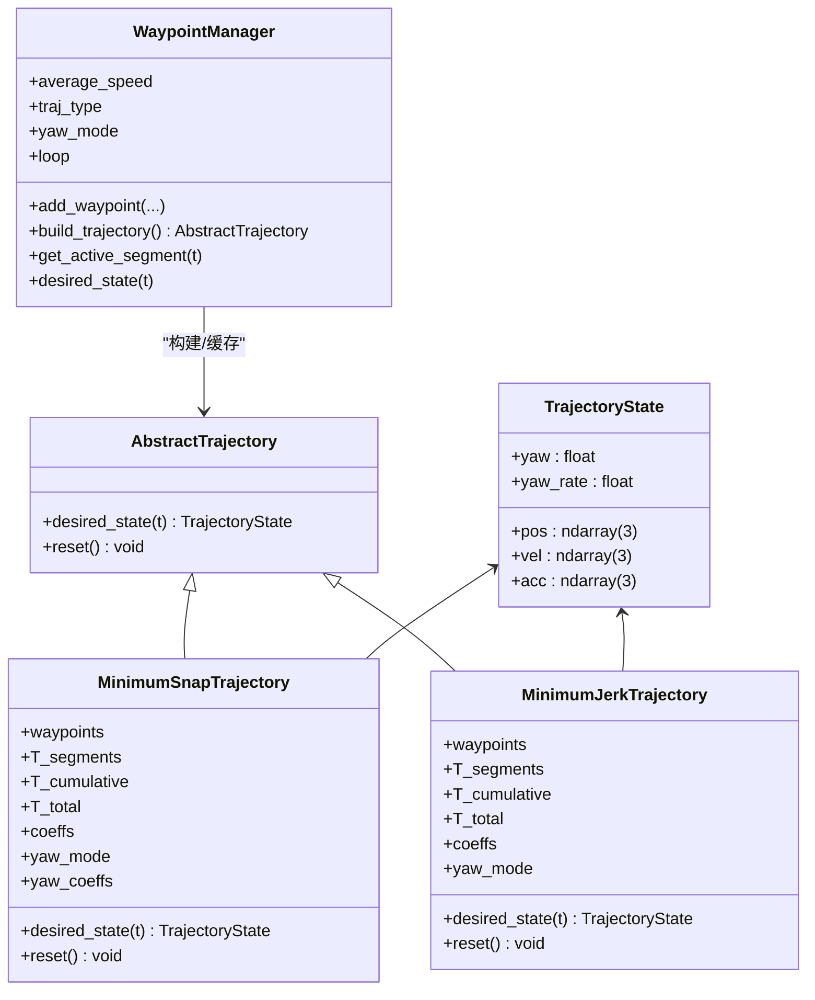
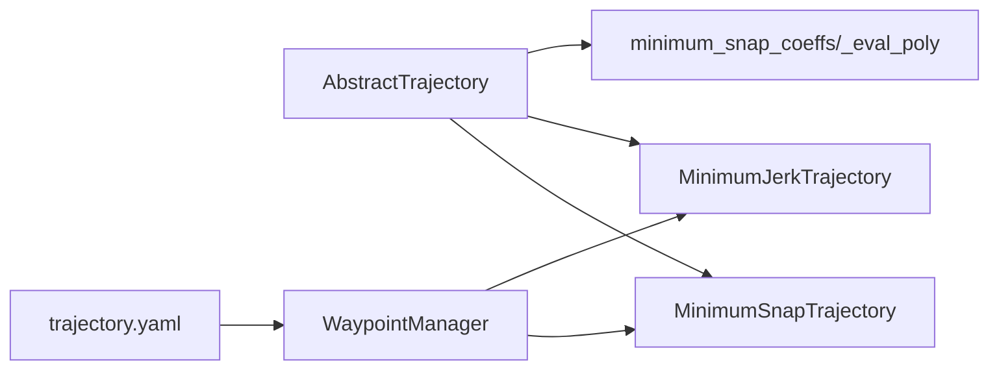

# 最小jerk轨迹

<cite>
**本文引用的文件**
- [src/planning/minimum_jerk.py](file://src/planning/minimum_jerk.py)
- [src/planning/minimum_snap.py](file://src/planning/minimum_snap.py)
- [src/planning/trajectory_base.py](file://src/planning/trajectory_base.py)
- [src/planning/waypoint_manager.py](file://src/planning/waypoint_manager.py)
- [config/trajectory.yaml](file://config/trajectory.yaml)
- [tests/test_planning.py](file://tests/test_planning.py)
- [examples/example_3_trajectory_tracking.py](file://examples/example_3_trajectory_tracking.py)
- [src/utils/math_utils.py](file://src/utils/math_utils.py)
- [src/visualization/plotter.py](file://src/visualization/plotter.py)
</cite>

## 目录
1. [引言](#引言)
2. [项目结构](#项目结构)
3. [核心组件](#核心组件)
4. [架构总览](#架构总览)
5. [详细组件分析](#详细组件分析)
6. [依赖关系分析](#依赖关系分析)
7. [性能考量](#性能考量)
8. [故障排查指南](#故障排查指南)
9. [结论](#结论)
10. [附录](#附录)

## 引言
本文件围绕FixedWingSimulator中的最小jerk轨迹规划算法，系统阐述其数学理论基础、实现原理、参数设置、验证方法以及与最小snap轨迹的对比。最小jerk（最小急动度）通过最小化加加速度（三阶导数）的积分，在保证路径平滑的同时降低控制输入的抖动，适合固定翼飞机在闭环控制中追求更柔和的指令变化。最小snap轨迹则进一步将目标提升到四阶导数，获得更高的连续性，适用于对平滑性要求更高的应用场景。本文将从代码结构出发，逐步解析两类轨迹的构造方式、约束条件、连续性保证与工程应用差异，并给出参数调优与验证建议。

## 项目结构
最小jerk轨迹位于planning模块中，复用最小snap的系数求解器，仅将导数阶数调整为3。整体结构遵循“抽象基类 + 具体实现 + 轨迹管理 + 配置/测试/示例”的分层设计。

图表来源
- [src/planning/minimum_jerk.py](file://src/planning/minimum_jerk.py#L17-L71)
- [src/planning/minimum_snap.py](file://src/planning/minimum_snap.py#L47-L142)
- [src/planning/trajectory_base.py](file://src/planning/trajectory_base.py#L16-L47)
- [src/planning/waypoint_manager.py](file://src/planning/waypoint_manager.py#L20-L160)
- [config/trajectory.yaml](file://config/trajectory.yaml#L1-L23)
- [tests/test_planning.py](file://tests/test_planning.py#L1-L328)
- [examples/example_3_trajectory_tracking.py](file://examples/example_3_trajectory_tracking.py#L70-L98)
- [src/visualization/plotter.py](file://src/visualization/plotter.py#L113-L154)

章节来源
- [src/planning/minimum_jerk.py](file://src/planning/minimum_jerk.py#L1-L71)
- [src/planning/minimum_snap.py](file://src/planning/minimum_snap.py#L1-L253)
- [src/planning/trajectory_base.py](file://src/planning/trajectory_base.py#L1-L47)
- [src/planning/waypoint_manager.py](file://src/planning/waypoint_manager.py#L1-L208)
- [config/trajectory.yaml](file://config/trajectory.yaml#L1-L23)
- [tests/test_planning.py](file://tests/test_planning.py#L1-L328)
- [examples/example_3_trajectory_tracking.py](file://examples/example_3_trajectory_tracking.py#L1-L194)
- [src/visualization/plotter.py](file://src/visualization/plotter.py#L1-L244)

## 核心组件
- 抽象轨迹接口：定义统一的desired_state(t)接口，返回TrajectoryState（位置、速度、加速度、偏航角及偏航率）。
- 最小snap轨迹求解器：通过构建线性系统A·x=b，按导数阶数M（deriv_order）确定每段多项式的阶数（2M-1），并施加边界条件与连续性约束，求解系数矩阵。
- 最小jerk轨迹：直接复用最小snap求解器，将deriv_order设为3，得到每段5次多项式。
- 航路点管理器：负责加载/保存航路点、根据配置选择轨迹类型、构建轨迹对象、查询当前活动航段。
- 测试与示例：覆盖多项式维度、边界条件、连续性、稳定性、yaw模式、轨迹类型切换等关键行为；示例脚本演示在AUTO模式下的闭环跟踪。

章节来源
- [src/planning/trajectory_base.py](file://src/planning/trajectory_base.py#L16-L47)
- [src/planning/minimum_snap.py](file://src/planning/minimum_snap.py#L47-L142)
- [src/planning/minimum_jerk.py](file://src/planning/minimum_jerk.py#L17-L71)
- [src/planning/waypoint_manager.py](file://src/planning/waypoint_manager.py#L20-L160)
- [tests/test_planning.py](file://tests/test_planning.py#L1-L328)
- [examples/example_3_trajectory_tracking.py](file://examples/example_3_trajectory_tracking.py#L70-L98)

## 架构总览
最小jerk轨迹的实现采用“复用+定制”的策略：最小snap求解器提供通用的多项式系数求解框架，最小jerk仅在初始化时将导数阶数改为3，其余流程完全一致。轨迹对象对外暴露统一接口，供仿真器或控制器查询期望状态。

图表来源
- [src/planning/waypoint_manager.py](file://src/planning/waypoint_manager.py#L127-L160)
- [src/planning/minimum_jerk.py](file://src/planning/minimum_jerk.py#L24-L67)
- [src/planning/minimum_snap.py](file://src/planning/minimum_snap.py#L47-L142)

## 详细组件分析

### 数学理论基础与物理意义
- 最小jerk：目标函数为加加速度（三阶导数）的平方积分最小化，使加速度变化尽可能平滑，减少控制面的高频抖动，有利于固定翼在闭环控制中保持稳定跟踪。
- 最小snap：目标函数为加加速度变化率（四阶导数）的平方积分最小化，进一步提升轨迹的平滑性，常用于多旋翼等需要更高连续性的平台。
- 在固定翼场景下，最小jerk通常能以更低的自由度达到更柔和的加速度变化，从而在满足动态约束的前提下降低控制输入的幅值与频率成分。

章节来源
- [src/planning/minimum_jerk.py](file://src/planning/minimum_jerk.py#L1-L6)
- [src/planning/minimum_snap.py](file://src/planning/minimum_snap.py#L1-L14)

### 多项式构造与连续性保证
- 每段轨迹由多项式表示，维度由导数阶数M决定：deriv_order=3时，M=6，每段为5次多项式；deriv_order=4时，M=8，每段为7次多项式。
- 约束条件：
  - 起止点位置约束：每段起点与终点分别等于相邻航路点。
  - 边界条件：起止点的1至(deriv_order-1)阶导数为0（初始/终止静止）。
  - 连续性：在中间航路点处，各段在该点的1至(2×deriv_order-1)阶导数相等。
  - 可选约束：stop_at_waypoints=true时，中间航路点处速度为0（覆盖连续性约束）。
- 系数求解：构建线性系统A·x=b，使用数值求解器求解；当矩阵病态时进行警告并采用最小二乘法。

图表来源
- [src/planning/minimum_snap.py](file://src/planning/minimum_snap.py#L47-L142)

章节来源
- [src/planning/minimum_snap.py](file://src/planning/minimum_snap.py#L47-L142)

### 实现原理与接口一致性
- 接口：所有轨迹实现均继承自AbstractTrajectory，必须实现desired_state(t)与reset()。
- 最小jerk：在初始化时将deriv_order设为3，其余逻辑与最小snap一致；支持yaw_follow模式，基于速度方向计算偏航角。
- 最小snap：支持多种偏航模式（零偏航、跟随速度、固定偏航），固定偏航通过独立的低阶多项式求解。
- 航路点管理：WaypointManager负责航路点的增删改查、YAML导入导出、轨迹类型选择与缓存、当前活动航段查询。

图表来源
- [src/planning/trajectory_base.py](file://src/planning/trajectory_base.py#L16-L47)
- [src/planning/minimum_snap.py](file://src/planning/minimum_snap.py#L167-L252)
- [src/planning/minimum_jerk.py](file://src/planning/minimum_jerk.py#L17-L71)
- [src/planning/waypoint_manager.py](file://src/planning/waypoint_manager.py#L20-L208)

章节来源
- [src/planning/trajectory_base.py](file://src/planning/trajectory_base.py#L16-L47)
- [src/planning/minimum_snap.py](file://src/planning/minimum_snap.py#L167-L252)
- [src/planning/minimum_jerk.py](file://src/planning/minimum_jerk.py#L17-L71)
- [src/planning/waypoint_manager.py](file://src/planning/waypoint_manager.py#L20-L208)

### 参数设置与约束条件
- 航路点格式：NED坐标系（北、东、下），海拔以正向上方给出，内部转换为负向下存储。
- 段时长计算：若未显式提供T_segments，则根据航路点间距与平均速度估算，确保非零且有下限。
- 偏航模式：yaw_follow（沿速度方向）、zero（恒定偏航）、fixed（每个航路点指定偏航角）。
- 中间点约束：stop_at_waypoints=true时强制中间航路点速度为0。
- 配置文件：支持通过YAML设置轨迹类型、平均速度、偏航模式、航路点列表与循环标志。

章节来源
- [src/planning/waypoint_manager.py](file://src/planning/waypoint_manager.py#L54-L122)
- [src/planning/minimum_jerk.py](file://src/planning/minimum_jerk.py#L24-L48)
- [src/planning/minimum_snap.py](file://src/planning/minimum_snap.py#L181-L224)
- [config/trajectory.yaml](file://config/trajectory.yaml#L1-L23)

### 轨迹生成与查询流程
- WaypointManager.build_trajectory：根据traj_type选择具体轨迹实现，传入航路点、平均速度、偏航模式等参数。
- desired_state：根据当前时间t定位所在段，计算局部时间t_local，调用_eval_poly求取位置、速度、加速度，再根据yaw_mode计算偏航角。
- 活动航段查询：get_active_segment返回当前段起点/终点与剩余时间，便于导航与任务管理。

章节来源
- [src/planning/waypoint_manager.py](file://src/planning/waypoint_manager.py#L127-L201)
- [src/planning/minimum_jerk.py](file://src/planning/minimum_jerk.py#L50-L67)
- [src/planning/minimum_snap.py](file://src/planning/minimum_snap.py#L227-L249)

### 与最小snap轨迹的区别与联系
- 相同点：均采用分段多项式，通过线性系统施加边界与连续性约束；接口一致，均可查询位置、速度、加速度与偏航。
- 差异点：
  - 导数阶数：最小jerk deriv_order=3（5次多项式），最小snap deriv_order=4（7次多项式）。
  - 自由度与平滑性：最小snap在连续性上更强，但可能引入更大的加速度变化；最小jerk在相同约束下具有更低的自由度，通常能获得更柔和的加速度变化。
  - 计算复杂度：两者相同（线性系统规模与约束数量一致），但最小jerk的系数空间更小。
- 测试验证：单元测试对两种轨迹进行了位置/速度连续性、边界条件满足、有限性与稳定性等方面的验证。

章节来源
- [src/planning/minimum_jerk.py](file://src/planning/minimum_jerk.py#L1-L6)
- [src/planning/minimum_snap.py](file://src/planning/minimum_snap.py#L47-L142)
- [tests/test_planning.py](file://tests/test_planning.py#L192-L246)

### 轨迹验证与调试方法
- 单元测试覆盖：
  - 多项式维度：deriv_order=3时每段6个系数，deriv_order=4时每段8个系数。
  - 边界条件：起止点位置满足、中间点位置满足、速度连续性。
  - 稳定性：大段时长下的有限系数、非病态求解。
  - 偏航模式：yaw_follow模式下偏航角随速度方向变化。
- 示例脚本：在AUTO模式下运行仿真，记录6-DOF状态与控制输入，生成3D轨迹图与时间序列图，便于直观验证轨迹跟踪效果。
- 可视化工具：提供Matplotlib与Plotly双通道绘图，支持保存PNG与交互式Plotly图形。

章节来源
- [tests/test_planning.py](file://tests/test_planning.py#L51-L186)
- [examples/example_3_trajectory_tracking.py](file://examples/example_3_trajectory_tracking.py#L70-L194)
- [src/visualization/plotter.py](file://src/visualization/plotter.py#L113-L244)

## 依赖关系分析
- 继承关系：MinimumSnapTrajectory与MinimumJerkTrajectory均继承自AbstractTrajectory，返回TrajectoryState。
- 复用关系：MinimumJerkTrajectory直接复用minimum_snap_coeffs与_eval_poly，仅改变deriv_order。
- 管理关系：WaypointManager统一管理航路点、轨迹类型与缓存，按需构建轨迹对象。
- 配置关系：config/trajectory.yaml驱动WaypointManager的默认参数与轨迹类型。

图表来源
- [src/planning/trajectory_base.py](file://src/planning/trajectory_base.py#L26-L47)
- [src/planning/minimum_jerk.py](file://src/planning/minimum_jerk.py#L13-L14)
- [src/planning/minimum_snap.py](file://src/planning/minimum_snap.py#L21-L21)
- [src/planning/waypoint_manager.py](file://src/planning/waypoint_manager.py#L127-L160)
- [config/trajectory.yaml](file://config/trajectory.yaml#L1-L23)

章节来源
- [src/planning/trajectory_base.py](file://src/planning/trajectory_base.py#L26-L47)
- [src/planning/minimum_jerk.py](file://src/planning/minimum_jerk.py#L13-L14)
- [src/planning/minimum_snap.py](file://src/planning/minimum_snap.py#L21-L21)
- [src/planning/waypoint_manager.py](file://src/planning/waypoint_manager.py#L127-L160)
- [config/trajectory.yaml](file://config/trajectory.yaml#L1-L23)

## 性能考量
- 病态矩阵处理：当线性系统条件数过大（例如长段时长）时，打印警告并采用最小二乘法求解，避免崩溃。
- 时间复杂度：每段多项式求值为O(M)，其中M由deriv_order决定；整体复杂度与段数成线性关系。
- 内存占用：主要为系数矩阵与航路点数组，随航路点数量线性增长。
- 实践建议：
  - 合理设置平均速度与航路点密度，避免过长段导致系数放大与数值不稳定。
  - 在需要更高平滑性时选择最小snap；若更关注控制输入的柔和性，最小jerk通常更合适。
  - 使用stop_at_waypoints可强制中间点静止，但会增加轨迹长度与飞行时间。

章节来源
- [src/planning/minimum_snap.py](file://src/planning/minimum_snap.py#L132-L138)
- [tests/test_planning.py](file://tests/test_planning.py#L109-L116)

## 故障排查指南
- 轨迹不通过航路点：
  - 检查航路点是否正确加载（NED坐标与海拔单位转换）。
  - 确认T_segments是否合理，过短可能导致求解器不稳定。
- 偏航异常：
  - yaw_follow模式下，速度幅值过小可能无法计算偏航角；检查速度阈值与轨迹初始化。
- 轨迹断续或抖动：
  - 检查连续性约束是否满足；必要时减小段时长或提高deriv_order。
- 大段时长导致数值问题：
  - 观察控制台警告；适当缩短段时长或使用最小二乘解。
- 验证手段：
  - 使用单元测试中的边界条件与连续性断言。
  - 通过示例脚本生成3D轨迹图与时间序列图，对比期望与实际轨迹。

章节来源
- [src/planning/waypoint_manager.py](file://src/planning/waypoint_manager.py#L80-L122)
- [src/planning/minimum_jerk.py](file://src/planning/minimum_jerk.py#L63-L65)
- [src/planning/minimum_snap.py](file://src/planning/minimum_snap.py#L132-L138)
- [tests/test_planning.py](file://tests/test_planning.py#L73-L116)

## 结论
最小jerk轨迹通过将导数阶数设为3，复用最小snap的系数求解框架，实现了在固定翼场景下的柔和加速度变化与良好连续性。相比最小snap，最小jerk在相同约束下具有更低的自由度，通常能获得更平滑的控制输入，适合对抖动敏感的应用。两者在接口与实现上高度一致，便于在配置层面灵活切换。结合完善的测试与可视化工具，用户可以快速验证与调试轨迹生成与跟踪效果。

## 附录

### 参数对照表
- 轨迹类型：minimum_snap | minimum_jerk | minimum_accel | minimum_vel | hover
- 平均速度：用于估算段时长（m/s）
- 偏航模式：none | yaw_follow | yaw_waypoint_interp | zero
- 循环：true/false，轨迹完成后回到首航路点

章节来源
- [config/trajectory.yaml](file://config/trajectory.yaml#L1-L23)