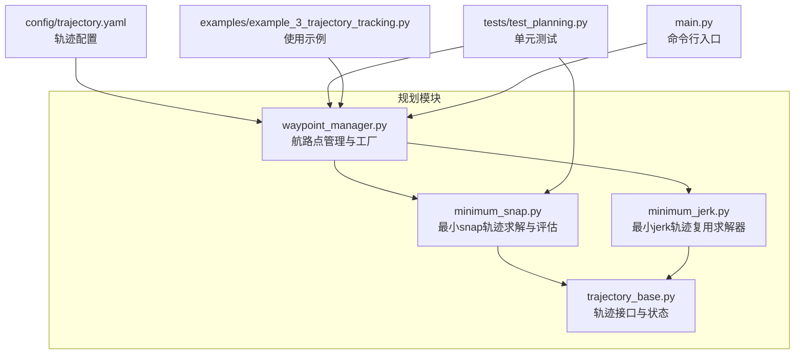
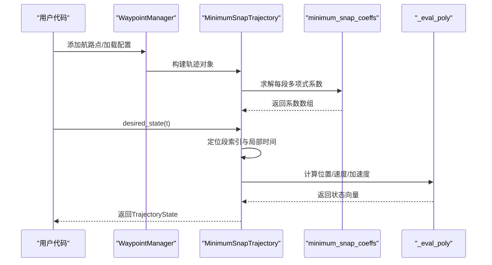
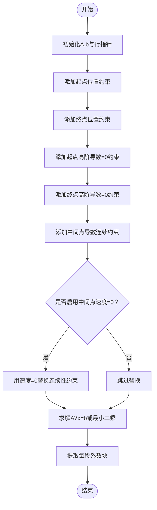
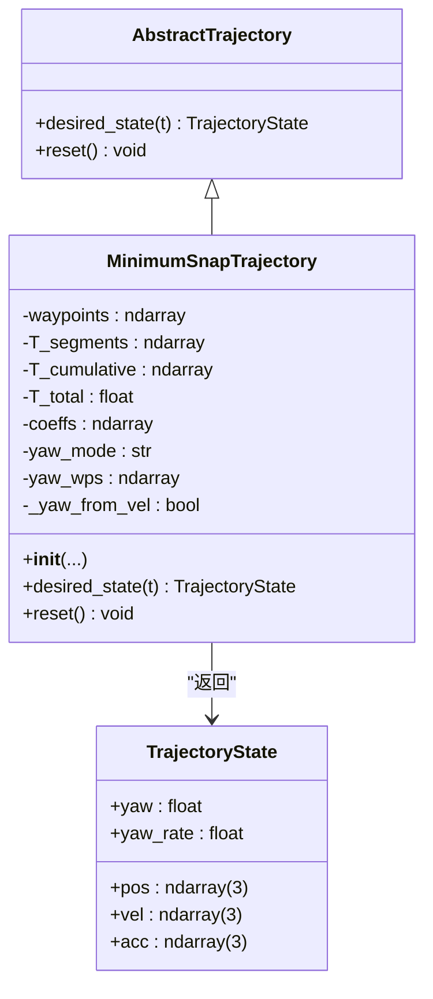
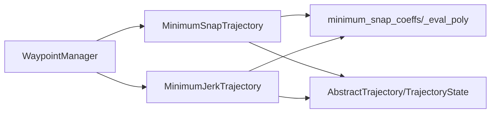

# 最小snap轨迹

<cite>
**本文引用的文件**
- [src/planning/minimum_snap.py](file://src/planning/minimum_snap.py)
- [src/planning/trajectory_base.py](file://src/planning/trajectory_base.py)
- [src/planning/waypoint_manager.py](file://src/planning/waypoint_manager.py)
- [src/planning/minimum_jerk.py](file://src/planning/minimum_jerk.py)
- [config/trajectory.yaml](file://config/trajectory.yaml)
- [tests/test_planning.py](file://tests/test_planning.py)
- [examples/example_3_trajectory_tracking.py](file://examples/example_3_trajectory_tracking.py)
- [main.py](file://main.py)
</cite>

## 目录
1. [简介](#简介)
2. [项目结构](#项目结构)
3. [核心组件](#核心组件)
4. [架构总览](#架构总览)
5. [详细组件分析](#详细组件分析)
6. [依赖关系分析](#依赖关系分析)
7. [性能与数值稳定性](#性能与数值稳定性)
8. [参数配置指南](#参数配置指南)
9. [使用示例](#使用示例)
10. [故障排查](#故障排查)
11. [结论](#结论)

## 简介
本技术文档聚焦于FixedWingSimulator中“最小snap轨迹”的数学原理与实现细节，涵盖：
- 数学原理：四阶导数（snap）最小化的目标函数、连续性与边界约束、矩阵构造思路
- 实现细节：minimum_snap_coeffs函数的系数求解流程、边界条件与中间点约束、数值稳定性处理
- 类设计：MinimumSnapTrajectory的航路点处理、段时长计算、累积时间管理、轨迹评估
- 使用与配置：航路点模式、平均速度、停止点约束、yaw模式等参数
- 性能与优化：数值条件数预警、大段时长稳健性、分段查询效率

## 项目结构
与最小snap轨迹直接相关的模块位于src/planning目录，关键文件如下：
- minimum_snap.py：最小snap轨迹的核心实现，含多项式系数求解与轨迹评估
- trajectory_base.py：轨迹接口抽象与状态数据结构
- minimum_jerk.py：最小jerk轨迹（deriv_order=3），复用最小snap求解器
- waypoint_manager.py：航路点管理与轨迹工厂，支持从YAML加载/保存
- config/trajectory.yaml：轨迹配置模板（类型、平均速度、yaw模式、航路点、循环）
- tests/test_planning.py：覆盖系数形状、边界满足、连续性、有限性等测试
- examples/example_3_trajectory_tracking.py：最小snap轨迹在仿真中的端到端使用示例
- main.py：命令行入口，支持选择轨迹类型

图表来源
- [src/planning/minimum_snap.py](file://src/planning/minimum_snap.py#L1-L253)
- [src/planning/minimum_jerk.py](file://src/planning/minimum_jerk.py#L1-L71)
- [src/planning/trajectory_base.py](file://src/planning/trajectory_base.py#L1-L47)
- [src/planning/waypoint_manager.py](file://src/planning/waypoint_manager.py#L1-L208)
- [config/trajectory.yaml](file://config/trajectory.yaml#L1-L23)
- [tests/test_planning.py](file://tests/test_planning.py#L1-L328)
- [examples/example_3_trajectory_tracking.py](file://examples/example_3_trajectory_tracking.py#L1-L194)
- [main.py](file://main.py#L1-L145)

章节来源
- [src/planning/minimum_snap.py](file://src/planning/minimum_snap.py#L1-L253)
- [src/planning/trajectory_base.py](file://src/planning/trajectory_base.py#L1-L47)
- [src/planning/waypoint_manager.py](file://src/planning/waypoint_manager.py#L1-L208)
- [config/trajectory.yaml](file://config/trajectory.yaml#L1-L23)

## 核心组件
- minimum_snap_coeffs：构建并求解线性系统，得到每段的多项式系数
- _eval_poly：对单段多项式进行求值或求导（位置/速度/加速度）
- MinimumSnapTrajectory：封装航路点、段时长、累积时间、轨迹评估与yaw策略
- TrajectoryState：统一的期望轨迹状态（位置、速度、加速度、偏航角与偏航率）
- WaypointManager：航路点增删改查、从YAML加载/保存、按类型生成轨迹对象
- MinimumJerkTrajectory：与最小snap共享求解器，仅改变多项式阶数

章节来源
- [src/planning/minimum_snap.py](file://src/planning/minimum_snap.py#L47-L142)
- [src/planning/minimum_snap.py](file://src/planning/minimum_snap.py#L145-L164)
- [src/planning/minimum_snap.py](file://src/planning/minimum_snap.py#L167-L253)
- [src/planning/trajectory_base.py](file://src/planning/trajectory_base.py#L16-L47)
- [src/planning/waypoint_manager.py](file://src/planning/waypoint_manager.py#L20-L208)
- [src/planning/minimum_jerk.py](file://src/planning/minimum_jerk.py#L17-L71)

## 架构总览
最小snap轨迹的完整工作流如下：
- WaypointManager接收航路点，根据配置生成轨迹对象（MinimumSnapTrajectory或MinimumJerkTrajectory）
- MinimumSnapTrajectory内部调用minimum_snap_coeffs求解每段多项式系数
- desired_state通过分段索引定位当前段，再用_eval_poly计算位置、速度、加速度
- 可选yaw策略：跟随速度方向或固定yaw（固定模式下对yaw单独求解）

图表来源
- [src/planning/waypoint_manager.py](file://src/planning/waypoint_manager.py#L127-L160)
- [src/planning/minimum_snap.py](file://src/planning/minimum_snap.py#L167-L253)
- [src/planning/minimum_snap.py](file://src/planning/minimum_snap.py#L47-L142)
- [src/planning/minimum_snap.py](file://src/planning/minimum_snap.py#L145-L164)

## 详细组件分析

### 数学原理与矩阵构造
- 目标：在每段空间维度上构造度为2M-1的多项式，使四阶导数（snap）最小化；M=4对应每段8个系数
- 约束：
  - 每段起点/终点位置约束（共2(n-1)条）
  - 起点/终点高阶导数（1..M-1阶）为零（共2(M-1)条）
  - 中间点处各阶导数连续（1..M-1阶，共(M-1)(n-2)条）
  - 可选：中间点速度为零（stop_at_waypoints=True时替换连续性约束）
- 线性系统：A·x = b，其中A为(n_total×n_total)、b为n_total维，n_total=M·(n-1)
- 数值处理：若条件数过大给出警告；若非奇异求解失败则退化为最小二乘

章节来源
- [src/planning/minimum_snap.py](file://src/planning/minimum_snap.py#L47-L142)

### minimum_snap_coeffs函数实现细节
- 输入输出
  - waypoints：(n, 3) NED航路点
  - T_segments：(n-1,) 段时长
  - deriv_order：默认4（snap），也可设为3（jerk）、2（加速度最小）
  - stop_at_waypoints：是否强制中间点速度为零
- 关键步骤
  - 针对每个空间维度独立构建A、b
  - 填充起点/终点位置约束
  - 填充起点/终点高阶导数为零约束
  - 填充中间点导数连续约束；当stop_at_waypoints=True时，以速度为零约束覆盖连续性
  - 求解：先尝试直接求解，失败则采用最小二乘；对病态系统给出条件数警告
  - 提取每段系数块并返回

图表来源
- [src/planning/minimum_snap.py](file://src/planning/minimum_snap.py#L47-L142)

章节来源
- [src/planning/minimum_snap.py](file://src/planning/minimum_snap.py#L47-L142)

### _eval_poly与轨迹评估
- 功能：对单段多项式在局部时间t_local求值或求k阶导数
- 参数：coeffs_seg为(M,d)系数矩阵，t_local∈[0,T_seg]，deriv为导数阶数
- 输出：沿各维度的值向量

章节来源
- [src/planning/minimum_snap.py](file://src/planning/minimum_snap.py#L145-L164)

### MinimumSnapTrajectory类设计
- 航路点处理
  - waypoints必须为(n,3)且至少2个点
  - 内部存储原始航路点与yaw模式/yaw_waypoints
- 段时长计算
  - 若未显式提供T_segments，则基于相邻航路点距离与average_speed估算
  - 保证最小段时长与非零速度阈值
- 累积时间管理
  - T_cumulative记录累计时间，T_total为总时长
- 轨迹评估
  - desired_state：定位当前段→计算局部时间→求值位置/速度/加速度
  - yaw策略：yaw_follow时在水平速度足够大时以速度方向作为偏航角；否则为0
  - 固定yaw模式：对yaw单独求解（固定模式下会构建独立的yaw轨迹系数）
- reset：无状态，无需重置

图表来源
- [src/planning/trajectory_base.py](file://src/planning/trajectory_base.py#L16-L47)
- [src/planning/minimum_snap.py](file://src/planning/minimum_snap.py#L167-L253)

章节来源
- [src/planning/minimum_snap.py](file://src/planning/minimum_snap.py#L167-L253)
- [src/planning/trajectory_base.py](file://src/planning/trajectory_base.py#L16-L47)

### WaypointManager与配置
- 航路点管理：支持逐点添加、批量添加、清空、从YAML加载/保存
- 配置项：traj_type（minimum_snap/minimum_jerk）、average_speed、yaw_mode、loop
- 生成轨迹：根据类型实例化对应轨迹对象；支持循环路径（首尾闭合）
- 辅助功能：获取当前活动段、总时长、委托desired_state

章节来源
- [src/planning/waypoint_manager.py](file://src/planning/waypoint_manager.py#L20-L208)
- [config/trajectory.yaml](file://config/trajectory.yaml#L1-L23)

### 与最小jerk轨迹的关系
- MinimumJerkTrajectory复用minimum_snap_coeffs，仅将deriv_order改为3
- 二者接口一致，均可通过WaypointManager按类型选择

章节来源
- [src/planning/minimum_jerk.py](file://src/planning/minimum_jerk.py#L17-L71)
- [src/planning/minimum_snap.py](file://src/planning/minimum_snap.py#L47-L142)

## 依赖关系分析
- WaypointManager依赖MinimumSnapTrajectory/MinimumJerkTrajectory与YAML配置
- MinimumSnapTrajectory依赖minimum_snap_coeffs与_eval_poly
- 所有轨迹类均实现AbstractTrajectory接口，返回TrajectoryState

图表来源
- [src/planning/waypoint_manager.py](file://src/planning/waypoint_manager.py#L127-L160)
- [src/planning/minimum_snap.py](file://src/planning/minimum_snap.py#L167-L253)
- [src/planning/minimum_jerk.py](file://src/planning/minimum_jerk.py#L17-L71)
- [src/planning/trajectory_base.py](file://src/planning/trajectory_base.py#L16-L47)

章节来源
- [src/planning/waypoint_manager.py](file://src/planning/waypoint_manager.py#L127-L160)
- [src/planning/minimum_snap.py](file://src/planning/minimum_snap.py#L167-L253)
- [src/planning/minimum_jerk.py](file://src/planning/minimum_jerk.py#L17-L71)
- [src/planning/trajectory_base.py](file://src/planning/trajectory_base.py#L16-L47)

## 性能与数值稳定性
- 条件数预警：当线性系统条件数过大（例如大段时长）时打印警告，提示可能的数值不稳定
- 病态系统处理：若直接求解失败，回退至最小二乘求解
- 大段时长稳健性：测试覆盖了较长段时长场景，确保系数仍为有限值
- 分段查询高效：desired_state使用累积时间与二分查找快速定位段索引，避免遍历

章节来源
- [src/planning/minimum_snap.py](file://src/planning/minimum_snap.py#L132-L137)
- [tests/test_planning.py](file://tests/test_planning.py#L109-L115)
- [src/planning/minimum_snap.py](file://src/planning/minimum_snap.py#L227-L234)

## 参数配置指南
- 航路点模式
  - WaypointManager支持逐点添加、批量添加、清空、从YAML加载/保存
  - YAML格式包含type、average_speed、yaw_mode、loop、waypoints等字段
- 平均速度average_speed
  - 当未显式提供T_segments时，用于按航路点距离估算段时长
- 停止点约束stop_at_waypoints
  - 为True时，中间航路点速度强制为零，替换连续性约束
- yaw模式
  - yaw_follow：在水平速度足够大时，偏航角跟随速度方向
  - zero：偏航角恒为0
  - fixed：固定偏航角，需提供yaw_waypoints
- 其他
  - loop：是否自动闭合路径（首尾相接）

章节来源
- [src/planning/waypoint_manager.py](file://src/planning/waypoint_manager.py#L80-L122)
- [config/trajectory.yaml](file://config/trajectory.yaml#L1-L23)
- [src/planning/minimum_snap.py](file://src/planning/minimum_snap.py#L181-L189)
- [src/planning/minimum_snap.py](file://src/planning/minimum_snap.py#L214-L223)

## 使用示例
- 命令行运行最小snap轨迹仿真
  - 通过命令行参数选择轨迹类型、风场、持续时间等
- 示例脚本展示
  - 在示例中定义方形航路点，使用WaypointManager添加航路点并运行闭环仿真
  - 保存轨迹图与CSV数据

章节来源
- [main.py](file://main.py#L69-L73)
- [examples/example_3_trajectory_tracking.py](file://examples/example_3_trajectory_tracking.py#L72-L98)

## 故障排查
- 轨迹构建报错：至少需要两个航路点
- 航路点维度错误：必须为(n,3) NED坐标
- 段时长过大导致条件数过大：可适当减小段时长或提高average_speed
- 中间点速度约束冲突：stop_at_waypoints与连续性约束互斥，启用后会覆盖相应连续性行
- yaw模式选择：yaw_follow在低速时可能无有效偏航角，可切换为zero或fixed

章节来源
- [src/planning/waypoint_manager.py](file://src/planning/waypoint_manager.py#L139-L140)
- [src/planning/minimum_snap.py](file://src/planning/minimum_snap.py#L191-L193)
- [src/planning/minimum_snap.py](file://src/planning/minimum_snap.py#L133-L135)

## 结论
最小snap轨迹通过严格的连续性与边界约束，在保证平滑的同时最小化四阶导数，适合固定翼平台的动态跟踪需求。其实现以矩阵构造为核心，辅以稳健的数值求解策略与清晰的类层次设计，既便于扩展（如最小jerk），也便于工程应用（航路点管理、配置驱动、闭环仿真）。建议在长段时长场景下关注条件数预警，并结合实际飞行速度合理设置average_speed与stop_at_waypoints策略。