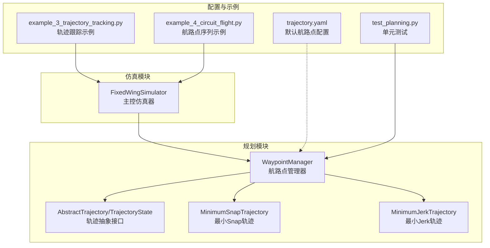
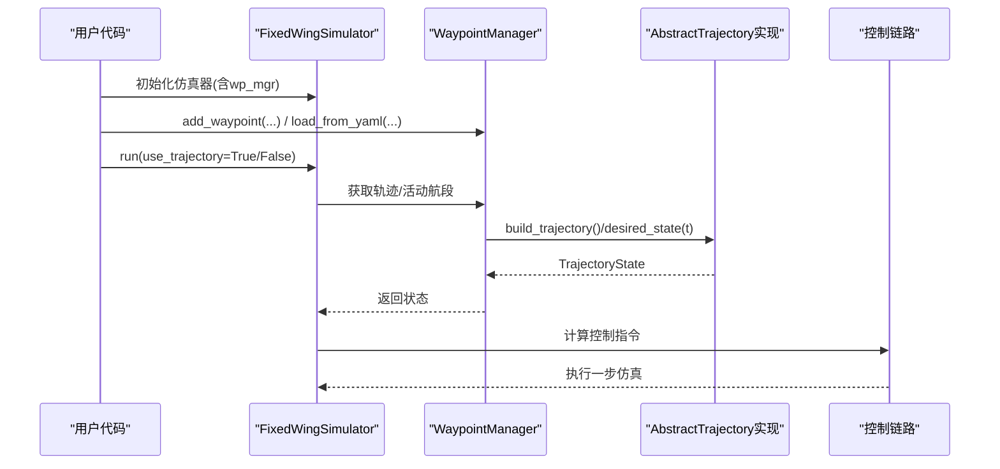
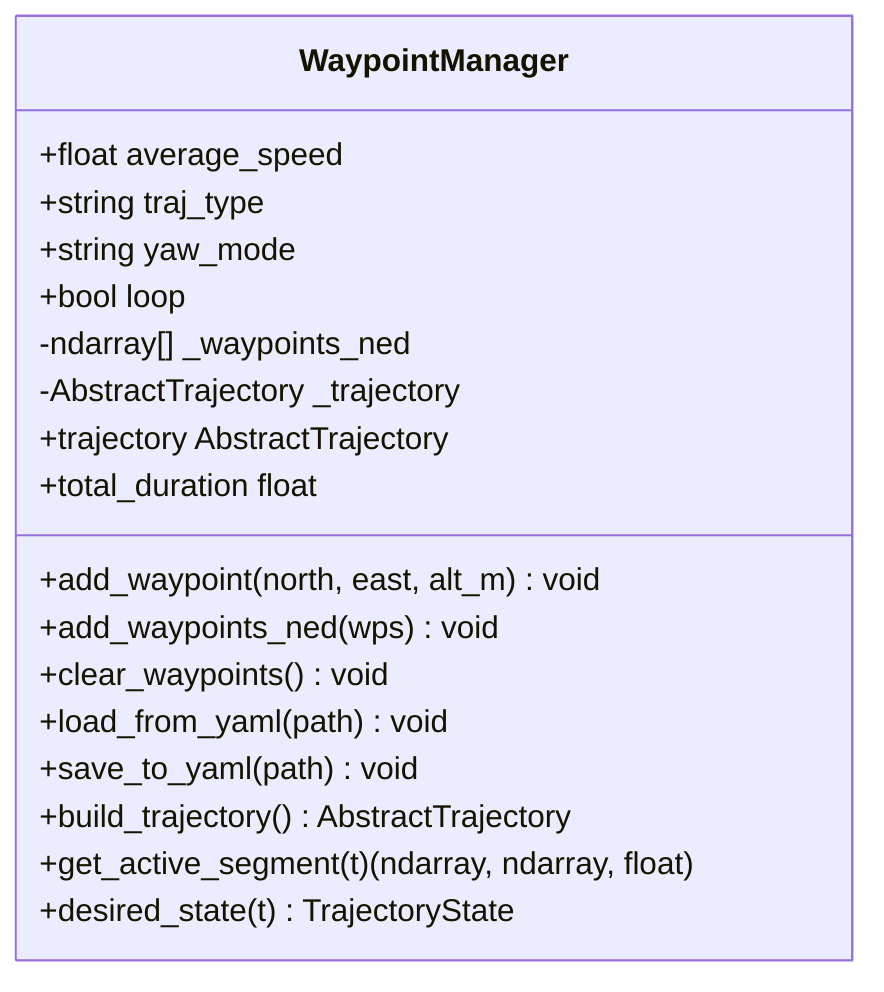
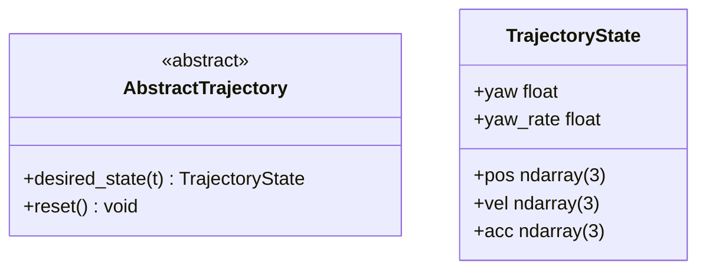
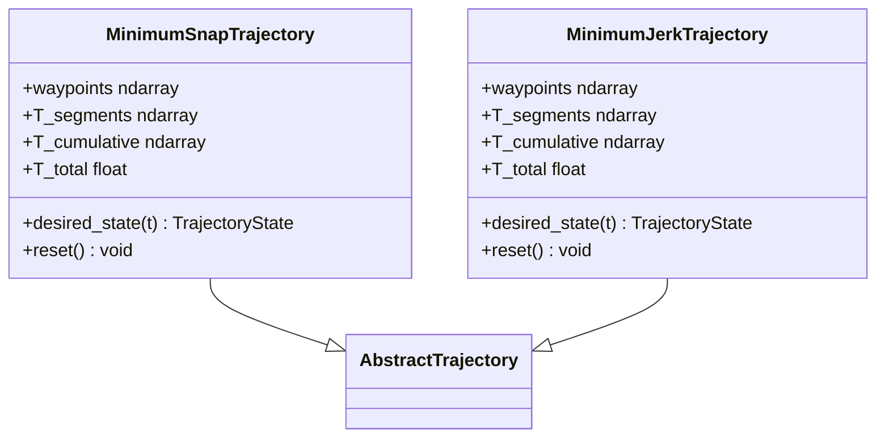
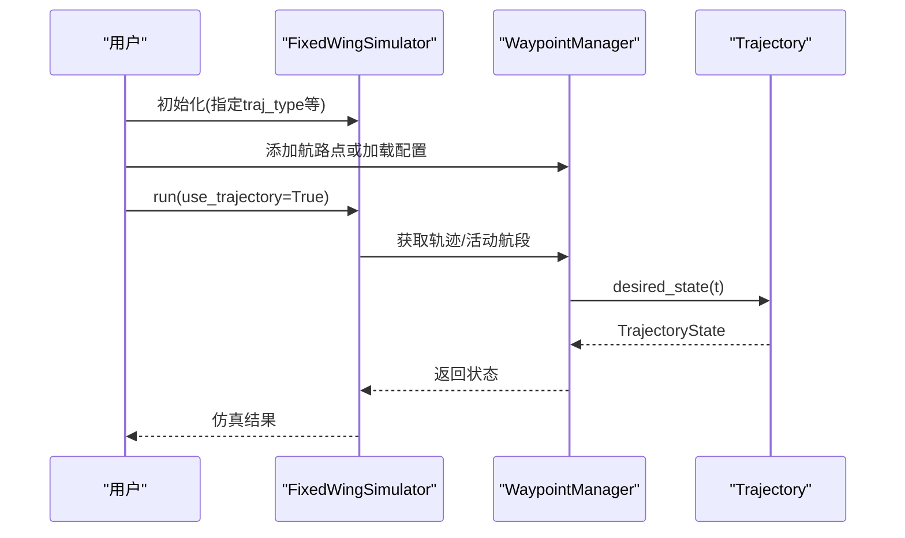
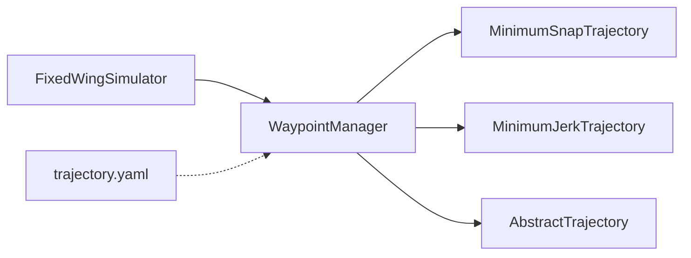

# 航路点管理

<cite>
**本文引用的文件**
- [src/planning/waypoint_manager.py](file://src/planning/waypoint_manager.py)
- [src/planning/trajectory_base.py](file://src/planning/trajectory_base.py)
- [src/planning/minimum_snap.py](file://src/planning/minimum_snap.py)
- [src/planning/minimum_jerk.py](file://src/planning/minimum_jerk.py)
- [src/simulation/simulator.py](file://src/simulation/simulator.py)
- [config/trajectory.yaml](file://config/trajectory.yaml)
- [tests/test_planning.py](file://tests/test_planning.py)
- [examples/example_3_trajectory_tracking.py](file://examples/example_3_trajectory_tracking.py)
- [examples/example_4_circuit_flight.py](file://examples/example_4_circuit_flight.py)
</cite>

## 目录
1. [简介](#简介)
2. [项目结构](#项目结构)
3. [核心组件](#核心组件)
4. [架构总览](#架构总览)
5. [详细组件分析](#详细组件分析)
6. [依赖关系分析](#依赖关系分析)
7. [性能考量](#性能考量)
8. [故障排查指南](#故障排查指南)
9. [结论](#结论)
10. [附录](#附录)

## 简介
本文件面向FixedWingSimulator中的航路点管理器（WaypointManager），系统化地介绍其功能、数据结构、使用方法与最佳实践。内容涵盖：
- 基本操作：添加、删除、批量导入导出航路点
- 数据结构：NED坐标系、正高转换、航段时长估计
- 高级特性：轨迹构建、活动航段查询、航路点验证与冲突检测
- 使用示例：最小抖动/最小加速度轨迹、航路点序列模式
- 最佳实践：路径规划、效率优化、错误处理

## 项目结构
与航路点管理相关的核心模块位于src/planning目录，仿真主控在src/simulation中集成WaypointManager，并通过配置文件config/trajectory.yaml提供默认航路点模板。

图表来源
- [src/planning/waypoint_manager.py](file://src/planning/waypoint_manager.py#L20-L208)
- [src/planning/trajectory_base.py](file://src/planning/trajectory_base.py#L16-L47)
- [src/planning/minimum_snap.py](file://src/planning/minimum_snap.py#L167-L253)
- [src/planning/minimum_jerk.py](file://src/planning/minimum_jerk.py#L17-L71)
- [src/simulation/simulator.py](file://src/simulation/simulator.py#L218-L230)
- [config/trajectory.yaml](file://config/trajectory.yaml#L1-L23)
- [tests/test_planning.py](file://tests/test_planning.py#L252-L328)
- [examples/example_3_trajectory_tracking.py](file://examples/example_3_trajectory_tracking.py#L70-L100)
- [examples/example_4_circuit_flight.py](file://examples/example_4_circuit_flight.py#L78-L122)

章节来源
- [src/planning/waypoint_manager.py](file://src/planning/waypoint_manager.py#L1-L208)
- [src/simulation/simulator.py](file://src/simulation/simulator.py#L218-L230)
- [config/trajectory.yaml](file://config/trajectory.yaml#L1-L23)

## 核心组件
- WaypointManager：集中管理航路点列表，支持添加、清空、从YAML加载/保存；根据当前航路点构建轨迹对象；提供活动航段查询与期望状态查询。
- AbstractTrajectory/TrajectoryState：定义统一的轨迹接口与状态容器（位置、速度、加速度、偏航角）。
- MinimumSnapTrajectory/MinimumJerkTrajectory：基于分段多项式的轨迹生成器，分别满足最小Snap与最小Jerk的连续性约束。
- FixedWingSimulator：在仿真运行前由用户显式设置航路点，或加载配置文件；运行时根据模式选择轨迹跟踪或航路点序列模式。

章节来源
- [src/planning/waypoint_manager.py](file://src/planning/waypoint_manager.py#L20-L208)
- [src/planning/trajectory_base.py](file://src/planning/trajectory_base.py#L16-L47)
- [src/planning/minimum_snap.py](file://src/planning/minimum_snap.py#L167-L253)
- [src/planning/minimum_jerk.py](file://src/planning/minimum_jerk.py#L17-L71)
- [src/simulation/simulator.py](file://src/simulation/simulator.py#L218-L230)

## 架构总览
WaypointManager作为“航路点+轨迹工厂”，向上提供TrajectoryState查询，向下封装最小Snap/Jerk轨迹构建细节。仿真器在运行前注入航路点，运行时根据模式选择轨迹跟踪或航路点序列导航。

图表来源
- [src/simulation/simulator.py](file://src/simulation/simulator.py#L239-L567)
- [src/planning/waypoint_manager.py](file://src/planning/waypoint_manager.py#L127-L208)
- [src/planning/minimum_snap.py](file://src/planning/minimum_snap.py#L227-L249)
- [src/planning/minimum_jerk.py](file://src/planning/minimum_jerk.py#L50-L67)

## 详细组件分析

### WaypointManager 类
- 职责
  - 维护航路点列表（NED坐标，正高转负下）
  - 提供航路点增删改查与批量导入导出
  - 按需构建轨迹对象（最小Snap/最小Jerk）
  - 查询活动航段与期望状态
- 关键属性
  - average_speed：平均速度，用于估算航段时长
  - traj_type：轨迹类型（minimum_snap/minimum_jerk）
  - yaw_mode：偏航模式（yaw_follow/zero/fixed）
  - loop：是否闭合回环
  - _waypoints_ned：航路点数组（NED）
  - _trajectory：缓存的轨迹对象
- 关键方法
  - add_waypoint(north, east, alt_m)：添加单个航路点（内部转换为NED）
  - add_waypoints_ned(wps)：批量添加NED格式航路点
  - clear_waypoints()：清空航路点
  - load_from_yaml(path)/save_to_yaml(path)：从/保存到YAML配置
  - build_trajectory()：构建并缓存轨迹对象
  - trajectory：属性访问，必要时自动构建
  - total_duration：总轨迹时长
  - get_active_segment(t)：返回当前时刻的起止航路点与剩余时间
  - desired_state(t)：委托给底层轨迹求解期望状态

图表来源
- [src/planning/waypoint_manager.py](file://src/planning/waypoint_manager.py#L20-L208)

章节来源
- [src/planning/waypoint_manager.py](file://src/planning/waypoint_manager.py#L20-L208)
- [tests/test_planning.py](file://tests/test_planning.py#L252-L328)

### 轨迹基类与状态
- AbstractTrajectory：定义desired_state(t)抽象接口
- TrajectoryState：包含位置、速度、加速度、偏航角与偏航率的3D状态容器

图表来源
- [src/planning/trajectory_base.py](file://src/planning/trajectory_base.py#L16-L47)

章节来源
- [src/planning/trajectory_base.py](file://src/planning/trajectory_base.py#L16-L47)

### 最小Snap与最小Jerk轨迹
- 最小Snap：四阶导数最小，满足位置、速度、加速度、偏航角在航段边界连续
- 最小Jerk：三阶导数最小，多项式阶次较低，轨迹更平滑
- 共同点：均以航段时长T_segments或基于平均速度估算T_segments；支持yaw_follow模式

图表来源
- [src/planning/minimum_snap.py](file://src/planning/minimum_snap.py#L167-L253)
- [src/planning/minimum_jerk.py](file://src/planning/minimum_jerk.py#L17-L71)

章节来源
- [src/planning/minimum_snap.py](file://src/planning/minimum_snap.py#L167-L253)
- [src/planning/minimum_jerk.py](file://src/planning/minimum_jerk.py#L17-L71)

### 仿真器中的集成
- 固定翼仿真器在初始化时创建WaypointManager实例，默认参数来自控制参数（如巡航空速）
- 运行时根据use_trajectory选择轨迹跟踪或航路点序列模式
- 轨迹跟踪模式下，会根据当前时刻查询活动航段并钳制目标高度范围

图表来源
- [src/simulation/simulator.py](file://src/simulation/simulator.py#L218-L230)
- [src/simulation/simulator.py](file://src/simulation/simulator.py#L376-L498)

章节来源
- [src/simulation/simulator.py](file://src/simulation/simulator.py#L218-L230)
- [src/simulation/simulator.py](file://src/simulation/simulator.py#L376-L498)

## 依赖关系分析
- WaypointManager依赖TrajectoryBase接口与具体轨迹实现（MinimumSnapTrajectory/MinimumJerkTrajectory）
- FixedWingSimulator依赖WaypointManager进行航路点管理与轨迹查询
- 配置文件trajectory.yaml提供默认航路点与参数，可直接加载到WaypointManager

图表来源
- [src/planning/waypoint_manager.py](file://src/planning/waypoint_manager.py#L15-L17)
- [src/simulation/simulator.py](file://src/simulation/simulator.py#L48-L48)
- [config/trajectory.yaml](file://config/trajectory.yaml#L1-L23)

章节来源
- [src/planning/waypoint_manager.py](file://src/planning/waypoint_manager.py#L15-L17)
- [src/simulation/simulator.py](file://src/simulation/simulator.py#L48-L48)
- [config/trajectory.yaml](file://config/trajectory.yaml#L1-L23)

## 性能考量
- 航段时长估计：当未显式提供T_segments时，基于相邻航路点距离与平均速度估算，避免过短航段导致数值病态
- 缓存策略：构建后的轨迹对象被缓存，新增/删除航路点后失效缓存，避免重复计算
- 循环轨迹：loop=True时自动闭合首尾航路点，确保闭环连续性
- 数值稳定性：最小Snap/Jerk系数求解采用矩阵构造与线性求解，对大航段时长具备一定鲁棒性

章节来源
- [src/planning/waypoint_manager.py](file://src/planning/waypoint_manager.py#L127-L160)
- [src/planning/minimum_snap.py](file://src/planning/minimum_snap.py#L200-L211)
- [src/planning/minimum_jerk.py](file://src/planning/minimum_jerk.py#L38-L48)

## 故障排查指南
- 至少需要两个航路点才能构建轨迹：否则抛出异常
- 航路点正高与NED下换算：传入alt_m为正高（向上），内部转换为NED下（负值）
- YAML配置字段不匹配：load_from_yaml会读取type、average_speed、yaw_mode、loop与waypoints，缺失字段使用默认值
- 单航路点模式：仿真器会合成虚拟航段以支持高度保持
- 航路点序列模式：未提供轨迹时，仿真器按航路点顺序飞行，到达阈值距离后切换下一个航路点

章节来源
- [src/planning/waypoint_manager.py](file://src/planning/waypoint_manager.py#L139-L140)
- [src/planning/waypoint_manager.py](file://src/planning/waypoint_manager.py#L98-L106)
- [src/simulation/simulator.py](file://src/simulation/simulator.py#L386-L408)
- [tests/test_planning.py](file://tests/test_planning.py#L289-L294)

## 结论
WaypointManager提供了简洁而强大的航路点管理能力：以NED坐标系统一管理航路点，支持最小Snap与最小Jerk两类轨迹生成，并与仿真器无缝集成。通过合理的参数配置与使用流程，可在保证轨迹连续性的同时提升仿真效率与可维护性。

## 附录

### 使用示例与最佳实践

- 示例一：轨迹跟踪（最小Snap）
  - 在仿真器初始化后，清空默认航路点并添加自定义航路点，然后运行仿真
  - 参考路径：[examples/example_3_trajectory_tracking.py](file://examples/example_3_trajectory_tracking.py#L70-L100)

- 示例二：航路点序列模式（无多项式轨迹）
  - 设置use_trajectory=False，启用航路点序列导航，达到阈值距离后自动切换下一个航路点
  - 参考路径：[examples/example_4_circuit_flight.py](file://examples/example_4_circuit_flight.py#L114-L119)

- 最佳实践
  - 航路点设计：尽量减少急转弯与高曲率段，提高轨迹连续性与控制稳定性
  - 参数选择：根据任务需求选择minimum_snap（更平滑）或minimum_jerk（更低抖动）
  - 时间分配：合理设置average_speed，避免过短航段导致数值不稳定
  - 配置复用：使用YAML保存/加载航路点，便于版本管理与团队协作
  - 错误处理：在构建轨迹前校验航路点数量与高度一致性，避免运行时异常

章节来源
- [examples/example_3_trajectory_tracking.py](file://examples/example_3_trajectory_tracking.py#L70-L100)
- [examples/example_4_circuit_flight.py](file://examples/example_4_circuit_flight.py#L114-L119)
- [config/trajectory.yaml](file://config/trajectory.yaml#L1-L23)