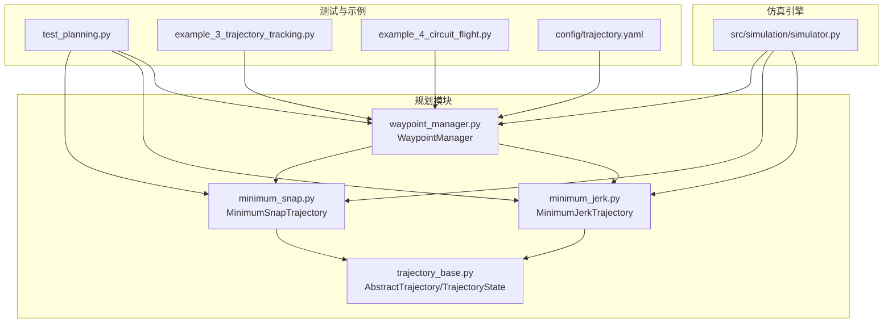
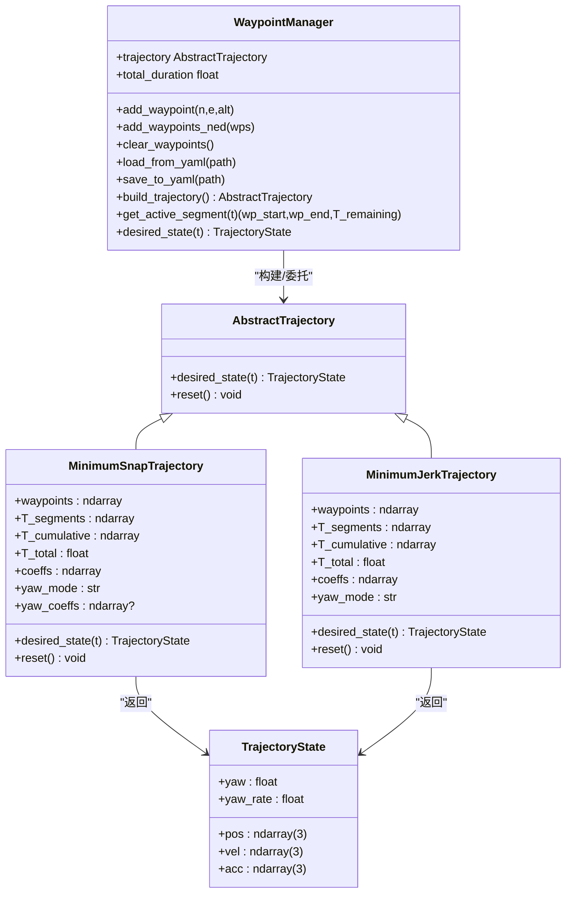
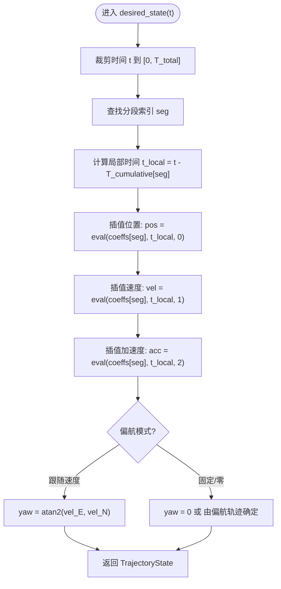
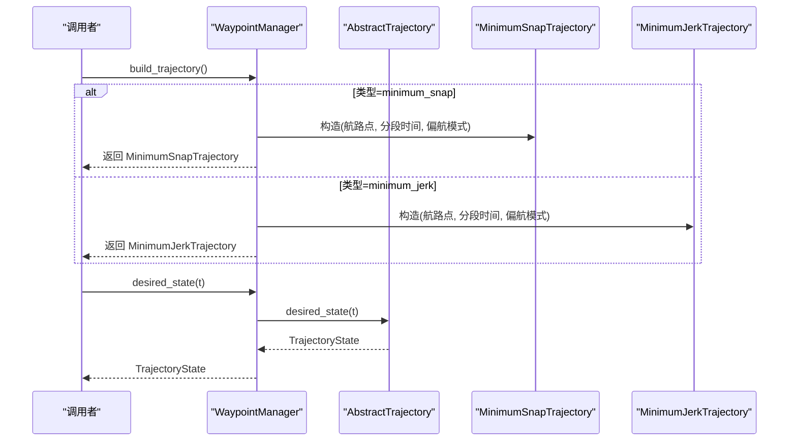
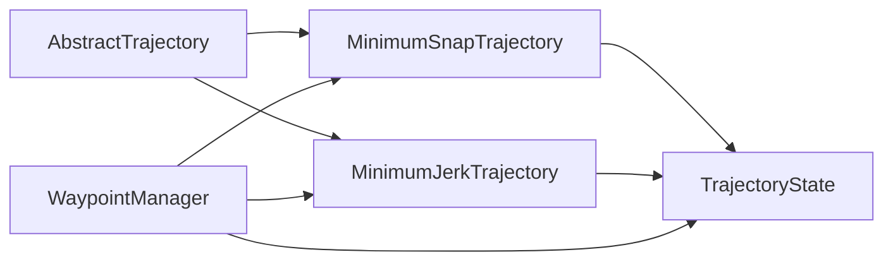

# 轨迹基类

<cite>
**本文引用的文件列表**
- [trajectory_base.py](file://src/planning/trajectory_base.py)
- [minimum_snap.py](file://src/planning/minimum_snap.py)
- [minimum_jerk.py](file://src/planning/minimum_jerk.py)
- [waypoint_manager.py](file://src/planning/waypoint_manager.py)
- [test_planning.py](file://tests/test_planning.py)
- [example_3_trajectory_tracking.py](file://examples/example_3_trajectory_tracking.py)
- [example_4_circuit_flight.py](file://examples/example_4_circuit_flight.py)
- [trajectory.yaml](file://config/trajectory.yaml)
- [simulator.py](file://src/simulation/simulator.py)
</cite>

## 目录
1. [引言](#引言)
2. [项目结构](#项目结构)
3. [核心组件](#核心组件)
4. [架构总览](#架构总览)
5. [详细组件分析](#详细组件分析)
6. [依赖关系分析](#依赖关系分析)
7. [性能考量](#性能考量)
8. [故障排查指南](#故障排查指南)
9. [结论](#结论)
10. [附录](#附录)

## 引言
本文件面向FixedWingSimulator的轨迹基类系统，系统性梳理AbstractTrajectory抽象基类与TrajectoryState数据结构的设计理念、接口规范与实现细节；解释最小快照与最小急曲线轨的实现机制；给出轨迹类的生命周期管理（初始化、状态更新、重置）与扩展指导；总结最佳实践与常见陷阱，帮助开发者快速上手并安全扩展自定义轨迹规划算法。

## 项目结构
轨迹系统位于planning包内，核心文件如下：
- 抽象基类与状态数据结构：trajectory_base.py
- 最小快照轨迹：minimum_snap.py
- 最小急曲线轨：minimum_jerk.py
- 航路点管理与轨迹工厂：waypoint_manager.py
- 单元测试：test_planning.py
- 使用示例：example_3_trajectory_tracking.py、example_4_circuit_flight.py
- 配置文件：config/trajectory.yaml
- 模拟器集成：src/simulation/simulator.py

图表来源
- [trajectory_base.py](file://src/planning/trajectory_base.py#L1-L47)
- [minimum_snap.py](file://src/planning/minimum_snap.py#L1-L253)
- [minimum_jerk.py](file://src/planning/minimum_jerk.py#L1-L71)
- [waypoint_manager.py](file://src/planning/waypoint_manager.py#L1-L208)
- [test_planning.py](file://tests/test_planning.py#L1-L328)
- [example_3_trajectory_tracking.py](file://examples/example_3_trajectory_tracking.py#L1-L194)
- [example_4_circuit_flight.py](file://examples/example_4_circuit_flight.py#L1-L275)
- [trajectory.yaml](file://config/trajectory.yaml#L1-L23)
- [simulator.py](file://src/simulation/simulator.py#L1-L642)

章节来源
- [trajectory_base.py](file://src/planning/trajectory_base.py#L1-L47)
- [minimum_snap.py](file://src/planning/minimum_snap.py#L1-L253)
- [minimum_jerk.py](file://src/planning/minimum_jerk.py#L1-L71)
- [waypoint_manager.py](file://src/planning/waypoint_manager.py#L1-L208)
- [test_planning.py](file://tests/test_planning.py#L1-L328)
- [example_3_trajectory_tracking.py](file://examples/example_3_trajectory_tracking.py#L1-L194)
- [example_4_circuit_flight.py](file://examples/example_4_circuit_flight.py#L1-L275)
- [trajectory.yaml](file://config/trajectory.yaml#L1-L23)
- [simulator.py](file://src/simulation/simulator.py#L1-L642)

## 核心组件
- AbstractTrajectory：定义轨迹接口，要求实现desired_state(t)返回TrajectoryState，并提供可选的reset()用于内部状态重置。
- TrajectoryState：描述某一时刻的期望轨迹状态，包含三维位置、速度、加速度以及偏航角与偏航率。
- MinimumSnapTrajectory：基于最小快照（四阶导数）的分段多项式轨迹，支持通过参数控制偏航模式与是否在航路点处停机。
- MinimumJerkTrajectory：基于最小急曲线轨（三阶导数）的分段五次多项式轨迹，接口与最小快照一致。
- WaypointManager：航路点管理与轨迹工厂，负责加载/保存航路点、构建轨迹对象、查询当前活动航段等。

章节来源
- [trajectory_base.py](file://src/planning/trajectory_base.py#L16-L47)
- [minimum_snap.py](file://src/planning/minimum_snap.py#L167-L253)
- [minimum_jerk.py](file://src/planning/minimum_jerk.py#L17-L71)
- [waypoint_manager.py](file://src/planning/waypoint_manager.py#L20-L208)

## 架构总览
轨迹系统采用“抽象基类 + 具体实现 + 工厂管理”的分层架构：
- 抽象层：AbstractTrajectory统一接口，确保所有轨迹实现具备相同的行为契约。
- 数据层：TrajectoryState以数据类形式承载状态向量，便于跨模块传递与记录。
- 实现层：MinimumSnapTrajectory与MinimumJerkTrajectory分别对应不同的优化目标（最小快照 vs 最小急曲线轨），共享系数求解与插值逻辑。
- 管理层：WaypointManager负责航路点的增删改查、轨迹构建与缓存、活动航段查询等。

图表来源
- [trajectory_base.py](file://src/planning/trajectory_base.py#L16-L47)
- [minimum_snap.py](file://src/planning/minimum_snap.py#L167-L253)
- [minimum_jerk.py](file://src/planning/minimum_jerk.py#L17-L71)
- [waypoint_manager.py](file://src/planning/waypoint_manager.py#L20-L208)

## 详细组件分析

### 抽象基类与状态数据结构
- 设计理念
  - 通过抽象基类约束所有轨迹实现必须提供“按时间查询期望状态”的能力，保证上层控制器与仿真引擎无需关心具体轨迹类型。
  - TrajectoryState以数据类封装，字段明确、默认零初始化，便于直接记录与可视化。
- 接口规范
  - desired_state(t: float) -> TrajectoryState：输入当前仿真时间秒，输出该时刻的期望状态。
  - reset()：可选，用于重置内部状态（如分段索引）。默认空实现。
- 状态变量语义
  - 位置pos：NED坐标系（北、东、下），单位米。
  - 速度vel：NED坐标系速度，单位米/秒。
  - 加速度acc：NED坐标系加速度，单位米/秒平方。
  - 偏航角yaw：期望偏航角（弧度），通常由轨迹或导航控制器计算。
  - 偏航率yaw_rate：期望偏航角变化率（弧度/秒），默认为0（可由具体实现填充）。

章节来源
- [trajectory_base.py](file://src/planning/trajectory_base.py#L16-L47)

### TrajectoryState数据结构详解
- 字段与维度
  - pos/vel/acc均为三维向量，适配固定翼NED坐标系。
  - yaw/yaw_rate为标量，分别表示期望偏航角与偏航率。
- 默认值与初始化
  - 位置、速度、加速度默认零向量，偏航角与偏航率默认0，确保未设置时不会引入异常值。
- 使用场景
  - 控制器将TrajectoryState作为参考输入，结合当前飞行状态进行误差计算与控制律生成。
  - 记录器可直接保存TrajectoryState字段，便于后续分析与可视化。

章节来源
- [trajectory_base.py](file://src/planning/trajectory_base.py#L16-L24)

### 最小快照轨迹（MinimumSnapTrajectory）
- 核心思想
  - 每个空间轴（N、E、D）及偏航角在每个分段使用2*M-1阶多项式，M=4对应最小快照（四阶导数）。
  - 通过线性方程组施加边界条件与连续性约束，求解各分段多项式系数。
- 关键流程
  - 系数求解：minimum_snap_coeffs根据航路点、分段时间与导数阶数生成系数数组。
  - 插值评估：_eval_poly对单一分段在局部时间t_local求位置、速度、加速度。
  - 偏航策略：支持“跟随速度方向”、“固定偏航角”或“零偏航”，后者通过独立的二阶多项式求解得到偏航轨迹。
- 时间管理
  - 维护T_segments、T_cumulative与T_total，用于分段查找与时间裁剪。
  - desired_state对输入时间进行裁剪，保证t∈[0, T_total]。
- 生命周期
  - 初始化：校验航路点维度、计算分段时间、求解系数、可选构建偏航系数。
  - 状态更新：按需查找分段并插值。
  - 重置：无内部状态，reset为空实现。

图表来源
- [minimum_snap.py](file://src/planning/minimum_snap.py#L227-L249)

章节来源
- [minimum_snap.py](file://src/planning/minimum_snap.py#L1-L253)

### 最小急曲线轨（MinimumJerkTrajectory）
- 核心思想
  - 每分段使用五次多项式（deriv_order=3），满足边界条件与连续性，目标是最小化急曲线（三阶导数）。
  - 接口与最小快照一致，便于替换与对比。
- 关键流程
  - 初始化：计算分段时间、累积时间、求解系数。
  - desired_state：查找分段、局部时间、插值位置/速度/加速度。
  - 偏航：当速度水平分量足够大时，偏航角跟随速度方向。
- 生命周期
  - 初始化：校验航路点、计算分段时间、求解系数。
  - 状态更新：与最小快照相同。
  - 重置：空实现。

章节来源
- [minimum_jerk.py](file://src/planning/minimum_jerk.py#L1-L71)

### 航路点管理与轨迹工厂（WaypointManager）
- 职责
  - 航路点存储与转换：接收正上方为正的海拔，内部转换为NED下坐标。
  - 轨迹构建：根据类型选择MinimumSnapTrajectory或MinimumJerkTrajectory，缓存轨迹对象。
  - 活动航段查询：给定时间t，返回当前航段起点、终点与剩余时间。
  - 配置读写：支持从YAML加载/保存航路点与轨迹配置。
- 关键行为
  - build_trajectory：校验航路点数量≥2，必要时闭合环路，构造轨迹实例。
  - get_active_segment：基于T_cumulative定位当前航段，计算剩余时间。
  - desired_state：委托底层轨迹对象。

图表来源
- [waypoint_manager.py](file://src/planning/waypoint_manager.py#L127-L167)
- [minimum_snap.py](file://src/planning/minimum_snap.py#L167-L253)
- [minimum_jerk.py](file://src/planning/minimum_jerk.py#L17-L71)

章节来源
- [waypoint_manager.py](file://src/planning/waypoint_manager.py#L1-L208)

### 仿真引擎中的轨迹使用
- 在仿真主循环中，若启用轨迹跟踪，则通过wp_mgr.trajectory.desired_state(t)获取期望状态，并将其投影到当前航段高度边界内，再交由导航控制器生成控制指令。
- 若未启用轨迹跟踪（仅航路点顺序飞越），则直接使用当前目标航路点作为导航目标。

章节来源
- [simulator.py](file://src/simulation/simulator.py#L478-L497)
- [simulator.py](file://src/simulation/simulator.py#L544-L547)

## 依赖关系分析
- 抽象依赖
  - 所有轨迹实现均依赖AbstractTrajectory接口，确保统一的desired_state契约。
  - TrajectoryState被所有轨迹实现返回，作为状态载体。
- 内部依赖
  - MinimumSnapTrajectory依赖minimum_snap_coeffs与_eval_poly进行系数求解与插值。
  - WaypointManager依赖两种轨迹实现以构建具体对象。
- 外部依赖
  - NumPy用于数值计算与数组操作。
  - YAML用于配置文件读写（WaypointManager）。
  - 测试依赖pytest与NumPy断言。

图表来源
- [trajectory_base.py](file://src/planning/trajectory_base.py#L26-L47)
- [minimum_snap.py](file://src/planning/minimum_snap.py#L167-L253)
- [minimum_jerk.py](file://src/planning/minimum_jerk.py#L17-L71)
- [waypoint_manager.py](file://src/planning/waypoint_manager.py#L127-L167)

章节来源
- [trajectory_base.py](file://src/planning/trajectory_base.py#L1-L47)
- [minimum_snap.py](file://src/planning/minimum_snap.py#L1-L253)
- [minimum_jerk.py](file://src/planning/minimum_jerk.py#L1-L71)
- [waypoint_manager.py](file://src/planning/waypoint_manager.py#L1-L208)

## 性能考量
- 矩阵求解稳定性
  - 当分段时间过大时，线性系统可能病态，代码会打印警告并退化为最小二乘求解，确保结果有限但可能精度下降。
- 时间复杂度
  - 系数求解阶段：O(N^3)（矩阵求解），N为分段总数与维度相关。
  - 每步查询：O(log N)（二分查找分段）+ O(1)（多项式求值），整体近似O(log N)。
- 数值精度
  - 插值使用多项式系数与导数阶数计算，建议避免在极短分段或极高阶多项式下运行，以免放大舍入误差。
- 内存占用
  - 主要开销来自存储每分段的多项式系数与累计时间数组，随航路点数量线性增长。

章节来源
- [minimum_snap.py](file://src/planning/minimum_snap.py#L132-L142)

## 故障排查指南
- 常见问题与定位
  - 轨迹未构建：检查航路点数量是否至少为2，否则抛出异常。
  - 偏航角异常：确认偏航模式设置与速度阈值，避免在低速时误用跟随模式。
  - 时间越界：desired_state对时间进行裁剪，若出现不连续，检查外部调用是否传入负时间或超过T_total。
  - 病态系统：当分段时间过大时，可能出现非有限系数，应适当增大平均速度或减少分段时间。
- 单元测试要点
  - 位置/速度/加速度维度一致性与有限性验证。
  - 起止点与航路点处位置满足性。
  - 分段边界处速度连续性。
  - 时间裁剪前后行为一致性。

章节来源
- [test_planning.py](file://tests/test_planning.py#L51-L328)
- [waypoint_manager.py](file://src/planning/waypoint_manager.py#L139-L158)
- [minimum_snap.py](file://src/planning/minimum_snap.py#L132-L142)

## 结论
轨迹基类系统以清晰的抽象与稳健的实现，为固定翼仿真提供了可替换、可扩展的轨迹规划框架。通过统一的接口与状态载体，上层控制器与仿真引擎能够无缝对接不同类型的轨迹；通过工厂化的航路点管理，用户可以便捷地加载/保存配置并切换轨迹类型。遵循本文的最佳实践与注意事项，可有效提升轨迹系统的可靠性与可维护性。

## 附录

### 轨迹类继承与实现指导
- 必须实现的方法
  - desired_state(t: float) -> TrajectoryState：按时间返回期望状态，内部应完成分段查找与插值。
  - 可选实现：reset()，用于重置内部状态（如分段索引、累计时间等）。
- 接口实现要点
  - 输入时间裁剪：确保t∈[0, T_total]，避免越界访问。
  - 分段查找：使用二分搜索定位当前分段，计算局部时间t_local。
  - 插值评估：使用已实现的多项式求值函数，分别计算位置、速度、加速度。
  - 偏航策略：根据任务需求选择跟随速度、固定偏航或零偏航。
- 性能与健壮性
  - 避免在极短分段或极大分段时间下运行，防止矩阵病态。
  - 对非有限结果进行显式检查与降级处理。
- 错误处理
  - 对无效输入（如航路点维度不符、分段数不足）抛出明确异常。
  - 在轨迹不可用时，提供合理的默认行为（如零状态或最近状态）。

章节来源
- [trajectory_base.py](file://src/planning/trajectory_base.py#L26-L47)
- [minimum_snap.py](file://src/planning/minimum_snap.py#L227-L249)
- [minimum_jerk.py](file://src/planning/minimum_jerk.py#L50-L67)

### 使用示例与配置
- 示例程序展示了如何在仿真中启用轨迹跟踪与航路点顺序飞越两种模式。
- 配置文件提供轨迹类型、平均速度、偏航模式与航路点列表等参数。

章节来源
- [example_3_trajectory_tracking.py](file://examples/example_3_trajectory_tracking.py#L70-L98)
- [example_4_circuit_flight.py](file://examples/example_4_circuit_flight.py#L81-L119)
- [trajectory.yaml](file://config/trajectory.yaml#L1-L23)