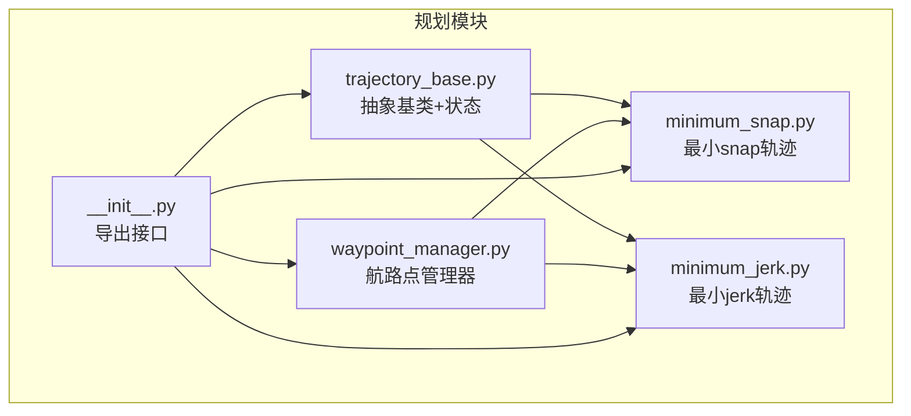
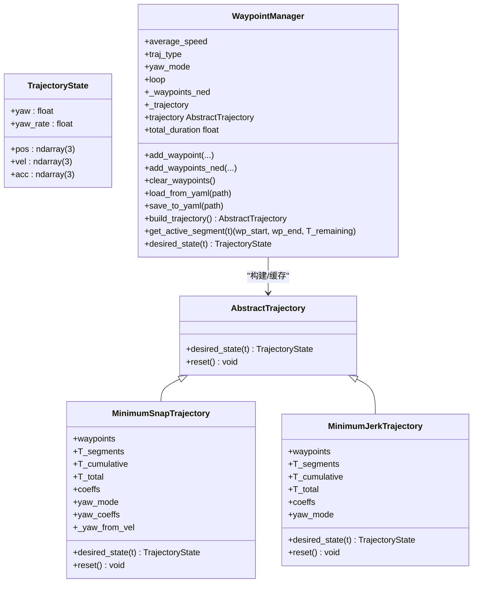
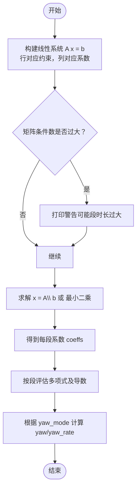
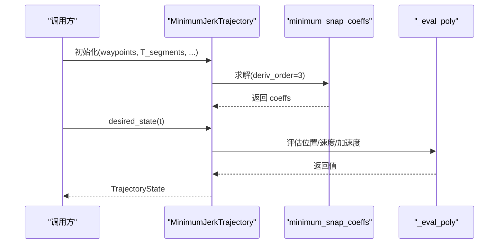
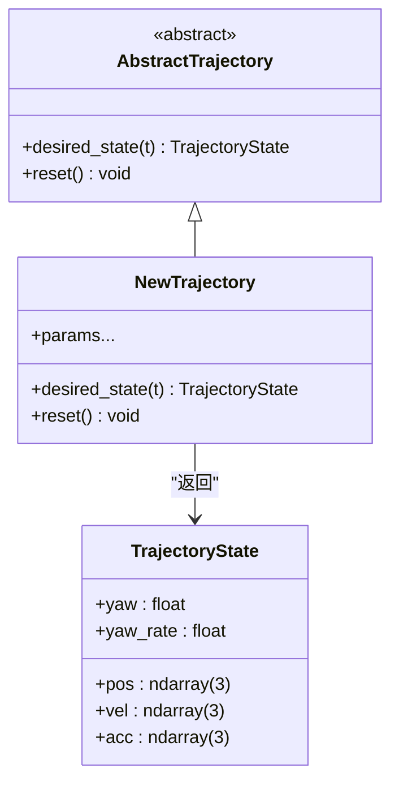
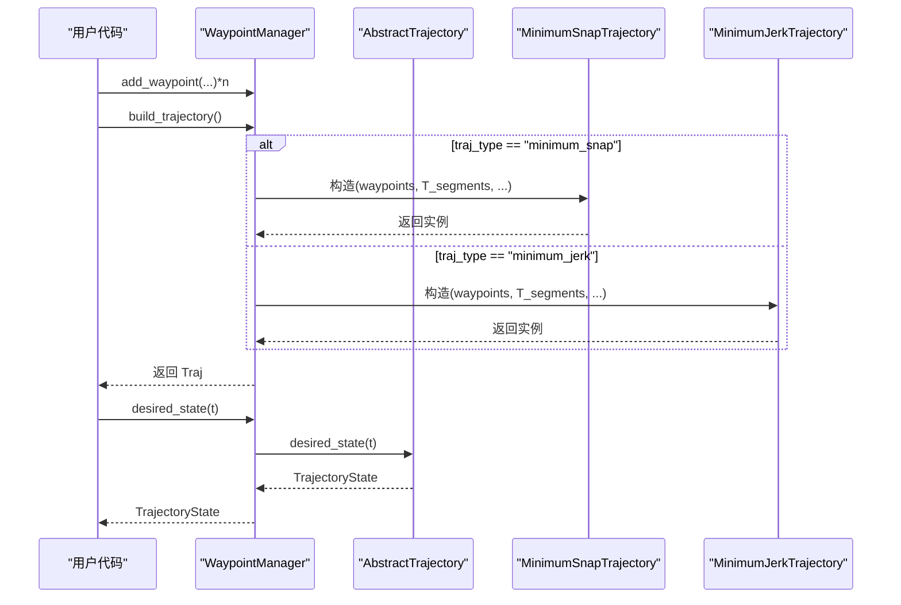
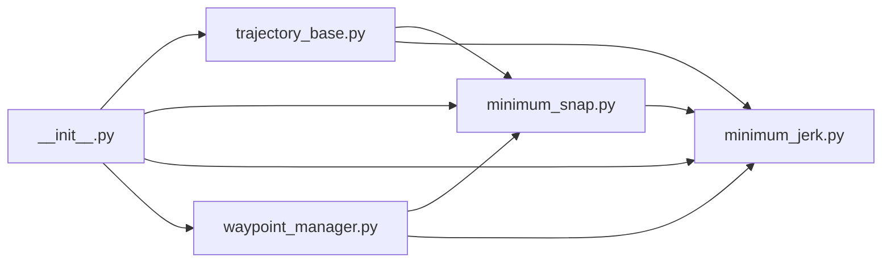

# 轨迹规划

<cite>
**本文引用的文件**
- [src/planning/__init__.py](file://src/planning/__init__.py)
- [src/planning/minimum_snap.py](file://src/planning/minimum_snap.py)
- [src/planning/minimum_jerk.py](file://src/planning/minimum_jerk.py)
- [src/planning/trajectory_base.py](file://src/planning/trajectory_base.py)
- [src/planning/waypoint_manager.py](file://src/planning/waypoint_manager.py)
- [config/trajectory.yaml](file://config/trajectory.yaml)
- [examples/example_3_trajectory_tracking.py](file://examples/example_3_trajectory_tracking.py)
- [tests/test_planning.py](file://tests/test_planning.py)
- [src/visualization/plotter.py](file://src/visualization/plotter.py)
- [src/simulation/simulator.py](file://src/simulation/simulator.py)
</cite>

## 目录
1. [简介](#简介)
2. [项目结构](#项目结构)
3. [核心组件](#核心组件)
4. [架构总览](#架构总览)
5. [详细组件分析](#详细组件分析)
6. [依赖关系分析](#依赖关系分析)
7. [性能考量](#性能考量)
8. [故障排查指南](#故障排查指南)
9. [结论](#结论)
10. [附录](#附录)

## 简介
本文件面向FixedWingSimulator的轨迹规划模块，系统性阐述最小snap与最小jerk两类轨迹规划算法的数学原理与实现要点，说明航路点管理器的功能与使用方法，介绍轨迹基类设计与扩展机制，并给出参数设置、可视化与验证方法，以及与控制系统集成的实现细节。目标是帮助读者在保证加加速度（snap）或加速度（jerk）连续性的前提下，快速生成满足固定翼飞行器动力学特性的最优轨迹。

## 项目结构
轨迹规划模块位于src/planning目录，包含以下关键文件：
- trajectory_base.py：轨迹抽象基类与状态数据结构
- minimum_snap.py：最小snap轨迹生成与求解
- minimum_jerk.py：最小jerk轨迹生成（复用最小snap求解器）
- waypoint_manager.py：航路点管理与轨迹工厂
- __init__.py：导出公共接口

此外，配置文件config/trajectory.yaml提供默认轨迹类型、平均速度、偏航模式与航路点列表；示例脚本examples/example_3_trajectory_tracking.py演示了在仿真中使用最小snap轨迹进行闭环跟踪；测试tests/test_planning.py覆盖多项关键行为与边界条件。

图表来源
- [src/planning/trajectory_base.py](file://src/planning/trajectory_base.py#L1-L47)
- [src/planning/minimum_snap.py](file://src/planning/minimum_snap.py#L1-L253)
- [src/planning/minimum_jerk.py](file://src/planning/minimum_jerk.py#L1-L71)
- [src/planning/waypoint_manager.py](file://src/planning/waypoint_manager.py#L1-L208)
- [src/planning/__init__.py](file://src/planning/__init__.py#L1-L14)

章节来源
- [src/planning/__init__.py](file://src/planning/__init__.py#L1-L14)
- [config/trajectory.yaml](file://config/trajectory.yaml#L1-L23)

## 核心组件
- 抽象轨迹基类与状态
  - AbstractTrajectory：定义统一接口desired_state(t)返回TrajectoryState
  - TrajectoryState：包含位置、速度、加速度、偏航角及其时间导数
- 最小snap轨迹
  - 以四阶导数（snap）最小化为目标，构建每段2M-1次多项式（M=4），保证位置、速度、加速度、加加速度连续
  - 支持在航路点处零速（stop_at_waypoints）
- 最小jerk轨迹
  - 以三阶导数（jerk）最小化为目标，构建每段2M-1次多项式（M=3），即五阶多项式
  - 复用最小snap求解器，仅改变导数阶数
- 航路点管理器
  - 维护NED坐标系航路点列表，支持添加、清空、从YAML加载/保存
  - 按需构建轨迹对象，提供当前活动航段查询与便捷desired_state委托

章节来源
- [src/planning/trajectory_base.py](file://src/planning/trajectory_base.py#L16-L47)
- [src/planning/minimum_snap.py](file://src/planning/minimum_snap.py#L167-L253)
- [src/planning/minimum_jerk.py](file://src/planning/minimum_jerk.py#L17-L71)
- [src/planning/waypoint_manager.py](file://src/planning/waypoint_manager.py#L20-L208)

## 架构总览
轨迹规划模块采用“基类抽象 + 具体实现 + 工厂管理”的分层设计：
- 基类层：AbstractTrajectory定义统一接口，TrajectoryState封装状态
- 实现层：MinimumSnapTrajectory与MinimumJerkTrajectory分别实现不同平滑准则
- 管理层：WaypointManager集中管理航路点、构建轨迹、暴露活动航段信息

图表来源
- [src/planning/trajectory_base.py](file://src/planning/trajectory_base.py#L16-L47)
- [src/planning/minimum_snap.py](file://src/planning/minimum_snap.py#L167-L253)
- [src/planning/minimum_jerk.py](file://src/planning/minimum_jerk.py#L17-L71)
- [src/planning/waypoint_manager.py](file://src/planning/waypoint_manager.py#L20-L208)

## 详细组件分析

### 数学原理与实现：最小snap轨迹
- 目标函数
  - 对每段空间维度（N、E、D、Yaw）构造2M-1次多项式，M=4时最小化四阶导数（snap）的积分平方，确保加加速度连续
- 约束条件
  - 每段起点/终点位置约束
  - 起点/终点若干阶导数（1..M-1）为零（边界条件）
  - 中间航路点处位置、速度、加速度、加加速度连续（共4阶连续）
  - 可选在中间航路点强制速度为零（stop_at_waypoints）
- 求解策略
  - 将多项式系数排列成线性系统Ax=b，使用数值求解器（条件良好时直接求解，否则采用最小二乘）
  - 评估时对每段局部时间t_local计算位置、速度、加速度，偏航根据模式选择
- 时间分配
  - 若未显式给定段时长，按航路点间距离与平均速度估算

图表来源
- [src/planning/minimum_snap.py](file://src/planning/minimum_snap.py#L47-L142)
- [src/planning/minimum_snap.py](file://src/planning/minimum_snap.py#L145-L164)
- [src/planning/minimum_snap.py](file://src/planning/minimum_snap.py#L227-L250)

章节来源
- [src/planning/minimum_snap.py](file://src/planning/minimum_snap.py#L1-L253)

### 数学原理与实现：最小jerk轨迹
- 目标函数
  - M=3时最小化三阶导数（jerk）的积分平方，即每段五阶多项式
- 约束条件
  - 同最小snap，但连续阶数降低（仅位置、速度连续）
- 求解策略
  - 直接复用minimum_snap_coeffs，仅将deriv_order设为3
- 时间分配
  - 与最小snap一致

图表来源
- [src/planning/minimum_jerk.py](file://src/planning/minimum_jerk.py#L24-L67)
- [src/planning/minimum_snap.py](file://src/planning/minimum_snap.py#L47-L142)

章节来源
- [src/planning/minimum_jerk.py](file://src/planning/minimum_jerk.py#L1-L71)

### 轨迹基类设计与扩展机制
- 设计要点
  - 抽象接口：所有具体轨迹必须实现desired_state(t)，返回TrajectoryState
  - 默认reset为空实现，便于可重置/无状态轨迹
  - TrajectoryState统一状态载体，便于控制链读取
- 扩展建议
  - 新增轨迹类型：继承AbstractTrajectory，实现desired_state与reset
  - 状态扩展：在TrajectoryState中增加所需字段（如角加速度、角速度等）
  - 参数化：通过构造函数注入约束、平滑参数、模式开关

图表来源
- [src/planning/trajectory_base.py](file://src/planning/trajectory_base.py#L16-L47)

章节来源
- [src/planning/trajectory_base.py](file://src/planning/trajectory_base.py#L1-L47)

### 航路点管理器：功能与使用
- 功能清单
  - 添加单个/批量航路点（NED格式，海拔正向上转换为NED向下）
  - 清空航路点
  - 从YAML加载/保存配置（含轨迹类型、平均速度、偏航模式、循环标志、航路点列表）
  - 构建轨迹对象（缓存），支持minimum_snap与minimum_jerk
  - 查询当前活动航段与剩余时间
  - 提供便捷的desired_state委托
- 使用方法
  - WaypointManager(average_speed, traj_type, yaw_mode, loop)
  - add_waypoint(...) / add_waypoints_ned(...)
  - build_trajectory() 或直接使用trajectory属性
  - get_active_segment(t) 获取当前航段起止点与剩余时间
  - desired_state(t) 获取期望状态

图表来源
- [src/planning/waypoint_manager.py](file://src/planning/waypoint_manager.py#L127-L160)
- [src/planning/waypoint_manager.py](file://src/planning/waypoint_manager.py#L205-L208)

章节来源
- [src/planning/waypoint_manager.py](file://src/planning/waypoint_manager.py#L1-L208)

### 参数设置指南
- 配置文件config/trajectory.yaml
  - type：轨迹类型，支持minimum_snap、minimum_jerk等（其他类型在当前版本中未实现）
  - average_speed：用于估算段时长（m/s）
  - yaw_mode：偏航模式，支持yaw_follow等
  - waypoints：航路点列表，每个点[N, E, alt_up]（内部转换为NED坐标）
  - loop：是否循环回到首航路点
- WaypointManager构造参数
  - average_speed、traj_type、yaw_mode、loop
- 轨迹类构造参数
  - waypoints、T_segments（可为None，自动基于平均速度与距离估计）、stop_at_waypoints（是否在中间航路点零速）

章节来源
- [config/trajectory.yaml](file://config/trajectory.yaml#L1-L23)
- [src/planning/waypoint_manager.py](file://src/planning/waypoint_manager.py#L35-L45)
- [src/planning/minimum_snap.py](file://src/planning/minimum_snap.py#L181-L189)
- [src/planning/minimum_jerk.py](file://src/planning/minimum_jerk.py#L24-L31)

### 轨迹可视化与验证
- 示例脚本
  - examples/example_3_trajectory_tracking.py展示了如何在仿真中使用WaypointManager与MinimumSnapTrajectory，并输出CSV与多幅图
- 可视化工具
  - src/visualization/plotter.py提供Matplotlib与Plotly两类绘图接口，支持6-DOF时域图、3D轨迹图等
- 验证方法
  - 单元测试tests/test_planning.py覆盖多项关键点：端点满足、连续性、有限性、边界条件、航段剩余时间等
  - 在仿真中记录des_north/des_east/des_down（若可用）并与实际轨迹叠加对比

章节来源
- [examples/example_3_trajectory_tracking.py](file://examples/example_3_trajectory_tracking.py#L1-L194)
- [src/visualization/plotter.py](file://src/visualization/plotter.py#L114-L154)
- [tests/test_planning.py](file://tests/test_planning.py#L1-L328)

### 与控制系统集成
- 固定翼仿真主类FixedWingSimulator在初始化时可指定traj_type（minimum_snap或minimum_jerk），并在运行时通过WaypointManager获取desired_state(t)作为导航控制器的目标
- 控制链通过FlightModeManager、NavigationController、AttitudeController等模块读取TrajectoryState，驱动飞控执行器

章节来源
- [src/simulation/simulator.py](file://src/simulation/simulator.py#L115-L200)
- [src/planning/waypoint_manager.py](file://src/planning/waypoint_manager.py#L205-L208)

## 依赖关系分析
- 模块内依赖
  - minimum_jerk依赖minimum_snap的系数求解与多项式评估
  - WaypointManager依赖AbstractTrajectory接口，动态选择MinimumSnapTrajectory或MinimumJerkTrajectory
- 导出接口
  - __init__.py统一导出AbstractTrajectory、TrajectoryState、MinimumSnapTrajectory、minimum_snap_coeffs、MinimumJerkTrajectory、WaypointManager

图表来源
- [src/planning/minimum_jerk.py](file://src/planning/minimum_jerk.py#L13-L14)
- [src/planning/waypoint_manager.py](file://src/planning/waypoint_manager.py#L15-L17)
- [src/planning/__init__.py](file://src/planning/__init__.py#L3-L13)

章节来源
- [src/planning/__init__.py](file://src/planning/__init__.py#L1-L14)

## 性能考量
- 系数求解稳定性
  - 当段时长过大时，线性系统可能病态，程序会打印警告；必要时减小段时长或调整平均速度
- 计算复杂度
  - 每段多项式求值为O(M)，M随导数阶数增长；整体复杂度与航路段数线性相关
- 内存占用
  - 主要存储每段系数数组与累计时间数组，空间复杂度O(N_segments × M × dims)
- 实践建议
  - 合理设置average_speed，避免过长段时长导致病态系统
  - 在需要频繁查询的场景，利用WaypointManager缓存轨迹对象

[本节为通用性能讨论，不直接分析特定文件]

## 故障排查指南
- “至少需要两个航路点”错误
  - 触发点：build_trajectory()前航路点数量不足
  - 解决：确保至少添加两个航路点
- “未知轨迹类型”
  - 触发点：traj_type不在允许集合
  - 解决：将traj_type设为minimum_snap或minimum_jerk
- “段时长过大导致病态系统”
  - 触发点：minimum_snap_coeffs求解时打印警告
  - 解决：减小段时长或增大average_speed；检查航路点分布
- “航路点海拔单位不一致”
  - 触发点：外部输入海拔为正向上，内部应为NED向下
  - 解决：使用add_waypoint时传入正向上海拔，内部已自动转换

章节来源
- [src/planning/waypoint_manager.py](file://src/planning/waypoint_manager.py#L139-L158)
- [src/planning/minimum_snap.py](file://src/planning/minimum_snap.py#L132-L138)
- [src/planning/waypoint_manager.py](file://src/planning/waypoint_manager.py#L54-L63)

## 结论
本模块通过统一的抽象接口与清晰的实现分工，提供了最小snap与最小jerk两类轨迹规划能力，并以航路点管理器为核心，实现了从航路点到轨迹对象的完整工作流。最小snap在保证加加速度连续性方面更优，适合对机动性与平滑性要求更高的场景；最小jerk在计算上更灵活，适合一般跟踪任务。通过配置文件与管理器，用户可以方便地切换轨迹类型、设置偏航模式与循环标志，并结合仿真与可视化工具完成验证与调试。

[本节为总结性内容，不直接分析特定文件]

## 附录

### 算法对比与适用条件
- 最小snap（M=4）
  - 优势：加加速度连续，轨迹更平滑，适合高机动与高精度跟踪
  - 成本：更高阶多项式，求解更耗时
- 最小jerk（M=3）
  - 优势：计算更高效，连续性较优，适合常规跟踪
  - 成本：加加速度可能不连续
- 适用条件
  - 需要严格加加速度连续：优先选择最小snap
  - 追求计算效率与一般平滑性：可选择最小jerk

[本节为概念性对比，不直接分析特定文件]