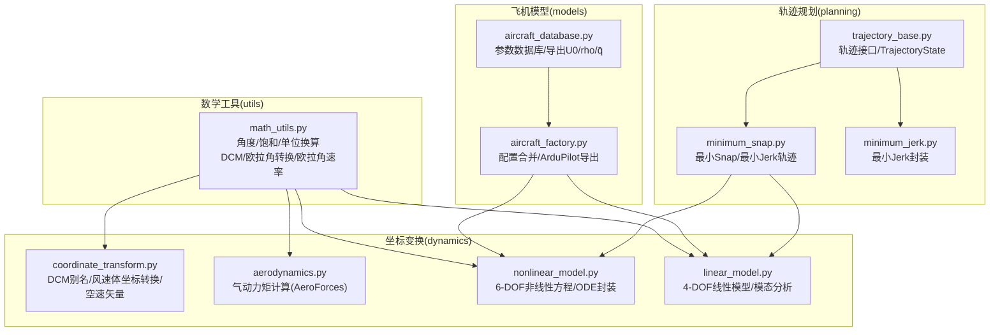
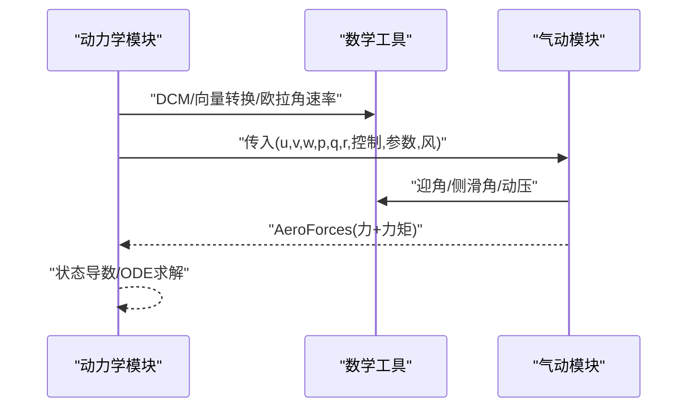
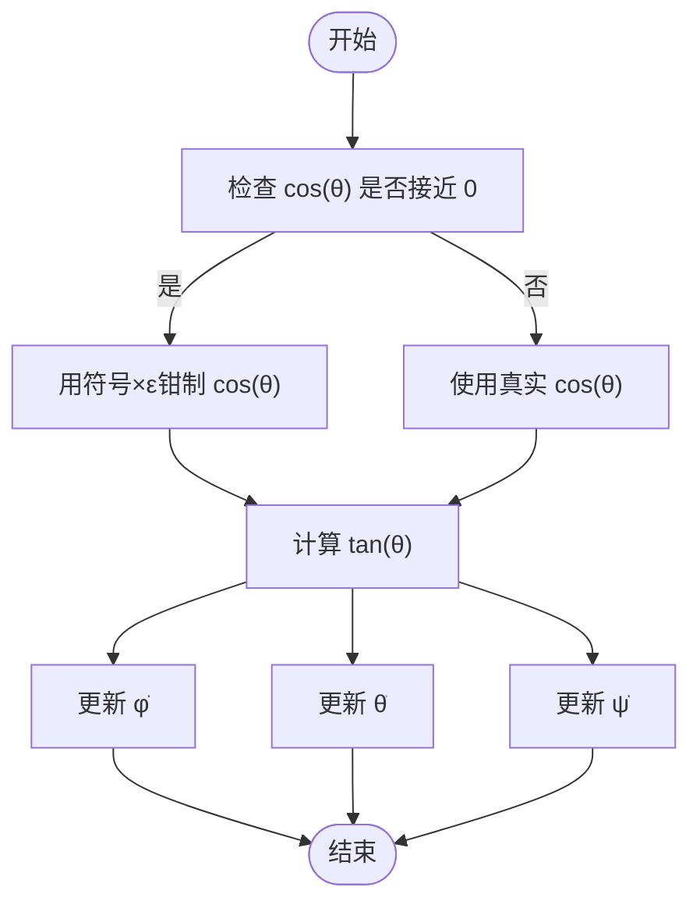
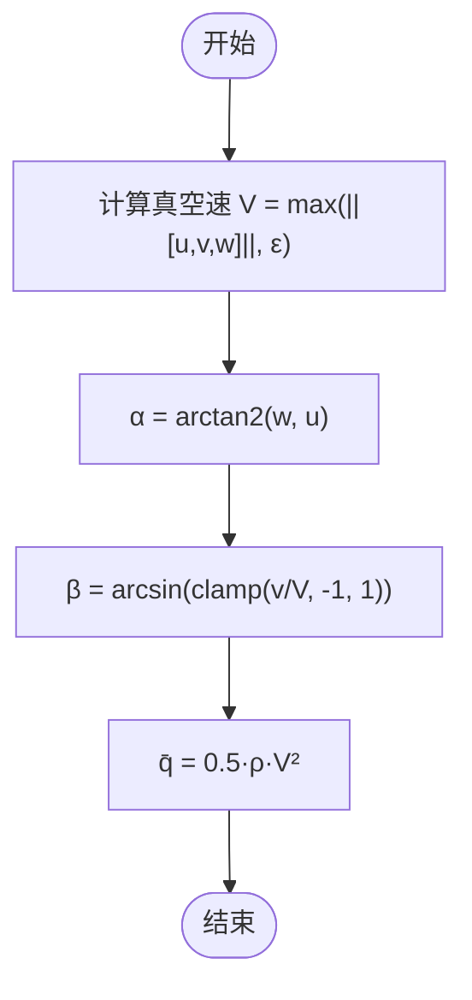
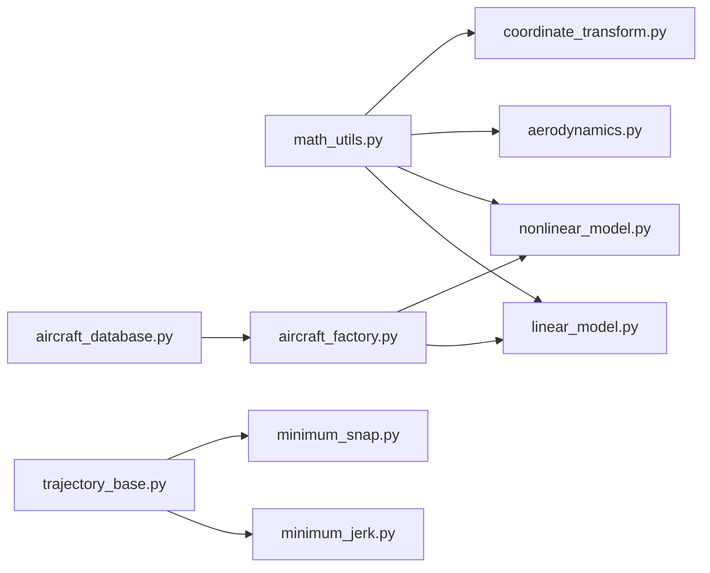

# 数学工具库

<cite>
**本文引用的文件**
- [src/utils/math_utils.py](file://src/utils/math_utils.py)
- [src/dynamics/coordinate_transform.py](file://src/dynamics/coordinate_transform.py)
- [src/dynamics/aerodynamics.py](file://src/dynamics/aerodynamics.py)
- [src/dynamics/nonlinear_model.py](file://src/dynamics/nonlinear_model.py)
- [src/dynamics/linear_model.py](file://src/dynamics/linear_model.py)
- [src/models/aircraft_database.py](file://src/models/aircraft_database.py)
- [src/models/aircraft_factory.py](file://src/models/aircraft_factory.py)
- [src/planning/minimum_snap.py](file://src/planning/minimum_snap.py)
- [src/planning/minimum_jerk.py](file://src/planning/minimum_jerk.py)
- [src/planning/trajectory_base.py](file://src/planning/trajectory_base.py)
</cite>

## 目录
1. [简介](#简介)
2. [项目结构](#项目结构)
3. [核心组件](#核心组件)
4. [架构总览](#架构总览)
5. [详细组件分析](#详细组件分析)
6. [依赖关系分析](#依赖关系分析)
7. [性能与数值稳定性](#性能与数值稳定性)
8. [故障排查指南](#故障排查指南)
9. [结论](#结论)
10. [附录：函数参考与调用时机](#附录函数参考与调用时机)

## 简介
本文件系统性梳理 FixedWingSimulator 的数学工具库，聚焦于仿真中高频使用的数学运算：角度归一化与饱和、角度制弧度制互转、方向余弦矩阵（DCM）与欧拉角转换、欧拉角速率到机体角速率的映射、空速/侧滑角与动压计算等。同时覆盖这些工具在非线性六自由度动力学、线性四自由度模型、气动计算以及轨迹规划中的具体应用与调用时机，并给出数值稳定性、精度控制与性能优化建议。

## 项目结构
数学工具主要集中在 utils 模块，围绕坐标变换、气动与动力学模块复用；轨迹规划模块也使用了多项式系数求解与数值积分，属于广义“数学工具”的范畴。

图表来源
- [src/utils/math_utils.py](file://src/utils/math_utils.py#L1-L124)
- [src/dynamics/coordinate_transform.py](file://src/dynamics/coordinate_transform.py#L1-L70)
- [src/dynamics/aerodynamics.py](file://src/dynamics/aerodynamics.py#L1-L148)
- [src/dynamics/nonlinear_model.py](file://src/dynamics/nonlinear_model.py#L1-L386)
- [src/dynamics/linear_model.py](file://src/dynamics/linear_model.py#L1-L319)
- [src/models/aircraft_database.py](file://src/models/aircraft_database.py#L1-L183)
- [src/models/aircraft_factory.py](file://src/models/aircraft_factory.py#L1-L136)
- [src/planning/minimum_snap.py](file://src/planning/minimum_snap.py#L1-L253)
- [src/planning/minimum_jerk.py](file://src/planning/minimum_jerk.py#L1-L71)
- [src/planning/trajectory_base.py](file://src/planning/trajectory_base.py#L1-L47)

章节来源
- [src/utils/math_utils.py](file://src/utils/math_utils.py#L1-L124)
- [src/dynamics/coordinate_transform.py](file://src/dynamics/coordinate_transform.py#L1-L70)
- [src/dynamics/aerodynamics.py](file://src/dynamics/aerodynamics.py#L1-L148)
- [src/dynamics/nonlinear_model.py](file://src/dynamics/nonlinear_model.py#L1-L386)
- [src/dynamics/linear_model.py](file://src/dynamics/linear_model.py#L1-L319)
- [src/models/aircraft_database.py](file://src/models/aircraft_database.py#L1-L183)
- [src/models/aircraft_factory.py](file://src/models/aircraft_factory.py#L1-L136)
- [src/planning/minimum_snap.py](file://src/planning/minimum_snap.py#L1-L253)
- [src/planning/minimum_jerk.py](file://src/planning/minimum_jerk.py#L1-L71)
- [src/planning/trajectory_base.py](file://src/planning/trajectory_base.py#L1-L47)

## 核心组件
- 角度与饱和工具
  - 角度归一化：将弧度归一至 [-π, π]，角度归一至 [-180, 180]
  - 饱和函数：对标量进行区间钳制
  - 角度制与弧度制互转：支持向量化输入
- 方向余弦矩阵与欧拉角
  - 3-2-1 欧拉角（ZYX）DCM 构造
  - 机体/北-East-Down（NED）坐标系矢量转换
  - 欧拉角时间导数（角速率到欧拉角变化率）
- 航空气动辅助
  - 迎角计算（arctan2）
  - 侧滑角计算（arcsin，带数值稳定夹紧）
  - 动压计算（0.5·ρ·V²）

章节来源
- [src/utils/math_utils.py](file://src/utils/math_utils.py#L13-L35)
- [src/utils/math_utils.py](file://src/utils/math_utils.py#L43-L100)
- [src/utils/math_utils.py](file://src/utils/math_utils.py#L107-L123)

## 架构总览
数学工具库以纯 NumPy 实现，不引入额外依赖，确保在仿真主循环中高效、可移植地运行。其被以下模块广泛复用：
- 坐标变换模块：提供 DCM 别名与风/空速矢量转换
- 动力学模块：非线性六自由度与线性四自由度模型均直接调用数学工具
- 气动模块：通过数学工具计算迎角、侧滑角与动压，支撑 AeroForces 力矩计算
- 轨迹规划模块：使用多项式系数求解器与数值积分，间接体现数学工具的线性代数能力

图表来源
- [src/dynamics/nonlinear_model.py](file://src/dynamics/nonlinear_model.py#L160-L255)
- [src/dynamics/linear_model.py](file://src/dynamics/linear_model.py#L129-L200)
- [src/dynamics/aerodynamics.py](file://src/dynamics/aerodynamics.py#L35-L147)
- [src/utils/math_utils.py](file://src/utils/math_utils.py#L43-L123)

## 详细组件分析

### 组件A：角度与饱和工具
- wrap_angle / wrap_angle_deg
  - 输入：弧度或角度标量
  - 输出：归一化后的弧度或角度
  - 复杂度：O(1)
  - 用途：姿态角在主循环中持续更新，需保持连续性
- saturate
  - 输入：value, v_min, v_max
  - 输出：钳制后的浮点数
  - 复杂度：O(1)
  - 用途：控制输入限幅、油门/舵偏上限
- deg2rad / rad2deg
  - 输入：数组或标量
  - 输出：向量化转换结果
  - 复杂度：O(n)，n为元素个数
  - 用途：配置文件与代码内部统一使用弧度

章节来源
- [src/utils/math_utils.py](file://src/utils/math_utils.py#L13-L35)

### 组件B：方向余弦矩阵与欧拉角转换
- rotation_matrix_321
  - 输入：roll φ、pitch θ、yaw ψ（弧度）
  - 输出：(3,3) DCM，满足 R @ v_body = v_NED
  - 复杂度：O(1)
  - 数值注意：三角函数组合，避免大角度导致舍入误差累积
- body_to_ned / ned_to_body
  - 输入：向量与欧拉角
  - 输出：坐标系变换后的向量
  - 复杂度：O(1)
  - 用途：速度、角速率、力/力矩在不同坐标系间转换
- euler_rates
  - 输入：机体角速率 p,q,r 与欧拉角 φ,θ
  - 输出：[φ̇, θ̇, ψ̇]
  - 复杂度：O(1)
  - 数值注意：当 θ 接近 ±90° 时 cos θ → 0，采用小 ε 保护避免除零

图表来源
- [src/utils/math_utils.py](file://src/utils/math_utils.py#L79-L100)

章节来源
- [src/utils/math_utils.py](file://src/utils/math_utils.py#L43-L100)

### 组件C：航空气动辅助
- angle_of_attack(u, w)
  - 输入：u（x轴速度）、w（z轴速度）
  - 输出：迎角 α（弧度），使用 arctan2 保证象限正确
  - 复杂度：O(1)
- sideslip_angle(v, airspeed)
  - 输入：v（y轴速度）、airspeed（>0）
  - 输出：侧滑角 β（弧度），airspeed 小于阈值时钳制，防止 arcsin 定义域错误
  - 复杂度：O(1)
- dynamic_pressure(rho, airspeed)
  - 输入：空气密度 ρ、空速 V
  - 输出：动压 q̄ = 0.5·ρ·V²
  - 复杂度：O(1)

图表来源
- [src/utils/math_utils.py](file://src/utils/math_utils.py#L107-L123)
- [src/dynamics/aerodynamics.py](file://src/dynamics/aerodynamics.py#L68-L83)

章节来源
- [src/utils/math_utils.py](file://src/utils/math_utils.py#L107-L123)
- [src/dynamics/aerodynamics.py](file://src/dynamics/aerodynamics.py#L35-L147)

### 组件D：坐标变换模块
- dcm_from_euler
  - 等价于 rotation_matrix_321，提供命名别名
- wind_to_body_frame
  - 输入：NED 风速矢量与欧拉角
  - 输出：机体系风速矢量
- airspeed_vector
  - 输入：机体系地速与机体系风速
  - 输出：真空速矢量（地速减去风速）

章节来源
- [src/dynamics/coordinate_transform.py](file://src/dynamics/coordinate_transform.py#L29-L70)

### 组件E：非线性六自由度模型
- compute_trim
  - 解线性方程组求平飞配平（α, δe），用于初始条件与稳态参考
- state_dot
  - 计算 12 维状态导数：[u,v,w,p,q,r,φ,θ,ψ,xN,xE,xD]
  - 步骤要点：
    - 调用 compute_aero_forces 获取 AeroForces
    - 简单推力模型（与质量、重力比相关）
    - 重力投影至机体系
    - 牛顿第二定律与欧拉方程（含惯性耦合项）
    - 欧拉角导数：euler_rates
    - 位置导数：R @ [u,v,w]（R 来自 DCM）
- make_ode_func
  - 包装外部控制/风场/密度回调，供 scipy ODE 使用
- simulate
  - 使用 solve_ivp 执行开环脉冲响应，产出派生变量（α, β, 空速、动能、位能）

章节来源
- [src/dynamics/nonlinear_model.py](file://src/dynamics/nonlinear_model.py#L132-L154)
- [src/dynamics/nonlinear_model.py](file://src/dynamics/nonlinear_model.py#L160-L255)
- [src/dynamics/nonlinear_model.py](file://src/dynamics/nonlinear_model.py#L261-L281)
- [src/dynamics/nonlinear_model.py](file://src/dynamics/nonlinear_model.py#L287-L385)

### 组件F：线性四自由度模型
- build
  - 构建 A、B 矩阵（纵向线性化状态空间），涉及稳定性导数与无量纲化
- analyze_modes
  - 对 A 进行特征值分解，识别短周期、长周期（Phugoid）与阻尼收敛模式
- simulate
  - 对给定脉冲输入求解线性系统状态响应

章节来源
- [src/dynamics/linear_model.py](file://src/dynamics/linear_model.py#L129-L200)
- [src/dynamics/linear_model.py](file://src/dynamics/linear_model.py#L206-L252)
- [src/dynamics/linear_model.py](file://src/dynamics/linear_model.py#L258-L306)

### 组件G：轨迹规划与多项式求解
- minimum_snap_coeffs
  - 为每个维度构建分段多项式，基于最小化高阶导数（默认 snap=4，即最小化加加速度）
  - 通过构造线性系统 A·x=b 并求解得到每段系数
  - 支持边界条件与中间点连续性约束
- _eval_poly
  - 在局部时间 t_local 上评估多项式及其导数（位置/速度/加速度）
- MinimumSnapTrajectory / MinimumJerkTrajectory
  - 提供 desired_state(t) 接口，按航路点与段时长生成轨迹
  - 可选 yaw_follow 模式，利用速度方向确定偏航角

章节来源
- [src/planning/minimum_snap.py](file://src/planning/minimum_snap.py#L47-L142)
- [src/planning/minimum_snap.py](file://src/planning/minimum_snap.py#L145-L164)
- [src/planning/minimum_snap.py](file://src/planning/minimum_snap.py#L167-L253)
- [src/planning/minimum_jerk.py](file://src/planning/minimum_jerk.py#L17-L71)
- [src/planning/trajectory_base.py](file://src/planning/trajectory_base.py#L16-L47)

## 依赖关系分析
- math_utils 是所有模块的共同依赖，提供基础数学运算
- coordinate_transform 直接导入 math_utils 中的 DCM 与欧拉角相关函数
- aerodynamics 依赖 math_utils 的迎角、侧滑角与动压
- nonlinear_model 与 linear_model 同时依赖 math_utils 的 DCM 与欧拉角速率
- aircraft_database 与 aircraft_factory 提供参数注入（U0、ρ、q̄），为动力学/气动模块提供常量
- planning 模块独立完成轨迹生成，不直接依赖 math_utils，但与动力学/控制闭环配合使用

图表来源
- [src/utils/math_utils.py](file://src/utils/math_utils.py#L1-L124)
- [src/dynamics/coordinate_transform.py](file://src/dynamics/coordinate_transform.py#L10-L16)
- [src/dynamics/aerodynamics.py](file://src/dynamics/aerodynamics.py#L11-L13)
- [src/dynamics/nonlinear_model.py](file://src/dynamics/nonlinear_model.py#L22-L28)
- [src/dynamics/linear_model.py](file://src/dynamics/linear_model.py#L18-L27)
- [src/models/aircraft_database.py](file://src/models/aircraft_database.py#L14-L166)
- [src/models/aircraft_factory.py](file://src/models/aircraft_factory.py#L12-L74)
- [src/planning/minimum_snap.py](file://src/planning/minimum_snap.py#L21-L21)
- [src/planning/minimum_jerk.py](file://src/planning/minimum_jerk.py#L13-L14)
- [src/planning/trajectory_base.py](file://src/planning/trajectory_base.py#L10-L13)

章节来源
- [src/utils/math_utils.py](file://src/utils/math_utils.py#L1-L124)
- [src/dynamics/coordinate_transform.py](file://src/dynamics/coordinate_transform.py#L10-L16)
- [src/dynamics/aerodynamics.py](file://src/dynamics/aerodynamics.py#L11-L13)
- [src/dynamics/nonlinear_model.py](file://src/dynamics/nonlinear_model.py#L22-L28)
- [src/dynamics/linear_model.py](file://src/dynamics/linear_model.py#L18-L27)
- [src/models/aircraft_database.py](file://src/models/aircraft_database.py#L14-L166)
- [src/models/aircraft_factory.py](file://src/models/aircraft_factory.py#L12-L74)
- [src/planning/minimum_snap.py](file://src/planning/minimum_snap.py#L21-L21)
- [src/planning/minimum_jerk.py](file://src/planning/minimum_jerk.py#L13-L14)
- [src/planning/trajectory_base.py](file://src/planning/trajectory_base.py#L10-L13)

## 性能与数值稳定性
- 性能特性
  - 数学工具均为纯 NumPy 实现，函数级 O(1)，向量化版本适合批量处理
  - DCM 与欧拉角速率计算为常数步数，适合高频主循环
  - 线性系统求解（solve/lstsq）在轨迹规划阶段使用，注意条件数过大时的稳定性
- 数值稳定性
  - euler_rates 在 θ → ±90° 时采用小 ε 保护，避免除零
  - sideslip_angle 对 v/V 先 clamp 至 [-1,1]，再 arcsin，防止 NaN
  - dynamic_pressure 与速度平方项避免负值带来的不稳定
- 精度控制
  - 使用 np.clip 与阈值（如 1e-3）保证定义域安全
  - 角度归一化采用模运算，避免重复加减 2π 导致的误差积累
- 内存使用最佳实践
  - 尽量复用中间结果（如 cos/sin、DCM），避免重复计算
  - 在批处理场景使用向量化操作，减少 Python 循环开销
  - 对大型线性系统（轨迹规划）优先使用 solve，必要时回退 lstsq 并记录条件数警告

[本节为通用指导，无需特定文件来源]

## 故障排查指南
- 欧拉角奇异
  - 症状：俯仰角接近 ±90° 时出现发散或数值异常
  - 处理：euler_rates 已内置 ε 保护；若仍异常，检查输入是否越界或积分步长过大
- 侧滑角 NaN
  - 症状：airspeed 过小导致 v/V 超出 [-1,1]
  - 处理：确保 airspeed ≥ 1e-3；在调用前对空速做最小值钳制
- 动压异常
  - 症状：ρ 或 V 异号导致 q̄ 为负
  - 处理：检查输入参数与单位一致性；确保密度与速度为正值
- 轨迹求解条件数过高
  - 症状：最小Snap求解打印“ill-conditioned system”
  - 处理：减小段时长或增加连续性阶数；检查边界条件与中间点约束是否冲突

章节来源
- [src/utils/math_utils.py](file://src/utils/math_utils.py#L79-L123)
- [src/planning/minimum_snap.py](file://src/planning/minimum_snap.py#L132-L137)

## 结论
数学工具库以简洁高效的纯 NumPy 实现，为坐标变换、气动计算与轨迹规划提供了坚实基础。通过合理的数值保护与向量化设计，能够在仿真主循环中稳定运行。建议在实际工程中结合参数数据库与工厂类进行参数注入，确保 U0、ρ、q̄ 等关键常量一致可用。

[本节为总结，无需特定文件来源]

## 附录：函数参考与调用时机
- 角度与饱和
  - wrap_angle / wrap_angle_deg：姿态角主循环更新后使用
  - saturate：控制输入限幅（油门/舵偏）
  - deg2rad / rad2deg：配置读取与内部统一弧度
- 方向余弦矩阵与欧拉角
  - rotation_matrix_321：每次需要坐标变换或欧拉角导数时调用
  - body_to_ned / ned_to_body：速度、角速率、力/力矩跨坐标系转换
  - euler_rates：状态导数中 φ̇, θ̇, ψ̇ 的计算
- 航空气动辅助
  - angle_of_attack：气动模块计算前的预处理
  - sideslip_angle：气动模块计算前的预处理
  - dynamic_pressure：气动系数与力/力矩计算的基础
- 动力学与线性模型
  - nonlinear_model.state_dot：主循环中每一步调用
  - linear_model.build/analyze_modes/simulate：离线分析与验证
- 轨迹规划
  - minimum_snap_coeffs/_eval_poly：轨迹初始化与实时查询
  - MinimumSnapTrajectory/MinimumJerkTrajectory.desired_state：控制器参考轨迹

章节来源
- [src/utils/math_utils.py](file://src/utils/math_utils.py#L13-L123)
- [src/dynamics/coordinate_transform.py](file://src/dynamics/coordinate_transform.py#L29-L70)
- [src/dynamics/aerodynamics.py](file://src/dynamics/aerodynamics.py#L35-L147)
- [src/dynamics/nonlinear_model.py](file://src/dynamics/nonlinear_model.py#L160-L281)
- [src/dynamics/linear_model.py](file://src/dynamics/linear_model.py#L129-L306)
- [src/planning/minimum_snap.py](file://src/planning/minimum_snap.py#L47-L164)
- [src/planning/minimum_jerk.py](file://src/planning/minimum_jerk.py#L17-L71)
- [src/planning/trajectory_base.py](file://src/planning/trajectory_base.py#L16-L47)