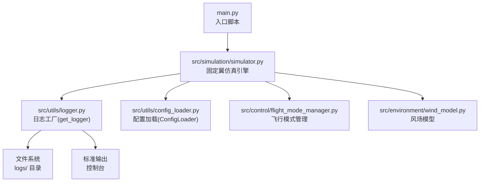
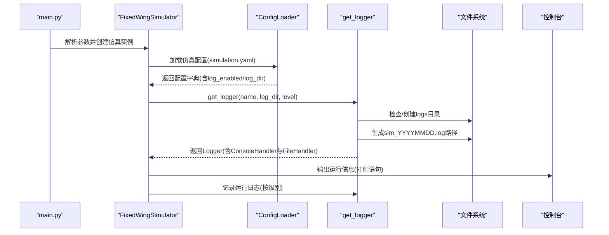
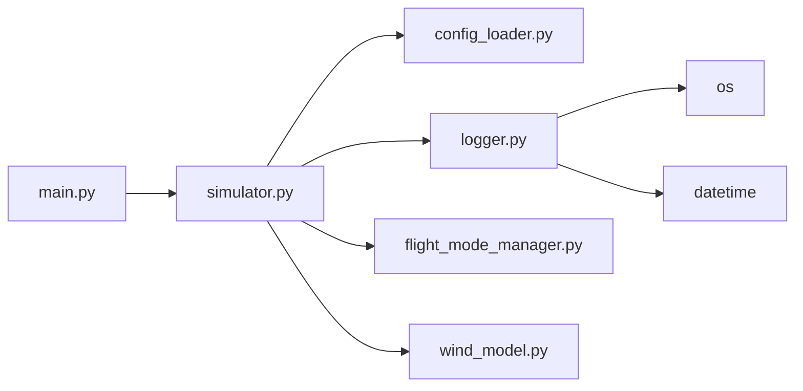

# 日志系统

<cite>
**本文引用的文件**
- [src/utils/logger.py](file://src/utils/logger.py)
- [src/utils/config_loader.py](file://src/utils/config_loader.py)
- [src/simulation/simulator.py](file://src/simulation/simulator.py)
- [src/control/flight_mode_manager.py](file://src/control/flight_mode_manager.py)
- [src/environment/wind_model.py](file://src/environment/wind_model.py)
- [main.py](file://main.py)
</cite>

## 目录
1. [简介](#简介)
2. [项目结构](#项目结构)
3. [核心组件](#核心组件)
4. [架构总览](#架构总览)
5. [组件详解](#组件详解)
6. [依赖关系分析](#依赖关系分析)
7. [性能与优化](#性能与优化)
8. [故障排查指南](#故障排查指南)
9. [结论](#结论)
10. [附录：配置与最佳实践](#附录配置与最佳实践)

## 简介
本文件为 FixedWingSimulator 的日志系统提供完整、可操作的配置与使用说明。内容覆盖日志级别、输出格式、文件管理策略（自动创建、按日轮转、存储位置与清理）、调试信息收集与分析方法，以及如何扩展日志系统以支持自定义处理器与格式化器。文档同时给出性能优化建议与常见问题排查路径。

## 项目结构
日志系统在本项目中的定位清晰：通过一个轻量封装的工具函数统一创建 Logger 实例，结合配置加载模块提供的日志开关与目录参数，实现“控制台 + 文件”的双通道输出。运行入口脚本负责解析命令行参数并驱动仿真主流程；各子模块在关键节点打印状态信息，便于观测与排障。

图表来源
- [main.py](file://main.py#L98-L145)
- [src/simulation/simulator.py](file://src/simulation/simulator.py#L130-L230)
- [src/utils/logger.py](file://src/utils/logger.py#L10-L43)
- [src/utils/config_loader.py](file://src/utils/config_loader.py#L59-L82)
- [src/control/flight_mode_manager.py](file://src/control/flight_mode_manager.py#L152-L168)
- [src/environment/wind_model.py](file://src/environment/wind_model.py#L18-L56)

章节来源
- [main.py](file://main.py#L98-L145)
- [src/simulation/simulator.py](file://src/simulation/simulator.py#L130-L230)
- [src/utils/logger.py](file://src/utils/logger.py#L10-L43)
- [src/utils/config_loader.py](file://src/utils/config_loader.py#L59-L82)

## 核心组件
- 日志工厂函数：提供统一的 Logger 创建接口，支持控制台与文件双重输出，自动按日创建日志文件。
- 配置加载器：提供默认日志开关与日志目录配置项，便于集中管理。
- 运行入口：解析命令行参数，驱动仿真执行，便于在启动阶段统一初始化日志。
- 子模块打印：在关键流程（如模式切换）输出状态信息，辅助调试与审计。

章节来源
- [src/utils/logger.py](file://src/utils/logger.py#L10-L43)
- [src/utils/config_loader.py](file://src/utils/config_loader.py#L10-L37)
- [main.py](file://main.py#L98-L145)
- [src/control/flight_mode_manager.py](file://src/control/flight_mode_manager.py#L163-L163)

## 架构总览
日志系统采用“工厂 + 双通道 + 配置驱动”的架构。工厂函数根据传入名称、日志目录与级别创建 Logger；若启用文件输出，则自动创建 logs 目录并按当前日期命名日志文件；控制台通道始终启用，保证实时可观测性。运行入口与配置加载器共同决定日志是否开启及输出到何处。

图表来源
- [main.py](file://main.py#L98-L145)
- [src/simulation/simulator.py](file://src/simulation/simulator.py#L148-L171)
- [src/utils/config_loader.py](file://src/utils/config_loader.py#L75-L77)
- [src/utils/logger.py](file://src/utils/logger.py#L10-L43)

## 组件详解

### 日志工厂与输出格式
- 功能概述
  - 接收模块名、日志目录与日志级别，返回已配置的 Logger。
  - 控制台输出：始终启用，使用统一时间戳与格式。
  - 文件输出：可选，当传入非空日志目录时启用；自动创建目录并按日期命名文件。
- 输出格式
  - 时间戳、Logger 名称、日志级别、消息正文。
  - 时间格式为“年-月-日 时:分:秒”。

章节来源
- [src/utils/logger.py](file://src/utils/logger.py#L10-L43)

### 配置驱动的日志开关与目录
- 默认配置
  - log_enabled: 是否启用日志记录（文件与控制台）。
  - log_dir: 日志目录，默认为“logs”。
- 生效方式
  - 固定翼仿真引擎在初始化时读取仿真配置，据此决定是否创建文件处理器。
  - 若未启用文件日志或目录为空，则仅输出到控制台。

章节来源
- [src/utils/config_loader.py](file://src/utils/config_loader.py#L10-L37)
- [src/simulation/simulator.py](file://src/simulation/simulator.py#L148-L171)

### 运行入口与日志初始化
- 命令行参数
  - 提供 config-dir 参数指定配置目录，确保日志目录与配置一致。
- 初始化时机
  - 在创建 FixedWingSimulator 实例前，入口脚本会将 src 添加到 sys.path，确保模块导入正确。
  - 仿真实例内部完成配置加载与日志工厂调用，从而在运行期输出日志。

章节来源
- [main.py](file://main.py#L32-L95)
- [src/simulation/simulator.py](file://src/simulation/simulator.py#L148-L171)

### 子模块中的打印与日志
- 打印语句
  - 飞行模式管理器在模式切换时打印状态，便于观察控制逻辑。
  - 仿真引擎在异常（如积分错误）时打印错误信息，辅助快速定位问题。
- 建议
  - 将上述打印替换为正式日志调用，统一级别与格式，提升可观测性与可检索性。

章节来源
- [src/control/flight_mode_manager.py](file://src/control/flight_mode_manager.py#L163-L163)
- [src/simulation/simulator.py](file://src/simulation/simulator.py#L560-L562)

### 日志级别与使用建议
- INFO
  - 用途：常规运行信息、关键流程节点、结果摘要。
  - 场景：仿真开始/结束、轨迹构建完成、可视化触发等。
- DEBUG
  - 用途：细粒度状态与中间变量，用于深入调试。
  - 场景：控制回路每步计算细节、状态历史记录等。
- WARNING
  - 用途：潜在问题但不影响继续执行的情况。
  - 场景：参数边界接近、航路点切换冷却时间不足等。
- ERROR
  - 用途：导致流程中断或不可恢复的错误。
  - 场景：积分器抛出运行时错误、未知风场类型等。

章节来源
- [src/simulation/simulator.py](file://src/simulation/simulator.py#L560-L562)
- [src/environment/wind_model.py](file://src/environment/wind_model.py#L40-L41)

### 文件管理策略
- 自动创建
  - 当启用文件日志且目录不存在时，自动创建 logs 目录。
- 按日轮转
  - 每天创建新的日志文件，文件名包含日期后缀，避免单文件过大。
- 存储位置
  - 默认位于项目根目录下的 logs 子目录。
- 清理策略
  - 当前实现未内置自动清理；建议结合外部工具（如 logrotate 或定时任务）进行归档与删除。

章节来源
- [src/utils/logger.py](file://src/utils/logger.py#L36-L41)

### 调试信息收集与分析
- 收集手段
  - 使用 INFO/DEBUG/WARNING/ERROR 分级记录关键事件与异常。
  - 在模式切换、轨迹构建、控制回路更新等节点增加日志。
- 分析方法
  - 结合控制台输出与日志文件，定位异常发生的时间窗口。
  - 利用日志中的时间戳与模块名快速定位具体代码路径。
  - 对高频 DEBUG 信息进行采样或条件化输出，降低开销。

章节来源
- [src/control/flight_mode_manager.py](file://src/control/flight_mode_manager.py#L163-L163)
- [src/simulation/simulator.py](file://src/simulation/simulator.py#L560-L562)

### 扩展日志系统
- 自定义处理器
  - 可在现有工厂函数基础上增加额外 Handler（如 RotatingFileHandler、SocketHandler），实现更复杂的文件轮转与远程投递。
- 自定义格式化器
  - 可替换统一的 Formatter，加入上下文字段（如进程 ID、线程名、模块行号）以增强可追溯性。
- 最佳实践
  - 保持格式一致性，避免跨模块差异。
  - 对生产环境建议使用异步处理器或队列式处理器，减少 I/O 对主流程的影响。

章节来源
- [src/utils/logger.py](file://src/utils/logger.py#L24-L41)

## 依赖关系分析
- 入口脚本依赖仿真引擎；仿真引擎依赖配置加载器与日志工厂。
- 日志工厂依赖 Python 标准库 logging 与 datetime；文件输出依赖 os。
- 风场模型与飞行模式管理器不直接依赖日志系统，但会在关键节点打印状态信息。

图表来源
- [main.py](file://main.py#L98-L145)
- [src/simulation/simulator.py](file://src/simulation/simulator.py#L130-L230)
- [src/utils/config_loader.py](file://src/utils/config_loader.py#L59-L82)
- [src/utils/logger.py](file://src/utils/logger.py#L5-L7)
- [src/control/flight_mode_manager.py](file://src/control/flight_mode_manager.py#L152-L168)
- [src/environment/wind_model.py](file://src/environment/wind_model.py#L18-L56)

章节来源
- [main.py](file://main.py#L98-L145)
- [src/simulation/simulator.py](file://src/simulation/simulator.py#L130-L230)
- [src/utils/logger.py](file://src/utils/logger.py#L5-L7)

## 性能与优化
- I/O 开销控制
  - 将高频 DEBUG 信息改为条件输出或采样频率，避免频繁落盘。
  - 在批量运行或长时间仿真中，优先使用 INFO/WARNING，必要时临时降级级别。
- 文件系统优化
  - 使用 SSD 或高性能磁盘作为日志目录，减少写放大。
  - 合理设置文件系统缓存策略，避免频繁 fsync。
- 处理器选择
  - 生产环境建议引入异步处理器或缓冲队列，降低阻塞风险。
- 日志级别与过滤
  - 通过 Logger 级别与 Filter 控制输出量，避免无意义的低价值日志。

## 故障排查指南
- 无法写入日志文件
  - 检查日志目录权限与磁盘空间；确认 log_dir 配置有效。
- 日志文件未按日轮转
  - 确认启用文件日志且目录非空；检查系统时间与时区设置。
- 控制台无输出
  - 确认未禁用控制台处理器；检查日志级别过滤。
- 关键信息缺失
  - 将打印语句替换为正式日志调用，确保包含时间戳与模块名。
- 异常定位
  - 查找 ERROR 级别日志条目，结合时间戳与调用栈定位问题模块。

章节来源
- [src/utils/logger.py](file://src/utils/logger.py#L36-L41)
- [src/simulation/simulator.py](file://src/simulation/simulator.py#L560-L562)

## 结论
本项目的日志系统以轻量工厂为核心，结合配置驱动实现灵活的日志开关与目录管理。通过统一的输出格式与双通道策略，既满足开发调试需求，又兼顾运行期可观测性。建议在后续迭代中引入更完善的文件轮转与清理策略，并逐步将打印语句迁移为正式日志，以进一步提升系统的可维护性与可诊断性。

## 附录：配置与最佳实践
- 配置项
  - log_enabled: 布尔值，控制是否启用文件日志。
  - log_dir: 字符串，日志目录路径（相对或绝对）。
- 最佳实践
  - 在开发阶段使用较低级别（如 DEBUG/INFO），在测试/生产阶段提高到 INFO/WARNING。
  - 为每个主要模块创建独立 Logger，使用模块名作为名称，便于筛选。
  - 定期归档旧日志并清理过期文件，避免占用过多磁盘空间。
  - 在 CI/CD 流水线中保留日志以便回溯失败原因。

章节来源
- [src/utils/config_loader.py](file://src/utils/config_loader.py#L10-L37)
- [src/utils/logger.py](file://src/utils/logger.py#L10-L43)