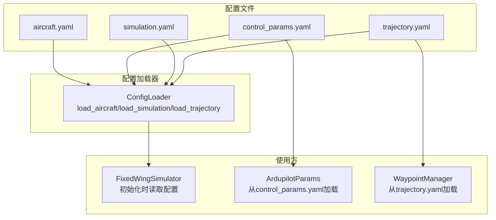
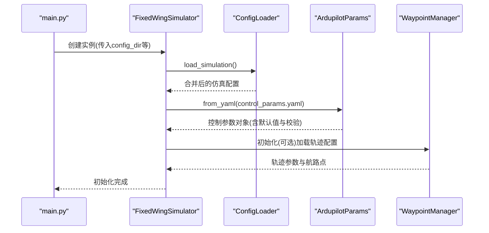
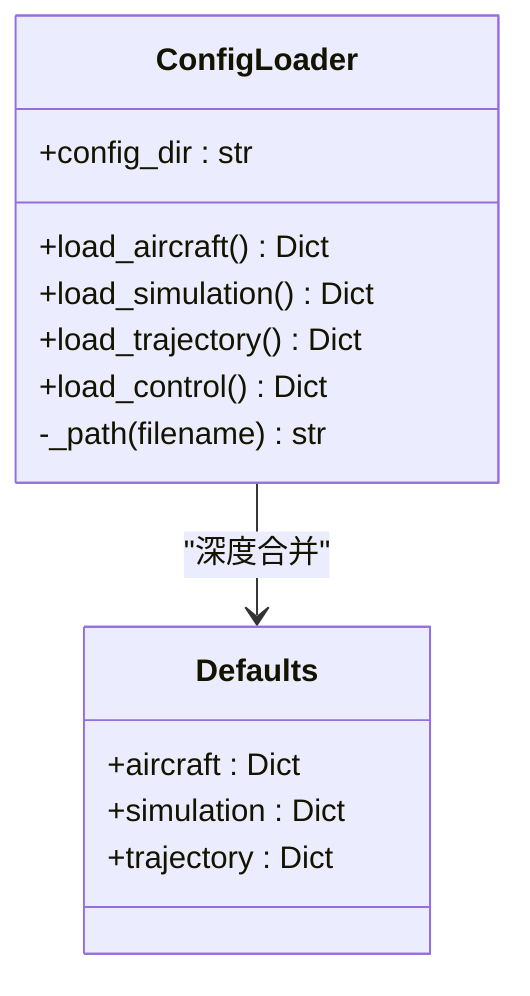
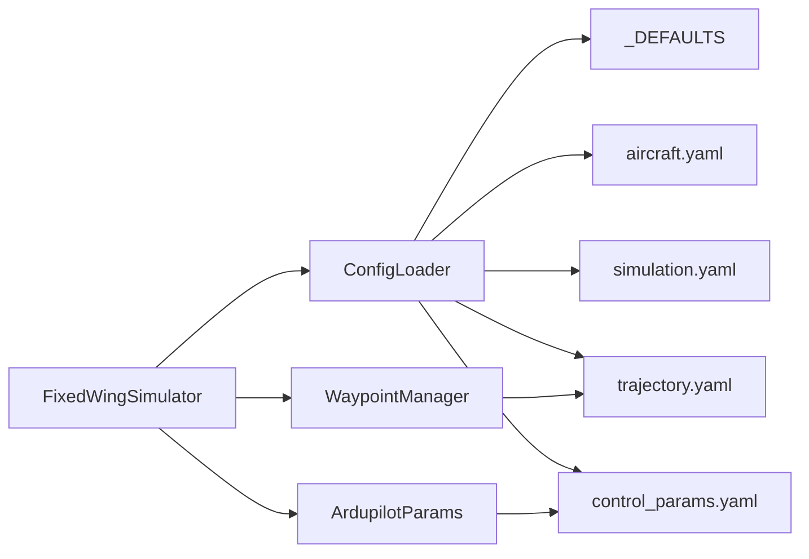

# 配置文件加载

<cite>
**本文引用的文件**
- [src/utils/config_loader.py](file://src/utils/config_loader.py)
- [config/aircraft.yaml](file://config/aircraft.yaml)
- [config/control_params.yaml](file://config/control_params.yaml)
- [config/simulation.yaml](file://config/simulation.yaml)
- [config/trajectory.yaml](file://config/trajectory.yaml)
- [src/simulation/simulator.py](file://src/simulation/simulator.py)
- [src/models/aircraft_database.py](file://src/models/aircraft_database.py)
- [src/models/aircraft_factory.py](file://src/models/aircraft_factory.py)
- [src/planning/waypoint_manager.py](file://src/planning/waypoint_manager.py)
- [src/control/ardupilot_compat.py](file://src/control/ardupilot_compat.py)
- [main.py](file://main.py)
</cite>

## 目录
1. [简介](#简介)
2. [项目结构](#项目结构)
3. [核心组件](#核心组件)
4. [架构总览](#架构总览)
5. [详细组件分析](#详细组件分析)
6. [依赖关系分析](#依赖关系分析)
7. [性能考量](#性能考量)
8. [故障排查指南](#故障排查指南)
9. [结论](#结论)
10. [附录](#附录)

## 简介
本文件面向 FixedWingSimulator 的配置文件加载系统，聚焦于 ConfigLoader 类的实现原理与使用方式，涵盖 YAML 文件解析机制、深度合并算法、默认值处理策略、各类配置文件的格式规范与字段定义、加载顺序与优先级规则、覆盖机制、验证与错误处理策略、版本兼容性与迁移指南，以及如何扩展配置系统以支持新的配置文件类型。文档同时给出可视化图示，帮助读者快速理解系统架构与数据流。

## 项目结构
配置系统主要由以下部分组成：
- 配置加载器：负责读取与合并各子系统的配置文件
- 配置文件：aircraft.yaml、control_params.yaml、simulation.yaml、trajectory.yaml
- 使用方：模拟器主入口与各子模块在初始化阶段读取配置
- 数据库与工厂：用于飞机参数的数据库与工厂合并逻辑

图表来源
- [src/utils/config_loader.py](file://src/utils/config_loader.py#L59-L81)
- [config/aircraft.yaml](file://config/aircraft.yaml#L1-L13)
- [config/control_params.yaml](file://config/control_params.yaml#L1-L45)
- [config/simulation.yaml](file://config/simulation.yaml#L1-L30)
- [config/trajectory.yaml](file://config/trajectory.yaml#L1-L23)
- [src/simulation/simulator.py](file://src/simulation/simulator.py#L148-L188)
- [src/control/ardupilot_compat.py](file://src/control/ardupilot_compat.py#L81-L88)
- [src/planning/waypoint_manager.py](file://src/planning/waypoint_manager.py#L80-L106)

章节来源
- [src/utils/config_loader.py](file://src/utils/config_loader.py#L1-L82)
- [config/aircraft.yaml](file://config/aircraft.yaml#L1-L13)
- [config/control_params.yaml](file://config/control_params.yaml#L1-L45)
- [config/simulation.yaml](file://config/simulation.yaml#L1-L30)
- [config/trajectory.yaml](file://config/trajectory.yaml#L1-L23)
- [src/simulation/simulator.py](file://src/simulation/simulator.py#L148-L188)

## 核心组件
- ConfigLoader：集中式配置加载与合并工具，提供按文件名加载与默认值深度合并的能力
- ArdupilotParams：控制参数容器，支持从 YAML 加载、导出与基本范围校验
- WaypointManager：轨迹管理器，支持从 YAML 加载轨迹配置与航路点列表
- 固定翼模拟器：在初始化阶段通过 ConfigLoader 读取仿真配置，并在需要时加载控制参数与轨迹配置

章节来源
- [src/utils/config_loader.py](file://src/utils/config_loader.py#L59-L81)
- [src/control/ardupilot_compat.py](file://src/control/ardupilot_compat.py#L17-L129)
- [src/planning/waypoint_manager.py](file://src/planning/waypoint_manager.py#L80-L106)
- [src/simulation/simulator.py](file://src/simulation/simulator.py#L148-L188)

## 架构总览
配置系统采用“文件驱动 + 默认值 + 深度合并”的设计，确保用户仅需覆盖必要的字段即可获得完整的运行参数。ConfigLoader 负责加载与合并，使用方在初始化阶段按需读取所需配置。

图表来源
- [main.py](file://main.py#L98-L122)
- [src/simulation/simulator.py](file://src/simulation/simulator.py#L148-L188)
- [src/utils/config_loader.py](file://src/utils/config_loader.py#L75-L77)
- [src/control/ardupilot_compat.py](file://src/control/ardupilot_compat.py#L81-L88)
- [src/planning/waypoint_manager.py](file://src/planning/waypoint_manager.py#L80-L106)

## 详细组件分析

### ConfigLoader 类与深度合并算法
- 职责
  - 提供按文件名加载 YAML 的统一入口
  - 将用户配置与内置默认值进行深度合并，保证字段完整性与优先级
- 关键实现要点
  - 默认值集中定义在模块级字典中，按子系统划分
  - 深度合并函数递归处理嵌套字典，非嵌套键直接覆盖
  - 文件不存在时返回空字典，避免异常传播
- 加载接口
  - load_aircraft：合并 aircraft.yaml 与默认 aircraft 字段
  - load_simulation：合并 simulation.yaml 与默认 simulation 字段
  - load_trajectory：合并 trajectory.yaml 与默认 trajectory 字段
  - load_control：直接返回 control_params.yaml 的原始内容（不参与默认值合并）

图表来源
- [src/utils/config_loader.py](file://src/utils/config_loader.py#L59-L81)
- [src/utils/config_loader.py](file://src/utils/config_loader.py#L10-L37)

章节来源
- [src/utils/config_loader.py](file://src/utils/config_loader.py#L40-L56)
- [src/utils/config_loader.py](file://src/utils/config_loader.py#L68-L81)

### 飞机参数配置：aircraft.yaml
- 作用：选择飞机型号并可选地覆盖数据库中的几何与气动参数
- 必填字段
  - aircraft_name：必须为数据库中已知的飞机名称之一
- 可选字段
  - overrides：以键值对形式覆盖数据库中的参数；支持平面/纵向/横向/方向参数
- 加载与合并
  - ConfigLoader.load_aircraft 会将 overrides 与默认 aircraft 字段进行深度合并
  - 实际参数最终由工厂与数据库共同决定，详见下文

章节来源
- [config/aircraft.yaml](file://config/aircraft.yaml#L1-L13)
- [src/utils/config_loader.py](file://src/utils/config_loader.py#L68-L70)
- [src/models/aircraft_factory.py](file://src/models/aircraft_factory.py#L51-L74)
- [src/models/aircraft_database.py](file://src/models/aircraft_database.py#L143-L166)

### 控制参数配置：control_params.yaml
- 作用：ArduPilot 兼容的控制参数集合，支持从 YAML 加载与导出
- 加载与合并
  - ConfigLoader.load_control 返回原始 YAML 内容（不参与默认值合并）
  - 固定翼模拟器在初始化时通过 ArdupilotParams.from_yaml 读取并构造参数对象
  - 模块内部还存在二次读取与默认值回退逻辑，用于 TECS 等特定参数
- 参数校验
  - ArdupilotParams.validate 执行基本范围检查，越界时打印警告并返回 False

章节来源
- [config/control_params.yaml](file://config/control_params.yaml#L1-L45)
- [src/utils/config_loader.py](file://src/utils/config_loader.py#L72-L73)
- [src/simulation/simulator.py](file://src/simulation/simulator.py#L165-L188)
- [src/control/ardupilot_compat.py](file://src/control/ardupilot_compat.py#L81-L88)
- [src/control/ardupilot_compat.py](file://src/control/ardupilot_compat.py#L104-L129)

### 仿真参数配置：simulation.yaml
- 作用：仿真引擎的全局参数，如时间步长、积分器、初始条件、风场、日志等
- 加载与合并
  - ConfigLoader.load_simulation 将用户配置与默认 simulation 字段进行深度合并
  - 固定翼模拟器在初始化时读取该配置，用于环境风场、初始模式等

章节来源
- [config/simulation.yaml](file://config/simulation.yaml#L1-L30)
- [src/utils/config_loader.py](file://src/utils/config_loader.py#L75-L77)
- [src/simulation/simulator.py](file://src/simulation/simulator.py#L159-L163)

### 轨迹规划参数：trajectory.yaml
- 作用：轨迹类型、平均速度、偏航模式、航路点列表与循环标志
- 加载与合并
  - ConfigLoader.load_trajectory 将用户配置与默认 trajectory 字段进行深度合并
  - WaypointManager 支持从 YAML 加载轨迹配置与航路点列表
  - 注意：固定翼模拟器初始化阶段不会自动加载 trajectory.yaml，需显式调用 WaypointManager 的加载接口

章节来源
- [config/trajectory.yaml](file://config/trajectory.yaml#L1-L23)
- [src/utils/config_loader.py](file://src/utils/config_loader.py#L79-L81)
- [src/planning/waypoint_manager.py](file://src/planning/waypoint_manager.py#L80-L106)
- [src/simulation/simulator.py](file://src/simulation/simulator.py#L218-L230)

### 飞机参数数据库与工厂合并
- 飞机数据库
  - 包含多种飞机的完整气动与几何参数，提供派生参数（如空气密度、动压等）
- 工厂合并
  - 支持从 YAML 文件读取 overrides 并与数据库参数合并
  - 支持直接传入字典覆盖，后者优先级最高
- 与 ConfigLoader 的关系
  - ConfigLoader 不直接参与飞机参数合并，但 aircraft.yaml 中的 aircraft_name 与 overrides 会影响工厂创建的参数集

章节来源
- [src/models/aircraft_database.py](file://src/models/aircraft_database.py#L29-L133)
- [src/models/aircraft_factory.py](file://src/models/aircraft_factory.py#L51-L74)

## 依赖关系分析
- ConfigLoader 依赖
  - YAML 解析：使用安全加载，文件不存在时返回空字典
  - 默认值：模块内定义的默认配置字典
- 使用方依赖
  - 固定翼模拟器：读取仿真配置、控制参数、轨迹配置
  - ArdupilotParams：从 YAML 加载控制参数并进行范围校验
  - WaypointManager：从 YAML 加载轨迹配置与航路点
- 外部耦合
  - main.py 提供命令行参数，决定 config_dir 与运行模式，间接影响配置加载路径

图表来源
- [src/utils/config_loader.py](file://src/utils/config_loader.py#L10-L37)
- [src/utils/config_loader.py](file://src/utils/config_loader.py#L59-L81)
- [src/simulation/simulator.py](file://src/simulation/simulator.py#L148-L188)
- [src/control/ardupilot_compat.py](file://src/control/ardupilot_compat.py#L81-L88)
- [src/planning/waypoint_manager.py](file://src/planning/waypoint_manager.py#L80-L106)

章节来源
- [src/utils/config_loader.py](file://src/utils/config_loader.py#L1-L82)
- [src/simulation/simulator.py](file://src/simulation/simulator.py#L148-L188)
- [src/control/ardupilot_compat.py](file://src/control/ardupilot_compat.py#L81-L88)
- [src/planning/waypoint_manager.py](file://src/planning/waypoint_manager.py#L80-L106)

## 性能考量
- YAML 解析开销：每次加载文件都会进行一次磁盘 IO 与解析，建议在初始化阶段一次性读取并复用
- 深度合并复杂度：递归合并的时间复杂度与嵌套层级成正比，通常配置文件较浅，影响有限
- 文件存在性检查：ConfigLoader 在加载前检查文件是否存在，避免不必要的异常处理

[本节为通用指导，无需列出具体文件来源]

## 故障排查指南
- 文件不存在
  - ConfigLoader 加载 YAML 时若文件不存在，返回空字典，不会抛出异常
  - 若依赖该文件的模块未做容错处理，可能导致后续逻辑异常
- 控制参数越界
  - ArdupilotParams.validate 会对关键参数执行范围检查，越界时打印警告
  - 建议在 CI 或启动时调用 validate 并根据返回值决定是否继续
- 轨迹配置缺失
  - 固定翼模拟器初始化不会自动加载 trajectory.yaml，需显式调用 WaypointManager.load_from_yaml
  - 缺少航路点会导致轨迹跟踪失败或行为异常
- 风场与初始模式
  - 仿真配置中的 wind_type、wind_speed、wind_direction_deg、initial_mode 等字段由仿真器读取
  - 若与命令行参数冲突，以命令行优先

章节来源
- [src/utils/config_loader.py](file://src/utils/config_loader.py#L40-L45)
- [src/control/ardupilot_compat.py](file://src/control/ardupilot_compat.py#L104-L129)
- [src/simulation/simulator.py](file://src/simulation/simulator.py#L159-L163)
- [src/planning/waypoint_manager.py](file://src/planning/waypoint_manager.py#L93-L94)

## 结论
FixedWingSimulator 的配置系统以 ConfigLoader 为核心，通过“默认值 + 深度合并”的策略实现了灵活且健壮的配置加载能力。aircraft.yaml、control_params.yaml、simulation.yaml、trajectory.yaml 各司其职，配合工厂与管理器在初始化阶段被有序读取与应用。通过明确的加载顺序、覆盖机制与错误处理策略，系统能够在保持向后兼容的同时支持用户自定义与扩展。

[本节为总结性内容，无需列出具体文件来源]

## 附录

### 配置文件格式规范与字段定义
- aircraft.yaml
  - 字段：aircraft_name（必填）、overrides（可选）
  - 用途：选择飞机与覆盖数据库参数
- control_params.yaml
  - 字段：按 ArduPilot 命名约定的控制参数键值
  - 用途：控制层参数，支持从 YAML 加载与导出
- simulation.yaml
  - 字段：dt、duration、integrator、rtol、atol、initial_position、initial_heading_deg、initial_mode、wind_type、wind_speed、wind_direction_deg、log_enabled、log_dir
  - 用途：仿真引擎全局参数
- trajectory.yaml
  - 字段：type、average_speed、yaw_mode、waypoints、loop
  - 用途：轨迹类型、航路点与循环标志

章节来源
- [config/aircraft.yaml](file://config/aircraft.yaml#L1-L13)
- [config/control_params.yaml](file://config/control_params.yaml#L1-L45)
- [config/simulation.yaml](file://config/simulation.yaml#L1-L30)
- [config/trajectory.yaml](file://config/trajectory.yaml#L1-L23)

### 加载顺序与优先级规则
- 加载顺序
  - 固定翼模拟器初始化时先读取仿真配置（simulation.yaml），再加载控制参数（control_params.yaml），最后可选加载轨迹配置（trajectory.yaml）
- 优先级
  - 命令行参数优先于配置文件
  - 工厂参数合并中，字典覆盖优先于 YAML 覆盖，YAML 覆盖优先于数据库默认值
  - ConfigLoader 的深度合并中，用户配置覆盖默认值

章节来源
- [main.py](file://main.py#L98-L122)
- [src/simulation/simulator.py](file://src/simulation/simulator.py#L148-L188)
- [src/models/aircraft_factory.py](file://src/models/aircraft_factory.py#L51-L74)
- [src/utils/config_loader.py](file://src/utils/config_loader.py#L68-L81)

### 覆盖机制工作原理
- ConfigLoader 的深度合并
  - 对嵌套字典进行递归合并，非嵌套键直接覆盖
- 工厂参数合并
  - 先应用 YAML overrides，再应用字典覆盖
- 控制参数二次读取
  - 模块内部对 TECS 等参数存在二次读取与默认值回退逻辑

章节来源
- [src/utils/config_loader.py](file://src/utils/config_loader.py#L48-L56)
- [src/models/aircraft_factory.py](file://src/models/aircraft_factory.py#L51-L74)
- [src/simulation/simulator.py](file://src/simulation/simulator.py#L180-L213)

### 验证方法与错误处理策略
- 控制参数验证
  - 使用 ArdupilotParams.validate 执行范围检查，越界打印警告
- 配置文件存在性检查
  - ConfigLoader 在加载 YAML 时检查文件存在性，不存在返回空字典
- 轨迹配置加载
  - WaypointManager.load_from_yaml 对缺失文件抛出 FileNotFoundError

章节来源
- [src/control/ardupilot_compat.py](file://src/control/ardupilot_compat.py#L104-L129)
- [src/utils/config_loader.py](file://src/utils/config_loader.py#L40-L45)
- [src/planning/waypoint_manager.py](file://src/planning/waypoint_manager.py#L93-L94)

### 版本兼容性与迁移指南
- 向后兼容
  - ConfigLoader 默认值与现有配置保持一致，新增字段不影响旧配置
  - ArdupilotParams 支持从 YAML 加载，便于迁移
- 迁移建议
  - 新增字段时，优先在 ConfigLoader 默认值中添加，避免破坏现有配置
  - 控制参数迁移时，使用 ArdupilotParams.from_yaml 与 to_yaml 进行转换与保存
  - 轨迹配置迁移时，遵循 trajectory.yaml 的字段命名与坐标系约定

章节来源
- [src/utils/config_loader.py](file://src/utils/config_loader.py#L10-L37)
- [src/control/ardupilot_compat.py](file://src/control/ardupilot_compat.py#L81-L98)

### 如何扩展配置系统以支持新的配置文件类型
- 步骤
  - 在 ConfigLoader 中新增加载方法，负责读取新文件并进行默认值合并
  - 在固定翼模拟器或其他使用方中调用新方法读取配置
  - 在 main.py 或其他入口处提供命令行参数或配置目录选项
- 注意事项
  - 保持默认值与深度合并的一致性
  - 对缺失文件进行容错处理
  - 为新配置提供清晰的字段定义与注释

章节来源
- [src/utils/config_loader.py](file://src/utils/config_loader.py#L59-L81)
- [src/simulation/simulator.py](file://src/simulation/simulator.py#L148-L188)
- [main.py](file://main.py#L90-L94)