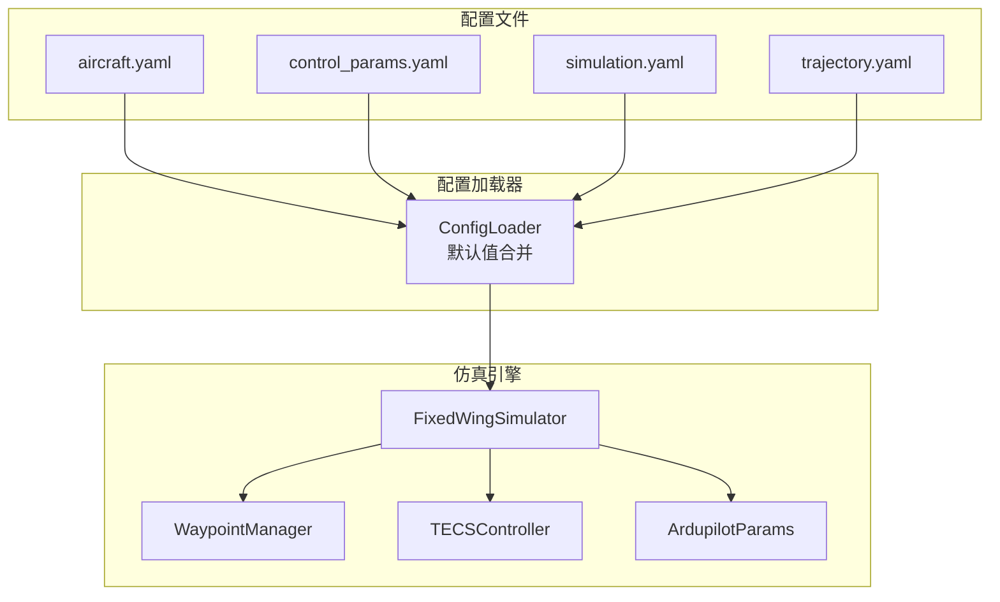
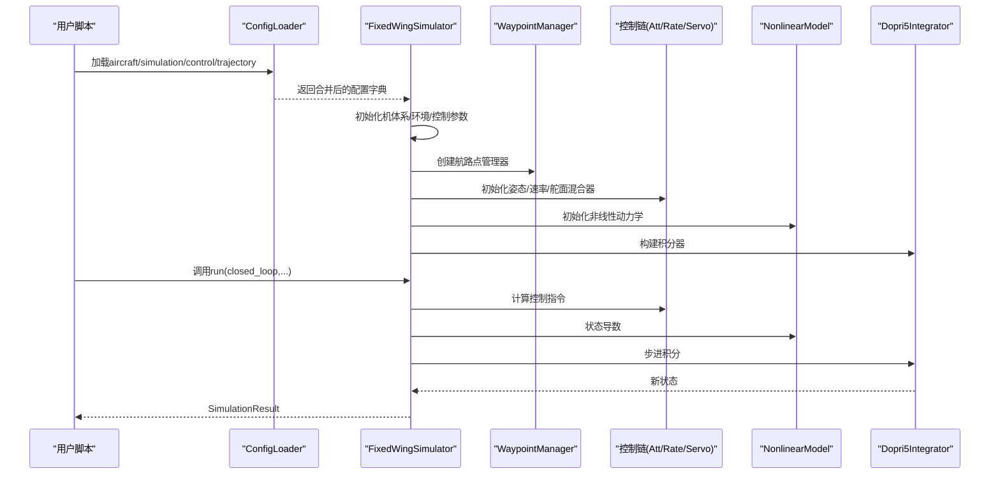
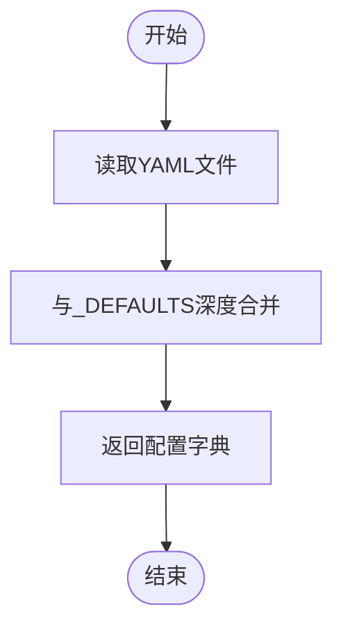
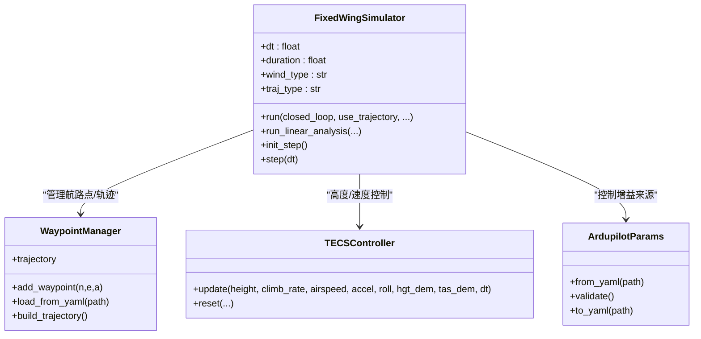
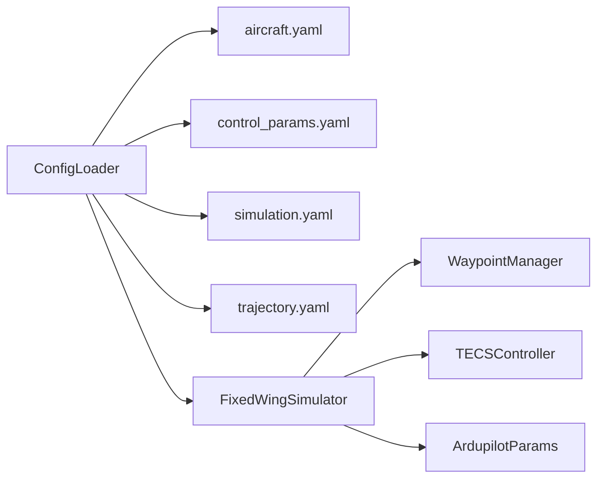

# 配置最佳实践

<cite>
**本文引用的文件**
- [config/aircraft.yaml](file://config/aircraft.yaml)
- [config/control_params.yaml](file://config/control_params.yaml)
- [config/simulation.yaml](file://config/simulation.yaml)
- [config/trajectory.yaml](file://config/trajectory.yaml)
- [src/utils/config_loader.py](file://src/utils/config_loader.py)
- [src/simulation/simulator.py](file://src/simulation/simulator.py)
- [src/models/aircraft_factory.py](file://src/models/aircraft_factory.py)
- [src/control/tecs_controller.py](file://src/control/tecs_controller.py)
- [src/control/ardupilot_compat.py](file://src/control/ardupilot_compat.py)
- [src/planning/waypoint_manager.py](file://src/planning/waypoint_manager.py)
- [examples/example_1_linear_response.py](file://examples/example_1_linear_response.py)
- [examples/example_3_trajectory_tracking.py](file://examples/example_3_trajectory_tracking.py)
- [tests/test_control.py](file://tests/test_control.py)
- [requirements.txt](file://requirements.txt)
</cite>

## 目录
1. [简介](#简介)
2. [项目结构](#项目结构)
3. [核心组件](#核心组件)
4. [架构总览](#架构总览)
5. [详细组件分析](#详细组件分析)
6. [依赖关系分析](#依赖关系分析)
7. [性能考虑](#性能考虑)
8. [故障排查指南](#故障排查指南)
9. [结论](#结论)
10. [附录](#附录)

## 简介
本指南面向FixedWingSimulator的配置管理，提供系统化的最佳实践，涵盖仿真步长选择、积分器参数设置、控制增益调节、不同飞行任务的配置策略、配置文件组织与命名规范、配置模板与示例、常见错误识别与解决、配置验证与测试方法、扩展与自定义参数添加步骤，以及配置版本管理与团队协作规范。

## 项目结构
配置系统围绕四个核心YAML文件与一个统一加载器展开：
- aircraft.yaml：机体系参数与可选覆盖项
- control_params.yaml：ArduPilot风格控制参数（含TECS）
- simulation.yaml：仿真引擎配置（步长、积分器、初始条件、风场、日志）
- trajectory.yaml：轨迹规划配置（类型、航路点、航向模式）

加载器负责默认值合并与深度合并，确保用户配置与默认配置协同工作。

**图表来源**
- [src/utils/config_loader.py](file://src/utils/config_loader.py#L10-L82)
- [src/simulation/simulator.py](file://src/simulation/simulator.py#L130-L230)
- [src/planning/waypoint_manager.py](file://src/planning/waypoint_manager.py#L20-L122)
- [src/control/tecs_controller.py](file://src/control/tecs_controller.py#L50-L130)
- [src/control/ardupilot_compat.py](file://src/control/ardupilot_compat.py#L17-L130)

**章节来源**
- [config/aircraft.yaml](file://config/aircraft.yaml#L1-L13)
- [config/control_params.yaml](file://config/control_params.yaml#L1-L45)
- [config/simulation.yaml](file://config/simulation.yaml#L1-L30)
- [config/trajectory.yaml](file://config/trajectory.yaml#L1-L23)
- [src/utils/config_loader.py](file://src/utils/config_loader.py#L10-L82)

## 核心组件
- ConfigLoader：加载并合并各模块配置，提供默认值保障
- FixedWingSimulator：装配机体系、环境、控制链、轨迹与动力学，驱动仿真循环
- WaypointManager：管理航路点、生成轨迹对象
- TECSController：总比能量控制（ArduPilot风格），与控制层协同
- ArdupilotParams：控制参数容器，支持从YAML加载与校验

**章节来源**
- [src/utils/config_loader.py](file://src/utils/config_loader.py#L59-L82)
- [src/simulation/simulator.py](file://src/simulation/simulator.py#L115-L230)
- [src/planning/waypoint_manager.py](file://src/planning/waypoint_manager.py#L20-L122)
- [src/control/tecs_controller.py](file://src/control/tecs_controller.py#L50-L130)
- [src/control/ardupilot_compat.py](file://src/control/ardupilot_compat.py#L17-L130)

## 架构总览
配置到仿真的数据流如下：

**图表来源**
- [src/utils/config_loader.py](file://src/utils/config_loader.py#L68-L82)
- [src/simulation/simulator.py](file://src/simulation/simulator.py#L130-L567)

## 详细组件分析

### 配置文件组织与命名规范
- 文件命名：采用小写短横线命名，语义清晰（aircraft.yaml、control_params.yaml、simulation.yaml、trajectory.yaml）
- 分类组织：按功能域拆分，避免单文件臃肿
- 可选覆盖：aircraft.yaml支持“overrides”键覆盖数据库默认参数
- 层次结构：控制参数采用分组注释（如“俯仰轴/横滚轴/偏航轴/限制/TECS”），便于维护与检索

**章节来源**
- [config/aircraft.yaml](file://config/aircraft.yaml#L1-L13)
- [config/control_params.yaml](file://config/control_params.yaml#L1-L45)
- [config/simulation.yaml](file://config/simulation.yaml#L1-L30)
- [config/trajectory.yaml](file://config/trajectory.yaml#L1-L23)

### ConfigLoader：默认值与深度合并
- 默认值集中于_config_loader.py中的_DEFAULTS，覆盖aircraft/simulation/trajectory三类
- _deep_merge实现递归合并，保证嵌套字典正确叠加
- load_aircraft/load_simulation/load_control/load_trajectory分别加载对应模块配置

**图表来源**
- [src/utils/config_loader.py](file://src/utils/config_loader.py#L10-L56)
- [src/utils/config_loader.py](file://src/utils/config_loader.py#L68-L82)

**章节来源**
- [src/utils/config_loader.py](file://src/utils/config_loader.py#L10-L82)

### 固定翼仿真器：配置注入与运行流程
- 初始化阶段：解析config_dir，加载simulation配置；构建AircraftFactory；初始化Wind；加载ArdupilotParams并校验；初始化FlightModeManager、NavigationController（含TECS）、Attitude/Rate/Servo
- 运行阶段：计算trim、构建ODE函数、初始化历史记录；根据closed_loop/use_trajectory选择路径；每步计算控制指令、记录状态、积分器步进

**图表来源**
- [src/simulation/simulator.py](file://src/simulation/simulator.py#L115-L230)
- [src/planning/waypoint_manager.py](file://src/planning/waypoint_manager.py#L20-L122)
- [src/control/tecs_controller.py](file://src/control/tecs_controller.py#L50-L130)
- [src/control/ardupilot_compat.py](file://src/control/ardupilot_compat.py#L74-L130)

**章节来源**
- [src/simulation/simulator.py](file://src/simulation/simulator.py#L130-L567)

### 航路点与轨迹：WaypointManager与trajectory.yaml
- WaypointManager支持从YAML加载航路点，自动转换正向上海拔为NED向下坐标
- 支持minimum_snap与minimum_jerk两类轨迹，提供yaw_mode与loop选项
- 提供save_to_yaml便于导出当前航路点

**章节来源**
- [src/planning/waypoint_manager.py](file://src/planning/waypoint_manager.py#L80-L122)
- [config/trajectory.yaml](file://config/trajectory.yaml#L1-L23)

### 控制参数：ArdupilotParams与TECS
- ArdupilotParams提供标准的飞控增益字段，支持from_yaml与validate
- TECSController实现总比能量控制，参数包括爬升/下沉速率上限、时间常数、油门/俯仰阻尼、积分增益、速度权重、坡度油门补偿、高度需求低通等

**章节来源**
- [src/control/ardupilot_compat.py](file://src/control/ardupilot_compat.py#L17-L130)
- [src/control/tecs_controller.py](file://src/control/tecs_controller.py#L50-L130)

## 依赖关系分析
- ConfigLoader对各配置模块提供统一入口，避免模块间直接耦合
- FixedWingSimulator依赖ConfigLoader提供的配置字典，再实例化各子系统
- WaypointManager与trajectory.yaml解耦，用户可选择手动添加航路点或从文件加载
- TECSController与ArdupilotParams紧密协作，参数来自control_params.yaml并经validate

**图表来源**
- [src/utils/config_loader.py](file://src/utils/config_loader.py#L68-L82)
- [src/simulation/simulator.py](file://src/simulation/simulator.py#L148-L230)

**章节来源**
- [src/utils/config_loader.py](file://src/utils/config_loader.py#L68-L82)
- [src/simulation/simulator.py](file://src/simulation/simulator.py#L148-L230)

## 性能考虑
- 仿真步长选择
  - 推荐范围：0.01~0.05秒，兼顾精度与效率
  - 高频动态（机动/快速响应）建议≤0.01秒；稳态/轨迹跟踪可放宽至0.02~0.05秒
  - 步长与积分器rtol/atol共同决定数值稳定性与计算成本
- 积分器与容差
  - 非实时批处理：rk45
  - 实时闭环：dopri5
  - rtol/atol建议：1e-6~1e-8，过严会增加计算量，过松影响收敛
- 控制层采样
  - 控制层dt由FixedWingSimulator传入，应与仿真步长一致或为整数倍
- TECS参数
  - TECS_TIME_CONST增大可平滑响应，但会增加超调与稳态误差
  - TECS_THR_DAMP与TECS_PTCH_DAMP提升阻尼，抑制振荡
  - TECS_INTEG_GAIN降低可减少积分饱和风险
- 轨迹类型
  - minimum_snap适合快速机动与高加速度场景
  - minimum_jerk适合平滑跟踪与低加速度要求场景

**章节来源**
- [config/simulation.yaml](file://config/simulation.yaml#L3-L12)
- [src/simulation/simulator.py](file://src/simulation/simulator.py#L239-L567)
- [src/control/tecs_controller.py](file://src/control/tecs_controller.py#L80-L130)

## 故障排查指南
- 常见配置错误
  - 控制参数越界：validate会检查范围，出现警告时需调整
  - TECS参数不当：过高阻尼导致响应迟滞；过低阻尼导致振荡
  - 航路点不足：WaypointManager需要至少2个航路点才能构建轨迹
  - 风场设置与实际不符：wind_type与wind_speed/wind_direction_deg需匹配
- 定位与修复
  - 使用tests/test_control.py中的单元测试验证PID/控制器行为
  - 在示例脚本中逐步替换配置，定位问题来源
  - 使用ArdupilotParams.validate()进行参数范围检查
- 验证与测试
  - 单元测试：覆盖PID、Attitude/Rate/ServoMixer等模块
  - 示例回归：example_1_linear_response.py与example_3_trajectory_tracking.py
  - 日志与可视化：开启log_enabled并检查输出目录

**章节来源**
- [tests/test_control.py](file://tests/test_control.py#L154-L195)
- [src/control/ardupilot_compat.py](file://src/control/ardupilot_compat.py#L104-L130)
- [src/planning/waypoint_manager.py](file://src/planning/waypoint_manager.py#L127-L140)
- [examples/example_1_linear_response.py](file://examples/example_1_linear_response.py#L132-L144)
- [examples/example_3_trajectory_tracking.py](file://examples/example_3_trajectory_tracking.py#L73-L80)

## 结论
通过标准化的配置文件组织、健壮的ConfigLoader合并机制、清晰的仿真装配流程与严格的参数校验，FixedWingSimulator实现了可扩展、可验证、可协作的配置管理体系。遵循本文最佳实践，可在不同飞行任务中快速获得稳定、高效的仿真结果。

## 附录

### 不同飞行任务的配置策略
- 稳定飞行（悬停/定高/定速）
  - 控制参数：适度阻尼（TECS_THR_DAMP、TECS_PTCH_DAMP），降低TECS_INTEG_GAIN
  - 仿真步长：≤0.01秒
  - 轨迹类型：无轨迹或hover模式
- 机动飞行（急转弯/爬升/俯冲）
  - 控制参数：提高ROLL_RATE_P/PTCH_RATE_P，适当增大LIM_ROLL_CD与LIM_PITCH_MAX
  - 仿真步长：≤0.01秒
  - 轨迹类型：minimum_snap
- 轨迹跟踪（方格/环形/航路点序列）
  - 航路点：使用WaypointManager.add_waypoint或load_from_yaml
  - 轨迹类型：minimum_snap或minimum_jerk
  - 航向模式：yaw_follow或zero

**章节来源**
- [config/control_params.yaml](file://config/control_params.yaml#L1-L45)
- [config/trajectory.yaml](file://config/trajectory.yaml#L1-L23)
- [src/planning/waypoint_manager.py](file://src/planning/waypoint_manager.py#L54-L122)

### 配置模板与示例
- 机体系模板：参考aircraft.yaml，使用overrides覆盖质量、机翼面积、弦长、翼展等
- 控制参数模板：参考control_params.yaml，按任务域调整增益与限制
- 仿真模板：参考simulation.yaml，设置dt、duration、wind、日志
- 轨迹模板：参考trajectory.yaml，设置type、average_speed、yaw_mode、waypoints、loop

**章节来源**
- [config/aircraft.yaml](file://config/aircraft.yaml#L1-L13)
- [config/control_params.yaml](file://config/control_params.yaml#L1-L45)
- [config/simulation.yaml](file://config/simulation.yaml#L1-L30)
- [config/trajectory.yaml](file://config/trajectory.yaml#L1-L23)

### 扩展与自定义参数
- 添加新参数
  - 在ArdupilotParams中新增字段与默认值
  - 在tecs_controller.py中相应位置读取并应用
  - 在ConfigLoader的_DEFAULTS中补充默认值
  - 在示例脚本与测试中覆盖/验证新参数
- 导出ArduPilot参数
  - 使用AircraftFactory.export_ardupilot_params将机体系与控制参数导出为.ArduPilot .param文件

**章节来源**
- [src/control/ardupilot_compat.py](file://src/control/ardupilot_compat.py#L17-L130)
- [src/control/tecs_controller.py](file://src/control/tecs_controller.py#L180-L213)
- [src/utils/config_loader.py](file://src/utils/config_loader.py#L10-L37)
- [src/models/aircraft_factory.py](file://src/models/aircraft_factory.py#L95-L136)

### 配置版本管理与团队协作
- 版本控制
  - 将config/*.yaml纳入版本库，使用分支隔离实验性配置
  - 重要变更提交时附带简要说明与影响评估
- 团队协作
  - 统一命名规范与注释风格
  - 使用示例脚本作为“可运行的配置文档”
  - 建立CI检查：运行tests/test_control.py与关键示例脚本
- 依赖与兼容
  - 锁定依赖版本（见requirements.txt），避免环境漂移

**章节来源**
- [requirements.txt](file://requirements.txt#L1-L8)
- [tests/test_control.py](file://tests/test_control.py#L1-L371)