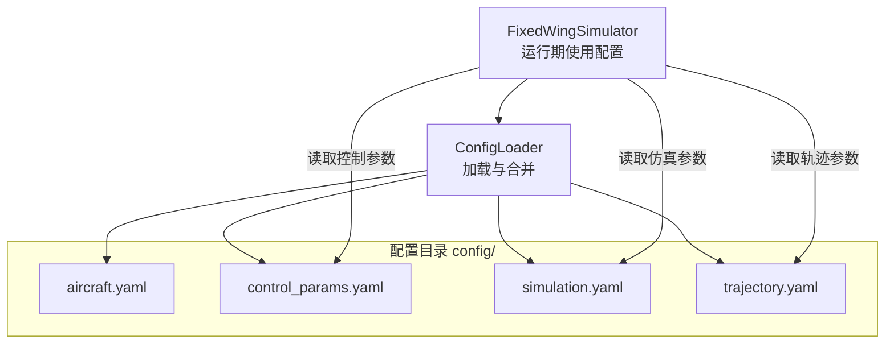
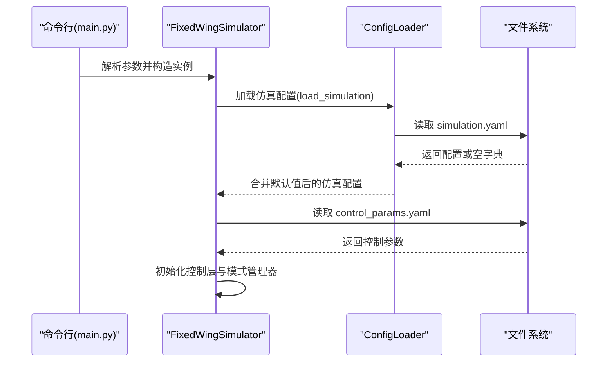
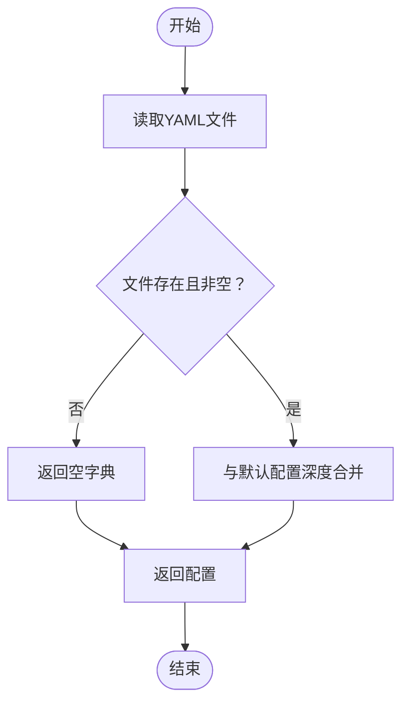
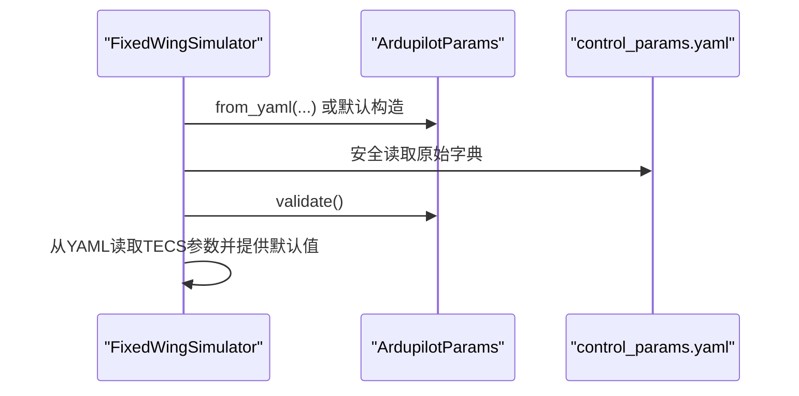
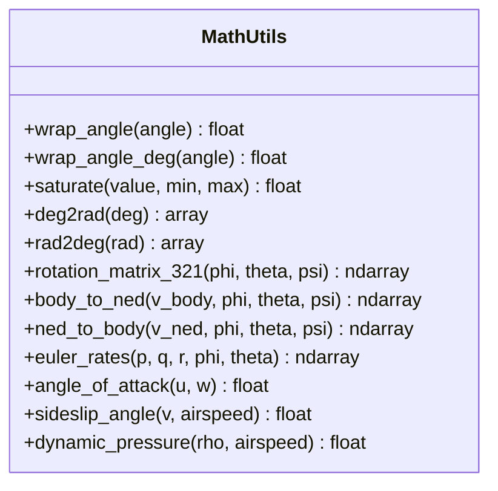
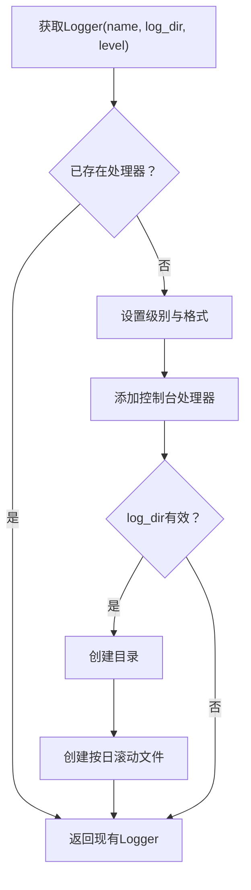
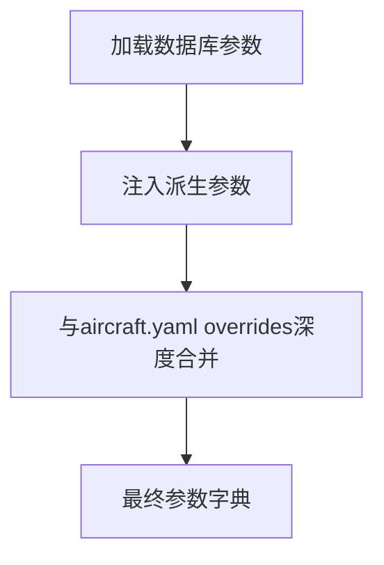
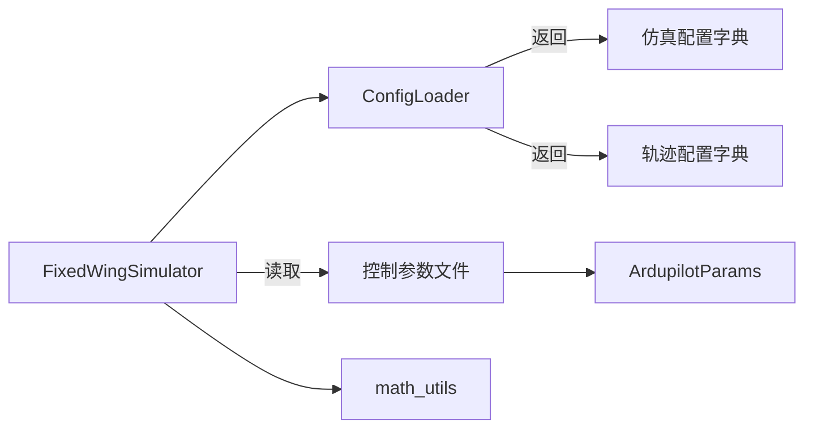

# 配置管理

<cite>
**本文引用的文件**
- [config/aircraft.yaml](file://config/aircraft.yaml)
- [config/control_params.yaml](file://config/control_params.yaml)
- [config/simulation.yaml](file://config/simulation.yaml)
- [config/trajectory.yaml](file://config/trajectory.yaml)
- [src/utils/config_loader.py](file://src/utils/config_loader.py)
- [src/utils/logger.py](file://src/utils/logger.py)
- [src/utils/math_utils.py](file://src/utils/math_utils.py)
- [src/simulation/simulator.py](file://src/simulation/simulator.py)
- [src/models/aircraft_database.py](file://src/models/aircraft_database.py)
- [main.py](file://main.py)
</cite>

## 目录
1. [简介](#简介)
2. [项目结构](#项目结构)
3. [核心组件](#核心组件)
4. [架构总览](#架构总览)
5. [详细组件分析](#详细组件分析)
6. [依赖关系分析](#依赖关系分析)
7. [性能考量](#性能考量)
8. [故障排查指南](#故障排查指南)
9. [结论](#结论)
10. [附录](#附录)

## 简介
本文件面向FixedWingSimulator的配置管理系统，系统性阐述配置文件加载器的实现原理与使用方法，覆盖YAML解析、参数合并与默认值处理、参数校验、日志系统配置与使用、数学工具函数库的用途与接口，并提供配置参数的最佳实践、调优建议、版本管理与迁移策略，以及如何扩展配置系统以支持新的参数类型。

## 项目结构
配置系统围绕“配置目录 + 加载器 + 使用方”三层组织：
- 配置目录：存放各子系统的YAML配置文件
- 配置加载器：统一读取、合并默认值与用户覆盖
- 使用方：在运行期按需读取所需配置，驱动仿真引擎

图表来源
- [src/utils/config_loader.py](file://src/utils/config_loader.py#L59-L81)
- [src/simulation/simulator.py](file://src/simulation/simulator.py#L148-L189)

章节来源
- [config/aircraft.yaml](file://config/aircraft.yaml#L1-L13)
- [config/control_params.yaml](file://config/control_params.yaml#L1-L45)
- [config/simulation.yaml](file://config/simulation.yaml#L1-L30)
- [config/trajectory.yaml](file://config/trajectory.yaml#L1-L23)
- [src/utils/config_loader.py](file://src/utils/config_loader.py#L10-L81)
- [src/simulation/simulator.py](file://src/simulation/simulator.py#L148-L189)

## 核心组件
- 配置加载器（ConfigLoader）：负责从配置目录加载各子系统配置，并与内置默认值进行深度合并，确保即使部分键缺失也能返回完整配置字典。
- 数学工具库（math_utils）：提供角度换算、饱和、旋转矩阵、欧拉角率等基础数学工具，支撑姿态与坐标变换。
- 日志系统（logger）：提供统一的日志记录器，支持控制台与文件输出，自动按日期滚动文件。

章节来源
- [src/utils/config_loader.py](file://src/utils/config_loader.py#L59-L81)
- [src/utils/math_utils.py](file://src/utils/math_utils.py#L1-L124)
- [src/utils/logger.py](file://src/utils/logger.py#L10-L43)

## 架构总览
配置系统在启动时由入口脚本解析命令行参数，随后实例化仿真器；仿真器内部通过ConfigLoader加载仿真配置，再结合控制参数文件与数据库参数完成初始化。控制层参数来自ArduPilot兼容参数对象，部分TECS参数直接从控制参数文件中读取并带默认值。

图表来源
- [main.py](file://main.py#L98-L122)
- [src/simulation/simulator.py](file://src/simulation/simulator.py#L148-L189)
- [src/utils/config_loader.py](file://src/utils/config_loader.py#L75-L77)

## 详细组件分析

### 配置文件格式与字段定义
- 飞机配置（aircraft.yaml）
  - 字段：aircraft_name（字符串）、overrides（可选字典，用于覆盖数据库默认值）
  - 用途：选择数据库中的机型并可选地覆盖几何与气动参数
  - 示例路径：[config/aircraft.yaml](file://config/aircraft.yaml#L1-L13)

- 控制参数（control_params.yaml）
  - 字段：飞行包线、轴向PID参数、限幅、TECS参数等
  - 用途：ArduPilot兼容控制参数，TECS参数用于能量控制
  - 示例路径：[config/control_params.yaml](file://config/control_params.yaml#L1-L45)

- 仿真设置（simulation.yaml）
  - 字段：dt、duration、integrator、rtol/atol、初始状态、初始模式、风场配置、日志开关与目录
  - 用途：仿真引擎的时间步长、求解器、初始条件与环境设置
  - 示例路径：[config/simulation.yaml](file://config/simulation.yaml#L1-L30)

- 轨迹参数（trajectory.yaml）
  - 字段：type、average_speed、yaw_mode、waypoints、loop
  - 用途：轨迹规划类型、平均速度、偏航控制模式、航路点序列与是否循环
  - 示例路径：[config/trajectory.yaml](file://config/trajectory.yaml#L1-L23)

章节来源
- [config/aircraft.yaml](file://config/aircraft.yaml#L1-L13)
- [config/control_params.yaml](file://config/control_params.yaml#L1-L45)
- [config/simulation.yaml](file://config/simulation.yaml#L1-L30)
- [config/trajectory.yaml](file://config/trajectory.yaml#L1-L23)

### 配置加载器实现原理
- 默认值集中管理：在模块级维护各子系统的默认配置字典，避免分散硬编码。
- 文件读取：安全解析YAML，若文件不存在则返回空字典，保证健壮性。
- 深度合并：递归合并用户配置到默认配置，优先使用用户配置键值。
- 接口设计：按子系统提供独立加载方法，便于按需读取。

图表来源
- [src/utils/config_loader.py](file://src/utils/config_loader.py#L40-L56)
- [src/utils/config_loader.py](file://src/utils/config_loader.py#L68-L81)

章节来源
- [src/utils/config_loader.py](file://src/utils/config_loader.py#L10-L81)

### 参数验证与默认值处理
- 控制参数校验：ArduPilot兼容参数对象在构建后执行validate，确保参数范围与组合合理。
- TECS参数回退：当控制参数文件中未提供特定TECS键时，使用加载器内联函数从原始YAML读取并提供默认值。
- 仿真参数回退：仿真器在未显式传入时使用ConfigLoader合并后的仿真配置。

图表来源
- [src/simulation/simulator.py](file://src/simulation/simulator.py#L166-L171)
- [src/simulation/simulator.py](file://src/simulation/simulator.py#L180-L189)

章节来源
- [src/simulation/simulator.py](file://src/simulation/simulator.py#L165-L189)

### 数学工具函数库
- 角度工具：弧度/角度互转、角度归一化（[-π,π]、[-180,180]）
- 饱和函数：数值裁剪到指定范围
- 旋转矩阵与坐标变换：基于3-2-1欧拉角的DCM与向量变换
- 欧拉角率：从机体角速率计算欧拉角时间导数，含数值稳定性保护
- 空气动力学辅助：攻角、侧滑角、动压

图表来源
- [src/utils/math_utils.py](file://src/utils/math_utils.py#L13-L124)

章节来源
- [src/utils/math_utils.py](file://src/utils/math_utils.py#L1-L124)

### 日志系统配置与使用
- 统一日志器：按名称获取Logger，若已配置则复用；否则设置级别与格式。
- 输出目标：控制台处理器始终启用；文件处理器可选，按日期生成日志文件。
- 使用建议：在模块内通过名称获取Logger，避免重复配置；生产批处理建议开启文件输出。

图表来源
- [src/utils/logger.py](file://src/utils/logger.py#L10-L43)

章节来源
- [src/utils/logger.py](file://src/utils/logger.py#L1-L44)

### 飞机参数数据库与覆盖机制
- 数据库：内置多型飞机的几何、气动与惯性参数，提供派生字段（如静压、密度、参考速度）。
- 覆盖机制：aircraft.yaml的overrides允许对数据库默认值进行增量覆盖，配合ConfigLoader的深度合并实现灵活定制。

图表来源
- [src/models/aircraft_database.py](file://src/models/aircraft_database.py#L143-L166)
- [src/utils/config_loader.py](file://src/utils/config_loader.py#L68-L70)

章节来源
- [src/models/aircraft_database.py](file://src/models/aircraft_database.py#L29-L166)
- [config/aircraft.yaml](file://config/aircraft.yaml#L7-L12)
- [src/utils/config_loader.py](file://src/utils/config_loader.py#L68-L70)

## 依赖关系分析
- ConfigLoader依赖文件系统与YAML解析库，返回标准化配置字典。
- FixedWingSimulator依赖ConfigLoader加载仿真配置，并在需要时读取控制参数文件。
- 控制层参数来源于ArduPilot兼容对象，部分TECS参数从控制参数文件读取并带默认值。
- 数学工具库被仿真引擎与控制层广泛使用，提供数值与几何变换能力。

图表来源
- [src/utils/config_loader.py](file://src/utils/config_loader.py#L59-L81)
- [src/simulation/simulator.py](file://src/simulation/simulator.py#L148-L189)
- [src/utils/math_utils.py](file://src/utils/math_utils.py#L1-L124)

章节来源
- [src/utils/config_loader.py](file://src/utils/config_loader.py#L59-L81)
- [src/simulation/simulator.py](file://src/simulation/simulator.py#L148-L189)
- [src/utils/math_utils.py](file://src/utils/math_utils.py#L1-L124)

## 性能考量
- 配置加载：YAML解析与深度合并均为轻量操作，开销可忽略；建议仅在启动阶段加载一次。
- 日志输出：文件写入可能成为批处理瓶颈，建议在大批量运行时适当降低日志级别或关闭文件输出。
- 数值计算：数学工具函数基于NumPy，向量化操作高效；注意避免在热路径上频繁创建大数组。

## 故障排查指南
- 配置文件缺失：ConfigLoader对不存在的文件返回空字典，不会抛出异常；若出现参数缺失，请检查配置文件路径与键名拼写。
- 参数越界或不合法：ArduPilot兼容参数对象在validate阶段会报错；请核对控制参数范围与组合。
- 日志无输出：确认log_dir有效且有写权限；检查Logger是否已被其他模块配置过。
- 轨迹点错误：检查waypoints格式与单位（正向上为NED z=-alt），确保loop与type符合预期。

章节来源
- [src/utils/config_loader.py](file://src/utils/config_loader.py#L40-L45)
- [src/simulation/simulator.py](file://src/simulation/simulator.py#L165-L171)
- [src/utils/logger.py](file://src/utils/logger.py#L35-L42)
- [config/trajectory.yaml](file://config/trajectory.yaml#L12-L22)

## 结论
配置管理系统通过集中默认值、安全解析与深度合并，提供了稳定可靠的配置加载能力；结合ArduPilot兼容控制参数与数学工具库，满足了固定翼无人机仿真与控制的多样化需求。建议在实际工程中遵循最佳实践，完善参数校验与日志策略，并在需要时扩展配置系统以支持新参数类型。

## 附录

### 配置参数最佳实践与调优指南
- 仿真步长与精度：dt与rtol/atol需权衡实时性与数值精度；高频响应场景建议减小dt并适度提高精度。
- 初始条件：初始位置采用NED坐标系，初始航向按磁北定义；初始模式应与任务类型匹配。
- 风场设置：NONE适用于无风假设；FIXED/SINE/RANDOMSINE用于真实环境模拟，注意风速与方向的物理合理性。
- 轨迹规划：minimum_snap适合快速机动；average_speed影响航段时间；yaw_mode根据任务需求选择。
- 控制参数：先以默认值验证系统稳定性，再逐步微调PID与TECS参数；注意限幅与积分项的平衡。

### 版本管理与迁移方法
- 版本标识：在配置文件中增加version字段（建议采用语义化版本），并在加载器中进行兼容性检查。
- 渐进迁移：新增字段时保持向后兼容，默认值指向新字段，旧字段保留过渡期。
- 自动迁移：在加载器中提供迁移函数，将旧版配置映射到新版键名与结构。
- 文档同步：每次迁移更新配置格式说明与示例文件，确保用户手册与代码注释一致。

### 扩展配置系统以支持新的参数类型
- 新增子系统：在_config_loader.py中添加新的默认配置键与加载方法。
- 参数校验：为新参数类型定义校验规则与默认值，必要时在相应模块中增加validate逻辑。
- 使用集成：在仿真器或控制层中新增读取流程，确保新参数参与计算。
- 文档与示例：补充配置文件示例与字段说明，便于用户理解与使用。