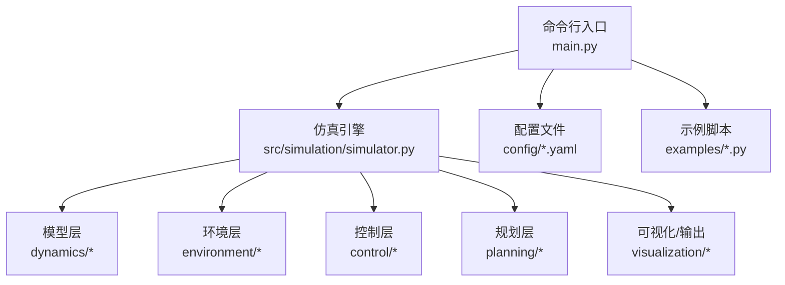
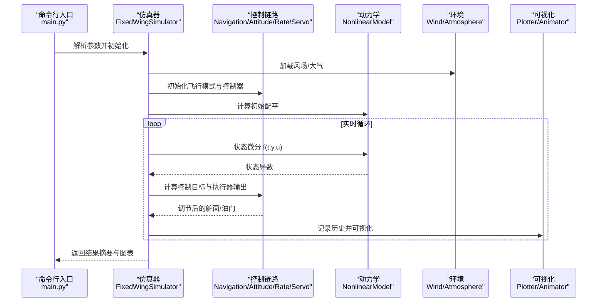
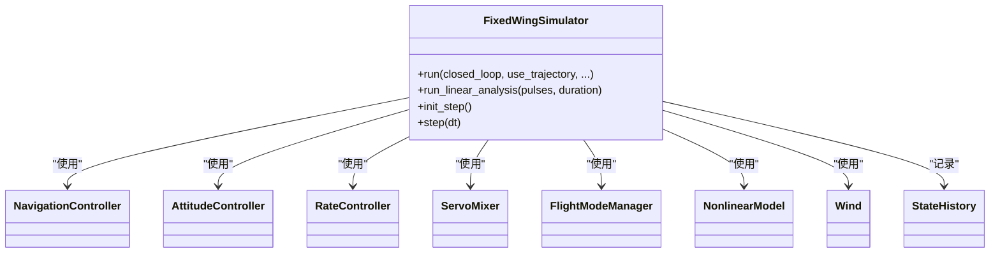
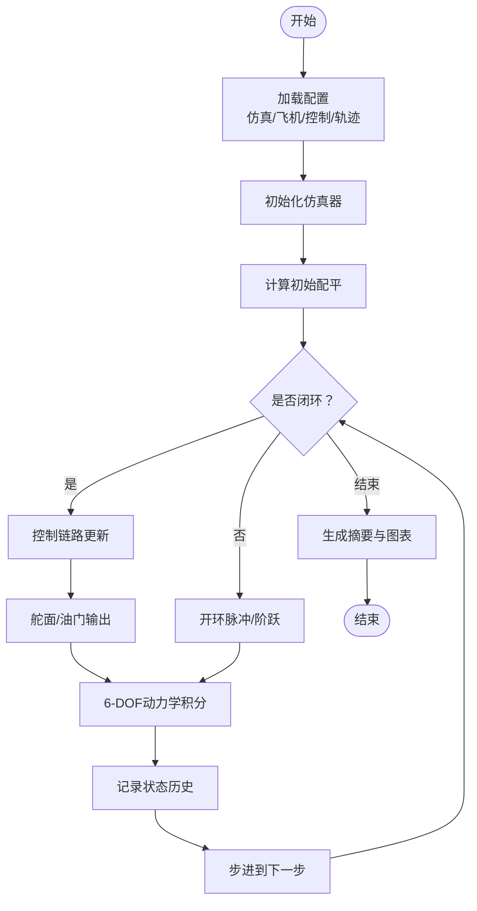
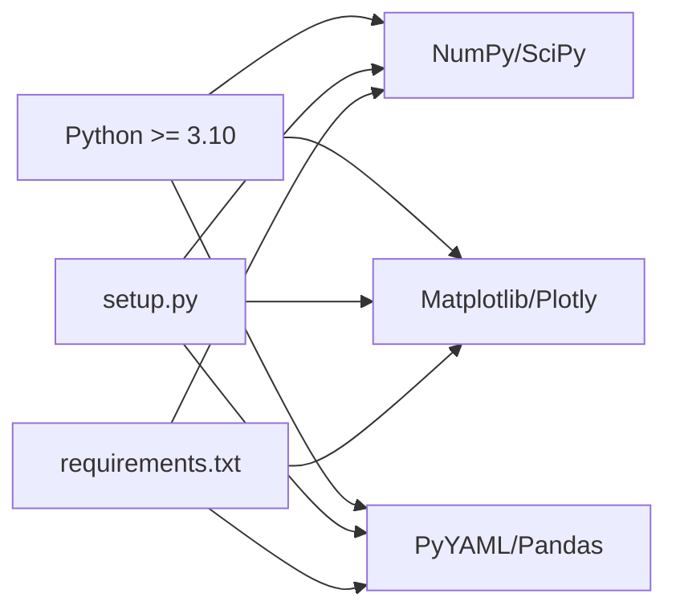

# 应用场景与优势

<cite>
**本文引用的文件**
- [main.py](file://main.py)
- [setup.py](file://setup.py)
- [requirements.txt](file://requirements.txt)
- [config/simulation.yaml](file://config/simulation.yaml)
- [config/aircraft.yaml](file://config/aircraft.yaml)
- [config/control_params.yaml](file://config/control_params.yaml)
- [config/trajectory.yaml](file://config/trajectory.yaml)
- [src/simulation/simulator.py](file://src/simulation/simulator.py)
- [src/models/aircraft_database.py](file://src/models/aircraft_database.py)
- [src/control/ardupilot_compat.py](file://src/control/ardupilot_compat.py)
- [examples/example_1_linear_response.py](file://examples/example_1_linear_response.py)
- [examples/example_2_nonlinear_dynamics.py](file://examples/example_2_nonlinear_dynamics.py)
- [examples/example_3_trajectory_tracking.py](file://examples/example_3_trajectory_tracking.py)
- [examples/example_4_circuit_flight.py](file://examples/example_4_circuit_flight.py)
</cite>

## 目录
1. [引言](#引言)
2. [项目结构](#项目结构)
3. [核心组件](#核心组件)
4. [架构总览](#架构总览)
5. [详细组件分析](#详细组件分析)
6. [依赖关系分析](#依赖关系分析)
7. [性能与精度](#性能与精度)
8. [应用场景与优势](#应用场景与优势)
9. [使用指南与适用人群](#使用指南与适用人群)
10. [故障排查](#故障排查)
11. [结论](#结论)

## 引言
本文件面向FixedWingSimulator项目，系统阐述其在航空航天教学、无人机研究、控制系统开发、飞行器设计验证等领域的应用场景，并基于代码实现与示例文件，客观分析项目在ArduPilot兼容性、多飞机参数数据库、高保真非线性动力学、五层控制链路、轨迹规划与可视化等方面的差异化优势。同时提供可复现的使用案例与性能评估方法，帮助读者快速判断项目是否满足自身需求。

## 项目结构
项目采用模块化分层组织：命令行入口负责参数解析与运行调度；仿真引擎协调模型、环境、控制、规划与状态管理；示例脚本演示典型场景；配置文件提供参数化能力；输出目录保存CSV与图表。

图示来源
- [main.py](file://main.py#L98-L145)
- [src/simulation/simulator.py](file://src/simulation/simulator.py#L115-L128)

章节来源
- [main.py](file://main.py#L1-L145)
- [config/simulation.yaml](file://config/simulation.yaml#L1-L30)
- [config/aircraft.yaml](file://config/aircraft.yaml#L1-L13)
- [config/control_params.yaml](file://config/control_params.yaml#L1-L45)
- [config/trajectory.yaml](file://config/trajectory.yaml#L1-L23)

## 核心组件
- 固定翼仿真器：封装ArduPilot兼容控制链路、6-DOF非线性动力学、风场与大气密度模型、轨迹规划与可视化接口。
- 飞机参数数据库：内置多型固定翼无人机参数，支持派生字段注入与查询。
- 控制参数容器：提供ArduPilot参数命名规范的数据类，支持YAML导入导出与范围校验。
- 示例脚本：覆盖线性开环脉冲响应、非线性闭环稳定、轨迹跟踪、航线巡线等典型场景。

章节来源
- [src/simulation/simulator.py](file://src/simulation/simulator.py#L115-L128)
- [src/models/aircraft_database.py](file://src/models/aircraft_database.py#L29-L133)
- [src/control/ardupilot_compat.py](file://src/control/ardupilot_compat.py#L17-L130)
- [examples/example_1_linear_response.py](file://examples/example_1_linear_response.py#L1-L206)
- [examples/example_2_nonlinear_dynamics.py](file://examples/example_2_nonlinear_dynamics.py#L1-L215)
- [examples/example_3_trajectory_tracking.py](file://examples/example_3_trajectory_tracking.py#L1-L194)
- [examples/example_4_circuit_flight.py](file://examples/example_4_circuit_flight.py#L1-L275)

## 架构总览
下图展示从命令行到仿真引擎、控制链路与可视化输出的端到端流程。

图示来源
- [main.py](file://main.py#L98-L145)
- [src/simulation/simulator.py](file://src/simulation/simulator.py#L239-L567)

## 详细组件分析

### 仿真器与控制链路
- 五层控制链路：导航控制器（L1航路点跟踪）、姿态控制器、速率控制器、舵面混合器、飞行模式管理器，形成与ArduPilot一致的控制架构。
- TECS能量控制：通过高度/空速目标生成俯仰/油门参考，结合阻尼与积分参数抑制振荡。
- 风场与密度：根据海拔动态计算空气密度，将NED风转换到机体坐标参与动力学。
- 轨迹与航路点：支持多项式轨迹（最小Snap/Jerk）与简单航路点顺序切换两种模式。

图示来源
- [src/simulation/simulator.py](file://src/simulation/simulator.py#L115-L234)

章节来源
- [src/simulation/simulator.py](file://src/simulation/simulator.py#L239-L567)
- [src/control/ardupilot_compat.py](file://src/control/ardupilot_compat.py#L17-L130)

### 飞机参数数据库
- 内置7型固定翼无人机参数，涵盖气动、惯性、几何等关键字段，并注入派生参数（如静压、密度、动压）供动力学与控制使用。
- 提供参数查询、列表与信息摘要接口，便于快速选择与对比。

章节来源
- [src/models/aircraft_database.py](file://src/models/aircraft_database.py#L29-L183)

### 控制参数容器（ArduPilot兼容）
- 字段名严格遵循ArduPilot命名规范，支持从YAML加载、导出与范围校验，便于与真实飞控参数对齐。
- 包含TECS相关参数，便于在不同机型上快速适配。

章节来源
- [src/control/ardupilot_compat.py](file://src/control/ardupilot_compat.py#L17-L130)
- [config/control_params.yaml](file://config/control_params.yaml#L1-L45)

### 示例脚本与典型流程
- 线性开环与闭环对比：展示短周期/长周期模态与PID闭环响应差异。
- 非线性闭环：在STABILIZE模式下进行滚转阶跃响应与稳态对比。
- 轨迹跟踪：AUTO模式下的最小Snap方形轨迹跟踪与3D可视化。
- 巡航电路：航路点顺序切换与高度/油门稳态分析。

图示来源
- [examples/example_1_linear_response.py](file://examples/example_1_linear_response.py#L83-L206)
- [examples/example_2_nonlinear_dynamics.py](file://examples/example_2_nonlinear_dynamics.py#L77-L215)
- [examples/example_3_trajectory_tracking.py](file://examples/example_3_trajectory_tracking.py#L67-L194)
- [examples/example_4_circuit_flight.py](file://examples/example_4_circuit_flight.py#L75-L275)

章节来源
- [examples/example_1_linear_response.py](file://examples/example_1_linear_response.py#L1-L206)
- [examples/example_2_nonlinear_dynamics.py](file://examples/example_2_nonlinear_dynamics.py#L1-L215)
- [examples/example_3_trajectory_tracking.py](file://examples/example_3_trajectory_tracking.py#L1-L194)
- [examples/example_4_circuit_flight.py](file://examples/example_4_circuit_flight.py#L1-L275)

## 依赖关系分析
- Python版本与第三方库：要求Python 3.10+，依赖NumPy、SciPy、Matplotlib、Plotly、PyYAML、Pandas等。
- 安装与打包：通过setuptools定义包结构与安装依赖，支持开发依赖pytest。
- 配置驱动：仿真参数、飞机参数、控制参数、轨迹参数均来自YAML配置，便于实验与复现。

图示来源
- [setup.py](file://setup.py#L10-L22)
- [requirements.txt](file://requirements.txt#L1-L8)

章节来源
- [setup.py](file://setup.py#L1-L23)
- [requirements.txt](file://requirements.txt#L1-L8)

## 性能与精度
- 数值积分：默认使用dopri5（变步长RK）积分器，兼顾实时性与精度；仿真步长可配置，默认100 Hz。
- 风场与密度：按海拔动态计算空气密度，风场支持无风、固定风、正弦扰动等类型。
- 控制参数：提供TECS与PID参数模板，支持YAML覆盖，便于快速调参与跨机型迁移。
- 输出与可视化：自动保存CSV与PNG图表，支持批量运行与离线分析。

章节来源
- [config/simulation.yaml](file://config/simulation.yaml#L1-L30)
- [config/control_params.yaml](file://config/control_params.yaml#L1-L45)
- [src/simulation/simulator.py](file://src/simulation/simulator.py#L339-L339)

## 应用场景与优势

### 应用场景
- 航空航天教学
  - 线性与非线性模型对比：通过线性开环脉冲响应与闭环PID响应对比，直观展示短周期/长周期模态与控制系统作用。
  - 轨迹跟踪与航路点切换：演示AUTO模式下的路径跟踪与航路点顺序切换，便于讲授导航与控制概念。
- 无人机研究
  - 多机型参数对比：利用内置数据库快速切换TB2、Predator等机型，开展参数敏感性与控制策略对比研究。
  - 风场影响评估：通过风模型配置评估不同风况对飞行品质的影响。
- 控制系统开发
  - ArduPilot兼容参数：直接使用ArduPilot命名参数，便于与真实飞控参数对齐与验证。
  - TECS与PID参数模板：提供TECS爬升/下降、阻尼与积分参数模板，加速闭环控制器设计与调试。
- 飞行器设计验证
  - 非线性闭环验证：在STABILIZE/FBW等模式下验证姿态与速率控制回路稳定性。
  - 巡航电路与稳态分析：通过长时间闭环运行评估高度/速度稳态误差与控制带宽。

### 差异化优势
- ArduPilot兼容性
  - 控制参数命名与字段覆盖：与ArduPilot一致的参数命名，便于参数迁移与一致性验证。
  - 五层控制链路：导航→姿态→速率→舵面→模式管理，贴近真实飞控实现。
- 多飞机支持
  - 内置7型固定翼无人机参数，支持派生参数注入与查询，便于跨机型对比。
- 高精度仿真
  - 6-DOF非线性动力学与动态密度模型，支持风场与多种轨迹模式。
  - 默认dopri5积分器与100 Hz步长，兼顾实时性与数值稳定性。
- 易用性与可复现性
  - YAML配置驱动，示例脚本覆盖典型场景，便于快速上手与批量实验。

### 使用案例与成功实践
- 线性与闭环对比案例：展示开环脉冲响应与闭环PID响应，便于教学与课程设计。
- 非线性闭环案例：在STABILIZE模式下进行滚转阶跃，评估姿态控制回路性能。
- 轨迹跟踪案例：AUTO模式下的方形轨迹跟踪，输出3D路径与状态历史。
- 巡航电路案例：航路点顺序切换与稳态误差统计，支持长时间闭环运行与性能评估。

章节来源
- [examples/example_1_linear_response.py](file://examples/example_1_linear_response.py#L1-L206)
- [examples/example_2_nonlinear_dynamics.py](file://examples/example_2_nonlinear_dynamics.py#L1-L215)
- [examples/example_3_trajectory_tracking.py](file://examples/example_3_trajectory_tracking.py#L1-L194)
- [examples/example_4_circuit_flight.py](file://examples/example_4_circuit_flight.py#L1-L275)

## 使用指南与适用人群
- 适用人群
  - 航空工程与无人机专业教师与学生：用于理论与仿真实践结合的教学。
  - 控制系统工程师：用于控制器设计、参数整定与闭环验证。
  - 飞行器设计工程师：用于气动/结构参数对飞行品质的影响评估。
- 技能要求
  - Python基础与科学计算库使用经验（NumPy/SciPy/Matplotlib）。
  - 对固定翼飞行器动力学与控制有基本理解（模态、PID、TECS等）。
  - 能够阅读与修改YAML配置文件，理解参数含义与影响范围。
- 快速上手
  - 使用命令行参数快速启动默认仿真或指定机型/模式/风场/轨迹。
  - 通过示例脚本学习典型场景，再扩展到自定义任务。
  - 利用输出CSV与图表进行后处理与报告生成。

章节来源
- [main.py](file://main.py#L32-L95)
- [config/simulation.yaml](file://config/simulation.yaml#L1-L30)
- [config/aircraft.yaml](file://config/aircraft.yaml#L1-L13)
- [config/control_params.yaml](file://config/control_params.yaml#L1-L45)
- [config/trajectory.yaml](file://config/trajectory.yaml#L1-L23)

## 故障排查
- 参数越界与警告
  - 控制参数范围校验会打印警告，建议检查参数范围与单位（如升限、滚转限制等）。
- 集成错误
  - 若出现积分器报错，检查风场/密度/控制输入是否异常，适当调整步长或积分器容差。
- 风场与密度
  - 风场类型与密度随海拔变化，确保初始高度与风参数匹配。
- 可视化缺失
  - 若缺少绘图依赖，将无法显示交互窗口，但CSV与PNG仍会保存。

章节来源
- [src/control/ardupilot_compat.py](file://src/control/ardupilot_compat.py#L104-L130)
- [src/simulation/simulator.py](file://src/simulation/simulator.py#L558-L562)

## 结论
FixedWingSimulator以ArduPilot兼容的控制链路为核心，结合高保真的6-DOF非线性动力学与丰富的配置能力，在教学、研究与工程验证中具备明确的应用价值。通过示例脚本与参数化配置，用户可以快速搭建从线性分析到闭环飞行的完整仿真流程，并基于输出数据进行深入分析与优化。