# 技术架构概览

<cite>
**本文档引用的文件**
- [main.py](file://main.py)
- [setup.py](file://setup.py)
- [requirements.txt](file://requirements.txt)
- [README.md](file://README.md)
- [src/simulation/simulator.py](file://src/simulation/simulator.py)
- [src/models/aircraft_factory.py](file://src/models/aircraft_factory.py)
- [src/models/aircraft_database.py](file://src/models/aircraft_database.py)
- [src/dynamics/nonlinear_model.py](file://src/dynamics/nonlinear_model.py)
- [src/control/flight_mode_manager.py](file://src/control/flight_mode_manager.py)
- [src/control/navigation_controller.py](file://src/control/navigation_controller.py)
- [src/planning/trajectory_base.py](file://src/planning/trajectory_base.py)
- [src/simulation/state_manager.py](file://src/simulation/state_manager.py)
- [src/utils/config_loader.py](file://src/utils/config_loader.py)
- [src/environment/atmosphere_model.py](file://src/environment/atmosphere_model.py)
</cite>

## 目录
1. [引言](#引言)
2. [项目结构](#项目结构)
3. [核心组件](#核心组件)
4. [架构总览](#架构总览)
5. [详细组件分析](#详细组件分析)
6. [依赖关系分析](#依赖关系分析)
7. [性能考量](#性能考量)
8. [故障排查指南](#故障排查指南)
9. [结论](#结论)
10. [附录](#附录)

## 引言
本项目为固定翼无人机仿真平台，支持线性与非线性6自由度（6-DOF）飞行仿真、轨迹规划与跟踪、多层级控制链路（导航控制器+姿态/角速率控制器+舵面混合器）、环境建模（风场与大气密度）以及可视化输出。系统采用模块化与分层架构：入口程序负责参数解析与运行模式调度；仿真引擎作为编排器协调各子模块；动力学模块提供非线性方程与线性化工具；控制模块实现ArduPilot兼容的飞行模式管理与TECS能量控制；规划模块提供轨迹基类与路径段抽象；状态管理器负责高效的历史记录；配置加载器统一管理各类YAML配置。

## 项目结构
项目采用按功能域划分的包结构，核心目录与职责如下：
- src/simulation：仿真引擎与状态管理（FixedWingSimulator、StateHistory、Integration封装）
- src/models：飞机参数数据库与工厂（aircraft_database、aircraft_factory）
- src/dynamics：非线性6-DOF动力学与线性模型
- src/control：飞行模式管理、导航控制器（L1+TECS）、姿态/角速率/舵面混合
- src/planning：轨迹基类与路径段抽象
- src/environment：大气模型与风模型接口
- src/utils：配置加载、数学工具、日志等
- src/visualization：绘图与动画（在结果对象中被调用）
- config：默认配置文件（aircraft.yaml、control_params.yaml、simulation.yaml、trajectory.yaml）

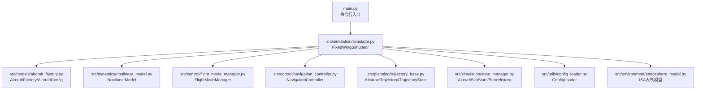

图表来源
- [main.py](file://main.py#L98-L145)
- [src/simulation/simulator.py](file://src/simulation/simulator.py#L115-L642)
- [src/models/aircraft_factory.py](file://src/models/aircraft_factory.py#L39-L136)
- [src/dynamics/nonlinear_model.py](file://src/dynamics/nonlinear_model.py#L104-L386)
- [src/control/flight_mode_manager.py](file://src/control/flight_mode_manager.py#L115-L298)
- [src/control/navigation_controller.py](file://src/control/navigation_controller.py#L45-L293)
- [src/planning/trajectory_base.py](file://src/planning/trajectory_base.py#L26-L47)
- [src/simulation/state_manager.py](file://src/simulation/state_manager.py#L95-L193)
- [src/utils/config_loader.py](file://src/utils/config_loader.py#L59-L82)
- [src/environment/atmosphere_model.py](file://src/environment/atmosphere_model.py#L24-L77)

章节来源
- [main.py](file://main.py#L1-L145)
- [setup.py](file://setup.py#L1-L23)
- [requirements.txt](file://requirements.txt#L1-L8)

## 核心组件
- 固定翼仿真器（FixedWingSimulator）
  - 负责装配并编排所有子系统：模型、环境、控制、规划、动力学、状态管理
  - 提供闭回路与开回路两种运行模式，支持线性分析与轨迹跟踪
- 飞机参数工厂（AircraftFactory/AircraftConfig）
  - 从数据库读取参数，支持YAML覆盖与字典覆盖，导出ArduPilot参数
- 非线性动力学（NonlinearModel）
  - 6-DOF非线性方程、配平求解、ODE函数封装、批量仿真结果容器
- 控制系统
  - 飞行模式管理（FlightModeManager）：ArduPilot兼容模式切换与目标生成
  - 导航控制器（NavigationController）：L1横向导航+TECS纵向能量控制
  - 姿态/角速率/舵面混合器（AttitudeController/RateController/ServoMixer）
- 规划系统（WaypointManager + AbstractTrajectory）
  - 路径段抽象与轨迹基类，支持多种轨迹类型
- 状态管理（AircraftSimState/StateHistory）
  - 12维状态容器与高效历史缓冲区
- 配置加载（ConfigLoader）
  - 统一加载与合并各子系统配置
- 环境建模（Wind/Atmosphere）
  - 风模型与国际标准大气（ISA）密度计算

章节来源
- [src/simulation/simulator.py](file://src/simulation/simulator.py#L115-L642)
- [src/models/aircraft_factory.py](file://src/models/aircraft_factory.py#L39-L136)
- [src/dynamics/nonlinear_model.py](file://src/dynamics/nonlinear_model.py#L104-L386)
- [src/control/flight_mode_manager.py](file://src/control/flight_mode_manager.py#L115-L298)
- [src/control/navigation_controller.py](file://src/control/navigation_controller.py#L45-L293)
- [src/planning/trajectory_base.py](file://src/planning/trajectory_base.py#L26-L47)
- [src/simulation/state_manager.py](file://src/simulation/state_manager.py#L95-L193)
- [src/utils/config_loader.py](file://src/utils/config_loader.py#L59-L82)
- [src/environment/atmosphere_model.py](file://src/environment/atmosphere_model.py#L24-L77)

## 架构总览
系统采用“入口程序 → 仿真引擎 → 子系统编排”的分层结构。入口程序负责参数解析与运行模式选择；仿真引擎作为编排器，构建并驱动各子模块；子模块之间通过清晰的数据契约（如AircraftState、ControlTarget、TrajectoryState）进行交互。

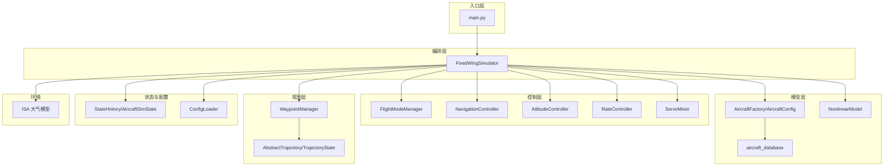

图表来源
- [main.py](file://main.py#L98-L145)
- [src/simulation/simulator.py](file://src/simulation/simulator.py#L115-L642)
- [src/models/aircraft_factory.py](file://src/models/aircraft_factory.py#L39-L136)
- [src/models/aircraft_database.py](file://src/models/aircraft_database.py#L143-L166)
- [src/dynamics/nonlinear_model.py](file://src/dynamics/nonlinear_model.py#L104-L386)
- [src/control/flight_mode_manager.py](file://src/control/flight_mode_manager.py#L115-L298)
- [src/control/navigation_controller.py](file://src/control/navigation_controller.py#L45-L293)
- [src/planning/trajectory_base.py](file://src/planning/trajectory_base.py#L26-L47)
- [src/simulation/state_manager.py](file://src/simulation/state_manager.py#L95-L193)
- [src/utils/config_loader.py](file://src/utils/config_loader.py#L59-L82)
- [src/environment/atmosphere_model.py](file://src/environment/atmosphere_model.py#L24-L77)

## 详细组件分析

### 仿真引擎（FixedWingSimulator）
- 职责
  - 加载配置与飞机参数
  - 构建控制链路（导航→姿态→角速率→舵面）
  - 驱动非线性动力学与轨迹规划
  - 记录状态历史并生成结果
- 关键流程
  - 初始化：读取配置、创建飞机参数、实例化控制与规划模块、构建动力学
  - 运行：根据模式计算ControlTarget，经控制器链路得到舵面输出，推进ODE，记录历史
  - 结果：封装StateHistory与配平结果，提供摘要与可视化
- 数据流
  - 输入：飞机名称、仿真时长、步长、风类型、轨迹类型、初始模式
  - 处理：状态→AircraftState→ControlTarget→ServoOutput→Controls→ODE→下一状态
  - 输出：SimulationResult（包含历史、配平、是否闭回路）

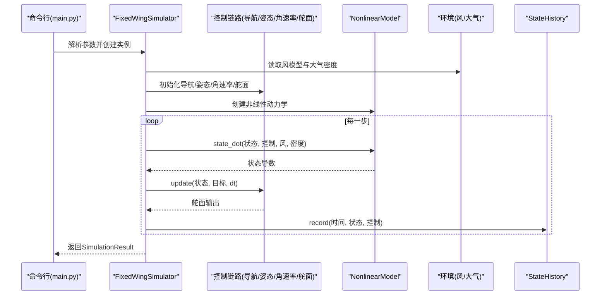

图表来源
- [src/simulation/simulator.py](file://src/simulation/simulator.py#L239-L567)
- [src/dynamics/nonlinear_model.py](file://src/dynamics/nonlinear_model.py#L160-L255)
- [src/control/navigation_controller.py](file://src/control/navigation_controller.py#L134-L202)
- [src/simulation/state_manager.py](file://src/simulation/state_manager.py#L124-L168)

章节来源
- [src/simulation/simulator.py](file://src/simulation/simulator.py#L115-L642)

### 飞行模式管理（FlightModeManager）
- 职责
  - 支持MANUAL、STABILIZE、FBW_A、FBW_B、AUTO、LOITER、RTH等模式
  - 在模式切换时进行过渡与目标生成
- 数据契约
  - 输入：AircraftState、可选导航目标
  - 输出：ControlTarget（角度、角速率、空速/高度、油门、直接控制标志）

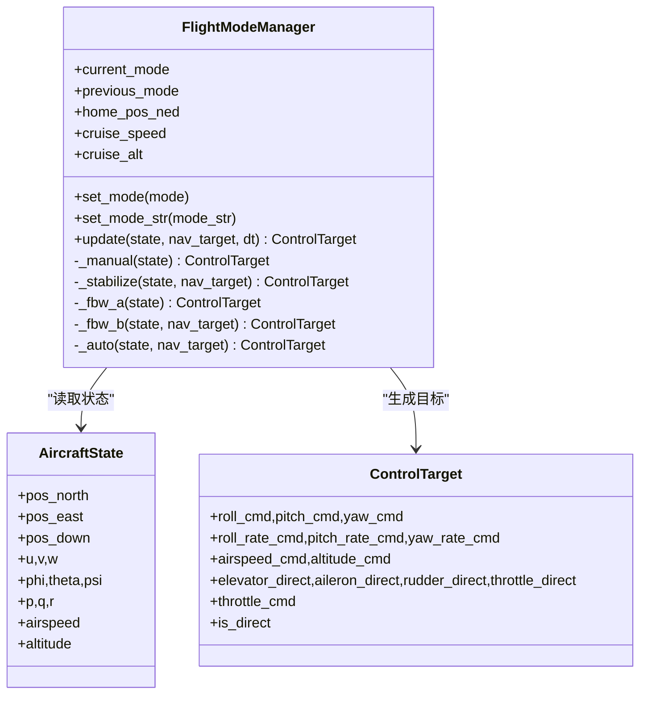

图表来源
- [src/control/flight_mode_manager.py](file://src/control/flight_mode_manager.py#L115-L298)

章节来源
- [src/control/flight_mode_manager.py](file://src/control/flight_mode_manager.py#L115-L298)

### 导航控制器（NavigationController）
- 职责
  - L1横向导航律：基于路径段与当前侧速推导期望滚转角
  - TECS纵向能量控制：高度与空速联合控制，输出俯仰角与油门
- 关键算法
  - L1：计算沿轨距离与前瞻点，推导横向加速度，转换为滚转角
  - TECS：估计爬升率与纵向加速度，综合高度/空速需求，输出目标俯仰与油门

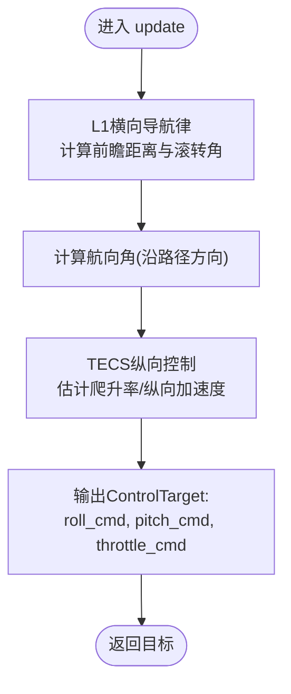

图表来源
- [src/control/navigation_controller.py](file://src/control/navigation_controller.py#L134-L202)
- [src/control/navigation_controller.py](file://src/control/navigation_controller.py#L206-L293)

章节来源
- [src/control/navigation_controller.py](file://src/control/navigation_controller.py#L45-L293)

### 动力学模块（NonlinearModel）
- 职责
  - 6-DOF非线性方程：力/力矩平衡、欧拉角运动学、位置运动学
  - 配平求解：水平直线飞行条件下的攻角与升降舵配平
  - ODE封装：面向实时积分器的函数接口
- 关键点
  - 状态向量：[u,v,w,p,q,r,φ,θ,ψ,xN,xE,xD]
  - 控制输入：升降舵、副翼、方向舵、油门
  - 密度随高度变化：通过ISA模型动态计算

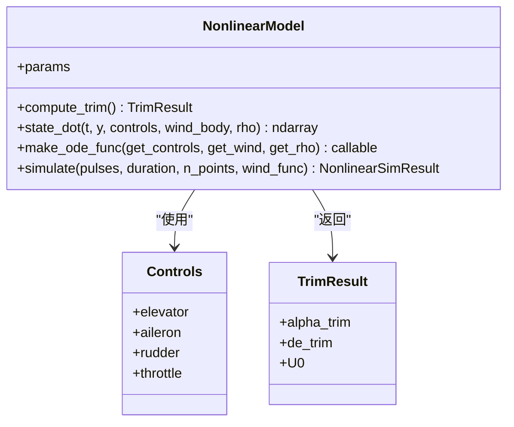

图表来源
- [src/dynamics/nonlinear_model.py](file://src/dynamics/nonlinear_model.py#L104-L386)

章节来源
- [src/dynamics/nonlinear_model.py](file://src/dynamics/nonlinear_model.py#L104-L386)

### 规划与轨迹（WaypointManager + AbstractTrajectory）
- 职责
  - WaypointManager：Waypoint集合管理与轨迹生成（最小急振/最小加加速度等）
  - AbstractTrajectory：统一的轨迹接口，提供desired_state(t)
- 交互
  - 仿真器在每步查询轨迹的期望状态，并将其转换为导航目标

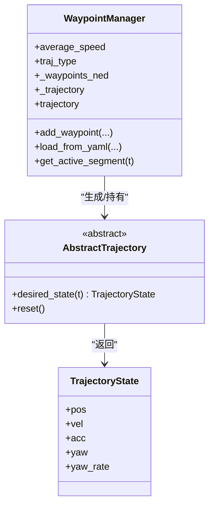

图表来源
- [src/planning/trajectory_base.py](file://src/planning/trajectory_base.py#L26-L47)

章节来源
- [src/planning/trajectory_base.py](file://src/planning/trajectory_base.py#L1-L47)

### 状态管理（AircraftSimState/StateHistory）
- 职责
  - AircraftSimState：12维状态与派生量（空速、攻角、侧滑角、海拔）
  - StateHistory：预分配数组高效记录历史，支持裁剪与导出
- 性能特性
  - 预分配避免频繁内存分配
  - 批量导出CSV便于离线分析

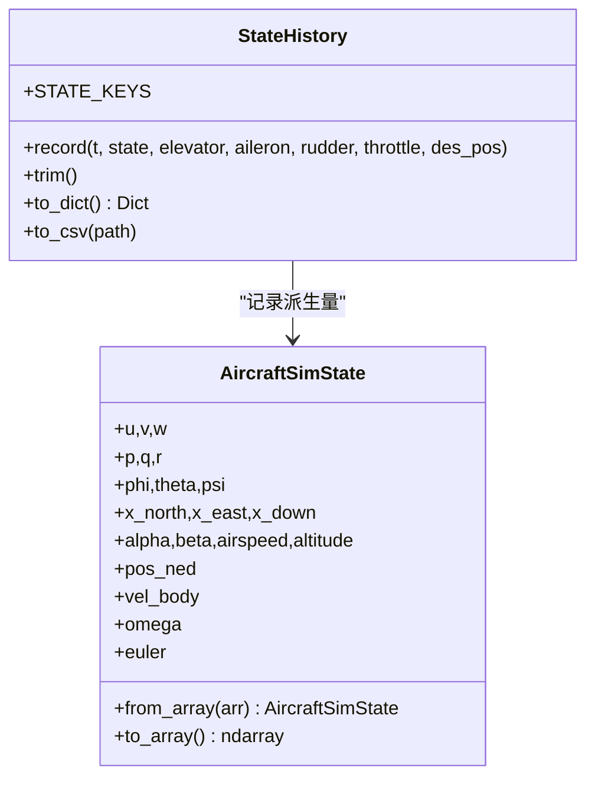

图表来源
- [src/simulation/state_manager.py](file://src/simulation/state_manager.py#L16-L193)

章节来源
- [src/simulation/state_manager.py](file://src/simulation/state_manager.py#L1-L193)

### 配置加载（ConfigLoader）
- 职责
  - 统一加载与合并各子系统配置（飞机、仿真、轨迹、控制）
  - 提供默认值与深度合并策略
- 使用场景
  - 仿真器初始化时加载仿真配置与风参数
  - 控制参数从control_params.yaml注入TECS与导航控制器

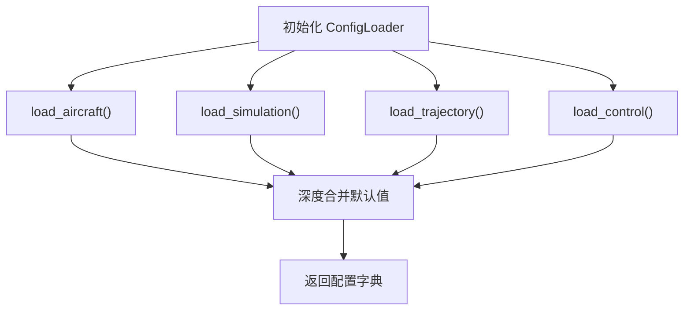

图表来源
- [src/utils/config_loader.py](file://src/utils/config_loader.py#L59-L82)

章节来源
- [src/utils/config_loader.py](file://src/utils/config_loader.py#L1-L82)

### 环境建模（风与大气）
- 风模型
  - Wind类支持无风、固定风、正弦风、随机正弦风
- 大气模型
  - ISA模型：温度、压力、密度、音速随高度分层计算

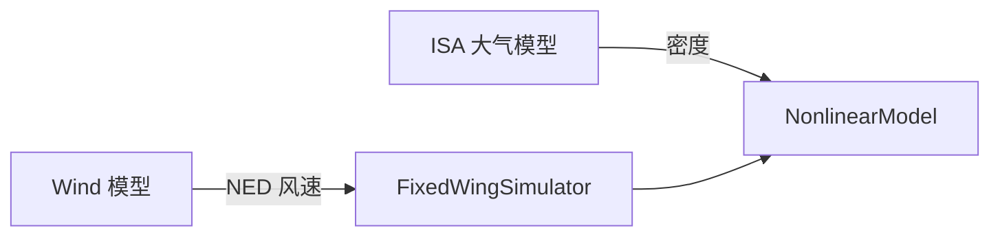

图表来源
- [src/simulation/simulator.py](file://src/simulation/simulator.py#L159-L163)
- [src/environment/atmosphere_model.py](file://src/environment/atmosphere_model.py#L24-L77)

章节来源
- [src/environment/atmosphere_model.py](file://src/environment/atmosphere_model.py#L1-L77)

## 依赖关系分析
- 模块内聚与耦合
  - FixedWingSimulator对各子系统有高阶依赖，但通过清晰接口（AircraftState、ControlTarget、TrajectoryState）降低耦合
  - 控制链路内部自包含，仅依赖状态与目标
- 外部依赖
  - 数值积分：scipy.integrate.solve_ivp（批处理）与Dopri5（实时步进）
  - 可视化：matplotlib/plotly（结果可视化）
  - 配置：pyyaml
- 循环依赖
  - 未发现循环导入；模块间单向依赖明确

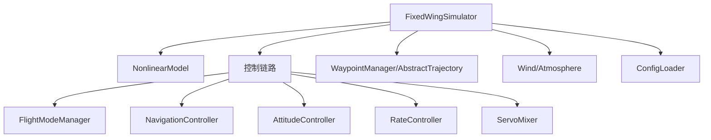

图表来源
- [src/simulation/simulator.py](file://src/simulation/simulator.py#L33-L51)
- [src/control/flight_mode_manager.py](file://src/control/flight_mode_manager.py#L40-L114)
- [src/control/navigation_controller.py](file://src/control/navigation_controller.py#L25-L55)

章节来源
- [src/simulation/simulator.py](file://src/simulation/simulator.py#L33-L51)

## 性能考量
- 时间步长与积分精度
  - 实时步进使用Dopri5（可调rtol/atol），批处理使用solve_ivp，两者均支持自适应步长
- 内存与记录效率
  - StateHistory预分配数组，减少动态扩容开销；trim裁剪尾部未使用空间
- 计算复杂度
  - 非线性方程每步O(1)，主要瓶颈在气动函数与矩阵运算；可通过缓存与向量化优化
- 风与密度计算
  - 密度按高度查表/公式计算，成本低；风模型按时间查询，可扩展为更复杂风场

## 故障排查指南
- 常见问题
  - 集成错误：检查风/密度传参与状态维度一致性
  - 模式切换抖动：确认FlightModeManager的目标生成与过渡逻辑
  - 轨迹越界：检查WaypointManager的路径段与目标高度限制
- 定位方法
  - 启用日志（若启用）与逐步打印中间变量
  - 使用run_linear_analysis进行线性响应验证
  - 导出StateHistory为CSV进行离线分析

章节来源
- [src/simulation/simulator.py](file://src/simulation/simulator.py#L558-L562)
- [src/utils/config_loader.py](file://src/utils/config_loader.py#L75-L77)

## 结论
本项目以FixedWingSimulator为核心，采用模块化与分层架构，实现了从参数配置到仿真结果输出的完整闭环。通过ArduPilot兼容的控制链路与标准化的轨迹接口，系统既具备工程实用性，又保持良好的可扩展性。建议后续在以下方面持续优化：轨迹与控制的解耦、风场建模的增强、并行化与向量化加速、以及更丰富的可视化与数据分析工具。

## 附录
- 入口程序参数示例与用途
  - --aircraft/--mode/--duration/--dt/--wind/--traj/--analysis/--no-plot/--list-aircraft/--config-dir
- 配置文件说明
  - aircraft.yaml：飞机参数与覆盖
  - control_params.yaml：控制参数（含TECS与导航）
  - simulation.yaml：仿真参数（步长、时长、初始条件、风）
  - trajectory.yaml：轨迹类型与航路点

章节来源
- [main.py](file://main.py#L32-L95)
- [src/utils/config_loader.py](file://src/utils/config_loader.py#L68-L81)