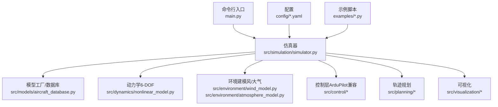
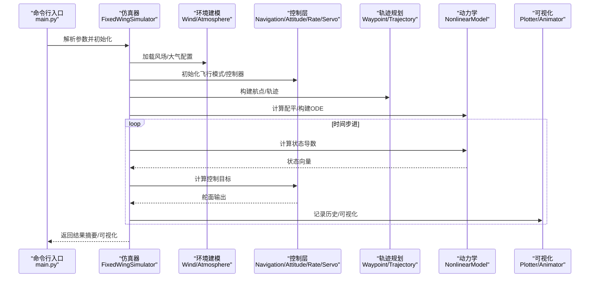
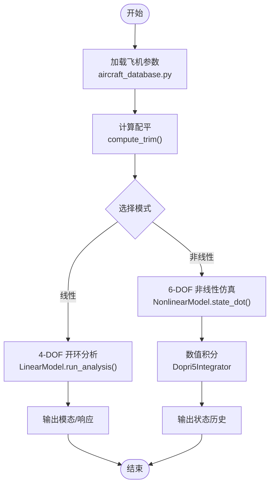
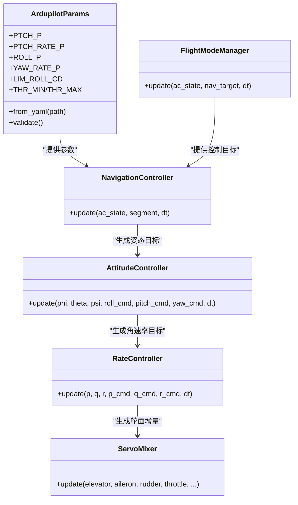
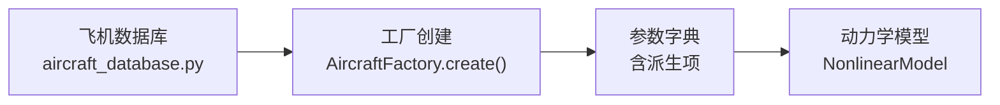
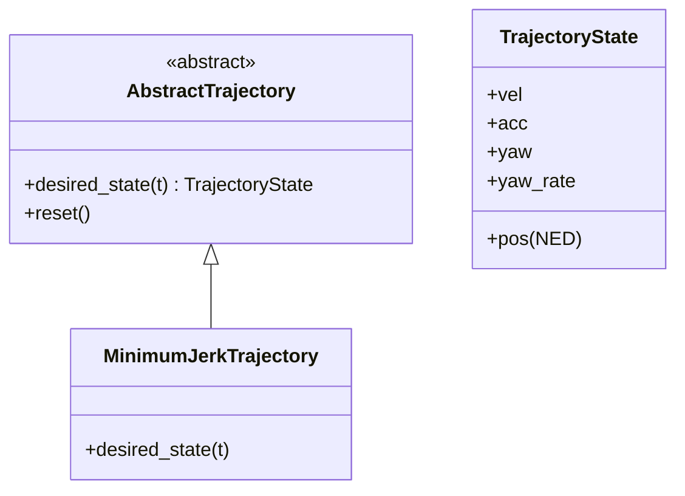
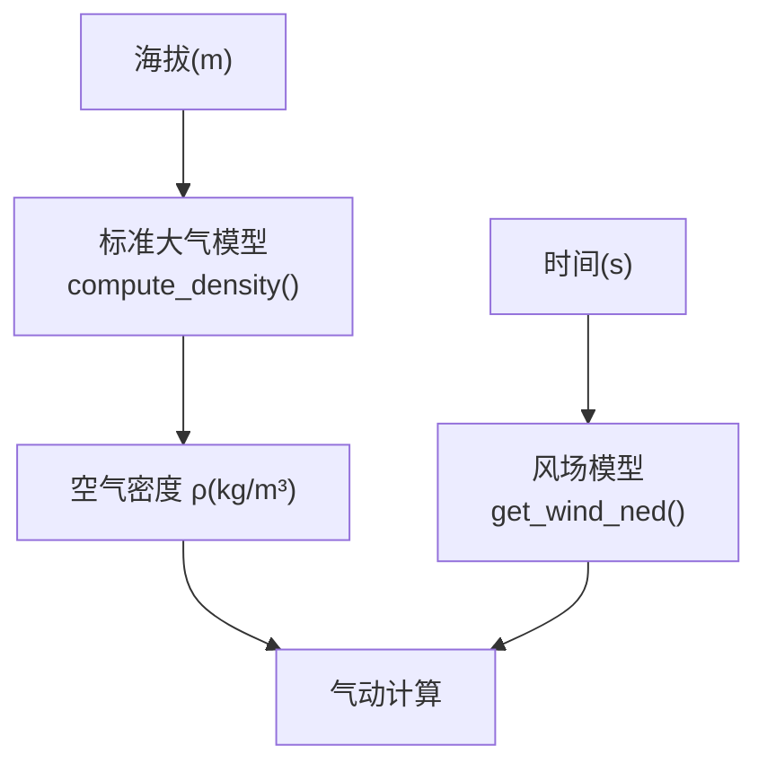
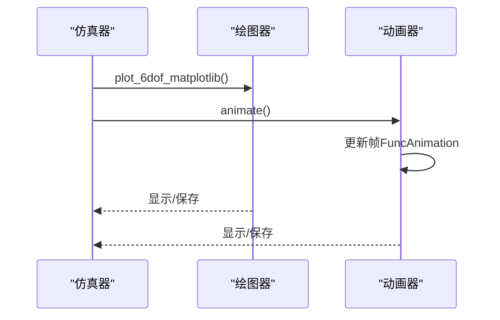
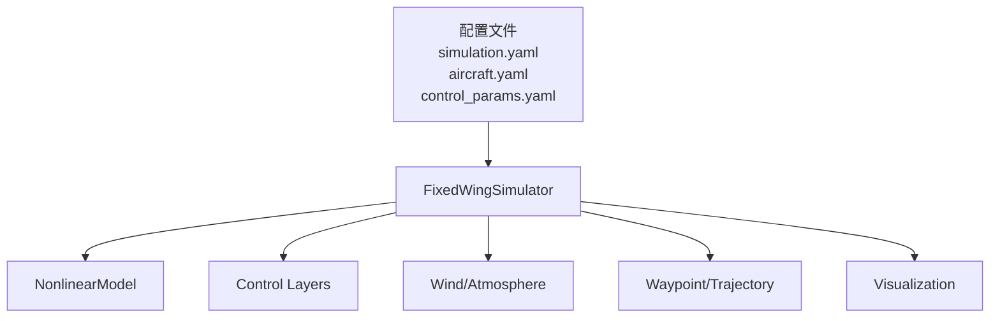

# 核心功能特性

<cite>
**本文引用的文件**
- [main.py](file://main.py)
- [simulator.py](file://src/simulation/simulator.py)
- [aircraft_database.py](file://src/models/aircraft_database.py)
- [simulation.yaml](file://config/simulation.yaml)
- [aircraft.yaml](file://config/aircraft.yaml)
- [control_params.yaml](file://config/control_params.yaml)
- [ardupilot_compat.py](file://src/control/ardupilot_compat.py)
- [nonlinear_model.py](file://src/dynamics/nonlinear_model.py)
- [wind_model.py](file://src/environment/wind_model.py)
- [atmosphere_model.py](file://src/environment/atmosphere_model.py)
- [trajectory_base.py](file://src/planning/trajectory_base.py)
- [minimum_jerk.py](file://src/planning/minimum_jerk.py)
- [animator.py](file://src/visualization/animator.py)
- [example_1_linear_response.py](file://examples/example_1_linear_response.py)
</cite>

## 目录
1. [简介](#简介)
2. [项目结构](#项目结构)
3. [核心组件](#核心组件)
4. [架构总览](#架构总览)
5. [详细组件分析](#详细组件分析)
6. [依赖关系分析](#依赖关系分析)
7. [性能考量](#性能考量)
8. [故障排查指南](#故障排查指南)
9. [结论](#结论)
10. [附录](#附录)

## 简介
本文件系统化梳理 FixedWingSimulator 的核心功能特性与实现机制，面向工程实践与教学应用，覆盖以下关键能力：
- 线性/非线性动力学仿真：提供 4-DOF 线性开环分析与 6-DOF 非线性闭合回路仿真
- ArduPilot 兼容控制：基于五层控制链（导航→姿态→角速率→舵面混合）与 TECS 能量控制系统
- 多飞机支持：内置多型无人机构型数据库，参数可覆盖与扩展
- 高级轨迹规划：最小急曲率/最小急动度多项式轨迹，支持航点序列与航迹跟踪
- 环境建模：标准大气模型与风场模型（静稳、正弦、随机正弦）
- 实时可视化：2D/3D 可视化与动画输出，便于结果解读与演示

## 项目结构
项目采用模块化分层组织，入口脚本负责参数解析与运行调度；核心引擎在仿真器中编排各子系统；配置文件集中管理仿真、飞机与控制参数；示例脚本展示典型用法。

图表来源
- [main.py](file://main.py#L98-L145)
- [simulator.py](file://src/simulation/simulator.py#L115-L230)
- [aircraft_database.py](file://src/models/aircraft_database.py#L29-L133)
- [wind_model.py](file://src/environment/wind_model.py#L18-L113)
- [atmosphere_model.py](file://src/environment/atmosphere_model.py#L24-L77)
- [ardupilot_compat.py](file://src/control/ardupilot_compat.py#L17-L130)
- [trajectory_base.py](file://src/planning/trajectory_base.py#L16-L47)
- [animator.py](file://src/visualization/animator.py#L14-L150)

章节来源
- [main.py](file://main.py#L1-L145)
- [simulator.py](file://src/simulation/simulator.py#L1-L110)

## 核心组件
- 仿真器（FixedWingSimulator）：统一编排模型、控制、环境、规划与可视化，支持闭环/开环两种运行模式
- 飞机数据库与工厂：内置多型无人机构型参数，支持参数覆盖与派生字段注入
- 动力学模块：6-DOF 非线性方程与 4-DOF 线性分析
- 环境建模：标准大气与多种风场模型
- 控制系统：ArduPilot 兼容参数容器与五层控制链（导航→姿态→角速率→舵面混合）
- 轨迹规划：抽象轨迹接口与多项式轨迹实现
- 可视化：2D 图表与 3D 动画
- 配置系统：仿真、飞机与控制参数的集中化管理

章节来源
- [simulator.py](file://src/simulation/simulator.py#L115-L230)
- [aircraft_database.py](file://src/models/aircraft_database.py#L139-L183)
- [ardupilot_compat.py](file://src/control/ardupilot_compat.py#L17-L130)
- [trajectory_base.py](file://src/planning/trajectory_base.py#L16-L47)
- [wind_model.py](file://src/environment/wind_model.py#L18-L113)
- [atmosphere_model.py](file://src/environment/atmosphere_model.py#L24-L77)
- [animator.py](file://src/visualization/animator.py#L14-L150)

## 架构总览
下图展示从命令行到仿真执行的关键流程与模块交互：

图表来源
- [main.py](file://main.py#L98-L145)
- [simulator.py](file://src/simulation/simulator.py#L239-L567)
- [wind_model.py](file://src/environment/wind_model.py#L76-L108)
- [atmosphere_model.py](file://src/environment/atmosphere_model.py#L48-L53)
- [ardupilot_compat.py](file://src/control/ardupilot_compat.py#L17-L130)
- [trajectory_base.py](file://src/planning/trajectory_base.py#L26-L47)

## 详细组件分析

### 线性/非线性动力学仿真
- 功能描述
  - 4-DOF 线性开环分析：用于模态分析（短周期、长周期），评估系统稳定性与设计控制器
  - 6-DOF 非线性闭合回路仿真：包含气动、惯性、控制与环境耦合，支持真实飞行场景验证
- 技术实现
  - 4-DOF 分析由独立线性模型完成，输入为脉冲激励，输出为状态响应与模态信息
  - 6-DOF 使用非线性模型，状态向量包含速度、角速度、欧拉角与位置；通过数值积分求解微分方程
  - 配平计算用于确定初始平衡点与控制偏置，确保闭环仿真稳定
- 应用场景
  - 控制器设计与参数整定（线性分析）
  - 飞行品质评估与风扰响应验证（非线性仿真）
- 技术亮点
  - 将线性分析与非线性仿真无缝衔接，便于从频域到时域的综合验证
  - 自动配平与密度修正，提升仿真一致性与物理合理性

图表来源
- [aircraft_database.py](file://src/models/aircraft_database.py#L139-L183)
- [nonlinear_model.py](file://src/dynamics/nonlinear_model.py#L132-L154)
- [simulator.py](file://src/simulation/simulator.py#L571-L597)

章节来源
- [nonlinear_model.py](file://src/dynamics/nonlinear_model.py#L104-L200)
- [simulator.py](file://src/simulation/simulator.py#L571-L597)
- [example_1_linear_response.py](file://examples/example_1_linear_response.py#L88-L124)

### ArduPilot 兼容控制
- 功能描述
  - 提供与 ArduPilot 平台一致的控制参数命名与默认值，支持导航、姿态、角速率与舵面混合
  - 内置 TECS 总能量控制系统，协调空速与高度控制
- 技术实现
  - 参数容器 ArdupilotParams 支持 YAML 导入/导出与范围校验
  - 五层控制链：导航控制器生成姿态/油门目标，姿态控制器生成角速率目标，角速率控制器生成舵面增量，舵面混合器转换为物理控制量
  - 飞行模式管理器根据模式切换控制目标类型（直接/间接）
- 应用场景
  - 不同飞行模式（AUTO、FBW_A/B、STABILIZE、MANUAL）下的控制策略验证
  - TECS 在不同风阻与航路上的稳定性与跟踪精度评估
- 技术亮点
  - 参数命名与 ArduPilot 完全兼容，便于移植与对比
  - TECS 参数可配置，适配不同机型与任务需求

图表来源
- [ardupilot_compat.py](file://src/control/ardupilot_compat.py#L17-L130)
- [simulator.py](file://src/simulation/simulator.py#L190-L217)

章节来源
- [ardupilot_compat.py](file://src/control/ardupilot_compat.py#L17-L130)
- [simulator.py](file://src/simulation/simulator.py#L173-L230)

### 多飞机支持
- 功能描述
  - 内置多型无人机构型数据库，覆盖几何、气动与惯性参数
  - 支持参数覆盖与派生字段自动注入（如参考速度、密度、动压）
- 技术实现
  - 数据库条目包含纵向/横向气动导数与惯性矩
  - 工厂函数返回完整参数字典，并注入动态所需派生量
- 应用场景
  - 快速切换不同机型进行对比仿真
  - 通过覆盖配置调整特定参数以适配新构型
- 技术亮点
  - 与 ArduPilot 参数体系兼容，便于跨平台迁移
  - 参数覆盖机制简化了定制化配置

图表来源
- [aircraft_database.py](file://src/models/aircraft_database.py#L29-L166)
- [simulator.py](file://src/simulation/simulator.py#L155-L158)

章节来源
- [aircraft_database.py](file://src/models/aircraft_database.py#L139-L183)
- [aircraft.yaml](file://config/aircraft.yaml#L1-L13)

### 高级轨迹规划
- 功能描述
  - 抽象轨迹接口定义期望状态（位置/速度/加速度/偏航）
  - 提供最小急曲率/最小急动度多项式轨迹，支持航点序列与航迹跟踪
- 技术实现
  - WaypointManager 负责航点管理与轨迹构建
  - TrajectoryState 描述期望状态，AbstractTrajectory 定义统一接口
  - 最小急曲率轨迹复用最小急动度系数求解器，按段构造 5 次多项式
- 应用场景
  - 航路规划与轨迹跟踪（AUTO 模式）
  - 圆圈/航线等典型任务的轨迹生成与验证
- 技术亮点
  - 接口统一，易于扩展新的轨迹类型
  - 航点与轨迹分离，避免默认航路污染用户任务

图表来源
- [trajectory_base.py](file://src/planning/trajectory_base.py#L16-L47)
- [minimum_jerk.py](file://src/planning/minimum_jerk.py#L17-L71)

章节来源
- [trajectory_base.py](file://src/planning/trajectory_base.py#L16-L47)
- [minimum_jerk.py](file://src/planning/minimum_jerk.py#L17-L71)

### 环境建模
- 功能描述
  - 标准大气模型（ISA）：覆盖对流层与下平流层，计算温度、压力、密度与音速
  - 风场模型：支持静稳、正弦与随机正弦风场，满足风阻与湍流仿真需求
- 技术实现
  - 大气模型提供密度计算，用于气动力与升阻计算
  - 风模型按类型生成 NED 坐标系下的风矢量
- 应用场景
  - 风阻影响评估、起飞/着陆场景模拟
  - 湍流与阵风下的飞控鲁棒性测试
- 技术亮点
  - 风场频率与幅值可配置，贴近真实大气扰动特征

图表来源
- [atmosphere_model.py](file://src/environment/atmosphere_model.py#L48-L77)
- [wind_model.py](file://src/environment/wind_model.py#L76-L108)

章节来源
- [atmosphere_model.py](file://src/environment/atmosphere_model.py#L24-L77)
- [wind_model.py](file://src/environment/wind_model.py#L18-L113)

### 实时可视化
- 功能描述
  - 2D 图表：绘制 6-DOF 关键状态随时间变化
  - 3D 动画：实时显示轨迹、期望航路与飞机姿态
- 技术实现
  - Plotter 负责 2D 绘图，Animator 基于 Matplotlib FuncAnimation 实时更新
  - 支持保存 GIF 与关闭图形界面以适配批处理
- 应用场景
  - 结果展示、报告生成与教学演示
  - 批量运行时禁用图形界面，仅保存数据与图像
- 技术亮点
  - 3D 动画直观呈现飞行路径与姿态演化
  - 与仿真器解耦，便于替换或扩展可视化方案

图表来源
- [simulator.py](file://src/simulation/simulator.py#L92-L109)
- [animator.py](file://src/visualization/animator.py#L25-L150)

章节来源
- [simulator.py](file://src/simulation/simulator.py#L92-L109)
- [animator.py](file://src/visualization/animator.py#L14-L150)

## 依赖关系分析
- 模块内聚与耦合
  - 仿真器作为编排中心，与各子系统存在清晰边界；控制层与轨迹层通过状态/目标接口耦合
  - 风场与大气模型通过函数接口注入到动力学模块，保持低耦合
- 外部依赖
  - 数值积分器（Dopri5）、Matplotlib、Numpy 等
- 配置驱动
  - 仿真参数、飞机参数与控制参数均来自 YAML，便于用户定制与版本管理

图表来源
- [simulator.py](file://src/simulation/simulator.py#L148-L230)
- [simulation.yaml](file://config/simulation.yaml#L1-L30)
- [aircraft.yaml](file://config/aircraft.yaml#L1-L13)
- [control_params.yaml](file://config/control_params.yaml#L1-L45)

章节来源
- [simulator.py](file://src/simulation/simulator.py#L148-L230)
- [simulation.yaml](file://config/simulation.yaml#L1-L30)
- [aircraft.yaml](file://config/aircraft.yaml#L1-L13)
- [control_params.yaml](file://config/control_params.yaml#L1-L45)

## 性能考量
- 数值积分
  - 使用自适应步长的 Dormand-Prince 方法（dopri5），在实时性与精度间取得平衡
- 计算复杂度
  - 6-DOF 非线性仿真每步涉及气动函数与矩阵运算，建议合理设置 dt 与 duration
- 可视化开销
  - 3D 动画在高帧率下可能占用较多 CPU/GPU 资源，批处理建议关闭图形界面
- 风场与大气
  - 随机正弦风场引入额外随机数生成成本，可根据需求选择固定风场

## 故障排查指南
- 集成错误
  - 若出现积分失败，检查 dt 是否过大、初始条件是否合理、风场/密度是否异常
- 参数越界
  - ArduPilot 参数校验会提示越界警告，建议按范围调整后再运行
- 风场类型错误
  - 风场类型需在允许集合内，否则抛出异常；确认配置文件与命令行参数一致
- 可视化缺失
  - 若缺少绘图依赖，将提示无法可视化；安装 Matplotlib 后重试

章节来源
- [simulator.py](file://src/simulation/simulator.py#L558-L562)
- [ardupilot_compat.py](file://src/control/ardupilot_compat.py#L104-L130)
- [wind_model.py](file://src/environment/wind_model.py#L39-L42)
- [simulator.py](file://src/simulation/simulator.py#L99-L101)

## 结论
FixedWingSimulator 通过模块化设计实现了从线性/非线性动力学到 ArduPilot 兼容控制、高级轨迹规划与环境建模的完整闭环仿真平台。其核心优势在于：
- 与 ArduPilot 参数体系完全兼容，便于工程迁移与对比
- 线性与非线性仿真互补，支撑从控制器设计到系统验证的全流程
- 可配置的多飞机数据库与环境模型，满足多样化任务需求
- 丰富的可视化工具，加速结果解读与演示

## 附录
- 命令行示例与参数说明可参考入口脚本中的帮助文本与使用示例
- 示例脚本展示了线性分析与闭环仿真的典型工作流，可作为二次开发的起点

章节来源
- [main.py](file://main.py#L1-L19)
- [example_1_linear_response.py](file://examples/example_1_linear_response.py#L1-L206)