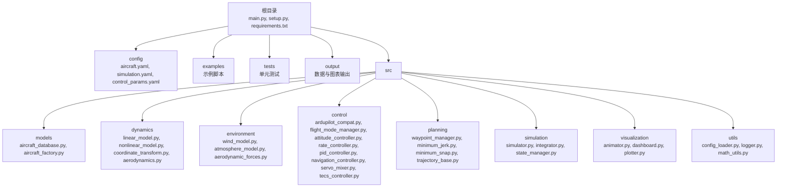
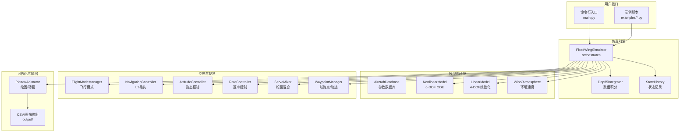
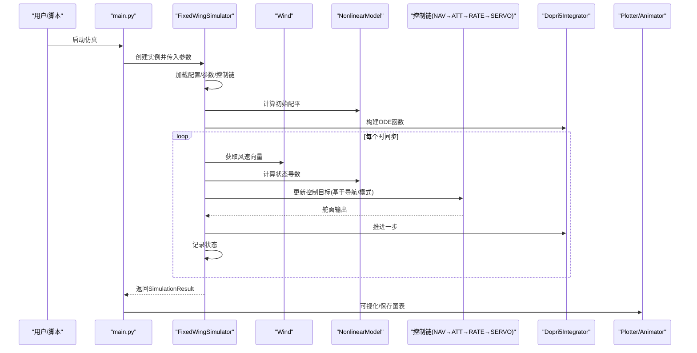
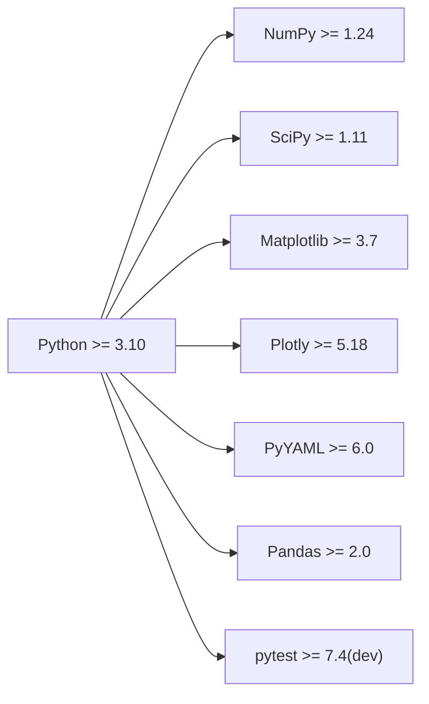

# 项目介绍与背景

<cite>
**本文引用的文件**
- [setup.py](file://setup.py)
- [requirements.txt](file://requirements.txt)
- [README.md](file://README.md)
- [main.py](file://main.py)
- [config/aircraft.yaml](file://config/aircraft.yaml)
- [config/simulation.yaml](file://config/simulation.yaml)
- [config/control_params.yaml](file://config/control_params.yaml)
- [src/models/aircraft_database.py](file://src/models/aircraft_database.py)
- [src/simulation/simulator.py](file://src/simulation/simulator.py)
- [src/dynamics/nonlinear_model.py](file://src/dynamics/nonlinear_model.py)
- [src/control/ardupilot_compat.py](file://src/control/ardupilot_compat.py)
- [src/planning/waypoint_manager.py](file://src/planning/waypoint_manager.py)
- [examples/example_1_linear_response.py](file://examples/example_1_linear_response.py)
- [examples/example_2_nonlinear_dynamics.py](file://examples/example_2_nonlinear_dynamics.py)
- [tests/test_dynamics.py](file://tests/test_dynamics.py)
</cite>

## 目录
1. [引言](#引言)
2. [项目结构](#项目结构)
3. [核心组件](#核心组件)
4. [架构总览](#架构总览)
5. [详细组件分析](#详细组件分析)
6. [依赖关系分析](#依赖关系分析)
7. [性能考虑](#性能考虑)
8. [故障排查指南](#故障排查指南)
9. [结论](#结论)
10. [附录](#附录)

## 引言
FixedWingSimulator 是一个面向固定翼无人机的高保真仿真与控制平台，旨在为航空航天教育、科研与工业应用提供统一、可扩展且可验证的仿真工具链。项目通过模块化架构整合了气动模型、非线性六自由度动力学、环境风场建模、轨迹规划与多种飞行模式的控制层，并提供命令行与脚本化的使用方式，便于快速开展线性/非线性分析、轨迹跟踪、编队与任务规划等研究工作。

项目的发展背景与设计目标：
- 背景：随着固定翼无人机在侦察、巡检、通信中继等场景的应用增长，对高精度仿真与控制验证的需求日益迫切。传统仿真工具或过于简化，或闭源受限，难以满足教学与研究的多样化需求。
- 目标：构建一套“从参数到控制再到可视化”的完整流水线，支持多机型数据库、ArduPilot兼容控制参数、多种轨迹规划策略与实时/批处理两种运行模式；同时保持清晰的模块边界与可扩展性，便于二次开发与集成。

核心价值与应用场景：
- 教育：用于飞行器动力学、自动控制理论、导航与制导课程的实验与演示。
- 科研：开展纵向/横向模态分析、轨迹优化、鲁棒控制与感知-决策-控制一体化研究。
- 工业：在系统集成前进行闭环验证、参数整定与故障注入测试，缩短研发周期。

项目命名与理念：
- “FixedWingSimulator”直译为“固定翼仿真器”，强调“固定翼”这一核心对象与“仿真器”这一工具属性。命名体现项目聚焦于固定翼无人机的全栈仿真能力，既可用于线性分析，也可进行非线性闭环仿真，兼顾教学与工程实践。

版本与状态：
- 当前版本：1.0.0（由安装元数据与包名可见）。
- 状态：稳定可用，具备完整的线性/非线性仿真、轨迹规划与可视化输出能力；配套示例与单元测试覆盖主要模块。

## 项目结构
项目采用按功能域划分的层次化组织方式，核心目录与职责如下：
- config：仿真配置、机型参数与控制参数的集中管理。
- src：核心代码库，按领域划分为 models、dynamics、environment、control、planning、simulation、visualization、utils。
- examples：典型用例脚本，展示线性/非线性分析、轨迹跟踪、编队飞行等场景。
- tests：覆盖坐标变换、气动、线性/非线性动力学等关键模块的单元测试。
- output：示例运行产生的数据与图表输出目录。
- 根目录：入口脚本 main.py、安装与依赖声明文件 setup.py、requirements.txt。

**图示来源**
- [main.py](file://main.py#L1-L145)
- [setup.py](file://setup.py#L1-L23)
- [requirements.txt](file://requirements.txt#L1-L8)

**章节来源**
- [main.py](file://main.py#L1-L145)
- [setup.py](file://setup.py#L1-L23)
- [requirements.txt](file://requirements.txt#L1-L8)

## 核心组件
- 仿真引擎 FixedWingSimulator：负责装配各子模块、驱动闭环/开环仿真、记录历史并生成结果摘要与可视化。
- 动力学模型：提供线性四自由度与非线性六自由度两类模型，支持模态分析与数值积分求解。
- 控制层：实现 ArduPilot 兼容的五层控制链（导航→姿态→速率→舵面混合→执行器），并支持多种飞行模式。
- 规划层：WaypointManager 提供航路点管理与轨迹生成接口，支持最小Snap/最小Jerk等策略。
- 环境模块：风场与大气密度模型提供真实环境扰动输入。
- 可视化与输出：Plotter/Animator 提供图形化展示，支持CSV数据导出。

**章节来源**
- [src/simulation/simulator.py](file://src/simulation/simulator.py#L115-L642)
- [src/dynamics/nonlinear_model.py](file://src/dynamics/nonlinear_model.py#L104-L200)
- [src/planning/waypoint_manager.py](file://src/planning/waypoint_manager.py#L20-L200)
- [src/control/ardupilot_compat.py](file://src/control/ardupilot_compat.py#L17-L130)

## 架构总览
下图展示了 FixedWingSimulator 的高层架构与模块交互关系。FixedWingSimulator 作为编排者，连接模型、环境、控制、规划与仿真核心，并通过可视化模块呈现结果。

**图示来源**
- [src/simulation/simulator.py](file://src/simulation/simulator.py#L115-L642)
- [src/dynamics/nonlinear_model.py](file://src/dynamics/nonlinear_model.py#L104-L200)
- [src/planning/waypoint_manager.py](file://src/planning/waypoint_manager.py#L20-L200)
- [src/control/ardupilot_compat.py](file://src/control/ardupilot_compat.py#L17-L130)
- [main.py](file://main.py#L98-L145)

## 详细组件分析

### 固定翼仿真器（FixedWingSimulator）
- 职责：装配参数、环境、控制、规划与动力学模块，驱动仿真循环，记录状态并生成结果容器。
- 关键流程：
  - 初始化：加载配置、创建机型参数、实例化控制参数与控制链、初始化轨迹管理器、建立非线性动力学模型。
  - 运行：计算初始配平、构建ODE函数、根据是否启用轨迹规划选择路径段，按飞行模式更新控制目标，经控制器与舵面混合得到控制输入，推进积分器一步，记录状态。
  - 结果：封装历史数据、配平结果与仿真摘要，提供可视化接口。
- 特性：支持闭环与开环两种模式；支持单航路点“悬停保持”与多航路点轨迹跟踪；自动校正TECS巡航油门以匹配实际配平。

**图示来源**
- [src/simulation/simulator.py](file://src/simulation/simulator.py#L239-L567)
- [src/dynamics/nonlinear_model.py](file://src/dynamics/nonlinear_model.py#L160-L200)
- [src/control/ardupilot_compat.py](file://src/control/ardupilot_compat.py#L17-L130)
- [main.py](file://main.py#L114-L141)

**章节来源**
- [src/simulation/simulator.py](file://src/simulation/simulator.py#L115-L642)

### 飞机参数数据库（aircraft_database）
- 支持机型：TB2、Anka、Aksungur、Karayel、Predator、Heron MK1、Heron MK2，共7种。
- 数据结构：每架飞机包含几何/惯性、气动系数、马赫数等参数，并注入派生参数（如静压、密度等）供动力学模块使用。
- 用途：为仿真提供标准化的气动与质量特性输入，确保不同机型间的一致性与可比性。

**章节来源**
- [src/models/aircraft_database.py](file://src/models/aircraft_database.py#L29-L183)
- [config/aircraft.yaml](file://config/aircraft.yaml#L1-L13)

### 非线性动力学模型（6-DOF）
- 状态向量：机体速度(u,v,w)、角速度(p,q,r)、欧拉角(φ,θ,ψ)与位置(xN,xE,xD)。
- 功能：计算配平、评估12维状态导数、进行短时积分仿真。
- 数值方法：使用Dopri5（RK45）积分器，支持自定义容差与步长。

**章节来源**
- [src/dynamics/nonlinear_model.py](file://src/dynamics/nonlinear_model.py#L104-L200)

### 控制层（ArduPilot兼容）
- 参数容器：ArdupilotParams 提供与ArduPilot一致的参数命名与默认值，支持从YAML加载/保存与范围校验。
- 控制链：导航控制器（L1）、姿态控制器、速率控制器与舵面混合器构成五层闭环控制，配合飞行模式管理器实现多种飞行模式。

**章节来源**
- [src/control/ardupilot_compat.py](file://src/control/ardupilot_compat.py#L17-L130)
- [src/simulation/simulator.py](file://src/simulation/simulator.py#L173-L217)

### 规划与轨迹（WaypointManager）
- 航路点管理：支持添加、清空、从YAML加载/保存航路点。
- 轨迹生成：支持MinimumSnap与MinimumJerk两类轨迹，提供当前活动航段查询与剩余时间估计。
- 使用建议：示例脚本展示了如何在仿真前加载航路点或直接使用内置轨迹配置。

**章节来源**
- [src/planning/waypoint_manager.py](file://src/planning/waypoint_manager.py#L20-L200)
- [config/trajectory.yaml](file://config/trajectory.yaml#L1-L200)

### 示例与用法
- 线性响应示例：对比开环线性脉冲响应与闭环PID响应，输出CSV与图表。
- 非线性动态示例：展示配平计算、开环非线性脉冲与闭环姿态保持效果。

**章节来源**
- [examples/example_1_linear_response.py](file://examples/example_1_linear_response.py#L1-L206)
- [examples/example_2_nonlinear_dynamics.py](file://examples/example_2_nonlinear_dynamics.py#L1-L215)

## 依赖关系分析
- 安装依赖：NumPy、SciPy、Matplotlib、Plotly、PyYAML、Pandas。
- 开发依赖：pytest（用于单元测试）。
- 运行时依赖：Python ≥ 3.10。

**图示来源**
- [setup.py](file://setup.py#L11-L21)
- [requirements.txt](file://requirements.txt#L1-L8)

**章节来源**
- [setup.py](file://setup.py#L1-L23)
- [requirements.txt](file://requirements.txt#L1-L8)

## 性能考虑
- 时间步长与积分器：默认dt=0.01s，积分器为dopri5（RK45），适合实时闭环仿真；批处理分析可切换为rk45以提升稳定性。
- 空间复杂度：非线性模型状态维度为12，线性模型为4；轨迹生成与可视化会占用额外内存，建议在批量运行时关闭GUI渲染。
- I/O与可视化：示例脚本默认使用无头后端保存图像，避免图形窗口带来的性能损耗。

[本节为通用指导，不直接分析具体文件]

## 故障排查指南
- 配置错误：
  - 风场/仿真配置：检查 config/simulation.yaml 中 dt、duration、wind_type、wind_speed 等参数。
  - 控制参数：确认 config/control_params.yaml 中关键参数范围合理，必要时使用 ArdupilotParams.validate() 进行范围检查。
- 机型参数：
  - 若指定机型不在数据库中，仿真器会抛出异常；请核对 config/aircraft.yaml 或使用 --list-aircraft 查看可用机型。
- 数值积分：
  - 若出现积分错误，检查风场与气动模型输入是否导致异常；适当增大atol/rtol或调整dt。
- 可视化：
  - 若缺少绘图依赖，将无法生成图表；请安装 Matplotlib/Plotly 并确保后端正确配置。

**章节来源**
- [src/simulation/simulator.py](file://src/simulation/simulator.py#L140-L141)
- [src/control/ardupilot_compat.py](file://src/control/ardupilot_compat.py#L104-L130)
- [config/simulation.yaml](file://config/simulation.yaml#L1-L30)

## 结论
FixedWingSimulator 以模块化设计实现了从参数到控制再到可视化的完整仿真链路，具备良好的可读性、可扩展性与工程实用性。其支持多机型、多控制参数与多种轨迹策略，既能满足教学演示，也能支撑科研与工业验证。建议在使用中结合示例脚本与单元测试，逐步扩展到更复杂的任务场景。

[本节为总结性内容，不直接分析具体文件]

## 附录

### 基本统计数据
- 支持的飞机数量：7种（TB2、Anka、Aksungur、Karayel、Predator、Heron MK1、Heron MK2）。
- 仿真类型：线性4-DOF开环分析、非线性6-DOF闭环/开环仿真。
- 主要功能模块：动力学（线性/非线性）、控制（ArduPilot兼容五层控制链）、规划（航路点与轨迹）、环境（风场/大气）、仿真（积分器/状态管理）、可视化（绘图/动画）。

**章节来源**
- [src/models/aircraft_database.py](file://src/models/aircraft_database.py#L136-L136)
- [src/simulation/simulator.py](file://src/simulation/simulator.py#L571-L597)
- [src/planning/waypoint_manager.py](file://src/planning/waypoint_manager.py#L127-L167)

### 命令行与基本用法
- 默认运行：TB2在AUTO模式下进行30秒仿真，使用minimum_snap轨迹。
- 自定义机型/模式/时长/风场/轨迹类型：通过命令行参数指定。
- 批处理与可视化：支持禁用可视化以进行批量运行；支持列出可用机型。

**章节来源**
- [main.py](file://main.py#L1-L145)

### 开源协议与社区贡献
- 包元数据显示项目名称与版本，但未在仓库中发现明确的LICENSE文件。建议在发布前补充标准开源许可证文本，并在README中明确许可条款与贡献指南（如Issue模板、PR规范、代码风格等）。

**章节来源**
- [setup.py](file://setup.py#L1-L23)