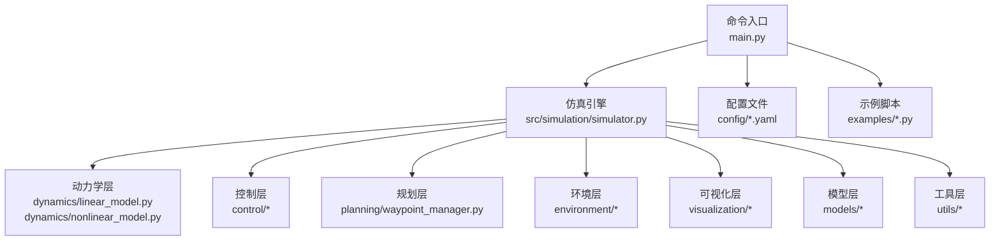
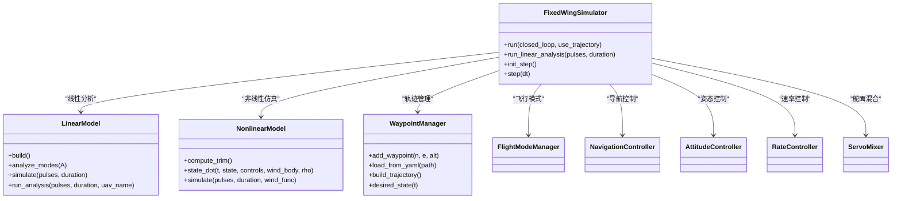
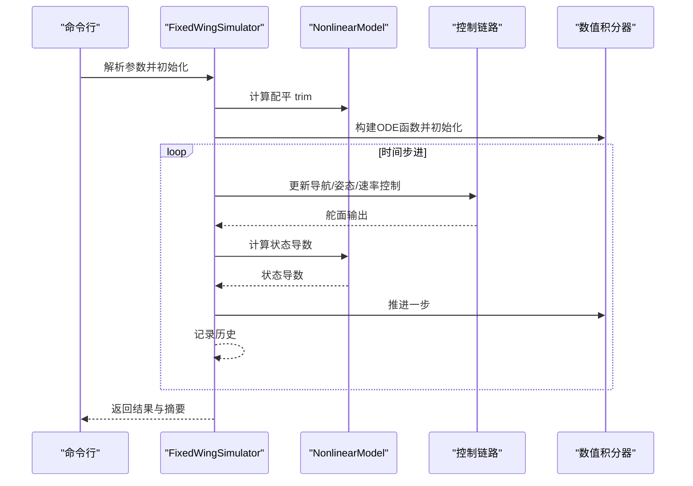
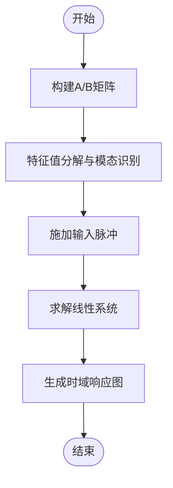
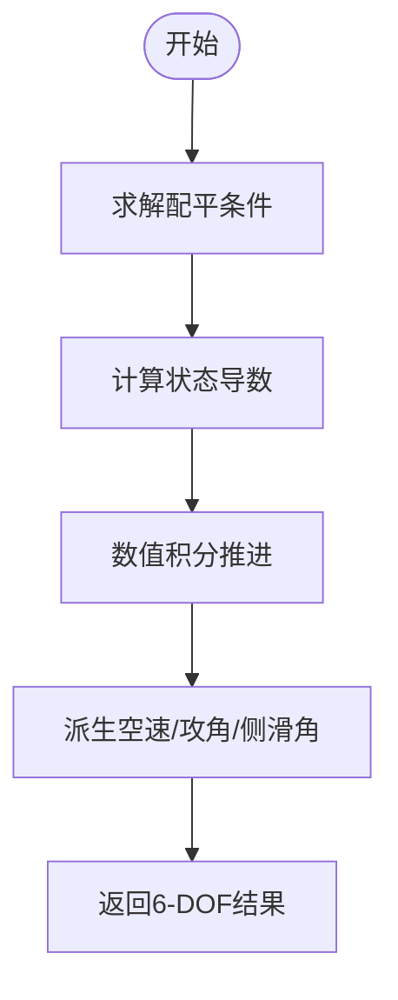
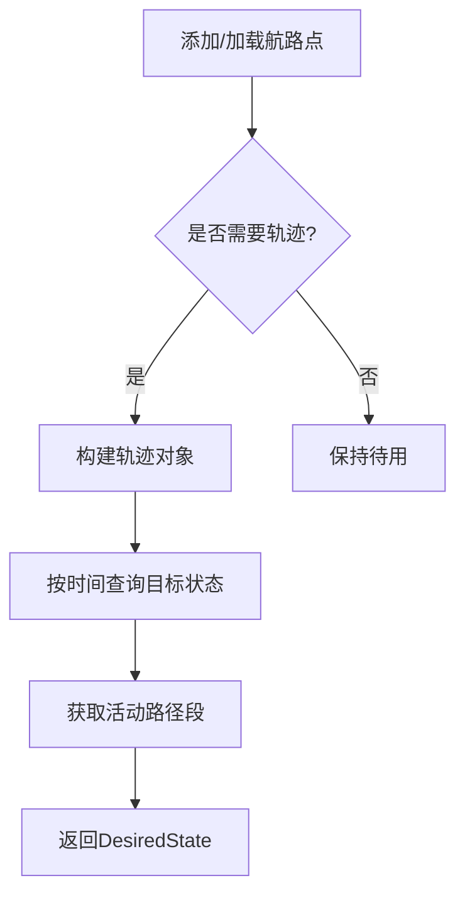
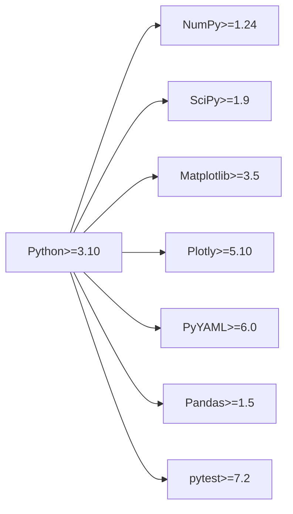

# 项目概述

<cite>
**本文档引用的文件**
- [README.md](file://README.md)
- [main.py](file://main.py)
- [requirements.txt](file://requirements.txt)
- [setup.py](file://setup.py)
- [config/aircraft.yaml](file://config/aircraft.yaml)
- [config/simulation.yaml](file://config/simulation.yaml)
- [config/control_params.yaml](file://config/control_params.yaml)
- [config/trajectory.yaml](file://config/trajectory.yaml)
- [src/simulation/simulator.py](file://src/simulation/simulator.py)
- [src/dynamics/linear_model.py](file://src/dynamics/linear_model.py)
- [src/dynamics/nonlinear_model.py](file://src/dynamics/nonlinear_model.py)
- [src/planning/waypoint_manager.py](file://src/planning/waypoint_manager.py)
- [examples/example_1_linear_response.py](file://examples/example_1_linear_response.py)
- [examples/example_2_nonlinear_dynamics.py](file://examples/example_2_nonlinear_dynamics.py)
</cite>

## 目录
1. [引言](#引言)
2. [项目结构](#项目结构)
3. [核心组件](#核心组件)
4. [架构总览](#架构总览)
5. [详细组件分析](#详细组件分析)
6. [依赖分析](#依赖分析)
7. [性能考虑](#性能考虑)
8. [故障排除指南](#故障排除指南)
9. [结论](#结论)
10. [附录](#附录)

## 引言
FixedWingSimulator 是一个面向固定翼无人机仿真的专业平台，旨在提供从线性/非线性动力学建模到 ArduPilot 兼容控制链路与轨迹规划的完整仿真能力。项目支持多种飞行模式（MANUAL、STABILIZE、FBW_A/B、AUTO、LOITER、RTH），可进行开环/闭环仿真、风场建模、姿态与速率控制、TECS 总能量控制系统以及多轴向轨迹生成与跟踪。通过模块化设计，用户可以灵活选择仿真类型（4-DOF 线性分析、6-DOF 非线性仿真、轨迹跟踪闭环）并结合可视化输出与数据导出，满足教学演示、研究分析与参数调优等场景。

## 项目结构
项目采用按功能域划分的模块化组织方式，核心目录与职责如下：
- config：集中管理飞机参数、仿真配置、控制参数与轨迹配置
- src：核心代码库，按领域划分为 dynamics（动力学）、control（控制）、planning（规划）、simulation（仿真）、visualization（可视化）、environment（环境）、models（模型）、utils（工具）
- examples：示例脚本，覆盖线性响应、非线性动态、轨迹跟踪、编队飞行、风阻影响、不同机型对比与 ArduPilot 参数加载等典型用例
- output：示例运行产生的图表与数据文件，便于结果复现与分析
- tests：单元测试（未在当前上下文展开）

**图示来源**
- [main.py](file://main.py#L98-L145)
- [src/simulation/simulator.py](file://src/simulation/simulator.py#L115-L140)

**章节来源**
- [main.py](file://main.py#L1-L145)
- [config/aircraft.yaml](file://config/aircraft.yaml#L1-L13)
- [config/simulation.yaml](file://config/simulation.yaml#L1-L30)
- [config/control_params.yaml](file://config/control_params.yaml#L1-L45)
- [config/trajectory.yaml](file://config/trajectory.yaml#L1-L23)

## 核心组件
- 固定翼仿真器（FixedWingSimulator）：统一编排模型、环境、控制、规划与仿真器，提供闭环/开环两种运行模式，并支持线性分析与步进式仿真接口
- 动力学模块：提供 4-DOF 线性模型与 6-DOF 非线性模型，分别用于模态分析与高保真仿真
- 控制模块：实现 ArduPilot 兼容的五层控制链路（导航→姿态→速率→舵面混合→执行器输出），并集成 TECS 总能量控制系统
- 规划模块：WaypointManager 提供航路点管理与轨迹工厂，支持最小曲率（Snap/Jerk）轨迹生成与路径段查询
- 环境模块：风模型与大气密度模型，支持静稳、正弦与随机正弦风场
- 可视化模块：绘图与动画器，提供 6-DOF 轨迹可视化与动画展示
- 工具与模型：配置加载、数学工具、飞机数据库与工厂

**章节来源**
- [src/simulation/simulator.py](file://src/simulation/simulator.py#L115-L230)
- [src/dynamics/linear_model.py](file://src/dynamics/linear_model.py#L107-L125)
- [src/dynamics/nonlinear_model.py](file://src/dynamics/nonlinear_model.py#L104-L127)
- [src/planning/waypoint_manager.py](file://src/planning/waypoint_manager.py#L20-L50)

## 架构总览
系统采用“主控制器 + 多模块编排”的架构，主入口负责参数解析与实例化，仿真引擎作为中枢协调各子模块完成状态推进与控制计算，并将历史数据封装为结果对象以便可视化与导出。

**图示来源**
- [src/simulation/simulator.py](file://src/simulation/simulator.py#L115-L230)
- [src/dynamics/linear_model.py](file://src/dynamics/linear_model.py#L107-L125)
- [src/dynamics/nonlinear_model.py](file://src/dynamics/nonlinear_model.py#L104-L127)
- [src/planning/waypoint_manager.py](file://src/planning/waypoint_manager.py#L20-L50)

## 详细组件分析

### 仿真引擎与主流程
- 主入口解析命令行参数，实例化仿真器并根据模式选择运行线性分析或闭环/开环仿真
- 闭环仿真中，仿真器构建 ODE 函数，驱动非线性动力学求解器推进状态；同时通过控制链路计算舵面输出，形成实时反馈
- 结果对象封装状态历史、配平结果与仿真摘要，支持快速可视化与导出

**图示来源**
- [main.py](file://main.py#L98-L145)
- [src/simulation/simulator.py](file://src/simulation/simulator.py#L239-L567)

**章节来源**
- [main.py](file://main.py#L98-L145)
- [src/simulation/simulator.py](file://src/simulation/simulator.py#L239-L567)

### 线性模型与模态分析
- 4-DOF 纵向线性模型以状态空间形式描述扰动动态，支持特征值分解识别短周期、长周期与收敛模式
- 提供脉冲响应仿真与结果可视化，便于理解稳定性与控制目标

**图示来源**
- [src/dynamics/linear_model.py](file://src/dynamics/linear_model.py#L129-L200)
- [src/dynamics/linear_model.py](file://src/dynamics/linear_model.py#L206-L252)
- [src/dynamics/linear_model.py](file://src/dynamics/linear_model.py#L258-L306)

**章节来源**
- [src/dynamics/linear_model.py](file://src/dynamics/linear_model.py#L107-L319)

### 非线性模型与配平计算
- 6-DOF 非线性方程组涵盖平移与旋转运动，结合气动力/力矩模型、简单推力模型与重力项
- 提供配平求解器，计算水平对称飞行条件下的攻角与升降舵配平值，确保初始条件稳定

**图示来源**
- [src/dynamics/nonlinear_model.py](file://src/dynamics/nonlinear_model.py#L132-L154)
- [src/dynamics/nonlinear_model.py](file://src/dynamics/nonlinear_model.py#L160-L255)
- [src/dynamics/nonlinear_model.py](file://src/dynamics/nonlinear_model.py#L287-L385)

**章节来源**
- [src/dynamics/nonlinear_model.py](file://src/dynamics/nonlinear_model.py#L104-L386)

### 航路点与轨迹管理
- WaypointManager 统一管理 NED 坐标系航路点，支持从 YAML 加载与保存
- 根据轨迹类型（最小曲率/加加速度）生成全局轨迹，提供任意时刻的目标状态与活动路径段信息

**图示来源**
- [src/planning/waypoint_manager.py](file://src/planning/waypoint_manager.py#L80-L122)
- [src/planning/waypoint_manager.py](file://src/planning/waypoint_manager.py#L127-L167)
- [src/planning/waypoint_manager.py](file://src/planning/waypoint_manager.py#L178-L207)

**章节来源**
- [src/planning/waypoint_manager.py](file://src/planning/waypoint_manager.py#L20-L208)

### 示例用例与应用价值
- 线性响应示例：对比开环脉冲与闭环 PID 响应，验证控制有效性
- 非线性动态示例：展示开环与闭环滚转响应差异，体现控制器稳定性
- 示例脚本还覆盖编队飞行、风阻影响、多机型对比与 ArduPilot 参数加载等场景

**章节来源**
- [examples/example_1_linear_response.py](file://examples/example_1_linear_response.py#L1-L206)
- [examples/example_2_nonlinear_dynamics.py](file://examples/example_2_nonlinear_dynamics.py#L1-L215)

## 依赖分析
- Python 版本要求：≥3.10
- 关键依赖：NumPy、SciPy、Matplotlib、Plotly、PyYAML、Pandas、pytest
- 安装配置：setup.py 中声明核心依赖与开发依赖，requirements.txt 提供运行时依赖范围

**图示来源**
- [requirements.txt](file://requirements.txt#L1-L8)
- [setup.py](file://setup.py#L11-L21)

**章节来源**
- [requirements.txt](file://requirements.txt#L1-L8)
- [setup.py](file://setup.py#L1-L23)

## 性能考虑
- 数值积分：仿真器使用高阶自适应积分器（dopri5/rk45），在保证精度的同时提升实时性
- 空间复杂度：状态向量维度取决于所选模型（4-DOF 或 12-DOF），线性模型为常数矩阵运算，非线性模型涉及气动与惯性耦合
- 可视化与数据导出：示例脚本默认使用无 GUI 渲染后保存，避免交互开销
- 风场与密度：按高度动态计算空气密度，风场按时间函数生成，二者均在 ODE 求解前转换至机体坐标

[本节为通用性能建议，不直接分析具体文件]

## 故障排除指南
- 集成错误：若在推进过程中出现数值积分异常，仿真器会捕获并打印时间戳与错误信息，便于定位问题阶段
- 参数校验：控制参数加载后进行有效性检查，若配置缺失或越界，需检查 YAML 文件格式与取值范围
- 风场与轨迹：风类型与轨迹类型需与仿真模式匹配；轨迹构建至少需要两个航路点，否则抛出异常

**章节来源**
- [src/simulation/simulator.py](file://src/simulation/simulator.py#L558-L562)
- [src/planning/waypoint_manager.py](file://src/planning/waypoint_manager.py#L139-L140)

## 结论
FixedWingSimulator 通过模块化设计实现了从线性/非线性动力学到 ArduPilot 兼容控制与轨迹规划的全栈仿真能力。其清晰的层次结构、完善的配置体系与丰富的示例脚本，使其适用于教学演示、科研分析与工程参数调优等多种场景。项目在保证理论严谨性的同时兼顾工程实用性，具有良好的扩展性与可维护性。

## 附录
- 应用场景举例
  - 教学演示：线性模态分析与闭环响应对比
  - 研究分析：不同机型、风场与轨迹策略的影响评估
  - 参数调优：基于 TECS 与 PID 的控制参数优化
- 差异化特色
  - ArduPilot 兼容控制链路与 TECS 实现，贴近真实飞控生态
  - 支持多种轨迹类型与航路点管理，便于任务规划与验证
  - 开放式配置与示例脚本，便于二次开发与定制

[本节为概念性总结，不直接分析具体文件]