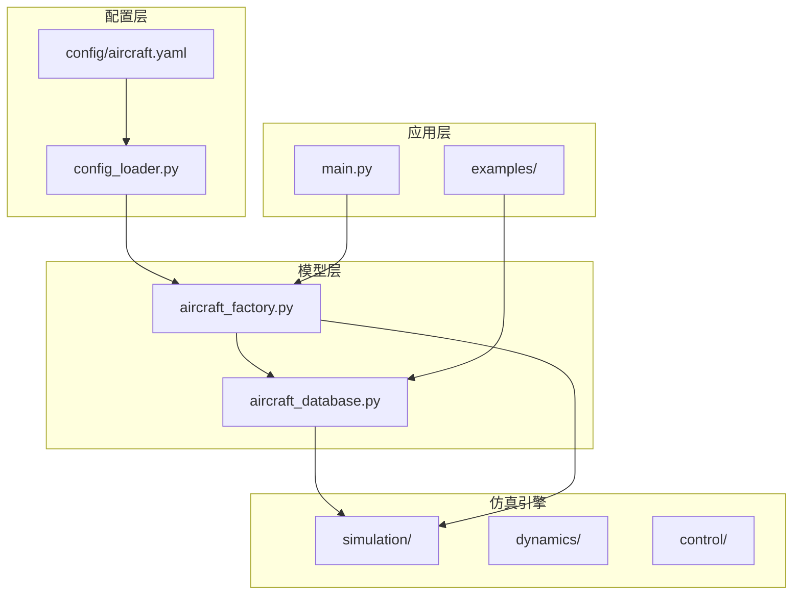
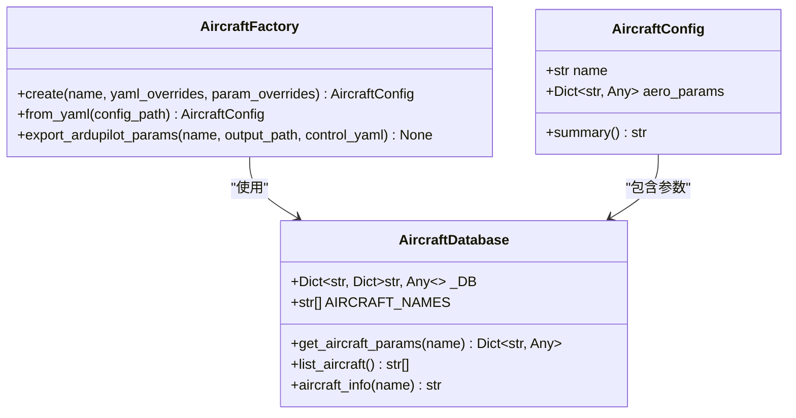
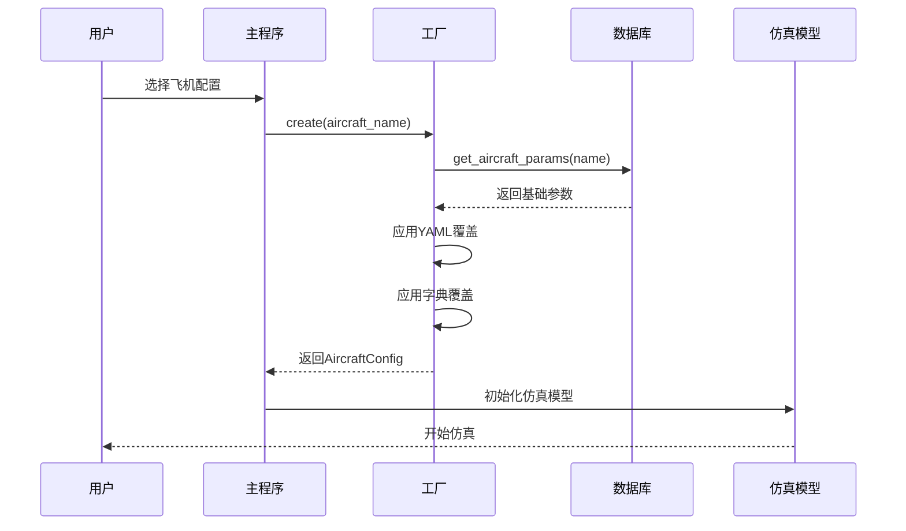
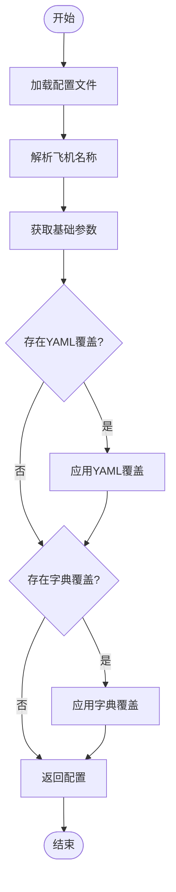
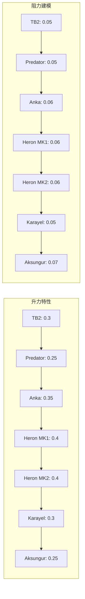
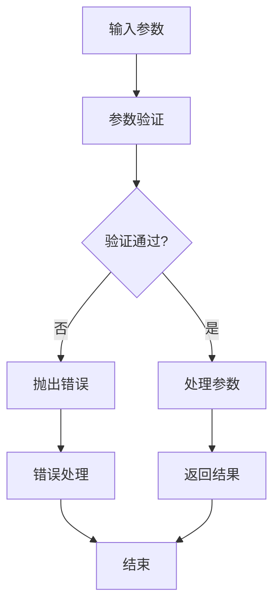

# 内置飞机配置

<cite>
**本文档引用的文件**
- [aircraft_database.py](file://src/models/aircraft_database.py)
- [aircraft_factory.py](file://src/models/aircraft_factory.py)
- [aircraft.yaml](file://config/aircraft.yaml)
- [example_5_different_aircraft.py](file://examples/example_5_different_aircraft.py)
- [main.py](file://main.py)
- [config_loader.py](file://src/utils/config_loader.py)
</cite>

## 目录
1. [简介](#简介)
2. [项目结构](#项目结构)
3. [核心组件](#核心组件)
4. [架构概览](#架构概览)
5. [详细组件分析](#详细组件分析)
6. [飞机配置详解](#飞机配置详解)
7. [参数对比分析](#参数对比分析)
8. [选择指南](#选择指南)
9. [应用场景](#应用场景)
10. [故障排除指南](#故障排除指南)
11. [结论](#结论)

## 简介

FixedWingSimulator项目提供了7种真实军用无人机的完整气动和几何参数数据库，包括TB2、Predator、Heron MK1/MK2、Anka、Aksungur、Karayel等型号。这些参数来源于项目-1的飞行动力学模拟器，经过精确复刻以确保与原始数据源的完全兼容性。

本技术文档旨在为用户提供详细的飞机配置说明，帮助用户根据仿真需求选择最合适的飞机配置，并深入理解各型号飞机的设计特点和性能差异。

## 项目结构

FixedWingSimulator采用模块化架构设计，主要包含以下核心组件：

**图表来源**
- [aircraft_database.py](file://src/models/aircraft_database.py#L29-L133)
- [aircraft_factory.py](file://src/models/aircraft_factory.py#L39-L75)
- [config_loader.py](file://src/utils/config_loader.py#L59-L82)

**章节来源**
- [aircraft_database.py](file://src/models/aircraft_database.py#L1-L183)
- [aircraft_factory.py](file://src/models/aircraft_factory.py#L1-L136)
- [config_loader.py](file://src/utils/config_loader.py#L1-L82)

## 核心组件

### 飞机数据库系统

飞机数据库系统是整个仿真平台的核心，负责存储和管理所有飞机的参数信息。该系统采用类型安全的设计，确保参数的一致性和完整性。

**图表来源**
- [aircraft_database.py](file://src/models/aircraft_database.py#L143-L182)
- [aircraft_factory.py](file://src/models/aircraft_factory.py#L15-L75)

### 参数派生机制

系统自动计算派生参数，包括音速、密度和动态压力等关键物理量：

- **音速计算**: A_SOUND = √(γ·R·T) ≈ 340.3 m/s
- **海平面密度**: RHO0 = 1.225 kg/m³
- **动态压力**: q_bar = 0.5·ρ·U₀²

**章节来源**
- [aircraft_database.py](file://src/models/aircraft_database.py#L14-L21)
- [aircraft_database.py](file://src/models/aircraft_database.py#L159-L166)

## 架构概览

飞机配置系统采用工厂模式和数据库模式相结合的设计，提供灵活的参数管理和覆盖机制：

**图表来源**
- [aircraft_factory.py](file://src/models/aircraft_factory.py#L42-L75)
- [aircraft_database.py](file://src/models/aircraft_database.py#L143-L166)

## 详细组件分析

### 飞机参数数据库

飞机数据库采用字典结构存储所有飞机的参数，每个飞机包含以下主要类别：

1. **识别信息**: 型号名称、制造商、国家
2. **几何参数**: 质量、机翼面积、平均弦长、翼展
3. **惯性参数**: 惯性张量分量
4. **气动参数**: 升力、阻力、俯仰力矩系数
5. **横侧参数**: 侧向力、滚转力矩、偏航力矩系数

**章节来源**
- [aircraft_database.py](file://src/models/aircraft_database.py#L29-L133)

### 飞机工厂系统

飞机工厂提供多种创建方式，支持从数据库直接创建或通过配置文件覆盖参数：

**图表来源**
- [aircraft_factory.py](file://src/models/aircraft_factory.py#L42-L75)

**章节来源**
- [aircraft_factory.py](file://src/models/aircraft_factory.py#L39-L136)

## 飞机配置详解

### TB2（Baykar）
TB2是土耳其Baykar公司开发的中型无人侦察机，具有以下特点：
- **质量**: 700.0 kg
- **机翼面积**: 9.34 m²  
- **平均弦长**: 0.78 m
- **翼展**: 12.0 m
- **最大速度**: 0.12 Mach
- **制造商**: Baykar（土耳其）

### Predator（通用原子公司）
Predator是美国General Atomics公司生产的大型无人侦察机：
- **质量**: 1020.0 kg
- **机翼面积**: 11.45 m²
- **平均弦长**: 0.78 m
- **翼展**: 14.8 m
- **最大速度**: 0.14 Mach
- **制造商**: General Atomics（美国）

### Heron MK1/MK2（以色列航宇工业）
Heron系列是基于美国Piper J-3旅者教练机改进的大型无人机：
- **Heron MK1**: 质量1150.0 kg，翼展16.6 m
- **Heron MK2**: 质量1000.0 kg，翼展16.6 m
- **机翼面积**: 12.9 m²
- **平均弦长**: 0.78 m
- **最大速度**: 0.18 Mach
- **制造商**: IAI（以色列）

### Anka（TUSAŞ）
Anka是土耳其TUSAŞ公司开发的中型无人机：
- **质量**: 1700.0 kg
- **机翼面积**: 18.0 m²
- **平均弦长**: 1.05 m
- **翼展**: 17.5 m
- **最大速度**: 0.18 Mach
- **制造商**: TUSAŞ（土耳其）

### Aksungur（TUSAŞ）
Aksungur是土耳其TUSAŞ公司开发的大型无人机：
- **质量**: 3300.0 kg
- **机翼面积**: 30.0 m²
- **平均弦长**: 1.25 m
- **翼展**: 24.2 m
- **最大速度**: 0.21 Mach
- **制造商**: TUSAŞ（土耳其）

### Karayel（Vestel）
Karayel是土耳其Vestel公司开发的小型无人机：
- **质量**: 630.0 kg
- **机翼面积**: 9.0 m²
- **平均弦长**: 0.75 m
- **翼展**: 13.0 m
- **最大速度**: 0.11 Mach
- **制造商**: Vestel（土耳其）

**章节来源**
- [aircraft_database.py](file://src/models/aircraft_database.py#L31-L132)
- [aircraft.yaml](file://config/aircraft.yaml#L1-L13)

## 参数对比分析

### 几何参数对比

| 飞机型号 | 质量(kg) | 机翼面积(m²) | 平均弦长(m) | 翼展(m) | 机翼面积/质量比 |
|---------|---------|-------------|------------|--------|----------------|
| TB2 | 700.0 | 9.34 | 0.78 | 12.0 | 0.0133 |
| Karayel | 630.0 | 9.0 | 0.75 | 13.0 | 0.0143 |
| Predator | 1020.0 | 11.45 | 0.78 | 14.8 | 0.0112 |
| Anka | 1700.0 | 18.0 | 1.05 | 17.5 | 0.0106 |
| Heron MK1 | 1150.0 | 12.9 | 0.78 | 16.6 | 0.0112 |
| Heron MK2 | 1000.0 | 12.9 | 0.78 | 16.6 | 0.0129 |
| Aksungur | 3300.0 | 30.0 | 1.25 | 24.2 | 0.0091 |

### 气动参数特征

各型号飞机在气动特性上存在显著差异：

**图表来源**
- [aircraft_database.py](file://src/models/aircraft_database.py#L41-L47)
- [aircraft_database.py](file://src/models/aircraft_database.py#L56-L62)
- [aircraft_database.py](file://src/models/aircraft_database.py#L70-L76)
- [aircraft_database.py](file://src/models/aircraft_database.py#L84-L90)
- [aircraft_database.py](file://src/models/aircraft_database.py#L98-L104)
- [aircraft_database.py](file://src/models/aircraft_database.py#L112-L118)
- [aircraft_database.py](file://src/models/aircraft_database.py#L126-L132)

### 关键参数差异

1. **质量范围**: 630.0 kg (Karayel) 到 3300.0 kg (Aksungur)
2. **翼展范围**: 12.0 m (TB2) 到 24.2 m (Aksungur)
3. **机翼面积范围**: 9.0 m² (Karayel) 到 30.0 m² (Aksungur)
4. **最大速度**: 0.11 Mach (Karayel) 到 0.21 Mach (Aksungur)

**章节来源**
- [aircraft_database.py](file://src/models/aircraft_database.py#L37-L39)
- [aircraft_database.py](file://src/models/aircraft_database.py#L53-L55)
- [aircraft_database.py](file://src/models/aircraft_database.py#L67-L69)
- [aircraft_database.py](file://src/models/aircraft_database.py#L81-L83)
- [aircraft_database.py](file://src/models/aircraft_database.py#L95-L97)
- [aircraft_database.py](file://src/models/aircraft_database.py#L109-L111)
- [aircraft_database.py](file://src/models/aircraft_database.py#L123-L125)

## 选择指南

### 小型无人机选择标准

**推荐用于**:
- 教育和培训仿真
- 低空飞行任务
- 精密控制要求高的应用
- 计算资源有限的环境

**首选型号**: TB2, Karayel

### 中型无人机选择标准

**推荐用于**:
- 区域侦察任务
- 中等载荷应用
- 平衡的性能和成本
- 多用途飞行平台

**首选型号**: Predator, Anka

### 大型无人机选择标准

**推荐用于**:
- 长航时任务
- 大载荷运输
- 远程侦察应用
- 高空飞行任务

**首选型号**: Heron MK1/MK2, Aksungur

### 性能考虑因素

1. **质量影响**: 质量越大，惯性越大，但升力能力更强
2. **翼展影响**: 翼展越大，升阻比越好，但操控性相对较差
3. **速度限制**: 不同型号的最大速度限制反映了其设计目标
4. **气动效率**: 各型号的CL/CD比值决定了飞行效率

**章节来源**
- [aircraft_database.py](file://src/models/aircraft_database.py#L143-L166)
- [example_5_different_aircraft.py](file://examples/example_5_different_aircraft.py#L24-L34)

## 应用场景

### TB2应用场景
- **边境巡逻**: 适合中等距离的持续监视任务
- **战术侦察**: 支持快速机动和灵活部署
- **训练用途**: 适合作为初学者的仿真平台
- **教育研究**: 具有良好的教学价值

### Predator应用场景
- **远程侦察**: 适合长时间高空监视任务
- **ISR任务**: 支持情报收集和监视
- **搜索救援**: 可携带多种传感器设备
- **商业应用**: 适合各种商业无人机任务

### Heron系列应用场景
- **战略侦察**: 适合大规模区域监视
- **通信中继**: 可作为移动通信平台
- **气象观测**: 支持长期气象数据收集
- **环境监测**: 适合大范围环境评估

### Anka应用场景
- **多用途平台**: 可执行多种任务类型
- **载荷扩展**: 支持不同类型的传感器和设备
- **成本效益**: 在性能和成本间取得平衡
- **出口市场**: 符合国际市场需求

### Aksungur应用场景
- **重型任务**: 适合需要大载荷的应用
- **长航时作业**: 支持长时间连续飞行
- **特殊载荷**: 可携带重型专业设备
- **工业应用**: 适合各种工业级任务

### Karayel应用场景
- **入门级应用**: 适合初学者和小型任务
- **近程监视**: 适合近距离观察和监控
- **成本敏感项目**: 提供经济高效的解决方案
- **教育用途**: 适合作为教学工具

**章节来源**
- [aircraft_database.py](file://src/models/aircraft_database.py#L31-L132)

## 故障排除指南

### 常见配置问题

1. **飞机名称错误**
   - 症状: 抛出KeyError异常
   - 解决方案: 检查aircraft.yaml中的飞机名称是否正确
   - 参考: [aircraft_info函数](file://src/models/aircraft_database.py#L174-L182)

2. **参数覆盖冲突**
   - 症状: 参数未按预期更新
   - 解决方案: 检查YAML配置文件格式和参数名称
   - 参考: [AircraftFactory.create方法](file://src/models/aircraft_factory.py#L42-L75)

3. **导出参数失败**
   - 症状: ArduPilot参数导出错误
   - 解决方案: 确保输出目录可写且参数文件格式正确
   - 参考: [export_ardupilot_params方法](file://src/models/aircraft_factory.py#L95-L136)

### 参数验证机制

系统提供完整的参数验证和错误处理机制：

**图表来源**
- [aircraft_database.py](file://src/models/aircraft_database.py#L153-L156)
- [aircraft_factory.py](file://src/models/aircraft_factory.py#L63-L74)

**章节来源**
- [aircraft_database.py](file://src/models/aircraft_database.py#L143-L166)
- [aircraft_factory.py](file://src/models/aircraft_factory.py#L42-L75)

## 结论

FixedWingSimulator的内置飞机配置系统提供了7种真实军用无人机的完整参数集，涵盖了从小型到大型的各种应用场景。每个型号都有其独特的设计特点和性能优势：

1. **TB2**: 最佳入门选择，适合学习和基础应用
2. **Predator**: 平衡的性能表现，适合多种任务类型
3. **Heron系列**: 大型平台的代表，适合长航时任务
4. **Anka**: 中型平台的典型，适合多用途应用
5. **Aksungur**: 大型重型平台，适合重载荷任务
6. **Karayel**: 小型轻量平台，适合入门和近程任务

用户应根据具体的仿真需求、计算资源限制和任务要求来选择合适的飞机配置。系统提供的参数覆盖机制允许用户根据实际需要调整参数，实现更精确的仿真效果。

通过深入理解各型号飞机的参数差异和设计特点，用户可以做出更明智的选择，获得更好的仿真体验和结果。