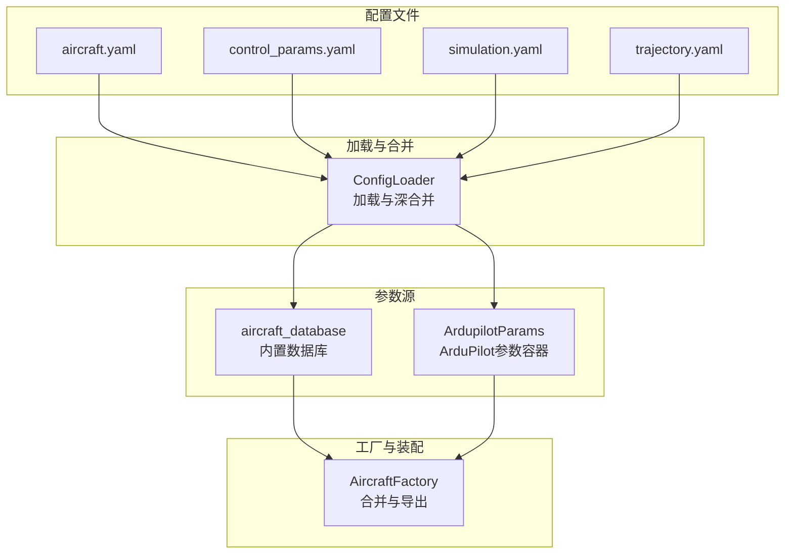
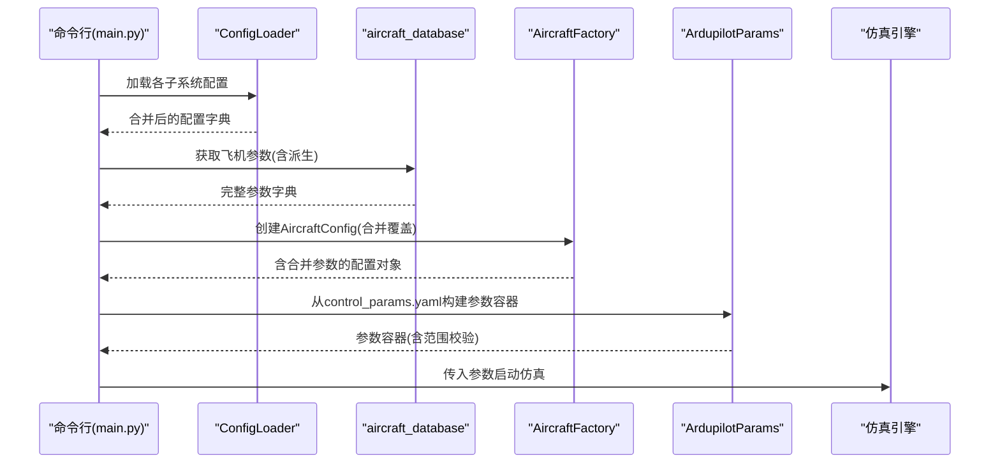
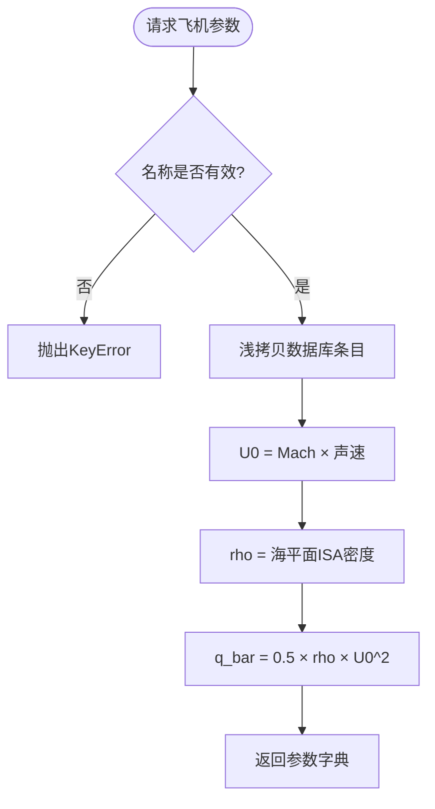
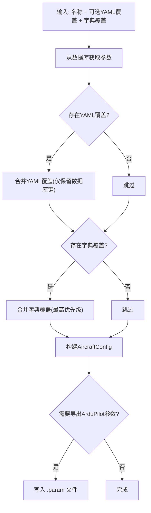
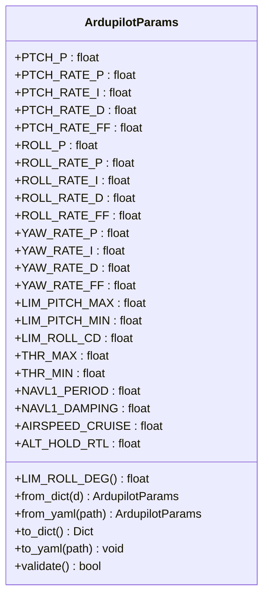
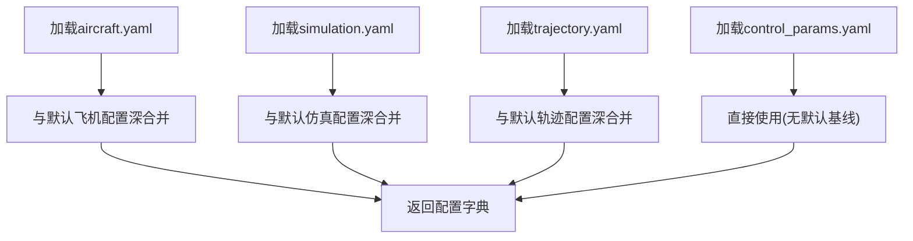
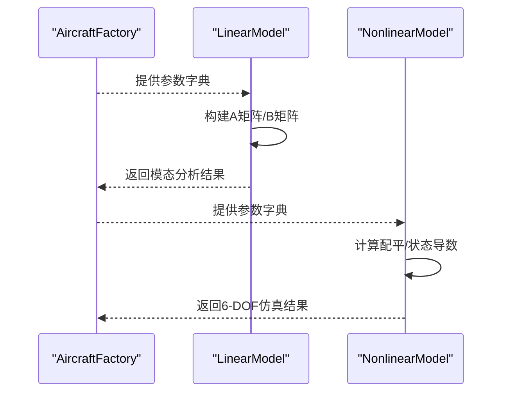
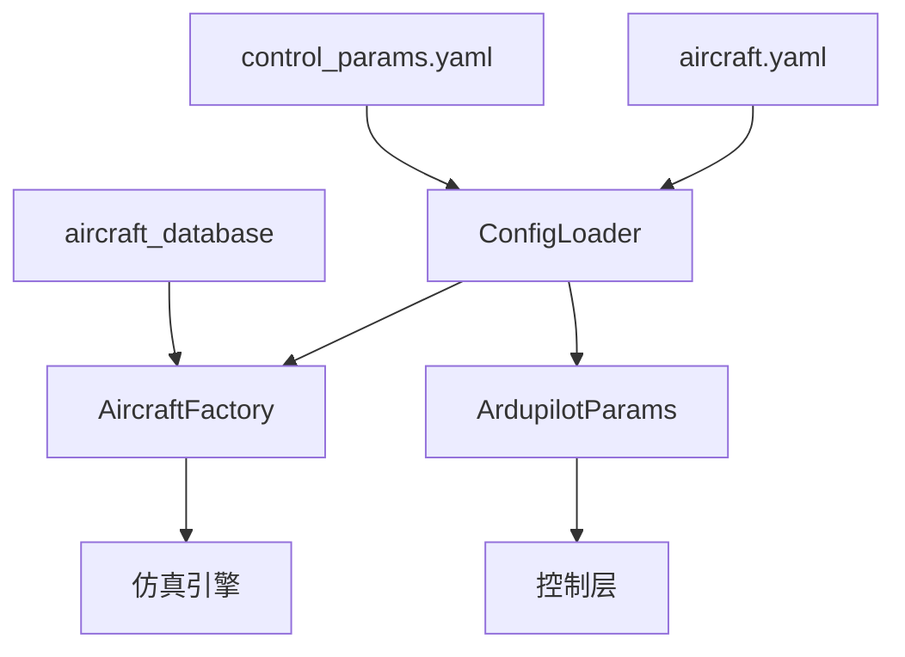

# 参数配置系统

<cite>
**本文引用的文件**
- [config/aircraft.yaml](file://config/aircraft.yaml)
- [config/control_params.yaml](file://config/control_params.yaml)
- [config/simulation.yaml](file://config/simulation.yaml)
- [config/trajectory.yaml](file://config/trajectory.yaml)
- [src/utils/config_loader.py](file://src/utils/config_loader.py)
- [src/models/aircraft_database.py](file://src/models/aircraft_database.py)
- [src/models/aircraft_factory.py](file://src/models/aircraft_factory.py)
- [src/control/ardupilot_compat.py](file://src/control/ardupilot_compat.py)
- [src/dynamics/linear_model.py](file://src/dynamics/linear_model.py)
- [src/dynamics/nonlinear_model.py](file://src/dynamics/nonlinear_model.py)
- [examples/example_5_different_aircraft.py](file://examples/example_5_different_aircraft.py)
- [examples/example_6_ardupilot_parameters.py](file://examples/example_6_ardupilot_parameters.py)
- [main.py](file://main.py)
</cite>

## 目录
1. [简介](#简介)
2. [项目结构](#项目结构)
3. [核心组件](#核心组件)
4. [架构总览](#架构总览)
5. [详细组件分析](#详细组件分析)
6. [依赖关系分析](#依赖关系分析)
7. [性能考虑](#性能考虑)
8. [故障排查指南](#故障排查指南)
9. [结论](#结论)
10. [附录](#附录)

## 简介
本文件面向FixedWingSimulator的参数配置系统，系统化梳理飞机参数的分类、命名与组织方式，解释参数在数据库中的注入与派生逻辑，以及配置文件与运行时参数容器之间的映射与数据流。文档重点覆盖以下方面：
- 飞机参数的分类与物理意义：几何参数、气动参数、质量惯性参数、控制面参数等
- 参数的数据结构与命名规范：ArduPilot兼容参数容器、配置加载与合并策略
- 参数取值范围与验证机制：参数范围检查与警告输出
- 参数对飞行性能的影响：通过线性/非线性模型体现参数的作用路径
- 最佳实践与调优建议：如何基于目标性能调整参数
- 配置文件与数据库/参数容器之间的映射关系与数据流向

## 项目结构
参数配置系统由“配置文件 + 加载器 + 数据库 + 工厂 + 参数容器”构成，形成从磁盘到内存再到仿真引擎的完整链路。

图表来源
- [config/aircraft.yaml](file://config/aircraft.yaml#L1-L13)
- [config/control_params.yaml](file://config/control_params.yaml#L1-L45)
- [config/simulation.yaml](file://config/simulation.yaml#L1-L30)
- [config/trajectory.yaml](file://config/trajectory.yaml#L1-L23)
- [src/utils/config_loader.py](file://src/utils/config_loader.py#L40-L82)
- [src/models/aircraft_database.py](file://src/models/aircraft_database.py#L29-L166)
- [src/models/aircraft_factory.py](file://src/models/aircraft_factory.py#L42-L93)
- [src/control/ardupilot_compat.py](file://src/control/ardupilot_compat.py#L17-L129)

章节来源
- [config/aircraft.yaml](file://config/aircraft.yaml#L1-L13)
- [config/control_params.yaml](file://config/control_params.yaml#L1-L45)
- [config/simulation.yaml](file://config/simulation.yaml#L1-L30)
- [config/trajectory.yaml](file://config/trajectory.yaml#L1-L23)
- [src/utils/config_loader.py](file://src/utils/config_loader.py#L40-L82)

## 核心组件
- 配置文件层：提供可读写的参数配置，支持默认值与覆盖。
- 配置加载器：统一加载与深合并配置，确保默认值与用户覆盖的正确叠加。
- 飞机参数数据库：内置多型飞机参数，按ArduPilot命名约定扩展派生参数。
- 飞机工厂：从数据库与配置文件中装配最终的参数字典，并支持导出ArduPilot参数文件。
- ArduPilot参数容器：强类型参数容器，提供序列化、反序列化与参数范围校验。

章节来源
- [src/utils/config_loader.py](file://src/utils/config_loader.py#L40-L82)
- [src/models/aircraft_database.py](file://src/models/aircraft_database.py#L29-L166)
- [src/models/aircraft_factory.py](file://src/models/aircraft_factory.py#L42-L93)
- [src/control/ardupilot_compat.py](file://src/control/ardupilot_compat.py#L17-L129)

## 架构总览
下图展示参数从配置文件到仿真引擎的端到端流程。

图表来源
- [main.py](file://main.py#L98-L141)
- [src/utils/config_loader.py](file://src/utils/config_loader.py#L68-L81)
- [src/models/aircraft_database.py](file://src/models/aircraft_database.py#L143-L166)
- [src/models/aircraft_factory.py](file://src/models/aircraft_factory.py#L42-L93)
- [src/control/ardupilot_compat.py](file://src/control/ardupilot_compat.py#L82-L98)

## 详细组件分析

### 飞机参数数据库与派生字段
- 数据库条目包含：识别信息、几何与质量惯性、气动导数、马赫数等。
- 派生字段：基于马赫数与声速计算巡航速度U0，设定空气密度rho与动压q_bar，供动力学模块直接使用。
- 访问接口：提供名称列表、信息摘要与参数获取函数。

图表来源
- [src/models/aircraft_database.py](file://src/models/aircraft_database.py#L143-L166)

章节来源
- [src/models/aircraft_database.py](file://src/models/aircraft_database.py#L29-L166)

### 飞机工厂：合并与导出
- 合并策略：优先应用YAML覆盖（支持嵌套或扁平），再应用字典覆盖；仅接受数据库中存在的键。
- 导出功能：将飞机参数与控制参数导出为ArduPilot .param文件格式，便于地面站加载。

图表来源
- [src/models/aircraft_factory.py](file://src/models/aircraft_factory.py#L42-L93)
- [src/models/aircraft_factory.py](file://src/models/aircraft_factory.py#L95-L135)

章节来源
- [src/models/aircraft_factory.py](file://src/models/aircraft_factory.py#L42-L93)
- [src/models/aircraft_factory.py](file://src/models/aircraft_factory.py#L95-L135)

### ArduPilot参数容器：数据结构与验证
- 数据结构：使用数据类承载控制参数，字段名与ArduPilot一致，便于互操作。
- 序列化：支持从YAML加载、导出为YAML与字典。
- 范围校验：对关键参数进行范围检查，越界时打印警告并返回False。

图表来源
- [src/control/ardupilot_compat.py](file://src/control/ardupilot_compat.py#L17-L129)

章节来源
- [src/control/ardupilot_compat.py](file://src/control/ardupilot_compat.py#L17-L129)

### 配置加载器：默认值与深合并
- 默认值：集中于默认配置字典，覆盖飞机、仿真、轨迹三类。
- 合并策略：递归深合并，用户配置覆盖默认配置；仿真与轨迹配置同时应用默认基线。
- 返回类型：返回字典形式的配置，供上层模块使用。

图表来源
- [src/utils/config_loader.py](file://src/utils/config_loader.py#L40-L82)

章节来源
- [src/utils/config_loader.py](file://src/utils/config_loader.py#L40-L82)

### 参数在仿真中的使用路径
- 线性模型：使用气动导数与几何/质量参数构建状态空间，评估短周期与长周期模态。
- 非线性模型：使用气动力与力矩模型、推进力与重力，求解6-DOF方程组并进行配平。

图表来源
- [src/dynamics/linear_model.py](file://src/dynamics/linear_model.py#L129-L200)
- [src/dynamics/nonlinear_model.py](file://src/dynamics/nonlinear_model.py#L132-L154)

章节来源
- [src/dynamics/linear_model.py](file://src/dynamics/linear_model.py#L107-L200)
- [src/dynamics/nonlinear_model.py](file://src/dynamics/nonlinear_model.py#L104-L154)

## 依赖关系分析
- 配置文件依赖加载器：aircraft.yaml与control_params.yaml经加载器合并后进入工厂与参数容器。
- 数据库依赖：工厂依赖数据库获取基础参数，并由数据库注入派生参数。
- 参数容器依赖：控制参数容器用于控制层，与仿真引擎的控制器耦合。
- 示例脚本依赖：示例展示了参数的加载、导出与对比分析。

图表来源
- [src/utils/config_loader.py](file://src/utils/config_loader.py#L68-L81)
- [src/models/aircraft_factory.py](file://src/models/aircraft_factory.py#L42-L93)
- [src/models/aircraft_database.py](file://src/models/aircraft_database.py#L143-L166)
- [src/control/ardupilot_compat.py](file://src/control/ardupilot_compat.py#L82-L98)

章节来源
- [src/utils/config_loader.py](file://src/utils/config_loader.py#L68-L81)
- [src/models/aircraft_factory.py](file://src/models/aircraft_factory.py#L42-L93)
- [src/models/aircraft_database.py](file://src/models/aircraft_database.py#L143-L166)
- [src/control/ardupilot_compat.py](file://src/control/ardupilot_compat.py#L82-L98)

## 性能考虑
- 数值积分：仿真配置提供数值积分器选择与容差设置，影响稳定性与计算效率。
- 线性/非线性模型：线性模型适合快速模态分析，非线性模型更贴近真实动态但计算成本更高。
- 参数规模：参数越多、耦合越强，控制回路的收敛与鲁棒性越重要，需谨慎调参。

## 故障排查指南
- 参数越界：ArduPilot参数容器提供范围校验，越界会打印警告并返回False，应根据提示调整参数。
- 飞机名称无效：数据库查询失败会抛出异常，确认aircraft.yaml中的名称是否在可用列表内。
- 配置未生效：确认YAML覆盖键是否存在于数据库条目中，工厂仅合并数据库中存在的键。
- 导出参数为空：检查输出目录权限与控制参数文件路径，确保文件存在且可读。

章节来源
- [src/control/ardupilot_compat.py](file://src/control/ardupilot_compat.py#L104-L129)
- [src/models/aircraft_database.py](file://src/models/aircraft_database.py#L153-L156)
- [src/models/aircraft_factory.py](file://src/models/aircraft_factory.py#L63-L74)
- [src/models/aircraft_factory.py](file://src/models/aircraft_factory.py#L95-L135)

## 结论
参数配置系统通过“配置文件 + 加载器 + 数据库 + 工厂 + 参数容器”的分层设计，实现了参数的可读、可写、可校验与可导出。参数命名遵循ArduPilot约定，便于与地面站互通；数据库自动注入派生参数，简化了仿真引擎的使用。通过线性/非线性模型，用户可以直观评估参数对飞行性能的影响，并据此进行最佳实践与调优。

## 附录

### 参数分类与物理意义
- 几何参数
  - S：机翼面积（m²）
  - b：翼展（m）
  - c：平均弦长（m）
- 质量与惯性
  - mass：质量（kg）
  - Ixx/Iyy/Izz/Ixz：惯性张量分量（用于6-DOF旋转动力学）
- 气动参数
  - CL_0/CL_alpha/CL_q/CL_deltae/CL_u：纵向升力导数
  - CD_0/CD_alpha/CD_q/CD_deltae/CD_u：纵向阻力导数
  - Cm_0/Cm_alpha/Cm_q/Cm_deltae/Cm_u：俯仰力矩导数
  - CYb/CYp/CYr/CYda/CYdr：侧向力导数
  - Clb/Clp/Clr/Clda/Cldr：滚转力矩导数
  - Cnb/Cnp/Cnr/Cnda/Cndr：偏航力矩导数
- 派生参数
  - U0：巡航速度（m/s），由Mach与声速计算
  - rho：空气密度（常量）
  - q_bar：动压（0.5·rho·U0²）

章节来源
- [src/models/aircraft_database.py](file://src/models/aircraft_database.py#L29-L133)
- [src/models/aircraft_database.py](file://src/models/aircraft_database.py#L159-L164)

### 参数命名规范与数据结构
- 飞机参数：采用数据库条目键名，与ArduPilot命名保持一致，便于互操作。
- 控制参数：ArduPilot参数容器字段名与ArduPilot一致，支持from_dict/from_yaml/to_dict/to_yaml。
- 配置加载：默认配置字典集中管理默认值，加载器执行深合并。

章节来源
- [src/models/aircraft_database.py](file://src/models/aircraft_database.py#L25-L27)
- [src/control/ardupilot_compat.py](file://src/control/ardupilot_compat.py#L17-L60)
- [src/utils/config_loader.py](file://src/utils/config_loader.py#L10-L37)

### 参数取值范围与验证机制
- 控制参数范围：容器提供validate方法，对关键参数进行上下限检查并输出警告。
- 飞机参数：工厂在合并阶段仅接受数据库中存在的键，避免非法键进入参数字典。

章节来源
- [src/control/ardupilot_compat.py](file://src/control/ardupilot_compat.py#L104-L129)
- [src/models/aircraft_factory.py](file://src/models/aircraft_factory.py#L63-L74)

### 参数对飞行性能的影响
- 线性模型：通过A矩阵特征值识别短周期与长周期模态，评估稳定性与阻尼特性。
- 非线性模型：通过6-DOF仿真观察配平、姿态与轨迹跟踪性能。

章节来源
- [src/dynamics/linear_model.py](file://src/dynamics/linear_model.py#L206-L252)
- [src/dynamics/nonlinear_model.py](file://src/dynamics/nonlinear_model.py#L132-L154)

### 最佳实践与调优建议
- 以线性模型先行：先用线性分析确定主导模态与稳定边界，再在非线性模型中验证。
- 控制参数调优：从保守增益开始，逐步提高比例增益，避免积分项引入极限环；关注横滚/俯仰限制与油门上下限。
- 风险规避：严格遵守参数范围校验，避免过大增益导致发散；注意马赫数与U0对气动导数的影响。
- 实验对比：参考示例脚本，对比不同机型或不同控制参数下的响应差异。

章节来源
- [examples/example_5_different_aircraft.py](file://examples/example_5_different_aircraft.py#L24-L33)
- [examples/example_6_ardupilot_parameters.py](file://examples/example_6_ardupilot_parameters.py#L27-L38)

### 配置文件与数据库/容器的映射关系与数据流向
- aircraft.yaml → ConfigLoader → AircraftFactory → 参数字典（含派生）
- control_params.yaml → ConfigLoader → ArdupilotParams（范围校验）
- simulation.yaml/trajectory.yaml → ConfigLoader → 仿真/轨迹配置字典
- 示例脚本演示：加载参数、导出ArduPilot参数文件、热更新控制增益

章节来源
- [config/aircraft.yaml](file://config/aircraft.yaml#L1-L13)
- [config/control_params.yaml](file://config/control_params.yaml#L1-L45)
- [config/simulation.yaml](file://config/simulation.yaml#L1-L30)
- [config/trajectory.yaml](file://config/trajectory.yaml#L1-L23)
- [src/utils/config_loader.py](file://src/utils/config_loader.py#L68-L81)
- [src/models/aircraft_factory.py](file://src/models/aircraft_factory.py#L95-L135)
- [examples/example_6_ardupilot_parameters.py](file://examples/example_6_ardupilot_parameters.py#L40-L42)