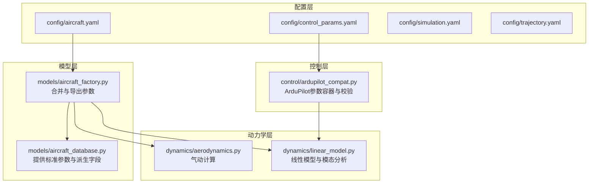
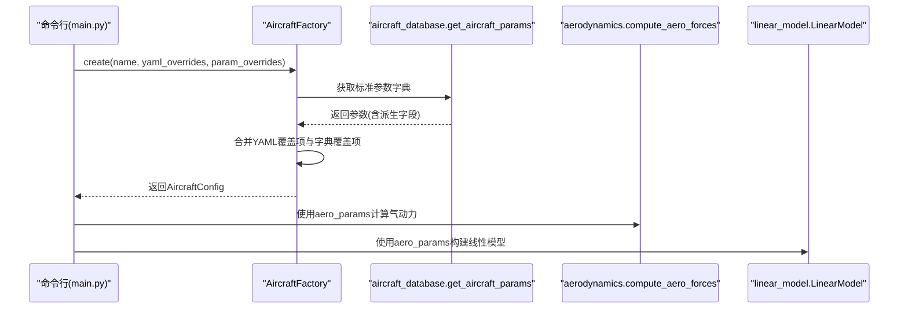
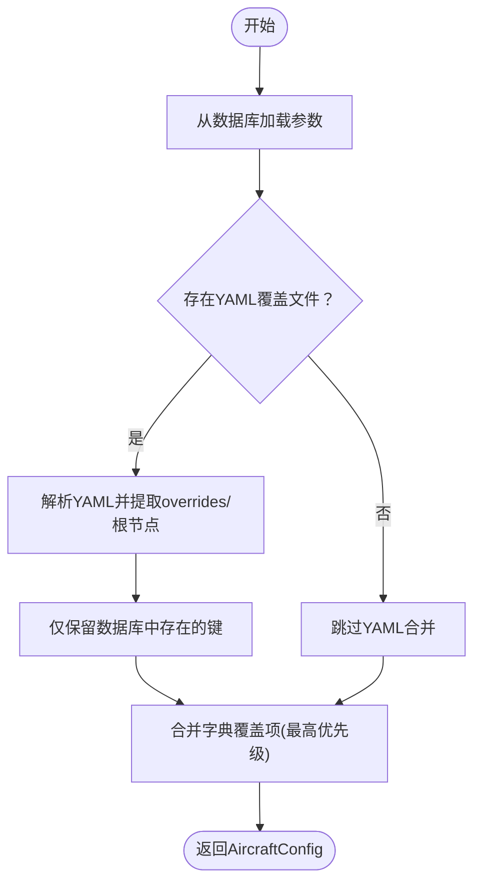
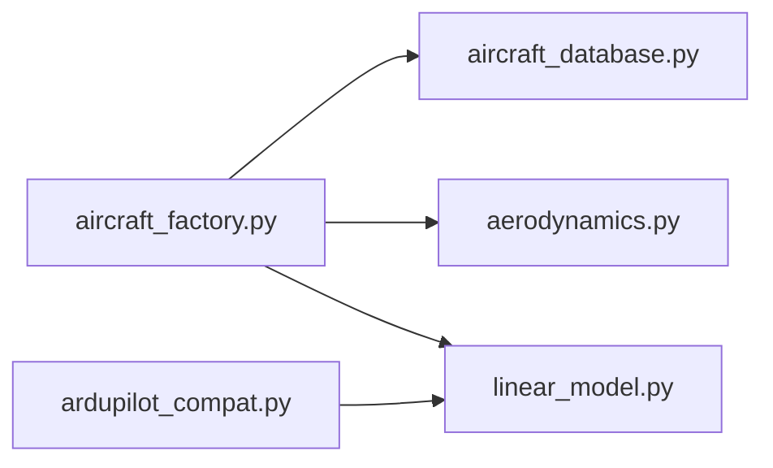

# 自定义飞机配置

<cite>
**本文引用的文件**
- [config/aircraft.yaml](file://config/aircraft.yaml)
- [config/control_params.yaml](file://config/control_params.yaml)
- [config/simulation.yaml](file://config/simulation.yaml)
- [config/trajectory.yaml](file://config/trajectory.yaml)
- [src/models/aircraft_database.py](file://src/models/aircraft_database.py)
- [src/models/aircraft_factory.py](file://src/models/aircraft_factory.py)
- [src/utils/config_loader.py](file://src/utils/config_loader.py)
- [src/dynamics/aerodynamics.py](file://src/dynamics/aerodynamics.py)
- [src/dynamics/linear_model.py](file://src/dynamics/linear_model.py)
- [src/control/ardupilot_compat.py](file://src/control/ardupilot_compat.py)
- [examples/example_5_different_aircraft.py](file://examples/example_5_different_aircraft.py)
- [tests/test_dynamics.py](file://tests/test_dynamics.py)
- [main.py](file://main.py)
</cite>

## 目录
1. [简介](#简介)
2. [项目结构](#项目结构)
3. [核心组件](#核心组件)
4. [架构总览](#架构总览)
5. [详细组件分析](#详细组件分析)
6. [依赖关系分析](#依赖关系分析)
7. [性能与数值稳定性考量](#性能与数值稳定性考量)
8. [故障排查指南](#故障排查指南)
9. [结论](#结论)
10. [附录：配置模板与示例](#附录配置模板与示例)

## 简介
本文件面向希望为 FixedWingSimulator 创建“自定义飞机配置”的用户，系统性说明如何在现有数据库基础上扩展或覆盖参数，确保新配置在物理合理性、数值稳定性和控制适配方面满足仿真需求。内容涵盖参数来源与合并机制、数据格式与验证规则、配置步骤与注意事项、模板与示例、对仿真结果的影响分析（敏感性与性能）、调试与验证方法以及常见错误与解决方案。

## 项目结构
FixedWingSimulator 的配置体系由“配置文件 + 数据库 + 工厂类”构成：
- 配置文件位于 config/，包含飞机、控制、仿真、轨迹等 YAML 文件
- 飞机参数数据库位于 src/models/aircraft_database.py，提供标准机型参数与派生字段
- 飞机工厂类 AircraftFactory 负责加载、合并与导出参数
- 动力学模块 aerodynamics.py 与 linear_model.py 使用参数进行气动与线性分析
- 控制兼容层 ardupilot_compat.py 提供 ArduPilot 参数容器与基础校验
- 示例与测试文件用于对比不同机型、验证数值稳定性与控制参数范围

图表来源
- [config/aircraft.yaml](file://config/aircraft.yaml#L1-L13)
- [config/control_params.yaml](file://config/control_params.yaml#L1-L45)
- [config/simulation.yaml](file://config/simulation.yaml#L1-L30)
- [config/trajectory.yaml](file://config/trajectory.yaml#L1-L23)
- [src/models/aircraft_database.py](file://src/models/aircraft_database.py#L143-L166)
- [src/models/aircraft_factory.py](file://src/models/aircraft_factory.py#L42-L74)
- [src/dynamics/aerodynamics.py](file://src/dynamics/aerodynamics.py#L35-L147)
- [src/dynamics/linear_model.py](file://src/dynamics/linear_model.py#L107-L200)
- [src/control/ardupilot_compat.py](file://src/control/ardupilot_compat.py#L17-L129)

章节来源
- [config/aircraft.yaml](file://config/aircraft.yaml#L1-L13)
- [src/models/aircraft_database.py](file://src/models/aircraft_database.py#L143-L166)
- [src/models/aircraft_factory.py](file://src/models/aircraft_factory.py#L42-L74)

## 核心组件
- 飞机参数数据库：提供标准机型参数字典，并注入派生字段（如 U0、rho、q_bar），供动力学与气动模块使用
- 飞机工厂类：从数据库读取参数，支持从 YAML 文件与字典进行覆盖合并，生成统一的 AircraftConfig
- 配置加载器：负责加载各子系统配置文件并应用默认值与深合并策略
- 气动模块：基于参数计算非维系数与力矩，再换算为作用力
- 线性模型：基于纵向参数构建状态空间，进行模态分析与时间域仿真
- 控制兼容层：提供 ArduPilot 参数容器，支持从 YAML 加载、导出与基本范围校验

章节来源
- [src/models/aircraft_database.py](file://src/models/aircraft_database.py#L143-L166)
- [src/models/aircraft_factory.py](file://src/models/aircraft_factory.py#L42-L74)
- [src/utils/config_loader.py](file://src/utils/config_loader.py#L59-L81)
- [src/dynamics/aerodynamics.py](file://src/dynamics/aerodynamics.py#L35-L147)
- [src/dynamics/linear_model.py](file://src/dynamics/linear_model.py#L107-L200)
- [src/control/ardupilot_compat.py](file://src/control/ardupilot_compat.py#L17-L129)

## 架构总览
下图展示了“配置文件 → 工厂类 → 数据库 → 动力学/控制模块”的调用链路与数据流向。

图表来源
- [main.py](file://main.py#L98-L141)
- [src/models/aircraft_factory.py](file://src/models/aircraft_factory.py#L42-L74)
- [src/models/aircraft_database.py](file://src/models/aircraft_database.py#L143-L166)
- [src/dynamics/aerodynamics.py](file://src/dynamics/aerodynamics.py#L35-L147)
- [src/dynamics/linear_model.py](file://src/dynamics/linear_model.py#L107-L200)

## 详细组件分析

### 飞机参数数据库与派生字段
- 数据库键值结构严格遵循项目约定，包含几何/惯性、气动导数、马赫数等
- 派生字段：
  - U0：飞行速度 = 马赫数 × 声速
  - rho：海平面 ISA 密度
  - q_bar：动态压强 = 0.5 × rho × U0^2
- 提供查询接口与信息摘要函数，便于调试与展示

章节来源
- [src/models/aircraft_database.py](file://src/models/aircraft_database.py#L29-L133)
- [src/models/aircraft_database.py](file://src/models/aircraft_database.py#L143-L166)
- [src/models/aircraft_database.py](file://src/models/aircraft_database.py#L169-L182)

### 飞机工厂类与参数合并机制
- 支持三种输入来源：
  - 数据库默认参数
  - YAML 覆盖文件（支持嵌套或扁平写法）
  - 字典覆盖（优先级最高）
- 合并策略：仅保留存在于数据库中的键；YAML 与字典均过滤无效键
- 输出：AircraftConfig，包含名称与合并后的 aerodynamic/physical 参数字典

图表来源
- [src/models/aircraft_factory.py](file://src/models/aircraft_factory.py#L42-L74)

章节来源
- [src/models/aircraft_factory.py](file://src/models/aircraft_factory.py#L42-L74)

### 配置加载器与默认值
- 默认配置字典覆盖了 aircraft、simulation、trajectory 的关键键
- 深合并策略：递归合并嵌套字典，避免遗漏子项
- 提供按文件名加载各子系统配置的方法

章节来源
- [src/utils/config_loader.py](file://src/utils/config_loader.py#L10-L37)
- [src/utils/config_loader.py](file://src/utils/config_loader.py#L48-L56)
- [src/utils/config_loader.py](file://src/utils/config_loader.py#L68-L81)

### 气动计算与线性模型
- 气动模块：根据速度、角速率、舵面偏角与参数计算非维系数与力矩，再换算为作用力
- 线性模型：基于纵向参数构建状态矩阵与输入矩阵，进行模态分析与时间域仿真

章节来源
- [src/dynamics/aerodynamics.py](file://src/dynamics/aerodynamics.py#L35-L147)
- [src/dynamics/linear_model.py](file://src/dynamics/linear_model.py#L129-L200)

### 控制参数容器与校验
- ArduPilot 参数容器支持从 YAML 加载、导出与基本范围校验
- 校验清单包含姿态/速率控制器比例系数、限幅与空速范围等

章节来源
- [src/control/ardupilot_compat.py](file://src/control/ardupilot_compat.py#L74-L98)
- [src/control/ardupilot_compat.py](file://src/control/ardupilot_compat.py#L104-L129)

## 依赖关系分析
- 飞机工厂依赖数据库接口以获取标准参数与派生字段
- 动力学模块依赖 aerodynamic 参数字典进行计算
- 线性模型依赖纵向气动导数与惯性参数
- 控制兼容层可选地与仿真配置联动，导出 ArduPilot 参数文件

图表来源
- [src/models/aircraft_factory.py](file://src/models/aircraft_factory.py#L12-L12)
- [src/models/aircraft_database.py](file://src/models/aircraft_database.py#L143-L166)
- [src/dynamics/aerodynamics.py](file://src/dynamics/aerodynamics.py#L35-L147)
- [src/dynamics/linear_model.py](file://src/dynamics/linear_model.py#L107-L200)
- [src/control/ardupilot_compat.py](file://src/control/ardupilot_compat.py#L17-L129)

章节来源
- [src/models/aircraft_factory.py](file://src/models/aircraft_factory.py#L12-L12)
- [src/models/aircraft_database.py](file://src/models/aircraft_database.py#L143-L166)
- [src/dynamics/aerodynamics.py](file://src/dynamics/aerodynamics.py#L35-L147)
- [src/dynamics/linear_model.py](file://src/dynamics/linear_model.py#L107-L200)
- [src/control/ardupilot_compat.py](file://src/control/ardupilot_compat.py#L17-L129)

## 性能与数值稳定性考量
- 数值稳定性
  - 当空速接近零时，气动模块对空速进行数值夹紧，避免 q_bar 过小导致的不稳定
  - 测试用例验证了近零速度下的有限性与小扰动响应
- 线性模型稳定性
  - 模态分析应保证短周期模态阻尼比合理，避免不稳定或过度欠阻尼
  - 所有机型在默认参数下应能成功计算配平并保持有限状态导数
- 控制参数范围
  - ArduPilot 参数容器提供范围校验，超出范围会打印警告并返回失败标志

章节来源
- [src/dynamics/aerodynamics.py](file://src/dynamics/aerodynamics.py#L76-L83)
- [tests/test_dynamics.py](file://tests/test_dynamics.py#L153-L164)
- [tests/test_dynamics.py](file://tests/test_dynamics.py#L222-L231)
- [tests/test_dynamics.py](file://tests/test_dynamics.py#L292-L308)
- [src/control/ardupilot_compat.py](file://src/control/ardupilot_compat.py#L110-L129)

## 故障排查指南
- 常见问题与定位
  - 飞机名称不在数据库：工厂类会抛出异常，提示可用机型列表
  - 参数键不匹配：仅保留数据库中存在的键，其他键会被忽略
  - 控制参数越界：ArduPilot 参数容器会打印警告并返回校验失败
  - 线性模型不稳定：检查纵向气动导数与惯性参数是否合理
- 调试建议
  - 使用示例脚本对比不同机型的短周期与长周期模态
  - 在命令行中启用可视化或输出日志，观察状态轨迹与控制量
  - 逐步调整参数，先做单变量敏感性测试（如翼面积、机翼平均弦长、质量）

章节来源
- [src/models/aircraft_database.py](file://src/models/aircraft_database.py#L153-L156)
- [src/models/aircraft_factory.py](file://src/models/aircraft_factory.py#L64-L72)
- [src/control/ardupilot_compat.py](file://src/control/ardupilot_compat.py#L124-L129)
- [examples/example_5_different_aircraft.py](file://examples/example_5_different_aircraft.py#L24-L33)
- [main.py](file://main.py#L98-L141)

## 结论
通过“配置文件 + 工厂类 + 数据库”的解耦设计，FixedWingSimulator 为自定义飞机配置提供了清晰、可扩展且可验证的路径。遵循本文的数据格式、参数范围与验证规则，结合示例与测试用例，可以高效地创建符合物理与数值要求的新配置，并将其应用于线性与时域仿真中。

## 附录：配置模板与示例

### 飞机配置模板（aircraft.yaml）
- 必填项：aircraft_name
- 可选项：overrides（可嵌套或扁平）
- 支持覆盖的键来自数据库参数字典（如质量、机翼面积、平均弦长、翼展、惯性、气动导数、马赫数等）

章节来源
- [config/aircraft.yaml](file://config/aircraft.yaml#L1-L13)
- [src/models/aircraft_factory.py](file://src/models/aircraft_factory.py#L64-L72)

### 控制参数模板（control_params.yaml）
- 键名与 ArduPilot 命名一致，支持从 YAML 加载与导出
- 包含姿态/速率控制器参数、限幅与导航/空速/高度相关参数

章节来源
- [config/control_params.yaml](file://config/control_params.yaml#L1-L45)
- [src/control/ardupilot_compat.py](file://src/control/ardupilot_compat.py#L74-L98)

### 仿真与轨迹配置模板
- 仿真配置：时间步长、总时长、积分器、初始条件、风场类型与强度、日志开关与目录
- 轨迹配置：轨迹类型、平均速度、偏航模式、航路点列表与循环标记

章节来源
- [config/simulation.yaml](file://config/simulation.yaml#L1-L30)
- [config/trajectory.yaml](file://config/trajectory.yaml#L1-L23)

### 自定义配置步骤与注意事项
- 步骤
  - 在 config/aircraft.yaml 中指定 aircraft_name
  - 在 overrides 中添加需要覆盖的键值（仅接受数据库中存在的键）
  - 如需导出 ArduPilot 参数，可使用工厂类的导出功能并提供控制参数文件路径
- 注意事项
  - 仅覆盖数据库中存在的键；新增键不会生效
  - 参数范围建议参考 ArduPilot 参数容器的校验范围
  - 修改几何/惯性参数后，建议先运行线性模态分析，确认短周期与 phugoid 稳定性
  - 修改气动导数时，注意与飞行马赫数/速度的关系，避免派生字段 U0/q_bar 引发的不一致

章节来源
- [src/models/aircraft_factory.py](file://src/models/aircraft_factory.py#L64-L72)
- [src/models/aircraft_factory.py](file://src/models/aircraft_factory.py#L95-L135)
- [src/control/ardupilot_compat.py](file://src/control/ardupilot_compat.py#L110-L129)
- [src/dynamics/linear_model.py](file://src/dynamics/linear_model.py#L206-L252)

### 参数敏感性与性能影响评估
- 线性模态分析：通过短周期与 phugoid 模态的阻尼比与自然频率评估稳定性与控制品质
- 时间域仿真：观察阶跃/脉冲输入下的响应，检查超调、收敛速度与稳态误差
- 示例脚本：对比所有机型在相同扰动下的响应差异，辅助判断参数合理性

章节来源
- [examples/example_5_different_aircraft.py](file://examples/example_5_different_aircraft.py#L24-L33)
- [src/dynamics/linear_model.py](file://src/dynamics/linear_model.py#L206-L252)
- [tests/test_dynamics.py](file://tests/test_dynamics.py#L222-L231)