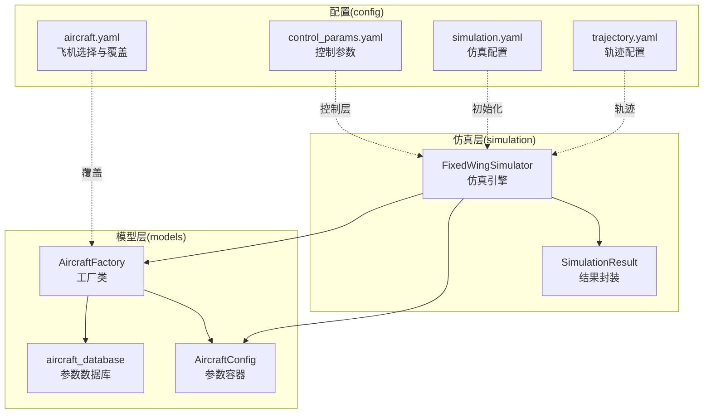
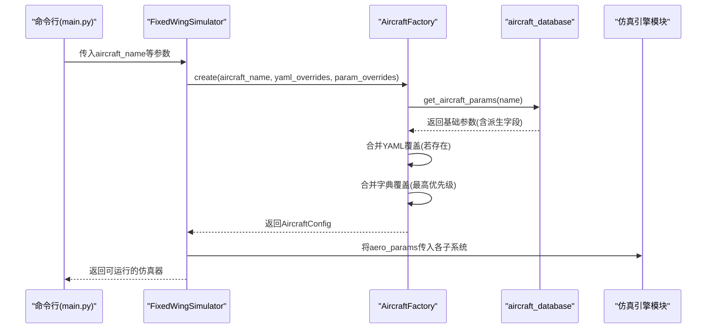
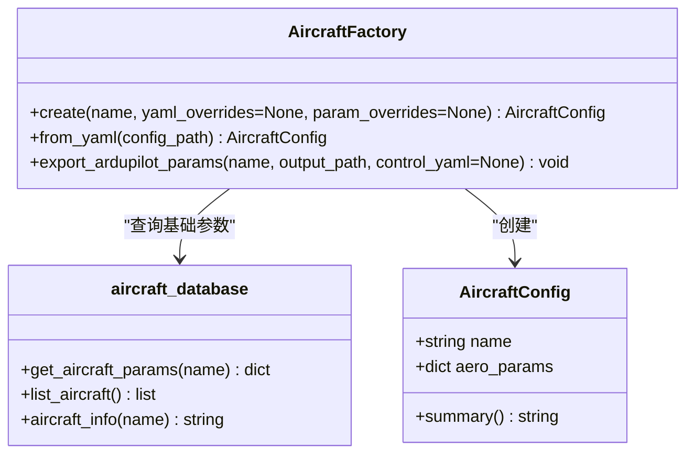
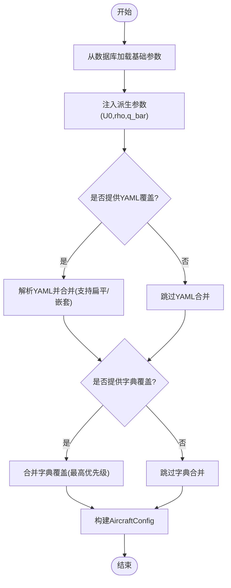
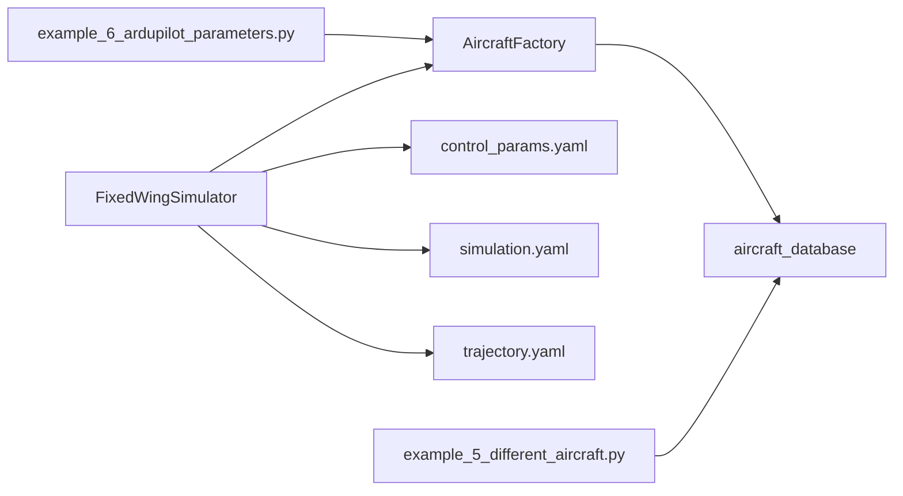

# 飞机工厂模式

<cite>
**本文引用的文件列表**
- [aircraft_factory.py](file://src/models/aircraft_factory.py)
- [aircraft_database.py](file://src/models/aircraft_database.py)
- [aircraft.yaml](file://config/aircraft.yaml)
- [control_params.yaml](file://config/control_params.yaml)
- [simulation.yaml](file://config/simulation.yaml)
- [trajectory.yaml](file://config/trajectory.yaml)
- [simulator.py](file://src/simulation/simulator.py)
- [main.py](file://main.py)
- [example_5_different_aircraft.py](file://examples/example_5_different_aircraft.py)
- [example_6_ardupilot_parameters.py](file://examples/example_6_ardupilot_parameters.py)
- [test_integration.py](file://tests/test_integration.py)
</cite>

## 目录
1. [引言](#引言)
2. [项目结构](#项目结构)
3. [核心组件](#核心组件)
4. [架构总览](#架构总览)
5. [详细组件分析](#详细组件分析)
6. [依赖关系分析](#依赖关系分析)
7. [性能考量](#性能考量)
8. [故障排查指南](#故障排查指南)
9. [结论](#结论)
10. [附录：使用示例与最佳实践](#附录使用示例与最佳实践)

## 引言
本技术文档围绕 FixedWingSimulator 中的“飞机工厂模式”展开，系统阐述工厂类在飞机参数管理中的应用与设计。工厂模式在此项目中用于统一创建与管理不同类型的飞机实例，屏蔽底层数据库访问、参数合并与派生计算细节，提供一致的参数接口给仿真引擎与控制系统使用。文档将从架构、数据流、处理逻辑、错误处理与性能等方面进行深入解析，并给出使用示例与最佳实践，帮助读者高效、安全地在仿真系统中使用工厂模式。

## 项目结构
本项目采用模块化分层组织，飞机工厂位于 models 层，负责参数来源与合并；仿真主引擎位于 simulation 层，消费工厂产出的参数；配置文件位于 config 目录，提供运行期参数覆盖与导出能力。

图表来源
- [aircraft_factory.py](file://src/models/aircraft_factory.py#L1-L136)
- [aircraft_database.py](file://src/models/aircraft_database.py#L1-L183)
- [simulator.py](file://src/simulation/simulator.py#L1-L642)
- [aircraft.yaml](file://config/aircraft.yaml#L1-L13)
- [control_params.yaml](file://config/control_params.yaml#L1-L45)
- [simulation.yaml](file://config/simulation.yaml#L1-L30)
- [trajectory.yaml](file://config/trajectory.yaml#L1-L23)

章节来源
- [aircraft_factory.py](file://src/models/aircraft_factory.py#L1-L136)
- [aircraft_database.py](file://src/models/aircraft_database.py#L1-L183)
- [simulator.py](file://src/simulation/simulator.py#L1-L642)
- [aircraft.yaml](file://config/aircraft.yaml#L1-L13)
- [control_params.yaml](file://config/control_params.yaml#L1-L45)
- [simulation.yaml](file://config/simulation.yaml#L1-L30)
- [trajectory.yaml](file://config/trajectory.yaml#L1-L23)

## 核心组件
- 工厂类 AircraftFactory：负责从数据库加载参数、应用 YAML/字典覆盖、生成 AircraftConfig 实例，并支持导出 ArduPilot 参数文件。
- 参数容器 AircraftConfig：封装名称与合并后的气动/物理参数，提供摘要信息。
- 数据库模块 aircraft_database：提供参数查询、派生参数注入与可用机型列表。
- 仿真引擎 FixedWingSimulator：在初始化阶段通过工厂创建参数，供动力学、环境、控制与规划模块使用。

章节来源
- [aircraft_factory.py](file://src/models/aircraft_factory.py#L15-L136)
- [aircraft_database.py](file://src/models/aircraft_database.py#L143-L183)
- [simulator.py](file://src/simulation/simulator.py#L130-L158)

## 架构总览
工厂模式在系统中的职责与交互如下：
- 输入：飞机名称、可选 YAML 覆盖路径、可选字典覆盖。
- 处理：从数据库获取基础参数，注入派生参数，按优先级合并覆盖项。
- 输出：AircraftConfig，包含 name 与 aero_params。
- 使用：仿真引擎在构造函数中调用工厂创建参数，随后将 aero_params 传入动力学与控制模块。

图表来源
- [main.py](file://main.py#L98-L145)
- [simulator.py](file://src/simulation/simulator.py#L130-L158)
- [aircraft_factory.py](file://src/models/aircraft_factory.py#L42-L74)
- [aircraft_database.py](file://src/models/aircraft_database.py#L143-L166)

## 详细组件分析

### 工厂类 AircraftFactory 设计与实现
- 职责边界清晰：仅负责参数来源、合并与导出，不参与仿真或控制逻辑。
- 参数合并优先级：
  - 基础参数来自数据库。
  - YAML 覆盖（支持扁平或嵌套结构）。
  - 字典覆盖（最高优先级）。
- 导出能力：支持导出 ArduPilot .param 文件，便于硬件在环或地面站配置。
- 错误处理：当 YAML 路径不存在或为空时，安全降级；数据库查询失败抛出明确异常。

图表来源
- [aircraft_factory.py](file://src/models/aircraft_factory.py#L15-L136)
- [aircraft_database.py](file://src/models/aircraft_database.py#L143-L183)

章节来源
- [aircraft_factory.py](file://src/models/aircraft_factory.py#L42-L136)
- [aircraft_database.py](file://src/models/aircraft_database.py#L143-L166)

### 参数验证与派生字段注入
- 数据库层在返回参数前，自动注入派生字段：U0（巡航速度）、rho（海平面密度）、q_bar（动态压力），确保后续动力学与气动模块无需重复计算。
- 若请求的飞机名不在数据库中，抛出 KeyError 并列出可用机型，便于用户快速定位问题。

章节来源
- [aircraft_database.py](file://src/models/aircraft_database.py#L143-L166)

### 实例化流程与缓存机制
- 实例化流程：工厂从数据库获取参数后，按顺序应用 YAML 与字典覆盖，最终生成 AircraftConfig。
- 缓存机制：当前实现未显式缓存参数字典，但工厂返回的是不可变的参数字典副本，避免外部修改影响数据库；如需提升性能，可在工厂层增加内存缓存（键为(name, overrides)组合）以避免重复合并。

章节来源
- [aircraft_factory.py](file://src/models/aircraft_factory.py#L61-L74)
- [aircraft_database.py](file://src/models/aircraft_database.py#L157-L166)

### 工厂模式优势
- 统一入口：所有参数来源与合并逻辑集中在工厂，调用方只需关心名称与覆盖项。
- 可扩展性：新增机型只需扩展数据库，工厂与调用方无需改动。
- 可维护性：参数合并规则集中，便于审计与调试；错误提示明确。
- 可测试性：工厂方法可独立单元测试，覆盖不同覆盖策略与异常分支。

章节来源
- [aircraft_factory.py](file://src/models/aircraft_factory.py#L42-L136)
- [aircraft_database.py](file://src/models/aircraft_database.py#L143-L183)

### 关键处理逻辑流程图

图表来源
- [aircraft_factory.py](file://src/models/aircraft_factory.py#L61-L74)
- [aircraft_database.py](file://src/models/aircraft_database.py#L159-L166)

## 依赖关系分析
- 固定翼仿真器在初始化时依赖工厂创建参数，随后将参数传递给动力学、环境、控制与规划模块。
- 配置文件通过工厂与仿真器协同工作：aircraft.yaml 提供飞机选择与覆盖，control_params.yaml 与 simulation.yaml 影响控制与仿真行为。
- 示例脚本展示了工厂在不同场景下的使用方式，包括直接创建与导出 ArduPilot 参数。

图表来源
- [simulator.py](file://src/simulation/simulator.py#L130-L158)
- [aircraft_factory.py](file://src/models/aircraft_factory.py#L77-L92)
- [example_5_different_aircraft.py](file://examples/example_5_different_aircraft.py#L18-L33)
- [example_6_ardupilot_parameters.py](file://examples/example_6_ardupilot_parameters.py#L20-L42)

章节来源
- [simulator.py](file://src/simulation/simulator.py#L130-L158)
- [aircraft_factory.py](file://src/models/aircraft_factory.py#L77-L92)
- [example_5_different_aircraft.py](file://examples/example_5_different_aircraft.py#L18-L33)
- [example_6_ardupilot_parameters.py](file://examples/example_6_ardupilot_parameters.py#L20-L42)

## 性能考量
- 参数合并复杂度：O(N)（N 为覆盖键数量），通常远小于参数总量，开销可忽略。
- 数据库访问：每次工厂创建都会访问数据库一次，建议在批量场景下复用已创建的参数对象，避免重复查询。
- 导出操作：ArduPilot 导出为一次性操作，适合离线批处理，不建议在实时循环中频繁调用。
- 内存占用：参数字典为浅拷贝副本，避免共享修改；如需进一步优化，可在工厂层引入缓存以减少重复合并。

[本节为通用性能讨论，不直接分析具体文件]

## 故障排查指南
- 未知飞机名：当传入的名称不在数据库中时，会抛出 KeyError 并列出可用机型。请检查拼写或确认是否在数据库中注册。
- YAML 路径无效：若 YAML 覆盖路径不存在或为空，工厂将安全降级，不会报错；请检查路径与权限。
- 参数冲突：字典覆盖优先级最高，若出现意外结果，请检查覆盖键是否存在于参数字典中。
- ArduPilot 导出失败：请确认输出目录存在且有写权限，以及控制参数 YAML 是否有效。

章节来源
- [aircraft_database.py](file://src/models/aircraft_database.py#L153-L156)
- [aircraft_factory.py](file://src/models/aircraft_factory.py#L64-L72)
- [aircraft_factory.py](file://src/models/aircraft_factory.py#L129-L133)

## 结论
工厂模式在 FixedWingSimulator 中实现了参数来源的集中化与标准化，显著提升了系统的可扩展性、可维护性与可测试性。通过清晰的优先级合并策略与完善的错误处理，工厂为仿真引擎提供了稳定可靠的参数输入。建议在实际工程中结合缓存与配置管理工具，进一步优化性能与一致性。

[本节为总结性内容，不直接分析具体文件]

## 附录：使用示例与最佳实践

### 使用示例
- 直接创建参数：通过工厂创建指定机型的参数对象，适用于单次或少量实例场景。
- 从 YAML 创建：使用 aircraft.yaml 指定机型与可选覆盖，适合批处理与配置驱动的场景。
- 导出 ArduPilot 参数：将参数导出为 .param 文件，便于地面站或硬件在环使用。

章节来源
- [aircraft_factory.py](file://src/models/aircraft_factory.py#L42-L92)
- [aircraft_factory.py](file://src/models/aircraft_factory.py#L95-L136)
- [aircraft.yaml](file://config/aircraft.yaml#L1-L13)
- [example_6_ardupilot_parameters.py](file://examples/example_6_ardupilot_parameters.py#L40-L42)

### 最佳实践
- 明确覆盖优先级：优先使用 YAML 覆盖进行批量调整，必要时使用字典覆盖进行细粒度修正。
- 参数校验：在导入 YAML 后进行参数有效性检查，确保关键字段存在且合理。
- 批量场景复用：在多实例场景中复用已创建的参数对象，减少数据库访问与合并成本。
- 文档化覆盖键：建立覆盖键清单与默认值说明，便于团队协作与审计。
- 错误处理：对外暴露清晰的异常信息，便于上层调用方快速定位问题。

[本节为通用最佳实践，不直接分析具体文件]