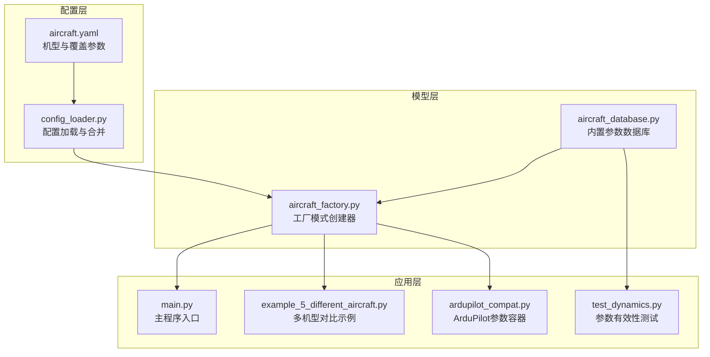
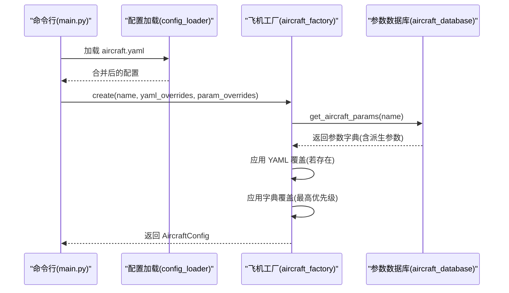
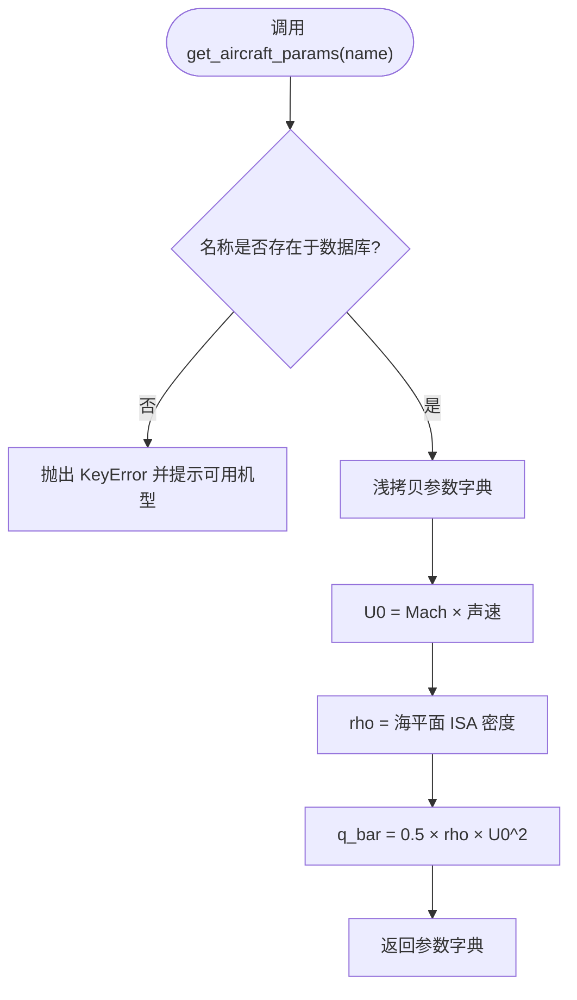
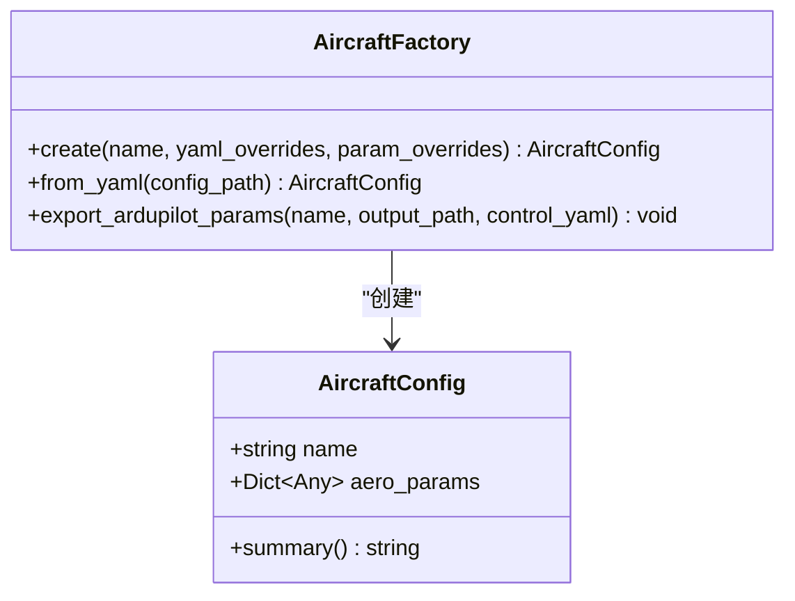
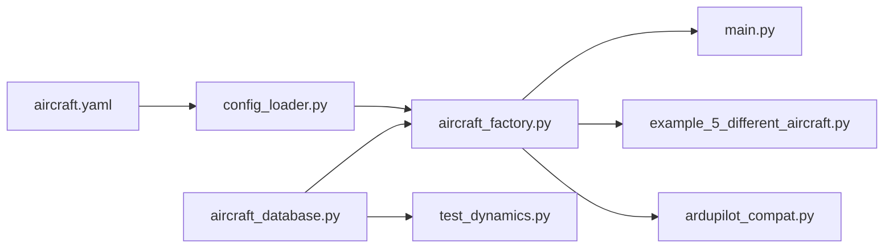

# 飞机数据库

<cite>
**本文引用的文件**
- [aircraft_database.py](file://src/models/aircraft_database.py)
- [aircraft_factory.py](file://src/models/aircraft_factory.py)
- [aircraft.yaml](file://config/aircraft.yaml)
- [config_loader.py](file://src/utils/config_loader.py)
- [example_5_different_aircraft.py](file://examples/example_5_different_aircraft.py)
- [main.py](file://main.py)
- [ardupilot_compat.py](file://src/control/ardupilot_compat.py)
- [test_dynamics.py](file://tests/test_dynamics.py)
</cite>

## 目录
1. [简介](#简介)
2. [项目结构](#项目结构)
3. [核心组件](#核心组件)
4. [架构总览](#架构总览)
5. [详细组件分析](#详细组件分析)
6. [依赖关系分析](#依赖关系分析)
7. [性能考虑](#性能考虑)
8. [故障排查指南](#故障排查指南)
9. [结论](#结论)
10. [附录](#附录)

## 简介
本文件为 FixedWingSimulator 的飞机数据库系统提供技术文档，重点涵盖：
- 飞机工厂模式的设计理念与实现方式：如何通过配置文件动态创建不同类型的飞机实例
- 飞机参数数据库的结构与组织：气动参数、质量惯性参数、控制面参数等的定义与取值范围
- 配置文件格式与参数验证机制：确保输入参数的合理性与一致性
- 内置 7 种真实飞机配置（TB2、Predator 等）的特点与适用场景
- 自定义飞机配置的方法与最佳实践
- 参数调整对仿真结果的影响分析与调优建议

## 项目结构
飞机数据库系统位于 src/models 目录中，配合 config 目录中的配置文件与工具模块共同工作。关键文件与职责如下：
- src/models/aircraft_database.py：内置飞机参数数据库与派生参数注入
- src/models/aircraft_factory.py：基于数据库与配置文件的飞机实例工厂
- config/aircraft.yaml：选择机型与可选覆盖参数的配置文件
- src/utils/config_loader.py：通用配置加载与合并工具
- examples/example_5_different_aircraft.py：演示多机型对比与线性分析
- src/control/ardupilot_compat.py：ArduPilot 参数容器与验证
- tests/test_dynamics.py：参数有效性与修剪计算测试

图表来源
- [aircraft_database.py](file://src/models/aircraft_database.py#L1-L183)
- [aircraft_factory.py](file://src/models/aircraft_factory.py#L1-L136)
- [aircraft.yaml](file://config/aircraft.yaml#L1-L13)
- [config_loader.py](file://src/utils/config_loader.py#L1-L82)
- [main.py](file://main.py#L1-L145)
- [example_5_different_aircraft.py](file://examples/example_5_different_aircraft.py#L1-L65)
- [ardupilot_compat.py](file://src/control/ardupilot_compat.py#L1-L130)
- [test_dynamics.py](file://tests/test_dynamics.py#L317-L335)

章节来源
- [aircraft_database.py](file://src/models/aircraft_database.py#L1-L183)
- [aircraft_factory.py](file://src/models/aircraft_factory.py#L1-L136)
- [aircraft.yaml](file://config/aircraft.yaml#L1-L13)
- [config_loader.py](file://src/utils/config_loader.py#L1-L82)
- [main.py](file://main.py#L1-L145)
- [example_5_different_aircraft.py](file://examples/example_5_different_aircraft.py#L1-L65)
- [ardupilot_compat.py](file://src/control/ardupilot_compat.py#L1-L130)
- [test_dynamics.py](file://tests/test_dynamics.py#L317-L335)

## 核心组件
- 飞机参数数据库（aircraft_database）
  - 提供 7 种真实飞机的完整参数集合，包含几何与质量惯性、气动导数、派生参数等
  - 提供公共访问接口，返回完整参数字典，并自动注入派生参数（如参考速度、密度、动压）
- 飞机工厂（aircraft_factory）
  - 基于数据库参数创建 AircraftConfig 实例
  - 支持从 YAML 文件与字典进行参数覆盖，优先级为：数据库默认 < YAML 覆盖 < 字典覆盖
  - 提供 ArduPilot 参数导出功能，便于与飞控系统对接
- 配置加载（config_loader）
  - 统一加载与合并各子系统的配置文件，提供默认值与深度合并策略
- 示例与测试
  - 多机型对比示例展示参数差异对线性模态的影响
  - 动力学测试验证所有机型在仿真中的可用性

章节来源
- [aircraft_database.py](file://src/models/aircraft_database.py#L143-L182)
- [aircraft_factory.py](file://src/models/aircraft_factory.py#L42-L136)
- [config_loader.py](file://src/utils/config_loader.py#L59-L82)
- [example_5_different_aircraft.py](file://examples/example_5_different_aircraft.py#L1-L65)
- [test_dynamics.py](file://tests/test_dynamics.py#L326-L335)

## 架构总览
飞机数据库系统采用“数据库 + 工厂 + 配置”的分层架构：
- 数据库层：集中存储飞机参数，提供统一访问接口
- 工厂层：负责参数合并与实例化，支持外部覆盖
- 配置层：提供 YAML 配置文件与加载工具，支持默认值与嵌套合并
- 应用层：示例与主程序消费工厂输出，执行仿真或分析

图表来源
- [main.py](file://main.py#L98-L122)
- [config_loader.py](file://src/utils/config_loader.py#L68-L70)
- [aircraft_factory.py](file://src/models/aircraft_factory.py#L42-L74)
- [aircraft_database.py](file://src/models/aircraft_database.py#L143-L166)

## 详细组件分析

### 飞机参数数据库（aircraft_database）
- 数据结构
  - 每个机型包含：识别信息（名称、厂商、国家）、几何与质量惯性（质量、机翼面积、平均弦长、翼展、惯性矩等）、飞行马赫数、气动导数（纵向与横向/方向）、派生参数（参考速度、空气密度、动压）
- 关键函数
  - get_aircraft_params(name)：返回完整参数字典；若名称不存在抛出异常；同时注入派生参数
  - list_aircraft()：列出所有可用机型
  - aircraft_info(name)：生成人类可读的机型摘要
- 派生参数注入
  - 参考速度 U0 = 马赫数 × 声速
  - 空气密度 rho = 海平面 ISA 密度
  - 动压 q_bar = 0.5 × rho × U0^2

图表来源
- [aircraft_database.py](file://src/models/aircraft_database.py#L143-L166)

章节来源
- [aircraft_database.py](file://src/models/aircraft_database.py#L1-L183)

### 飞机工厂（aircraft_factory）
- 类与数据结构
  - AircraftConfig：封装名称与合并后的气动参数，提供摘要字符串
  - AircraftFactory：静态工厂方法，支持从数据库、YAML 文件与字典创建配置
- 创建流程
  - 从数据库获取基础参数
  - 读取 YAML 覆盖（支持平铺或嵌套结构），仅保留数据库中存在的键
  - 应用字典覆盖（最高优先级）
  - 返回 AircraftConfig 实例
- ArduPilot 参数导出
  - 将飞机物理参数与可选控制参数导出为 ArduPilot .param 文件格式

图表来源
- [aircraft_factory.py](file://src/models/aircraft_factory.py#L15-L37)
- [aircraft_factory.py](file://src/models/aircraft_factory.py#L39-L136)

章节来源
- [aircraft_factory.py](file://src/models/aircraft_factory.py#L1-L136)

### 配置文件格式与参数验证
- 飞机配置文件（aircraft.yaml）
  - 必填项：aircraft_name
  - 可选项：overrides（平铺或嵌套均可），仅覆盖数据库中存在的键
- 配置加载与合并（config_loader）
  - 提供默认值模板，支持深度合并，避免缺失键导致的错误
- 参数验证（ArduPilot 参数容器）
  - ArdupilotParams 提供基本范围检查，打印越界警告并返回校验结果
  - 默认值适合中型固定翼无人机（如 TB2 级别）

章节来源
- [aircraft.yaml](file://config/aircraft.yaml#L1-L13)
- [config_loader.py](file://src/utils/config_loader.py#L10-L56)
- [ardupilot_compat.py](file://src/control/ardupilot_compat.py#L104-L129)

### 内置 7 种真实飞机配置
- TB2（Baykar，土耳其）
  - 中型无人机，适配中等翼载与典型气动特性
- Anka（TUSAŞ，土耳其）
  - 较大质量与翼展，适合高升阻比与长续航任务
- Aksungur（TUSAŞ，土耳其）
  - 大型无人机，具有更大的机翼面积与惯性矩
- Karayel（Vestel，土耳其）
  - 较小质量与翼展，适合敏捷性与低空作业
- Predator（General Atomics，美国）
  - 典型中型长航时无人机，气动特性平衡良好
- Heron MK1/MK2（IAI，以色列）
  - 高空长航时设计，气动与质量参数偏向高空性能

这些机型均已在数据库中提供完整参数，并通过派生参数注入以适配动力学引擎。

章节来源
- [aircraft_database.py](file://src/models/aircraft_database.py#L29-L133)

### 多机型对比与线性分析
- 示例脚本通过遍历所有机型，运行 4-DOF 线性分析，比较短周期与长周期模态
- 结果可用于评估不同机型在相同扰动下的稳定性与响应特性

章节来源
- [example_5_different_aircraft.py](file://examples/example_5_different_aircraft.py#L1-L65)

### 参数调整对仿真结果的影响与调优建议
- 质量与惯性
  - 质量增加会降低加速度与响应速度，影响短周期频率与阻尼
  - 惯性矩变化影响滚转与偏航模态，需与气动导数匹配
- 气动参数
  - 升力曲线斜率与俯仰阻尼影响短周期稳定性
  - 侧向导数影响横滚与偏航耦合，需关注静稳定性
- 控制参数
  - ArduPilot 参数的 P/I/D 权衡影响姿态控制带宽与稳态误差
  - 限幅参数（如俯仰/滚转限幅）决定最大机动能力与安全边界
- 建议
  - 从默认参数开始，逐步微调，观察线性模态与非线性仿真结果
  - 对于高马赫/高攻角工况，适当降低外环增益，提高阻尼
  - 确保控制参数范围检查通过，避免越界引发不稳定

章节来源
- [ardupilot_compat.py](file://src/control/ardupilot_compat.py#L104-L129)
- [test_dynamics.py](file://tests/test_dynamics.py#L326-L335)

## 依赖关系分析
- 模块内依赖
  - aircraft_factory 依赖 aircraft_database 的参数与名称列表
  - main.py 与示例脚本依赖工厂与数据库提供的参数
  - 配置加载器为工厂提供 YAML 覆盖源
- 外部依赖
  - YAML 解析用于配置文件读取
  - 数学库用于派生参数计算

图表来源
- [aircraft_database.py](file://src/models/aircraft_database.py#L12-L13)
- [aircraft_factory.py](file://src/models/aircraft_factory.py#L12-L12)
- [aircraft.yaml](file://config/aircraft.yaml#L1-L13)
- [config_loader.py](file://src/utils/config_loader.py#L68-L70)
- [main.py](file://main.py#L28-L29)
- [example_5_different_aircraft.py](file://examples/example_5_different_aircraft.py#L18-L19)
- [test_dynamics.py](file://tests/test_dynamics.py#L328-L330)
- [ardupilot_compat.py](file://src/control/ardupilot_compat.py#L1-L130)

章节来源
- [aircraft_database.py](file://src/models/aircraft_database.py#L1-L183)
- [aircraft_factory.py](file://src/models/aircraft_factory.py#L1-L136)
- [aircraft.yaml](file://config/aircraft.yaml#L1-L13)
- [config_loader.py](file://src/utils/config_loader.py#L1-L82)
- [main.py](file://main.py#L1-L145)
- [example_5_different_aircraft.py](file://examples/example_5_different_aircraft.py#L1-L65)
- [ardupilot_compat.py](file://src/control/ardupilot_compat.py#L1-L130)
- [test_dynamics.py](file://tests/test_dynamics.py#L317-L335)

## 性能考虑
- 参数访问与派生参数注入为 O(1) 操作，开销极低
- 工厂覆盖合并采用字典更新，时间复杂度与覆盖键数量线性相关
- 建议在批量运行时复用已创建的配置对象，减少重复解析与合并

## 故障排查指南
- 机型名称错误
  - 现象：调用 get_aircraft_params 抛出 KeyError
  - 处理：检查名称大小写与拼写，使用 list_aircraft 获取可用列表
- YAML 覆盖无效
  - 现象：覆盖未生效
  - 处理：确认键名与数据库一致，支持平铺或嵌套结构
- 控制参数越界
  - 现象：ArduPilot 参数校验失败并打印警告
  - 处理：调整参数至允许范围内，参考默认值与范围注释
- 修剪计算失败
  - 现象：非线性模型无法计算修剪点
  - 处理：检查气动参数与初始条件，确保 U0 为正值且参数合理

章节来源
- [aircraft_database.py](file://src/models/aircraft_database.py#L153-L156)
- [aircraft_factory.py](file://src/models/aircraft_factory.py#L63-L74)
- [ardupilot_compat.py](file://src/control/ardupilot_compat.py#L104-L129)
- [test_dynamics.py](file://tests/test_dynamics.py#L326-L335)

## 结论
飞机数据库系统通过工厂模式实现了参数的集中管理与灵活覆盖，结合配置文件与默认值合并策略，既保证了易用性，又确保了参数的一致性与可追溯性。内置 7 种真实飞机配置为不同任务场景提供了参考基准，配合 ArduPilot 参数导出与验证机制，可无缝对接飞控系统。建议在实际工程中遵循参数范围与默认值，逐步调优以获得稳定可靠的仿真结果。

## 附录
- 自定义飞机配置步骤
  - 在 config/aircraft.yaml 中设置 aircraft_name 与可选 overrides
  - 使用 AircraftFactory.create 或 from_yaml 创建配置
  - 如需飞控对接，使用 export_ardupilot_params 导出 .param 文件
- 最佳实践
  - 保持参数命名与数据库一致
  - 从小幅度覆盖开始，逐步验证线性与非线性响应
  - 使用默认参数作为起点，避免大幅偏离