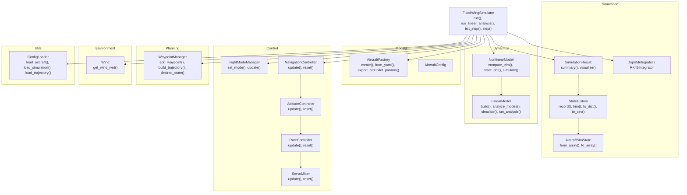
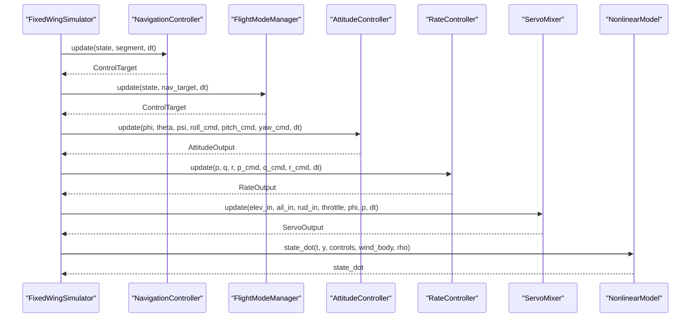
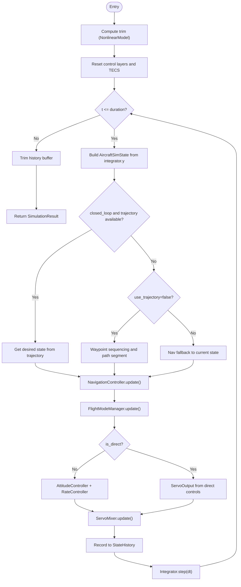
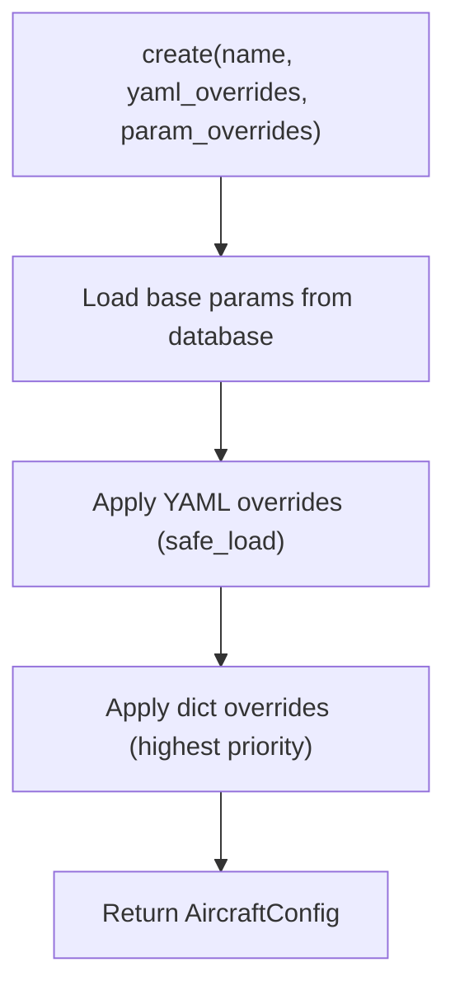
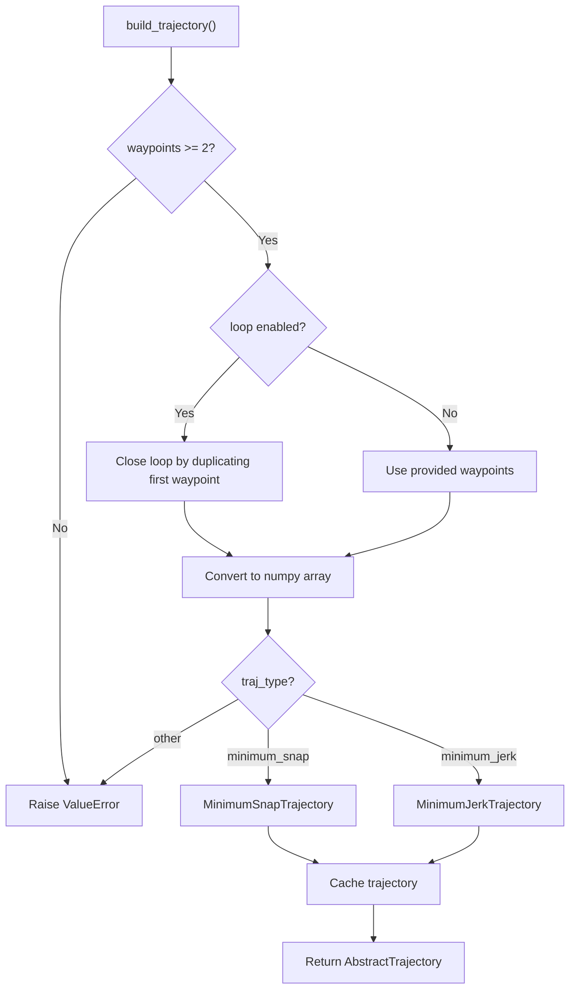
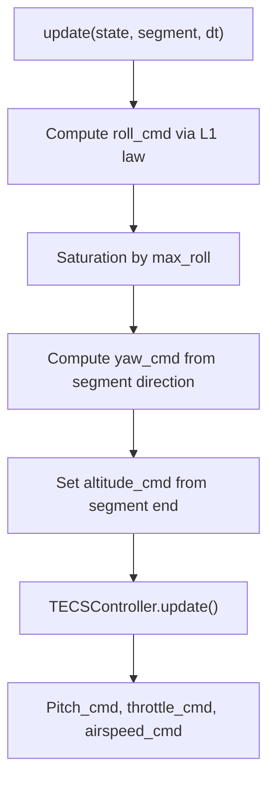
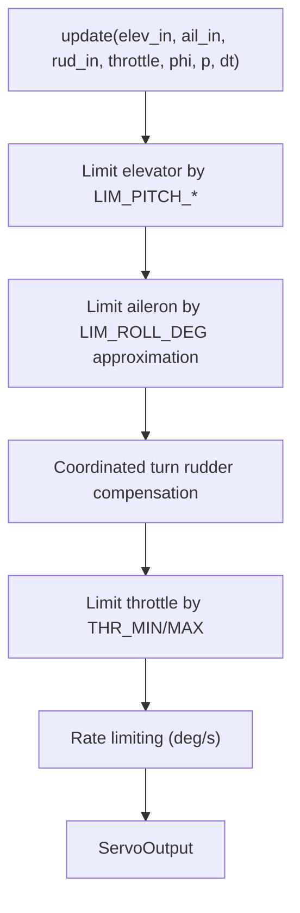
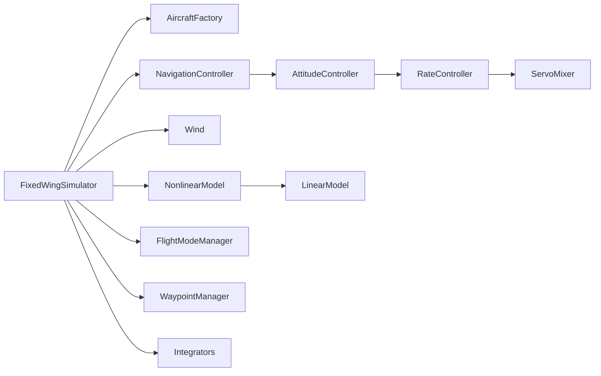

# API Reference

<cite>
**Referenced Files in This Document**
- [src/simulation/simulator.py](file://src/simulation/simulator.py)
- [src/models/aircraft_factory.py](file://src/models/aircraft_factory.py)
- [src/simulation/state_manager.py](file://src/simulation/state_manager.py)
- [src/simulation/integrator.py](file://src/simulation/integrator.py)
- [src/dynamics/linear_model.py](file://src/dynamics/linear_model.py)
- [src/dynamics/nonlinear_model.py](file://src/dynamics/nonlinear_model.py)
- [src/control/flight_mode_manager.py](file://src/control/flight_mode_manager.py)
- [src/control/navigation_controller.py](file://src/control/navigation_controller.py)
- [src/control/attitude_controller.py](file://src/control/attitude_controller.py)
- [src/control/rate_controller.py](file://src/control/rate_controller.py)
- [src/control/servo_mixer.py](file://src/control/servo_mixer.py)
- [src/planning/waypoint_manager.py](file://src/planning/waypoint_manager.py)
- [src/utils/config_loader.py](file://src/utils/config_loader.py)
- [src/environment/wind_model.py](file://src/environment/wind_model.py)
</cite>

## Table of Contents
1. [Introduction](#introduction)
2. [Project Structure](#project-structure)
3. [Core Components](#core-components)
4. [Architecture Overview](#architecture-overview)
5. [Detailed Component Analysis](#detailed-component-analysis)
6. [Dependency Analysis](#dependency-analysis)
7. [Performance Considerations](#performance-considerations)
8. [Troubleshooting Guide](#troubleshooting-guide)
9. [Conclusion](#conclusion)
10. [Appendices](#appendices)

## Introduction
This API reference documents the public interfaces of the FixedWingSimulator project. It covers the main simulation engine, aircraft configuration factory, result containers, numerical integrators, dynamics models, control layers, planning utilities, environment models, and configuration loaders. The documentation includes method signatures, parameters, return values, configuration options, validation rules, and usage guidance. Versioning, backward compatibility, and deprecation notices are addressed where applicable.

## Project Structure
The project is organized into modules grouped by domain:
- Simulation orchestration and result containers
- Aircraft configuration and database integration
- Dynamics (linear and nonlinear)
- Control layers (navigation, attitude, rate, servo mixing)
- Planning (waypoints and trajectory generation)
- Environment (wind and atmosphere)
- Utilities (configuration loader, math helpers)
- Visualization (plotting and animation)

**Diagram sources**
- [src/simulation/simulator.py](file://src/simulation/simulator.py#L115-L642)
- [src/models/aircraft_factory.py](file://src/models/aircraft_factory.py#L15-L136)
- [src/simulation/state_manager.py](file://src/simulation/state_manager.py#L16-L193)
- [src/simulation/integrator.py](file://src/simulation/integrator.py#L17-L108)
- [src/dynamics/nonlinear_model.py](file://src/dynamics/nonlinear_model.py#L104-L386)
- [src/dynamics/linear_model.py](file://src/dynamics/linear_model.py#L107-L319)
- [src/control/flight_mode_manager.py](file://src/control/flight_mode_manager.py#L115-L298)
- [src/control/navigation_controller.py](file://src/control/navigation_controller.py#L45-L293)
- [src/control/attitude_controller.py](file://src/control/attitude_controller.py#L33-L134)
- [src/control/rate_controller.py](file://src/control/rate_controller.py#L32-L109)
- [src/control/servo_mixer.py](file://src/control/servo_mixer.py#L54-L153)
- [src/planning/waypoint_manager.py](file://src/planning/waypoint_manager.py#L20-L208)
- [src/utils/config_loader.py](file://src/utils/config_loader.py#L59-L82)
- [src/environment/wind_model.py](file://src/environment/wind_model.py#L18-L113)

**Section sources**
- [src/simulation/simulator.py](file://src/simulation/simulator.py#L1-L642)
- [src/models/aircraft_factory.py](file://src/models/aircraft_factory.py#L1-L136)
- [src/simulation/state_manager.py](file://src/simulation/state_manager.py#L1-L193)
- [src/simulation/integrator.py](file://src/simulation/integrator.py#L1-L108)
- [src/dynamics/linear_model.py](file://src/dynamics/linear_model.py#L1-L319)
- [src/dynamics/nonlinear_model.py](file://src/dynamics/nonlinear_model.py#L1-L386)
- [src/control/flight_mode_manager.py](file://src/control/flight_mode_manager.py#L1-L298)
- [src/control/navigation_controller.py](file://src/control/navigation_controller.py#L1-L293)
- [src/control/attitude_controller.py](file://src/control/attitude_controller.py#L1-L134)
- [src/control/rate_controller.py](file://src/control/rate_controller.py#L1-L109)
- [src/control/servo_mixer.py](file://src/control/servo_mixer.py#L1-L153)
- [src/planning/waypoint_manager.py](file://src/planning/waypoint_manager.py#L1-L208)
- [src/utils/config_loader.py](file://src/utils/config_loader.py#L1-L82)
- [src/environment/wind_model.py](file://src/environment/wind_model.py#L1-L113)

## Core Components
This section documents the primary public classes and their APIs.

### FixedWingSimulator
Main simulation orchestrator integrating aircraft, environment, dynamics, control, planning, and simulation modules.

- Constructor parameters
  - aircraft_name: str, default "TB2"; must be in supported aircraft names
  - config_dir: str, default None; resolves to project config directory if None
  - dt: float, default 0.01; simulation time step (s)
  - duration: float, default 30.0; total simulation duration (s)
  - initial_mode: str, default "AUTO"; FlightMode enum string
  - wind_type: str, default "NONE"; one of "NONE", "FIXED", "SINE", "RANDOMSINE"
  - traj_type: str, default "minimum_snap"; trajectory type

- Public methods
  - run(closed_loop: bool = True, use_trajectory: bool = True, wp_switch_dist: float = 60.0, loop_circuit: bool = False) -> SimulationResult
    - Executes closed-loop or open-loop simulation
    - Validates aircraft name and initializes environment, control, planning, and dynamics
    - Supports trajectory tracking or simple waypoint sequencing
    - Returns SimulationResult containing history, trim, and metadata
  - run_linear_analysis(pulses: Optional[List[Dict]] = None, duration: Optional[float] = None) -> LinearAnalysisResult
    - Performs 4-DOF linear (open-loop) analysis
    - Backward-compatible alias for project-1 style linear analysis
  - init_step() -> AircraftSimState
    - Initializes step-by-step simulation; must be called before first step()
  - step(dt: Optional[float] = None) -> AircraftSimState
    - Advances simulation by one step; requires prior init_step()

- Validation and behavior
  - Unknown aircraft_name raises ValueError
  - Wind type validated against supported set
  - Trajectory builder requires at least two waypoints; otherwise raises ValueError
  - Integration errors are caught and logged; simulation stops at first failure

**Section sources**
- [src/simulation/simulator.py](file://src/simulation/simulator.py#L115-L642)

### SimulationResult
Container for a complete simulation run with convenience methods.

- Fields
  - history: StateHistory
  - trim: TrimResult
  - uav_name: str
  - closed_loop: bool

- Methods
  - summary() -> str
    - Returns formatted summary string with trim speed, duration, mode, final altitude, final speed, and track
  - visualize(show: bool = True) -> None
    - Attempts to import visualization modules and plots 2D/3D results; prints warning if unavailable

**Section sources**
- [src/simulation/simulator.py](file://src/simulation/simulator.py#L59-L110)

### AircraftFactory and AircraftConfig
Factory for building aircraft configurations with parameter merging and validation.

- AircraftConfig
  - name: str
  - aero_params: Dict[str, Any]
  - summary() -> str
    - Returns formatted aircraft summary including mass, wing area/span/chord, and trim speed

- AircraftFactory
  - create(name: str, yaml_overrides: Optional[str] = None, param_overrides: Optional[Dict[str, Any]] = None) -> AircraftConfig
    - Loads base parameters from database and merges YAML and dict overrides
    - Supports nested overrides in YAML
  - from_yaml(config_path: str) -> AircraftConfig
    - Creates configuration from aircraft.yaml with aircraft_name and optional overrides
  - export_ardupilot_params(name: str, output_path: str, control_yaml: Optional[str] = None) -> None
    - Exports aircraft and optional control parameters to ArduPilot .param format

**Section sources**
- [src/models/aircraft_factory.py](file://src/models/aircraft_factory.py#L15-L136)

### StateHistory and AircraftSimState
State containers for efficient recording and derived quantities.

- AircraftSimState
  - Fields: u, v, w, p, q, r, phi, theta, psi, x_north, x_east, x_down, alpha, beta, airspeed, altitude
  - from_array(arr: np.ndarray) -> AircraftSimState
  - to_array() -> np.ndarray
  - Properties: pos_ned, vel_body, omega, euler

- StateHistory
  - record(t: float, state: AircraftSimState, elevator: float = 0.0, aileron: float = 0.0, rudder: float = 0.0, throttle: float = 0.0, des_pos: Optional[np.ndarray] = None) -> None
  - trim() -> None
  - get(key: str) -> np.ndarray
  - to_dict() -> Dict[str, np.ndarray]
  - to_csv(path: str) -> None

**Section sources**
- [src/simulation/state_manager.py](file://src/simulation/state_manager.py#L16-L193)

### Integrators
Numerical integrators for real-time and batch simulations.

- Dopri5Integrator
  - step(dt: float) -> np.ndarray
  - t: float
  - y: np.ndarray
  - reset(y0: np.ndarray, t0: float = 0.0) -> None
- RK45Integrator
  - integrate(f: Callable, y0: np.ndarray, t_span: tuple, t_eval: Optional[np.ndarray] = None, max_step: float = 0.1) -> scipy OdeResult

**Section sources**
- [src/simulation/integrator.py](file://src/simulation/integrator.py#L17-L108)

### Dynamics Models
- NonlinearModel
  - compute_trim() -> TrimResult
  - state_dot(t: float, state: np.ndarray, controls: Controls, wind_body: Optional[np.ndarray] = None, rho: float = 1.225) -> np.ndarray
  - simulate(pulses: List[Dict], duration: float = 10.0, n_points: int = 500, wind_func=None) -> NonlinearSimResult
  - make_ode_func(get_controls, get_wind=None, get_rho=None) -> Callable
- LinearModel
  - build() -> Tuple[np.ndarray, np.ndarray, float]
  - analyze_modes(A: np.ndarray = None) -> List[ModeResult]
  - simulate(pulses: List[Dict], duration: float = 10.0, n_points: int = 500, A: np.ndarray = None, B: np.ndarray = None) -> Tuple[np.ndarray, np.ndarray, np.ndarray]
  - run_analysis(pulses: List[Dict], duration: float = 10.0, uav_name: str = "UAV") -> LinearAnalysisResult

**Section sources**
- [src/dynamics/nonlinear_model.py](file://src/dynamics/nonlinear_model.py#L104-L386)
- [src/dynamics/linear_model.py](file://src/dynamics/linear_model.py#L107-L319)

### Control Layers
- FlightModeManager
  - set_mode(new_mode: FlightMode) -> None
  - set_mode_str(mode_str: str) -> None
  - update(state: AircraftState, nav_target: Optional[ControlTarget] = None, dt: float = 0.1) -> ControlTarget
- NavigationController
  - update(state: AircraftState, segment: PathSegment, dt: float = 0.1) -> ControlTarget
  - reset(state: AircraftState = None) -> None
- AttitudeController
  - update(phi: float, theta: float, psi: float, roll_cmd: float, pitch_cmd: float, yaw_cmd: float, dt: float = None) -> AttitudeOutput
  - reload_gains(ap_params: ArdupilotParams) -> None
  - reset() -> None
- RateController
  - update(p: float, q: float, r: float, p_cmd: float, q_cmd: float, r_cmd: float, dt: float = None) -> RateOutput
  - reload_gains(ap_params: ArdupilotParams) -> None
  - reset() -> None
- ServoMixer
  - update(elev_in: float, ail_in: float, rud_in: float, throttle: float, phi: float, p: float, dt: float = None) -> ServoOutput
  - reset() -> None

**Section sources**
- [src/control/flight_mode_manager.py](file://src/control/flight_mode_manager.py#L115-L298)
- [src/control/navigation_controller.py](file://src/control/navigation_controller.py#L45-L293)
- [src/control/attitude_controller.py](file://src/control/attitude_controller.py#L33-L134)
- [src/control/rate_controller.py](file://src/control/rate_controller.py#L32-L109)
- [src/control/servo_mixer.py](file://src/control/servo_mixer.py#L54-L153)

### Planning
- WaypointManager
  - add_waypoint(north: float, east: float, alt_m: float) -> None
  - add_waypoints_ned(wps: np.ndarray) -> None
  - clear_waypoints() -> None
  - load_from_yaml(path: str) -> None
  - save_to_yaml(path: str) -> None
  - build_trajectory() -> AbstractTrajectory
  - trajectory -> AbstractTrajectory
  - total_duration -> float
  - get_active_segment(t: float) -> Tuple[np.ndarray, np.ndarray, float]
  - desired_state(t: float) -> TrajectoryState

**Section sources**
- [src/planning/waypoint_manager.py](file://src/planning/waypoint_manager.py#L20-L208)

### Environment
- Wind
  - get_wind_ned(t: float) -> np.ndarray
  - __init__(wind_type: str = "NONE", speed: float = 5.0, direction_deg: float = 270.0, seed: int = 42)

**Section sources**
- [src/environment/wind_model.py](file://src/environment/wind_model.py#L18-L113)

### Utilities
- ConfigLoader
  - load_aircraft() -> Dict[str, Any]
  - load_control() -> Dict[str, Any]
  - load_simulation() -> Dict[str, Any]
  - load_trajectory() -> Dict[str, Any]

**Section sources**
- [src/utils/config_loader.py](file://src/utils/config_loader.py#L59-L82)

## Architecture Overview
The FixedWingSimulator orchestrates a five-layer control hierarchy:
- NavigationController computes ControlTarget from path segments
- FlightModeManager selects appropriate ControlTarget based on mode
- AttitudeController converts desired angles to desired angular rates
- RateController computes surface deflection increments
- ServoMixer applies limits, coordinated turn compensation, and rate limiting

**Diagram sources**
- [src/simulation/simulator.py](file://src/simulation/simulator.py#L427-L540)
- [src/control/navigation_controller.py](file://src/control/navigation_controller.py#L134-L202)
- [src/control/flight_mode_manager.py](file://src/control/flight_mode_manager.py#L173-L211)
- [src/control/attitude_controller.py](file://src/control/attitude_controller.py#L81-L122)
- [src/control/rate_controller.py](file://src/control/rate_controller.py#L68-L98)
- [src/control/servo_mixer.py](file://src/control/servo_mixer.py#L80-L149)
- [src/dynamics/nonlinear_model.py](file://src/dynamics/nonlinear_model.py#L160-L255)

## Detailed Component Analysis

### FixedWingSimulator.run
End-to-end simulation loop with closed-loop control and optional trajectory tracking.

**Diagram sources**
- [src/simulation/simulator.py](file://src/simulation/simulator.py#L239-L567)

**Section sources**
- [src/simulation/simulator.py](file://src/simulation/simulator.py#L239-L567)

### AircraftFactory.create
Parameter merging and validation pipeline.

**Diagram sources**
- [src/models/aircraft_factory.py](file://src/models/aircraft_factory.py#L42-L74)

**Section sources**
- [src/models/aircraft_factory.py](file://src/models/aircraft_factory.py#L42-L74)

### WaypointManager.build_trajectory
Trajectory construction with caching and validation.

**Diagram sources**
- [src/planning/waypoint_manager.py](file://src/planning/waypoint_manager.py#L127-L160)

**Section sources**
- [src/planning/waypoint_manager.py](file://src/planning/waypoint_manager.py#L127-L160)

### NavigationController.update
L1 navigation law combined with TECS altitude and airspeed control.

**Diagram sources**
- [src/control/navigation_controller.py](file://src/control/navigation_controller.py#L134-L202)

**Section sources**
- [src/control/navigation_controller.py](file://src/control/navigation_controller.py#L134-L202)

### ServoMixer.update
Actuator allocation with amplitude limits, coordinated turn compensation, and rate limiting.

**Diagram sources**
- [src/control/servo_mixer.py](file://src/control/servo_mixer.py#L80-L149)

**Section sources**
- [src/control/servo_mixer.py](file://src/control/servo_mixer.py#L80-L149)

## Dependency Analysis
Key internal dependencies and coupling:
- FixedWingSimulator depends on AircraftFactory, NonlinearModel, Wind, NavigationController, FlightModeManager, WaypointManager, and integrators
- Control layers depend on ArduPilot parameter sets and math utilities
- Dynamics models depend on aerodynamics and math utilities
- Planning module depends on trajectory implementations
- Environment module depends on math utilities

**Diagram sources**
- [src/simulation/simulator.py](file://src/simulation/simulator.py#L33-L51)
- [src/control/navigation_controller.py](file://src/control/navigation_controller.py#L20-L22)
- [src/dynamics/nonlinear_model.py](file://src/dynamics/nonlinear_model.py#L27-L28)

**Section sources**
- [src/simulation/simulator.py](file://src/simulation/simulator.py#L33-L51)
- [src/control/navigation_controller.py](file://src/control/navigation_controller.py#L20-L22)
- [src/dynamics/nonlinear_model.py](file://src/dynamics/nonlinear_model.py#L27-L28)

## Performance Considerations
- Integration tolerances: default rtol/atol are 1e-6; adjust via integrator constructors for accuracy/performance trade-offs
- Step size: dt influences numerical stability and computational cost; smaller dt improves accuracy but increases runtime
- Trajectory caching: WaypointManager caches trajectories; clear cache when waypoints change to avoid stale paths
- Control layer resets: Call reset() on control layers during mode transitions to avoid integrator windup
- Visualization overhead: SimulationResult.visualize imports visualization modules; disable in headless environments

## Troubleshooting Guide
Common issues and resolutions:
- Unknown aircraft name
  - Symptom: ValueError on simulator initialization
  - Resolution: Use supported aircraft names from database
- Trajectory build failures
  - Symptom: ValueError requiring at least two waypoints
  - Resolution: Add waypoints via WaypointManager or load from YAML
- Integration errors
  - Symptom: Runtime error printed and simulation halts
  - Resolution: Reduce dt, check control limits, validate wind and density models
- Wind type validation
  - Symptom: ValueError for invalid wind_type
  - Resolution: Use supported types: "NONE", "FIXED", "SINE", "RANDOMSINE"
- Parameter validation
  - Symptom: ArduPilot parameter validation failure
  - Resolution: Ensure control_params.yaml contains valid entries and pass validate()

**Section sources**
- [src/simulation/simulator.py](file://src/simulation/simulator.py#L140-L141)
- [src/planning/waypoint_manager.py](file://src/planning/waypoint_manager.py#L139-L140)
- [src/environment/wind_model.py](file://src/environment/wind_model.py#L40-L41)

## Conclusion
This API reference provides a comprehensive overview of the FixedWingSimulator’s public interfaces across simulation, modeling, control, dynamics, environment, planning, visualization, and utility modules. It highlights method signatures, parameters, return values, configuration options, validation rules, and integration patterns. Adhering to the documented parameters and validation rules ensures reliable simulations and smooth integration with external systems.

## Appendices

### API Versioning and Compatibility
- run_linear_analysis
  - Purpose: Backward-compatible linear analysis
  - Behavior: Mirrors project-1 style linear simulation
  - Notes: Maintained for legacy compatibility; new development should prefer trajectory-based closed-loop runs
- Deprecation notices
  - No explicit deprecations observed in the referenced modules
  - Maintain backward compatibility for run_linear_analysis and constructor defaults

**Section sources**
- [src/simulation/simulator.py](file://src/simulation/simulator.py#L571-L596)

### Configuration Options Summary
- Simulation
  - dt, duration, integrator, rtol, atol, initial_position, initial_heading_deg, initial_mode, wind_type, wind_speed, wind_direction_deg, log_enabled, log_dir
- Trajectory
  - type, average_speed, yaw_mode, waypoints, loop
- Aircraft
  - aircraft_name, overrides

**Section sources**
- [src/utils/config_loader.py](file://src/utils/config_loader.py#L10-L37)