# Control API

<cite>
**Referenced Files in This Document**
- [src/control/__init__.py](file://src/control/__init__.py)
- [src/control/ardupilot_compat.py](file://src/control/ardupilot_compat.py)
- [src/control/pid_controller.py](file://src/control/pid_controller.py)
- [src/control/flight_mode_manager.py](file://src/control/flight_mode_manager.py)
- [src/control/navigation_controller.py](file://src/control/navigation_controller.py)
- [src/control/tecs_controller.py](file://src/control/tecs_controller.py)
- [src/control/attitude_controller.py](file://src/control/attitude_controller.py)
- [src/control/rate_controller.py](file://src/control/rate_controller.py)
- [src/control/servo_mixer.py](file://src/control/servo_mixer.py)
- [config/control_params.yaml](file://config/control_params.yaml)
</cite>

## Table of Contents
1. [Introduction](#introduction)
2. [Project Structure](#project-structure)
3. [Core Components](#core-components)
4. [Architecture Overview](#architecture-overview)
5. [Detailed Component Analysis](#detailed-component-analysis)
6. [Dependency Analysis](#dependency-analysis)
7. [Performance Considerations](#performance-considerations)
8. [Troubleshooting Guide](#troubleshooting-guide)
9. [Conclusion](#conclusion)
10. [Appendices](#appendices)

## Introduction
This document provides comprehensive API documentation for the control system module. It covers the FlightModeManager for flight mode selection and control target generation, the NavigationController with L1 guidance and TECS altitude/airspeed control, the AttitudeController and RateController with PID tuning and stability augmentation, the TECS controller for total energy management, and the ServoMixer for actuator allocation and output limiting. It also documents the PID utility and ArduPilot compatibility layer with parameter mapping and validation.

## Project Structure
The control system is organized as a five-layer hierarchy:
- Layer 1: FlightModeManager selects mode and generates ControlTarget
- Layer 2: NavigationController computes lateral roll and yaw commands via L1 and vertical commands via TECS
- Layer 3: AttitudeController converts desired angles to desired angular rates
- Layer 4: RateController executes inner-loop rate control with SAS
- Layer 5: ServoMixer maps normalized increments to final actuator outputs

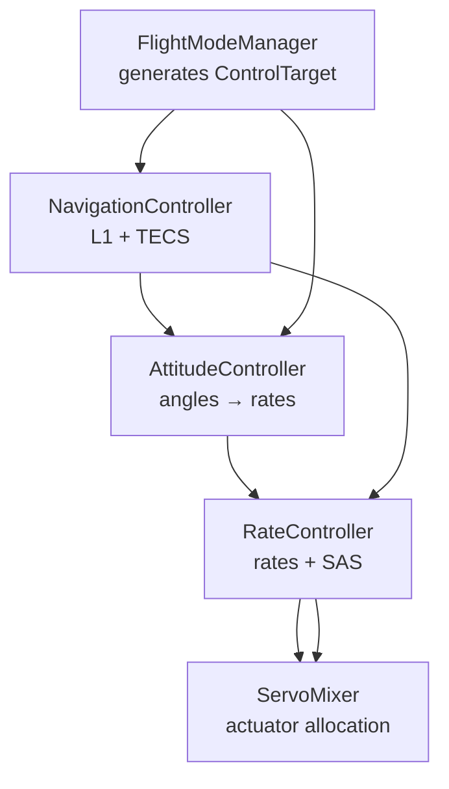

**Diagram sources**
- [src/control/flight_mode_manager.py](file://src/control/flight_mode_manager.py#L115-L298)
- [src/control/navigation_controller.py](file://src/control/navigation_controller.py#L45-L202)
- [src/control/attitude_controller.py](file://src/control/attitude_controller.py#L33-L134)
- [src/control/rate_controller.py](file://src/control/rate_controller.py#L32-L109)
- [src/control/servo_mixer.py](file://src/control/servo_mixer.py#L54-L153)

**Section sources**
- [src/control/__init__.py](file://src/control/__init__.py#L1-L24)

## Core Components
- FlightModeManager: Enumerates supported modes, tracks transitions, and produces ControlTarget for downstream layers.
- NavigationController: Implements L1 lateral guidance and TECS vertical control to produce roll, pitch, and throttle commands.
- AttitudeController: PID-based angle-to-rate conversion with ArduPilot parameter naming.
- RateController: Inner-loop rate control with SAS and feed-forward.
- ServoMixer: Final actuator mapping with amplitude/rate limiting and coordinated turn compensation.
- TECSController: Total Energy Control System for altitude and airspeed management.
- PIDController: Generic PID with anti-windup and optional derivative filtering.
- ArdupilotParams: Parameter container mirroring ArduPilot naming and validation.

**Section sources**
- [src/control/flight_mode_manager.py](file://src/control/flight_mode_manager.py#L28-L298)
- [src/control/navigation_controller.py](file://src/control/navigation_controller.py#L45-L202)
- [src/control/tecs_controller.py](file://src/control/tecs_controller.py#L50-L647)
- [src/control/attitude_controller.py](file://src/control/attitude_controller.py#L33-L134)
- [src/control/rate_controller.py](file://src/control/rate_controller.py#L32-L109)
- [src/control/servo_mixer.py](file://src/control/servo_mixer.py#L54-L153)
- [src/control/pid_controller.py](file://src/control/pid_controller.py#L17-L117)
- [src/control/ardupilot_compat.py](file://src/control/ardupilot_compat.py#L17-L130)

## Architecture Overview
The control stack follows a layered design with explicit data contracts:
- FlightModeManager outputs ControlTarget consumed by AttitudeController and RateController.
- NavigationController outputs ControlTarget consumed by AttitudeController.
- RateController outputs normalized increments consumed by ServoMixer.
- ServoMixer outputs final actuator commands.

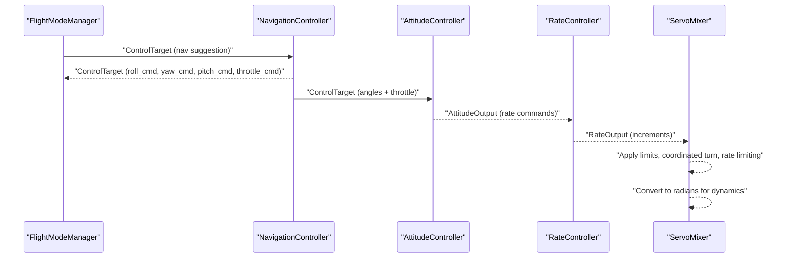

**Diagram sources**
- [src/control/flight_mode_manager.py](file://src/control/flight_mode_manager.py#L173-L212)
- [src/control/navigation_controller.py](file://src/control/navigation_controller.py#L134-L202)
- [src/control/attitude_controller.py](file://src/control/attitude_controller.py#L81-L122)
- [src/control/rate_controller.py](file://src/control/rate_controller.py#L68-L98)
- [src/control/servo_mixer.py](file://src/control/servo_mixer.py#L80-L149)

## Detailed Component Analysis

### FlightModeManager
- Responsibilities:
  - Mode enumeration and transition tracking
  - Per-mode logic: MANUAL passthrough, STABILIZE hold, FBW_A/B reference behavior, AUTO/LOITER/RTH coordination with navigation suggestions
  - ControlTarget generation for downstream layers
- Key APIs:
  - set_mode(new_mode): Switches mode with transition logging
  - set_mode_str(mode_str): Convenience setter by string
  - update(state, nav_target=None, dt=0.1): Main loop to compute ControlTarget
- ControlTarget fields:
  - Euler angles (roll_cmd, pitch_cmd, yaw_cmd)
  - Optional rate commands (roll_rate_cmd, pitch_rate_cmd, yaw_rate_cmd)
  - Airspeed and altitude commands
  - Optional direct control overrides (elevator_direct, aileron_direct, rudder_direct, throttle_direct)
  - Throttle command and is_direct flag

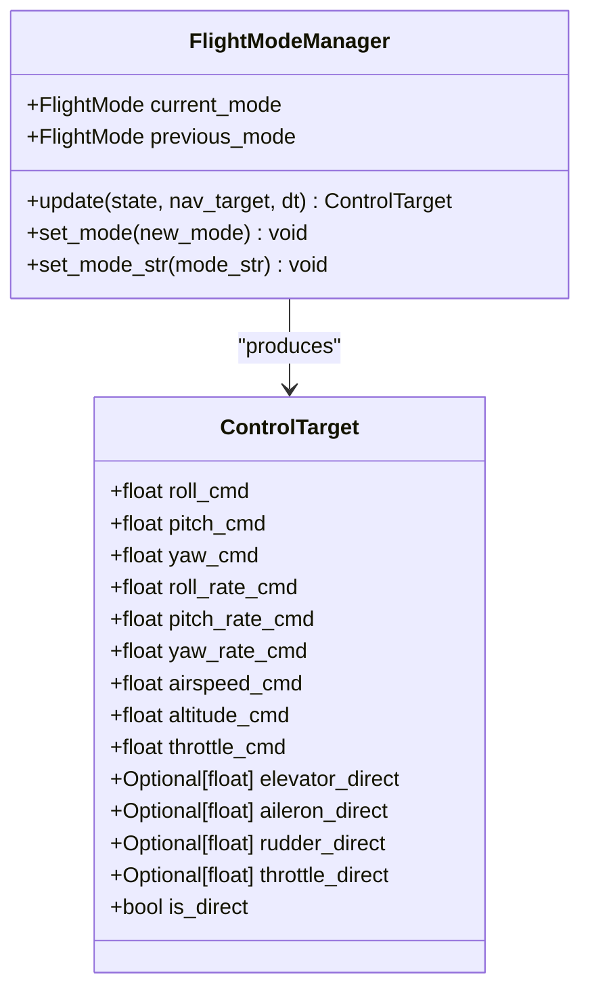

**Diagram sources**
- [src/control/flight_mode_manager.py](file://src/control/flight_mode_manager.py#L115-L298)

**Section sources**
- [src/control/flight_mode_manager.py](file://src/control/flight_mode_manager.py#L115-L298)

### NavigationController
- Responsibilities:
  - L1 lateral navigation law for roll command computation
  - TECS altitude and airspeed control for pitch and throttle
  - PathSegment abstraction for waypoints and target speeds
- Key parameters:
  - L1 guidance: period (NAVL1_PERIOD), damping (NAVL1_DAMPING), max_roll
  - TECS: climb/sink limits, time constant, damping, integral gain, speed weight, roll compensation, pitch limits, throttle bounds, airspeed bounds, height demand time constant
- Methods:
  - reset(state): Reset TECS integrators and filters
  - update(state, segment, dt): Compute ControlTarget

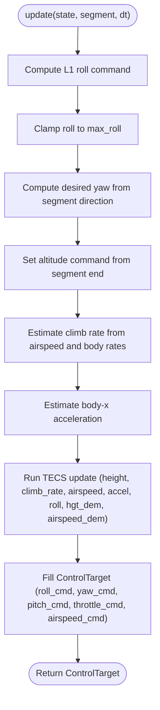

**Diagram sources**
- [src/control/navigation_controller.py](file://src/control/navigation_controller.py#L134-L202)
- [src/control/navigation_controller.py](file://src/control/navigation_controller.py#L206-L292)

**Section sources**
- [src/control/navigation_controller.py](file://src/control/navigation_controller.py#L45-L202)

### TECS Controller
- Responsibilities:
  - Total energy management: throttle controls specific total energy, pitch controls specific energy balance
  - Coupled altitude and airspeed control with anti-windup and underspeed/bad descent protection
- Key internal computations:
  - Speed estimation via complementary filter and low-pass filtered acceleration
  - Height demand rate limiting and low-pass filtering
  - Specific energy and kinetic energy calculations
  - SEB (specific energy balance) error and PD control for pitch
  - STE (specific total energy) error and PD control for throttle with roll compensation
- Public API:
  - reset(height, airspeed, pitch): Initialize state
  - update(height, climb_rate, airspeed, accel_body_x, roll_rad, hgt_dem, airspeed_dem, dt): Compute outputs

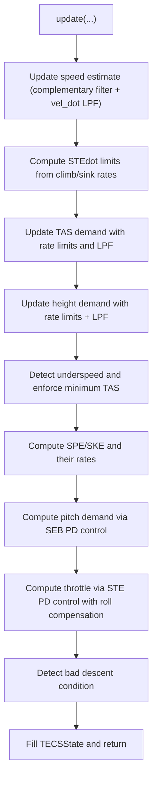

**Diagram sources**
- [src/control/tecs_controller.py](file://src/control/tecs_controller.py#L247-L315)
- [src/control/tecs_controller.py](file://src/control/tecs_controller.py#L321-L446)
- [src/control/tecs_controller.py](file://src/control/tecs_controller.py#L465-L552)
- [src/control/tecs_controller.py](file://src/control/tecs_controller.py#L553-L624)

**Section sources**
- [src/control/tecs_controller.py](file://src/control/tecs_controller.py#L50-L647)

### AttitudeController
- Responsibilities:
  - Convert desired Euler angles to desired angular rates using PID
  - ArduPilot-style gains: PTCH_P, ROLL_P (P-only), Yaw pass-through
- Output limits:
  - Max roll/pitch/yaw rate commands
- Methods:
  - update(phi, theta, psi, roll_cmd, pitch_cmd, yaw_cmd, dt): Compute AttitudeOutput
  - reload_gains(ap_params): Hot-reload gains
  - reset(): Reset PID integrators

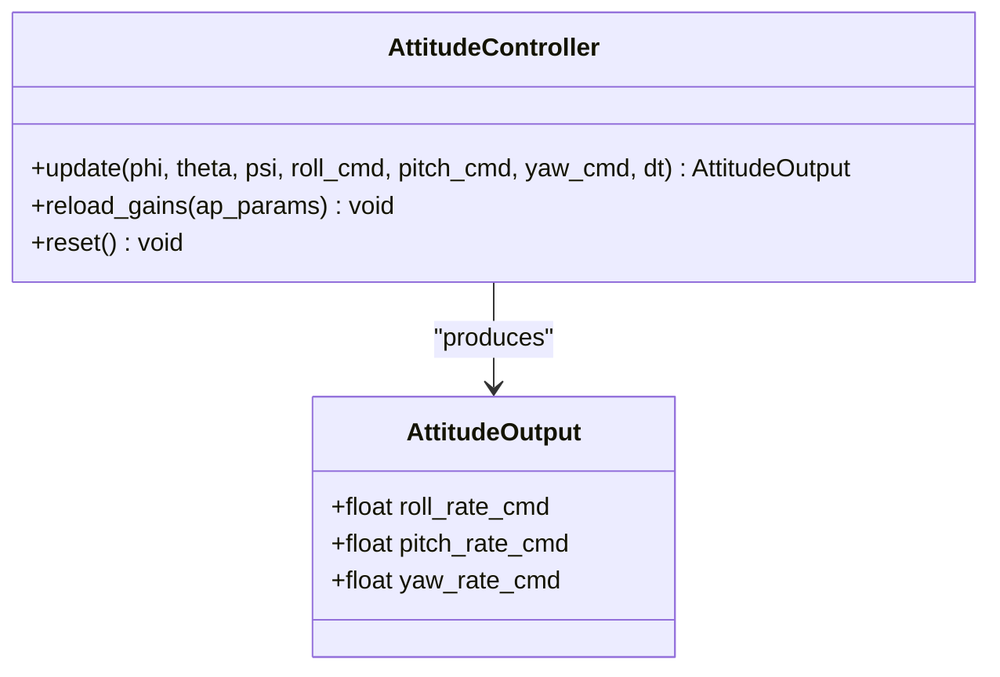

**Diagram sources**
- [src/control/attitude_controller.py](file://src/control/attitude_controller.py#L33-L134)

**Section sources**
- [src/control/attitude_controller.py](file://src/control/attitude_controller.py#L33-L134)

### RateController
- Responsibilities:
  - Inner-loop rate control with SAS (always active)
  - Feed-forward terms per axis
- Gains:
  - PTCH_RATE_P/I/D/FF, ROLL_RATE_P/I/D/FF, YAW_RATE_P/I/FF
- Methods:
  - update(p, q, r, p_cmd, q_cmd, r_cmd, dt): Compute RateOutput
  - reload_gains(ap_params): Hot-reload gains
  - reset(): Reset PID integrators

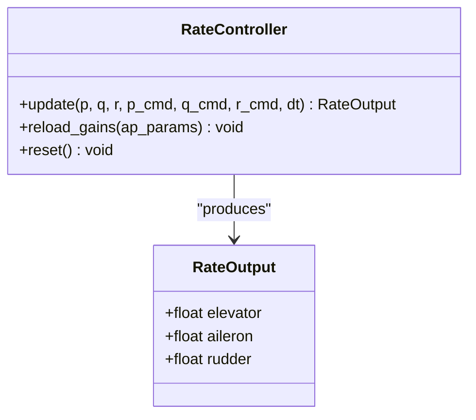

**Diagram sources**
- [src/control/rate_controller.py](file://src/control/rate_controller.py#L32-L109)

**Section sources**
- [src/control/rate_controller.py](file://src/control/rate_controller.py#L32-L109)

### ServoMixer
- Responsibilities:
  - Map normalized increments to final actuator outputs
  - Apply amplitude limits, coordinated turn rudder compensation, and rate limiting
- Methods:
  - update(elev_in, ail_in, rud_in, throttle, phi, p, dt): Compute ServoOutput
  - reset(): Clear previous outputs

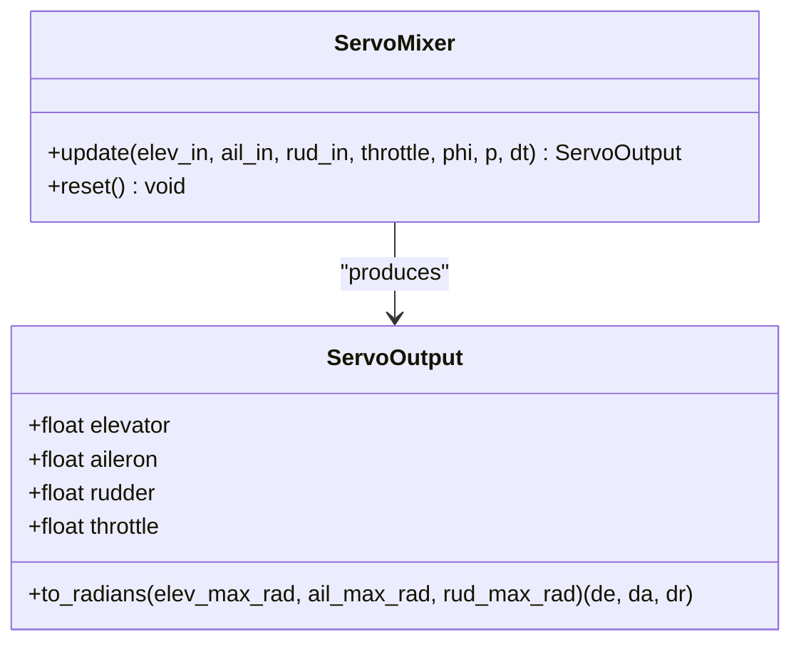

**Diagram sources**
- [src/control/servo_mixer.py](file://src/control/servo_mixer.py#L54-L153)

**Section sources**
- [src/control/servo_mixer.py](file://src/control/servo_mixer.py#L54-L153)

### PIDController Utilities
- Features:
  - P/I/D control with optional derivative low-pass filter
  - Clamping-based anti-windup
  - Feed-forward addition
  - Reset and runtime gain updates
- Methods:
  - update(error, dt, feed_forward): Compute output
  - reset(zero_integrator): Clear state
  - set_gains(kp, ki, kd): Update gains

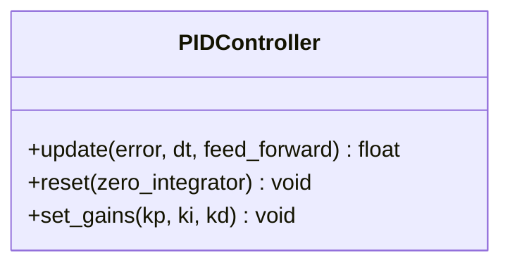

**Diagram sources**
- [src/control/pid_controller.py](file://src/control/pid_controller.py#L17-L117)

**Section sources**
- [src/control/pid_controller.py](file://src/control/pid_controller.py#L17-L117)

### ArduPilot Compatibility
- ArdupilotParams:
  - Field names mirror ArduPilot Plane parameters
  - Includes navigation, speed/altitude, and control gains
  - YAML load/save and validation helpers
- Parameter mapping:
  - TECS parameters mapped to TECSController constructor
  - L1 parameters mapped to NavigationController constructor
  - Control gains mapped to AttitudeController and RateController

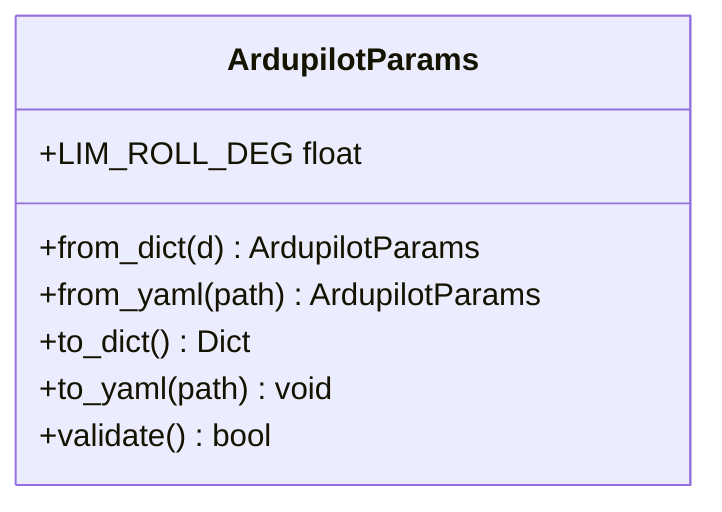

**Diagram sources**
- [src/control/ardupilot_compat.py](file://src/control/ardupilot_compat.py#L17-L130)

**Section sources**
- [src/control/ardupilot_compat.py](file://src/control/ardupilot_compat.py#L17-L130)
- [config/control_params.yaml](file://config/control_params.yaml#L1-L45)

## Dependency Analysis
- FlightModeManager depends on ArduPilot parameter naming via ArdupilotParams and produces ControlTarget consumed by AttitudeController and RateController.
- NavigationController composes TECSController and uses math utilities for angle wrapping and saturation.
- AttitudeController and RateController both depend on PIDController and ArdupilotParams.
- ServoMixer depends on ArdupilotParams for limits and math utilities for saturation.

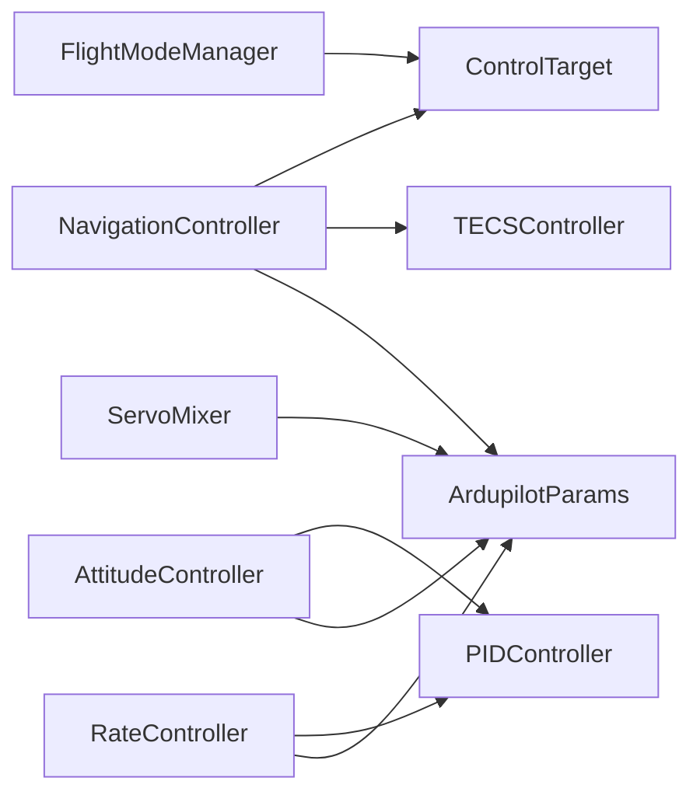

**Diagram sources**
- [src/control/flight_mode_manager.py](file://src/control/flight_mode_manager.py#L115-L298)
- [src/control/navigation_controller.py](file://src/control/navigation_controller.py#L45-L117)
- [src/control/tecs_controller.py](file://src/control/tecs_controller.py#L50-L130)
- [src/control/attitude_controller.py](file://src/control/attitude_controller.py#L33-L77)
- [src/control/rate_controller.py](file://src/control/rate_controller.py#L32-L64)
- [src/control/servo_mixer.py](file://src/control/servo_mixer.py#L54-L76)
- [src/control/ardupilot_compat.py](file://src/control/ardupilot_compat.py#L17-L130)

**Section sources**
- [src/control/__init__.py](file://src/control/__init__.py#L1-L24)

## Performance Considerations
- TECS uses rate-limited height demand and low-pass filtering to prevent aggressive demand changes and reduce oscillations.
- L1 guidance avoids overshoot near path ends by steering toward the segment endpoint when past the end.
- Rate control includes SAS damping and feed-forward to improve stability and responsiveness.
- ServoMixer applies rate limiting to smooth actuator outputs and reduce mechanical stress.
- PID anti-windup prevents integrator windup during saturation.

[No sources needed since this section provides general guidance]

## Troubleshooting Guide
- Mode transitions:
  - Verify mode switching via set_mode/set_mode_str and confirm ControlTarget generation in update.
- L1 guidance:
  - Check L1 period/damping and max_roll; ensure segment direction is well-defined.
- TECS:
  - Validate climb/sink limits, time constant, and speed weight; monitor underspeed and bad descent flags.
- Attitude/Rate control:
  - Confirm ArdupilotParams gains are within validated ranges; hot-reload gains if needed.
- ServoMixer:
  - Adjust rate limit and surface travel limits; verify coordinated turn compensation.

**Section sources**
- [src/control/flight_mode_manager.py](file://src/control/flight_mode_manager.py#L152-L212)
- [src/control/navigation_controller.py](file://src/control/navigation_controller.py#L120-L131)
- [src/control/tecs_controller.py](file://src/control/tecs_controller.py#L197-L246)
- [src/control/attitude_controller.py](file://src/control/attitude_controller.py#L124-L133)
- [src/control/rate_controller.py](file://src/control/rate_controller.py#L100-L108)
- [src/control/servo_mixer.py](file://src/control/servo_mixer.py#L151-L153)

## Conclusion
The control system provides a modular, ArduPilot-compatible framework for fixed-wing flight control. The five-layer hierarchy cleanly separates mode selection, navigation, attitude control, rate control with SAS, and actuator allocation. TECS ensures robust altitude and airspeed management, while PID-based controllers enable precise tuning. ArdupilotParams unify parameterization across layers, and ServoMixer ensures safe, rate-limited actuator outputs.

[No sources needed since this section summarizes without analyzing specific files]

## Appendices

### API Reference Index
- FlightModeManager
  - set_mode(new_mode)
  - set_mode_str(mode_str)
  - update(state, nav_target=None, dt=0.1)
- NavigationController
  - reset(state=None)
  - update(state, segment, dt)
- TECSController
  - reset(height, airspeed, pitch)
  - update(height, climb_rate, airspeed, accel_body_x, roll_rad, hgt_dem, airspeed_dem, dt)
- AttitudeController
  - update(phi, theta, psi, roll_cmd, pitch_cmd, yaw_cmd, dt)
  - reload_gains(ap_params)
  - reset()
- RateController
  - update(p, q, r, p_cmd, q_cmd, r_cmd, dt)
  - reload_gains(ap_params)
  - reset()
- ServoMixer
  - update(elev_in, ail_in, rud_in, throttle, phi, p, dt)
  - reset()
- PIDController
  - update(error, dt, feed_forward)
  - reset(zero_integrator)
  - set_gains(kp, ki, kd)
- ArdupilotParams
  - from_dict(d), from_yaml(path), to_dict(), to_yaml(path)
  - validate()

**Section sources**
- [src/control/flight_mode_manager.py](file://src/control/flight_mode_manager.py#L152-L212)
- [src/control/navigation_controller.py](file://src/control/navigation_controller.py#L120-L202)
- [src/control/tecs_controller.py](file://src/control/tecs_controller.py#L197-L315)
- [src/control/attitude_controller.py](file://src/control/attitude_controller.py#L81-L133)
- [src/control/rate_controller.py](file://src/control/rate_controller.py#L68-L108)
- [src/control/servo_mixer.py](file://src/control/servo_mixer.py#L80-L153)
- [src/control/pid_controller.py](file://src/control/pid_controller.py#L55-L117)
- [src/control/ardupilot_compat.py](file://src/control/ardupilot_compat.py#L74-L130)