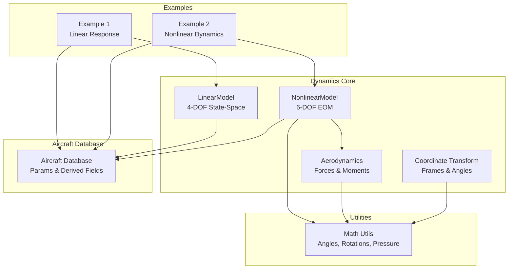
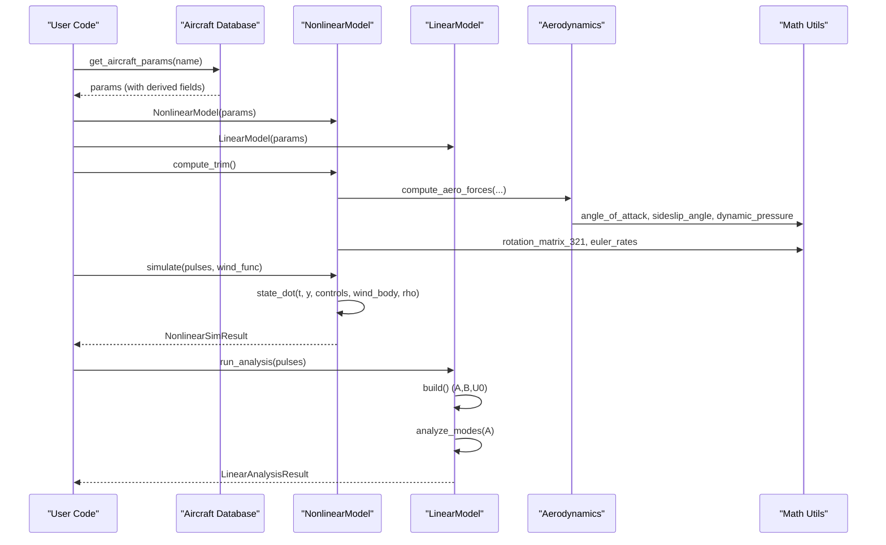
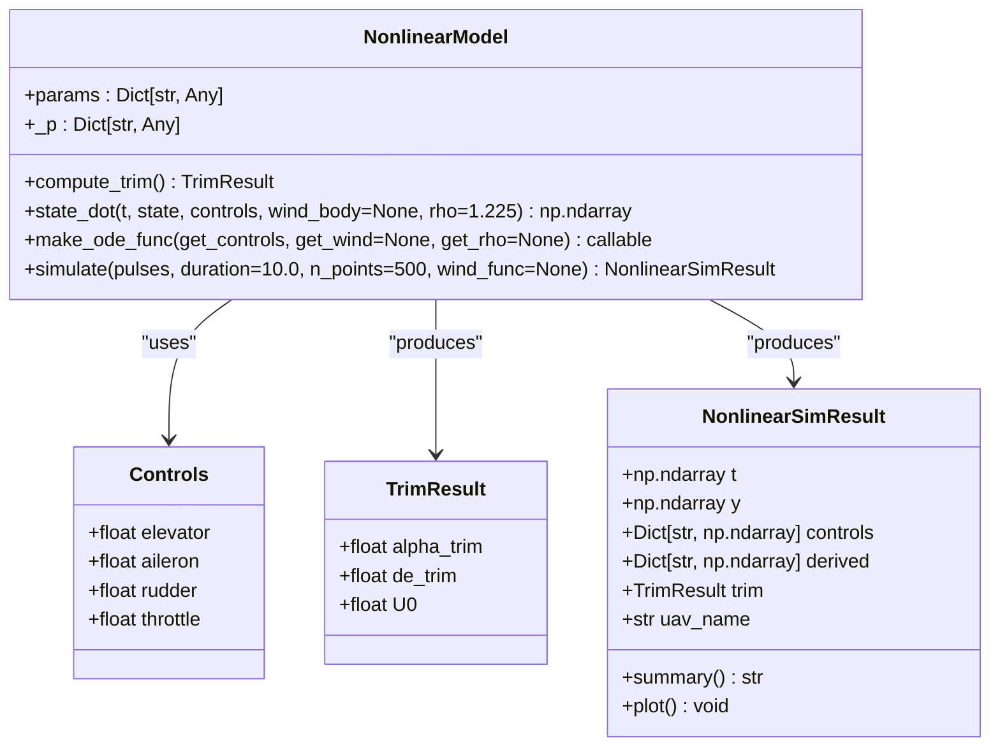
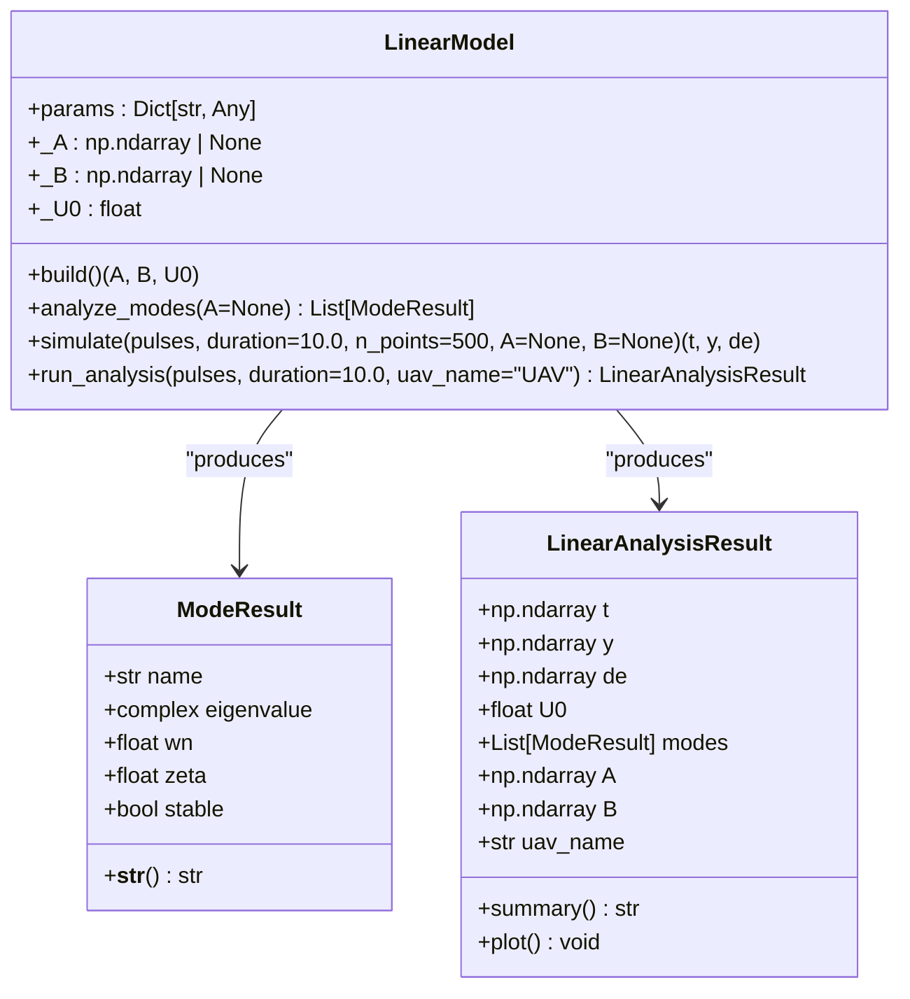
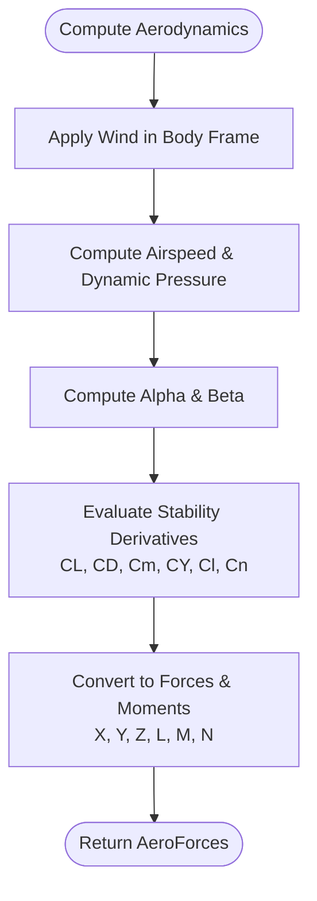
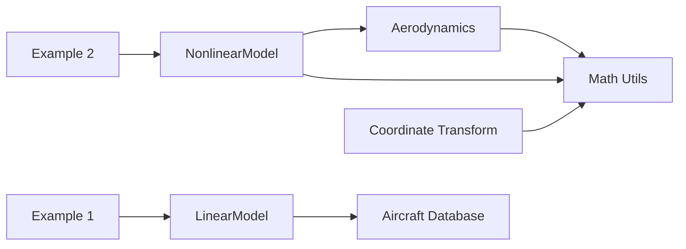

# Dynamics API

<cite>
**Referenced Files in This Document**
- [nonlinear_model.py](file://src/dynamics/nonlinear_model.py)
- [linear_model.py](file://src/dynamics/linear_model.py)
- [aerodynamics.py](file://src/dynamics/aerodynamics.py)
- [coordinate_transform.py](file://src/dynamics/coordinate_transform.py)
- [math_utils.py](file://src/utils/math_utils.py)
- [aircraft_database.py](file://src/models/aircraft_database.py)
- [__init__.py](file://src/dynamics/__init__.py)
- [1_linear_response.py](file://examples/1_linear_response.py)
- [2_nonlinear_dynamics.py](file://examples/2_nonlinear_dynamics.py)
</cite>

## Table of Contents
1. [Introduction](#introduction)
2. [Project Structure](#project-structure)
3. [Core Components](#core-components)
4. [Architecture Overview](#architecture-overview)
5. [Detailed Component Analysis](#detailed-component-analysis)
6. [Dependency Analysis](#dependency-analysis)
7. [Performance Considerations](#performance-considerations)
8. [Troubleshooting Guide](#troubleshooting-guide)
9. [Conclusion](#conclusion)
10. [Appendices](#appendices)

## Introduction
This document provides comprehensive API documentation for the dynamics and flight mechanics module. It covers:
- NonlinearModel: six-degree-of-freedom (6-DOF) nonlinear equations of motion, state vector definition, and force/moment computation.
- LinearModel: four-degree-of-freedom (4-DOF) longitudinal linearized state-space model, modal analysis, and control design utilities.
- Aerodynamics: force and moment calculation pipeline, coefficient computation, and wind effects.
- Coordinate transformations: frame conversions, Euler angle representations, and direction cosine matrices.
- Method signatures for dynamic model evaluation, state propagation, and aerodynamic force calculations.

The module integrates seamlessly with the broader simulation framework and is demonstrated in example scripts.

## Project Structure
The dynamics package is organized around core physics modules and shared utilities:
- Dynamics core: nonlinear and linear models, aerodynamics, and coordinate transforms.
- Utilities: math helpers (angles, rotations, dynamic pressure).
- Aircraft database: parameter sets for multiple aircraft configurations.
- Examples: usage demonstrations for linear and nonlinear simulations.

**Diagram sources**
- [nonlinear_model.py](file://src/dynamics/nonlinear_model.py#L104-L386)
- [linear_model.py](file://src/dynamics/linear_model.py#L107-L319)
- [aerodynamics.py](file://src/dynamics/aerodynamics.py#L35-L148)
- [coordinate_transform.py](file://src/dynamics/coordinate_transform.py#L29-L70)
- [math_utils.py](file://src/utils/math_utils.py#L43-L124)
- [aircraft_database.py](file://src/models/aircraft_database.py#L143-L167)
- [1_linear_response.py](file://examples/1_linear_response.py#L95-L100)
- [2_nonlinear_dynamics.py](file://examples/2_nonlinear_dynamics.py#L89-L103)

**Section sources**
- [__init__.py](file://src/dynamics/__init__.py#L1-L22)
- [aircraft_database.py](file://src/models/aircraft_database.py#L143-L167)

## Core Components
- NonlinearModel: Implements 6-DOF nonlinear equations of motion in NED coordinates, computes trim conditions, evaluates state derivatives, and runs batch simulations.
- LinearModel: Builds a 4-DOF longitudinal linearized state-space model, performs modal analysis, and simulates time-domain responses.
- Aerodynamics: Computes aerodynamic forces and moments in body frame, including wind effects and non-dimensional coefficients.
- Coordinate Transform: Provides direction cosine matrices, Euler angle rates, and conversions between NED and body frames.

Key capabilities:
- Dynamic model evaluation via state_dot and make_ode_func.
- State propagation using numerical ODE integration.
- Aerodynamic force and moment computation with wind vector subtraction.
- Modal analysis and control design utilities for linear models.

**Section sources**
- [nonlinear_model.py](file://src/dynamics/nonlinear_model.py#L104-L386)
- [linear_model.py](file://src/dynamics/linear_model.py#L107-L319)
- [aerodynamics.py](file://src/dynamics/aerodynamics.py#L35-L148)
- [coordinate_transform.py](file://src/dynamics/coordinate_transform.py#L29-L70)

## Architecture Overview
The dynamics subsystem composes:
- NonlinearModel depends on aerodynamics and math utilities for forces, moments, and kinematic relations.
- LinearModel constructs state-space matrices from aircraft parameters and performs modal analysis.
- Aerodynamics relies on math utilities for angles and dynamic pressure.
- Coordinate transform utilities underpin frame conversions and Euler kinematics.

**Diagram sources**
- [aircraft_database.py](file://src/models/aircraft_database.py#L143-L167)
- [nonlinear_model.py](file://src/dynamics/nonlinear_model.py#L132-L386)
- [linear_model.py](file://src/dynamics/linear_model.py#L129-L319)
- [aerodynamics.py](file://src/dynamics/aerodynamics.py#L35-L148)
- [math_utils.py](file://src/utils/math_utils.py#L107-L124)

## Detailed Component Analysis

### NonlinearModel
NonlinearModel implements the 6-DOF nonlinear equations of motion in NED coordinates. The state vector is 12-dimensional:
- Body velocities: u, v, w (m/s)
- Body angular rates: p, q, r (rad/s)
- Euler angles: phi, theta, psi (rad)
- NED positions: x_N, x_E, x_D (m, positive down)

State derivative computation:
- Computes aerodynamic forces and moments via compute_aero_forces.
- Applies thrust modeled as throttle times a maximum value derived from thrust-to-weight ratio.
- Includes gravity contribution in body frame.
- Integrates translational accelerations, rotational dynamics with inertia coupling, Euler kinematics, and position kinematics.

Trim computation:
- Solves for level-flight trim (zero roll/pitch, zero yaw rate) by solving a linear system for angle of attack and elevator deflection.

Simulation:
- Supports open-loop pulse inputs and optional wind and density profiles.
- Returns a NonlinearSimResult containing time, state history, control histories, derived quantities, trim results, and metadata.

Key methods and signatures:
- compute_trim() -> TrimResult
- state_dot(t, state, controls, wind_body=None, rho=RHO0) -> np.ndarray
- make_ode_func(get_controls, get_wind=None, get_rho=None) -> callable
- simulate(pulses, duration=10.0, n_points=500, wind_func=None) -> NonlinearSimResult

Representative usage:
- Trim computation and simulation are demonstrated in the nonlinear dynamics example script.

**Diagram sources**
- [nonlinear_model.py](file://src/dynamics/nonlinear_model.py#L37-L102)
- [nonlinear_model.py](file://src/dynamics/nonlinear_model.py#L104-L386)

**Section sources**
- [nonlinear_model.py](file://src/dynamics/nonlinear_model.py#L104-L386)
- [2_nonlinear_dynamics.py](file://examples/2_nonlinear_dynamics.py#L89-L103)

### LinearModel
LinearModel implements a 4-DOF longitudinal linearized state-space model:
- State: [u_p, alpha, q, theta]
- Inputs: [delta_T, delta_e]
- Outputs: state history and derived quantities

State-space construction:
- Builds A and B matrices from aircraft parameters and trim speed U0.
- Uses stability derivatives and dimensionalization to form the system.

Modal analysis:
- Performs eigenvalue decomposition of A to identify Short Period, Phugoid, and Subsidence modes.
- Computes natural frequencies and damping ratios.

Time-domain simulation:
- Solves the linear ODE with piecewise constant elevator inputs.
- Returns time, state history, and input history.

Key methods and signatures:
- build() -> (A, B, U0)
- analyze_modes(A=None) -> List[ModeResult]
- simulate(pulses, duration=10.0, n_points=500, A=None, B=None) -> (t, y, de)
- run_analysis(pulses, duration=10.0, uav_name="UAV") -> LinearAnalysisResult

Representative usage:
- Demonstrated in the linear response example script.

**Diagram sources**
- [linear_model.py](file://src/dynamics/linear_model.py#L107-L319)

**Section sources**
- [linear_model.py](file://src/dynamics/linear_model.py#L107-L319)
- [1_linear_response.py](file://examples/1_linear_response.py#L95-L105)

### Aerodynamics
Aerodynamics computes forces and moments in the body frame:
- Computes true airspeed vector by subtracting wind in body frame.
- Calculates angle of attack and sideslip angle.
- Evaluates non-dimensional coefficients (CL, CD, CY, Cm, Cl, Cn) using stability derivatives and normalized angular rates.
- Converts non-dimensional coefficients to forces and moments using dynamic pressure and geometry.

Key functions and signatures:
- compute_aero_forces(u, v, w, p, q, r, de, da, dr, params, wind_body=None, rho=1.225) -> AeroForces

Representative usage:
- Called internally by NonlinearModel.state_dot and can be used standalone for aerodynamic analysis.

**Diagram sources**
- [aerodynamics.py](file://src/dynamics/aerodynamics.py#L35-L148)

**Section sources**
- [aerodynamics.py](file://src/dynamics/aerodynamics.py#L35-L148)

### Coordinate Transform Utilities
Provides frame conversions and Euler kinematics:
- Direction cosine matrix from Euler angles.
- Conversions between NED and body frames.
- Euler angle rates from body rates.
- Wind vector conversion from NED to body frame.
- True airspeed vector computation.

Key functions and signatures:
- dcm_from_euler(phi, theta, psi) -> np.ndarray
- wind_to_body_frame(wind_ned, phi, theta, psi) -> np.ndarray
- airspeed_vector(vel_body, wind_body) -> np.ndarray
- euler_rates(p, q, r, phi, theta) -> np.ndarray

Representative usage:
- Used by NonlinearModel for position kinematics and wind transformations.

**Section sources**
- [coordinate_transform.py](file://src/dynamics/coordinate_transform.py#L29-L70)
- [math_utils.py](file://src/utils/math_utils.py#L43-L124)

## Dependency Analysis
The dynamics module exhibits clean separation of concerns:
- NonlinearModel depends on aerodynamics and math utilities.
- LinearModel depends on aircraft parameters and math utilities.
- Aerodynamics depends on math utilities for angles and dynamic pressure.
- Coordinate transform utilities depend on math utilities.

**Diagram sources**
- [nonlinear_model.py](file://src/dynamics/nonlinear_model.py#L27-L28)
- [linear_model.py](file://src/dynamics/linear_model.py#L18-L20)
- [aerodynamics.py](file://src/dynamics/aerodynamics.py#L11-L13)
- [math_utils.py](file://src/utils/math_utils.py#L6-L6)
- [aircraft_database.py](file://src/models/aircraft_database.py#L14-L20)
- [coordinate_transform.py](file://src/dynamics/coordinate_transform.py#L10-L16)
- [1_linear_response.py](file://examples/1_linear_response.py#L34-L36)
- [2_nonlinear_dynamics.py](file://examples/2_nonlinear_dynamics.py#L34-L36)

**Section sources**
- [__init__.py](file://src/dynamics/__init__.py#L3-L13)

## Performance Considerations
- NonlinearModel.state_dot and LinearModel.simulate rely on numerical ODE integration; adjust tolerances and step sizes for accuracy vs speed trade-offs.
- Aerodynamics computation is vectorized and efficient; wind effects and dynamic pressure are computed per step.
- Coordinate transforms use precomputed rotation matrices; cache where appropriate in tight loops.
- LinearModel.build precomputes dimensionalized stability derivatives; reuse matrices when simulating multiple scenarios.

[No sources needed since this section provides general guidance]

## Troubleshooting Guide
Common issues and resolutions:
- Invalid aircraft name: Ensure the name exists in the aircraft database; errors are raised with available names.
- Numerical singularities in Euler rates: The math utilities protect against singularities near theta = ±90°.
- Trim solver failure: The trim computation falls back to least-squares solutions when exact inversion fails.
- Wind handling: Verify wind vectors are provided in NED frame and converted to body frame before aerodynamic computation.

**Section sources**
- [aircraft_database.py](file://src/models/aircraft_database.py#L143-L167)
- [math_utils.py](file://src/utils/math_utils.py#L79-L100)
- [nonlinear_model.py](file://src/dynamics/nonlinear_model.py#L148-L154)

## Conclusion
The dynamics module provides robust, modular APIs for both nonlinear and linear flight mechanics:
- NonlinearModel offers a complete 6-DOF simulation engine with trim computation and batch simulation.
- LinearModel delivers a practical 4-DOF state-space model with modal analysis and time-domain response.
- Aerodynamics and coordinate transforms are cleanly separated and reusable utilities.
- The examples demonstrate practical usage for open-loop and closed-loop analyses.

[No sources needed since this section summarizes without analyzing specific files]

## Appendices

### API Reference Index
- NonlinearModel
  - compute_trim() -> TrimResult
  - state_dot(t, state, controls, wind_body=None, rho=1.225) -> np.ndarray
  - make_ode_func(get_controls, get_wind=None, get_rho=None) -> callable
  - simulate(pulses, duration=10.0, n_points=500, wind_func=None) -> NonlinearSimResult
- LinearModel
  - build() -> (A, B, U0)
  - analyze_modes(A=None) -> List[ModeResult]
  - simulate(pulses, duration=10.0, n_points=500, A=None, B=None) -> (t, y, de)
  - run_analysis(pulses, duration=10.0, uav_name="UAV") -> LinearAnalysisResult
- Aerodynamics
  - compute_aero_forces(u, v, w, p, q, r, de, da, dr, params, wind_body=None, rho=1.225) -> AeroForces
- Coordinate Transform
  - dcm_from_euler(phi, theta, psi) -> np.ndarray
  - wind_to_body_frame(wind_ned, phi, theta, psi) -> np.ndarray
  - airspeed_vector(vel_body, wind_body) -> np.ndarray
  - euler_rates(p, q, r, phi, theta) -> np.ndarray

**Section sources**
- [nonlinear_model.py](file://src/dynamics/nonlinear_model.py#L132-L386)
- [linear_model.py](file://src/dynamics/linear_model.py#L129-L319)
- [aerodynamics.py](file://src/dynamics/aerodynamics.py#L35-L148)
- [coordinate_transform.py](file://src/dynamics/coordinate_transform.py#L29-L70)