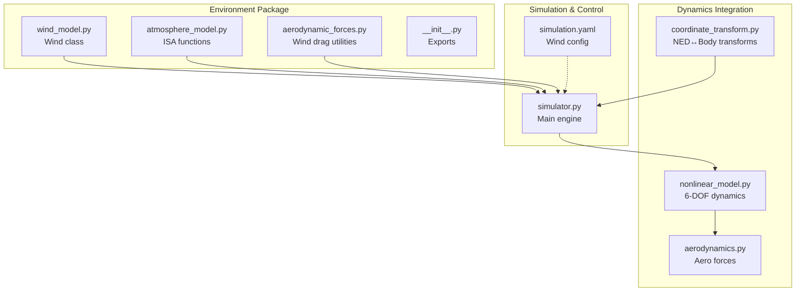
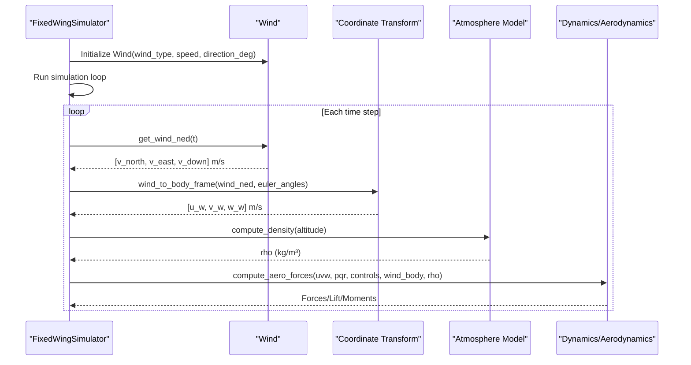
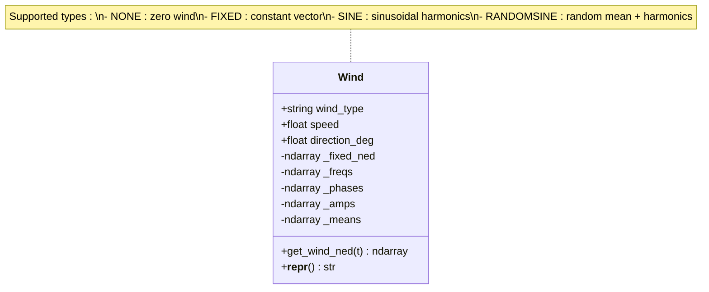
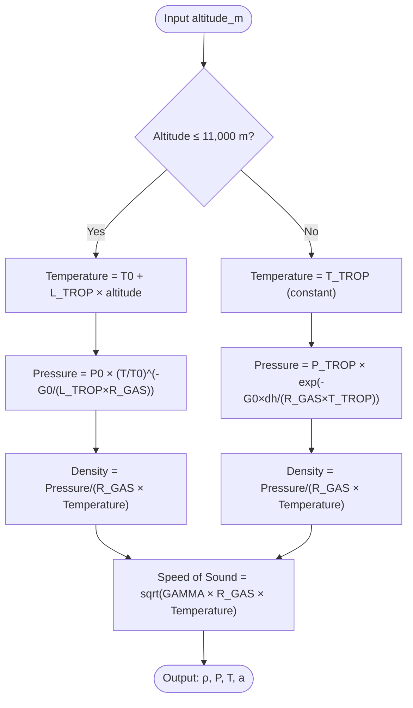
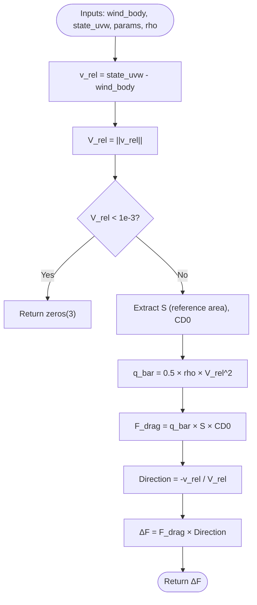
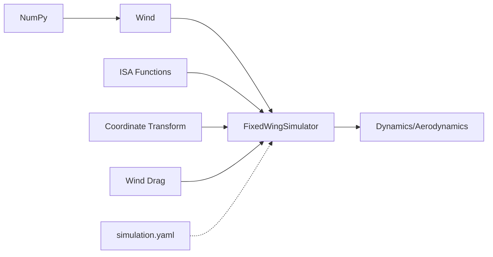

# Environment API

<cite>
**Referenced Files in This Document**
- [wind_model.py](file://src/environment/wind_model.py)
- [atmosphere_model.py](file://src/environment/atmosphere_model.py)
- [aerodynamic_forces.py](file://src/environment/aerodynamic_forces.py)
- [__init__.py](file://src/environment/__init__.py)
- [coordinate_transform.py](file://src/dynamics/coordinate_transform.py)
- [simulator.py](file://src/simulation/simulator.py)
- [simulation.yaml](file://config/simulation.yaml)
</cite>

## Table of Contents
1. [Introduction](#introduction)
2. [Project Structure](#project-structure)
3. [Core Components](#core-components)
4. [Architecture Overview](#architecture-overview)
5. [Detailed Component Analysis](#detailed-component-analysis)
6. [Dependency Analysis](#dependency-analysis)
7. [Performance Considerations](#performance-considerations)
8. [Troubleshooting Guide](#troubleshooting-guide)
9. [Conclusion](#conclusion)
10. [Appendices](#appendices)

## Introduction
This document provides comprehensive API documentation for the environment and weather modeling module. It covers:
- WindModel class with wind field generation algorithms, turbulence modeling functions, and environmental condition parameters
- AtmosphereModel class with density and pressure calculations, temperature profile functions, and speed of sound computations
- Aerodynamic force calculation utilities for additional force computations, wind effects modeling, and drag calculations
- Environmental parameter access methods and validation functions
- Method signatures for environmental condition evaluation, wind field sampling, and atmospheric property calculations

The environment system integrates wind models, atmospheric models, and aerodynamic force computations into the broader simulation framework.

## Project Structure
The environment system resides under the environment package and collaborates with dynamics, simulation, and visualization modules.

**Diagram sources**
- [wind_model.py](file://src/environment/wind_model.py#L1-L113)
- [atmosphere_model.py](file://src/environment/atmosphere_model.py#L1-L77)
- [aerodynamic_forces.py](file://src/environment/aerodynamic_forces.py#L1-L54)
- [coordinate_transform.py](file://src/dynamics/coordinate_transform.py#L39-L70)
- [simulator.py](file://src/simulation/simulator.py#L329-L338)
- [simulation.yaml](file://config/simulation.yaml#L22-L25)

**Section sources**
- [__init__.py](file://src/environment/__init__.py#L1-L16)
- [simulator.py](file://src/simulation/simulator.py#L130-L200)

## Core Components
This section documents the primary classes and functions that form the environment API.

### Wind Model
The Wind class generates wind fields in NED coordinates with support for four types:
- NONE: No wind
- FIXED: Constant wind vector
- SINE: Sinusoidal superposition of harmonics
- RANDOMSINE: Random mean plus sinusoidal fluctuations (turbulence-like)

Key capabilities:
- Time-dependent wind vector sampling in NED frame
- Pre-computed parameters for efficient runtime
- Validation of wind types and parameter ranges
- Conversion from "FROM" meteorological direction to NED unit vectors

**Section sources**
- [wind_model.py](file://src/environment/wind_model.py#L18-L113)

### Atmosphere Model
The atmosphere module implements the International Standard Atmosphere (ISA) model covering:
- Troposphere (0–11 km) with linear temperature lapse
- Lower stratosphere (11–20 km) with constant temperature
- Temperature, pressure, density, and speed of sound calculations
- Convenience function returning all four properties

Key functions:
- compute_temperature(altitude_m): Temperature in Kelvin
- compute_pressure(altitude_m): Pressure in Pascals
- compute_density(altitude_m): Density in kg/m³
- compute_speed_of_sound(altitude_m): Speed of sound in m/s
- atmosphere(altitude_m): Returns (density, pressure, temperature, speed of sound)

**Section sources**
- [atmosphere_model.py](file://src/environment/atmosphere_model.py#L24-L77)

### Aerodynamic Force Utilities
The wind drag utility computes incremental body-frame forces due to wind effects:
- Estimates additional drag caused by relative wind speed
- Uses simple quadratic drag model with reference area and zero-lift drag coefficient
- Suitable for perturbation and sensitivity analysis
- Returns zero force when relative airspeed is below threshold

**Section sources**
- [aerodynamic_forces.py](file://src/environment/aerodynamic_forces.py#L13-L54)

## Architecture Overview
The environment system integrates with the simulation engine through a well-defined pipeline:

**Diagram sources**
- [simulator.py](file://src/simulation/simulator.py#L329-L338)
- [wind_model.py](file://src/environment/wind_model.py#L76-L108)
- [coordinate_transform.py](file://src/dynamics/coordinate_transform.py#L39-L70)
- [atmosphere_model.py](file://src/environment/atmosphere_model.py#L48-L77)

## Detailed Component Analysis

### Wind Model Class Analysis
The Wind class encapsulates wind field generation with robust parameter validation and efficient sampling.

**Diagram sources**
- [wind_model.py](file://src/environment/wind_model.py#L18-L113)

Implementation highlights:
- Parameter validation ensures wind_type is one of the supported types
- FIXED wind pre-computes NED unit vector for constant wind vector
- SINE and RANDOMSINE models use random number generation for frequency, phase, amplitude, and mean parameters
- get_wind_ned method efficiently evaluates wind vector for any given time t

**Section sources**
- [wind_model.py](file://src/environment/wind_model.py#L32-L108)

### Atmosphere Model Functions Analysis
The ISA implementation provides four essential atmospheric properties with clear mathematical formulations.

**Diagram sources**
- [atmosphere_model.py](file://src/environment/atmosphere_model.py#L24-L77)

Key characteristics:
- Troposphere uses linear temperature lapse rate
- Stratosphere uses constant temperature with exponential pressure decay
- All calculations use SI units consistently
- atmosphere() function provides batch access to all properties

**Section sources**
- [atmosphere_model.py](file://src/environment/atmosphere_model.py#L10-L77)

### Aerodynamic Force Utilities Analysis
The wind drag computation provides a simplified model for wind-induced additional forces.

**Diagram sources**
- [aerodynamic_forces.py](file://src/environment/aerodynamic_forces.py#L13-L54)

Implementation notes:
- Threshold prevents numerical noise when relative airspeed is near zero
- Uses body-frame velocities for consistency with aerodynamic computations
- Assumes quadratic dependence on relative airspeed magnitude
- Returns forces in body frame for direct integration with baseline aerodynamics

**Section sources**
- [aerodynamic_forces.py](file://src/environment/aerodynamic_forces.py#L13-L54)

## Dependency Analysis
The environment system maintains clean separation of concerns with explicit dependencies.

**Diagram sources**
- [wind_model.py](file://src/environment/wind_model.py#L14-L15)
- [atmosphere_model.py](file://src/environment/atmosphere_model.py#L8-L9)
- [simulator.py](file://src/simulation/simulator.py#L38-L52)

Key dependency relationships:
- Wind depends on NumPy for numerical operations and random number generation
- Simulator orchestrates all environment components and passes data between modules
- Coordinate transforms enable conversion between NED and body frames
- Aerodynamic utilities depend on aircraft parameters dictionary
- Configuration system provides centralized wind parameter management

**Section sources**
- [__init__.py](file://src/environment/__init__.py#L3-L8)
- [simulator.py](file://src/simulation/simulator.py#L130-L200)

## Performance Considerations
The environment system is designed for real-time simulation performance:

- Wind sampling complexity:
  - NONE/FIXED: O(1) constant time
  - SINE/RANDOMSINE: O(A×K) where A=3 axes, K=3 harmonics per axis
  - Pre-computation eliminates per-step random generation overhead

- Atmospheric calculations:
  - Pure scalar/vector operations with minimal branching
  - Efficient piecewise function evaluation for ISA model

- Memory usage:
  - Wind class pre-allocates parameter arrays during initialization
  - No dynamic allocations during simulation loops

- Numerical stability:
  - Relative airspeed threshold prevents division by zero
  - Angle calculations use numerically stable arctan2/arcsin variants
  - Altitude clipping prevents extreme atmospheric values

## Troubleshooting Guide
Common issues and solutions:

### Wind Model Issues
- Unknown wind type: Verify wind_type is one of "NONE", "FIXED", "SINE", "RANDOMSINE"
- Invalid wind parameters: Check wind speed is positive and direction is within 0–360 degrees
- Unexpected wind direction: Remember "FROM" direction convention (0° = from North)

### Atmospheric Model Issues
- Altitude out of range: ISA model clips altitude to reasonable bounds
- Zero or NaN results: Verify temperature remains positive and pressure remains above zero
- Unit inconsistencies: Ensure altitude is in meters and all outputs are in SI units

### Integration Issues
- Incorrect coordinate conversion: Verify Euler angles are in radians and transformation order is correct
- Missing aircraft parameters: Ensure params dictionary contains required keys (S, CD0)
- Simulation instability: Check wind speeds are reasonable for aircraft mass and wing area

**Section sources**
- [wind_model.py](file://src/environment/wind_model.py#L39-L41)
- [atmosphere_model.py](file://src/environment/atmosphere_model.py#L30-L34)
- [aerodynamic_forces.py](file://src/environment/aerodynamic_forces.py#L42-L43)

## Conclusion
The environment and weather modeling module provides a robust, efficient, and extensible foundation for fixed-wing flight simulation. The Wind class offers realistic wind field generation with multiple turbulence models, the AtmosphereModel implements the standard ISA with precise thermodynamic relationships, and the aerodynamic force utilities enable accurate wind effect modeling. The clean API design and strong integration with the simulation framework make it straightforward to configure, validate, and extend for various flight scenarios.

## Appendices

### API Reference

#### Wind Class Methods
- `get_wind_ned(t: float) -> np.ndarray`: Returns NED wind vector [v_north, v_east, v_down] m/s
- `__init__(wind_type: str = "NONE", speed: float = 5.0, direction_deg: float = 270.0, seed: int = 42)`: Initializes wind model with validation

#### Atmosphere Functions
- `compute_temperature(altitude_m: float) -> float`: Temperature in Kelvin
- `compute_pressure(altitude_m: float) -> float`: Pressure in Pascals  
- `compute_density(altitude_m: float) -> float`: Density in kg/m³
- `compute_speed_of_sound(altitude_m: float) -> float`: Speed of sound in m/s
- `atmosphere(altitude_m: float) -> tuple[float, float, float, float]`: Returns (density, pressure, temperature, speed of sound)

#### Aerodynamic Force Utilities
- `compute_wind_drag_forces(wind_body: np.ndarray, state_uvw: np.ndarray, params: Dict[str, Any], rho: float = 1.225) -> np.ndarray`: Returns incremental body-frame forces [dX, dY, dZ] Newtons

### Configuration Parameters
Wind configuration can be set via simulation.yaml:
- `wind_type`: "NONE" | "FIXED" | "SINE" | "RANDOMSINE"
- `wind_speed`: Mean wind speed in m/s
- `wind_direction_deg`: Wind FROM direction in degrees (meteorological convention)

**Section sources**
- [simulation.yaml](file://config/simulation.yaml#L22-L25)
- [simulator.py](file://src/simulation/simulator.py#L160-L163)