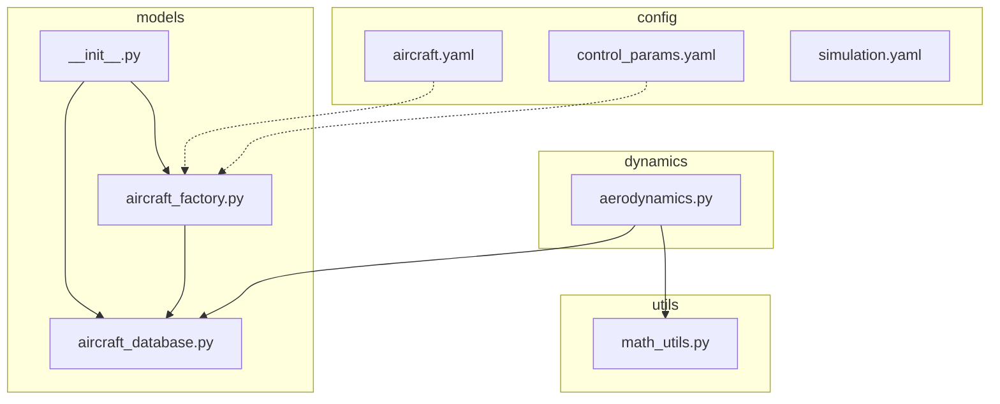
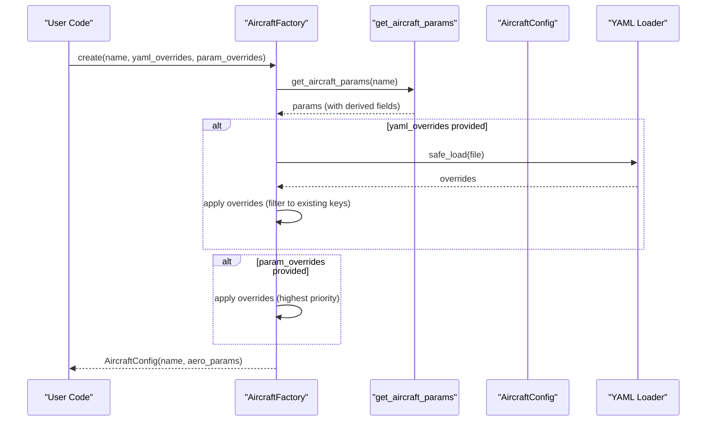
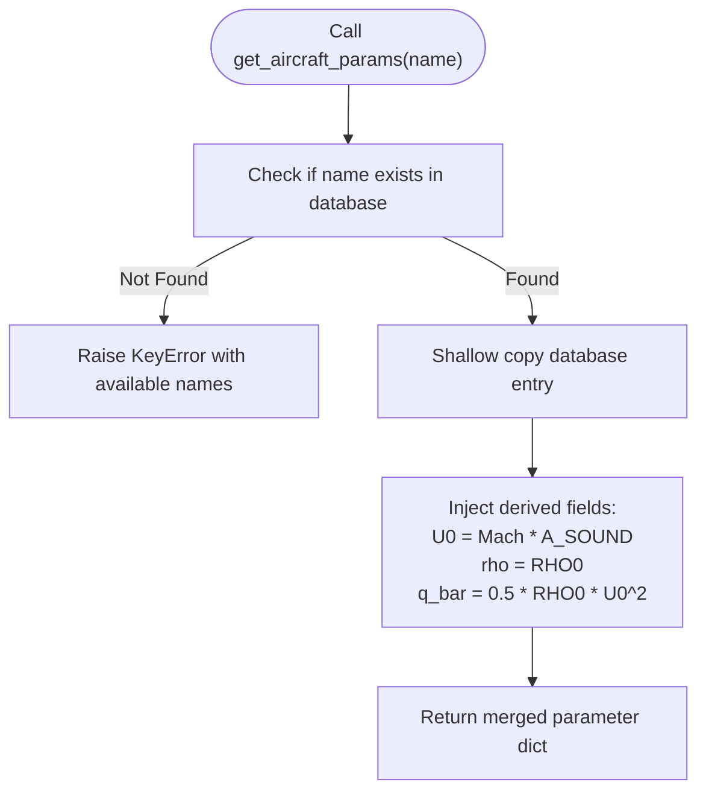
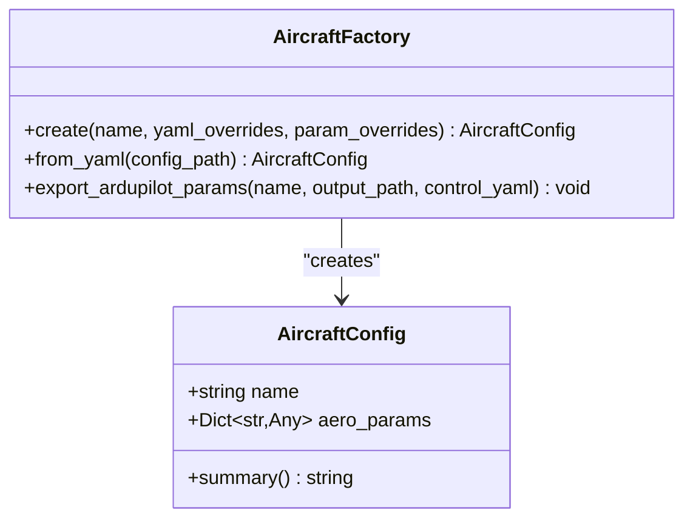
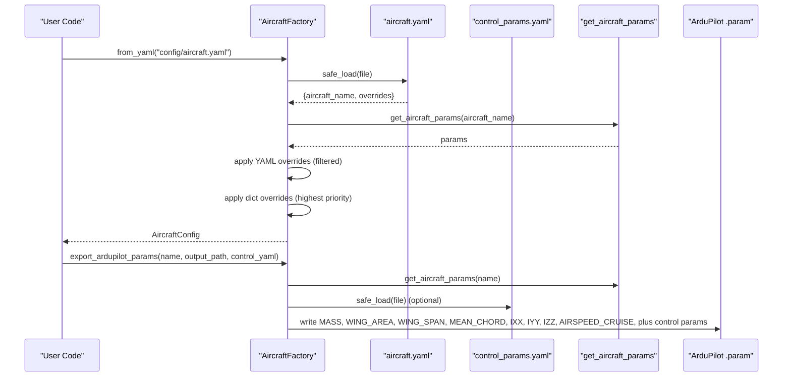
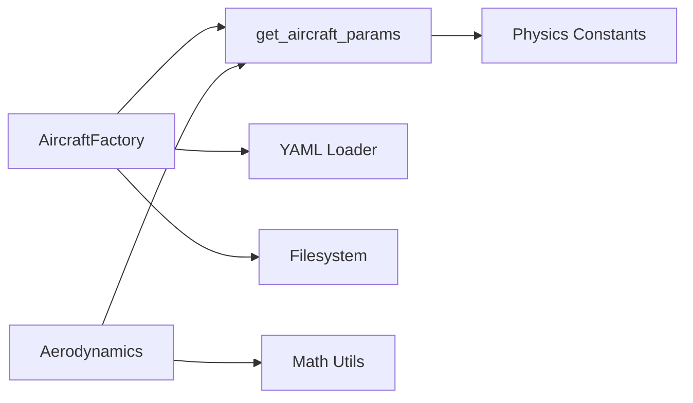

# Models API

<cite>
**Referenced Files in This Document**
- [aircraft_database.py](file://src/models/aircraft_database.py)
- [aircraft_factory.py](file://src/models/aircraft_factory.py)
- [__init__.py](file://src/models/__init__.py)
- [aircraft.yaml](file://config/aircraft.yaml)
- [control_params.yaml](file://config/control_params.yaml)
- [simulation.yaml](file://config/simulation.yaml)
- [aerodynamics.py](file://src/dynamics/aerodynamics.py)
- [math_utils.py](file://src/utils/math_utils.py)
</cite>

## Table of Contents
1. [Introduction](#introduction)
2. [Project Structure](#project-structure)
3. [Core Components](#core-components)
4. [Architecture Overview](#architecture-overview)
5. [Detailed Component Analysis](#detailed-component-analysis)
6. [Dependency Analysis](#dependency-analysis)
7. [Performance Considerations](#performance-considerations)
8. [Troubleshooting Guide](#troubleshooting-guide)
9. [Conclusion](#conclusion)
10. [Appendices](#appendices)

## Introduction
This document provides comprehensive API documentation for the aircraft modeling module. It covers the AircraftDatabase-like capabilities exposed by the aircraft parameter database, the AircraftFactory class for configuration creation and parameter overrides, and the aircraft configuration classes used throughout the simulation. It also documents parameter schemas, validation rules, and error handling for aircraft configuration operations.

## Project Structure
The aircraft modeling module resides under src/models and exposes public functions and classes for aircraft parameter access and configuration management. Configuration files under config define aircraft selection and optional overrides.

**Diagram sources**
- [aircraft_database.py](file://src/models/aircraft_database.py#L1-L183)
- [aircraft_factory.py](file://src/models/aircraft_factory.py#L1-L136)
- [__init__.py](file://src/models/__init__.py#L1-L15)
- [aircraft.yaml](file://config/aircraft.yaml#L1-L13)
- [control_params.yaml](file://config/control_params.yaml#L1-L45)
- [simulation.yaml](file://config/simulation.yaml#L1-L30)
- [aerodynamics.py](file://src/dynamics/aerodynamics.py#L1-L88)
- [math_utils.py](file://src/utils/math_utils.py#L1-L124)

**Section sources**
- [aircraft_database.py](file://src/models/aircraft_database.py#L1-L183)
- [aircraft_factory.py](file://src/models/aircraft_factory.py#L1-L136)
- [__init__.py](file://src/models/__init__.py#L1-L15)
- [aircraft.yaml](file://config/aircraft.yaml#L1-L13)
- [control_params.yaml](file://config/control_params.yaml#L1-L45)
- [simulation.yaml](file://config/simulation.yaml#L1-L30)
- [aerodynamics.py](file://src/dynamics/aerodynamics.py#L1-L88)
- [math_utils.py](file://src/utils/math_utils.py#L1-L124)

## Core Components
- Aircraft parameter database functions:
  - get_aircraft_params(name): Retrieve a complete parameter dictionary for an aircraft, injecting derived fields used by the dynamics engine.
  - list_aircraft(): Return a list of all aircraft names in the database.
  - aircraft_info(name): Return a human-readable summary string for an aircraft.
  - AIRCRAFT_NAMES: A constant list of valid aircraft names.
- Aircraft configuration classes and factory:
  - AircraftConfig: A dataclass representing a combined aircraft configuration with name and aero_params.
  - AircraftFactory: Static methods to create configurations from database defaults, YAML overrides, and parameter dictionaries; export ArduPilot parameters.

Key method signatures and responsibilities:
- get_aircraft_params(name: str) -> Dict[str, Any]: Returns a parameter dictionary with derived fields injected.
- list_aircraft() -> List[str]: Returns the list of aircraft names.
- aircraft_info(name: str) -> str: Returns a formatted summary string.
- AircraftFactory.create(name: str, yaml_overrides: Optional[str], param_overrides: Optional[Dict[str, Any]]) -> AircraftConfig: Builds a configuration merging database defaults with optional overrides.
- AircraftFactory.from_yaml(config_path: str) -> AircraftConfig: Creates a configuration from an aircraft.yaml file.
- AircraftFactory.export_ardupilot_params(name: str, output_path: str, control_yaml: Optional[str]) -> None: Exports aircraft and control parameters in ArduPilot .param format.

**Section sources**
- [aircraft_database.py](file://src/models/aircraft_database.py#L143-L182)
- [aircraft_factory.py](file://src/models/aircraft_factory.py#L15-L136)
- [__init__.py](file://src/models/__init__.py#L3-L14)

## Architecture Overview
The aircraft modeling module integrates with the aerodynamics subsystem and math utilities. The factory merges database parameters with optional overrides and exports ArduPilot-compatible parameter sets.

**Diagram sources**
- [aircraft_factory.py](file://src/models/aircraft_factory.py#L42-L74)
- [aircraft_database.py](file://src/models/aircraft_database.py#L143-L166)

## Detailed Component Analysis

### Aircraft Parameter Access (Database-like)
The database-like interface provides aircraft parameter retrieval and listing utilities.

- get_aircraft_params(name: str) -> Dict[str, Any]
  - Purpose: Return the complete parameter dictionary for an aircraft and inject derived fields used by the dynamics engine.
  - Derived fields: U0 (true airspeed), rho (air density), q_bar (dynamic pressure).
  - Error handling: Raises KeyError if name is not present in the database.
  - Typical usage: Supply to aerodynamics computations and simulation initialization.

- list_aircraft() -> List[str]
  - Purpose: Return the list of all aircraft names available in the database.

- aircraft_info(name: str) -> str
  - Purpose: Return a human-readable summary string containing aircraft metadata and key parameters.

- AIRCRAFT_NAMES: List[str]
  - Purpose: Convenience list of valid aircraft names.

**Diagram sources**
- [aircraft_database.py](file://src/models/aircraft_database.py#L143-L166)

**Section sources**
- [aircraft_database.py](file://src/models/aircraft_database.py#L143-L182)

### AircraftFactory and AircraftConfig
The factory creates and manages aircraft configurations with optional overrides and exports ArduPilot parameters.

- AircraftConfig
  - Fields:
    - name: str
    - aero_params: Dict[str, Any]
  - Methods:
    - summary() -> str: Returns a formatted summary string of key parameters.

- AircraftFactory
  - Static methods:
    - create(name: str, yaml_overrides: Optional[str], param_overrides: Optional[Dict[str, Any]]) -> AircraftConfig
      - Merge database defaults with optional YAML and dictionary overrides.
      - Only keys present in the base parameters are accepted from overrides.
      - Highest priority: param_overrides.
    - from_yaml(config_path: str) -> AircraftConfig
      - Load configuration from an aircraft.yaml file; extracts aircraft_name and optional overrides.
    - export_ardupilot_params(name: str, output_path: str, control_yaml: Optional[str]) -> None
      - Export aircraft physical parameters and optional control parameters to ArduPilot .param format.

**Diagram sources**
- [aircraft_factory.py](file://src/models/aircraft_factory.py#L15-L136)

**Section sources**
- [aircraft_factory.py](file://src/models/aircraft_factory.py#L15-L136)

### Parameter Retrieval and Selection
- Aircraft selection:
  - From database: Use list_aircraft() to enumerate available aircraft names.
  - From configuration file: Use from_yaml() to load an aircraft.yaml file.
- Parameter retrieval:
  - Use get_aircraft_params(name) to obtain a parameter dictionary suitable for simulation engines.
  - Use aircraft_info(name) for human-readable summaries.

**Section sources**
- [aircraft_database.py](file://src/models/aircraft_database.py#L169-L182)
- [aircraft_factory.py](file://src/models/aircraft_factory.py#L77-L92)
- [aircraft.yaml](file://config/aircraft.yaml#L1-L13)

### Configuration Management
- YAML-based configuration:
  - aircraft.yaml defines aircraft_name and optional overrides.
  - Overrides are applied after loading database defaults and before dictionary overrides.
- Parameter override precedence:
  - Database defaults
  - YAML overrides (filtered to existing keys)
  - Dictionary overrides (highest priority)
- ArduPilot parameter export:
  - export_ardupilot_params writes aircraft physical parameters and optional control parameters to a .param file.

**Diagram sources**
- [aircraft_factory.py](file://src/models/aircraft_factory.py#L77-L136)
- [aircraft.yaml](file://config/aircraft.yaml#L1-L13)
- [control_params.yaml](file://config/control_params.yaml#L1-L45)

**Section sources**
- [aircraft_factory.py](file://src/models/aircraft_factory.py#L42-L136)
- [aircraft.yaml](file://config/aircraft.yaml#L1-L13)
- [control_params.yaml](file://config/control_params.yaml#L1-L45)

### Parameter Schema and Validation
- Aircraft parameter schema (subset used by the simulation):
  - Identification: name, company, country
  - Geometry/inertia: mass, S (wing area), c (mean chord), b (span), Ixx, Iyy, Izz, Ixz
  - Longitudinal aerodynamics: CL_0, CL_alpha, CL_q, CL_deltae, CL_u, CD_0, CD_alpha, CD_q, CD_deltae, CD_u, Cm_0, Cm_alpha, Cm_q, Cm_deltae, Cm_u
  - Lateral-directional aerodynamics: CYb, CYp, CYr, CYda, CYdr, Clb, Clp, Clr, Clda, Cldr, Cnb, Cnp, Cnr, Cnda, Cndr
  - Derived fields injected by get_aircraft_params: U0, rho, q_bar
- Validation and error handling:
  - get_aircraft_params raises KeyError if name is not found.
  - AircraftFactory.create filters overrides to keys present in the base parameters.
  - export_ardupilot_params writes parameters to a .param file; no runtime validation is performed during export.

Notes on usage with aerodynamics:
- The aerodynamics module expects parameters to include S, c, b, U0, and aerodynamic coefficients.
- Dynamic pressure q_bar is computed internally by aerodynamics using rho and airspeed.

**Section sources**
- [aircraft_database.py](file://src/models/aircraft_database.py#L29-L133)
- [aircraft_database.py](file://src/models/aircraft_database.py#L143-L166)
- [aerodynamics.py](file://src/dynamics/aerodynamics.py#L35-L88)
- [math_utils.py](file://src/utils/math_utils.py#L121-L124)

## Dependency Analysis
- AircraftFactory depends on:
  - get_aircraft_params from aircraft_database.py
  - YAML parsing for configuration files
  - filesystem operations for exporting parameters
- get_aircraft_params depends on:
  - Internal constants for physics and atmospheric conditions
  - Injection of derived fields for dynamics computation
- Aerodynamics module depends on:
  - Parameter dictionary containing S, c, b, U0, and aerodynamic coefficients
  - Math utilities for angle and dynamic pressure computations

**Diagram sources**
- [aircraft_factory.py](file://src/models/aircraft_factory.py#L1-L136)
- [aircraft_database.py](file://src/models/aircraft_database.py#L1-L183)
- [aerodynamics.py](file://src/dynamics/aerodynamics.py#L1-L88)
- [math_utils.py](file://src/utils/math_utils.py#L1-L124)

**Section sources**
- [aircraft_factory.py](file://src/models/aircraft_factory.py#L1-L136)
- [aircraft_database.py](file://src/models/aircraft_database.py#L1-L183)
- [aerodynamics.py](file://src/dynamics/aerodynamics.py#L1-L88)
- [math_utils.py](file://src/utils/math_utils.py#L1-L124)

## Performance Considerations
- Parameter retrieval is O(1) dictionary access with minimal overhead.
- Derived fields injection is constant-time arithmetic.
- YAML loading occurs only when configuration files are provided; avoid unnecessary file I/O by passing param_overrides directly when possible.
- Exporting ArduPilot parameters performs a single pass over the parameter set; keep the number of exported parameters reasonable.

## Troubleshooting Guide
Common issues and resolutions:
- Aircraft name not found:
  - Symptom: KeyError raised by get_aircraft_params.
  - Resolution: Verify the name exists in AIRCRAFT_NAMES or use list_aircraft() to enumerate valid names.
- Invalid YAML file path:
  - Symptom: FileNotFoundError or unexpected behavior when using from_yaml or export_ardupilot_params.
  - Resolution: Ensure the path exists and is readable; confirm the file contains aircraft_name and optional overrides.
- Unexpected parameter overrides:
  - Symptom: Overrides not applied.
  - Resolution: Ensure override keys match existing keys in the base parameter dictionary; dictionary overrides take highest priority.
- Missing derived fields:
  - Symptom: Dynamics computations require U0, rho, q_bar.
  - Resolution: Use get_aircraft_params to retrieve parameters; these fields are injected automatically.

**Section sources**
- [aircraft_database.py](file://src/models/aircraft_database.py#L143-L166)
- [aircraft_factory.py](file://src/models/aircraft_factory.py#L64-L74)
- [aircraft_factory.py](file://src/models/aircraft_factory.py#L87-L92)
- [aircraft_factory.py](file://src/models/aircraft_factory.py#L123-L133)

## Conclusion
The aircraft modeling module provides a clean API for aircraft parameter access, configuration creation, and ArduPilot parameter export. AircraftFactory offers flexible override mechanisms, while get_aircraft_params ensures derived fields are available for dynamics computations. The configuration files enable easy selection and customization of aircraft parameters for simulations.

## Appendices

### API Reference Summary
- Aircraft parameter access:
  - get_aircraft_params(name: str) -> Dict[str, Any]
  - list_aircraft() -> List[str]
  - aircraft_info(name: str) -> str
  - AIRCRAFT_NAMES: List[str]
- Aircraft configuration:
  - AircraftConfig(name: str, aero_params: Dict[str, Any])
  - AircraftFactory.create(name: str, yaml_overrides: Optional[str], param_overrides: Optional[Dict[str, Any]]) -> AircraftConfig
  - AircraftFactory.from_yaml(config_path: str) -> AircraftConfig
  - AircraftFactory.export_ardupilot_params(name: str, output_path: str, control_yaml: Optional[str]) -> None

**Section sources**
- [aircraft_database.py](file://src/models/aircraft_database.py#L143-L182)
- [aircraft_factory.py](file://src/models/aircraft_factory.py#L15-L136)
- [__init__.py](file://src/models/__init__.py#L3-L14)