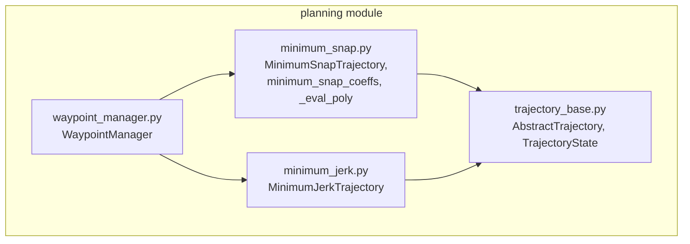
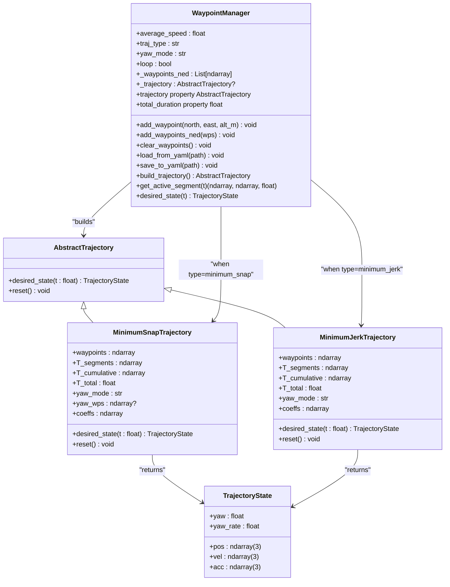
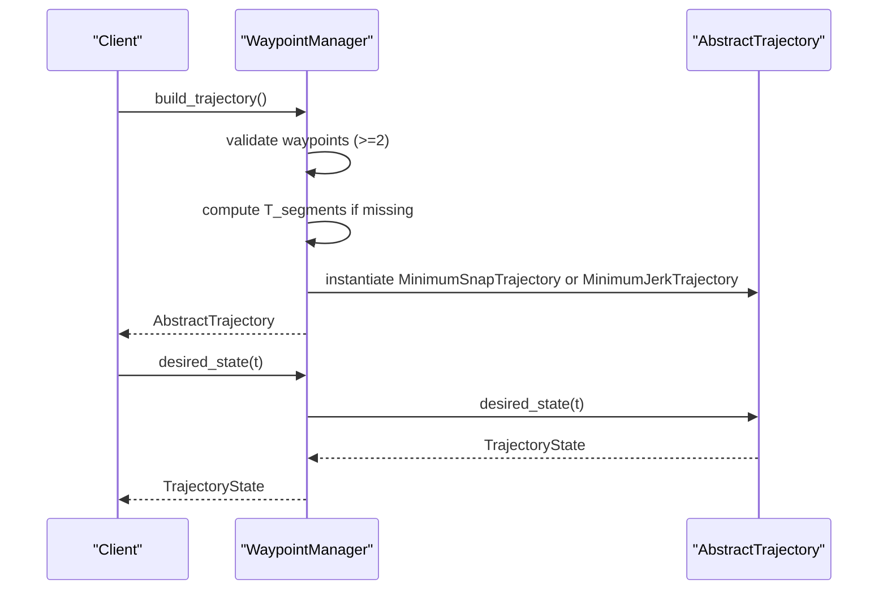
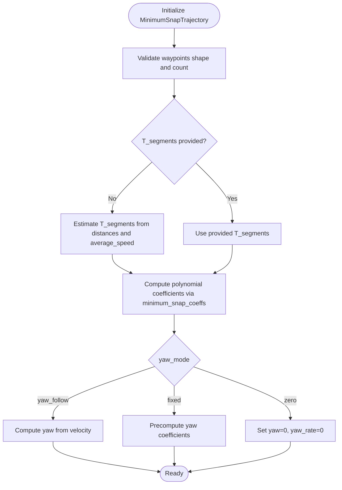
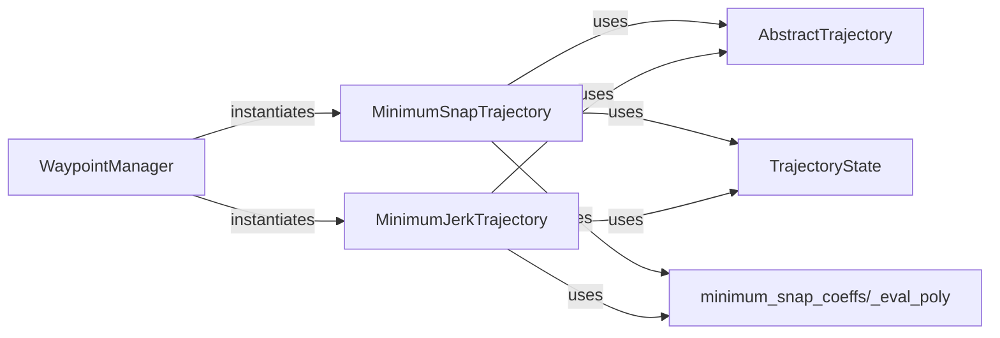

# Planning API

<cite>
**Referenced Files in This Document**
- [src/planning/__init__.py](file://src/planning/__init__.py)
- [src/planning/waypoint_manager.py](file://src/planning/waypoint_manager.py)
- [src/planning/minimum_jerk.py](file://src/planning/minimum_jerk.py)
- [src/planning/minimum_snap.py](file://src/planning/minimum_snap.py)
- [src/planning/trajectory_base.py](file://src/planning/trajectory_base.py)
- [tests/test_planning.py](file://tests/test_planning.py)
- [examples/3_trajectory_tracking.py](file://examples/3_trajectory_tracking.py)
- [config/trajectory.yaml](file://config/trajectory.yaml)
</cite>

## Table of Contents
1. [Introduction](#introduction)
2. [Project Structure](#project-structure)
3. [Core Components](#core-components)
4. [Architecture Overview](#architecture-overview)
5. [Detailed Component Analysis](#detailed-component-analysis)
6. [Dependency Analysis](#dependency-analysis)
7. [Performance Considerations](#performance-considerations)
8. [Troubleshooting Guide](#troubleshooting-guide)
9. [Conclusion](#conclusion)
10. [Appendices](#appendices)

## Introduction
This document provides detailed API documentation for the trajectory planning and waypoint management module. It covers:
- WaypointManager: waypoint storage, mission configuration, and trajectory factory
- MinimumSnapTrajectory and MinimumJerkTrajectory: polynomial trajectory generation with smoothness optimization
- AbstractTrajectory and TrajectoryState: base classes and state representation
- Utilities for trajectory evaluation and waypoint manipulation
- Method signatures for mission planning, trajectory generation, and waypoint processing

The module supports fixed-wing missions with NED coordinates, configurable yaw modes, and either minimum-snap or minimum-jerk smoothness criteria.

## Project Structure
The planning module resides under src/planning and exposes a clean public API via __init__.py. The key files are:
- trajectory_base.py: AbstractTrajectory and TrajectoryState
- minimum_snap.py: MinimumSnapTrajectory and polynomial solver
- minimum_jerk.py: MinimumJerkTrajectory built on the same solver
- waypoint_manager.py: Mission builder and waypoint manager
- tests/test_planning.py: Unit tests validating behavior
- examples/3_trajectory_tracking.py: Example usage in AUTO mode
- config/trajectory.yaml: Sample configuration for waypoints and trajectory parameters

**Diagram sources**
- [src/planning/waypoint_manager.py](file://src/planning/waypoint_manager.py#L20-L208)
- [src/planning/minimum_snap.py](file://src/planning/minimum_snap.py#L167-L253)
- [src/planning/minimum_jerk.py](file://src/planning/minimum_jerk.py#L17-L71)
- [src/planning/trajectory_base.py](file://src/planning/trajectory_base.py#L16-L47)

**Section sources**
- [src/planning/__init__.py](file://src/planning/__init__.py#L1-L14)
- [src/planning/waypoint_manager.py](file://src/planning/waypoint_manager.py#L1-L208)
- [src/planning/minimum_snap.py](file://src/planning/minimum_snap.py#L1-L253)
- [src/planning/minimum_jerk.py](file://src/planning/minimum_jerk.py#L1-L71)
- [src/planning/trajectory_base.py](file://src/planning/trajectory_base.py#L1-L47)

## Core Components
- AbstractTrajectory: Defines the desired_state(t) interface and reset() hook
- TrajectoryState: Immutable dataclass holding position, velocity, acceleration, yaw, and yaw_rate
- MinimumSnapTrajectory: Piecewise polynomial trajectory with minimum-snap smoothness; supports yaw_follow, fixed yaw via yaw_waypoints, and optional stop-at-waypoints
- MinimumJerkTrajectory: Specialization of minimum-snap with deriv_order=3 (5th-order polynomials per segment)
- WaypointManager: Stores NED waypoints, computes segment times from average_speed, builds trajectories, and provides active segment access

Key method signatures (paths only):
- AbstractTrajectory.desired_state(t: float) -> TrajectoryState
- TrajectoryState fields: pos (3), vel (3), acc (3), yaw (float), yaw_rate (float)
- MinimumSnapTrajectory.__init__(waypoints, T_segments=None, average_speed=30.0, yaw_mode="yaw_follow", yaw_waypoints=None, stop_at_waypoints=False)
- MinimumJerkTrajectory.__init__(waypoints, T_segments=None, average_speed=30.0, yaw_mode="yaw_follow", stop_at_waypoints=False)
- WaypointManager.__init__(average_speed=30.0, traj_type="minimum_snap", yaw_mode="yaw_follow", loop=False)
- WaypointManager.add_waypoint(north: float, east: float, alt_m: float) -> None
- WaypointManager.add_waypoints_ned(wps: np.ndarray) -> None
- WaypointManager.clear_waypoints() -> None
- WaypointManager.load_from_yaml(path: str) -> None
- WaypointManager.save_to_yaml(path: str) -> None
- WaypointManager.build_trajectory() -> AbstractTrajectory
- WaypointManager.trajectory property -> AbstractTrajectory
- WaypointManager.total_duration property -> float
- WaypointManager.get_active_segment(t: float) -> Tuple[np.ndarray, np.ndarray, float]
- WaypointManager.desired_state(t: float) -> TrajectoryState

**Section sources**
- [src/planning/trajectory_base.py](file://src/planning/trajectory_base.py#L16-L47)
- [src/planning/minimum_snap.py](file://src/planning/minimum_snap.py#L167-L253)
- [src/planning/minimum_jerk.py](file://src/planning/minimum_jerk.py#L17-L71)
- [src/planning/waypoint_manager.py](file://src/planning/waypoint_manager.py#L20-L208)

## Architecture Overview
The planning system composes a WaypointManager that orchestrates trajectory creation and evaluation. WaypointManager delegates to either MinimumSnapTrajectory or MinimumJerkTrajectory depending on configuration. Both derive from AbstractTrajectory and share a common state representation via TrajectoryState.

**Diagram sources**
- [src/planning/trajectory_base.py](file://src/planning/trajectory_base.py#L16-L47)
- [src/planning/minimum_snap.py](file://src/planning/minimum_snap.py#L167-L253)
- [src/planning/minimum_jerk.py](file://src/planning/minimum_jerk.py#L17-L71)
- [src/planning/waypoint_manager.py](file://src/planning/waypoint_manager.py#L20-L208)

## Detailed Component Analysis

### WaypointManager
Responsibilities:
- Store waypoints in NED coordinates (positive-up altitudes converted to negative-down internally)
- Compute segment durations from average_speed when not provided
- Build and cache trajectory instances
- Provide active segment access and convenience desired_state delegation

Public methods and properties:
- add_waypoint(north, east, alt_m) -> None
- add_waypoints_ned(wps) -> None
- clear_waypoints() -> None
- load_from_yaml(path) -> None
- save_to_yaml(path) -> None
- build_trajectory() -> AbstractTrajectory
- trajectory property -> AbstractTrajectory
- total_duration property -> float
- get_active_segment(t) -> (wp_start, wp_end, T_remaining)
- desired_state(t) -> TrajectoryState

Behavior highlights:
- Altitude conversion: alt_m (positive-up) stored as NED down (-alt_m)
- Loop support: when loop=True, last waypoint equals first waypoint after conversion
- Segment time estimation: T_segments[i] = max(norm(diff(wp[i+1], wp[i])) / avg_speed, 0.5)
- Trajectory caching: build_trajectory invalidates previous cached trajectory

**Diagram sources**
- [src/planning/waypoint_manager.py](file://src/planning/waypoint_manager.py#L127-L167)
- [src/planning/minimum_snap.py](file://src/planning/minimum_snap.py#L181-L253)
- [src/planning/minimum_jerk.py](file://src/planning/minimum_jerk.py#L24-L71)

**Section sources**
- [src/planning/waypoint_manager.py](file://src/planning/waypoint_manager.py#L20-L208)
- [tests/test_planning.py](file://tests/test_planning.py#L252-L328)

### MinimumSnapTrajectory
Responsibilities:
- Construct piecewise polynomials for NED position and optional yaw
- Enforce boundary conditions and continuity across segments
- Support multiple smoothness criteria via deriv_order (4 for minimum-snap, 3 for minimum-jerk)
- Optional stop-at-waypoints to enforce zero velocity at intermediate waypoints
- Yaw computation modes: yaw_follow (NE-plane), fixed via yaw_waypoints, or zero

Constructor parameters:
- waypoints: (n, 3) NED positions
- T_segments: (n-1,) segment durations; if None, estimated from average_speed
- average_speed: m/s used for segment-time estimation
- yaw_mode: "yaw_follow" | "zero" | "fixed"
- yaw_waypoints: (n,) desired yaw at each waypoint (used when yaw_mode="fixed")
- stop_at_waypoints: bool to enforce zero velocity at intermediate waypoints

Evaluation:
- desired_state(t) returns TrajectoryState with pos, vel, acc, yaw, yaw_rate
- Yaw alignment: when yaw_mode="yaw_follow" and horizontal velocity > threshold, yaw = atan2(vel_y, vel_x)

**Diagram sources**
- [src/planning/minimum_snap.py](file://src/planning/minimum_snap.py#L181-L253)

**Section sources**
- [src/planning/minimum_snap.py](file://src/planning/minimum_snap.py#L167-L253)
- [tests/test_planning.py](file://tests/test_planning.py#L119-L186)

### MinimumJerkTrajectory
Responsibilities:
- Same interface as MinimumSnapTrajectory but with deriv_order=3 (5th-order polynomials)
- Reuses the same coefficient solver with deriv_order=3
- Supports the same segment-time estimation and yaw modes

Constructor parameters:
- waypoints: (n, 3) NED positions
- T_segments: (n-1,) segment durations; if None, estimated from average_speed
- average_speed: m/s used for segment-time estimation
- yaw_mode: "yaw_follow" | "zero" | "fixed"
- stop_at_waypoints: bool to enforce zero velocity at intermediate waypoints

Evaluation:
- desired_state(t) returns TrajectoryState with pos, vel, acc, yaw, yaw_rate
- Yaw alignment: when yaw_mode="yaw_follow" and horizontal velocity > threshold, yaw = atan2(vel_y, vel_x)

**Section sources**
- [src/planning/minimum_jerk.py](file://src/planning/minimum_jerk.py#L17-L71)
- [tests/test_planning.py](file://tests/test_planning.py#L189-L246)

### AbstractTrajectory and TrajectoryState
Responsibilities:
- AbstractTrajectory defines the desired_state interface and reset hook
- TrajectoryState encapsulates the state vector and scalar yaw/yaw_rate

Data model:
- TrajectoryState fields: pos (3), vel (3), acc (3), yaw (float), yaw_rate (float)

**Section sources**
- [src/planning/trajectory_base.py](file://src/planning/trajectory_base.py#L16-L47)

### Polynomial Solver and Utilities
- minimum_snap_coeffs(waypoints, T_segments, deriv_order, stop_at_waypoints) -> coefficients
- _eval_poly(coeffs_seg, t_local, deriv) -> value
- _get_poly_cc(n, k, t) -> coefficient vector

Solver characteristics:
- Builds a linear system A @ x = b enforcing boundary conditions, continuity, and optional stop constraints
- Uses least-squares fallback when the system is ill-conditioned
- Returns coefficients per segment per dimension

**Section sources**
- [src/planning/minimum_snap.py](file://src/planning/minimum_snap.py#L47-L165)

## Dependency Analysis
- WaypointManager depends on AbstractTrajectory, MinimumSnapTrajectory, and MinimumJerkTrajectory
- MinimumSnapTrajectory depends on AbstractTrajectory and minimum_snap_coeffs
- MinimumJerkTrajectory depends on AbstractTrajectory and reuses minimum_snap_coeffs with deriv_order=3
- All trajectories depend on TrajectoryState for output

**Diagram sources**
- [src/planning/waypoint_manager.py](file://src/planning/waypoint_manager.py#L127-L167)
- [src/planning/minimum_snap.py](file://src/planning/minimum_snap.py#L181-L253)
- [src/planning/minimum_jerk.py](file://src/planning/minimum_jerk.py#L24-L71)
- [src/planning/trajectory_base.py](file://src/planning/trajectory_base.py#L16-L47)

**Section sources**
- [src/planning/waypoint_manager.py](file://src/planning/waypoint_manager.py#L1-L208)
- [src/planning/minimum_snap.py](file://src/planning/minimum_snap.py#L1-L253)
- [src/planning/minimum_jerk.py](file://src/planning/minimum_jerk.py#L1-L71)
- [src/planning/trajectory_base.py](file://src/planning/trajectory_base.py#L1-L47)

## Performance Considerations
- Segment-time estimation: T_segments[i] = max(norm(diff(wp[i+1], wp[i])) / avg_speed, 0.5) ensures minimal segment durations and avoids numerical issues
- Coefficient solver stability: The solver detects ill-conditioned matrices and falls back to least-squares; very long segments can still produce large coefficients but remain finite
- Memory footprint: Coefficients are precomputed per segment; trajectory evaluation is O(1) per segment lookup plus polynomial evaluation
- Yaw computation: Avoids trigonometric overhead by computing yaw only when velocity magnitude exceeds a small threshold

[No sources needed since this section provides general guidance]

## Troubleshooting Guide
Common issues and resolutions:
- Fewer than two waypoints: WaypointManager.build_trajectory raises a ValueError; ensure at least two waypoints are added
- Unknown trajectory type: WaypointManager.build_trajectory raises ValueError for unsupported traj_type
- YAML load/save: load_from_yaml requires a valid file path; save_to_yaml creates parent directories as needed
- Loop closure: When loop=True, the last waypoint is compared to the first; if not equal, the path is closed by appending the first waypoint
- Segment estimation: Very short average_speed or tiny waypoint distances can lead to short segments; the estimator clamps to a minimum segment time

Validation references:
- WaypointManager.add_waypoint altitude conversion and YAML round-trip tests
- WaypointManager.get_active_segment correctness
- MinimumSnapTrajectory and MinimumJerkTrajectory position and continuity checks

**Section sources**
- [tests/test_planning.py](file://tests/test_planning.py#L252-L328)
- [src/planning/waypoint_manager.py](file://src/planning/waypoint_manager.py#L80-L122)

## Conclusion
The planning module provides a robust, extensible framework for fixed-wing trajectory planning:
- WaypointManager offers a simple API for mission definition and trajectory instantiation
- MinimumSnapTrajectory and MinimumJerkTrajectory deliver smooth, continuous trajectories with configurable yaw behavior
- AbstractTrajectory and TrajectoryState define a consistent interface for downstream systems
- Utilities and tests ensure numerical stability and correctness across diverse scenarios

[No sources needed since this section summarizes without analyzing specific files]

## Appendices

### API Reference Summary
- WaypointManager
  - add_waypoint(north, east, alt_m) -> None
  - add_waypoints_ned(wps) -> None
  - clear_waypoints() -> None
  - load_from_yaml(path) -> None
  - save_to_yaml(path) -> None
  - build_trajectory() -> AbstractTrajectory
  - trajectory property -> AbstractTrajectory
  - total_duration property -> float
  - get_active_segment(t) -> (ndarray, ndarray, float)
  - desired_state(t) -> TrajectoryState

- MinimumSnapTrajectory
  - __init__(waypoints, T_segments=None, average_speed=30.0, yaw_mode="yaw_follow", yaw_waypoints=None, stop_at_waypoints=False)
  - desired_state(t) -> TrajectoryState
  - reset() -> None

- MinimumJerkTrajectory
  - __init__(waypoints, T_segments=None, average_speed=30.0, yaw_mode="yaw_follow", stop_at_waypoints=False)
  - desired_state(t) -> TrajectoryState
  - reset() -> None

- AbstractTrajectory
  - desired_state(t) -> TrajectoryState
  - reset() -> None

- TrajectoryState fields
  - pos: ndarray(3)
  - vel: ndarray(3)
  - acc: ndarray(3)
  - yaw: float
  - yaw_rate: float

- Utilities
  - minimum_snap_coeffs(waypoints, T_segments, deriv_order, stop_at_waypoints) -> coefficients
  - _eval_poly(coeffs_seg, t_local, deriv) -> value
  - _get_poly_cc(n, k, t) -> coefficient vector

**Section sources**
- [src/planning/waypoint_manager.py](file://src/planning/waypoint_manager.py#L20-L208)
- [src/planning/minimum_snap.py](file://src/planning/minimum_snap.py#L167-L253)
- [src/planning/minimum_jerk.py](file://src/planning/minimum_jerk.py#L17-L71)
- [src/planning/trajectory_base.py](file://src/planning/trajectory_base.py#L16-L47)

### Usage Examples
- Example usage in AUTO mode with WaypointManager and FixedWingSimulator
- YAML configuration for waypoints and trajectory parameters

**Section sources**
- [examples/3_trajectory_tracking.py](file://examples/3_trajectory_tracking.py#L70-L98)
- [config/trajectory.yaml](file://config/trajectory.yaml#L1-L23)