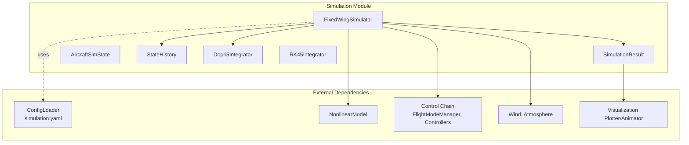
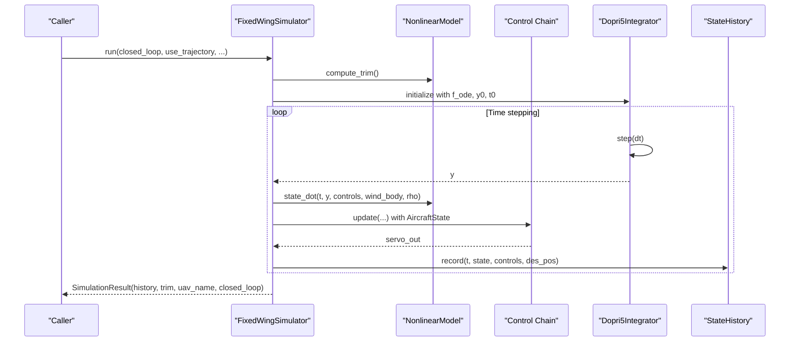
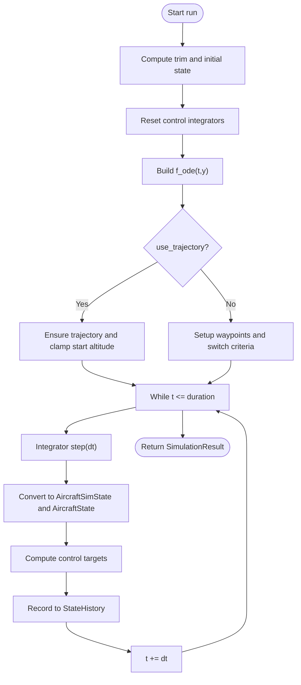
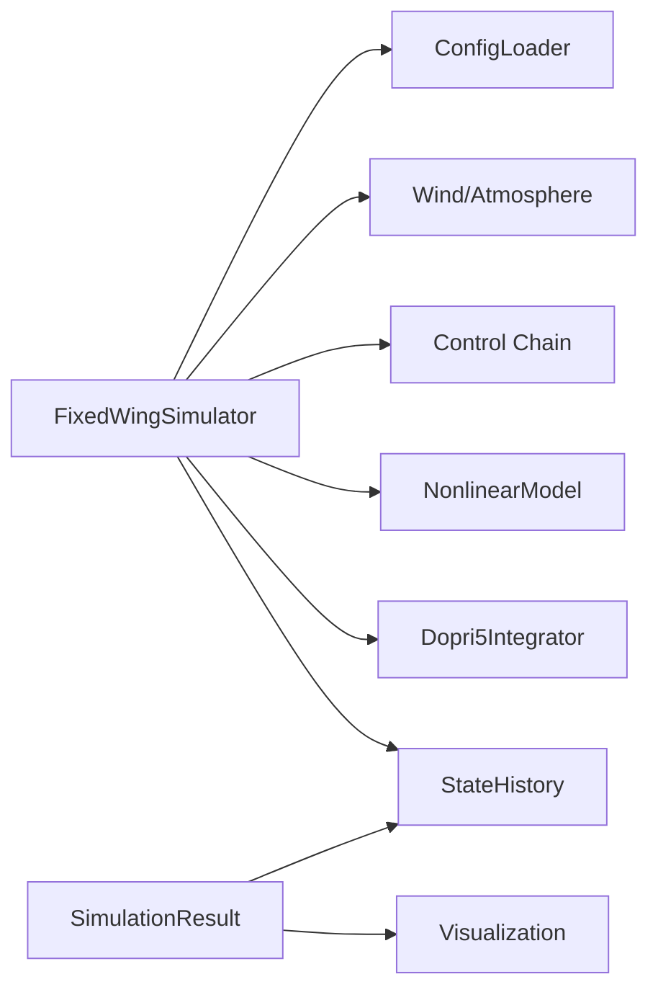

# Simulation API

<cite>
**Referenced Files in This Document**
- [simulator.py](file://src/simulation/simulator.py)
- [integrator.py](file://src/simulation/integrator.py)
- [state_manager.py](file://src/simulation/state_manager.py)
- [__init__.py](file://src/simulation/__init__.py)
- [simulation.yaml](file://config/simulation.yaml)
- [main.py](file://main.py)
- [test_integration.py](file://tests/test_integration.py)
- [1_linear_response.py](file://examples/1_linear_response.py)
- [2_nonlinear_dynamics.py](file://examples/2_nonlinear_dynamics.py)
- [3_trajectory_tracking.py](file://examples/3_trajectory_tracking.py)
</cite>

## Table of Contents
1. [Introduction](#introduction)
2. [Project Structure](#project-structure)
3. [Core Components](#core-components)
4. [Architecture Overview](#architecture-overview)
5. [Detailed Component Analysis](#detailed-component-analysis)
6. [Dependency Analysis](#dependency-analysis)
7. [Performance Considerations](#performance-considerations)
8. [Troubleshooting Guide](#troubleshooting-guide)
9. [Conclusion](#conclusion)
10. [Appendices](#appendices)

## Introduction
This document provides comprehensive API documentation for the FixedWingSimulator simulation module. It covers the main simulation engine, result containers, numerical integrators, and state management utilities. The goal is to help developers and researchers use the simulation APIs effectively, understand configuration options, and integrate the module into larger systems.

## Project Structure
The simulation module resides under src/simulation and exposes the following public classes and functions:
- FixedWingSimulator: Main simulation orchestrator with closed-loop and open-loop modes
- SimulationResult: Result container with convenience methods for summaries and visualization
- AircraftSimState: Immutable-like data container for 12-D state vectors with derived quantities
- StateHistory: Efficient pre-allocated history buffer for recording simulation data
- Dopri5Integrator: Real-time step-by-step integrator using Dormand-Prince (adaptive step size)
- RK45Integrator: Batch integrator using scipy’s solve_ivp (RK45)

**Diagram sources**
- [simulator.py](file://src/simulation/simulator.py#L115-L642)
- [integrator.py](file://src/simulation/integrator.py#L17-L108)
- [state_manager.py](file://src/simulation/state_manager.py#L16-L193)
- [__init__.py](file://src/simulation/__init__.py#L3-L11)

**Section sources**
- [__init__.py](file://src/simulation/__init__.py#L1-L12)

## Core Components
This section documents the primary classes and their public APIs with method signatures, parameters, return types, and practical usage notes.

### FixedWingSimulator
Main simulation engine orchestrating aircraft dynamics, environment, control, planning, and numerical integration.

- Constructor parameters:
  - aircraft_name: str (default "TB2"); selects aircraft from the database
  - config_dir: str (optional); path to config directory; defaults to project config
  - dt: float (default 0.01); simulation time step in seconds
  - duration: float (default 30.0); total simulation duration in seconds
  - initial_mode: str (default "AUTO"); initial flight mode
  - wind_type: str (default "NONE"); wind model selection
  - traj_type: str (default "minimum_snap"); trajectory planner type

- Public methods:
  - run(closed_loop: bool = True, use_trajectory: bool = True, wp_switch_dist: float = 60.0, loop_circuit: bool = False) -> SimulationResult
    - Executes a closed-loop or open-loop simulation loop
    - Returns a SimulationResult containing the full history and trim data
  - run_linear_analysis(pulses: Optional[List[Dict]] = None, duration: Optional[float] = None) -> LinearAnalysisResult
    - Runs 4-DOF linear open-loop analysis for modal response
  - init_step() -> AircraftSimState
    - Initializes the step-by-step simulation and returns initial state
  - step(dt: Optional[float] = None) -> AircraftSimState
    - Advances simulation by one time step and returns updated state

- Configuration and behavior:
  - Loads simulation settings from simulation.yaml
  - Supports ArduPilot-compatible control chain (navigation, attitude, rate, servo)
  - Integrates with Wind and Atmosphere models
  - Uses WaypointManager for trajectory generation

- Practical usage examples:
  - See examples/1_linear_response.py, examples/2_nonlinear_dynamics.py, examples/3_trajectory_tracking.py
  - Command-line entry point usage in main.py

**Section sources**
- [simulator.py](file://src/simulation/simulator.py#L115-L642)
- [simulation.yaml](file://config/simulation.yaml#L1-L30)
- [1_linear_response.py](file://examples/1_linear_response.py#L132-L144)
- [2_nonlinear_dynamics.py](file://examples/2_nonlinear_dynamics.py#L130-L139)
- [3_trajectory_tracking.py](file://examples/3_trajectory_tracking.py#L73-L98)
- [main.py](file://main.py#L114-L140)

### SimulationResult
Container wrapping simulation history and trim data with convenience methods.

- Constructor parameters:
  - history: StateHistory
  - trim: TrimResult
  - uav_name: str
  - closed_loop: bool

- Methods:
  - summary() -> str
    - Returns a formatted summary string with trim speed, duration, mode, final altitude/speed, and track
  - visualize(show: bool = True) -> None
    - Attempts to import visualization modules and displays 2D/3D plots and animations

- Practical usage:
  - Access recorded data via history.to_dict()
  - Save CSV via history.to_csv()

**Section sources**
- [simulator.py](file://src/simulation/simulator.py#L59-L110)

### AircraftSimState
Immutable-like data container for the 12-D state vector plus derived quantities.

- Fields:
  - u, v, w: body-frame velocities (m/s)
  - p, q, r: body-frame angular rates (rad/s)
  - phi, theta, psi: Euler angles (rad)
  - x_north, x_east, x_down: NED position (m)
  - alpha, beta: angle of attack and sideslip (rad)
  - airspeed: computed magnitude of velocity (m/s)
  - altitude: computed altitude above ground (m)

- Methods:
  - from_array(arr: np.ndarray) -> AircraftSimState
    - Creates state from a 12-D array
  - to_array() -> np.ndarray
    - Exports state as a 12-D array
  - pos_ned, vel_body, omega, euler: property helpers returning views

**Section sources**
- [state_manager.py](file://src/simulation/state_manager.py#L16-L93)

### StateHistory
Efficient pre-allocated history buffer for recording simulation data.

- Constructor parameters:
  - n_steps: int; expected number of time steps

- Methods:
  - record(t: float, state: AircraftSimState, elevator: float = 0.0, aileron: float = 0.0, rudder: float = 0.0, throttle: float = 0.0, des_pos: Optional[np.ndarray] = None) -> None
    - Records a single time step; ignores if buffer is full
  - trim() -> None
    - Removes unused tail of arrays to minimize memory footprint
  - get(key: str) -> np.ndarray
    - Returns a view of the recorded data for a given key
  - to_dict() -> Dict[str, np.ndarray]
    - Returns a dictionary of recorded arrays
  - to_csv(path: str) -> None
    - Exports history to CSV with STATE_KEYS header

- Keys recorded:
  - ["t", "u","v","w","p","q","r","phi","theta","psi","x_north","x_east","x_down","alpha","beta","airspeed","altitude","elevator","aileron","rudder","throttle","des_north","des_east","des_down"]

**Section sources**
- [state_manager.py](file://src/simulation/state_manager.py#L95-L193)

### Dopri5Integrator
Step-by-step integrator using scipy.integrate.ode with dopri5 (Dormand-Prince).

- Constructor parameters:
  - f: callable(t, y) -> dy/dt
  - y0: (n,) initial state
  - t0: float (default 0.0)
  - rtol: float (default 1e-6)
  - atol: float (default 1e-6)

- Methods:
  - step(dt: float) -> np.ndarray
    - Advances by dt seconds; returns new state vector
  - t: property -> float
    - Current integrator time
  - y: property -> np.ndarray
    - Current state vector
  - reset(y0: np.ndarray, t0: float = 0.0) -> None
    - Re-initialises the integrator

- Notes:
  - Supports adaptive step size while exposing a single-step API
  - Raises RuntimeError on integration failure

**Section sources**
- [integrator.py](file://src/simulation/integrator.py#L17-L71)

### RK45Integrator
Batch integrator using scipy.integrate.solve_ivp with RK45.

- Constructor parameters:
  - rtol: float (default 1e-6)
  - atol: float (default 1e-6)

- Methods:
  - integrate(f: callable, y0: np.ndarray, t_span: tuple, t_eval: Optional[np.ndarray] = None, max_step: float = 0.1) -> scipy.OdeResult
    - Integrates ODE over t_span; returns solution object with t and y attributes

- Notes:
  - Suitable for offline linear/nonlinear analysis where full history is needed
  - Uses RK45 method internally

**Section sources**
- [integrator.py](file://src/simulation/integrator.py#L73-L108)

## Architecture Overview
The FixedWingSimulator orchestrates a closed-loop control pipeline:
- Dynamics: NonlinearModel computes state derivatives
- Environment: Wind and atmosphere models provide density and wind vectors
- Control: FlightModeManager, NavigationController, AttitudeController, RateController, ServoMixer form the 5-layer ArduPilot-compatible chain
- Planning: WaypointManager generates trajectories
- Integration: Dopri5Integrator advances the ODE in real-time
- State Management: AircraftSimState and StateHistory persist and expose data

**Diagram sources**
- [simulator.py](file://src/simulation/simulator.py#L239-L567)
- [integrator.py](file://src/simulation/integrator.py#L50-L56)
- [state_manager.py](file://src/simulation/state_manager.py#L124-L168)

## Detailed Component Analysis

### FixedWingSimulator.run
Key behaviors:
- Computes trim and initializes control integrators
- Builds ODE function with wind and density computed at current altitude
- Supports two modes:
  - Trajectory mode: builds polynomial trajectory and tracks desired states
  - Circuit mode: waypoint sequencing with configurable switch distance and looping
- Records control surfaces and desired positions when available
- Handles integration errors and stops gracefully

**Diagram sources**
- [simulator.py](file://src/simulation/simulator.py#L239-L567)

**Section sources**
- [simulator.py](file://src/simulation/simulator.py#L239-L567)

### FixedWingSimulator.run_linear_analysis
- Provides backward-compatible 4-DOF linear analysis
- Defaults to a small elevator pulse if none provided
- Returns LinearAnalysisResult for modal analysis

**Section sources**
- [simulator.py](file://src/simulation/simulator.py#L571-L596)

### FixedWingSimulator.step-by-step API
- init_step: prepares integrator and returns initial state
- step: advances by dt and returns new state
- Designed for UI integration and external control loops

**Section sources**
- [simulator.py](file://src/simulation/simulator.py#L602-L641)

### SimulationResult.data access and visualization
- history.to_dict() returns all recorded arrays
- history.get(key) returns a view for a specific channel
- history.to_csv writes a CSV with all keys
- visualize attempts to import plotting/animator modules and renders plots

**Section sources**
- [simulator.py](file://src/simulation/simulator.py#L78-L110)
- [state_manager.py](file://src/simulation/state_manager.py#L176-L193)

### Numerical Integrators
- Dopri5Integrator mirrors a quadrotor integrator interface, enabling real-time stepping with adaptive step size
- RK45Integrator is suited for offline analysis and batch solves

**Section sources**
- [integrator.py](file://src/simulation/integrator.py#L17-L108)

### State Management
- AircraftSimState.from_array ensures consistent conversion from ODE state vectors
- StateHistory.record efficiently stores arrays and trims unused slots post-run

**Section sources**
- [state_manager.py](file://src/simulation/state_manager.py#L16-L193)

## Dependency Analysis
The simulation module composes several subsystems and maintains loose coupling through well-defined interfaces.

**Diagram sources**
- [simulator.py](file://src/simulation/simulator.py#L33-L52)
- [state_manager.py](file://src/simulation/state_manager.py#L95-L193)
- [integrator.py](file://src/simulation/integrator.py#L17-L108)

**Section sources**
- [simulator.py](file://src/simulation/simulator.py#L33-L52)

## Performance Considerations
- Time step dt affects accuracy and performance; smaller dt increases fidelity but costs computation
- Trajectory mode requires polynomial path generation; ensure reasonable average speeds and waypoint spacing
- Wind and atmosphere computations are evaluated per step; consider wind complexity for real-time performance
- StateHistory pre-allocates arrays; pass a reasonable n_steps to avoid repeated resizing
- Integration tolerances rtol/atol balance accuracy and stability; adjust for challenging regimes

[No sources needed since this section provides general guidance]

## Troubleshooting Guide
Common issues and remedies:
- Integration failures: Dopri5Integrator.step raises RuntimeError on failure; check dynamics and control inputs
- Non-finite states: Tests enforce finite altitude, airspeed, and pitch limits; investigate control saturation or extreme maneuvers
- Missing visualization: SimulationResult.visualize prints import errors; ensure visualization dependencies are installed
- Trajectory mismatch: Ensure initial waypoint altitude aligns with initial altitude; the simulator patches mismatches automatically

**Section sources**
- [simulator.py](file://src/simulation/simulator.py#L558-L562)
- [test_integration.py](file://tests/test_integration.py#L41-L58)
- [state_manager.py](file://src/simulation/state_manager.py#L176-L193)

## Conclusion
The FixedWingSimulator module provides a robust, extensible framework for fixed-wing UAV simulation with ArduPilot-compatible control and comprehensive data recording. Its APIs enable both interactive runs and programmatic integration, with clear separation between dynamics, control, planning, and visualization.

[No sources needed since this section summarizes without analyzing specific files]

## Appendices

### Configuration Options
- simulation.yaml controls:
  - dt, duration, integrator, rtol, atol
  - initial_position, initial_heading_deg
  - initial_mode
  - wind_type, wind_speed, wind_direction_deg
  - log_enabled, log_dir

**Section sources**
- [simulation.yaml](file://config/simulation.yaml#L1-L30)

### Practical Usage Examples
- Linear response and closed-loop comparison: examples/1_linear_response.py
- Nonlinear dynamics and PID stabilization: examples/2_nonlinear_dynamics.py
- Trajectory tracking in AUTO mode: examples/3_trajectory_tracking.py
- Command-line entry point: main.py demonstrates constructor usage and run modes

**Section sources**
- [1_linear_response.py](file://examples/1_linear_response.py#L132-L144)
- [2_nonlinear_dynamics.py](file://examples/2_nonlinear_dynamics.py#L130-L139)
- [3_trajectory_tracking.py](file://examples/3_trajectory_tracking.py#L73-L98)
- [main.py](file://main.py#L114-L140)