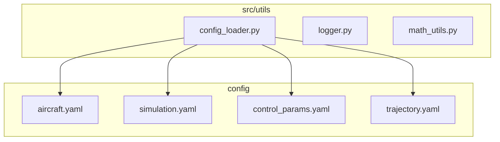
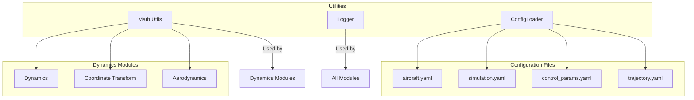
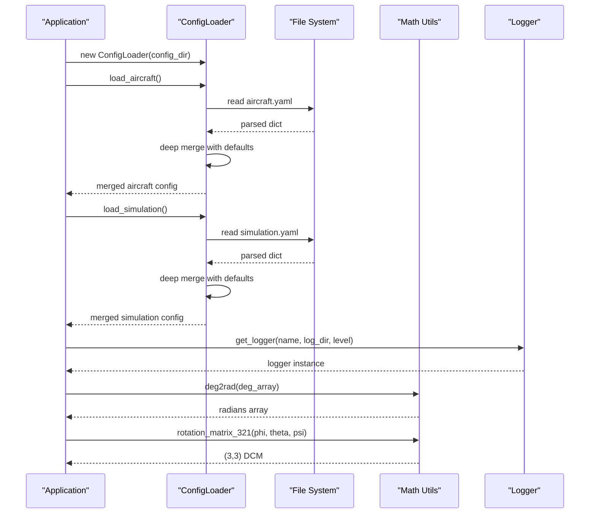
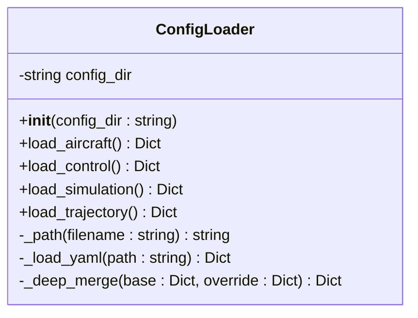
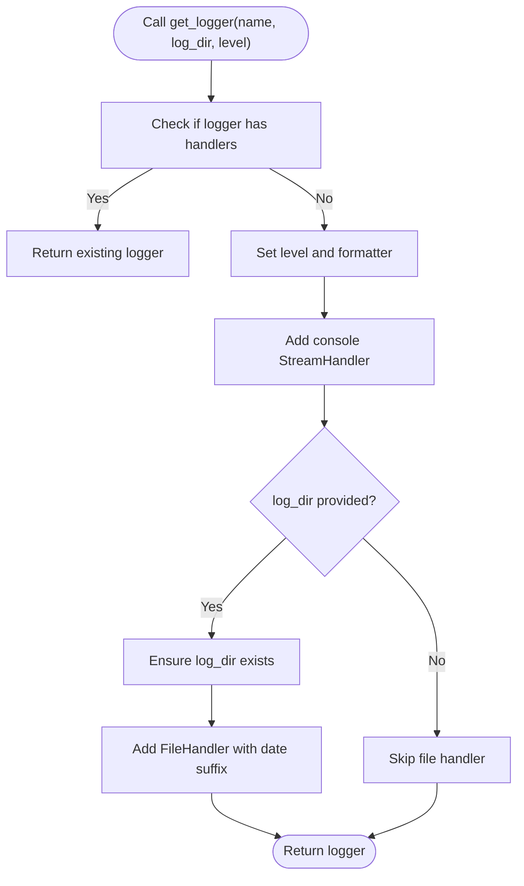
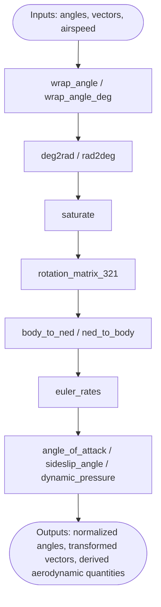
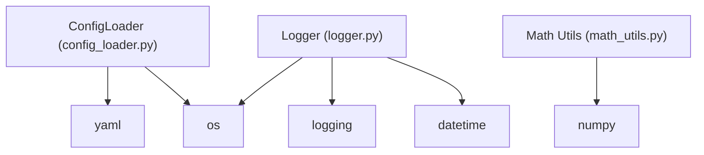

# Utilities API

<cite>
**Referenced Files in This Document**
- [config_loader.py](file://src/utils/config_loader.py)
- [logger.py](file://src/utils/logger.py)
- [math_utils.py](file://src/utils/math_utils.py)
- [aircraft.yaml](file://config/aircraft.yaml)
- [simulation.yaml](file://config/simulation.yaml)
- [control_params.yaml](file://config/control_params.yaml)
- [trajectory.yaml](file://config/trajectory.yaml)
</cite>

## Table of Contents
1. [Introduction](#introduction)
2. [Project Structure](#project-structure)
3. [Core Components](#core-components)
4. [Architecture Overview](#architecture-overview)
5. [Detailed Component Analysis](#detailed-component-analysis)
6. [Dependency Analysis](#dependency-analysis)
7. [Performance Considerations](#performance-considerations)
8. [Troubleshooting Guide](#troubleshooting-guide)
9. [Conclusion](#conclusion)
10. [Appendices](#appendices)

## Introduction
This document provides comprehensive API documentation for the utility and helper modules used across the fixed-wing simulation framework. It focuses on:
- ConfigLoader class for YAML configuration parsing, merging, and management
- Mathematical utility functions for aerospace calculations, trigonometric operations, vector and matrix computations, and geometric transformations
- Logger utility for event logging, debug output, and performance tracking
- Utility functions for data processing, unit conversions, and common aerospace calculations

The goal is to enable developers to integrate and extend the simulation with clear understanding of configuration loading, mathematical operations, and logging capabilities.

## Project Structure
The utilities reside under the src/utils package and are complemented by configuration files under config/. The configuration files define defaults and overrides for aircraft, simulation, control parameters, and trajectory planning.

**Diagram sources**
- [config_loader.py](file://src/utils/config_loader.py#L59-L82)
- [aircraft.yaml](file://config/aircraft.yaml#L1-L13)
- [simulation.yaml](file://config/simulation.yaml#L1-L30)
- [control_params.yaml](file://config/control_params.yaml#L1-L45)
- [trajectory.yaml](file://config/trajectory.yaml#L1-L23)

**Section sources**
- [config_loader.py](file://src/utils/config_loader.py#L1-L82)
- [logger.py](file://src/utils/logger.py#L1-L44)
- [math_utils.py](file://src/utils/math_utils.py#L1-L124)

## Core Components
- ConfigLoader: Loads and merges YAML configuration files for aircraft, simulation, control parameters, and trajectory. Provides default fallbacks and deep merge semantics.
- Logger: Provides a thin wrapper around Python logging to emit messages to console and optionally to dated log files.
- Math utilities: Offers angle wrapping, unit conversions, rotation matrices, Euler angle rates, and aerodynamic helpers.

**Section sources**
- [config_loader.py](file://src/utils/config_loader.py#L59-L82)
- [logger.py](file://src/utils/logger.py#L10-L44)
- [math_utils.py](file://src/utils/math_utils.py#L13-L124)

## Architecture Overview
The utilities form the foundational layer for configuration, logging, and mathematical operations used by higher-level modules such as dynamics, control, and planning.

**Diagram sources**
- [config_loader.py](file://src/utils/config_loader.py#L59-L82)
- [logger.py](file://src/utils/logger.py#L10-L44)
- [math_utils.py](file://src/utils/math_utils.py#L1-L124)
- [aircraft.yaml](file://config/aircraft.yaml#L1-L13)
- [simulation.yaml](file://config/simulation.yaml#L1-L30)
- [control_params.yaml](file://config/control_params.yaml#L1-L45)
- [trajectory.yaml](file://config/trajectory.yaml#L1-L23)

## Detailed Component Analysis

### ConfigLoader API
The ConfigLoader class encapsulates YAML configuration loading and merging with defaults. It exposes methods to load aircraft, control parameters, simulation, and trajectory configurations. It also provides internal helpers for file path construction and deep merging.

Key responsibilities:
- Load YAML files safely and return dictionaries
- Merge loaded configuration with built-in defaults using recursive deep merge
- Provide per-subsystem loaders for aircraft, simulation, control, and trajectory

Public interface:
- __init__(config_dir: str = "config"): Initializes the loader with a configuration directory
- load_aircraft() -> Dict[str, Any]: Loads aircraft.yaml and merges with defaults
- load_control() -> Dict[str, Any]: Loads control_params.yaml
- load_simulation() -> Dict[str, Any]: Loads simulation.yaml and merges with defaults
- load_trajectory() -> Dict[str, Any]: Loads trajectory.yaml and merges with defaults

Internal helpers:
- _path(filename: str) -> str: Builds absolute path for a given filename under config_dir
- _load_yaml(path: str) -> Dict[str, Any]: Reads and parses YAML file safely
- _deep_merge(base: dict, override: dict) -> dict: Recursively merges override into base

Behavioral notes:
- Defaults are defined centrally and merged into each subsystem configuration
- Missing files return empty dictionaries; deep merge ensures nested keys are preserved or overridden appropriately
- Aircraft overrides are supported via the overrides field in aircraft.yaml

Method signatures:
- ConfigLoader.__init__(config_dir: str = "config") -> None
- ConfigLoader.load_aircraft() -> Dict[str, Any]
- ConfigLoader.load_control() -> Dict[str, Any]
- ConfigLoader.load_simulation() -> Dict[str, Any]
- ConfigLoader.load_trajectory() -> Dict[str, Any]

Example usage patterns:
- Initialize ConfigLoader with a custom config directory
- Call load_aircraft(), load_simulation(), load_control(), load_trajectory() to obtain parsed configurations
- Access merged configuration dictionaries for downstream modules

Validation and defaults:
- Aircraft defaults include aircraft_name and overrides
- Simulation defaults include time step, duration, integrator, tolerances, initial conditions, wind settings, and logging configuration
- Trajectory defaults include type, average speed, yaw mode, waypoints, and loop flag

**Section sources**
- [config_loader.py](file://src/utils/config_loader.py#L59-L82)
- [aircraft.yaml](file://config/aircraft.yaml#L1-L13)
- [simulation.yaml](file://config/simulation.yaml#L1-L30)
- [control_params.yaml](file://config/control_params.yaml#L1-L45)
- [trajectory.yaml](file://config/trajectory.yaml#L1-L23)

### Logger API
The logger module provides a convenience function to obtain a configured logger instance that writes to both console and an optional dated log file.

Public interface:
- get_logger(name: str, log_dir: str = "logs", level: int = logging.INFO) -> logging.Logger: Creates or retrieves a named logger with console and optional file handlers

Behavioral notes:
- If a logger with the given name already has handlers, it is returned unchanged
- Console handler is always enabled with a formatted message layout
- File handler is enabled only if log_dir is provided; the directory is created if missing
- Log files are named with a date suffix to separate daily logs

Method signature:
- get_logger(name: str, log_dir: str = "logs", level: int = logging.INFO) -> logging.Logger

Usage patterns:
- Import get_logger and call it during module initialization to obtain a logger instance
- Use logger.info(), logger.warning(), logger.error(), etc., to emit events
- Configure log_dir to control file logging; leave empty to disable file logging

**Section sources**
- [logger.py](file://src/utils/logger.py#L10-L44)

### Math Utils API
The math utilities module provides aerospace-relevant mathematical functions implemented with NumPy for vectorization and performance.

Angle and unit conversion:
- wrap_angle(angle: float) -> float: Wraps angle to [-π, π] radians
- wrap_angle_deg(angle: float) -> float: Wraps angle to [-180, 180] degrees
- deg2rad(deg) -> np.ndarray: Vectorized degrees to radians conversion
- rad2deg(rad) -> np.ndarray: Vectorized radians to degrees conversion
- saturate(value: float, v_min: float, v_max: float) -> float: Clamps value to [v_min, v_max]

Rotation matrices and Euler angles:
- rotation_matrix_321(phi: float, theta: float, psi: float) -> np.ndarray: Direction cosine matrix (DCM) for 3-2-1 Euler angles (NED to body)
- body_to_ned(v_body: np.ndarray, phi: float, theta: float, psi: float) -> np.ndarray: Transform vector from body to NED
- ned_to_body(v_ned: np.ndarray, phi: float, theta: float, psi: float) -> np.ndarray: Transform vector from NED to body
- euler_rates(p: float, q: float, r: float, phi: float, theta: float) -> np.ndarray: Compute φ̇, θ̇, ψ̇ from body rates p, q, r with singularity protection

Aerodynamic helpers:
- angle_of_attack(u: float, w: float) -> float: Computes angle of attack α = arctan2(w, u)
- sideslip_angle(v: float, airspeed: float) -> float: Computes sideslip β = arcsin(v / V) with numerical clamp
- dynamic_pressure(rho: float, airspeed: float) -> float: Computes dynamic pressure q_bar = 0.5 * ρ * V^2

Method signatures:
- wrap_angle(angle: float) -> float
- wrap_angle_deg(angle: float) -> float
- deg2rad(deg) -> np.ndarray
- rad2deg(rad) -> np.ndarray
- saturate(value: float, v_min: float, v_max: float) -> float
- rotation_matrix_321(phi: float, theta: float, psi: float) -> np.ndarray
- body_to_ned(v_body: np.ndarray, phi: float, theta: float, psi: float) -> np.ndarray
- ned_to_body(v_ned: np.ndarray, phi: float, theta: float, psi: float) -> np.ndarray
- euler_rates(p: float, q: float, r: float, phi: float, theta: float) -> np.ndarray
- angle_of_attack(u: float, w: float) -> float
- sideslip_angle(v: float, airspeed: float) -> float
- dynamic_pressure(rho: float, airspeed: float) -> float

Usage patterns:
- Use wrap_angle and wrap_angle_deg to normalize angles for control and display
- Use deg2rad and rad2deg for vectorized unit conversions
- Use saturate to constrain control signals and states
- Use rotation_matrix_321 and associated transforms for coordinate frame conversions
- Use euler_rates to convert body angular rates to Euler angle rates
- Use aerodynamic helpers to compute α, β, and q_bar for aerodynamic modeling

**Section sources**
- [math_utils.py](file://src/utils/math_utils.py#L13-L124)

## Architecture Overview

**Diagram sources**
- [config_loader.py](file://src/utils/config_loader.py#L59-L82)
- [logger.py](file://src/utils/logger.py#L10-L44)
- [math_utils.py](file://src/utils/math_utils.py#L13-L124)

## Detailed Component Analysis

### ConfigLoader Class
The ConfigLoader class centralizes configuration loading and merging. It ensures robust defaults and safe YAML parsing while allowing per-module overrides.

**Diagram sources**
- [config_loader.py](file://src/utils/config_loader.py#L59-L82)

Behavioral highlights:
- Safe YAML loading with fallback to empty dicts for missing files
- Recursive deep merge preserves nested defaults while applying overrides
- Centralized defaults ensure consistent behavior across subsystems

Integration points:
- Aircraft configuration merges with defaults for aircraft_name and overrides
- Simulation configuration merges with defaults for dt, duration, integrator, tolerances, initial conditions, wind settings, and logging
- Trajectory configuration merges with defaults for type, average speed, yaw mode, waypoints, and loop flag

**Section sources**
- [config_loader.py](file://src/utils/config_loader.py#L59-L82)
- [aircraft.yaml](file://config/aircraft.yaml#L1-L13)
- [simulation.yaml](file://config/simulation.yaml#L1-L30)
- [trajectory.yaml](file://config/trajectory.yaml#L1-L23)

### Logger Utility
The logger utility provides a standardized way to obtain configured loggers with console and optional file output.

**Diagram sources**
- [logger.py](file://src/utils/logger.py#L10-L44)

Usage patterns:
- Obtain a logger early in module initialization
- Emit structured messages with consistent formatting
- Enable file logging by specifying log_dir; disable by leaving empty

**Section sources**
- [logger.py](file://src/utils/logger.py#L10-L44)

### Math Utils Functions
The math utilities module offers aerospace-centric functions for angles, rotations, and aerodynamics.

**Diagram sources**
- [math_utils.py](file://src/utils/math_utils.py#L13-L124)

Numerical stability:
- Small ε protection in euler_rates near singularities
- Numerical clamping in sideslip_angle to ensure arcsin argument is valid
- Minimum airspeed threshold to prevent division by zero

Vectorization:
- deg2rad and rad2deg accept arrays for efficient batch conversion

**Section sources**
- [math_utils.py](file://src/utils/math_utils.py#L13-L124)

## Dependency Analysis
The utilities depend on standard library modules and NumPy. ConfigLoader depends on YAML parsing and filesystem operations. Logger depends on Python logging and datetime. Math utils depend on NumPy for numerical operations.

**Diagram sources**
- [config_loader.py](file://src/utils/config_loader.py#L5-L7)
- [logger.py](file://src/utils/logger.py#L5-L7)
- [math_utils.py](file://src/utils/math_utils.py#L6)

**Section sources**
- [config_loader.py](file://src/utils/config_loader.py#L5-L7)
- [logger.py](file://src/utils/logger.py#L5-L7)
- [math_utils.py](file://src/utils/math_utils.py#L6)

## Performance Considerations
- Vectorization: Use deg2rad and rad2deg for array inputs to avoid Python loops
- Numerical stability: Apply saturate to control signals; rely on built-in numerical protections in euler_rates and sideslip_angle
- Logging overhead: File logging adds I/O; disable file logging by leaving log_dir empty for performance-sensitive runs
- Configuration merging: Deep merge is efficient for typical config sizes; keep configs minimal and organized

[No sources needed since this section provides general guidance]

## Troubleshooting Guide
Common issues and resolutions:
- Missing configuration files: ConfigLoader gracefully handles missing files by returning empty dicts; ensure expected files exist or rely on defaults
- YAML parsing errors: Verify YAML syntax in configuration files; use provided defaults if parsing fails
- Logger not writing to file: Ensure log_dir exists or is creatable; confirm permissions
- Unexpected angles: Normalize angles using wrap_angle or wrap_angle_deg before use in control logic
- Numerical instabilities: Use saturate for control limits; rely on euler_rates protection near singularities

**Section sources**
- [config_loader.py](file://src/utils/config_loader.py#L40-L56)
- [logger.py](file://src/utils/logger.py#L35-L42)
- [math_utils.py](file://src/utils/math_utils.py#L23-L25)
- [math_utils.py](file://src/utils/math_utils.py#L87-L90)

## Conclusion
The utilities provide a solid foundation for configuration management, logging, and mathematical operations in the fixed-wing simulation. ConfigLoader ensures robust defaults and safe merging; Logger standardizes event emission; Math Utils delivers aerospace-relevant numerical primitives with attention to stability and performance. Together, they enable reliable and maintainable simulation workflows.

[No sources needed since this section summarizes without analyzing specific files]

## Appendices

### Configuration Files Reference
- aircraft.yaml: Defines aircraft selection and optional overrides
- simulation.yaml: Defines time stepping, integrator, tolerances, initial conditions, wind settings, and logging
- control_params.yaml: Defines control parameters for altitude hold, airspeed, PID gains, and TECS tuning
- trajectory.yaml: Defines trajectory type, average speed, yaw mode, waypoints, and loop flag

**Section sources**
- [aircraft.yaml](file://config/aircraft.yaml#L1-L13)
- [simulation.yaml](file://config/simulation.yaml#L1-L30)
- [control_params.yaml](file://config/control_params.yaml#L1-L45)
- [trajectory.yaml](file://config/trajectory.yaml#L1-L23)