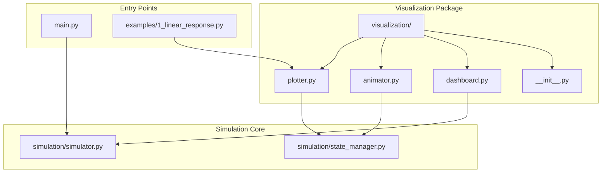
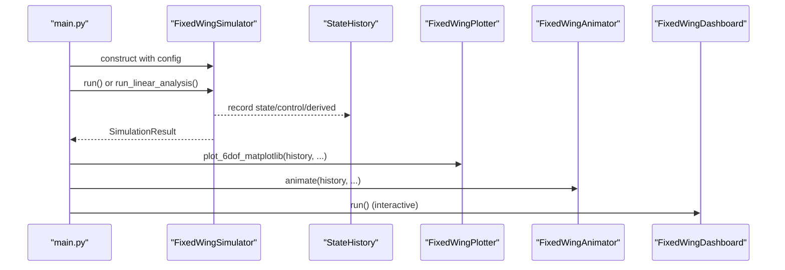
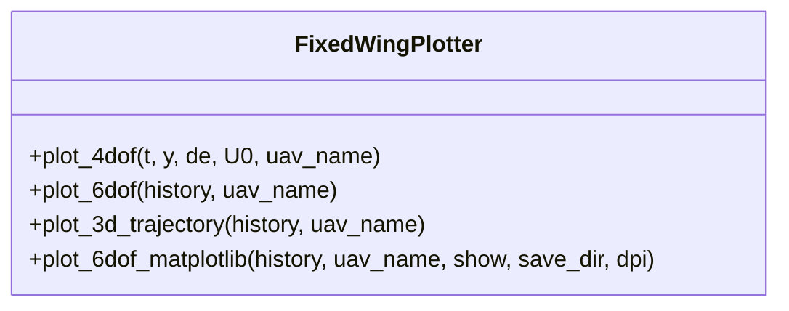
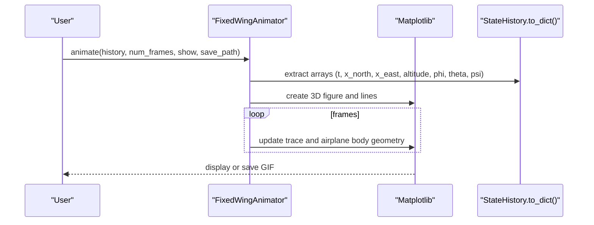
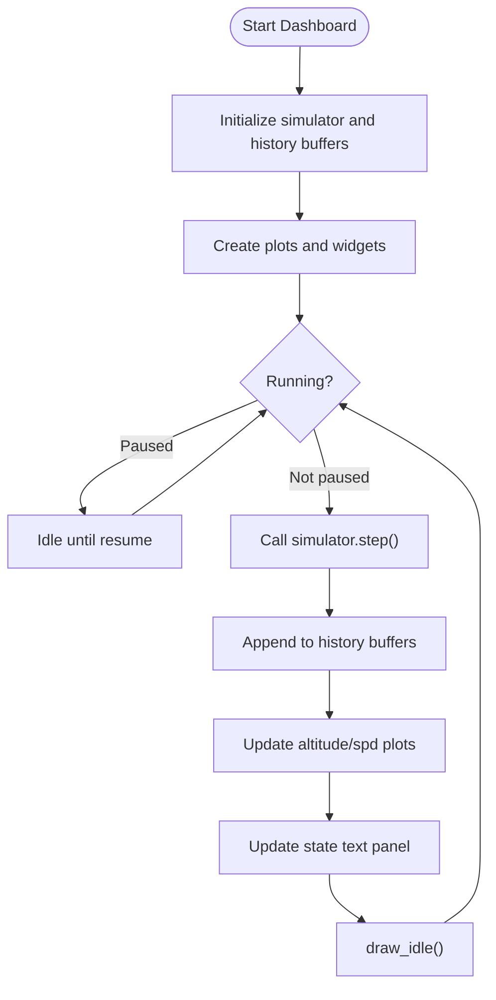
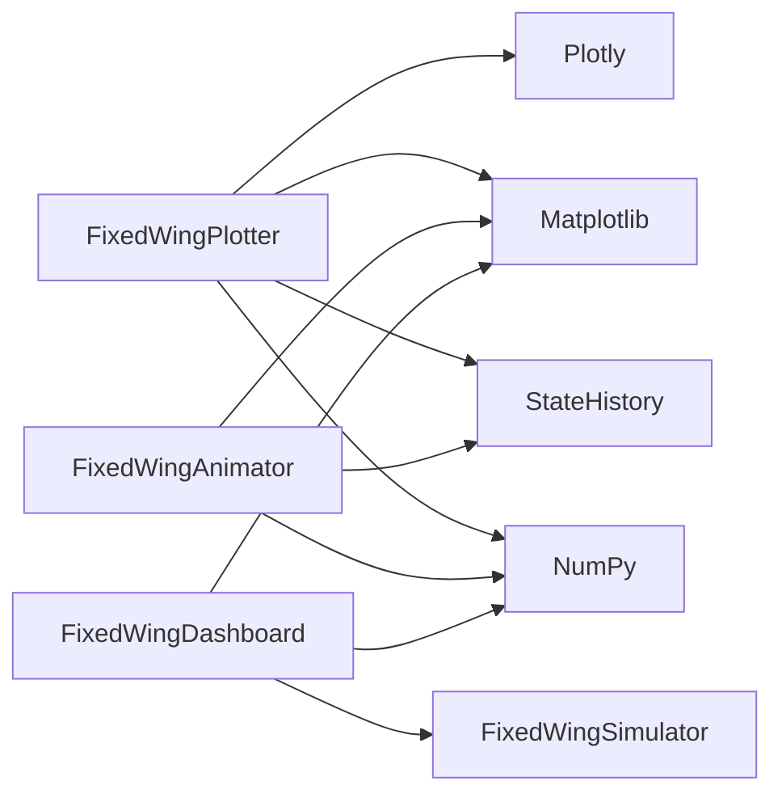

# Visualization API

<cite>
**Referenced Files in This Document**
- [src/visualization/__init__.py](file://src/visualization/__init__.py)
- [src/visualization/plotter.py](file://src/visualization/plotter.py)
- [src/visualization/animator.py](file://src/visualization/animator.py)
- [src/visualization/dashboard.py](file://src/visualization/dashboard.py)
- [src/simulation/state_manager.py](file://src/simulation/state_manager.py)
- [src/simulation/simulator.py](file://src/simulation/simulator.py)
- [main.py](file://main.py)
- [examples/1_linear_response.py](file://examples/1_linear_response.py)
</cite>

## Table of Contents
1. [Introduction](#introduction)
2. [Project Structure](#project-structure)
3. [Core Components](#core-components)
4. [Architecture Overview](#architecture-overview)
5. [Detailed Component Analysis](#detailed-component-analysis)
6. [Dependency Analysis](#dependency-analysis)
7. [Performance Considerations](#performance-considerations)
8. [Troubleshooting Guide](#troubleshooting-guide)
9. [Conclusion](#conclusion)
10. [Appendices](#appendices)

## Introduction
This document provides comprehensive API documentation for the visualization and data output module. It covers:
- Static plotting capabilities via FixedWingPlotter (Plotly and Matplotlib backends)
- Interactive visualization functions via FixedWingAnimator (3D trajectory animation)
- Real-time monitoring interfaces via FixedWingDashboard (interactive dashboard)
- Data export functions for CSV generation, figure saving, and result formatting

The module integrates tightly with the simulation engine’s StateHistory data container and exposes convenient APIs for both offline analysis and live monitoring.

## Project Structure
The visualization system resides under src/visualization and exports three primary classes for public use. It relies on NumPy for numeric arrays and integrates with Matplotlib and Plotly for rendering.

**Diagram sources**
- [src/visualization/__init__.py](file://src/visualization/__init__.py#L1-L8)
- [src/visualization/plotter.py](file://src/visualization/plotter.py#L1-L244)
- [src/visualization/animator.py](file://src/visualization/animator.py#L1-L150)
- [src/visualization/dashboard.py](file://src/visualization/dashboard.py#L1-L167)
- [src/simulation/state_manager.py](file://src/simulation/state_manager.py#L1-L193)
- [src/simulation/simulator.py](file://src/simulation/simulator.py#L1-L642)
- [main.py](file://main.py#L1-L145)
- [examples/1_linear_response.py](file://examples/1_linear_response.py#L1-L206)

**Section sources**
- [src/visualization/__init__.py](file://src/visualization/__init__.py#L1-L8)
- [src/visualization/plotter.py](file://src/visualization/plotter.py#L1-L244)
- [src/visualization/animator.py](file://src/visualization/animator.py#L1-L150)
- [src/visualization/dashboard.py](file://src/visualization/dashboard.py#L1-L167)
- [src/simulation/state_manager.py](file://src/simulation/state_manager.py#L1-L193)
- [src/simulation/simulator.py](file://src/simulation/simulator.py#L1-L642)
- [main.py](file://main.py#L1-L145)
- [examples/1_linear_response.py](file://examples/1_linear_response.py#L1-L206)

## Core Components
- FixedWingPlotter: Static and interactive plotting utilities for 2D time-domain charts and 3D trajectories. Supports both Plotly (web UI) and Matplotlib (desktop/offline) backends.
- FixedWingAnimator: 3D trajectory animation using Matplotlib FuncAnimation, with airplane body geometry and optional GIF export.
- FixedWingDashboard: Interactive real-time dashboard with flight mode selection, pause/restart controls, and live state readouts.

These components consume standardized simulation history dictionaries produced by StateHistory.to_dict().

**Section sources**
- [src/visualization/plotter.py](file://src/visualization/plotter.py#L19-L244)
- [src/visualization/animator.py](file://src/visualization/animator.py#L14-L150)
- [src/visualization/dashboard.py](file://src/visualization/dashboard.py#L28-L167)
- [src/simulation/state_manager.py](file://src/simulation/state_manager.py#L95-L193)

## Architecture Overview
The visualization layer sits alongside the simulation engine. The simulation produces StateHistory records, which are consumed by visualization components. The main entry point orchestrates runs and invokes visualization helpers.

**Diagram sources**
- [main.py](file://main.py#L98-L141)
- [src/simulation/simulator.py](file://src/simulation/simulator.py#L115-L642)
- [src/simulation/state_manager.py](file://src/simulation/state_manager.py#L117-L180)
- [src/visualization/plotter.py](file://src/visualization/plotter.py#L161-L244)
- [src/visualization/animator.py](file://src/visualization/animator.py#L25-L150)
- [src/visualization/dashboard.py](file://src/visualization/dashboard.py#L59-L111)

## Detailed Component Analysis

### FixedWingPlotter API
Static plotting utilities for 2D and 3D visualization.

- plot_4dof(t, y, de, U0, uav_name="UAV")
  - Purpose: Create a Plotly subplots figure for 4-DOF longitudinal response (forward speed perturbation, angle of attack, pitch rate, pitch angle) plus elevator input.
  - Returns: plotly.graph_objects.Figure
  - Notes: Uses degrees internally for angles; compatible with project-1’s time-domain plot style.

- plot_6dof(history, uav_name="UAV")
  - Purpose: Create a Plotly subplots figure for full 6-DOF time-domain response.
  - Returns: plotly.graph_objects.Figure
  - Notes: Automatically computes subplot titles from history keys; suitable for web UI embedding.

- plot_3d_trajectory(history, uav_name="UAV")
  - Purpose: Create a Plotly 3D scene showing actual and optional desired trajectory.
  - Returns: plotly.graph_objects.Figure
  - Notes: Uses NED coordinates; adds start marker and optional desired trajectory line.

- plot_6dof_matplotlib(history, uav_name="UAV", show=True, save_dir=None, dpi=150)
  - Purpose: Generate three Matplotlib figures (position/velocity, attitude/angular rates, control inputs) and either display or save PNGs.
  - Behavior: Creates three subplots windows; saves each figure to save_dir with dpi; closes figures when show=False to free memory.

Method signatures (paths only):
- [plot_4dof](file://src/visualization/plotter.py#L23-L65)
- [plot_6dof](file://src/visualization/plotter.py#L68-L111)
- [plot_3d_trajectory](file://src/visualization/plotter.py#L114-L154)
- [plot_6dof_matplotlib](file://src/visualization/plotter.py#L161-L244)

**Diagram sources**
- [src/visualization/plotter.py](file://src/visualization/plotter.py#L19-L244)

**Section sources**
- [src/visualization/plotter.py](file://src/visualization/plotter.py#L19-L244)
- [src/simulation/state_manager.py](file://src/simulation/state_manager.py#L179-L180)

### FixedWingAnimator API
3D trajectory animation using Matplotlib FuncAnimation.

- animate(history, uav_name="UAV", num_frames=8, show=True, save_path=None)
  - Purpose: Render a 3D animation of actual trajectory with airplane body geometry and optional desired trajectory; can save as GIF.
  - Behavior:
    - Initializes 3D axes and lines for trace, body, wings, and horizontal tail.
    - Precomputes frame indices at stride num_frames to reduce render cost.
    - Applies rotation matrices to map body-frame geometry to NED coordinates.
    - Updates trace and airplane body per frame; sets dynamic title with time, altitude, and airspeed.
    - Saves to save_path using Pillow writer if provided; shows window if show=True.

Method signature (path only):
- [animate](file://src/visualization/animator.py#L25-L150)

**Diagram sources**
- [src/visualization/animator.py](file://src/visualization/animator.py#L25-L150)

**Section sources**
- [src/visualization/animator.py](file://src/visualization/animator.py#L14-L150)
- [src/simulation/state_manager.py](file://src/simulation/state_manager.py#L179-L180)

### FixedWingDashboard API
Interactive real-time dashboard with live state readouts and controls.

- run()
  - Purpose: Build and run an interactive dashboard that drives the simulator in real time.
  - Behavior:
    - Ensures TkAgg backend for interactivity.
    - Initializes figure with two live plots (altitude and airspeed) and a text panel for instantaneous state.
    - Adds pause/resume and restart buttons; adds a radio button group for flight modes.
    - Starts a FuncAnimation loop that calls simulator.step(), appends to history buffers, updates plots and text, and redraws canvas.
    - Handles exceptions from step() and stops the loop gracefully.

- Internal fields and callbacks:
  - _paused/_running flags
  - _t_hist/_alt_hist/_spd_hist/_phi_hist/_theta_hist for live buffers
  - _on_pause, _on_restart, _on_mode_change

Method signatures (paths only):
- [run](file://src/visualization/dashboard.py#L59-L111)
- [_build_figure](file://src/visualization/dashboard.py#L114-L167)
- [_on_pause](file://src/visualization/dashboard.py#L151-L153)
- [_on_restart](file://src/visualization/dashboard.py#L155-L163)
- [_on_mode_change](file://src/visualization/dashboard.py#L165-L166)

**Diagram sources**
- [src/visualization/dashboard.py](file://src/visualization/dashboard.py#L59-L111)

**Section sources**
- [src/visualization/dashboard.py](file://src/visualization/dashboard.py#L28-L167)
- [src/simulation/simulator.py](file://src/simulation/simulator.py#L602-L642)

### Data Export Functions
The visualization module integrates with StateHistory for exporting results.

- StateHistory.to_csv(path)
  - Purpose: Export the recorded history to a CSV file with a header row and numeric values.
  - Notes: Uses the internal STATE_KEYS order; ensures directory exists.

- StateHistory.to_dict()
  - Purpose: Return a dictionary of arrays for the recorded time steps.
  - Notes: Used by plotter/animator to feed visualization functions.

- Example usage in scripts:
  - Saving CSV via StateHistory.to_csv()
  - Saving PNG figures via Matplotlib (see examples)

Method signatures (paths only):
- [to_csv](file://src/simulation/state_manager.py#L182-L193)
- [to_dict](file://src/simulation/state_manager.py#L179-L180)

**Section sources**
- [src/simulation/state_manager.py](file://src/simulation/state_manager.py#L95-L193)
- [examples/1_linear_response.py](file://examples/1_linear_response.py#L157-L163)

## Dependency Analysis
- External libraries: NumPy, Matplotlib, Plotly
- Internal dependencies: StateHistory for standardized data format; simulator for runtime data in dashboard mode

**Diagram sources**
- [src/visualization/plotter.py](file://src/visualization/plotter.py#L9-L12)
- [src/visualization/animator.py](file://src/visualization/animator.py#L10-L11)
- [src/visualization/dashboard.py](file://src/visualization/dashboard.py#L15-L25)
- [src/simulation/state_manager.py](file://src/simulation/state_manager.py#L95-L193)
- [src/simulation/simulator.py](file://src/simulation/simulator.py#L1-L642)

**Section sources**
- [src/visualization/plotter.py](file://src/visualization/plotter.py#L9-L12)
- [src/visualization/animator.py](file://src/visualization/animator.py#L10-L11)
- [src/visualization/dashboard.py](file://src/visualization/dashboard.py#L15-L25)
- [src/simulation/state_manager.py](file://src/simulation/state_manager.py#L95-L193)
- [src/simulation/simulator.py](file://src/simulation/simulator.py#L1-L642)

## Performance Considerations
- Preallocation and trimming: StateHistory preallocates arrays and trims unused tail to minimize memory footprint.
- Frame indexing: Animator precomputes frame indices at stride num_frames to reduce per-frame computation.
- Incremental updates: Dashboard uses draw_idle() and incremental data appending to keep updates smooth.
- Backend selection: Use non-interactive Agg backend for batch rendering; TkAgg for interactive dashboards.
- Resource cleanup: Matplotlib figures are closed in non-interactive modes to free memory.

**Section sources**
- [src/simulation/state_manager.py](file://src/simulation/state_manager.py#L170-L193)
- [src/visualization/animator.py](file://src/visualization/animator.py#L104-L142)
- [src/visualization/dashboard.py](file://src/visualization/dashboard.py#L106-L111)

## Troubleshooting Guide
- Missing dependencies: Import errors for Matplotlib/Plotly will prevent dashboard or plotting. Install required packages.
- No GUI window: When using non-interactive backends, figures are not shown; pass show=True or save_dir to persist output.
- Animation not playing: Verify save_path availability and Pillow availability; adjust num_frames and interval for smoother playback.
- Dashboard not updating: Ensure simulator.init_step() was called before step(); check for exceptions raised inside step().
- Data export failures: Confirm write permissions and disk space; ensure StateHistory has recorded data.

**Section sources**
- [src/visualization/dashboard.py](file://src/visualization/dashboard.py#L42-L44)
- [src/visualization/animator.py](file://src/visualization/animator.py#L144-L146)
- [src/visualization/plotter.py](file://src/visualization/plotter.py#L186-L195)
- [src/simulation/state_manager.py](file://src/simulation/state_manager.py#L170-L193)

## Conclusion
The visualization module offers a cohesive toolkit for analyzing fixed-wing simulation results:
- Static plots via FixedWingPlotter (Plotly and Matplotlib)
- 3D animations via FixedWingAnimator
- Real-time dashboards via FixedWingDashboard
- Robust data export via StateHistory

Its design emphasizes modularity, performance, and ease of integration with the broader simulation framework.

## Appendices

### Method Signatures Reference
- FixedWingPlotter
  - [plot_4dof](file://src/visualization/plotter.py#L23-L65)
  - [plot_6dof](file://src/visualization/plotter.py#L68-L111)
  - [plot_3d_trajectory](file://src/visualization/plotter.py#L114-L154)
  - [plot_6dof_matplotlib](file://src/visualization/plotter.py#L161-L244)

- FixedWingAnimator
  - [animate](file://src/visualization/animator.py#L25-L150)

- FixedWingDashboard
  - [run](file://src/visualization/dashboard.py#L59-L111)
  - [_build_figure](file://src/visualization/dashboard.py#L114-L167)
  - [_on_pause](file://src/visualization/dashboard.py#L151-L153)
  - [_on_restart](file://src/visualization/dashboard.py#L155-L163)
  - [_on_mode_change](file://src/visualization/dashboard.py#L165-L166)

- Data Export
  - [to_csv](file://src/simulation/state_manager.py#L182-L193)
  - [to_dict](file://src/simulation/state_manager.py#L179-L180)

### Integration Examples
- Command-line orchestration and visualization:
  - [main.py](file://main.py#L98-L141)
- Offline analysis with CSV and PNG export:
  - [examples/1_linear_response.py](file://examples/1_linear_response.py#L157-L163)