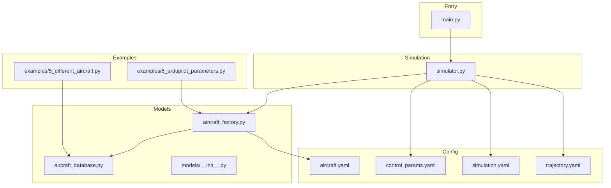
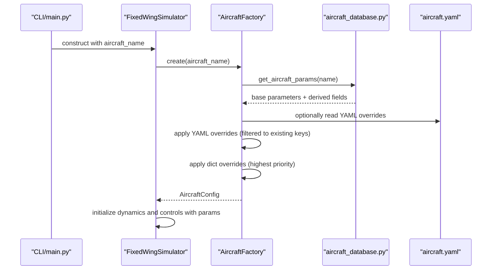
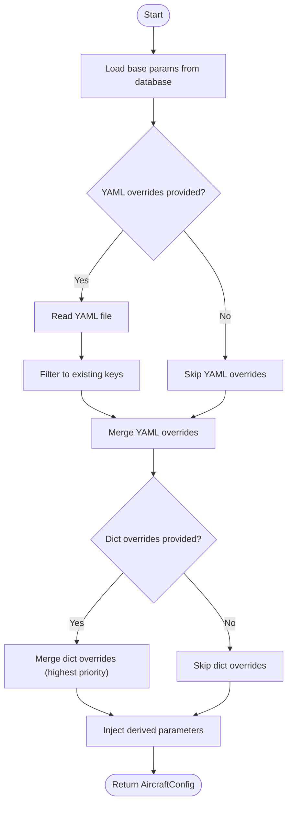
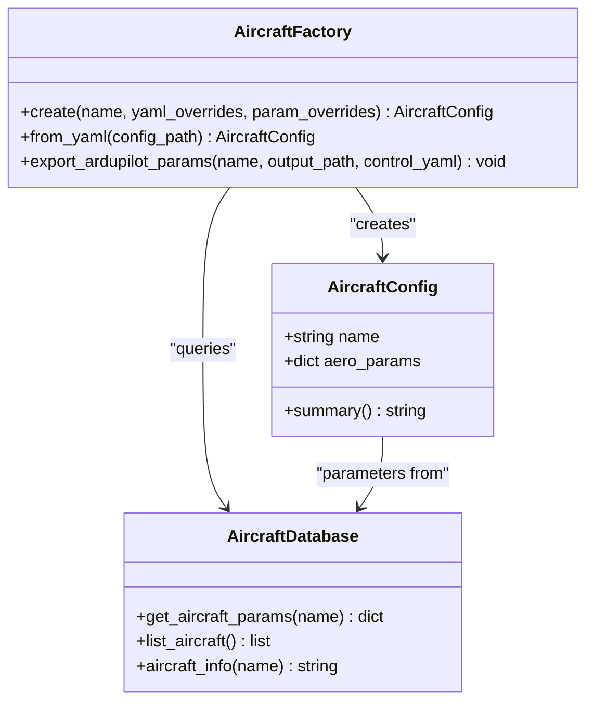
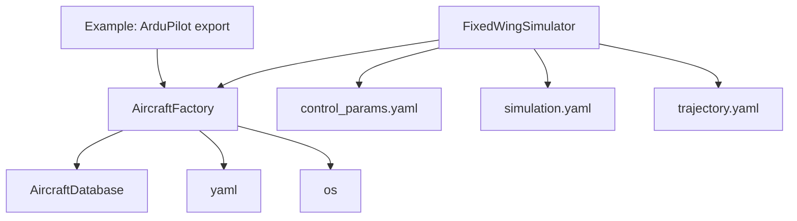

# Aircraft Factory Pattern

<cite>
**Referenced Files in This Document**
- [aircraft_factory.py](file://src/models/aircraft_factory.py)
- [aircraft_database.py](file://src/models/aircraft_database.py)
- [__init__.py](file://src/models/__init__.py)
- [aircraft.yaml](file://config/aircraft.yaml)
- [control_params.yaml](file://config/control_params.yaml)
- [simulation.yaml](file://config/simulation.yaml)
- [trajectory.yaml](file://config/trajectory.yaml)
- [simulator.py](file://src/simulation/simulator.py)
- [main.py](file://main.py)
- [example_5_different_aircraft.py](file://examples/5_different_aircraft.py)
- [example_6_ardupilot_parameters.py](file://examples/6_ardupilot_parameters.py)
</cite>

## Table of Contents
1. [Introduction](#introduction)
2. [Project Structure](#project-structure)
3. [Core Components](#core-components)
4. [Architecture Overview](#architecture-overview)
5. [Detailed Component Analysis](#detailed-component-analysis)
6. [Dependency Analysis](#dependency-analysis)
7. [Performance Considerations](#performance-considerations)
8. [Troubleshooting Guide](#troubleshooting-guide)
9. [Conclusion](#conclusion)
10. [Appendices](#appendices)

## Introduction
This document explains the aircraft factory pattern implementation used to manage aircraft configurations in the FixedWingSimulator. It covers how aircraft parameters are loaded from a central database, merged with optional overrides from YAML and runtime dictionaries, validated, and transformed into a unified configuration consumed by the simulation engine. It also documents parameter precedence, conflict resolution, persistence/export to ArduPilot-compatible formats, and practical workflows for creating, modifying, and exporting aircraft configurations.

## Project Structure
The aircraft factory resides in the models layer and integrates with the simulation engine and configuration system.

**Diagram sources**
- [aircraft_factory.py](file://src/models/aircraft_factory.py#L1-L136)
- [aircraft_database.py](file://src/models/aircraft_database.py#L1-L183)
- [__init__.py](file://src/models/__init__.py#L1-L15)
- [simulator.py](file://src/simulation/simulator.py#L1-L642)
- [main.py](file://main.py#L1-L145)
- [aircraft.yaml](file://config/aircraft.yaml#L1-L13)
- [control_params.yaml](file://config/control_params.yaml#L1-L45)
- [simulation.yaml](file://config/simulation.yaml#L1-L30)
- [trajectory.yaml](file://config/trajectory.yaml#L1-L23)
- [example_5_different_aircraft.py](file://examples/5_different_aircraft.py#L1-L65)
- [example_6_ardupilot_parameters.py](file://examples/6_ardupilot_parameters.py#L1-L85)

**Section sources**
- [aircraft_factory.py](file://src/models/aircraft_factory.py#L1-L136)
- [aircraft_database.py](file://src/models/aircraft_database.py#L1-L183)
- [__init__.py](file://src/models/__init__.py#L1-L15)
- [simulator.py](file://src/simulation/simulator.py#L1-L642)
- [main.py](file://main.py#L1-L145)

## Core Components
- AircraftConfig: A lightweight data container holding the aircraft name and a merged parameter dictionary. It exposes a summary method for quick inspection.
- AircraftFactory: A static factory that builds AircraftConfig instances by loading base parameters from the database, applying YAML overrides, then applying dictionary overrides. It also supports creating configurations from a YAML file and exporting ArduPilot-compatible parameter sets.

Key responsibilities:
- Parameter sourcing and merging
- Validation via database lookup
- Derived parameter injection (e.g., calibrated airspeed and dynamic pressure)
- Export to ArduPilot .param format

**Section sources**
- [aircraft_factory.py](file://src/models/aircraft_factory.py#L15-L136)
- [aircraft_database.py](file://src/models/aircraft_database.py#L143-L183)

## Architecture Overview
The factory sits between the application entry point and the simulation engine. It ensures that the simulation receives a validated, fully merged configuration.

**Diagram sources**
- [main.py](file://main.py#L98-L122)
- [simulator.py](file://src/simulation/simulator.py#L130-L158)
- [aircraft_factory.py](file://src/models/aircraft_factory.py#L42-L74)
- [aircraft_database.py](file://src/models/aircraft_database.py#L143-L166)
- [aircraft.yaml](file://config/aircraft.yaml#L1-L13)

## Detailed Component Analysis

### AircraftFactory
Responsibilities:
- Create AircraftConfig from a database key with optional YAML and/or dict overrides.
- Support construction from a dedicated aircraft YAML file.
- Export ArduPilot-compatible parameter sets.

Parameter override precedence (highest to lowest):
1. Dictionary overrides (param_overrides)
2. YAML overrides (yaml_overrides)
3. Database defaults

Validation and error handling:
- Database lookup raises KeyError for unknown aircraft names.
- YAML overrides are filtered to keys present in the base parameters.
- Derived parameters (e.g., calibrated airspeed and dynamic pressure) are injected automatically.

Export behavior:
- Writes an ArduPilot .param file containing aircraft physical parameters and optionally control parameters from control_params.yaml.

Practical usage patterns:
- Direct creation with overrides
- YAML-driven creation
- ArduPilot export for firmware or tuning

**Section sources**
- [aircraft_factory.py](file://src/models/aircraft_factory.py#L42-L136)

### AircraftDatabase
Responsibilities:
- Provide a centralized database of aircraft parameters.
- Inject derived parameters required by the dynamics engine.
- Expose convenience functions for listing aircraft and printing human-readable info.

Derived parameters:
- Calibrated airspeed U0 computed from Mach and speed of sound
- Air density rho set to sea-level ISA value
- Dynamic pressure q_bar computed from rho and U0

**Section sources**
- [aircraft_database.py](file://src/models/aircraft_database.py#L29-L133)
- [aircraft_database.py](file://src/models/aircraft_database.py#L143-L166)
- [aircraft_database.py](file://src/models/aircraft_database.py#L169-L182)

### AircraftConfig
Responsibilities:
- Hold the final merged parameter set.
- Provide a concise summary for inspection.

**Section sources**
- [aircraft_factory.py](file://src/models/aircraft_factory.py#L15-L36)

### Integration with Simulation Engine
- FixedWingSimulator validates the requested aircraft against the database and constructs the factory-created configuration.
- The resulting parameters are used to initialize dynamics, control, and planning modules.

**Section sources**
- [simulator.py](file://src/simulation/simulator.py#L130-L158)

### Configuration Files
- aircraft.yaml: selects the base aircraft and optionally provides overrides.
- control_params.yaml: ArduPilot-style control parameters used by the control stack and optionally exported by the factory.
- simulation.yaml and trajectory.yaml: simulation and trajectory configuration consumed by the simulator.

**Section sources**
- [aircraft.yaml](file://config/aircraft.yaml#L1-L13)
- [control_params.yaml](file://config/control_params.yaml#L1-L45)
- [simulation.yaml](file://config/simulation.yaml#L1-L30)
- [trajectory.yaml](file://config/trajectory.yaml#L1-L23)

### Practical Workflows

#### Creating an Aircraft Configuration
- From database defaults: pass the aircraft name to the factory.
- With YAML overrides: supply a path to a YAML file containing overrides.
- With runtime dictionary overrides: supply a dict of parameter updates (highest priority).
- From a dedicated aircraft YAML: use the factory’s YAML loader.

References:
- [aircraft_factory.py](file://src/models/aircraft_factory.py#L42-L93)
- [aircraft.yaml](file://config/aircraft.yaml#L1-L13)

#### Modifying Parameters at Runtime
- After obtaining a simulator instance, control parameters can be adjusted and reloaded in the control layers.
- Example demonstrates adjusting a pitch controller gain and re-running a closed-loop simulation.

References:
- [example_6_ardupilot_parameters.py](file://examples/6_ardupilot_parameters.py#L47-L69)

#### Exporting ArduPilot-Compatible Parameters
- Export aircraft physical parameters and optionally control parameters to a .param file for external tools or firmware.

References:
- [aircraft_factory.py](file://src/models/aircraft_factory.py#L95-L136)
- [control_params.yaml](file://config/control_params.yaml#L1-L45)

#### Comparing Multiple Aircraft
- Iterate over available aircraft names, load parameters, and run analyses or simulations.

References:
- [example_5_different_aircraft.py](file://examples/5_different_aircraft.py#L24-L33)

### Parameter Precedence and Conflict Resolution
Precedence (highest to lowest):
1. Dictionary overrides (param_overrides)
2. YAML overrides (yaml_overrides)
3. Database defaults

Resolution behavior:
- Overrides are filtered to keys that exist in the base parameters.
- Dictionary overrides take precedence over YAML overrides.
- Unknown aircraft names trigger a KeyError during database lookup.

**Diagram sources**
- [aircraft_factory.py](file://src/models/aircraft_factory.py#L61-L74)
- [aircraft_database.py](file://src/models/aircraft_database.py#L159-L166)

**Section sources**
- [aircraft_factory.py](file://src/models/aircraft_factory.py#L42-L74)
- [aircraft_database.py](file://src/models/aircraft_database.py#L143-L166)

### Class Model

**Diagram sources**
- [aircraft_factory.py](file://src/models/aircraft_factory.py#L15-L136)
- [aircraft_database.py](file://src/models/aircraft_database.py#L143-L183)

## Dependency Analysis
- Internal dependencies:
  - AircraftFactory depends on AircraftDatabase for base parameters and on YAML/OS for optional overrides.
  - FixedWingSimulator depends on AircraftFactory to obtain the configuration and on configuration files for environment and control parameters.
- External dependencies:
  - Python standard libraries (os, yaml, dataclasses, typing).
  - Third-party libraries (NumPy, Matplotlib) used by examples and visualization.

**Diagram sources**
- [aircraft_factory.py](file://src/models/aircraft_factory.py#L5-L12)
- [simulator.py](file://src/simulation/simulator.py#L33-L51)
- [example_6_ardupilot_parameters.py](file://examples/6_ardupilot_parameters.py#L20-L42)

**Section sources**
- [aircraft_factory.py](file://src/models/aircraft_factory.py#L5-L12)
- [simulator.py](file://src/simulation/simulator.py#L33-L51)

## Performance Considerations
- Time complexity:
  - Database lookup: O(1)
  - Parameter merging: O(n) where n is the number of overrides
  - Derived parameter injection: O(1)
- Space complexity:
  - Per AircraftConfig: small constant overhead
  - No caching is implemented; parameters are loaded per instance
- Recommendations:
  - Reuse the same configuration instance when simulating multiple scenarios with identical parameters.
  - For batch runs, consider consolidating repeated loads and avoiding redundant merges.

[No sources needed since this section provides general guidance]

## Troubleshooting Guide
Common issues and resolutions:
- Unknown aircraft name:
  - Symptom: KeyError during database lookup
  - Action: Verify the name exists in the database or add a new entry
- Invalid YAML path or unreadable file:
  - Symptom: File not found or permission errors
  - Action: Confirm the path and permissions
- Parameter override conflicts:
  - Symptom: Unexpected parameter values
  - Action: Check precedence (dict overrides override YAML overrides) and ensure keys exist in the base parameters
- Control parameter validation warnings:
  - Symptom: Warnings during ArduPilot parameter validation
  - Action: Adjust values in control_params.yaml to meet expected ranges

Debugging tips:
- Print the configuration summary to inspect final parameters.
- Use the database info function to verify base parameters.
- List available aircraft names to confirm selection.

**Section sources**
- [aircraft_database.py](file://src/models/aircraft_database.py#L143-L166)
- [aircraft_database.py](file://src/models/aircraft_database.py#L174-L182)
- [aircraft_factory.py](file://src/models/aircraft_factory.py#L28-L36)

## Conclusion
The aircraft factory pattern provides a clean, extensible, and robust way to manage aircraft configurations. It centralizes parameter sourcing, enforces validation, supports flexible overrides, and enables seamless export to external tools. The design cleanly separates concerns between configuration creation and simulation execution, facilitating easy extension with new aircraft types and parameter sets.

[No sources needed since this section summarizes without analyzing specific files]

## Appendices

### Extending the Factory with New Aircraft Types
- Add a new entry to the internal database with all required keys.
- Optionally export ArduPilot parameters for the new aircraft.
- Use the factory to create configurations and integrate with the simulator.

References:
- [aircraft_database.py](file://src/models/aircraft_database.py#L29-L133)
- [aircraft_factory.py](file://src/models/aircraft_factory.py#L95-L136)

### Practical Examples Index
- Comparing multiple aircraft: [example_5_different_aircraft.py](file://examples/5_different_aircraft.py#L24-L33)
- ArduPilot parameter export and tuning: [example_6_ardupilot_parameters.py](file://examples/6_ardupilot_parameters.py#L40-L69)

[No sources needed since this section indexes previously cited examples]