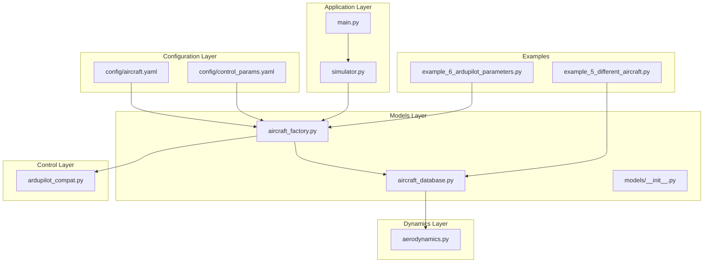
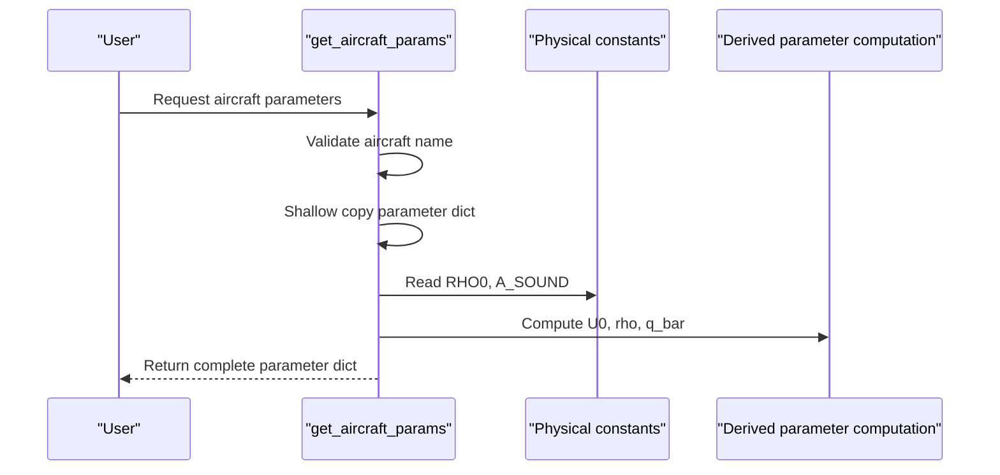
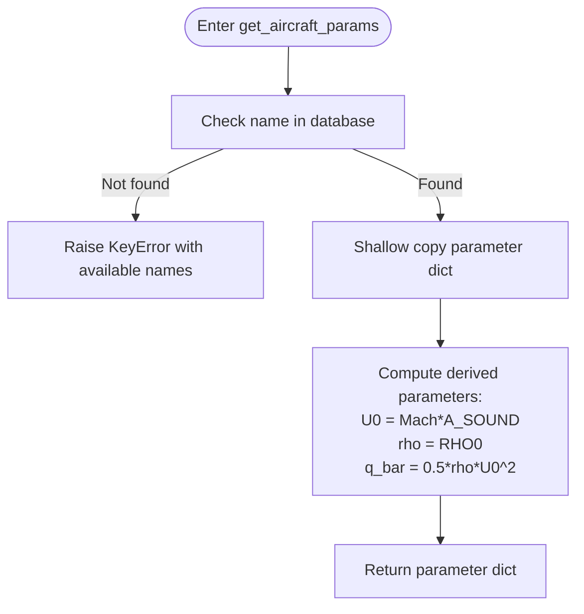
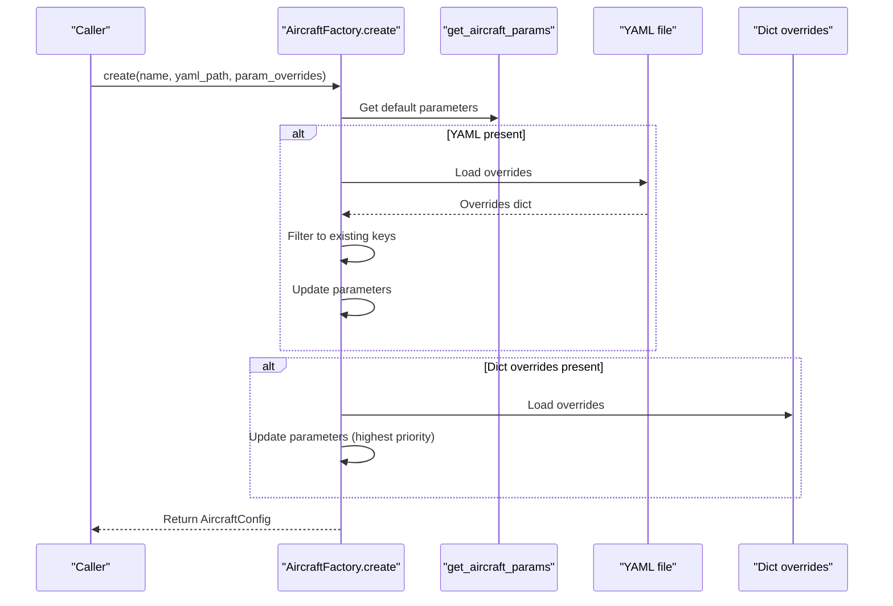
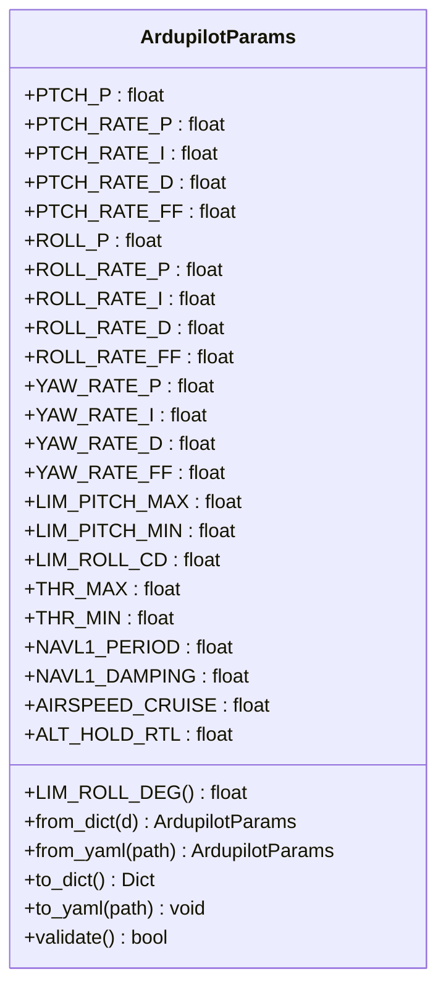
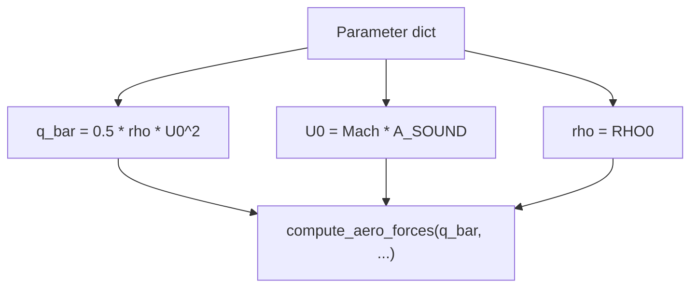
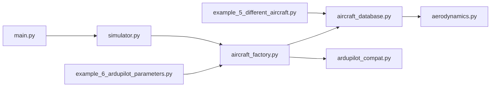

# Aircraft Models and Parameters

<cite>
**Referenced Files in This Document**
- [aircraft_database.py](file://src/models/aircraft_database.py)
- [aircraft_factory.py](file://src/models/aircraft_factory.py)
- [aircraft.yaml](file://config/aircraft.yaml)
- [control_params.yaml](file://config/control_params.yaml)
- [ardupilot_compat.py](file://src/control/ardupilot_compat.py)
- [aerodynamics.py](file://src/dynamics/aerodynamics.py)
- [example_5_different_aircraft.py](file://examples/example_5_different_aircraft.py)
- [example_6_ardupilot_parameters.py](file://examples/example_6_ardupilot_parameters.py)
- [main.py](file://main.py)
- [simulator.py](file://src/simulation/simulator.py)
- [__init__.py](file://src/models/__init__.py)
</cite>

## Table of Contents
1. [Introduction](#introduction)
2. [Project Structure](#project-structure)
3. [Core Components](#core-components)
4. [Architecture Overview](#architecture-overview)
5. [Detailed Component Analysis](#detailed-component-analysis)
6. [Dependency Analysis](#dependency-analysis)
7. [Performance Considerations](#performance-considerations)
8. [Troubleshooting Guide](#troubleshooting-guide)
9. [Conclusion](#conclusion)
10. [Appendices](#appendices)

## Introduction
This document describes the aircraft modeling system used by the fixed-wing simulator. It covers the aircraft parameter database with seven predefined aircraft types, parameter definitions and units, validation rules, the factory pattern implementation for configuration management, parameter override mechanisms, and ArduPilot compatibility features. Practical examples demonstrate configuration, tuning, and exporting parameters for real-world use.

## Project Structure
The aircraft modeling system resides in the models layer and integrates with configuration, control, and dynamics modules. The main entry point demonstrates how aircraft selection and configuration are used in simulations.

**Diagram sources**
- [aircraft_database.py](file://src/models/aircraft_database.py#L1-L183)
- [aircraft_factory.py](file://src/models/aircraft_factory.py#L1-L136)
- [aircraft.yaml](file://config/aircraft.yaml#L1-L13)
- [control_params.yaml](file://config/control_params.yaml#L1-L45)
- [ardupilot_compat.py](file://src/control/ardupilot_compat.py#L1-L130)
- [aerodynamics.py](file://src/dynamics/aerodynamics.py#L1-L148)
- [main.py](file://main.py#L1-L145)
- [simulator.py](file://src/simulation/simulator.py#L1-L200)
- [example_5_different_aircraft.py](file://examples/example_5_different_aircraft.py#L1-L65)
- [example_6_ardupilot_parameters.py](file://examples/example_6_ardupilot_parameters.py#L1-L85)

**Section sources**
- [aircraft_database.py](file://src/models/aircraft_database.py#L1-L183)
- [aircraft_factory.py](file://src/models/aircraft_factory.py#L1-L136)
- [aircraft.yaml](file://config/aircraft.yaml#L1-L13)
- [control_params.yaml](file://config/control_params.yaml#L1-L45)
- [ardupilot_compat.py](file://src/control/ardupilot_compat.py#L1-L130)
- [aerodynamics.py](file://src/dynamics/aerodynamics.py#L1-L148)
- [main.py](file://main.py#L1-L145)
- [simulator.py](file://src/simulation/simulator.py#L1-L200)
- [example_5_different_aircraft.py](file://examples/example_5_different_aircraft.py#L1-L65)
- [example_6_ardupilot_parameters.py](file://examples/example_6_ardupilot_parameters.py#L1-L85)

## Core Components
- Physical constants and derived parameters: gravity, sea-level density, gas constant, adiabatic index, speed of sound, and derived quantities used by dynamics (aircraft speed U0, density rho, dynamic pressure q_bar).
- Aircraft parameter database: seven predefined fixed-wing aircraft with geometry/inertia, longitudinal and lateral-directional aerodynamic coefficients, and flight-state Mach number.
- Aircraft factory: merges database defaults with YAML or dictionary overrides, validates parameters, and exports ArduPilot-compatible parameter sets.
- ArduPilot parameter container: loads/saves control parameters from YAML, validates ranges, and exposes convenience properties.
- Integration: the simulator consumes aircraft configurations and control parameters to initialize the control stack and dynamics.

**Section sources**
- [aircraft_database.py](file://src/models/aircraft_database.py#L14-L21)
- [aircraft_database.py](file://src/models/aircraft_database.py#L29-L133)
- [aircraft_database.py](file://src/models/aircraft_database.py#L143-L182)
- [aircraft_factory.py](file://src/models/aircraft_factory.py#L42-L74)
- [aircraft_factory.py](file://src/models/aircraft_factory.py#L95-L135)
- [ardupilot_compat.py](file://src/control/ardupilot_compat.py#L17-L129)

## Architecture Overview
The system follows a layered design:
- Constants and database define aircraft parameters and derived quantities.
- The factory merges defaults with overrides and produces a unified configuration.
- The dynamics module consumes parameters for aerodynamic computations.
- The control module uses ArduPilot-compatible parameters for closed-loop control.
- The simulator orchestrates configuration loading and runtime execution.

**Diagram sources**
- [aircraft_database.py](file://src/models/aircraft_database.py#L143-L166)

**Section sources**
- [aircraft_database.py](file://src/models/aircraft_database.py#L143-L166)

## Detailed Component Analysis

### Aircraft Parameter Database
- Responsibilities:
  - Define physical constants and derived quantities.
  - Store seven predefined aircraft entries with geometry/inertia, aerodynamic coefficients, and Mach number.
  - Provide public accessors to retrieve parameters, list aircraft, and produce human-readable summaries.
- Key functions:
  - get_aircraft_params: validates existence, copies parameters, injects derived fields (U0, rho, q_bar), raises KeyError if missing.
  - list_aircraft: returns available aircraft names.
  - aircraft_info: prints a compact summary including mass, wing area, wingspan, and calibrated speeds.
- Error handling:
  - KeyError raised with available names when a requested aircraft is not found.
- Performance:
  - Dictionary lookup O(1), derived computation O(1), minimal memory footprint.

**Diagram sources**
- [aircraft_database.py](file://src/models/aircraft_database.py#L143-L166)

**Section sources**
- [aircraft_database.py](file://src/models/aircraft_database.py#L14-L21)
- [aircraft_database.py](file://src/models/aircraft_database.py#L29-L133)
- [aircraft_database.py](file://src/models/aircraft_database.py#L143-L182)

### Aircraft Factory Pattern
- Responsibilities:
  - Merge database defaults with YAML or dictionary overrides.
  - Produce an AircraftConfig object containing the final parameter set.
  - Export ArduPilot-compatible parameter files (.param) combining aircraft and control parameters.
- Classes and methods:
  - AircraftConfig: holds name and aero_params, provides summary output.
  - AircraftFactory.create/from_yaml: apply YAML and dict overrides, return AircraftConfig.
  - export_ardupilot_params: writes MASS, WING_AREA, WING_SPAN, MEAN_CHORD, IXX, IYY, IZZ, AIRSPEED_CRUISE, and control parameters to a .param file.
- Override precedence:
  - YAML overrides (flat or nested) then dictionary overrides (highest priority).
- Integration:
  - Used by the simulator to initialize aircraft configuration and control parameters.

**Diagram sources**
- [aircraft_factory.py](file://src/models/aircraft_factory.py#L42-L74)

**Section sources**
- [aircraft_factory.py](file://src/models/aircraft_factory.py#L15-L37)
- [aircraft_factory.py](file://src/models/aircraft_factory.py#L42-L74)
- [aircraft_factory.py](file://src/models/aircraft_factory.py#L77-L92)
- [aircraft_factory.py](file://src/models/aircraft_factory.py#L95-L135)

### ArduPilot Parameter Container and Validation
- Responsibilities:
  - Provide ArduPilot-compatible parameter fields with sensible defaults.
  - Load from YAML, save to YAML, and validate ranges with warnings.
- Features:
  - from_dict/from_yaml: construct from dict/YAML, filtering unknown keys.
  - to_dict/to_yaml: export parameters.
  - validate: range checks for key parameters, prints warnings for out-of-range values.
- Usage:
  - Loaded by the simulator and exported via the factory’s ArduPilot export routine.

**Diagram sources**
- [ardupilot_compat.py](file://src/control/ardupilot_compat.py#L17-L129)

**Section sources**
- [ardupilot_compat.py](file://src/control/ardupilot_compat.py#L17-L129)

### Parameter Naming and TypedDict Compatibility
- Naming conventions:
  - Longitudinal: CL_, CD_, Cm_
  - Lateral-directional: CY_, Cl_, Cn_
  - Angular-rate subscripts: q (pitch), p (roll), r (yaw)
  - Control surface deflections: de (elevator), da (aileron), dr (rudder)
- Compatibility:
  - Keys mirror historical TypedDict to enable seamless replacement of data sources.

**Section sources**
- [aircraft_database.py](file://src/models/aircraft_database.py#L25-L26)
- [aircraft_database.py](file://src/models/aircraft_database.py#L29-L133)

### Derived Parameters and Dynamics Integration
- Derived parameters computed by the database:
  - U0 = Mach × speed of sound
  - rho = sea-level density
  - q_bar = 0.5 × rho × U0^2
- Dynamics usage:
  - Aerodynamic computations consume q_bar and geometric parameters for forces and moments.

**Diagram sources**
- [aircraft_database.py](file://src/models/aircraft_database.py#L159-L164)
- [aerodynamics.py](file://src/dynamics/aerodynamics.py#L90-L128)

**Section sources**
- [aircraft_database.py](file://src/models/aircraft_database.py#L159-L164)
- [aerodynamics.py](file://src/dynamics/aerodynamics.py#L90-L128)

### Aircraft Selection Criteria and Parameter Derivation
- Aircraft selection:
  - Choose from the seven predefined aircraft in the database.
  - The CLI and simulator enforce valid selections and provide a list option.
- Parameter derivation:
  - The database injects U0, rho, and q_bar for each selected aircraft.
- Operational considerations:
  - The simulator uses aircraft parameters to compute trim and initialize control targets.

**Section sources**
- [aircraft.yaml](file://config/aircraft.yaml#L3)
- [main.py](file://main.py#L32-L95)
- [simulator.py](file://src/simulation/simulator.py#L130-L158)
- [aircraft_database.py](file://src/models/aircraft_database.py#L143-L166)

### Parameter Override Mechanisms and Custom Aircraft Creation
- YAML overrides:
  - Flat or nested overrides supported; only existing keys are applied.
- Dictionary overrides:
  - Highest priority; useful for programmatic tuning.
- Custom aircraft creation:
  - Extend the database with new entries following the same key naming and units.
  - Use the factory to merge overrides and export ArduPilot parameters.

**Section sources**
- [aircraft_factory.py](file://src/models/aircraft_factory.py#L63-L72)
- [aircraft_factory.py](file://src/models/aircraft_factory.py#L77-L92)
- [aircraft_database.py](file://src/models/aircraft_database.py#L159-L164)

### ArduPilot Compatibility Features
- Export routine:
  - Writes aircraft physical parameters and control parameters to a .param file.
- Control parameters:
  - Loaded from control_params.yaml and validated for safe operation.
- Integration:
  - The simulator initializes ArduPilot-compatible controllers using these parameters.

**Section sources**
- [aircraft_factory.py](file://src/models/aircraft_factory.py#L95-L135)
- [ardupilot_compat.py](file://src/control/ardupilot_compat.py#L104-L129)
- [simulator.py](file://src/simulation/simulator.py#L165-L171)

## Dependency Analysis
- Internal dependencies:
  - aircraft_database.py depends on typing and math.
  - aircraft_factory.py depends on yaml, os, dataclasses, and aircraft_database.
  - aerodynamics.py depends on parameters from the database.
- External dependencies:
  - PyYAML for YAML parsing.
  - NumPy for numerical operations in examples/tests.
- No circular imports; clear separation of concerns.

**Diagram sources**
- [aircraft_database.py](file://src/models/aircraft_database.py#L1-L183)
- [aircraft_factory.py](file://src/models/aircraft_factory.py#L1-L136)
- [aerodynamics.py](file://src/dynamics/aerodynamics.py#L1-L148)
- [ardupilot_compat.py](file://src/control/ardupilot_compat.py#L1-L130)
- [example_5_different_aircraft.py](file://examples/example_5_different_aircraft.py#L1-L65)
- [example_6_ardupilot_parameters.py](file://examples/example_6_ardupilot_parameters.py#L1-L85)
- [simulator.py](file://src/simulation/simulator.py#L1-L200)
- [main.py](file://main.py#L1-L145)

**Section sources**
- [aircraft_database.py](file://src/models/aircraft_database.py#L1-L183)
- [aircraft_factory.py](file://src/models/aircraft_factory.py#L1-L136)
- [aerodynamics.py](file://src/dynamics/aerodynamics.py#L1-L148)
- [ardupilot_compat.py](file://src/control/ardupilot_compat.py#L1-L130)
- [example_5_different_aircraft.py](file://examples/example_5_different_aircraft.py#L1-L65)
- [example_6_ardupilot_parameters.py](file://examples/example_6_ardupilot_parameters.py#L1-L85)
- [simulator.py](file://src/simulation/simulator.py#L1-L200)
- [main.py](file://main.py#L1-L145)

## Performance Considerations
- Data structures:
  - Parameter dictionaries provide O(1) lookup; shallow copying avoids deep-copy overhead.
- Derived parameters:
  - Pure mathematical operations with negligible cost.
- I/O:
  - YAML reads occur in the factory; cache frequently used configurations to reduce repeated I/O.
- Numerical stability:
  - Dynamics modules guard against extreme low-speed conditions using dynamic pressure thresholds.

[No sources needed since this section provides general guidance]

## Troubleshooting Guide
- Unknown aircraft name:
  - Symptom: ValueError/KeyError indicating invalid name.
  - Action: Verify spelling and consult the list of available aircraft.
- Parameter out of range:
  - Symptom: Validation warnings for ArduPilot parameters.
  - Action: Adjust values within allowable ranges.
- YAML path errors:
  - Symptom: FileNotFoundError when loading configuration.
  - Action: Confirm file path and permissions.
- Export write failures:
  - Symptom: Permission denied when writing .param file.
  - Action: Ensure output directory exists and is writable.

**Section sources**
- [aircraft_database.py](file://src/models/aircraft_database.py#L153-L156)
- [ardupilot_compat.py](file://src/control/ardupilot_compat.py#L110-L129)
- [aircraft_factory.py](file://src/models/aircraft_factory.py#L84-L88)
- [aircraft_factory.py](file://src/models/aircraft_factory.py#L129-L133)

## Conclusion
The aircraft modeling system combines a compact parameter database, a robust factory pattern for configuration management, and ArduPilot-compatible controls to deliver a flexible and extensible framework. The seven predefined aircraft provide a solid baseline, while the override mechanisms and export routines support rapid iteration and real-world integration. Extending the database with new aircraft types is straightforward, following established naming conventions and ensuring derived parameters remain consistent.

[No sources needed since this section summarizes without analyzing specific files]

## Appendices

### A. Seven Predefined Aircraft Types and Parameter Categories
- Aircraft types: TB2, Anka, Aksungur, Karayel, Predator, Heron MK1, Heron MK2.
- Parameter categories:
  - Identification: name, company, country.
  - Geometry/inertia: mass, wing area S, mean chord c, wingspan b, moments of inertia Ixx, Iyy, Izz, Ixz.
  - Aerodynamics: longitudinal (CL_0, CL_alpha, CL_q, CL_deltae, CD_0, CD_alpha, CD_q, CD_deltae, Cm_0, Cm_alpha, Cm_q, Cm_deltae), lateral-directional (CYb, CYp, CYr, CYda, CYdr; Clb, Clp, Clr, Clda, Cldr; Cnb, Cnp, Cnr, Cnda, Cndr).
  - Flight state: Mach number.

**Section sources**
- [aircraft_database.py](file://src/models/aircraft_database.py#L29-L133)
- [aircraft.yaml](file://config/aircraft.yaml#L3)

### B. Parameter Naming Conventions and TypedDict Compatibility
- Prefixes:
  - Longitudinal: CL_, CD_, Cm_
  - Lateral-directional: CY_, Cl_, Cn_
  - Angular rates: q (pitch), p (roll), r (yaw)
  - Deflections: de (elevator), da (aileron), dr (rudder)
- Compatibility:
  - Keys align with historical TypedDict definitions for seamless migration.

**Section sources**
- [aircraft_database.py](file://src/models/aircraft_database.py#L25-L26)

### C. Extending the Aircraft Database with New Types
- Steps:
  - Add a new entry to the database dictionary with keys following the established naming scheme.
  - If introducing new derived parameters, update the injection logic accordingly.
  - Use the factory to validate overrides and export ArduPilot parameters.

**Section sources**
- [aircraft_database.py](file://src/models/aircraft_database.py#L159-L164)
- [aircraft_factory.py](file://src/models/aircraft_factory.py#L42-L74)

### D. Practical Examples and Usage Patterns
- Comparing aircraft performance:
  - Example script demonstrates loading parameters for all seven aircraft and analyzing short-period modes.
- ArduPilot parameter sensitivity:
  - Example script loads control parameters from YAML, validates them, exports .param files, and compares closed-loop tracking with varying pitch gains.

**Section sources**
- [example_5_different_aircraft.py](file://examples/example_5_different_aircraft.py#L1-L65)
- [example_6_ardupilot_parameters.py](file://examples/example_6_ardupilot_parameters.py#L1-L85)

### E. Aircraft Selection and Configuration in the Simulator
- CLI selection:
  - The main entry point accepts an aircraft argument with automatic validation and a listing option.
- Runtime initialization:
  - The simulator constructs an AircraftConfig via the factory and uses it to initialize dynamics and control layers.

**Section sources**
- [main.py](file://main.py#L32-L95)
- [simulator.py](file://src/simulation/simulator.py#L130-L158)
- [__init__.py](file://src/models/__init__.py#L1-L15)