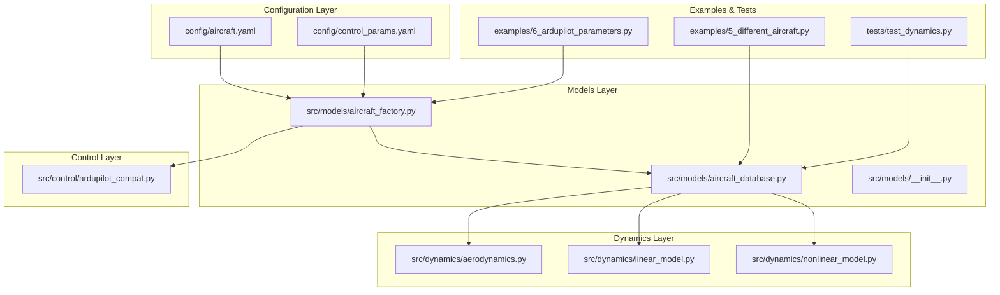
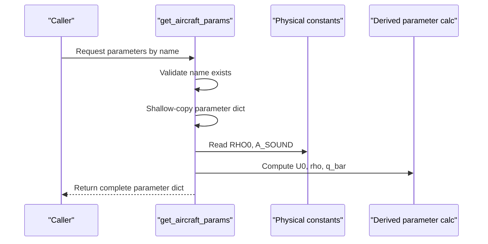
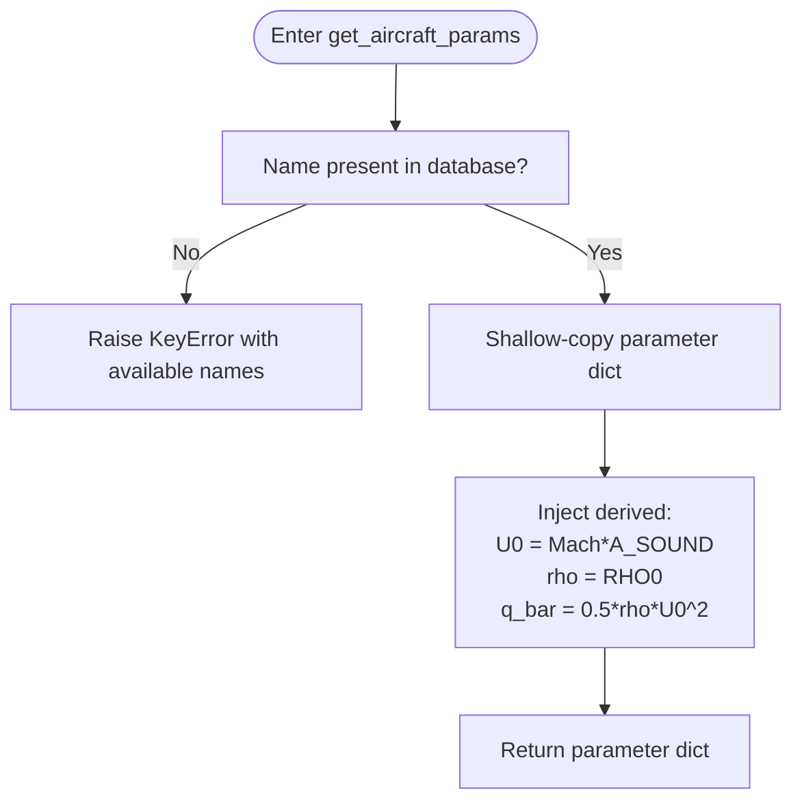
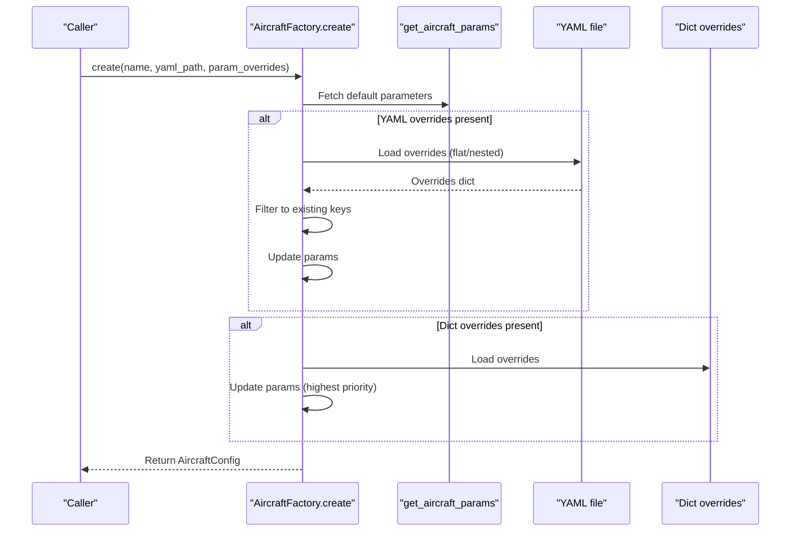
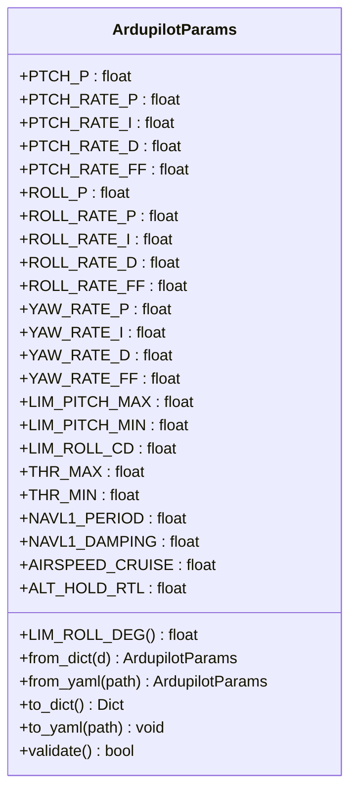
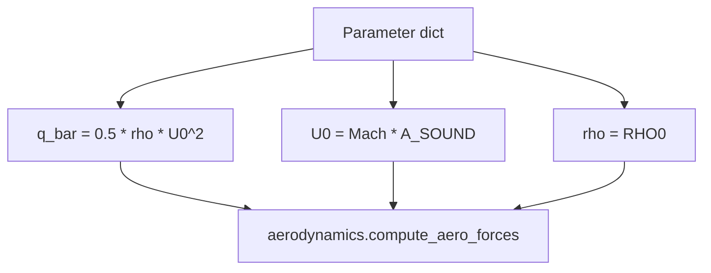
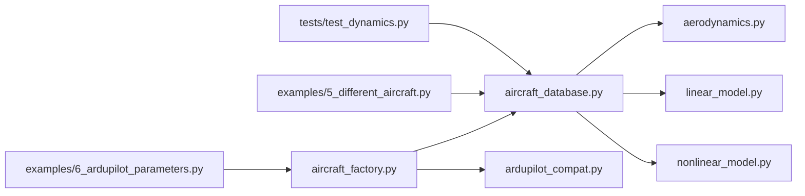

# Aircraft Parameter Database

<cite>
**Referenced Files in This Document**
- [aircraft_database.py](file://src/models/aircraft_database.py)
- [aircraft_factory.py](file://src/models/aircraft_factory.py)
- [aircraft.yaml](file://config/aircraft.yaml)
- [control_params.yaml](file://config/control_params.yaml)
- [ardupilot_compat.py](file://src/control/ardupilot_compat.py)
- [aerodynamics.py](file://src/dynamics/aerodynamics.py)
- [nonlinear_model.py](file://src/dynamics/nonlinear_model.py)
- [linear_model.py](file://src/dynamics/linear_model.py)
- [5_different_aircraft.py](file://examples/5_different_aircraft.py)
- [6_ardupilot_parameters.py](file://examples/6_ardupilot_parameters.py)
- [test_dynamics.py](file://tests/test_dynamics.py)
</cite>

## Table of Contents
1. [Introduction](#introduction)
2. [Project Structure](#project-structure)
3. [Core Components](#core-components)
4. [Architecture Overview](#architecture-overview)
5. [Detailed Component Analysis](#detailed-component-analysis)
6. [Dependency Analysis](#dependency-analysis)
7. [Performance Considerations](#performance-considerations)
8. [Troubleshooting Guide](#troubleshooting-guide)
9. [Conclusion](#conclusion)
10. [Appendices](#appendices)

## Introduction
This document describes the aircraft parameter database system that powers fixed-wing simulations. It covers the complete database structure for seven predefined aircraft types, including identification, geometry, aerodynamics, and inertial parameters. It also documents derived parameter calculations used by the dynamics engine (U0, rho, q_bar), parameter naming conventions, units, validation rules, lookup and listing methods, human-readable information display, parameter ranges, and error handling for invalid aircraft names.

## Project Structure
The aircraft parameter database resides in the models layer and integrates with configuration files, the aircraft factory, and the dynamics engine. The configuration layer supplies optional overrides and control parameters, while the factory merges defaults with user-provided overrides and exports ArduPilot-compatible parameter sets.

**Diagram sources**
- [aircraft_database.py](file://src/models/aircraft_database.py#L1-L183)
- [aircraft_factory.py](file://src/models/aircraft_factory.py#L1-L136)
- [aircraft.yaml](file://config/aircraft.yaml#L1-L13)
- [control_params.yaml](file://config/control_params.yaml#L1-L45)
- [ardupilot_compat.py](file://src/control/ardupilot_compat.py#L1-L130)
- [aerodynamics.py](file://src/dynamics/aerodynamics.py#L90-L128)
- [linear_model.py](file://src/dynamics/linear_model.py#L161-L208)
- [nonlinear_model.py](file://src/dynamics/nonlinear_model.py#L114-L197)
- [5_different_aircraft.py](file://examples/5_different_aircraft.py#L1-L65)
- [6_ardupilot_parameters.py](file://examples/6_ardupilot_parameters.py#L1-L85)
- [test_dynamics.py](file://tests/test_dynamics.py#L190-L336)

**Section sources**
- [aircraft_database.py](file://src/models/aircraft_database.py#L1-L183)
- [aircraft_factory.py](file://src/models/aircraft_factory.py#L1-L136)
- [aircraft.yaml](file://config/aircraft.yaml#L1-L13)
- [control_params.yaml](file://config/control_params.yaml#L1-L45)
- [ardupilot_compat.py](file://src/control/ardupilot_compat.py#L1-L130)
- [aerodynamics.py](file://src/dynamics/aerodynamics.py#L90-L128)
- [linear_model.py](file://src/dynamics/linear_model.py#L161-L208)
- [nonlinear_model.py](file://src/dynamics/nonlinear_model.py#L114-L197)
- [5_different_aircraft.py](file://examples/5_different_aircraft.py#L1-L65)
- [6_ardupilot_parameters.py](file://examples/6_ardupilot_parameters.py#L1-L85)
- [test_dynamics.py](file://tests/test_dynamics.py#L190-L336)

## Core Components
- Physical constants and derived parameters
  - Standard gravity, sea-level density, gas constant, adiabatic index, and speed of sound define baseline atmospheric conditions.
  - Derived parameters injected per-aircraft: true airspeed U0 = Mach × speed of sound; air density rho = sea-level density; dynamic pressure q_bar = 0.5 × rho × U0^2.
- Main database
  - Seven fixed-wing aircraft entries with identification, geometry/inertia, and longitudinal/lateral aerodynamic coefficients.
  - Public accessors: get_aircraft_params, list_aircraft, aircraft_info.
- Aircraft factory and configuration
  - Merge database defaults with YAML or dictionary overrides; export ArduPilot-compatible parameter files (.param).
- ArduPilot parameter container and validation
  - Strongly-typed parameter container with YAML load/save and basic range validation.

**Section sources**
- [aircraft_database.py](file://src/models/aircraft_database.py#L14-L21)
- [aircraft_database.py](file://src/models/aircraft_database.py#L29-L133)
- [aircraft_database.py](file://src/models/aircraft_database.py#L143-L182)
- [aircraft_factory.py](file://src/models/aircraft_factory.py#L42-L74)
- [aircraft_factory.py](file://src/models/aircraft_factory.py#L95-L135)
- [ardupilot_compat.py](file://src/control/ardupilot_compat.py#L17-L129)

## Architecture Overview
The database follows a three-layer design:
- Constants layer: physical and atmospheric constants.
- Data layer: parameter dictionaries for seven aircraft, keyed by aircraft name.
- Access layer: public functions to validate existence, copy parameters, inject derived values, and summarize.

**Diagram sources**
- [aircraft_database.py](file://src/models/aircraft_database.py#L143-L166)

**Section sources**
- [aircraft_database.py](file://src/models/aircraft_database.py#L143-L166)

## Detailed Component Analysis

### Component A: Aircraft Parameter Database (aircraft_database.py)
Responsibilities:
- Define physical constants and derived parameter computation.
- Maintain seven aircraft parameter dictionaries with keys aligned to historical TypedDict for seamless replacement.
- Provide public functions: get_aircraft_params, list_aircraft, aircraft_info.

Key functions:
- get_aircraft_params: validates presence, copies parameters, injects U0, rho, q_bar, raises KeyError with available names if missing.
- list_aircraft: returns the list of supported aircraft names.
- aircraft_info: returns a human-readable summary including mass, wing area, span, and computed U0.

Error handling:
- KeyError raised with a helpful message listing available aircraft names when an invalid name is requested.

Performance characteristics:
- Dictionary lookup O(1), derived parameter computation O(1), minimal memory overhead.

**Diagram sources**
- [aircraft_database.py](file://src/models/aircraft_database.py#L143-L166)

**Section sources**
- [aircraft_database.py](file://src/models/aircraft_database.py#L14-L21)
- [aircraft_database.py](file://src/models/aircraft_database.py#L29-L133)
- [aircraft_database.py](file://src/models/aircraft_database.py#L143-L182)

### Component B: Aircraft Factory (aircraft_factory.py)
Responsibilities:
- Merge database defaults with YAML or dictionary overrides.
- Build AircraftConfig instances for consumption by the simulation engine.
- Export ArduPilot-compatible parameter files (.param) including aircraft and control parameters.

Key classes and methods:
- AircraftConfig: holds name and aero_params, with a summary method.
- AircraftFactory.create/from_yaml: fetch defaults, apply YAML overrides (flat or nested), apply dict overrides (highest priority), return AircraftConfig.
- export_ardupilot_params: writes MASS, WING_AREA, WING_SPAN, MEAN_CHORD, IXX/IYY/IZZ, AIRSPEED_CRUISE, and selected control parameters to a .param file.

Override precedence:
- YAML overrides (flat or nested) → dictionary overrides (highest priority).

**Diagram sources**
- [aircraft_factory.py](file://src/models/aircraft_factory.py#L42-L74)

**Section sources**
- [aircraft_factory.py](file://src/models/aircraft_factory.py#L15-L37)
- [aircraft_factory.py](file://src/models/aircraft_factory.py#L42-L74)
- [aircraft_factory.py](file://src/models/aircraft_factory.py#L77-L92)
- [aircraft_factory.py](file://src/models/aircraft_factory.py#L95-L135)

### Component C: ArduPilot Parameter Container and Validation (ardupilot_compat.py)
Responsibilities:
- Provide a strongly-typed parameter container matching ArduPilot naming conventions.
- Support loading from YAML, saving to YAML, and validating parameter ranges.

Key features:
- from_dict/from_yaml: construct from flat dicts/YAML; unknown keys ignored.
- to_dict/to_yaml: export parameters.
- validate: range checks for selected parameters, prints warnings for out-of-range values.

Usage scenarios:
- Loading control parameters, adjusting gains, exporting to .param for ArduPilot.

**Diagram sources**
- [ardupilot_compat.py](file://src/control/ardupilot_compat.py#L17-L129)

**Section sources**
- [ardupilot_compat.py](file://src/control/ardupilot_compat.py#L17-L129)

### Component D: Parameter Naming Conventions and TypedDict Compatibility
Naming conventions:
- Longitudinal aerodynamics: CL_, CD_, Cm_
- Lateral aerodynamics: CY_, Cl_, Cn_
- Angle-of-attack and sideslip: alpha, beta
- Angular rates: p, q, r (roll, pitch, yaw)
- Control derivatives: deltae (elevator), da (aileron), dr (rudder)
- Geometric/inertial: mass, S (area), c (mean chord), b (span), Ixx, Iyy, Izz, Ixz
- Flight condition: Mach

Compatibility:
- Keys mirror historical TypedDict to enable drop-in replacement.

**Section sources**
- [aircraft_database.py](file://src/models/aircraft_database.py#L25-L26)
- [aircraft_database.py](file://src/models/aircraft_database.py#L29-L133)

### Component E: Derived Parameter Calculations and Dynamics Engine Usage
Derived parameters:
- U0 = Mach × speed of sound
- rho = sea-level density
- q_bar = 0.5 × rho × U0^2

Dynamics usage:
- Aerodynamics module consumes q_bar for force computations.
- Nonlinear and linear models precompute derived parameters for performance.

**Diagram sources**
- [aircraft_database.py](file://src/models/aircraft_database.py#L159-L164)
- [aerodynamics.py](file://src/dynamics/aerodynamics.py#L90-L128)
- [nonlinear_model.py](file://src/dynamics/nonlinear_model.py#L114-L197)
- [linear_model.py](file://src/dynamics/linear_model.py#L161-L208)

**Section sources**
- [aircraft_database.py](file://src/models/aircraft_database.py#L159-L164)
- [aerodynamics.py](file://src/dynamics/aerodynamics.py#L90-L128)
- [nonlinear_model.py](file://src/dynamics/nonlinear_model.py#L114-L197)
- [linear_model.py](file://src/dynamics/linear_model.py#L161-L208)
- [test_dynamics.py](file://tests/test_dynamics.py#L190-L195)

### Component F: Query and Export Interfaces
Query interfaces:
- list_aircraft(): returns all supported aircraft names.
- get_aircraft_params(name): returns the full parameter dictionary with derived values injected.
- aircraft_info(name): returns a human-readable summary string.

Export interfaces:
- export_ardupilot_params(name, output_path, control_yaml): exports ArduPilot .param file including aircraft physical parameters and selected control parameters.

**Section sources**
- [aircraft_database.py](file://src/models/aircraft_database.py#L169-L182)
- [aircraft_factory.py](file://src/models/aircraft_factory.py#L95-L135)

## Dependency Analysis
Module coupling:
- aircraft_database.py depends only on typing and math; highly cohesive.
- aircraft_factory.py depends on yaml, os, dataclasses, and aircraft_database.
- aerodynamics.py relies on coefficient keys present in parameter dictionaries.
- linear_model.py and nonlinear_model.py rely on derived parameters injected by the database.

External dependencies:
- PyYAML for configuration loading.
- NumPy used in examples/tests.

Circular dependencies:
- None detected; clear hierarchical flow from models to dynamics and control.

**Diagram sources**
- [aircraft_database.py](file://src/models/aircraft_database.py#L1-L183)
- [aircraft_factory.py](file://src/models/aircraft_factory.py#L1-L136)
- [aerodynamics.py](file://src/dynamics/aerodynamics.py#L90-L128)
- [linear_model.py](file://src/dynamics/linear_model.py#L161-L208)
- [nonlinear_model.py](file://src/dynamics/nonlinear_model.py#L114-L197)
- [ardupilot_compat.py](file://src/control/ardupilot_compat.py#L1-L130)
- [5_different_aircraft.py](file://examples/5_different_aircraft.py#L1-L65)
- [6_ardupilot_parameters.py](file://examples/6_ardupilot_parameters.py#L1-L85)
- [test_dynamics.py](file://tests/test_dynamics.py#L190-L336)

**Section sources**
- [aircraft_database.py](file://src/models/aircraft_database.py#L1-L183)
- [aircraft_factory.py](file://src/models/aircraft_factory.py#L1-L136)
- [aerodynamics.py](file://src/dynamics/aerodynamics.py#L90-L128)
- [linear_model.py](file://src/dynamics/linear_model.py#L161-L208)
- [nonlinear_model.py](file://src/dynamics/nonlinear_model.py#L114-L197)
- [ardupilot_compat.py](file://src/control/ardupilot_compat.py#L1-L130)
- [5_different_aircraft.py](file://examples/5_different_aircraft.py#L1-L65)
- [6_ardupilot_parameters.py](file://examples/6_ardupilot_parameters.py#L1-L85)
- [test_dynamics.py](file://tests/test_dynamics.py#L190-L336)

## Performance Considerations
- Data structure: parameter dictionaries provide O(1) lookup; shallow copying avoids deep-copy overhead.
- Derived computation: constant-time arithmetic per aircraft.
- I/O: YAML reads/writes occur in the factory layer; cache frequently used configurations to reduce repeated disk access.
- Numerical stability: dynamics modules guard against extreme low-speed regimes via q_bar and trim routines.

[No sources needed since this section provides general guidance]

## Troubleshooting Guide
- Aircraft not found
  - Symptom: KeyError indicating the aircraft name is not present; includes available names.
  - Action: Verify spelling and capitalization; use list_aircraft() to confirm availability.
  - Reference: [aircraft_database.py](file://src/models/aircraft_database.py#L153-L156)
- Parameter out of range (ArduPilot)
  - Symptom: validate() prints warnings for out-of-range values.
  - Action: Adjust control parameters within documented bounds.
  - Reference: [ardupilot_compat.py](file://src/control/ardupilot_compat.py#L110-L129)
- YAML path errors
  - Symptom: FileNotFoundError when loading configuration files.
  - Action: Confirm file paths exist and are readable.
  - Reference: [aircraft_factory.py](file://src/models/aircraft_factory.py#L84-L88)
- Export permission issues
  - Symptom: Failure to write .param file.
  - Action: Ensure output directory exists and has write permissions.
  - Reference: [aircraft_factory.py](file://src/models/aircraft_factory.py#L129-L133)

**Section sources**
- [aircraft_database.py](file://src/models/aircraft_database.py#L153-L156)
- [ardupilot_compat.py](file://src/control/ardupilot_compat.py#L110-L129)
- [aircraft_factory.py](file://src/models/aircraft_factory.py#L84-L88)
- [aircraft_factory.py](file://src/models/aircraft_factory.py#L129-L133)

## Conclusion
The aircraft parameter database offers a compact, efficient, and compatible foundation for fixed-wing simulations. It preserves historical TypedDict compatibility, injects necessary derived parameters for the dynamics engine, and supports runtime overrides and ArduPilot parameter export. The factory layer enables safe merging of defaults and user-provided configurations, while validation and error handling improve robustness. Extending the database with new aircraft requires adherence to naming conventions and careful handling of derived parameters and validation rules.

[No sources needed since this section summarizes without analyzing specific files]

## Appendices

### A. Supported Aircraft and Parameter Categories
Supported aircraft: TB2, Anka, Aksungur, Karayel, Predator, Heron MK1, Heron MK2.

Categories:
- Identification: name, company, country
- Geometry/inertia: mass, S (wing area), c (mean chord), b (span), Ixx, Iyy, Izz, Ixz
- Aerodynamics: longitudinal (CL_*, CD_*, Cm_*), lateral-directional (CY_*, Cl_*, Cn_*), control derivatives
- Flight condition: Mach

**Section sources**
- [aircraft_database.py](file://src/models/aircraft_database.py#L29-L133)
- [aircraft.yaml](file://config/aircraft.yaml#L3)

### B. Parameter Naming Norms and TypedDict Alignment
- Prefixes: CL_/CD_/Cm_ (longitudinal), CY_/Cl_/Cn_ (lateral), alpha/beta (angles), p/q/r (rates), de/da/dr (controls)
- Units: meters, kilograms, radians, seconds, derived pressures and speeds as applicable
- Compatibility: keys mirror historical TypedDict for seamless replacement

**Section sources**
- [aircraft_database.py](file://src/models/aircraft_database.py#L25-L26)

### C. Extending the Database with a New Aircraft
Steps:
- Add a new entry to the database dictionary with keys following naming conventions and units.
- If introducing new parameters, update derived parameter injection or provide overrides via the factory.
- Validate behavior using examples and tests.

**Section sources**
- [aircraft_database.py](file://src/models/aircraft_database.py#L159-L164)
- [aircraft_factory.py](file://src/models/aircraft_factory.py#L42-L74)

### D. Parameter Validation Mechanisms and Error Handling
- Database-level: KeyError with available names list for invalid aircraft.
- Control-level: ArduPilot parameter range validation with warnings.
- Factory-level: YAML existence checks and filtering of overrides to existing keys.

**Section sources**
- [aircraft_database.py](file://src/models/aircraft_database.py#L153-L156)
- [ardupilot_compat.py](file://src/control/ardupilot_compat.py#L110-L129)
- [aircraft_factory.py](file://src/models/aircraft_factory.py#L64-L72)
- [aircraft_factory.py](file://src/models/aircraft_factory.py#L84-L88)

### E. Derived Parameter Calculation Logic
- U0 = Mach × A_SOUND
- rho = RHO0
- q_bar = 0.5 × rho × U0^2
- Used directly by aerodynamics and precomputed by nonlinear/linear models.

**Section sources**
- [aircraft_database.py](file://src/models/aircraft_database.py#L159-L164)
- [aerodynamics.py](file://src/dynamics/aerodynamics.py#L90-L128)
- [nonlinear_model.py](file://src/dynamics/nonlinear_model.py#L114-L197)
- [linear_model.py](file://src/dynamics/linear_model.py#L161-L208)

### F. Query and Export Interface Usage Examples
- Queries: list_aircraft(), get_aircraft_params(name), aircraft_info(name)
- Exports: export_ardupilot_params(name, output_path, control_yaml)

**Section sources**
- [aircraft_database.py](file://src/models/aircraft_database.py#L169-L182)
- [aircraft_factory.py](file://src/models/aircraft_factory.py#L95-L135)