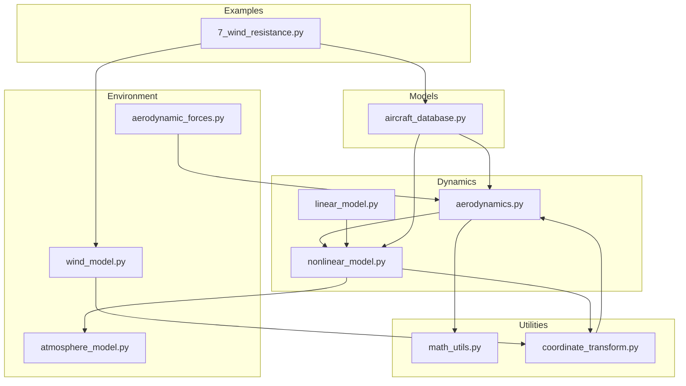
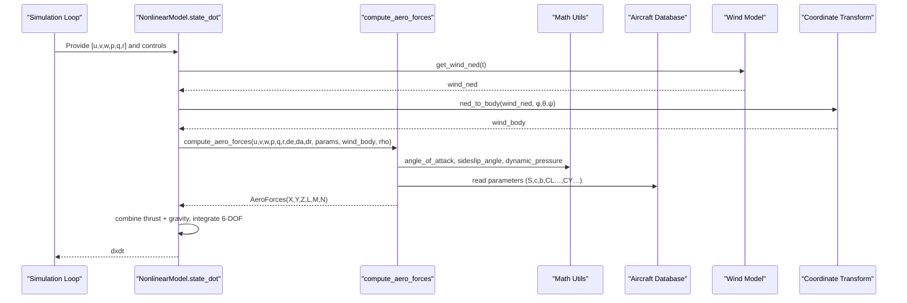
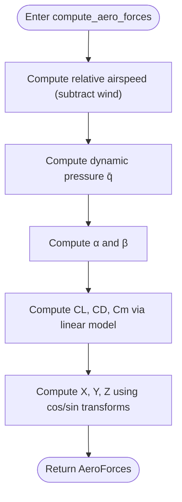
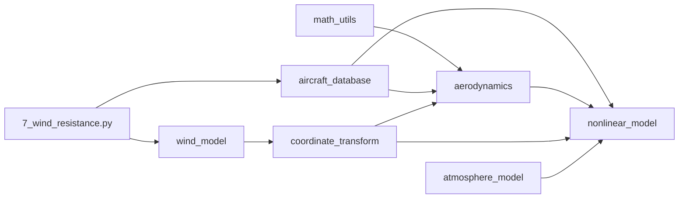

# Aerodynamics Principles

<cite>
**Referenced Files in This Document**
- [aerodynamics.py](file://src/dynamics/aerodynamics.py)
- [nonlinear_model.py](file://src/dynamics/nonlinear_model.py)
- [linear_model.py](file://src/dynamics/linear_model.py)
- [aircraft_database.py](file://src/models/aircraft_database.py)
- [math_utils.py](file://src/utils/math_utils.py)
- [wind_model.py](file://src/environment/wind_model.py)
- [coordinate_transform.py](file://src/dynamics/coordinate_transform.py)
- [atmosphere_model.py](file://src/environment/atmosphere_model.py)
- [aerodynamic_forces.py](file://src/environment/aerodynamic_forces.py)
- [aircraft.yaml](file://config/aircraft.yaml)
- [simulation.yaml](file://config/simulation.yaml)
- [7_wind_resistance.py](file://examples/7_wind_resistance.py)
</cite>

## Table of Contents
1. [Introduction](#introduction)
2. [Project Structure](#project-structure)
3. [Core Components](#core-components)
4. [Architecture Overview](#architecture-overview)
5. [Detailed Component Analysis](#detailed-component-analysis)
6. [Dependency Analysis](#dependency-analysis)
7. [Performance Considerations](#performance-considerations)
8. [Troubleshooting Guide](#troubleshooting-guide)
9. [Conclusion](#conclusion)
10. [Appendices](#appendices)

## Introduction
This document explains the aerodynamic principles implemented in the fixed-wing simulation stack, focusing on the forces and moments acting on a fixed-wing aircraft. It covers lift generation, drag characteristics, thrust modeling, aerodynamic coefficients, angle-of-attack and sideslip effects, wind and atmospheric influences, and computational methods used in the simulation. The goal is to connect theory with the codebase so users can understand how the simulation computes airframe loads and integrates them into the 6-DOF equations of motion.

## Project Structure
The aerodynamic computation pipeline spans several modules:
- Dynamics: aerodynamic force/moment calculation and 6-DOF integration
- Environment: wind models and atmospheric conditions
- Models: aircraft parameter database and derived quantities
- Utilities: angle and dynamic pressure functions
- Examples: demonstrations of wind resistance and simulation behavior

**Diagram sources**
- [aerodynamics.py](file://src/dynamics/aerodynamics.py#L1-L148)
- [nonlinear_model.py](file://src/dynamics/nonlinear_model.py#L1-L386)
- [linear_model.py](file://src/dynamics/linear_model.py#L1-L319)
- [wind_model.py](file://src/environment/wind_model.py#L1-L113)
- [atmosphere_model.py](file://src/environment/atmosphere_model.py#L1-L77)
- [aerodynamic_forces.py](file://src/environment/aerodynamic_forces.py#L1-L54)
- [aircraft_database.py](file://src/models/aircraft_database.py#L1-L183)
- [math_utils.py](file://src/utils/math_utils.py#L1-L124)
- [coordinate_transform.py](file://src/dynamics/coordinate_transform.py#L1-L70)
- [7_wind_resistance.py](file://examples/7_wind_resistance.py#L1-L52)

**Section sources**
- [aerodynamics.py](file://src/dynamics/aerodynamics.py#L1-L148)
- [nonlinear_model.py](file://src/dynamics/nonlinear_model.py#L1-L386)
- [aircraft_database.py](file://src/models/aircraft_database.py#L1-L183)
- [math_utils.py](file://src/utils/math_utils.py#L1-L124)
- [wind_model.py](file://src/environment/wind_model.py#L1-L113)
- [atmosphere_model.py](file://src/environment/atmosphere_model.py#L1-L77)
- [aerodynamic_forces.py](file://src/environment/aerodynamic_forces.py#L1-L54)
- [coordinate_transform.py](file://src/dynamics/coordinate_transform.py#L1-L70)
- [7_wind_resistance.py](file://examples/7_wind_resistance.py#L1-L52)

## Core Components
- AeroForces: container for body-axis forces (X, Y, Z) and moments (L, M, N), along with non-dimensional coefficients (CL, CD, CY, Cl, Cm, Cn), angles (alpha, beta), and dynamic pressure (q_bar).
- compute_aero_forces: computes aerodynamic forces and moments from body velocities, angular rates, control deflections, aircraft parameters, optional wind, and air density.
- Math utilities: angle_of_attack, sideslip_angle, dynamic_pressure.
- Aircraft database: provides geometric and aerodynamic parameters and injects derived quantities (U0, rho, q_bar).
- Nonlinear model: integrates 6-DOF equations using computed aerodynamics, gravity, and thrust.
- Wind and atmosphere: wind models and ISA density for realistic environmental conditions.
- Wind drag increments: estimates additional body-axis drag due to relative wind beyond baseline aerodynamics.

**Section sources**
- [aerodynamics.py](file://src/dynamics/aerodynamics.py#L19-L148)
- [math_utils.py](file://src/utils/math_utils.py#L107-L124)
- [aircraft_database.py](file://src/models/aircraft_database.py#L143-L166)
- [nonlinear_model.py](file://src/dynamics/nonlinear_model.py#L160-L256)
- [aerodynamic_forces.py](file://src/environment/aerodynamic_forces.py#L13-L54)
- [wind_model.py](file://src/environment/wind_model.py#L18-L113)
- [atmosphere_model.py](file://src/environment/atmosphere_model.py#L48-L77)

## Architecture Overview
The aerodynamic computation is invoked during the 6-DOF integration loop. Wind (NED) is transformed to body coordinates, combined with body velocity to form true airspeed, and used to compute angles and dynamic pressure. Aerodynamic coefficients are evaluated using linear models of CL, CD, Cm, CY, Cl, Cn. Forces and moments are computed and combined with thrust and gravity to integrate the equations of motion.

**Diagram sources**
- [nonlinear_model.py](file://src/dynamics/nonlinear_model.py#L160-L256)
- [aerodynamics.py](file://src/dynamics/aerodynamics.py#L35-L148)
- [math_utils.py](file://src/utils/math_utils.py#L107-L124)
- [aircraft_database.py](file://src/models/aircraft_database.py#L143-L166)
- [wind_model.py](file://src/environment/wind_model.py#L76-L108)
- [coordinate_transform.py](file://src/dynamics/coordinate_transform.py#L39-L53)

## Detailed Component Analysis

### Lift Generation Mechanisms
- Definition: Angle of attack α is computed from body velocity components (u, w). Lift is primarily generated normal to the undisturbed airflow direction.
- Coefficient model: Longitudinal CL depends on α, pitch rate q (normalized by c and U0), and elevator deflection δe.
- Force projection: In the body frame, lift contributes to Z (approximately −CL · q_bar · S when α is small) and couples with drag via cos/sin terms in the full expression.
- Non-dimensionalization: q_bar = 0.5 · ρ · V²; normalized pitch rate q_hat = q · c / (2 · U0).

**Diagram sources**
- [aerodynamics.py](file://src/dynamics/aerodynamics.py#L68-L147)
- [math_utils.py](file://src/utils/math_utils.py#L107-L124)

**Section sources**
- [aerodynamics.py](file://src/dynamics/aerodynamics.py#L90-L104)
- [math_utils.py](file://src/utils/math_utils.py#L107-L124)

### Drag Characteristics
- Parasitic drag: modeled implicitly via CD, which is a linear combination of α, q_hat, and δe.
- Wind-induced drag increment: compute_wind_drag_forces estimates ΔF = −q_bar_rel · S · CD0 · unit(v_rel) for perturbation analysis.
- Effective airspeed: v_air = [u,v,w]^T − [u_w,v_w,w_w]^T; when |v_air| is very small, ΔF is set to zero to avoid noise amplification.

**Section sources**
- [aerodynamics.py](file://src/dynamics/aerodynamics.py#L96-L99)
- [aerodynamic_forces.py](file://src/environment/aerodynamic_forces.py#L13-L54)
- [aerodynamics.py](file://src/dynamics/aerodynamics.py#L68-L77)

### Thrust Requirements and Integration
- Thrust model: T = throttle · T_max, with T_max chosen to balance climb and cruise performance for typical UAVs.
- In 6-DOF: thrust is summed with aerodynamic forces and gravity to compute translational accelerations.

**Section sources**
- [nonlinear_model.py](file://src/dynamics/nonlinear_model.py#L205-L211)
- [nonlinear_model.py](file://src/dynamics/nonlinear_model.py#L219-L222)

### Aerodynamic Coefficients and Angle-of-Attack Relationships
- Longitudinal: CL = f(α, q_hat, δe); CD = f(α, q_hat, δe); Cm = f(α, q_hat, δe).
- Lateral-directional: CY = f(β, p̄, r̄, δa, δr); Cl = f(β, p̄, r̄, δa, δr); Cn = f(β, p̄, r̄, δa, δr).
- Non-dimensional rates: p̄ = p · b / (2 · U0), r̄ = r · b / (2 · U0).

**Section sources**
- [aerodynamics.py](file://src/dynamics/aerodynamics.py#L85-L124)

### Stall Characteristics and High-Speed Effects
- Current implementation: linear coefficient models; no explicit stall or shock/viscous effects.
- Practical implication: useful for trim, stability analysis, and control design; for high-speed or transonic regimes, consider adding nonlinear CL and CD models or empirical corrections.

[No sources needed since this section provides general guidance]

### Wing Geometry Impacts on Performance
- Geometric parameters: S (planform area), c (mean aerodynamic chord), b (span), m (mass), inertia (Ixx, Iyy, Izz, Ixz).
- Induced drag: not explicitly separated; modeled implicitly in CD’s dependence on α and q_hat.
- Parasite drag: represented by CD0 and its α-dependence; wind-induced ΔF further increases parasitic drag under crosswind conditions.

**Section sources**
- [aircraft_database.py](file://src/models/aircraft_database.py#L29-L133)
- [aerodynamics.py](file://src/dynamics/aerodynamics.py#L96-L99)

### Computational Methods for Force Calculation
- Inputs: [u, v, w], [p, q, r], control deflections [δe, δa, δr], parameters from aircraft_database, optional wind_body, air density ρ.
- Steps: relative airspeed, α and β, q_bar, non-dimensional rates, coefficient evaluations, force/moment projections.
- Outputs: AeroForces with X, Y, Z, L, M, N and associated non-dimensional coefficients.

**Section sources**
- [aerodynamics.py](file://src/dynamics/aerodynamics.py#L35-L148)

### Atmospheric Effects on Aerodynamic Performance
- Density ρ varies with altitude via ISA model; used to compute q_bar and affects all aerodynamic forces.
- Speed of sound a = sqrt(γ · R · T) influences Mach-based trim speed U0 = Mach · a.

**Section sources**
- [atmosphere_model.py](file://src/environment/atmosphere_model.py#L48-L58)
- [nonlinear_model.py](file://src/dynamics/nonlinear_model.py#L121-L126)

### Real-World Validation Considerations
- Compare ΔF estimates against measured drag under steady crosswinds to validate CD0 and S.
- Use wind types (FIXED, SINE, RANDOMSINE) to assess control system robustness and disturbance rejection.
- Validate trim and phugoid/short-period modes against linear analysis results.

**Section sources**
- [aerodynamic_forces.py](file://src/environment/aerodynamic_forces.py#L13-L54)
- [7_wind_resistance.py](file://examples/7_wind_resistance.py#L1-L52)
- [linear_model.py](file://src/dynamics/linear_model.py#L206-L252)

## Dependency Analysis
- aerodynamics.py depends on math_utils for angles and dynamic pressure, and aircraft_database for parameters.
- nonlinear_model.py depends on aerodynamics.py, math_utils, atmosphere_model (density), and coordinate_transform for wind conversion.
- wind_model supplies NED wind vectors consumed by coordinate_transform and passed to aerodynamics.
- Examples demonstrate wind-resistance scenarios and aircraft selection.

**Diagram sources**
- [aerodynamics.py](file://src/dynamics/aerodynamics.py#L11-L13)
- [nonlinear_model.py](file://src/dynamics/nonlinear_model.py#L27-L28)
- [math_utils.py](file://src/utils/math_utils.py#L1-L124)
- [aircraft_database.py](file://src/models/aircraft_database.py#L1-L183)
- [wind_model.py](file://src/environment/wind_model.py#L1-L113)
- [atmosphere_model.py](file://src/environment/atmosphere_model.py#L1-L77)
- [coordinate_transform.py](file://src/dynamics/coordinate_transform.py#L1-L70)
- [7_wind_resistance.py](file://examples/7_wind_resistance.py#L1-L52)

**Section sources**
- [aerodynamics.py](file://src/dynamics/aerodynamics.py#L11-L13)
- [nonlinear_model.py](file://src/dynamics/nonlinear_model.py#L27-L28)
- [aircraft_database.py](file://src/models/aircraft_database.py#L1-L183)
- [wind_model.py](file://src/environment/wind_model.py#L1-L113)
- [atmosphere_model.py](file://src/environment/atmosphere_model.py#L1-L77)
- [coordinate_transform.py](file://src/dynamics/coordinate_transform.py#L1-L70)
- [7_wind_resistance.py](file://examples/7_wind_resistance.py#L1-L52)

## Performance Considerations
- Numerical stability: thresholds for small speeds and relative velocities prevent division-by-zero and noise amplification.
- Complexity: compute_aero_forces is O(1); nonlinear integration uses adaptive step (DOPRI5) with configurable tolerances.
- Wind drag increment: negligible when |v_rel| is small; otherwise adds minimal overhead for sensitivity analysis.

[No sources needed since this section provides general guidance]

## Troubleshooting Guide
- Zero or near-zero airspeed: verify wind_body subtraction and that body velocities are not canceled by wind.
- Unexpected forces/moments: confirm control deflections are within reasonable bounds and units are consistent (radians).
- Wind drift anomalies: switch wind types to isolate issues; FIXED wind helps establish baseline behavior.
- Parameter errors: ensure parameters are loaded via aircraft_database.get_aircraft_params to include derived fields (U0, rho, q_bar).

**Section sources**
- [aerodynamics.py](file://src/dynamics/aerodynamics.py#L68-L77)
- [nonlinear_model.py](file://src/dynamics/nonlinear_model.py#L261-L281)
- [aircraft_database.py](file://src/models/aircraft_database.py#L143-L166)

## Conclusion
The simulation implements a practical, numerically stable aerodynamic model for fixed-wing flight. It computes forces and moments from body kinematics, control deflections, and environmental conditions, integrating seamlessly into 6-DOF dynamics. While linear models suffice for many control and analysis tasks, extending to nonlinear CL/CD and stall/transition models would improve fidelity for high-alpha/high-speed regimes.

[No sources needed since this section summarizes without analyzing specific files]

## Appendices

### Key Parameters and Symbols
- Geometry: S (area), c (chord), b (span), m (mass), inertia (Ixx, Iyy, Izz, Ixz)
- Angles: α (angle of attack), β (sideslip), Euler: φ (roll), θ (pitch), ψ (yaw)
- Velocities: u, v, w (body), p, q, r (body angular rates)
- Controls: δe (elevator), δa (aileron), δr (rudder)
- Environment: ρ (density), q_bar (dynamic pressure), wind_body

**Section sources**
- [aerodynamics.py](file://src/dynamics/aerodynamics.py#L63-L66)
- [aircraft_database.py](file://src/models/aircraft_database.py#L29-L133)

### Configuration Files
- aircraft.yaml: select aircraft and optional overrides
- simulation.yaml: simulation duration, step size, initial conditions, wind settings

**Section sources**
- [aircraft.yaml](file://config/aircraft.yaml#L1-L13)
- [simulation.yaml](file://config/simulation.yaml#L1-L30)

### Example Scenarios
- Wind resistance analysis: demonstrates wind-induced drag increments and crosswind effects.

**Section sources**
- [7_wind_resistance.py](file://examples/7_wind_resistance.py#L1-L52)