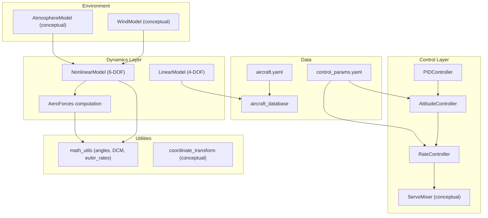
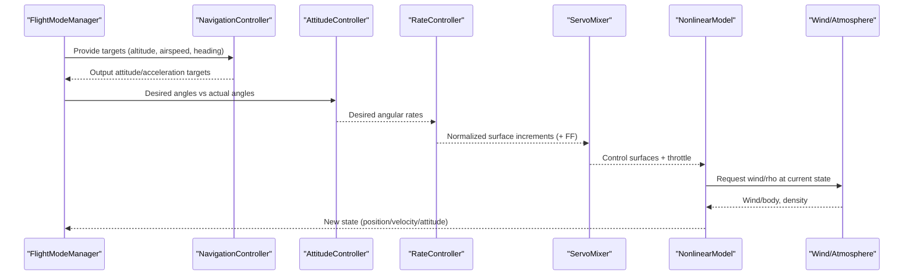
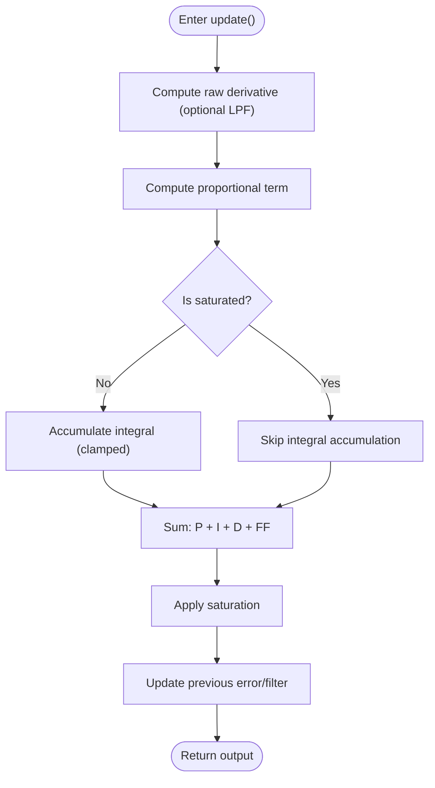
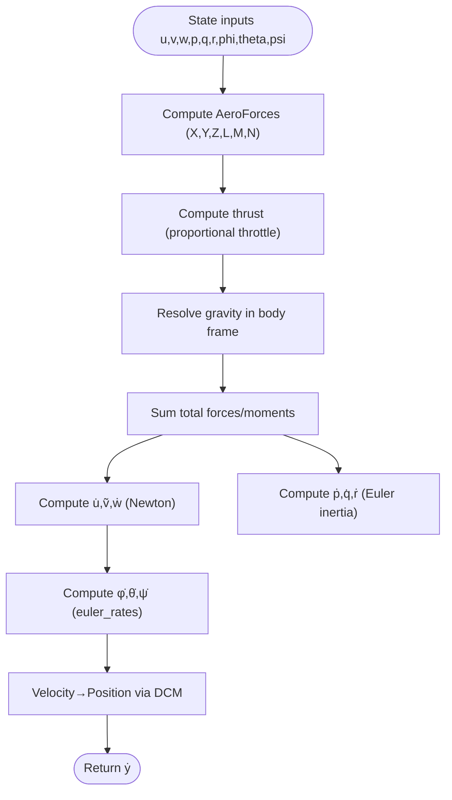
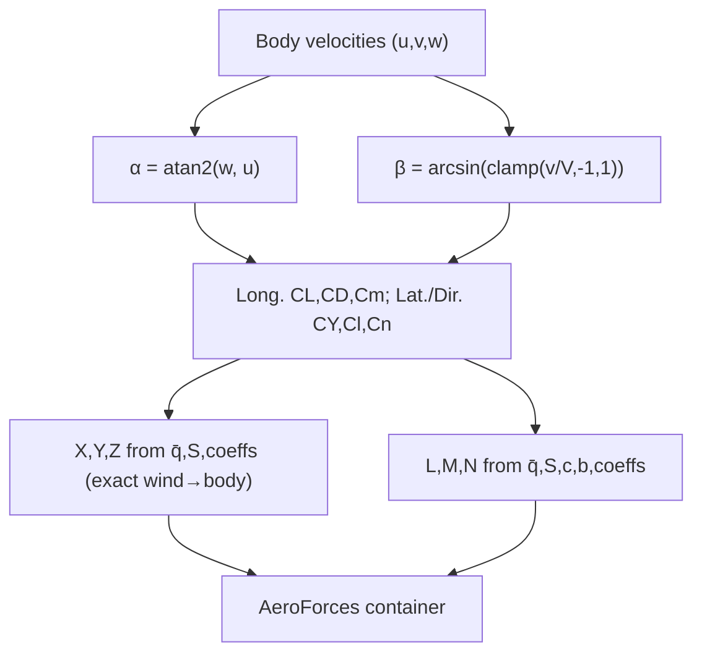
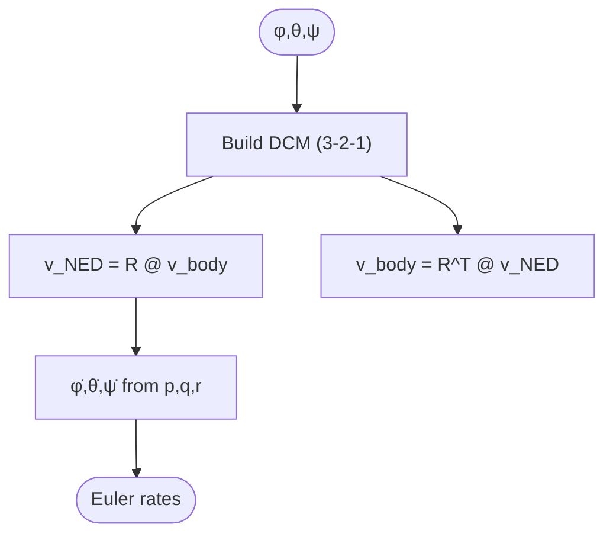
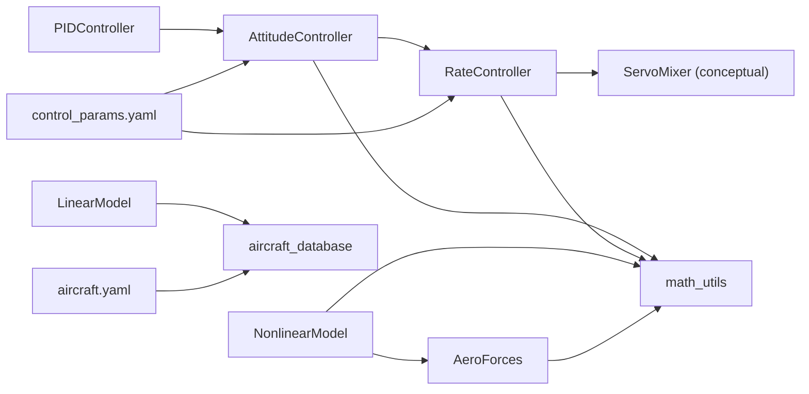

# Conceptual Foundations

<cite>
**Referenced Files in This Document**
- [src/control/pid_controller.py](file://src/control/pid_controller.py)
- [src/control/attitude_controller.py](file://src/control/attitude_controller.py)
- [src/control/rate_controller.py](file://src/control/rate_controller.py)
- [src/dynamics/aerodynamics.py](file://src/dynamics/aerodynamics.py)
- [src/dynamics/coordinate_transform.py](file://src/dynamics/coordinate_transform.py)
- [src/dynamics/linear_model.py](file://src/dynamics/linear_model.py)
- [src/dynamics/nonlinear_model.py](file://src/dynamics/nonlinear_model.py)
- [src/utils/math_utils.py](file://src/utils/math_utils.py)
- [src/models/aircraft_database.py](file://src/models/aircraft_database.py)
- [config/aircraft.yaml](file://config/aircraft.yaml)
- [config/control_params.yaml](file://config/control_params.yaml)
</cite>

## Table of Contents
1. [Introduction](#introduction)
2. [Project Structure](#project-structure)
3. [Core Components](#core-components)
4. [Architecture Overview](#architecture-overview)
5. [Detailed Component Analysis](#detailed-component-analysis)
6. [Dependency Analysis](#dependency-analysis)
7. [Performance Considerations](#performance-considerations)
8. [Troubleshooting Guide](#troubleshooting-guide)
9. [Conclusion](#conclusion)
10. [Appendices](#appendices)

## Introduction
This document establishes the conceptual foundations for fixed-wing flight simulation, grounded in the repository’s implementation. It connects control theory (PID control, feedback systems, stability analysis) with flight mechanics (equations of motion, aerodynamics, coordinate systems) and provides practical guidance for users across varying backgrounds. The goal is to translate theoretical concepts into executable, modular components that enable accurate, stable, and configurable simulations.

## Project Structure
The repository organizes functionality into cohesive layers:
- Control: PID-based attitude, rate, and servo mixing with ArduPilot-style parameters
- Dynamics: 6-DOF nonlinear equations and 4-DOF linearized longitudinal model
- Environment: Wind and atmospheric models
- Utilities: Math and transforms
- Data: Aircraft parameter database and configuration
- Examples: Scripts demonstrating linear and nonlinear analyses

**Diagram sources**
- [src/control/pid_controller.py](file://src/control/pid_controller.py#L17-L117)
- [src/control/attitude_controller.py](file://src/control/attitude_controller.py#L33-L134)
- [src/control/rate_controller.py](file://src/control/rate_controller.py#L32-L109)
- [src/dynamics/nonlinear_model.py](file://src/dynamics/nonlinear_model.py#L104-L386)
- [src/dynamics/linear_model.py](file://src/dynamics/linear_model.py#L107-L319)
- [src/dynamics/aerodynamics.py](file://src/dynamics/aerodynamics.py#L35-L148)
- [src/utils/math_utils.py](file://src/utils/math_utils.py#L43-L124)
- [src/models/aircraft_database.py](file://src/models/aircraft_database.py#L143-L166)
- [config/aircraft.yaml](file://config/aircraft.yaml#L1-L13)
- [config/control_params.yaml](file://config/control_params.yaml#L1-L45)

**Section sources**
- [src/control/pid_controller.py](file://src/control/pid_controller.py#L1-L117)
- [src/control/attitude_controller.py](file://src/control/attitude_controller.py#L1-L134)
- [src/control/rate_controller.py](file://src/control/rate_controller.py#L1-L109)
- [src/dynamics/nonlinear_model.py](file://src/dynamics/nonlinear_model.py#L1-L386)
- [src/dynamics/linear_model.py](file://src/dynamics/linear_model.py#L1-L319)
- [src/dynamics/aerodynamics.py](file://src/dynamics/aerodynamics.py#L1-L148)
- [src/utils/math_utils.py](file://src/utils/math_utils.py#L1-L124)
- [src/models/aircraft_database.py](file://src/models/aircraft_database.py#L1-L183)
- [config/aircraft.yaml](file://config/aircraft.yaml#L1-L13)
- [config/control_params.yaml](file://config/control_params.yaml#L1-L45)

## Core Components
- PID controller: discrete-time with anti-windup, optional derivative low-pass filter, and runtime gain updates
- Attitude controller: three-axis angle-to-rate conversion with angle wrapping and output limiting
- Rate controller (SAS): three-axis rate control with feed-forward and normalized output
- Aerodynamics: body-frame forces and moments computed from angles, rates, control surface deflections, and air density
- Coordinate transforms: DCM construction, Euler rates, and conversions between NED and body frames
- Linear/nonlinear dynamics: 4-DOF longitudinal linearization and 6-DOF nonlinear equations of motion
- Aircraft database: geometric, inertial, and aerodynamic parameters with derived quantities

**Section sources**
- [src/control/pid_controller.py](file://src/control/pid_controller.py#L17-L117)
- [src/control/attitude_controller.py](file://src/control/attitude_controller.py#L33-L134)
- [src/control/rate_controller.py](file://src/control/rate_controller.py#L32-L109)
- [src/dynamics/aerodynamics.py](file://src/dynamics/aerodynamics.py#L19-L148)
- [src/dynamics/coordinate_transform.py](file://src/dynamics/coordinate_transform.py#L29-L70)
- [src/dynamics/linear_model.py](file://src/dynamics/linear_model.py#L107-L319)
- [src/dynamics/nonlinear_model.py](file://src/dynamics/nonlinear_model.py#L104-L386)
- [src/utils/math_utils.py](file://src/utils/math_utils.py#L43-L124)
- [src/models/aircraft_database.py](file://src/models/aircraft_database.py#L143-L166)

## Architecture Overview
The control architecture follows a five-layer hierarchy: flight mode manager, navigation/controller, attitude, rate/SAS, and servo mixing. Dynamics integrates aerodynamics and environment models, while utilities support coordinate transforms and angle handling.

**Diagram sources**
- [src/control/attitude_controller.py](file://src/control/attitude_controller.py#L81-L122)
- [src/control/rate_controller.py](file://src/control/rate_controller.py#L68-L98)
- [src/dynamics/nonlinear_model.py](file://src/dynamics/nonlinear_model.py#L261-L281)

**Section sources**
- [src/control/attitude_controller.py](file://src/control/attitude_controller.py#L33-L134)
- [src/control/rate_controller.py](file://src/control/rate_controller.py#L32-L109)
- [src/dynamics/nonlinear_model.py](file://src/dynamics/nonlinear_model.py#L160-L281)

## Detailed Component Analysis

### Control Theory Fundamentals: PID, Feedback, and Stability
- PID controller: Implements proportional, integral, and derivative action with clamping-based anti-windup, optional derivative low-pass filtering, and runtime gain updates. Anti-windup ensures integral accumulation only when saturated, preventing integrator windup during actuator limits.
- Feedback loop: Attitude controller computes angle errors (wrapped to shortest arc) and generates desired angular rates; rate controller compares desired vs measured rates and applies P/I/D with feed-forward to produce normalized surface increments.
- Stability considerations: Inner loops (rate/SAS) should dominate outer loops (attitude/navigation) for robustness; TECS avoids integral saturation and oil-throttle conflicts in longitudinal control.

**Diagram sources**
- [src/control/pid_controller.py](file://src/control/pid_controller.py#L55-L98)

**Section sources**
- [src/control/pid_controller.py](file://src/control/pid_controller.py#L17-L117)
- [src/control/attitude_controller.py](file://src/control/attitude_controller.py#L81-L122)
- [src/control/rate_controller.py](file://src/control/rate_controller.py#L68-L98)

### Flight Mechanics Theory: Equations of Motion and Linearization
- 6-DOF nonlinear model: Translational dynamics from Newton’s law in body axes; rotational dynamics from Euler equations with inertia coupling; kinematic relations convert body rates to Euler angle rates; position evolution via DCM from body to NED.
- Linearization: 4-DOF longitudinal state-space captures short-period and phugoid modes under small-perturbation assumptions, enabling modal analysis and time-domain simulation.

**Diagram sources**
- [src/dynamics/nonlinear_model.py](file://src/dynamics/nonlinear_model.py#L160-L255)
- [src/dynamics/aerodynamics.py](file://src/dynamics/aerodynamics.py#L35-L148)
- [src/utils/math_utils.py](file://src/utils/math_utils.py#L43-L100)

**Section sources**
- [src/dynamics/nonlinear_model.py](file://src/dynamics/nonlinear_model.py#L104-L386)
- [src/dynamics/linear_model.py](file://src/dynamics/linear_model.py#L107-L319)

### Aerodynamics Principles: Lift, Drag, Thrust, and Moments
- Angle definitions: angle-of-attack α via arctan2(w, u); sideslip β via arcsin(v / V), with numerical clamps; dynamic pressure q̄ = 0.5 ρ V².
- Force/moment model: linearized coefficients CL, CD, Cm (longitudinal) and CY, Cl, Cn (lateraldirectional) functions of α, β, non-dimensionalized rates, and control surface deflections; forces transformed from wind-axis to body-axis; moments scaled by S, c, b.

**Diagram sources**
- [src/dynamics/aerodynamics.py](file://src/dynamics/aerodynamics.py#L68-L148)
- [src/utils/math_utils.py](file://src/utils/math_utils.py#L107-L124)

**Section sources**
- [src/dynamics/aerodynamics.py](file://src/dynamics/aerodynamics.py#L35-L148)
- [src/utils/math_utils.py](file://src/utils/math_utils.py#L107-L124)

### Coordinate Systems and Transformations
- Frames: NED geographic (North-East-Down) and body-fixed frame; 3-2-1 Euler angles define orientation.
- Transforms: Direction cosine matrix (DCM) from Euler; Euler rates from body rates with singular protection; wind vectors transformed between NED and body using DCM and its transpose.
- Practical impact: Forces and moments computed in body frame; kinematics and positions in NED; wind effects modeled in NED then converted to body for airspeed calculation.

**Diagram sources**
- [src/utils/math_utils.py](file://src/utils/math_utils.py#L43-L100)
- [src/dynamics/coordinate_transform.py](file://src/dynamics/coordinate_transform.py#L29-L70)

**Section sources**
- [src/utils/math_utils.py](file://src/utils/math_utils.py#L43-L124)
- [src/dynamics/coordinate_transform.py](file://src/dynamics/coordinate_transform.py#L29-L70)

### Mathematical Derivations and Physical Intuition
- Short-period and phugoid modes: The 4-DOF linear model identifies eigenvalues that reveal damping and oscillatory characteristics; short-period relates pitch stiffness and inertia; phugoid reflects energy exchange between kinetic and potential energy.
- Stability margins: Damping ratios and natural frequencies from eigen-decomposition guide controller tuning; unstable modes require stronger damping or redesign.
- Practical implications: Use linear analysis to select controller gains and verify closed-loop stability; validate with nonlinear simulations.

**Section sources**
- [src/dynamics/linear_model.py](file://src/dynamics/linear_model.py#L206-L252)

### Prerequisites and Learning Pathways
- For beginners:
  - Review basic control theory (PID, feedback, stability) and coordinate transformations
  - Explore the 4-DOF linear model to understand modes and stability
- For practitioners:
  - Calibrate control gains using ArduPilot-style parameters
  - Validate with nonlinear simulations and wind scenarios
- For researchers:
  - Extend aerodynamic models (nonlinear CL, stall, separated flow)
  - Incorporate advanced control strategies (adaptive, robust, optimal)

[No sources needed since this section provides general guidance]

## Dependency Analysis
- Control layer depends on PID and math utilities; attitude and rate controllers depend on ArduPilot parameter containers.
- Dynamics layer depends on aerodynamics and math utilities; integrates wind and atmosphere models conceptually.
- Data layer supplies parameters and derived quantities; configuration files drive selection and tuning.

**Diagram sources**
- [src/control/pid_controller.py](file://src/control/pid_controller.py#L17-L117)
- [src/control/attitude_controller.py](file://src/control/attitude_controller.py#L55-L77)
- [src/control/rate_controller.py](file://src/control/rate_controller.py#L51-L64)
- [src/dynamics/nonlinear_model.py](file://src/dynamics/nonlinear_model.py#L27-L28)
- [src/dynamics/aerodynamics.py](file://src/dynamics/aerodynamics.py#L11-L13)
- [src/utils/math_utils.py](file://src/utils/math_utils.py#L13-L25)
- [src/models/aircraft_database.py](file://src/models/aircraft_database.py#L14-L20)
- [config/aircraft.yaml](file://config/aircraft.yaml#L5-L13)
- [config/control_params.yaml](file://config/control_params.yaml#L8-L44)

**Section sources**
- [src/control/pid_controller.py](file://src/control/pid_controller.py#L17-L117)
- [src/control/attitude_controller.py](file://src/control/attitude_controller.py#L55-L77)
- [src/control/rate_controller.py](file://src/control/rate_controller.py#L51-L64)
- [src/dynamics/nonlinear_model.py](file://src/dynamics/nonlinear_model.py#L27-L28)
- [src/dynamics/aerodynamics.py](file://src/dynamics/aerodynamics.py#L11-L13)
- [src/utils/math_utils.py](file://src/utils/math_utils.py#L13-L25)
- [src/models/aircraft_database.py](file://src/models/aircraft_database.py#L14-L20)
- [config/aircraft.yaml](file://config/aircraft.yaml#L5-L13)
- [config/control_params.yaml](file://config/control_params.yaml#L8-L44)

## Performance Considerations
- Numerical stability: Angle wrapping and clamps prevent singularities; derivative low-pass filters reduce noise sensitivity; Euler rate singularities handled with small ε protection.
- Computational cost: Aerodynamic computations are O(1); DCM and trigonometric operations are lightweight; choose appropriate ODE solvers and tolerances for accuracy/performance balance.
- Tuning guidance: Start with inner-loop (rate/SAS) faster than outer-loop (attitude/navigation); use linear analysis to inform gains and verify stability margins.

[No sources needed since this section provides general guidance]

## Troubleshooting Guide
- Controller issues:
  - Excessive overshoot or slow response: adjust P/I/D gains; consider feed-forward; verify derivative low-pass settings.
  - Integral windup symptoms: check saturation flags and anti-windup behavior; ensure integrator resets on mode transitions.
- Dynamics issues:
  - Nonlinear simulation divergence: verify initial trim conditions; inspect control surface limits; confirm airspeed and dynamic pressure thresholds.
  - Coordinate/system singularities: watch for near-vertical flight; ensure Euler angle wrapping and singular protections are effective.
- Parameter/data issues:
  - Incorrect aircraft or control parameters: confirm selections in configuration files and database lookups; validate derived quantities (U0, q_bar).

**Section sources**
- [src/control/pid_controller.py](file://src/control/pid_controller.py#L84-L98)
- [src/dynamics/nonlinear_model.py](file://src/dynamics/nonlinear_model.py#L338-L351)
- [src/utils/math_utils.py](file://src/utils/math_utils.py#L79-L100)
- [src/models/aircraft_database.py](file://src/models/aircraft_database.py#L153-L166)

## Conclusion
This repository provides a modular, mathematically grounded framework for fixed-wing flight simulation. By combining PID control, aerodynamic modeling, and precise coordinate transformations with 6-DOF nonlinear and 4-DOF linear dynamics, it enables both educational exploration and engineering validation. Users can start with linear analysis to understand stability and modes, then move to nonlinear simulations and real-world wind scenarios, guided by ArduPilot-style parameters and configuration.

[No sources needed since this section summarizes without analyzing specific files]

## Appendices

### A. Configuration and Parameter Reference
- Aircraft selection and overrides: choose model and optionally override geometry and mass
- Control parameters: attitude and rate gains, feed-forward, limits, and TECS tuning for longitudinal control

**Section sources**
- [config/aircraft.yaml](file://config/aircraft.yaml#L5-L13)
- [config/control_params.yaml](file://config/control_params.yaml#L8-L44)

### B. Aircraft Parameter Overview
- Database includes TB2, Anka, Aksungur, Karayel, Predator, Heron MK1/MK2 with geometry, inertia, and aerodynamic derivatives; derived quantities injected for dynamics computations

**Section sources**
- [src/models/aircraft_database.py](file://src/models/aircraft_database.py#L29-L133)
- [src/models/aircraft_database.py](file://src/models/aircraft_database.py#L143-L166)