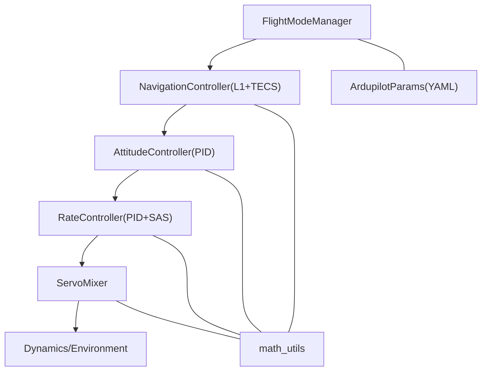
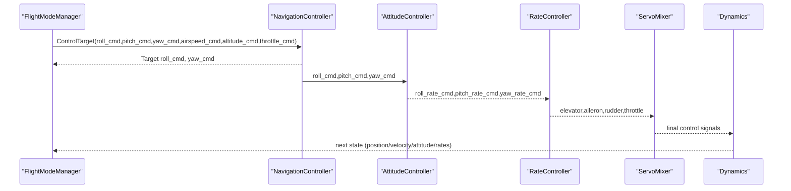
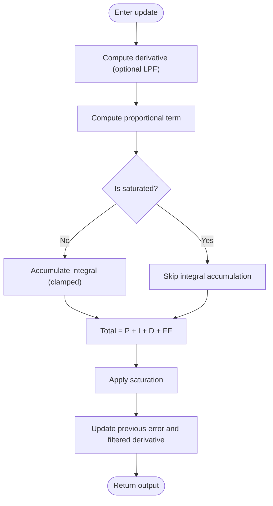
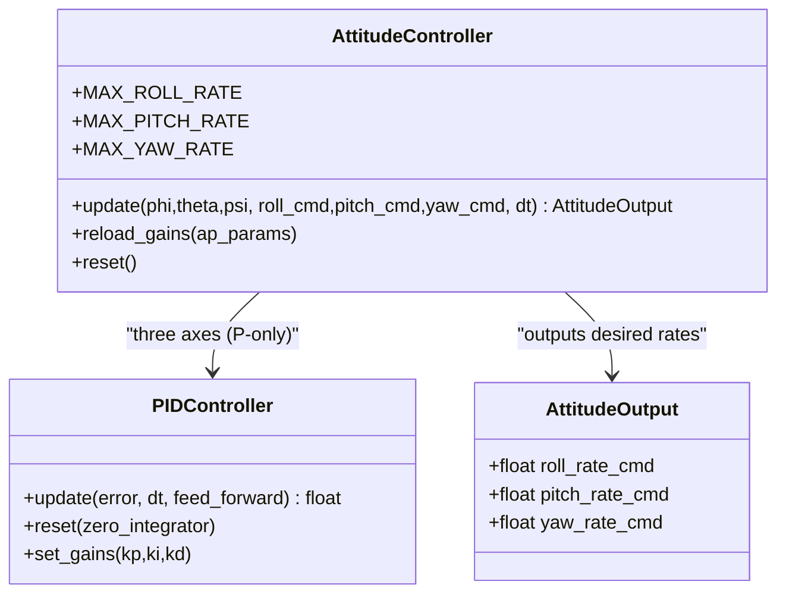
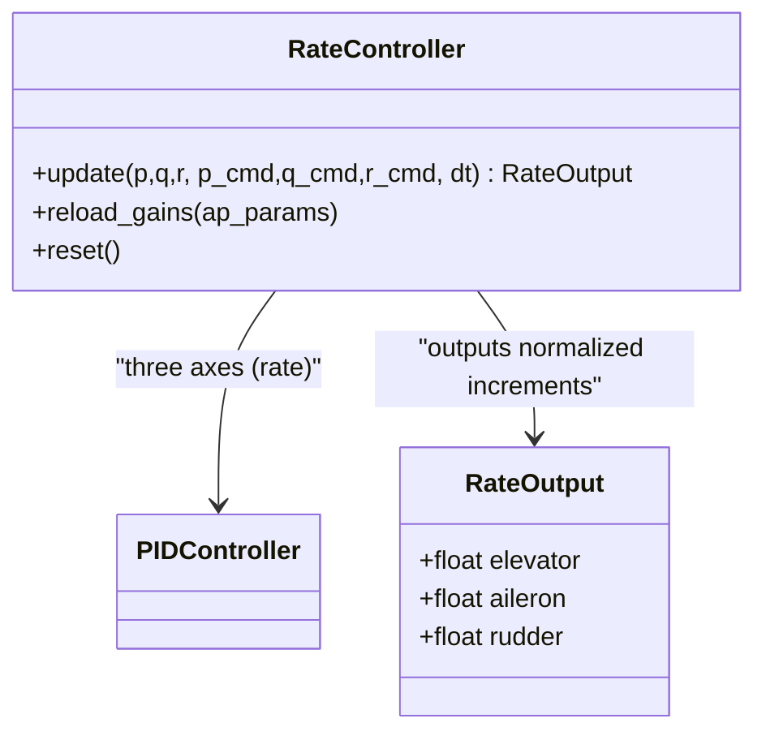
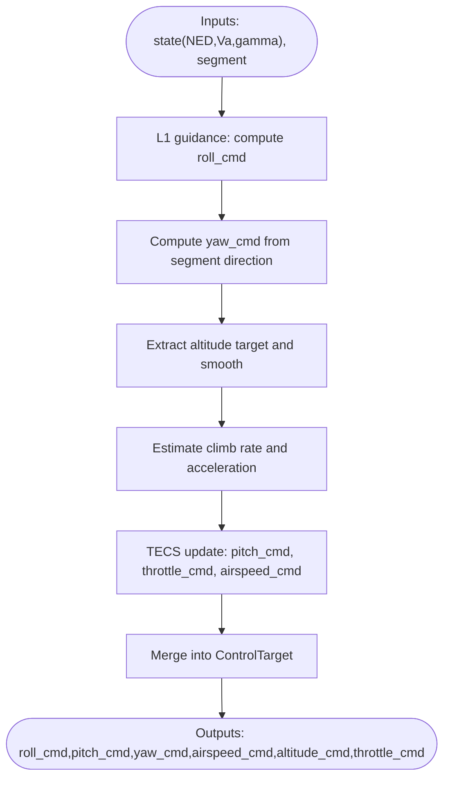
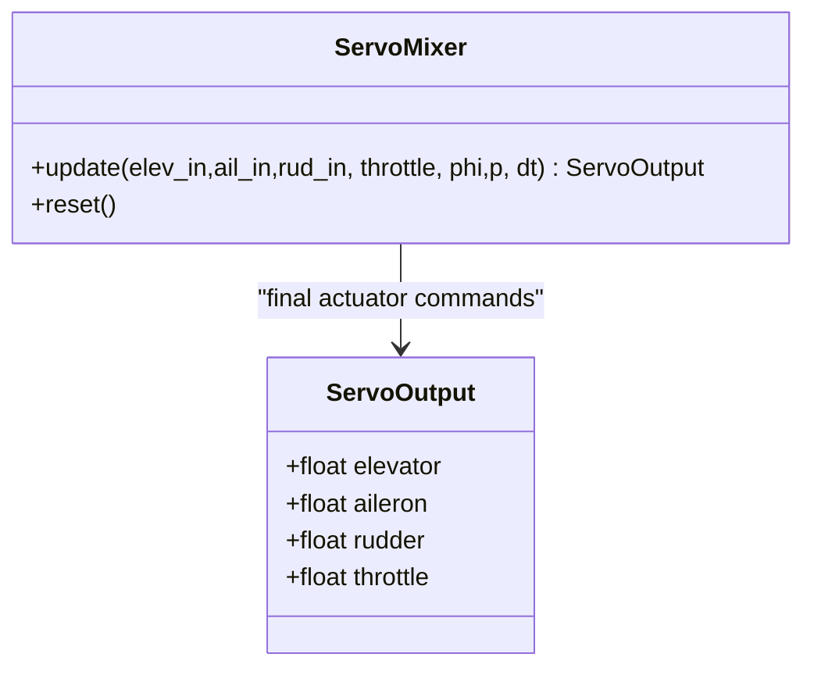
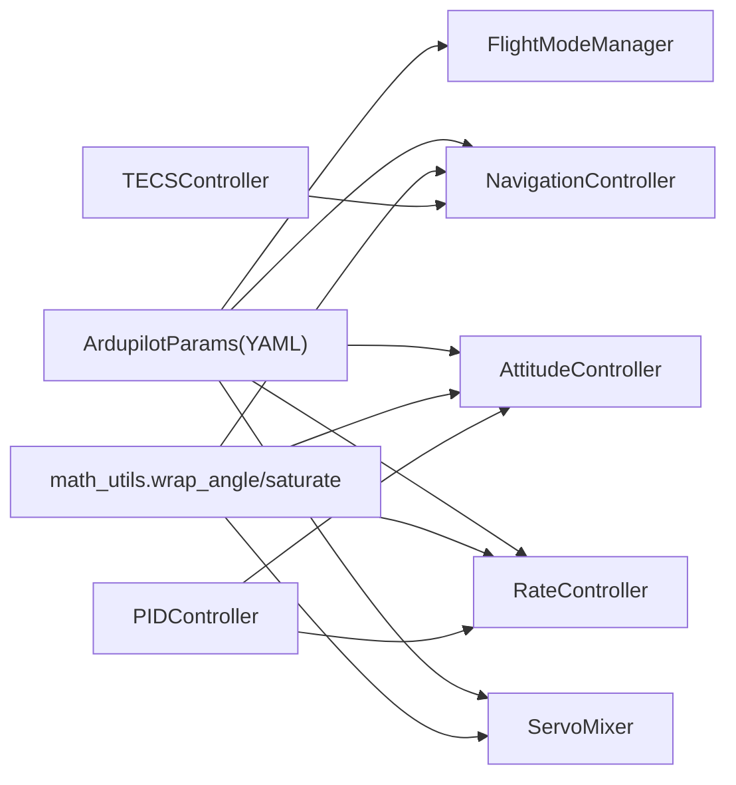

# Control Theory Fundamentals

<cite>
**Referenced Files in This Document**
- [pid_controller.py](file://src/control/pid_controller.py)
- [attitude_controller.py](file://src/control/attitude_controller.py)
- [rate_controller.py](file://src/control/rate_controller.py)
- [navigation_controller.py](file://src/control/navigation_controller.py)
- [tecs_controller.py](file://src/control/tecs_controller.py)
- [servo_mixer.py](file://src/control/servo_mixer.py)
- [ardupilot_compat.py](file://src/control/ardupilot_compat.py)
- [math_utils.py](file://src/utils/math_utils.py)
- [control_params.yaml](file://config/control_params.yaml)
- [simulator.py](file://src/simulation/simulator.py)
- [1_linear_response.py](file://examples/1_linear_response.py)
- [2_nonlinear_dynamics.py](file://examples/2_nonlinear_dynamics.py)
- [6_ardupilot_parameters.py](file://examples/6_ardupilot_parameters.py)
- [control_systems.md](file://doc/zh/content/控制系统/控制系统.md)
- [control_theory_fundamentals.md](file://doc/zh/content/核心概念/控制理论基础.md)
</cite>

## Table of Contents
1. [Introduction](#introduction)
2. [Project Structure](#project-structure)
3. [Core Components](#core-components)
4. [Architecture Overview](#architecture-overview)
5. [Detailed Component Analysis](#detailed-component-analysis)
6. [Dependency Analysis](#dependency-analysis)
7. [Performance Considerations](#performance-considerations)
8. [Troubleshooting Guide](#troubleshooting-guide)
9. [Conclusion](#conclusion)
10. [Appendices](#appendices)

## Introduction
This document presents control theory fundamentals tailored for fixed-wing UAV simulation. It explains PID control, feedback systems, stability, and transfer functions, and connects these concepts to the simulation’s five-layer control architecture: flight mode management, navigation (L1 + TECS), attitude control, rate control (SAS), and servo mixing. Practical examples demonstrate PID implementation, control loop behavior, and parameter tuning across linear and nonlinear dynamics.

## Project Structure
The control system is organized into layers that process sensor measurements into actuator commands:
- Flight mode management generates targets (angles, rates, speeds, altitudes, throttle).
- Navigation computes lateral roll and vertical pitch/throttle commands using L1 guidance and TECS.
- Attitude control converts desired angles into desired angular rates.
- Rate control (SAS) provides damping and stability using three-axis PID loops.
- Servo mixer maps normalized increments to physical actuator outputs with amplitude/ rate limits and coordination.

**Diagram sources**
- [simulator.py](file://src/simulation/simulator.py#L173-L216)
- [navigation_controller.py](file://src/control/navigation_controller.py#L45-L115)
- [attitude_controller.py](file://src/control/attitude_controller.py#L33-L77)
- [rate_controller.py](file://src/control/rate_controller.py#L32-L64)
- [servo_mixer.py](file://src/control/servo_mixer.py#L54-L149)
- [ardupilot_compat.py](file://src/control/ardupilot_compat.py#L17-L130)
- [math_utils.py](file://src/utils/math_utils.py#L13-L26)

**Section sources**
- [control_systems.md](file://doc/zh/content/控制系统/控制系统.md#L35-L66)
- [control_theory_fundamentals.md](file://doc/zh/content/核心概念/控制理论基础.md#L40-L72)

## Core Components
- PID controller: generic discrete PID with anti-windup, optional derivative low-pass filter, feedforward, and runtime gain updates.
- Attitude controller: three-axis angle-to-rate conversion using P-only controllers with angle wrapping and output saturation.
- Rate controller (SAS): three-axis rate control with optional feedforward and integral action.
- Navigation (L1 + TECS): lateral roll generation via L1 guidance and longitudinal energy management via TECS.
- Servo mixer: actuator mapping with amplitude limits, coordinated turn compensation, and rate limiting.
- Parameter container: ArduPilot-style parameter loading, validation, and export.

**Section sources**
- [pid_controller.py](file://src/control/pid_controller.py#L17-L117)
- [attitude_controller.py](file://src/control/attitude_controller.py#L33-L134)
- [rate_controller.py](file://src/control/rate_controller.py#L32-L109)
- [navigation_controller.py](file://src/control/navigation_controller.py#L45-L293)
- [tecs_controller.py](file://src/control/tecs_controller.py#L50-L647)
- [servo_mixer.py](file://src/control/servo_mixer.py#L54-L153)
- [ardupilot_compat.py](file://src/control/ardupilot_compat.py#L17-L130)

## Architecture Overview
The control architecture follows a classic inner-to-outer loop design:
- Outer loops (navigation/attitude) define targets for inner loops (rate/SAS).
- The cascade ensures fast inner-loop damping supports outer-loop tracking.
- Feedback uses state estimates (position, velocity, attitude, rates) and environmental conditions (wind).

**Diagram sources**
- [simulator.py](file://src/simulation/simulator.py#L499-L521)
- [navigation_controller.py](file://src/control/navigation_controller.py#L134-L202)
- [attitude_controller.py](file://src/control/attitude_controller.py#L81-L122)
- [rate_controller.py](file://src/control/rate_controller.py#L68-L98)
- [servo_mixer.py](file://src/control/servo_mixer.py#L80-L149)

## Detailed Component Analysis

### PID Controller (Discrete Implementation)
- Structure: P, I, D with anti-windup integral accumulation only when unsaturated; optional derivative low-pass filtering; optional feedforward addition.
- Anti-windup: integral term is clamped to output range and not accumulated when saturated.
- Saturation: output is saturated to [output_min, output_max]; internal saturated flag prevents further integral growth.
- Runtime updates: gains can be changed dynamically; reset clears internal states.

**Diagram sources**
- [pid_controller.py](file://src/control/pid_controller.py#L55-L98)

**Section sources**
- [pid_controller.py](file://src/control/pid_controller.py#L17-L117)
- [control_theory_fundamentals.md](file://doc/zh/content/核心概念/控制理论基础.md#L121-L144)

### Attitude Controller (Angle Loop)
- Design: three independent P-only controllers for roll, pitch, yaw; yaw uses pass-through (zero gain).
- Error handling: angle wrapping to shortest path; output saturation limits for desired angular rates.
- Limits: separate maximum rates for roll, pitch, yaw.

**Diagram sources**
- [attitude_controller.py](file://src/control/attitude_controller.py#L33-L134)
- [pid_controller.py](file://src/control/pid_controller.py#L17-L117)

**Section sources**
- [attitude_controller.py](file://src/control/attitude_controller.py#L33-L134)
- [control_theory_fundamentals.md](file://doc/zh/content/核心概念/控制理论基础.md#L146-L181)

### Rate Controller (SAS Inner Loop)
- Design: three-axis rate PID with optional feedforward; outputs normalized surface increments [-1, 1].
- Parameters: PTCH_RATE_P/I/D/FF, ROLL_RATE_P/I/FF, YAW_RATE_P/I.
- Application: provides damping and quick response to attitude errors.

**Diagram sources**
- [rate_controller.py](file://src/control/rate_controller.py#L32-L109)
- [pid_controller.py](file://src/control/pid_controller.py#L17-L117)

**Section sources**
- [rate_controller.py](file://src/control/rate_controller.py#L32-L109)
- [control_theory_fundamentals.md](file://doc/zh/content/核心概念/控制理论基础.md#L182-L210)

### Navigation Controller (L1 + TECS)
- L1 lateral guidance: computes desired roll angle from look-ahead point using ground track derived from body velocity (accounts for sideslip).
- TECS longitudinal control: coordinates altitude and airspeed using total energy (SPE + SKE) and energy balance (SEB), with integral anti-windup and saturation handling.
- Parameters: NAVL1_PERIOD, NAVL1_DAMPING, TECS_* family.

**Diagram sources**
- [navigation_controller.py](file://src/control/navigation_controller.py#L134-L202)
- [tecs_controller.py](file://src/control/tecs_controller.py#L247-L315)

**Section sources**
- [navigation_controller.py](file://src/control/navigation_controller.py#L45-L293)
- [tecs_controller.py](file://src/control/tecs_controller.py#L50-L647)
- [control_theory_fundamentals.md](file://doc/zh/content/核心概念/控制理论基础.md#L211-L234)

### Servo Mixer (Actuator Mapping)
- Converts normalized increments to physical outputs: elevator, aileron, rudder ∈ [-1,1], throttle ∈ [0,1].
- Applies amplitude limits from ArduPilot parameters, coordinated turn compensation, and approximate rate limiting.

**Diagram sources**
- [servo_mixer.py](file://src/control/servo_mixer.py#L54-L153)

**Section sources**
- [servo_mixer.py](file://src/control/servo_mixer.py#L54-L153)
- [control_theory_fundamentals.md](file://doc/zh/content/核心概念/控制理论基础.md#L235-L259)

### Parameter Container (ArduPilot Compatibility)
- Provides parameter names and ranges aligned with ArduPilot Plane.
- Supports YAML import/export and basic validation with warnings for out-of-range values.

**Section sources**
- [ardupilot_compat.py](file://src/control/ardupilot_compat.py#L17-L130)
- [control_params.yaml](file://config/control_params.yaml#L1-L45)

## Dependency Analysis
- Controllers depend on math utilities for angle wrapping, saturation, and rotations.
- Navigation depends on TECS; attitude and rate controllers depend on PID; servo mixer depends on ArduPilot parameters and math utilities.
- Configuration is centralized in YAML and validated by the parameter container.

**Diagram sources**
- [ardupilot_compat.py](file://src/control/ardupilot_compat.py#L74-L98)
- [math_utils.py](file://src/utils/math_utils.py#L13-L26)
- [attitude_controller.py](file://src/control/attitude_controller.py#L55-L77)
- [rate_controller.py](file://src/control/rate_controller.py#L51-L64)
- [servo_mixer.py](file://src/control/servo_mixer.py#L71-L76)
- [navigation_controller.py](file://src/control/navigation_controller.py#L94-L115)
- [pid_controller.py](file://src/control/pid_controller.py#L13-L14)
- [tecs_controller.py](file://src/control/tecs_controller.py#L80-L127)

**Section sources**
- [control_systems.md](file://doc/zh/content/控制系统/控制系统.md#L295-L325)
- [control_theory_fundamentals.md](file://doc/zh/content/核心概念/控制理论基础.md#L275-L299)

## Performance Considerations
- Stability and responsiveness:
  - Inner loops (rate/SAS) should be faster than outer loops (attitude/navigation) to provide adequate damping.
  - TECS manages coupled altitude/airspeed control to reduce integral windup and saturation.
- Tuning guidelines:
  - Start with P-only for attitude loops; introduce I carefully to avoid windup; add D for damping.
  - Adjust TECS time constant, damping, and integral gain to balance smoothness and oscillation.
  - Use coordinated turn compensation and rate limits to prevent excessive actuator rates.
- Metrics:
  - Track RMSE and steady-state error for position/velocity/attitude.
  - Monitor overshoot, settling time, and control effort (throttle, surface deflection).

**Section sources**
- [control_theory_fundamentals.md](file://doc/zh/content/核心概念/控制理论基础.md#L304-L321)
- [control_systems.md](file://doc/zh/content/控制系统/控制系统.md#L326-L340)

## Troubleshooting Guide
Common issues and remedies:
- TECS overshoot/oscillation:
  - Reduce TECS_TIME_CONST, increase TECS_THR_DAMP/TECS_PTCH_DAMP, decrease TECS_INTEG_GAIN; check TECS_SPDWEIGHT.
  - Use debug script outputs to inspect altitude, throttle, pitch, and speed behavior.
- Underspeed protection:
  - Verify TECS_THR_CRUISE, TECS_RLL2THR, and airspeed limits (AIRSPEED_MIN/MAX).
- Unreachable sink detection:
  - Monitor TECS flags; consider reducing climb/sink limits when encountering strong downdrafts.
- Mode transition jitter:
  - Call controller reset() and TECS reset() on mode changes to avoid integrator/state jumps.
- Parameter hot reload:
  - Use ArdupilotParams.from_yaml() and reload_gains() to update parameters at runtime and compare results.

**Section sources**
- [control_systems.md](file://doc/zh/content/控制系统/控制系统.md#L341-L366)
- [tecs_controller.py](file://src/control/tecs_controller.py#L432-L444)
- [tecs_controller.py](file://src/control/tecs_controller.py#L635-L647)

## Conclusion
This fixed-wing control system mirrors ArduPilot’s five-layer architecture, integrating L1 guidance and TECS with attitude and rate control and physical actuator mapping. The PID-based controllers, combined with parameter containers and debugging utilities, enable robust tuning and analysis across linear and nonlinear flight regimes.

## Appendices

### Practical Examples and Code Paths
- Linear analysis and closed-loop PID comparison:
  - Open-loop 4-DOF linear model response and closed-loop pitch tracking in FBW_B mode.
  - See [1_linear_response.py](file://examples/1_linear_response.py#L88-L206).
- Nonlinear dynamics and stabilization:
  - Open-loop 6-DOF roll pulse versus closed-loop STABILIZE mode.
  - See [2_nonlinear_dynamics.py](file://examples/2_nonlinear_dynamics.py#L82-L215).
- Parameter sensitivity and hot reload:
  - Loading ArduPilot-format parameters, adjusting gains, and comparing altitude/pitch responses.
  - See [6_ardupilot_parameters.py](file://examples/6_ardupilot_parameters.py#L44-L85).

### Control Loop Design Principles and Tuning Methods
- Layered control design:
  - Outer loops define targets; inner loops provide damping and fast response.
- Transfer functions and stability:
  - Use linearized short-period and phugoid modes to estimate bandwidth and phase margins.
  - Ensure sufficient phase margin (>45°) and reasonable crossover frequency for desired response.
- Performance metrics:
  - Overshoot, settling time, rise time, steady-state error, and control energy (throttle, deflection rates).

### PID Implementation Notes
- Proportional action: sets immediate corrective effort proportional to error.
- Integral action: eliminates steady-state error but requires anti-windup to prevent saturation windup.
- Derivative action: adds damping and improves transient response; low-pass filtering reduces noise sensitivity.
- Feedforward: preempts disturbances and reference changes for improved tracking.

### Controller Selection and Parameter Optimization
- Scenario-specific guidance:
  - Loiter/hold: emphasize TECS smoothness (larger TIME_CONST, higher DAMP).
  - Agile maneuvers: increase rate controller gains (ROLL_RATE_P/I/D/FF), reduce attitude loop gains to avoid limit cycles.
  - High-altitude/low-drag: adjust TECS_RLL2THR and THR_CRUISE to maintain stable trim.
- Optimization tips:
  - Tune inner loops first, then outer loops.
  - Use step responses and frequency analysis to validate stability margins.
  - Validate with nonlinear simulations and wind/disturbance tests.