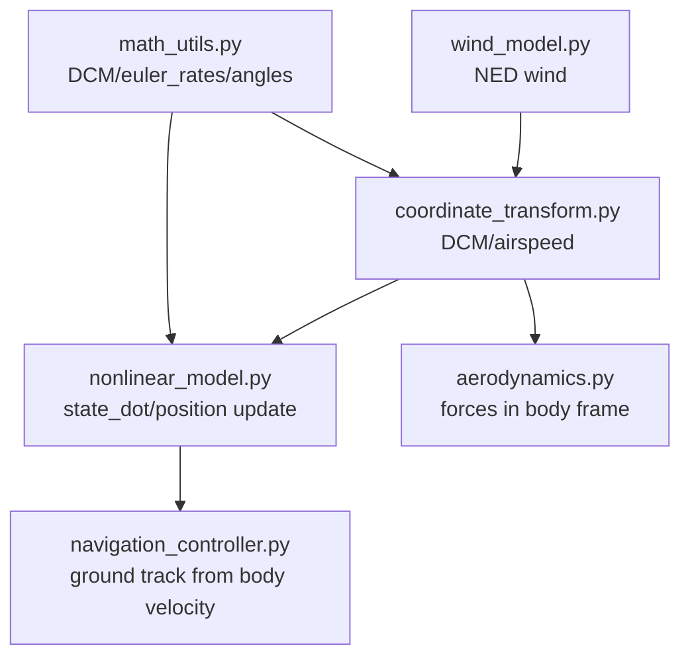
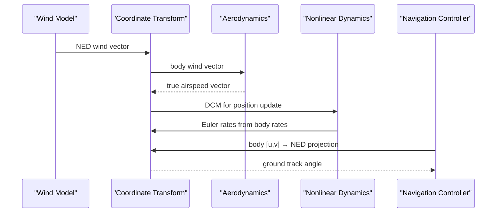
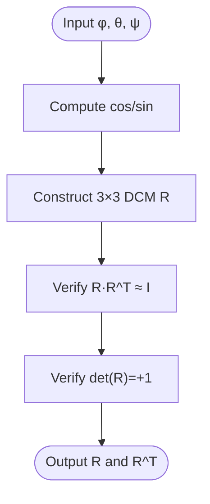
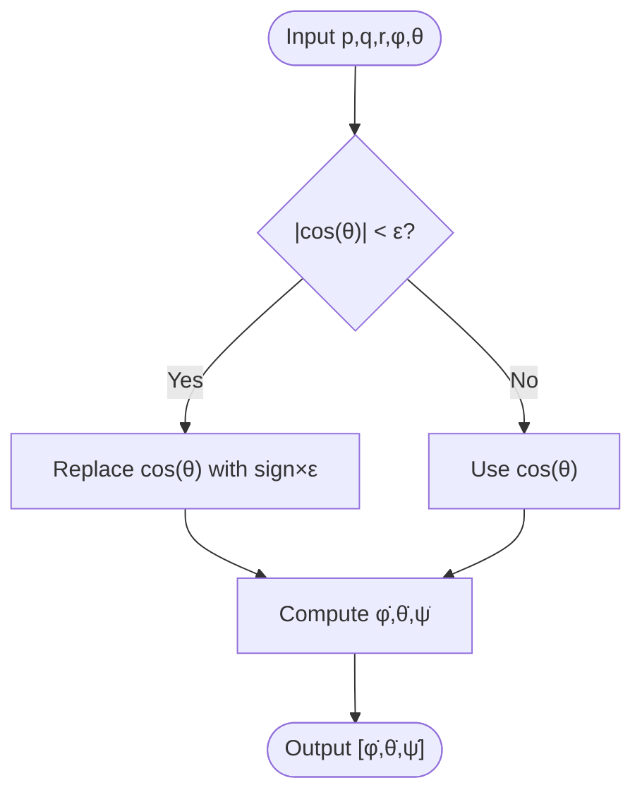
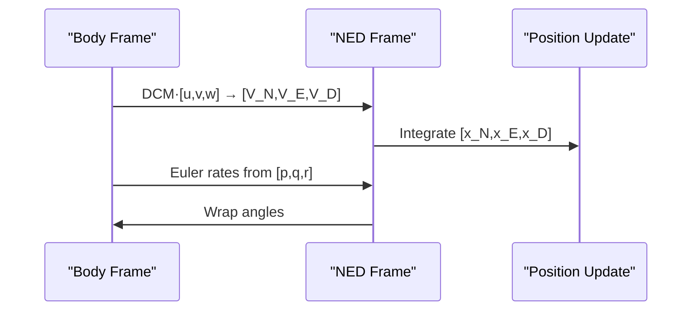
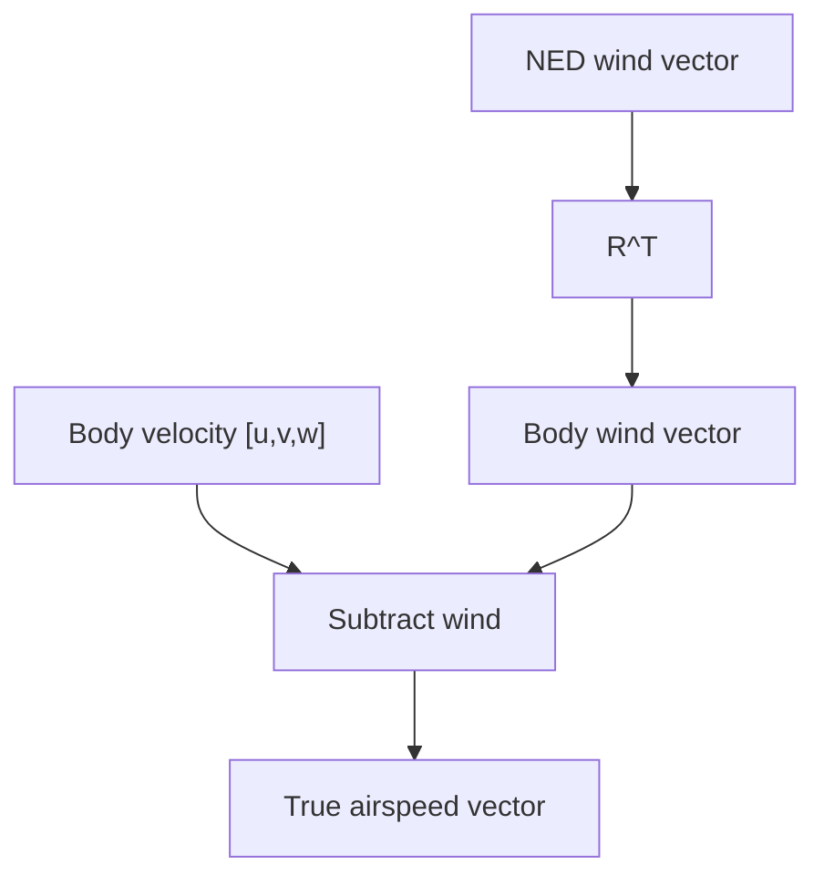
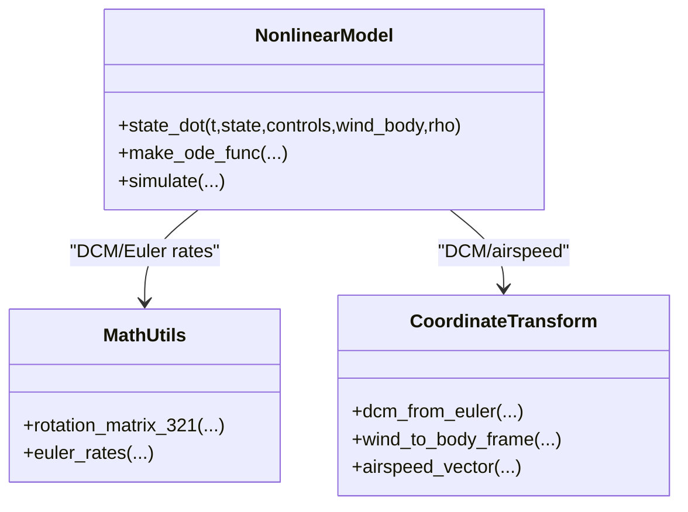
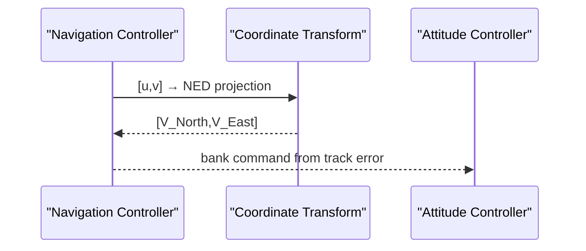
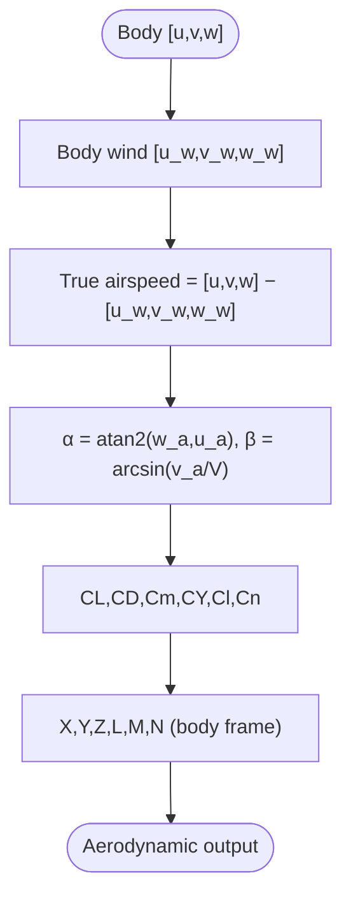
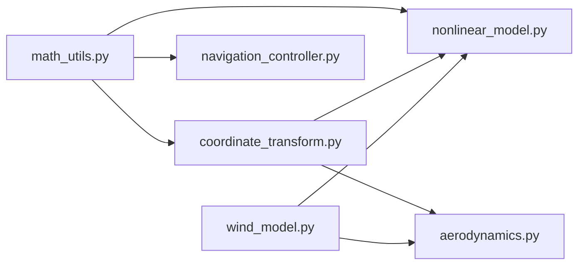

# Coordinate Systems and Transformations

<cite>
**Referenced Files in This Document**
- [coordinate_transform.py](file://src/dynamics/coordinate_transform.py)
- [math_utils.py](file://src/utils/math_utils.py)
- [nonlinear_model.py](file://src/dynamics/nonlinear_model.py)
- [aerodynamics.py](file://src/dynamics/aerodynamics.py)
- [wind_model.py](file://src/environment/wind_model.py)
- [navigation_controller.py](file://src/control/navigation_controller.py)
- [test_dynamics.py](file://tests/test_dynamics.py)
- [example_3_trajectory_tracking.py](file://examples/example_3_trajectory_tracking.py)
</cite>

## Table of Contents
1. [Introduction](#introduction)
2. [Project Structure](#project-structure)
3. [Core Components](#core-components)
4. [Architecture Overview](#architecture-overview)
5. [Detailed Component Analysis](#detailed-component-analysis)
6. [Dependency Analysis](#dependency-analysis)
7. [Performance Considerations](#performance-considerations)
8. [Troubleshooting Guide](#troubleshooting-guide)
9. [Conclusion](#conclusion)
10. [Appendices](#appendices)

## Introduction
This document explains the mathematical frameworks and implementation of coordinate systems and transformations used in the flight simulation. It covers frame definitions (inertial NED, body, wind, and stability-like frames), Euler angle representations and rotation sequences, direction cosine matrices (DCMs), and how these are applied to transform velocities, accelerations, and angular rates. Practical usage is illustrated from aerodynamic calculations and state updates, along with numerical considerations, singularities, and computational efficiency.

## Project Structure
Coordinate transformations are implemented in dedicated modules and integrated across dynamics, environment, and control layers:
- Mathematical utilities provide rotation matrices, vector transforms, and Euler-rate mapping.
- Coordinate transform module exposes convenience functions for DCM and airspeed computation.
- Nonlinear dynamics integrates DCMs and Euler rates into state derivatives and position updates.
- Aerodynamics computes forces and moments in the body frame using transformed airspeed.
- Navigation controller uses body velocity projections to estimate ground track angles robustly.

**Diagram sources**
- [math_utils.py](file://src/utils/math_utils.py#L43-L101)
- [coordinate_transform.py](file://src/dynamics/coordinate_transform.py#L29-L70)
- [nonlinear_model.py](file://src/dynamics/nonlinear_model.py#L246-L281)
- [aerodynamics.py](file://src/dynamics/aerodynamics.py#L35-L148)
- [wind_model.py](file://src/environment/wind_model.py#L76-L108)
- [navigation_controller.py](file://src/control/navigation_controller.py#L274-L292)

**Section sources**
- [coordinate_transform.py](file://src/dynamics/coordinate_transform.py#L1-L70)
- [math_utils.py](file://src/utils/math_utils.py#L1-L124)
- [nonlinear_model.py](file://src/dynamics/nonlinear_model.py#L1-L386)
- [aerodynamics.py](file://src/dynamics/aerodynamics.py#L1-L148)
- [wind_model.py](file://src/environment/wind_model.py#L1-L113)
- [navigation_controller.py](file://src/control/navigation_controller.py#L1-L293)

## Core Components
- Direction cosine matrix (DCM) and 3-2-1 Euler angles: Construct the rotation from body to NED using trigonometric expressions; the inverse transform uses transpose.
- Wind-to-body conversion: Convert NED wind vectors to body frame using the transpose DCM.
- True airspeed: Airspeed vector equals body velocity minus body-frame wind velocity.
- Nonlinear dynamics: Uses DCM to map body velocity to NED for position updates and Euler rates to evolve attitude.
- Navigation: Computes ground track from body velocity projected onto NED horizontal plane to mitigate side slip effects.

**Section sources**
- [coordinate_transform.py](file://src/dynamics/coordinate_transform.py#L29-L70)
- [math_utils.py](file://src/utils/math_utils.py#L43-L101)
- [nonlinear_model.py](file://src/dynamics/nonlinear_model.py#L246-L255)
- [navigation_controller.py](file://src/control/navigation_controller.py#L274-L292)

## Architecture Overview
The transformation pipeline connects wind modeling, coordinate transforms, aerodynamics, and dynamics:
- Wind model generates NED wind vectors.
- Coordinate transform converts NED wind to body frame.
- Aerodynamics computes airspeed and angles, then forces/moments in body frame.
- Nonlinear dynamics integrates state derivatives using DCM and Euler rates.
- Navigation estimates ground track from body velocity projection.

**Diagram sources**
- [wind_model.py](file://src/environment/wind_model.py#L76-L108)
- [coordinate_transform.py](file://src/dynamics/coordinate_transform.py#L39-L70)
- [aerodynamics.py](file://src/dynamics/aerodynamics.py#L68-L84)
- [nonlinear_model.py](file://src/dynamics/nonlinear_model.py#L246-L255)
- [navigation_controller.py](file://src/control/navigation_controller.py#L274-L292)

## Detailed Component Analysis

### Euler Angles, Rotation Sequences, and Direction Cosine Matrices
- Convention: 3-2-1 Euler sequence (Z-Y-X), i.e., yaw (ψ), then pitch (θ), then roll (φ).
- DCM definition: The matrix R(φ, θ, ψ) transforms vectors from body to NED such that v_NED = R @ v_body.
- Inverse transform: v_body = R^T @ v_NED.
- Implementation checks: Unit matrix at zero angles, orthogonality (R·R^T ≈ I), determinant = +1, round-trip consistency.

**Diagram sources**
- [math_utils.py](file://src/utils/math_utils.py#L43-L66)
- [test_dynamics.py](file://tests/test_dynamics.py#L69-L84)

**Section sources**
- [math_utils.py](file://src/utils/math_utils.py#L43-L76)
- [test_dynamics.py](file://tests/test_dynamics.py#L69-L84)

### Euler Rate Mapping and Numerical Stability
- Mapping: From body angular rates [p, q, r] to Euler angle rates [φ̇, θ̇, ψ̇] using closed-form expressions.
- Singularity protection: When cos(θ) approaches zero (near vertical attitudes), a small ε is used to avoid division by zero.
- Tests confirm: At θ = 0, Euler rates equal body rates; otherwise mapping holds numerically.

**Diagram sources**
- [math_utils.py](file://src/utils/math_utils.py#L79-L100)
- [test_dynamics.py](file://tests/test_dynamics.py#L107-L113)

**Section sources**
- [math_utils.py](file://src/utils/math_utils.py#L79-L100)
- [test_dynamics.py](file://tests/test_dynamics.py#L107-L113)

### Velocity, Acceleration, and Angular Rate Transformations
- Velocity: Body [u, v, w] mapped to NED using DCM for position updates; navigation uses [u, v] projection to NED horizontal to compute ground track.
- Acceleration: Translational accelerations are computed in body frame; gravity and thrust are summed there; DCM is not used to transform accelerations directly.
- Angular rate: Euler rates computed from body rates; angles are wrapped to [-π, π].

**Diagram sources**
- [nonlinear_model.py](file://src/dynamics/nonlinear_model.py#L246-L255)
- [navigation_controller.py](file://src/control/navigation_controller.py#L274-L292)
- [math_utils.py](file://src/utils/math_utils.py#L69-L76)

**Section sources**
- [nonlinear_model.py](file://src/dynamics/nonlinear_model.py#L246-L255)
- [navigation_controller.py](file://src/control/navigation_controller.py#L274-L292)
- [math_utils.py](file://src/utils/math_utils.py#L69-L76)

### Wind Field to Body Frame and True Airspeed
- Wind generation: NED wind vectors produced by the wind model.
- Conversion: NED wind converted to body frame using R^T.
- True airspeed: Airspeed vector equals body velocity minus body wind velocity; used to compute angles of attack and sideslip, and dynamic pressure.

**Diagram sources**
- [wind_model.py](file://src/environment/wind_model.py#L76-L108)
- [coordinate_transform.py](file://src/dynamics/coordinate_transform.py#L39-L70)
- [aerodynamics.py](file://src/dynamics/aerodynamics.py#L68-L84)

**Section sources**
- [wind_model.py](file://src/environment/wind_model.py#L76-L108)
- [coordinate_transform.py](file://src/dynamics/coordinate_transform.py#L39-L70)
- [aerodynamics.py](file://src/dynamics/aerodynamics.py#L68-L84)

### Nonlinear Dynamics Integration of Transformations
- State vector: [u, v, w, p, q, r, φ, θ, ψ, x_N, x_E, x_D] (NED positions).
- Forces and moments: Computed in body frame; gravity transformed into body frame.
- Position update: DCM applied to [u, v, w] to yield NED velocity for integrating positions.
- Attitude update: Euler rates computed from body rates; angles wrapped to keep within [-π, π].

**Diagram sources**
- [nonlinear_model.py](file://src/dynamics/nonlinear_model.py#L160-L281)
- [math_utils.py](file://src/utils/math_utils.py#L43-L100)
- [coordinate_transform.py](file://src/dynamics/coordinate_transform.py#L29-L70)

**Section sources**
- [nonlinear_model.py](file://src/dynamics/nonlinear_model.py#L160-L281)
- [math_utils.py](file://src/utils/math_utils.py#L43-L100)
- [coordinate_transform.py](file://src/dynamics/coordinate_transform.py#L29-L70)

### Navigation Controller Ground Track Estimation
- Uses body velocity [u, v] projected into NED horizontal plane via DCM to compute ground track angle robustly against side slip.
- Compares desired track to current track and commands bank angle accordingly.

**Diagram sources**
- [navigation_controller.py](file://src/control/navigation_controller.py#L274-L292)
- [math_utils.py](file://src/utils/math_utils.py#L13-L25)

**Section sources**
- [navigation_controller.py](file://src/control/navigation_controller.py#L274-L292)
- [math_utils.py](file://src/utils/math_utils.py#L13-L25)

### Aerodynamic Calculations and Body Frame Usage
- All aerodynamic computations occur in the body frame: forces X, Y, Z and moments L, M, N.
- Airspeed is derived from body velocity minus body wind velocity; angles of attack and sideslip are computed from airspeed components.
- Dynamic pressure depends on true airspeed magnitude; coefficients depend on angles and normalized angular rates.

**Diagram sources**
- [aerodynamics.py](file://src/dynamics/aerodynamics.py#L68-L148)
- [math_utils.py](file://src/utils/math_utils.py#L107-L123)

**Section sources**
- [aerodynamics.py](file://src/dynamics/aerodynamics.py#L35-L148)
- [math_utils.py](file://src/utils/math_utils.py#L107-L123)

### Practical Example: Trajectory Tracking
- The example demonstrates AUTO mode with full state history including NED positions, velocities, Euler angles, and control inputs.
- Navigation controller uses body velocity projections to compute ground track; TECS uses NED vertical velocity for altitude and airspeed control.

**Section sources**
- [example_3_trajectory_tracking.py](file://examples/example_3_trajectory_tracking.py#L72-L194)
- [navigation_controller.py](file://src/control/navigation_controller.py#L134-L202)
- [nonlinear_model.py](file://src/dynamics/nonlinear_model.py#L246-L248)

## Dependency Analysis
- math_utils is foundational: provides DCM, inverse transforms, Euler rates, and angle utilities.
- coordinate_transform depends on math_utils and exposes higher-level functions for DCM and airspeed.
- nonlinear_model uses math_utils for DCM and Euler rates and aerodynamics for forces/moments.
- aerodynamics relies on math_utils for angles and dynamic pressure.
- navigation_controller uses math_utils for angle wrapping and saturation.
- wind_model independently produces NED wind; coordinate_transform bridges wind to body frame for aerodynamics.

**Diagram sources**
- [coordinate_transform.py](file://src/dynamics/coordinate_transform.py#L10-L16)
- [math_utils.py](file://src/utils/math_utils.py#L1-L124)
- [nonlinear_model.py](file://src/dynamics/nonlinear_model.py#L27-L28)
- [aerodynamics.py](file://src/dynamics/aerodynamics.py#L11-L13)
- [navigation_controller.py](file://src/control/navigation_controller.py#L20-L22)
- [wind_model.py](file://src/environment/wind_model.py#L1-L113)

**Section sources**
- [coordinate_transform.py](file://src/dynamics/coordinate_transform.py#L10-L16)
- [nonlinear_model.py](file://src/dynamics/nonlinear_model.py#L27-L28)
- [aerodynamics.py](file://src/dynamics/aerodynamics.py#L11-L13)
- [navigation_controller.py](file://src/control/navigation_controller.py#L20-L22)
- [wind_model.py](file://src/environment/wind_model.py#L1-L113)
- [math_utils.py](file://src/utils/math_utils.py#L1-L124)

## Performance Considerations
- Computational cost: DCM construction and trigonometric evaluations are O(1); negligible overhead per step.
- Memory: Temporary arrays for DCM, wind/body vectors, and airspeed grow linearly with simulation steps.
- Stability: Euler-rate mapping includes ε protection near singularities; side slip angle clamps avoid NaN.
- Efficiency tips:
  - Reuse precomputed constants (e.g., mass, inertia) and derived parameters.
  - Vectorize operations where possible (already using NumPy).
  - Consider caching wind projections if repeated conversions are frequent.

[No sources needed since this section provides general guidance]

## Troubleshooting Guide
- DCM anomalies:
  - Symptom: Position drift or attitude errors.
  - Action: Verify DCM is orthogonal and det=+1; ensure correct R vs R^T usage; check zero-angle identity.
- Euler-rate singularity:
  - Symptom: Instability or divergence near θ ≈ ±90°.
  - Action: Confirm ε protection is active; avoid prolonged vertical flight regimes.
- Airspeed calculation issues:
  - Symptom: Incorrect forces or NaN.
  - Action: Ensure wind is converted from NED to body using R^T; verify subtraction order and non-zero airspeed clamping.
- Navigation track error:
  - Symptom: Drift or oscillation.
  - Action: Use [u,v] projection to NED horizontal for track; verify angle wrapping and side slip compensation.

**Section sources**
- [test_dynamics.py](file://tests/test_dynamics.py#L69-L121)
- [math_utils.py](file://src/utils/math_utils.py#L79-L100)
- [coordinate_transform.py](file://src/dynamics/coordinate_transform.py#L39-L70)
- [navigation_controller.py](file://src/control/navigation_controller.py#L274-L292)

## Conclusion
The simulation employs a consistent NED-to-body transformation framework using 3-2-1 Euler angles and DCMs. Wind is modeled in NED and converted to body frame for accurate airspeed computation. Aerodynamic forces and moments are evaluated in body frame, while position updates use DCM to map body velocity to NED. Euler rates provide stable attitude evolution with numerical safeguards. This design balances clarity, stability, and performance across dynamics, environment, and control.

[No sources needed since this section summarizes without analyzing specific files]

## Appendices

### Coordinate Frames and Conventions
- Inertial frame: NED (North-East-Down), right-handed.
- Body frame: Right-handed; positive lift upward, positive pitch nose-up.
- Wind frame: Defined by relative airflow; airspeed derived from body velocity minus body wind.
- Stability-like angles: Angle of attack α and sideslip β computed from true airspeed components.

[No sources needed since this section provides general definitions]

### Transformation Usage in Practice
- Dynamics: DCM for position update; Euler rates for attitude evolution.
- Aerodynamics: Body-frame forces/moments; airspeed from body velocity minus body wind.
- Navigation: Ground track from body velocity projected to NED horizontal.

**Section sources**
- [nonlinear_model.py](file://src/dynamics/nonlinear_model.py#L246-L255)
- [aerodynamics.py](file://src/dynamics/aerodynamics.py#L68-L84)
- [navigation_controller.py](file://src/control/navigation_controller.py#L274-L292)