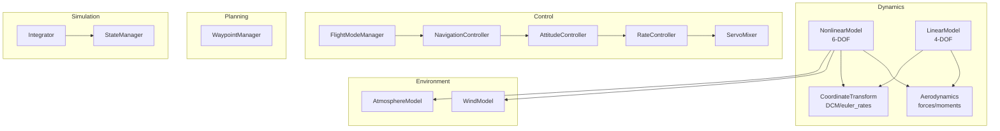
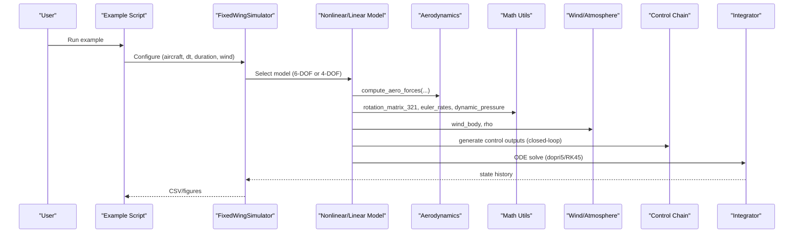
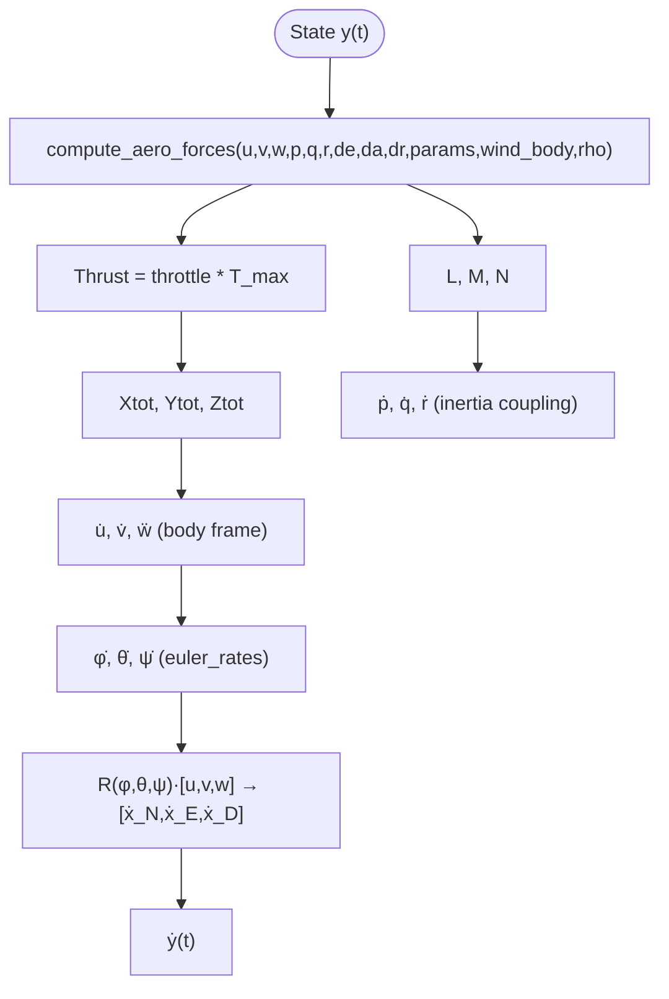
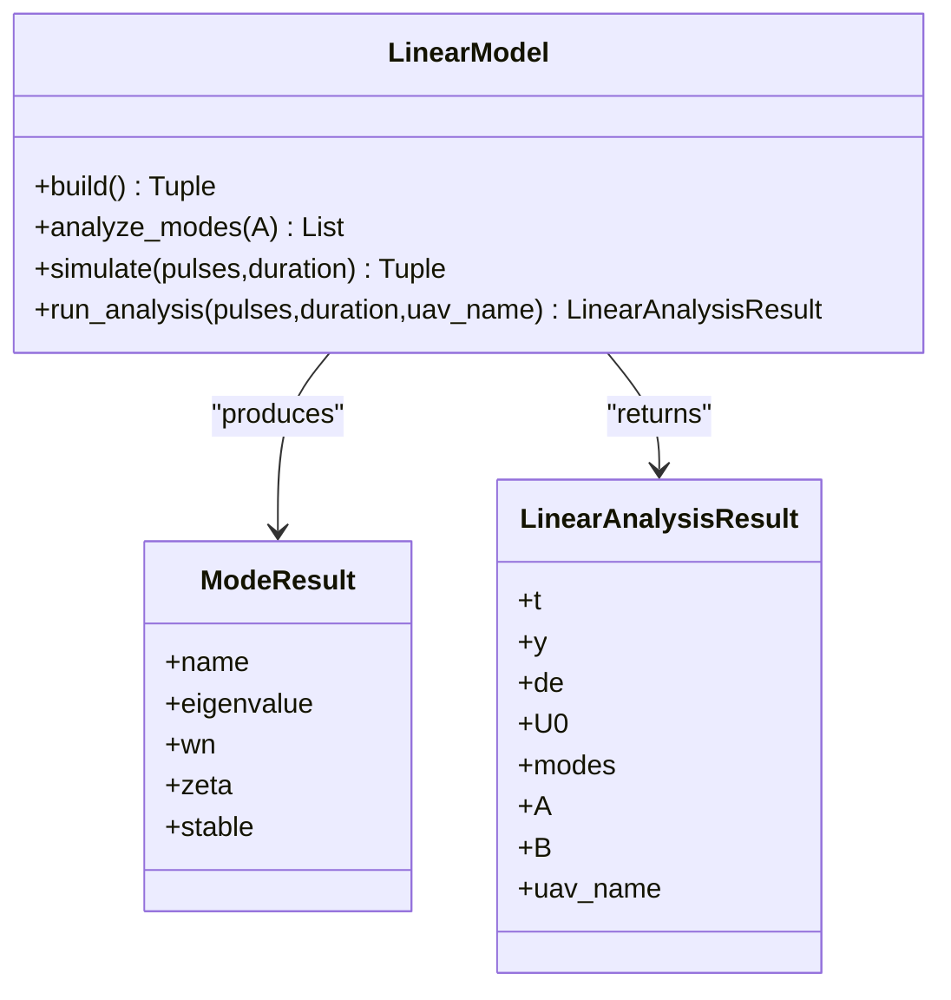
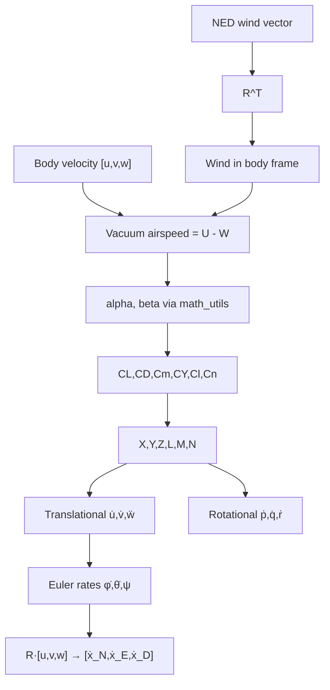
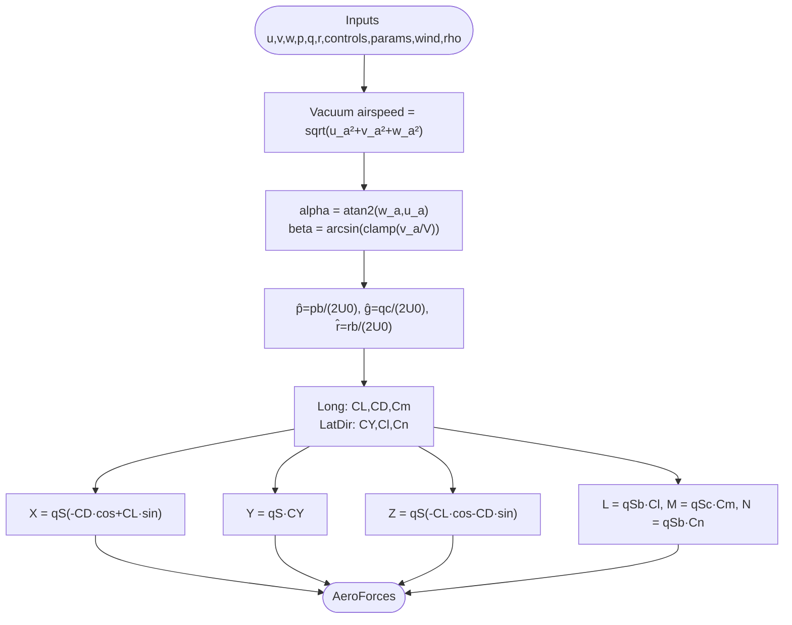
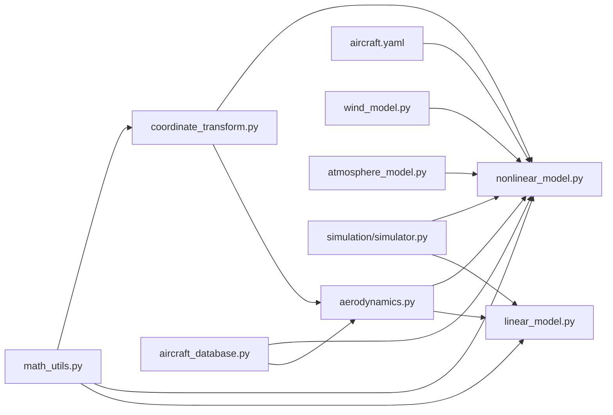

# Flight Mechanics Theory

<cite>
**Referenced Files in This Document**
- [nonlinear_model.py](file://src/dynamics/nonlinear_model.py)
- [linear_model.py](file://src/dynamics/linear_model.py)
- [aerodynamics.py](file://src/dynamics/aerodynamics.py)
- [math_utils.py](file://src/utils/math_utils.py)
- [coordinate_transform.py](file://src/dynamics/coordinate_transform.py)
- [1_linear_response.py](file://examples/1_linear_response.py)
- [2_nonlinear_dynamics.py](file://examples/2_nonlinear_dynamics.py)
- [飞行动力学理论.md](file://doc/zh/content/核心概念/飞行动力学理论.md)
- [6自由度非线性动力学模型.md](file://doc/zh/content/动力学系统/6自由度非线性动力学模型.md)
- [4自由度线性化动力学模型.md](file://doc/zh/content/动力学系统/4自由度线性化动力学模型.md)
- [坐标系转换.md](file://doc/zh/content/动力学系统/坐标系转换.md)
- [气动力计算.md](file://doc/zh/content/环境系统/气动力计算.md)
</cite>

## Table of Contents
1. [Introduction](#introduction)
2. [Project Structure](#project-structure)
3. [Core Components](#core-components)
4. [Architecture Overview](#architecture-overview)
5. [Detailed Component Analysis](#detailed-component-analysis)
6. [Dependency Analysis](#dependency-analysis)
7. [Performance Considerations](#performance-considerations)
8. [Troubleshooting Guide](#troubleshooting-guide)
9. [Conclusion](#conclusion)
10. [Appendices](#appendices)

## Introduction
This document presents a comprehensive flight mechanics theory reference grounded in the repository’s 6-DOF nonlinear and 4-DOF linear models. It explains the equations of motion, state vector definitions, kinematic and dynamic relationships, coordinate system conventions, stability and control derivatives, trim and equilibrium analysis, and the approximations underlying the simulation models. The goal is to connect theoretical foundations with the code implementations so that readers can understand both the physics and the numerical realization.

## Project Structure
The repository organizes flight mechanics around modular layers:
- Dynamics: nonlinear 6-DOF and linear 4-DOF models, aerodynamic force/moment calculation, and coordinate transforms
- Environment: wind and atmospheric models
- Control: flight mode manager, navigation, attitude/angle-rate, and servo mixing
- Planning: waypoints and trajectory management
- Simulation: integrators and state management
- Examples and documentation: runnable scripts and theory guides

**Diagram sources**
- [nonlinear_model.py](file://src/dynamics/nonlinear_model.py#L104-L386)
- [linear_model.py](file://src/dynamics/linear_model.py#L107-L319)
- [aerodynamics.py](file://src/dynamics/aerodynamics.py#L35-L148)
- [coordinate_transform.py](file://src/dynamics/coordinate_transform.py#L29-L70)

**Section sources**
- [飞行动力学理论.md](file://doc/zh/content/核心概念/飞行动力学理论.md#L35-L42)
- [6自由度非线性动力学模型.md](file://doc/zh/content/动力学系统/6自由度非线性动力学模型.md#L38-L46)

## Core Components
- Nonlinear 6-DOF model: computes translational and rotational accelerations, Euler kinematics, and position propagation using body-frame forces and moments, with trim computation and ODE integration.
- Linear 4-DOF model: constructs a longitudinal state-space model from stability derivatives, enabling modal analysis and time-domain simulation.
- Aerodynamics: computes lift, drag, side force, and rolling, pitching, and yawing moments from angle-of-attack, sideslip, non-dimensional angular rates, and control surface deflections.
- Math utilities: rotation matrices, Euler angle rates, angle wrapping, saturation, and dynamic pressure.
- Coordinate transforms: DCM construction, wind-to-body conversion, airspeed vector computation, and Euler-rate mapping with numerical protection near singularities.

**Section sources**
- [飞行动力学理论.md](file://doc/zh/content/核心概念/飞行动力学理论.md#L109-L115)
- [6自由度非线性动力学模型.md](file://doc/zh/content/动力学系统/6自由度非线性动力学模型.md#L108-L114)
- [4自由度线性化动力学模型.md](file://doc/zh/content/动力学系统/4自由度线性化动力学模型.md#L86-L111)

## Architecture Overview
The simulation integrates control commands, environment effects, and dynamics to produce time histories of states and derived quantities.

**Diagram sources**
- [飞行动力学理论.md](file://doc/zh/content/核心概念/飞行动力学理论.md#L126-L148)
- [1_linear_response.py](file://examples/1_linear_response.py#L132-L144)
- [2_nonlinear_dynamics.py](file://examples/2_nonlinear_dynamics.py#L130-L139)

## Detailed Component Analysis

### 6-DOF Nonlinear Equations of Motion
- State vector (12-D, NED frame): body velocities [u, v, w], body angular rates [p, q, r], Euler angles [φ, θ, ψ], and position [x_N, x_E, x_D].
- Translational dynamics: Newton’s law in body frame with Coriolis-like coupling terms and external forces (aerodynamics, thrust, gravity).
- Rotational dynamics: Euler equations with inertia coupling and stability derivatives.
- Kinematics: Euler rates mapped from [p, q, r]; position updated via DCM from [u, v, w] to NED.
- Trim: solves for steady-level flight equilibrium (α_trim, δe_trim) given mass, wing area, and dynamic pressure.

**Diagram sources**
- [nonlinear_model.py](file://src/dynamics/nonlinear_model.py#L160-L255)
- [aerodynamics.py](file://src/dynamics/aerodynamics.py#L35-L148)
- [math_utils.py](file://src/utils/math_utils.py#L43-L101)

**Section sources**
- [飞行动力学理论.md](file://doc/zh/content/核心概念/飞行动力学理论.md#L161-L186)
- [6自由度非线性动力学模型.md](file://doc/zh/content/动力学系统/6自由度非线性动力学模型.md#L171-L195)

### 4-DOF Linearized Longitudinal Model
- State: [ū_p, α, q, θ], where ū_p = Δu/U0 is normalized speed perturbation.
- Inputs: [δ_T, δe], throttle and elevator perturbations.
- Assumptions: small perturbations, steady trim, constant parameters, ignore lateral/directional coupling.
- Construction: assemble A and B from stability derivatives; analyze eigenvalues to classify short-period, phugoid, and subsidence modes.

**Diagram sources**
- [linear_model.py](file://src/dynamics/linear_model.py#L107-L319)

**Section sources**
- [飞行动力学理论.md](file://doc/zh/content/核心概念/飞行动力学理论.md#L193-L238)
- [4自由度线性化动力学模型.md](file://doc/zh/content/动力学系统/4自由度线性化动力学模型.md#L146-L241)

### Coordinate System Conventions and Transformations
- Frames: NED (geographic, down-positive) and body-fixed (right-handed).
- Convention: 3-2-1 Euler sequence (ψ, θ, φ) for DCM; body→NED via R; NED→body via R^T.
- Euler rates: mapping from [p, q, r] to [φ̇, θ̇, ψ̇] with numerical protection near θ = ±90°.
- Airspeed: vacuum speed = body velocity minus body wind; wind-to-body via R^T.
- Applications: position update (NED), attitude evolution, navigation projections.

**Diagram sources**
- [coordinate_transform.py](file://src/dynamics/coordinate_transform.py#L39-L70)
- [math_utils.py](file://src/utils/math_utils.py#L43-L101)
- [aerodynamics.py](file://src/dynamics/aerodynamics.py#L68-L147)
- [nonlinear_model.py](file://src/dynamics/nonlinear_model.py#L246-L248)

**Section sources**
- [坐标系转换.md](file://doc/zh/content/动力学系统/坐标系转换.md#L140-L186)
- [飞行动力学理论.md](file://doc/zh/content/核心概念/飞行动力学理论.md#L240-L276)

### Aerodynamic Force and Moment Calculation
- Inputs: body-frame velocity [u, v, w], angular rates [p, q, r], control deflections [δe, δa, δr], parameters, optional wind in body frame, density ρ.
- Procedures: vacuum airspeed vector, angles α and β, non-dimensional rates, linear combination of stability derivatives, forces and moments in body frame.
- Outputs: AeroForces container with dimensional forces/moments and non-dimensional coefficients.

**Diagram sources**
- [aerodynamics.py](file://src/dynamics/aerodynamics.py#L35-L148)
- [math_utils.py](file://src/utils/math_utils.py#L107-L123)

**Section sources**
- [气动力计算.md](file://doc/zh/content/环境系统/气动力计算.md#L136-L163)
- [飞行动力学理论.md](file://doc/zh/content/核心概念/飞行动力学理论.md#L240-L264)

### Trim and Equilibrium Analysis
- Objective: horizontal level flight with zero sideslip and constant speed; balance lift with weight and trim elevator for desired α.
- Method: solve linear system involving CL(α, δe) and Cm(α, δe) to find (α_trim, δe_trim) given q_bar, S, m; fallback to α-only solution if ill-conditioned.
- Use: initialize nonlinear simulations at trim conditions to avoid transients and improve numerical conditioning.

**Section sources**
- [飞行动力学理论.md](file://doc/zh/content/核心概念/飞行动力学理论.md#L162-L166)
- [6自由度非线性动力学模型.md](file://doc/zh/content/动力学系统/6自由度非线性动力学模型.md#L212-L217)
- [nonlinear_model.py](file://src/dynamics/nonlinear_model.py#L132-L154)

### Flight Regimes, Performance, and Control Effectiveness
- Short-period mode: high-frequency pitch oscillation (damped), dominated by α and q; indicates pitch stiffness and elevator effectiveness.
- Phugoid mode: low-frequency long-period oscillation in energy; couples u and θ; governed by CL and CD.
- Subsidence mode: pure decay (often negligible) related to yaw/heading.
- Control effectiveness: elevator primarily affects pitch; throttle influences speed/energy; ailerons and rudder provide roll/yaw control with coupling.

**Section sources**
- [4自由度线性化动力学模型.md](file://doc/zh/content/动力学系统/4自由度线性化动力学模型.md#L224-L238)
- [飞行动力学理论.md](file://doc/zh/content/核心概念/飞行动力学理论.md#L224-L238)

### Numerical Implementation Notes
- Integrators: dopri5 (adaptive step, real-time) and RK45 (solve_ivp, batch); tolerances and max step size configured for stability.
- Wind and density: optional wind body conversion and altitude-dependent density for realistic environmental effects.
- Examples: open-loop pulse responses and closed-loop PID comparisons demonstrate model fidelity and control performance.

**Section sources**
- [6自由度非线性动力学模型.md](file://doc/zh/content/动力学系统/6自由度非线性动力学模型.md#L232-L242)
- [1_linear_response.py](file://examples/1_linear_response.py#L95-L124)
- [2_nonlinear_dynamics.py](file://examples/2_nonlinear_dynamics.py#L89-L121)

## Dependency Analysis
The dynamics modules depend on aerodynamics and math utilities; coordinate transforms bridge body and NED frames; environment models feed wind and density; control chain consumes states and produces control inputs.

**Diagram sources**
- [飞行动力学理论.md](file://doc/zh/content/核心概念/飞行动力学理论.md#L315-L345)
- [坐标系转换.md](file://doc/zh/content/动力学系统/坐标系转换.md#L300-L331)
- [气动力计算.md](file://doc/zh/content/环境系统/气动力计算.md#L236-L261)

**Section sources**
- [飞行动力学理论.md](file://doc/zh/content/核心概念/飞行动力学理论.md#L315-L345)
- [坐标系转换.md](file://doc/zh/content/动力学系统/坐标系转换.md#L300-L331)
- [气动力计算.md](file://doc/zh/content/环境系统/气动力计算.md#L236-L261)

## Performance Considerations
- Computational cost: aerodynamics O(1) with trigonometric evaluations; nonlinear ODE per step involves a few dozen flops; linear model assembly is fast.
- Stability: adaptive step (dopri5) preferred for nonlinear systems; ensure tolerances and max step size balance accuracy and speed.
- Conditioning: trim initialization improves convergence; protect against singularities in Euler-rate mapping; handle small-airspeed clipping.
- Scalability: separate independent simulations can run concurrently; shared wind/parameters require thread-safe access.

[No sources needed since this section provides general guidance]

## Troubleshooting Guide
- Nonlinear divergence: reduce max step or tighten tolerances; verify initial trim and control magnitudes.
- Euler-angle singularity: watch for θ near ±90°; numerical protection is applied but extreme maneuvers may still cause issues.
- Parameter mismatch: confirm mass/inertia/planform parameters match database entries.
- Wind anomalies: ensure wind type and orientation align with configuration; check conversions from NED to body frame.
- Linear instability: inspect eigenvalues; verify trim point and parameter validity.

**Section sources**
- [6自由度非线性动力学模型.md](file://doc/zh/content/动力学系统/6自由度非线性动力学模型.md#L307-L321)
- [坐标系转换.md](file://doc/zh/content/动力学系统/坐标系转换.md#L347-L367)

## Conclusion
The repository implements a robust framework linking classical flight mechanics theory to efficient numerical simulation. The 6-DOF nonlinear model captures full coupled dynamics with trim and integration, while the 4-DOF linear model enables modal analysis and controller design. Together with accurate aerodynamics, coordinate transforms, and environment modeling, the system supports both open-loop analysis and closed-loop control validation.

[No sources needed since this section summarizes without analyzing specific files]

## Appendices

### A. State Vector Definitions and Notation
- 6-DOF state: [u, v, w, p, q, r, φ, θ, ψ, x_N, x_E, x_D] in NED coordinates.
- 4-DOF state: [ū_p, α, q, θ] with normalized speed perturbation.
- Inputs: [δ_T, δe] for throttle and elevator; others as needed for full model.

**Section sources**
- [飞行動力学理論.md](file://doc/zh/content/核心概念/飞行动力学理论.md#L161-L166)
- [4自由度线性化动力学模型.md](file://doc/zh/content/动力学系统/4自由度线性化动力学模型.md#L4-L12)

### B. Coordinate Systems and Conventions
- NED: right-handed geographic frame; body: right-handed aircraft-fixed frame.
- Euler angles: 3-2-1 sequence; DCM maps body→NED; inverse maps NED→body.
- Euler-rate mapping: protects against θ = ±90° via small ε regularization.

**Section sources**
- [坐标系转换.md](file://doc/zh/content/动力学系统/坐标系转换.md#L140-L186)

### C. Aerodynamic Derivatives and Coefficients
- Longitudinal: CL, CD, Cm; lateral-directional: CY, Cl, Cn.
- Non-dimensional rates: p̂, ĝ, r̂; angles: α, β.
- Forces and moments: computed from q_bar, S, and linear combinations of derivatives.

**Section sources**
- [气动力计算.md](file://doc/zh/content/环境系统/气动力计算.md#L136-L163)
- [aerodynamics.py](file://src/dynamics/aerodynamics.py#L90-L126)

### D. Examples and Validation
- Linear open-loop: modal analysis and time response under elevator pulses.
- Nonlinear open-loop: trim computation and pulse responses for roll/pitch.
- Closed-loop: PID control comparisons in FBW and STABILIZE modes.

**Section sources**
- [1_linear_response.py](file://examples/1_linear_response.py#L95-L124)
- [2_nonlinear_dynamics.py](file://examples/2_nonlinear_dynamics.py#L89-L121)