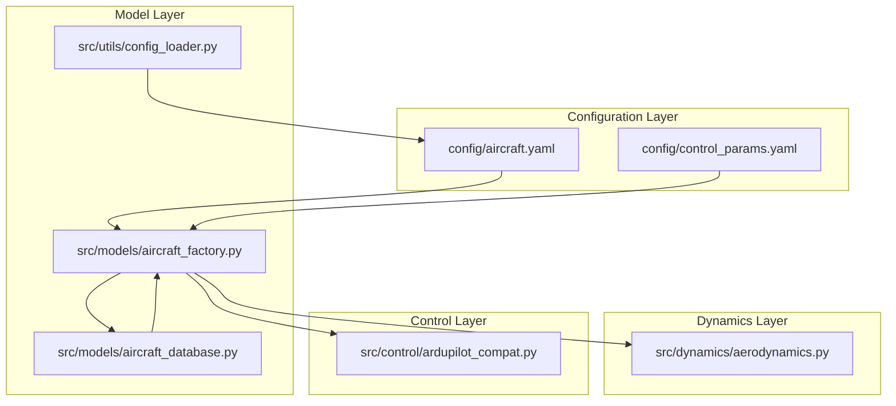
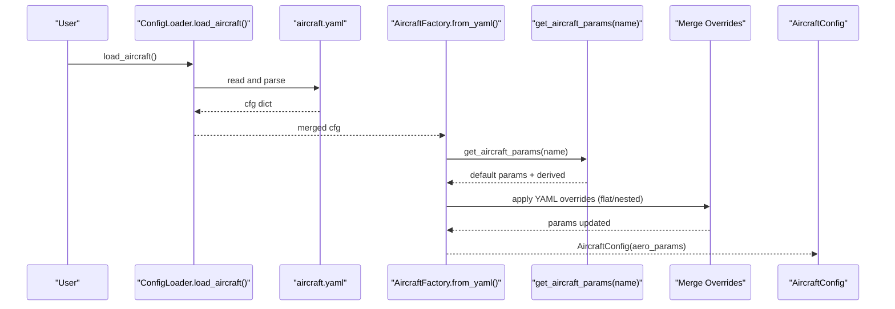
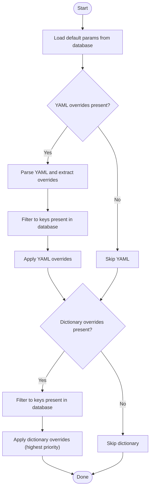
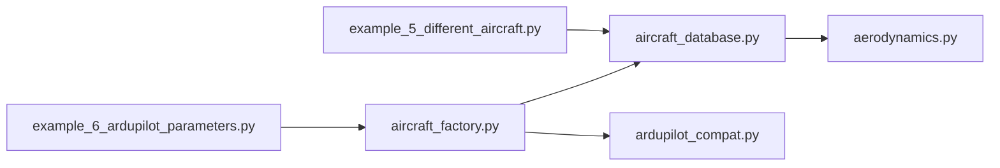

# Aircraft Configuration

<cite>
**Referenced Files in This Document**
- [aircraft.yaml](file://config/aircraft.yaml)
- [aircraft_database.py](file://src/models/aircraft_database.py)
- [aircraft_factory.py](file://src/models/aircraft_factory.py)
- [config_loader.py](file://src/utils/config_loader.py)
- [aerodynamics.py](file://src/dynamics/aerodynamics.py)
- [ardupilot_compat.py](file://src/control/ardupilot_compat.py)
- [control_params.yaml](file://config/control_params.yaml)
- [example_5_different_aircraft.py](file://examples/5_different_aircraft.py)
- [example_6_ardupilot_parameters.py](file://examples/6_ardupilot_parameters.py)
</cite>

## Table of Contents
1. [Introduction](#introduction)
2. [Project Structure](#project-structure)
3. [Core Components](#core-components)
4. [Architecture Overview](#architecture-overview)
5. [Detailed Component Analysis](#detailed-component-analysis)
6. [Dependency Analysis](#dependency-analysis)
7. [Performance Considerations](#performance-considerations)
8. [Troubleshooting Guide](#troubleshooting-guide)
9. [Conclusion](#conclusion)
10. [Appendices](#appendices)

## Introduction
This document provides comprehensive guidance for configuring aircraft in the FixedWingSimulator. It explains the aircraft.yaml configuration file structure, the seven supported aircraft models (TB2, Anka, Aksungur, Karayel, Predator, Heron MK1, Heron MK2), and the parameter categories used by the simulation. It also details the overrides mechanism for customizing default database parameters via YAML syntax, key validation, and priority levels. Practical examples demonstrate aircraft selection, parameter modification, and comparative analysis scenarios.

## Project Structure
The aircraft configuration pipeline spans configuration files, a parameter database, a factory for merging overrides, and supporting utilities. The following diagram maps the primary components involved in aircraft configuration and parameter usage.

**Diagram sources**
- [aircraft.yaml](file://config/aircraft.yaml#L1-L13)
- [aircraft_database.py](file://src/models/aircraft_database.py#L29-L133)
- [aircraft_factory.py](file://src/models/aircraft_factory.py#L42-L93)
- [config_loader.py](file://src/utils/config_loader.py#L68-L70)
- [aerodynamics.py](file://src/dynamics/aerodynamics.py#L35-L128)
- [ardupilot_compat.py](file://src/control/ardupilot_compat.py#L17-L129)

**Section sources**
- [aircraft.yaml](file://config/aircraft.yaml#L1-L13)
- [aircraft_database.py](file://src/models/aircraft_database.py#L29-L133)
- [aircraft_factory.py](file://src/models/aircraft_factory.py#L42-L93)
- [config_loader.py](file://src/utils/config_loader.py#L68-L70)

## Core Components
- aircraft.yaml: Defines the selected aircraft and optional overrides for database parameters. It supports a top-level aircraft_name and an overrides block (nested or flat).
- aircraft_database.py: Provides the built-in database of seven aircraft models with geometry/inertia, aerodynamic coefficients, and derived parameters injected at runtime.
- aircraft_factory.py: Loads default parameters from the database and merges YAML and/or dictionary overrides, returning a consolidated configuration consumed by the simulation.
- config_loader.py: Loads and deep-merges configuration files, including aircraft.yaml defaults, ensuring robust initialization.

**Section sources**
- [aircraft.yaml](file://config/aircraft.yaml#L1-L13)
- [aircraft_database.py](file://src/models/aircraft_database.py#L143-L166)
- [aircraft_factory.py](file://src/models/aircraft_factory.py#L42-L74)
- [config_loader.py](file://src/utils/config_loader.py#L68-L70)

## Architecture Overview
The configuration flow begins with loading aircraft.yaml and merging it with defaults, then invoking the factory to fetch database parameters and apply overrides. Derived parameters (e.g., U0, rho, q_bar) are computed and passed to the dynamics engine.

**Diagram sources**
- [config_loader.py](file://src/utils/config_loader.py#L68-L70)
- [aircraft_factory.py](file://src/models/aircraft_factory.py#L77-L92)
- [aircraft_database.py](file://src/models/aircraft_database.py#L143-L166)

## Detailed Component Analysis

### Aircraft Configuration File: aircraft.yaml
- Purpose: Select the aircraft to simulate and optionally override database defaults.
- Required field:
  - aircraft_name: Must match one of the seven supported models.
- Optional field:
  - overrides: A dictionary of parameters to override. Accepts both flat and nested forms; only existing database keys are applied.
- Defaults:
  - If aircraft_name is missing, the default is TB2.
  - If overrides is missing, it is treated as an empty dictionary.

Practical notes:
- To enable overrides, uncomment the overrides section and specify desired keys.
- Keys must correspond to entries in the database; unknown keys are ignored.

**Section sources**
- [aircraft.yaml](file://config/aircraft.yaml#L1-L13)
- [aircraft_factory.py](file://src/models/aircraft_factory.py#L77-L92)

### Aircraft Database: Built-in Models and Parameters
The database defines seven aircraft models with the following categories:
- Identification: name, company, country
- Geometry and inertia: mass, wing area S, mean aerodynamic chord c, wingspan b, moments of inertia Ixx, Iyy, Izz, Ixz
- Aerodynamic characteristics:
  - Longitudinal: CL_0, CL_alpha, CL_q, CL_deltae, CD_0, CD_alpha, Cm_0, Cm_alpha, Cm_q, Cm_deltae
  - Lateral-directional: CYb, CYp, CYr, CYda, CYdr; Clb, Clp, Clr, Clda, Cldr; Cnb, Cnp, Cnr, Cnda, Cndr
- Flight condition: Mach (used to compute U0)

Derived parameters injected at runtime:
- U0 = Mach × speed_of_sound
- rho = sea-level ISA density
- q_bar = 0.5 × rho × U0^2

These derived parameters are used by the aerodynamics module for force/moment computation.

**Section sources**
- [aircraft_database.py](file://src/models/aircraft_database.py#L29-L133)
- [aircraft_database.py](file://src/models/aircraft_database.py#L143-L166)
- [aerodynamics.py](file://src/dynamics/aerodynamics.py#L35-L128)

### Overrides Mechanism: YAML Syntax, Validation, and Priority
The factory applies overrides in two stages:
1. YAML overrides:
   - Reads the YAML file and extracts overrides (supports nested overrides: overrides {...} or flat keys at top level).
   - Filters to keep only keys present in the database.
   - Updates the parameter dictionary.
2. Dictionary overrides (highest priority):
   - Applies a caller-provided dictionary of overrides, again filtering to database keys.
   - Overwrites any values set by YAML overrides.

Key validation:
- Only keys that exist in the database are accepted.
- Unknown keys are silently ignored.

Priority order:
- Database defaults ← YAML overrides ← Dictionary overrides (highest priority)

**Diagram sources**
- [aircraft_factory.py](file://src/models/aircraft_factory.py#L63-L74)

**Section sources**
- [aircraft_factory.py](file://src/models/aircraft_factory.py#L42-L74)

### Parameter Categories and Typical Ranges
- Mass properties:
  - mass (kg): affects acceleration and stability; typical hundreds to thousands depending on model.
  - Inertia terms (Ixx, Iyy, Izz, Ixz): influence rotational dynamics.
- Aerodynamic characteristics:
  - Longitudinal: CL_0, CL_alpha, CL_q, CL_deltae; CD_0, CD_alpha; Cm_0, Cm_alpha, Cm_q, Cm_deltae.
  - Lateral-directional: CYb, CYp, CYr, CYda, CYdr; Clb, Clp, Clr, Clda, Cldr; Cnb, Cnp, Cnr, Cnda, Cndr.
- Geometric dimensions:
  - S (m²): wing area; affects lift and induced drag.
  - c (m): mean aerodynamic chord; impacts lift distribution and control effectiveness.
  - b (m): wingspan; influences aspect ratio and induced drag.

Typical ranges (contextual guidance):
- mass: hundreds to several thousand kg (model-dependent).
- S: tens of square meters.
- c: tenths to under a meter.
- b: tens of meters.

Impact on flight dynamics:
- Increasing mass generally reduces acceleration but can improve trim stability.
- Changing S and c alters lift and drag; increasing S improves lift capacity while potentially increasing parasite drag.
- Adjusting b modifies aspect ratio and induced drag; larger b often improves efficiency but increases structural weight.

**Section sources**
- [aircraft_database.py](file://src/models/aircraft_database.py#L29-L133)
- [aircraft_database.py](file://src/models/aircraft_database.py#L143-L166)
- [aerodynamics.py](file://src/dynamics/aerodynamics.py#L35-L128)

### Practical Examples

#### Example 1: Aircraft Selection and Comparative Analysis
- Objective: Compare the short-period and phugoid modes across all seven aircraft under identical elevator inputs.
- Steps:
  - Iterate over AIRCRAFT_NAMES.
  - Retrieve parameters via get_aircraft_params(name).
  - Instantiate a linear model and run analysis.
  - Record and compare modal damping ratios and frequencies.
- Outcome: Insight into how geometry and aerodynamics affect longitudinal stability and oscillatory modes.

**Section sources**
- [example_5_different_aircraft.py](file://examples/5_different_aircraft.py#L24-L33)

#### Example 2: Parameter Modification and Export
- Objective: Modify ArduPilot control gains, validate ranges, and export parameters for hardware-in-the-loop.
- Steps:
  - Load ArduPilot parameters from control_params.yaml using ArdupilotParams.from_yaml().
  - Validate parameters with validate(); address warnings.
  - Export aircraft + control parameters to a .param file using AircraftFactory.export_ardupilot_params().
- Outcome: Consistent parameterization aligned with ArduPilot naming conventions.

**Section sources**
- [ardupilot_compat.py](file://src/control/ardupilot_compat.py#L74-L88)
- [ardupilot_compat.py](file://src/control/ardupilot_compat.py#L104-L129)
- [aircraft_factory.py](file://src/models/aircraft_factory.py#L95-L135)
- [control_params.yaml](file://config/control_params.yaml#L1-L45)

#### Example 3: Using Overrides in aircraft.yaml
- Objective: Customize a default aircraft (e.g., increase mass) without editing code.
- Steps:
  - Set aircraft_name to the desired model.
  - Uncomment and edit overrides to change keys like mass, S, c, b.
  - Load configuration using ConfigLoader.load_aircraft() and pass to the factory.
- Outcome: Quick experimentation with parameter variations while retaining database defaults for unmodified keys.

**Section sources**
- [aircraft.yaml](file://config/aircraft.yaml#L7-L12)
- [config_loader.py](file://src/utils/config_loader.py#L68-L70)
- [aircraft_factory.py](file://src/models/aircraft_factory.py#L77-L92)

## Dependency Analysis
The aircraft configuration system exhibits clean separation of concerns:
- aircraft_database.py depends only on typing and math; it exposes public functions to retrieve parameters and derive quantities.
- aircraft_factory.py depends on yaml, os, dataclasses, and the database interface; it merges overrides and produces a consolidated configuration.
- aerodynamics.py consumes parameters from the database and computes forces/moments using derived fields.
- ardupilot_compat.py provides ArduPilot-compatible parameter containers and validation utilities.

**Diagram sources**
- [aircraft_database.py](file://src/models/aircraft_database.py#L143-L166)
- [aircraft_factory.py](file://src/models/aircraft_factory.py#L42-L93)
- [aerodynamics.py](file://src/dynamics/aerodynamics.py#L35-L128)
- [ardupilot_compat.py](file://src/control/ardupilot_compat.py#L17-L129)
- [example_5_different_aircraft.py](file://examples/5_different_aircraft.py#L18-L29)
- [example_6_ardupilot_parameters.py](file://examples/6_ardupilot_parameters.py#L20-L42)

**Section sources**
- [aircraft_database.py](file://src/models/aircraft_database.py#L143-L166)
- [aircraft_factory.py](file://src/models/aircraft_factory.py#L42-L93)
- [aerodynamics.py](file://src/dynamics/aerodynamics.py#L35-L128)
- [ardupilot_compat.py](file://src/control/ardupilot_compat.py#L17-L129)

## Performance Considerations
- Parameter lookup and derived computation are constant-time operations, minimizing overhead.
- Merging overrides is dictionary-based and efficient for typical parameter counts.
- For batch analyses, reuse merged configurations to avoid repeated I/O and updates.
- The aerodynamics module uses derived q_bar for numerical stability; ensure realistic wind conditions to prevent extreme dynamic pressure values.

[No sources needed since this section provides general guidance]

## Troubleshooting Guide
- aircraft_name not found:
  - Symptom: KeyError indicating the name is unavailable.
  - Action: Verify spelling against the list of supported models and ensure case sensitivity matches.
- Unknown override keys:
  - Symptom: Specified keys do not change parameters.
  - Action: Confirm keys exist in the database; unknown keys are ignored.
- YAML parsing errors:
  - Symptom: Failure to load aircraft.yaml.
  - Action: Check indentation and syntax; ensure overrides is a dictionary or nested form.
- Export permission issues:
  - Symptom: Cannot write the exported .param file.
  - Action: Verify output directory exists and is writable.

**Section sources**
- [aircraft_database.py](file://src/models/aircraft_database.py#L153-L156)
- [aircraft_factory.py](file://src/models/aircraft_factory.py#L63-L74)
- [aircraft_factory.py](file://src/models/aircraft_factory.py#L129-L133)

## Conclusion
The FixedWingSimulator’s aircraft configuration system combines a concise YAML interface with a robust parameter database and a deterministic override pipeline. Users can quickly select among seven aircraft models, customize key parameters, and export ArduPilot-compatible settings. Derived parameters ensure consistent and numerically stable aerodynamic computations, while the factory’s strict key validation prevents invalid configurations.

[No sources needed since this section summarizes without analyzing specific files]

## Appendices

### A. Seven Supported Aircraft Models
- TB2, Anka, Aksungur, Karayel, Predator, Heron MK1, Heron MK2
- Each model includes geometry/inertia, aerodynamic coefficients, and Mach number for derived parameter computation.

**Section sources**
- [aircraft_database.py](file://src/models/aircraft_database.py#L29-L133)

### B. Parameter Naming Conventions
- Longitudinal coefficients: CL_, CD_, Cm_
- Lateral-directional coefficients: CY_, Cl_, Cn_
- Angle-of-attack dependence: underscore alpha
- Angular-rate dependence: underscore q (pitch), p (roll), r (yaw)
- Control surface dependence: deltae (elevator), da (aileron), dr (rudder)

**Section sources**
- [aircraft_database.py](file://src/models/aircraft_database.py#L29-L133)

### C. Derived Parameters and Their Role
- U0 = Mach × sound speed
- rho = sea-level ISA density
- q_bar = 0.5 × rho × U0^2
- Used by aerodynamics computations for force and moment evaluation.

**Section sources**
- [aircraft_database.py](file://src/models/aircraft_database.py#L159-L164)
- [aerodynamics.py](file://src/dynamics/aerodynamics.py#L35-L128)

### D. Example Workflows
- Comparative analysis across models:
  - Iterate over AIRCRAFT_NAMES, retrieve parameters, run linear/nonlinear analysis, and compare responses.
- Parameter tuning and export:
  - Load ArduPilot parameters from YAML, validate ranges, and export .param for ArduPilot/HIL.

**Section sources**
- [example_5_different_aircraft.py](file://examples/5_different_aircraft.py#L24-L33)
- [example_6_ardupilot_parameters.py](file://examples/6_ardupilot_parameters.py#L27-L42)