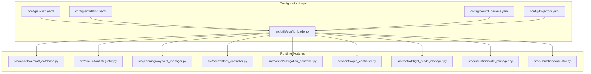
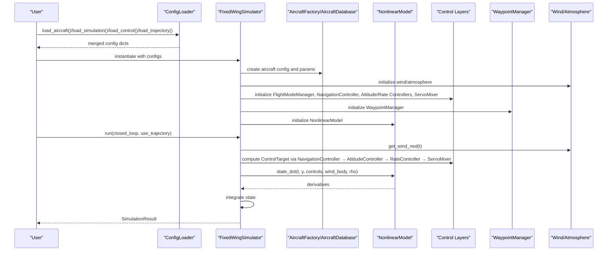
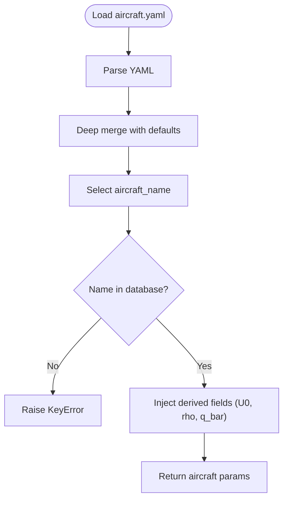
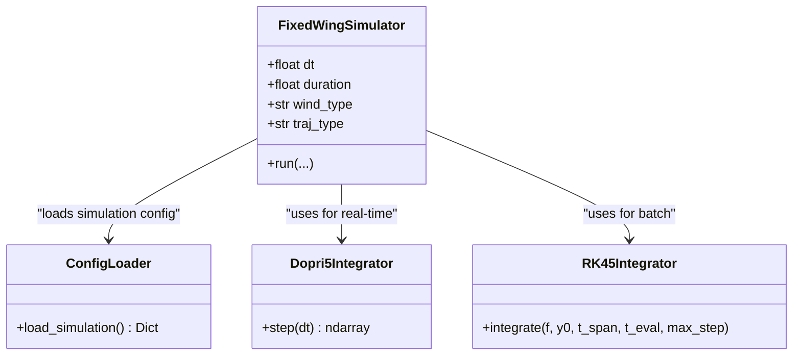
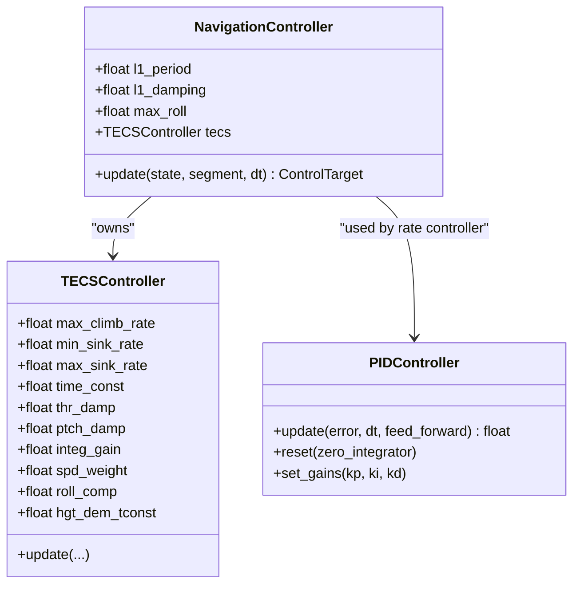
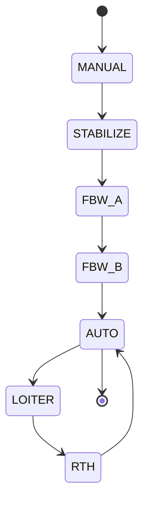
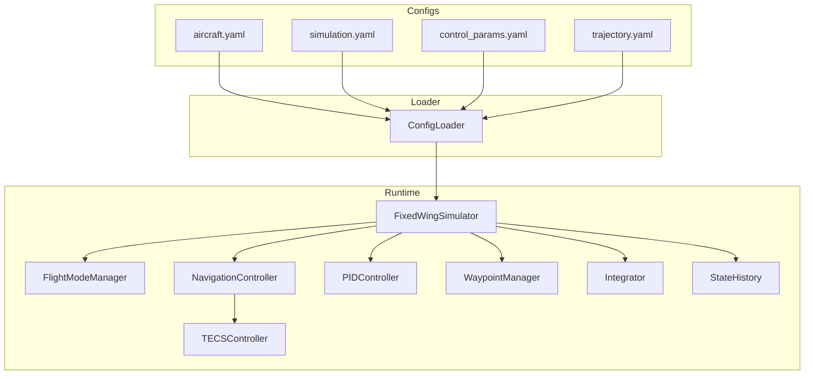

# Configuration Guides

<cite>
**Referenced Files in This Document**
- [aircraft.yaml](file://config/aircraft.yaml)
- [simulation.yaml](file://config/simulation.yaml)
- [control_params.yaml](file://config/control_params.yaml)
- [trajectory.yaml](file://config/trajectory.yaml)
- [config_loader.py](file://src/utils/config_loader.py)
- [aircraft_database.py](file://src/models/aircraft_database.py)
- [integrator.py](file://src/simulation/integrator.py)
- [waypoint_manager.py](file://src/planning/waypoint_manager.py)
- [pid_controller.py](file://src/control/pid_controller.py)
- [tecs_controller.py](file://src/control/tecs_controller.py)
- [flight_mode_manager.py](file://src/control/flight_mode_manager.py)
- [state_manager.py](file://src/simulation/state_manager.py)
- [simulator.py](file://src/simulation/simulator.py)
- [navigation_controller.py](file://src/control/navigation_controller.py)
- [trajectory_base.py](file://src/planning/trajectory_base.py)
</cite>

## Table of Contents
1. [Introduction](#introduction)
2. [Project Structure](#project-structure)
3. [Core Components](#core-components)
4. [Architecture Overview](#architecture-overview)
5. [Detailed Component Analysis](#detailed-component-analysis)
6. [Dependency Analysis](#dependency-analysis)
7. [Performance Considerations](#performance-considerations)
8. [Troubleshooting Guide](#troubleshooting-guide)
9. [Conclusion](#conclusion)
10. [Appendices](#appendices)

## Introduction
This document provides comprehensive configuration guides for all system parameters and settings in the FixedWingSimulator. It covers:
- Aircraft parameter configuration (geometry, mass properties, aerodynamic coefficients, control surface definitions)
- Simulation configuration (time stepping, integration methods, accuracy parameters, computational settings)
- Control parameter configuration (PID tuning guidelines, control limits, flight mode settings)
- Trajectory configuration (waypoint definition, trajectory parameters, mission planning setup)
- Parameter tuning methodologies, validation procedures, and optimization strategies for each configuration area

## Project Structure
The configuration system is organized around four primary YAML files and a configuration loader that merges defaults with user-provided settings. The loader exposes per-subsystem loaders for aircraft, simulation, control, and trajectory.



**Diagram sources**
- [config_loader.py](file://src/utils/config_loader.py#L10-L82)
- [aircraft_database.py](file://src/models/aircraft_database.py#L29-L166)
- [integrator.py](file://src/simulation/integrator.py#L17-L108)
- [waypoint_manager.py](file://src/planning/waypoint_manager.py#L20-L208)
- [tecs_controller.py](file://src/control/tecs_controller.py#L50-L647)
- [navigation_controller.py](file://src/control/navigation_controller.py#L45-L293)
- [pid_controller.py](file://src/control/pid_controller.py#L17-L117)
- [flight_mode_manager.py](file://src/control/flight_mode_manager.py#L115-L298)
- [state_manager.py](file://src/simulation/state_manager.py#L16-L193)
- [simulator.py](file://src/simulation/simulator.py#L115-L642)

**Section sources**
- [config_loader.py](file://src/utils/config_loader.py#L10-L82)

## Core Components
This section documents the configuration files and their roles, including defaults and override mechanisms.

- Aircraft configuration
  - Purpose: Select aircraft and optionally override database defaults.
  - Key fields:
    - aircraft_name: Name of the aircraft from the database.
    - overrides: Optional block to override geometry, mass, and inertia parameters.
  - Defaults: Provided by the loader’s defaults for aircraft.
  - Notes: Overrides are deep-merged into the selected aircraft’s parameters.

- Simulation configuration
  - Purpose: Configure time stepping, numerical integrator, initial conditions, flight mode, wind, and logging.
  - Key fields:
    - dt: Simulation time step (s).
    - duration: Total simulation duration (s).
    - integrator: Integrator choice ("dopri5" or "rk45").
    - rtol/atol: Relative and absolute tolerances for integration.
    - initial_position: Initial NED position [x_north, y_east, z_down] in meters.
    - initial_heading_deg: Initial heading in degrees (0=N).
    - initial_mode: Starting flight mode (e.g., AUTO).
    - wind_type: Wind model type (NONE, FIXED, SINE, RANDOMSINE).
    - wind_speed: Mean wind speed (m/s).
    - wind_direction_deg: Wind FROM direction in degrees (met convention).
    - log_enabled/log_dir: Logging toggle and directory.

- Control parameter configuration
  - Purpose: Define ArduPilot-compatible control parameters for navigation, rate control, and TECS.
  - Key categories:
    - Airspeed and altitude targets: ALT_HOLD_RTL, AIRSPEED_CRUISE, AIRSPEED_MIN, AIRSPEED_MAX.
    - L1 navigation: NAVL1_DAMPING, NAVL1_PERIOD.
    - Rate control gains: PTCH_RATE_P/I/D/FF, ROLL_RATE_P/I/D/FF, YAW_RATE_P/I/D/FF.
    - Control limits: LIM_PITCH_MIN/MAX, LIM_ROLL_DEG, THR_MIN/THR_MAX.
    - TECS parameters: TECS_CLMB_MAX, TECS_SINK_MIN, TECS_SINK_MAX, TECS_TIME_CONST, TECS_THR_DAMP, TECS_PTCH_DAMP, TECS_INTEG_GAIN, TECS_SPDWEIGHT, TECS_RLL2THR, TECS_PITCH_MIN/MAX, TECS_THR_CRUISE, TECS_HDEM_TCONST.

- Trajectory configuration
  - Purpose: Define trajectory type, average speed, yaw control mode, waypoints, and loop behavior.
  - Key fields:
    - type: Trajectory type ("minimum_snap", "minimum_jerk", "minimum_accel", "minimum_vel", "hover").
    - average_speed: Cruise speed used to estimate segment times (m/s).
    - yaw_mode: Yaw control mode ("none", "yaw_follow", "yaw_waypoint_interp", "zero").
    - waypoints: List of [north_m, east_m, alt_m] entries; alt_m is positive up and internally converted to NED down.
    - loop: Boolean to loop back to the first waypoint after the last.

**Section sources**
- [aircraft.yaml](file://config/aircraft.yaml#L1-L13)
- [simulation.yaml](file://config/simulation.yaml#L1-L30)
- [control_params.yaml](file://config/control_params.yaml#L1-L45)
- [trajectory.yaml](file://config/trajectory.yaml#L1-L23)
- [config_loader.py](file://src/utils/config_loader.py#L10-L82)

## Architecture Overview
The configuration pipeline merges YAML files with defaults and feeds runtime modules. The simulator orchestrates aircraft parameters, dynamics, environment, control layers, planning, and simulation internals.



**Diagram sources**
- [config_loader.py](file://src/utils/config_loader.py#L59-L82)
- [simulator.py](file://src/simulation/simulator.py#L130-L234)
- [aircraft_database.py](file://src/models/aircraft_database.py#L143-L166)
- [navigation_controller.py](file://src/control/navigation_controller.py#L45-L131)
- [flight_mode_manager.py](file://src/control/flight_mode_manager.py#L115-L191)
- [waypoint_manager.py](file://src/planning/waypoint_manager.py#L20-L50)
- [integrator.py](file://src/simulation/integrator.py#L17-L71)

## Detailed Component Analysis

### Aircraft Parameter Configuration
- Selection and overrides
  - aircraft_name selects a predefined aircraft from the database.
  - overrides allows overriding geometry (mass, wing area S, mean chord c, span b), inertia (Ixx, Iyy, Izz, Ixz), and Mach number.
- Database injection
  - The loader merges YAML overrides into the selected aircraft dictionary and injects derived fields (U0, rho, q_bar) required by dynamics and aerodynamics.
- Validation
  - Unknown aircraft names raise an error; valid names are listed in the database.



**Diagram sources**
- [aircraft.yaml](file://config/aircraft.yaml#L5-L12)
- [config_loader.py](file://src/utils/config_loader.py#L68-L70)
- [aircraft_database.py](file://src/models/aircraft_database.py#L143-L166)

**Section sources**
- [aircraft.yaml](file://config/aircraft.yaml#L1-L13)
- [aircraft_database.py](file://src/models/aircraft_database.py#L29-L166)
- [config_loader.py](file://src/utils/config_loader.py#L10-L70)

### Simulation Configuration
- Time stepping and integrator
  - dt and duration define the temporal grid.
  - integrator selects the solver ("dopri5" for real-time step-by-step, "rk45" for batch solve_ivp).
  - rtol/atol control local error tolerances for the integrator.
- Initial conditions and flight mode
  - initial_position sets the starting NED coordinates; initial_heading_deg sets the initial yaw.
  - initial_mode sets the starting flight mode (e.g., AUTO).
- Wind configuration
  - wind_type chooses among NONE, FIXED, SINE, RANDOMSINE.
  - wind_speed and wind_direction_deg configure the wind model.
- Logging
  - log_enabled toggles logging; log_dir specifies the output directory.



**Diagram sources**
- [simulation.yaml](file://config/simulation.yaml#L3-L29)
- [config_loader.py](file://src/utils/config_loader.py#L75-L77)
- [integrator.py](file://src/simulation/integrator.py#L17-L108)
- [simulator.py](file://src/simulation/simulator.py#L130-L147)

**Section sources**
- [simulation.yaml](file://config/simulation.yaml#L1-L30)
- [config_loader.py](file://src/utils/config_loader.py#L10-L37)
- [integrator.py](file://src/simulation/integrator.py#L17-L108)
- [simulator.py](file://src/simulation/simulator.py#L130-L147)

### Control Parameter Configuration
- Navigation (L1)
  - NAVL1_DAMPING and NAVL1_PERIOD govern lateral path-following behavior.
  - LIM_ROLL_DEG constrains maximum roll angle for FBW modes.
- Rate control (PID)
  - PTCH_RATE_P/I/D/FF, ROLL_RATE_P/I/D/FF, YAW_RATE_P/I/D/FF define gains for attitude and rate controllers.
  - Feedforward terms (FF) can be used to improve transient response.
- Control limits
  - LIM_PITCH_MIN/MAX and THR_MIN/THR_MAX bound control surface deflections and throttle.
- TECS (Total Energy Control System)
  - TECS_CLMB_MAX, TECS_SINK_MIN, TECS_SINK_MAX define climb/sink rate envelopes.
  - TECS_TIME_CONST, TECS_THR_DAMP, TECS_PTCH_DAMP tune response smoothness and damping.
  - TECS_INTEG_GAIN, TECS_SPDWEIGHT balance altitude vs speed prioritization.
  - TECS_RLL2THR compensates throttle for bank-induced drag.
  - TECS_PITCH_MIN/MAX constrain pitch demand.
  - TECS_THR_CRUISE provides a baseline throttle for level flight.
  - TECS_HDEM_TCONST smooths altitude demand changes.



**Diagram sources**
- [control_params.yaml](file://config/control_params.yaml#L1-L45)
- [navigation_controller.py](file://src/control/navigation_controller.py#L45-L131)
- [tecs_controller.py](file://src/control/tecs_controller.py#L50-L193)
- [pid_controller.py](file://src/control/pid_controller.py#L17-L117)

**Section sources**
- [control_params.yaml](file://config/control_params.yaml#L1-L45)
- [navigation_controller.py](file://src/control/navigation_controller.py#L45-L131)
- [tecs_controller.py](file://src/control/tecs_controller.py#L50-L193)
- [pid_controller.py](file://src/control/pid_controller.py#L17-L117)

### Trajectory Configuration
- Waypoint management
  - WaypointManager stores waypoints in NED format and constructs trajectories on demand.
  - Supports adding waypoints programmatically or loading from YAML.
  - Provides active segment access and desired state queries.
- Trajectory types
  - minimum_snap and minimum_jerk are supported; others (minimum_accel, minimum_vel, hover) are available in the configuration schema.
- Parameters
  - average_speed drives segment time estimates.
  - yaw_mode controls yaw behavior along the trajectory.
  - loop enables cyclic missions.

```mermaid
flowchart TD
W["WaypointManager"] --> |load_from_yaml| YAML["trajectory.yaml"]
W --> |build_trajectory| TBase["AbstractTrajectory"]
TBase --> TMinSnap["MinimumSnapTrajectory"]
TBase --> TMinJerk["MinimumJerkTrajectory"]
W --> |desired_state(t)| TBase
W --> |get_active_segment(t)| Seg["PathSegment"]
```

**Diagram sources**
- [trajectory.yaml](file://config/trajectory.yaml#L3-L22)
- [waypoint_manager.py](file://src/planning/waypoint_manager.py#L80-L160)
- [trajectory_base.py](file://src/planning/trajectory_base.py#L26-L47)

**Section sources**
- [trajectory.yaml](file://config/trajectory.yaml#L1-L23)
- [waypoint_manager.py](file://src/planning/waypoint_manager.py#L20-L208)
- [trajectory_base.py](file://src/planning/trajectory_base.py#L16-L47)

### Flight Mode Settings
- Modes
  - MANUAL, STABILIZE, FBW_A, FBW_B, AUTO, LOITER, RTH.
- Behavior
  - FlightModeManager computes ControlTarget for each mode and handles transitions.
  - AUTO/LOITER/RTH rely on NavigationController targets; STABILIZE/FBW_A/B enforce specific constraints.



**Diagram sources**
- [flight_mode_manager.py](file://src/control/flight_mode_manager.py#L28-L36)
- [flight_mode_manager.py](file://src/control/flight_mode_manager.py#L115-L191)

**Section sources**
- [flight_mode_manager.py](file://src/control/flight_mode_manager.py#L115-L298)

## Dependency Analysis
This section maps how configuration values propagate into runtime components.



**Diagram sources**
- [config_loader.py](file://src/utils/config_loader.py#L59-L82)
- [simulator.py](file://src/simulation/simulator.py#L148-L234)
- [flight_mode_manager.py](file://src/control/flight_mode_manager.py#L115-L191)
- [navigation_controller.py](file://src/control/navigation_controller.py#L45-L131)
- [tecs_controller.py](file://src/control/tecs_controller.py#L50-L193)
- [pid_controller.py](file://src/control/pid_controller.py#L17-L117)
- [waypoint_manager.py](file://src/planning/waypoint_manager.py#L20-L50)
- [integrator.py](file://src/simulation/integrator.py#L17-L71)
- [state_manager.py](file://src/simulation/state_manager.py#L95-L193)

**Section sources**
- [config_loader.py](file://src/utils/config_loader.py#L59-L82)
- [simulator.py](file://src/simulation/simulator.py#L148-L234)

## Performance Considerations
- Time step selection
  - dt affects accuracy and computational cost; smaller dt improves accuracy but increases runtime.
- Integrator choice
  - dopri5 supports adaptive step-size and is suitable for real-time; rk45 is good for batch analysis with fixed step control.
- Tolerances
  - rtol/atol balance accuracy and stability; tighter tolerances increase computation time.
- Control loop sampling
  - Ensure dt matches control layer sampling expectations to avoid aliasing or excessive computation.
- Wind modeling
  - Higher-frequency wind models (SINE, RANDOMSINE) increase noise and may require smaller dt for stability.

[No sources needed since this section provides general guidance]

## Troubleshooting Guide
- Integration failures
  - dopri5 raises a runtime error when integration fails; check dt, rtol/atol, and control saturation.
- TECS anomalies
  - Overshoot or oscillation often indicates TECS_TIME_CONST too small or damping too low; adjust TECS_THR_DAMP and TECS_PTCH_DAMP.
- Control saturation
  - Excessive throttle or control surface deflection suggests THR_MIN/THR_MAX or LIM_ROLL_DEG limits need tightening.
- Waypoint issues
  - WaypointManager requires at least two waypoints to build a trajectory; otherwise, it raises a ValueError.
- Logging
  - Enable log_enabled and verify log_dir exists; export StateHistory to CSV for post-processing.

**Section sources**
- [integrator.py](file://src/simulation/integrator.py#L54-L56)
- [waypoint_manager.py](file://src/planning/waypoint_manager.py#L139-L140)
- [state_manager.py](file://src/simulation/state_manager.py#L182-L193)

## Conclusion
This guide consolidates configuration practices across aircraft, simulation, control, and trajectory domains. By leveraging the configuration loader’s defaults and explicit overrides, users can tailor simulations to specific aircraft and operational scenarios. Proper tuning of control parameters and trajectory settings ensures stable, accurate, and repeatable results.

[No sources needed since this section summarizes without analyzing specific files]

## Appendices

### Parameter Tuning Methodologies
- Aircraft parameters
  - Start with database defaults; override only geometry and inertia for custom models.
  - Validate by checking derived fields (U0, rho, q_bar) and trim behavior.
- Simulation parameters
  - Begin with moderate dt and tighten tolerances gradually; verify convergence.
  - Adjust integrator based on use case: dopri5 for interactive runs, rk45 for batch.
- Control parameters
  - Tune L1 damping and period for path-following stability; reduce period for responsiveness, increase damping for smoothness.
  - Adjust rate control gains incrementally; add feedforward to reduce steady-state error.
  - Calibrate TECS by verifying climb/sink envelopes and throttle cruise alignment with trim.
- Trajectory parameters
  - Set average_speed to approximate realistic cruise; adjust yaw_mode for mission requirements.
  - Validate waypoint altitudes against initial conditions to avoid unnecessary descent segments.

### Validation Procedures
- Functional checks
  - Confirm aircraft selection resolves to a valid database entry.
  - Verify initial conditions align with intended start state.
  - Ensure control limits prevent unrealistic actuator commands.
- Dynamic checks
  - Run short simulations and inspect StateHistory for bounded states and reasonable control signals.
  - Compare TECS outputs with expected climb/sink behavior.
- Mission checks
  - For AUTO mode, confirm WaypointManager builds a trajectory and NavigationController produces feasible ControlTarget.

### Optimization Strategies
- Reduce computational overhead
  - Increase dt cautiously; use rk45 for batch post-processing.
- Improve control robustness
  - Add derivative filtering in PID; adjust TECS damping and time constant.
- Enhance mission fidelity
  - Align yaw_mode with mission needs; ensure waypoint altitudes match terrain/mission constraints.

[No sources needed since this section provides general guidance]