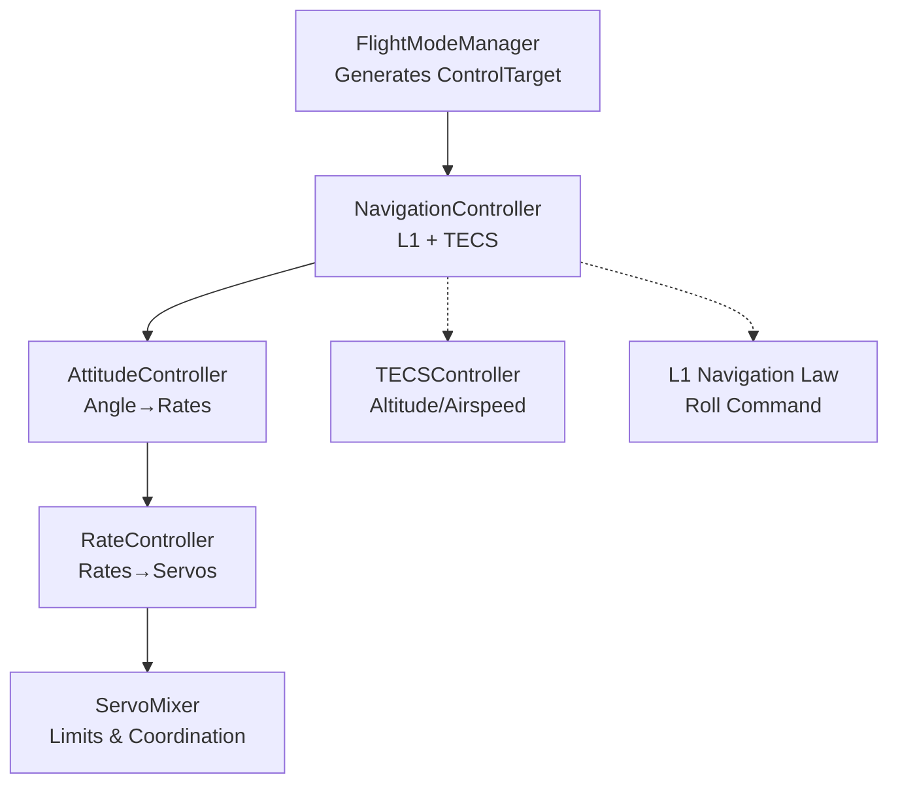
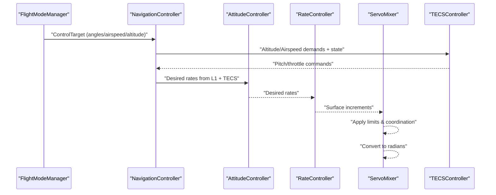
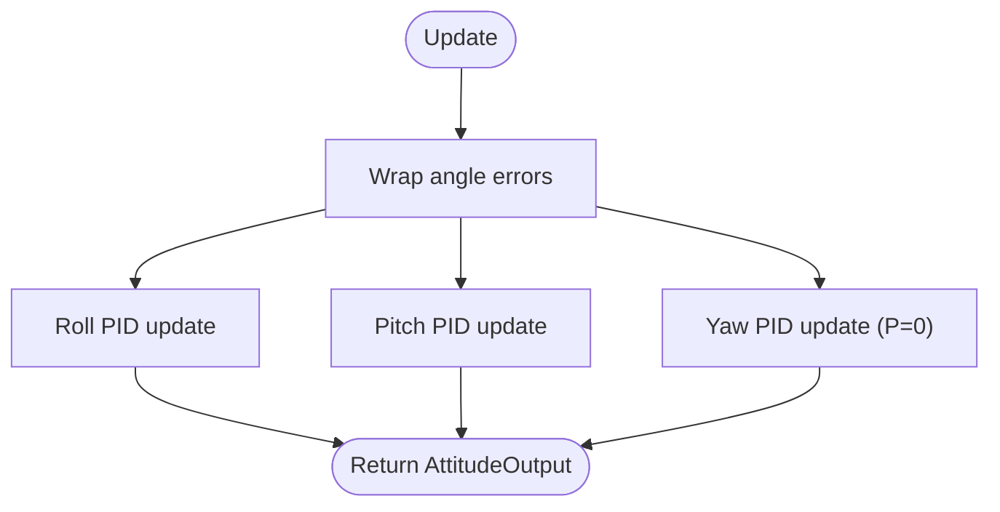
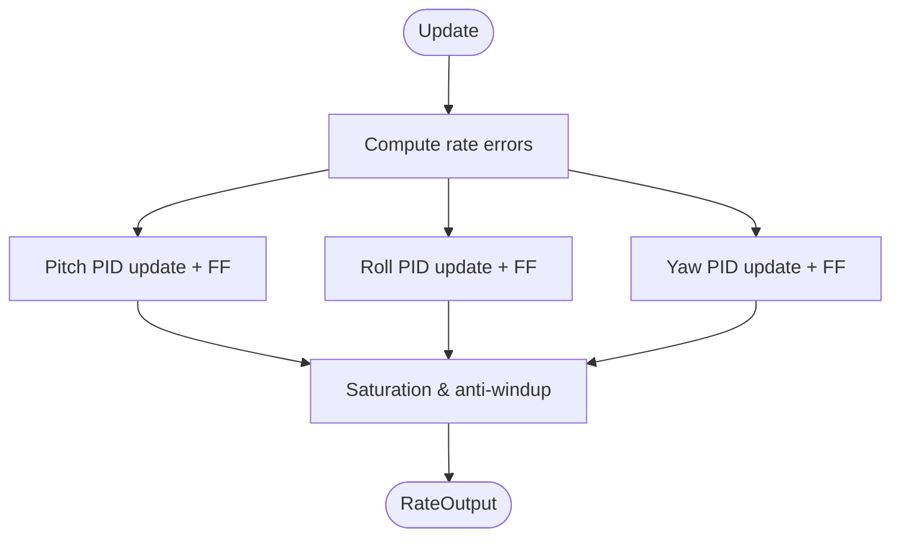
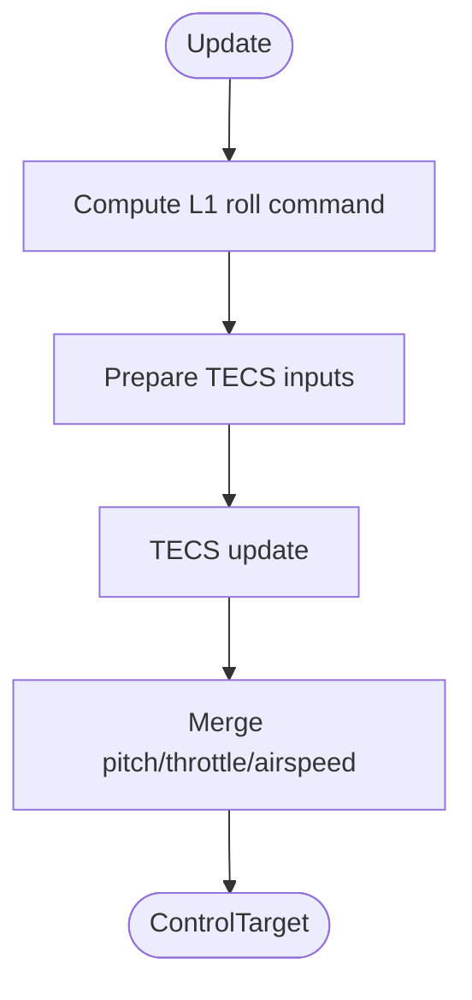
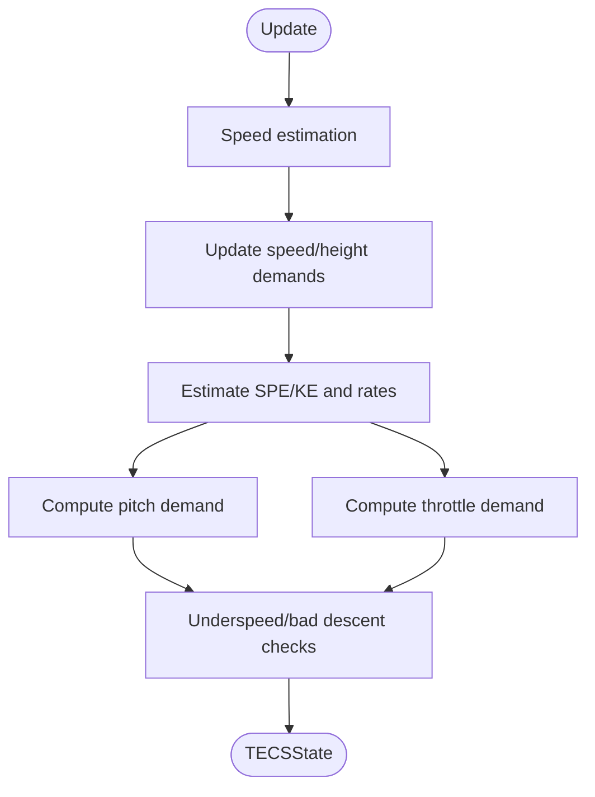
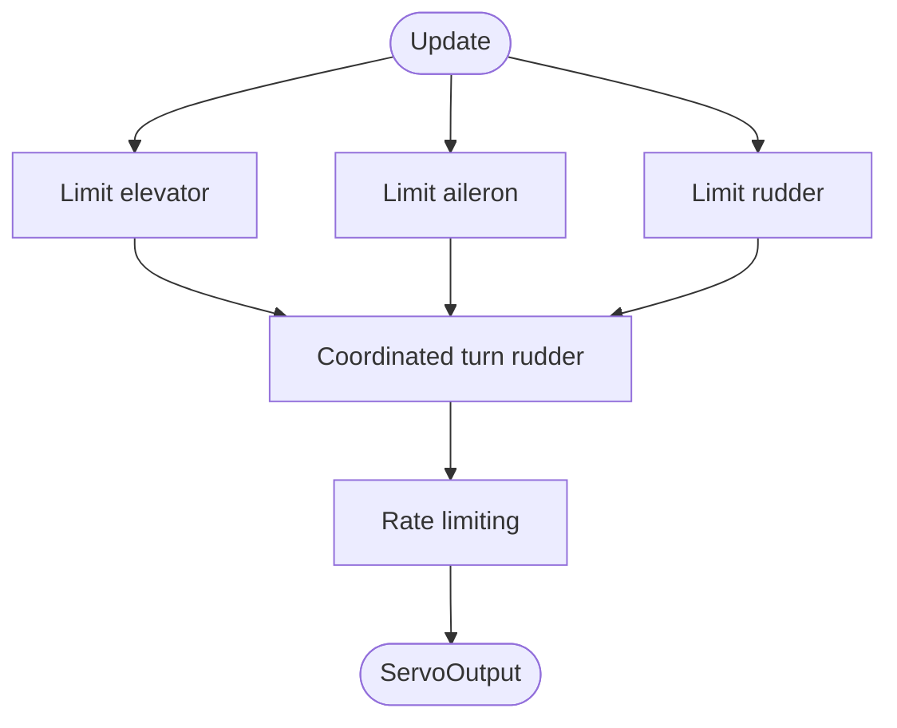
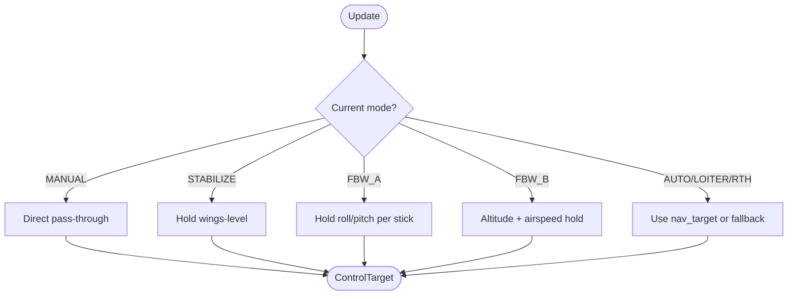
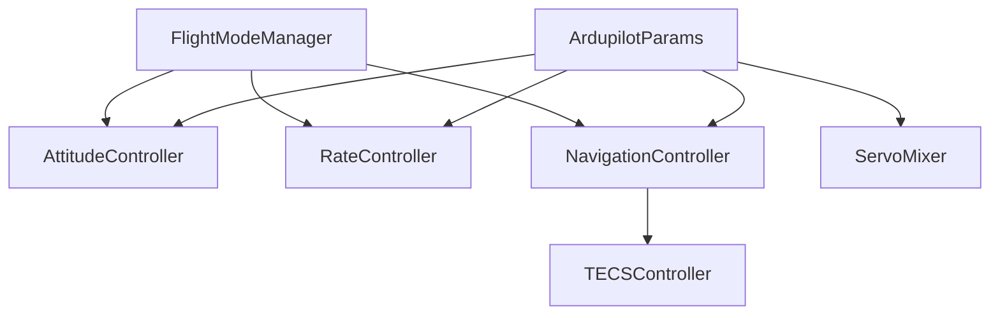

# Control Parameters Configuration

<cite>
**Referenced Files in This Document**
- [ardupilot_compat.py](file://src/control/ardupilot_compat.py)
- [attitude_controller.py](file://src/control/attitude_controller.py)
- [rate_controller.py](file://src/control/rate_controller.py)
- [servo_mixer.py](file://src/control/servo_mixer.py)
- [tecs_controller.py](file://src/control/tecs_controller.py)
- [navigation_controller.py](file://src/control/navigation_controller.py)
- [flight_mode_manager.py](file://src/control/flight_mode_manager.py)
- [pid_controller.py](file://src/control/pid_controller.py)
- [control_params.yaml](file://config/control_params.yaml)
- [aircraft.yaml](file://config/aircraft.yaml)
- [simulation.yaml](file://config/simulation.yaml)
- [config_loader.py](file://src/utils/config_loader.py)
</cite>

## Table of Contents
1. [Introduction](#introduction)
2. [Project Structure](#project-structure)
3. [Core Components](#core-components)
4. [Architecture Overview](#architecture-overview)
5. [Detailed Component Analysis](#detailed-component-analysis)
6. [Dependency Analysis](#dependency-analysis)
7. [Performance Considerations](#performance-considerations)
8. [Troubleshooting Guide](#troubleshooting-guide)
9. [Conclusion](#conclusion)
10. [Appendices](#appendices)

## Introduction
This document provides comprehensive control parameters configuration for the five-layer ArduPilot-compatible control system implemented in the FixedWingSimulator. It covers:
- PID controller parameters for attitude control (roll, pitch, yaw), rate control, and navigation control
- TECS (Total Energy Control System) parameters for altitude and airspeed management
- Flight mode configuration (AUTO, FBWA, STABILIZE, etc.) and parameter sets
- Control surface limitations, actuator constraints, and safety limits
- ArduPilot parameter compatibility mappings and hardware-in-the-loop integration settings
- PID tuning methodologies, stability analysis techniques, and parameter validation procedures
- Practical examples for different aircraft types and flight scenarios, including step response analysis and frequency domain characterization

## Project Structure
The control system is organized into five layers aligned with ArduPilot’s control hierarchy:
- Layer 1 (Outer loop): Attitude control (angle targets)
- Layer 2 (Inner loop): Rate control (angular rate targets)
- Layer 3 (Navigation): L1 navigation law and TECS for altitude/airspeed
- Layer 4 (Mode/Targets): Flight mode management generating ControlTarget
- Layer 5 (Actuator): Servo mixer applying limits and coordinated turn compensation

**Diagram sources**
- [flight_mode_manager.py](file://src/control/flight_mode_manager.py#L115-L298)
- [navigation_controller.py](file://src/control/navigation_controller.py#L45-L202)
- [attitude_controller.py](file://src/control/attitude_controller.py#L33-L134)
- [rate_controller.py](file://src/control/rate_controller.py#L32-L109)
- [servo_mixer.py](file://src/control/servo_mixer.py#L54-L153)
- [tecs_controller.py](file://src/control/tecs_controller.py#L50-L647)

**Section sources**
- [flight_mode_manager.py](file://src/control/flight_mode_manager.py#L1-L298)
- [navigation_controller.py](file://src/control/navigation_controller.py#L1-L293)
- [attitude_controller.py](file://src/control/attitude_controller.py#L1-L134)
- [rate_controller.py](file://src/control/rate_controller.py#L1-L109)
- [servo_mixer.py](file://src/control/servo_mixer.py#L1-L153)
- [tecs_controller.py](file://src/control/tecs_controller.py#L1-L647)

## Core Components
This section documents the five-layer control system and the parameters used at each layer.

- Attitude Controller (Layer 1)
  - Purpose: Convert desired Euler angles to desired angular rates.
  - Key parameters: PTCH_P, ROLL_P (outer-loop P only), YAW has no attitude outer loop.
  - Implementation: Three independent PID loops with output limits for roll/pitch/yaw rates.

- Rate Controller (Layer 2)
  - Purpose: Inner-loop SAS; stabilize short-period and phugoid modes.
  - Key parameters: PTCH_RATE_P, PTCH_RATE_I, PTCH_RATE_D, PTCH_RATE_FF; ROLL_RATE_*; YAW_RATE_*.
  - Implementation: Feed-forward added before saturation; normalised surface increments.

- Navigation Controller (Layer 3)
  - Purpose: L1 lateral navigation plus TECS for altitude and airspeed.
  - Key parameters: NAVL1_PERIOD, NAVL1_DAMPING; TECS_* parameters (see TECS section).
  - Implementation: Computes roll command via L1 law; passes altitude and airspeed targets to TECS.

- Flight Mode Manager (Layer 4)
  - Modes: MANUAL, STABILIZE, FBW_A, FBW_B, AUTO, LOITER, RTH.
  - Output: ControlTarget with roll/pitch/yaw commands, rates, airspeed/altitude targets, throttle.

- Servo Mixer (Layer 5)
  - Purpose: Apply amplitude and rate limits, coordinated turn rudder, convert to radians.
  - Key parameters: LIM_PITCH_MAX/MIN, LIM_ROLL_CD, THR_MIN/THR_MAX, rate_limit.
  - Implementation: Saturation, rate limiting, coordinated turn compensation.

**Section sources**
- [attitude_controller.py](file://src/control/attitude_controller.py#L33-L134)
- [rate_controller.py](file://src/control/rate_controller.py#L32-L109)
- [navigation_controller.py](file://src/control/navigation_controller.py#L45-L202)
- [flight_mode_manager.py](file://src/control/flight_mode_manager.py#L115-L298)
- [servo_mixer.py](file://src/control/servo_mixer.py#L54-L153)

## Architecture Overview
The control architecture follows ArduPilot’s layered PID structure with TECS managing total energy and L1 guiding lateral path tracking.

**Diagram sources**
- [flight_mode_manager.py](file://src/control/flight_mode_manager.py#L173-L212)
- [navigation_controller.py](file://src/control/navigation_controller.py#L134-L202)
- [attitude_controller.py](file://src/control/attitude_controller.py#L81-L122)
- [rate_controller.py](file://src/control/rate_controller.py#L68-L98)
- [servo_mixer.py](file://src/control/servo_mixer.py#L80-L149)
- [tecs_controller.py](file://src/control/tecs_controller.py#L247-L315)

## Detailed Component Analysis

### PID Controller (Generic)
- Features: P/I/D terms, clamping-based anti-windup, optional derivative low-pass filter, reset on mode transitions.
- Parameters: kp, ki, kd, output_min, output_max, d_lpf_hz, dt.
- Usage: Shared by attitude and rate controllers.

**Section sources**
- [pid_controller.py](file://src/control/pid_controller.py#L17-L117)

### Attitude Controller (Layer 1)
- Outer-loop: Pure P for roll and pitch; yaw pass-through (no attitude outer loop).
- Output limits: Max roll/pitch/yaw rates in rad/s.
- Error handling: Angle wrapping for minimal error.

**Diagram sources**
- [attitude_controller.py](file://src/control/attitude_controller.py#L107-L122)

**Section sources**
- [attitude_controller.py](file://src/control/attitude_controller.py#L33-L134)

### Rate Controller (Layer 2)
- Inner-loop SAS: Pitch/roll with full P/I/D/FF; yaw with P/I only.
- Feed-forward: Added before saturation to improve disturbance rejection.
- Output: Normalised surface increments [-1, 1].

**Diagram sources**
- [rate_controller.py](file://src/control/rate_controller.py#L68-L98)

**Section sources**
- [rate_controller.py](file://src/control/rate_controller.py#L32-L109)

### Navigation Controller (Layer 3)
- L1 navigation: Look-ahead point placement, lateral acceleration, bank angle computation.
- TECS: Altitude and airspeed control with energy error gains and throttle scheduling.
- Output: ControlTarget with roll_cmd, pitch_cmd, throttle_cmd, airspeed_cmd, altitude_cmd.

**Diagram sources**
- [navigation_controller.py](file://src/control/navigation_controller.py#L134-L202)

**Section sources**
- [navigation_controller.py](file://src/control/navigation_controller.py#L45-L202)

### TECS Controller (Altitude and Airspeed Management)
- Core idea: Throttle controls specific total energy; pitch controls specific energy balance.
- Key parameters:
  - Climbing/sinking limits: TECS_CLMB_MAX, TECS_SINK_MIN, TECS_SINK_MAX
  - Time constant: TECS_TIME_CONST
  - Damping: TECS_THR_DAMP, TECS_PTCH_DAMP
  - Integral gain: TECS_INTEG_GAIN
  - Speed weight: TECS_SPDWEIGHT (0=height priority, 2=speed priority)
  - Roll-to-throttle compensation: TECS_RLL2THR
  - Pitch limits: TECS_PITCH_MAX, TECS_PITCH_MIN
  - Cruise throttle: TECS_THR_CRUISE
  - Height demand time constant: TECS_HDEM_TCONST
- Features: Underspeed protection, bad descent detection, auto-scaling climb/sink limits, underspeed prioritization.

**Diagram sources**
- [tecs_controller.py](file://src/control/tecs_controller.py#L247-L315)

**Section sources**
- [tecs_controller.py](file://src/control/tecs_controller.py#L50-L647)

### Servo Mixer (Layer 5)
- Applies amplitude limits from ArduPilot parameters (LIM_PITCH_MAX/MIN, LIM_ROLL_CD, THR_MIN/THR_MAX).
- Adds coordinated turn rudder compensation proportional to roll rate.
- Rate limiting applied to prevent excessive actuator slew.
- Converts normalised outputs to radians for aerodynamic convention.

**Diagram sources**
- [servo_mixer.py](file://src/control/servo_mixer.py#L80-L149)

**Section sources**
- [servo_mixer.py](file://src/control/servo_mixer.py#L54-L153)

### Flight Mode Manager (Layer 4)
- Modes: MANUAL, STABILIZE, FBW_A, FBW_B, AUTO, LOITER, RTH.
- Generates ControlTarget with angle/angle-rate/airspeed/altitude/throttle commands.
- Captures loiter center on entry and supports smooth transitions.

**Diagram sources**
- [flight_mode_manager.py](file://src/control/flight_mode_manager.py#L173-L212)

**Section sources**
- [flight_mode_manager.py](file://src/control/flight_mode_manager.py#L115-L298)

## Dependency Analysis
The control system exhibits a clean hierarchical dependency structure with ArduPilotParams as the central parameter container.

**Diagram sources**
- [ardupilot_compat.py](file://src/control/ardupilot_compat.py#L17-L130)
- [attitude_controller.py](file://src/control/attitude_controller.py#L50-L53)
- [rate_controller.py](file://src/control/rate_controller.py#L46-L49)
- [navigation_controller.py](file://src/control/navigation_controller.py#L57-L82)
- [servo_mixer.py](file://src/control/servo_mixer.py#L65-L73)
- [tecs_controller.py](file://src/control/tecs_controller.py#L80-L105)
- [flight_mode_manager.py](file://src/control/flight_mode_manager.py#L126-L137)

**Section sources**
- [ardupilot_compat.py](file://src/control/ardupilot_compat.py#L17-L130)
- [attitude_controller.py](file://src/control/attitude_controller.py#L33-L134)
- [rate_controller.py](file://src/control/rate_controller.py#L32-L109)
- [navigation_controller.py](file://src/control/navigation_controller.py#L45-L202)
- [servo_mixer.py](file://src/control/servo_mixer.py#L54-L153)
- [tecs_controller.py](file://src/control/tecs_controller.py#L50-L647)
- [flight_mode_manager.py](file://src/control/flight_mode_manager.py#L115-L298)

## Performance Considerations
- Sampling and time steps: Simulation dt influences controller update rates; ensure consistency across layers.
- Anti-windup: PID clamping-based anti-windup prevents integrator windup during saturation.
- Low-pass filtering: Derivative filtering reduces noise sensitivity; configure d_lpf_hz appropriately.
- Rate limiting: Servo mixer rate limits reduce actuator stress and improve physical realism.
- TECS smoothing: Height demand time constants and speed demand rate limiting prevent aggressive transients.

[No sources needed since this section provides general guidance]

## Troubleshooting Guide
- Parameter validation failures: Use ArdupilotParams.validate() to check ranges; adjust out-of-bounds values.
- Controller instability: Reduce P gains; add damping (D) or reduce FF; verify anti-windup is active.
- Actuator saturation: Verify THR_MIN/THR_MAX and surface limits; confirm servo mixer saturation and rate limiting.
- Mode transitions: Call controller reset() on mode changes to clear integrators and prevent limit cycles.
- TECS underspeed/bad descent: Monitor underspeed and bad_descent flags; reduce speed weight or increase cruise throttle.

**Section sources**
- [ardupilot_compat.py](file://src/control/ardupilot_compat.py#L104-L130)
- [attitude_controller.py](file://src/control/attitude_controller.py#L129-L134)
- [rate_controller.py](file://src/control/rate_controller.py#L105-L109)
- [servo_mixer.py](file://src/control/servo_mixer.py#L151-L153)
- [tecs_controller.py](file://src/control/tecs_controller.py#L635-L647)

## Conclusion
The FixedWingSimulator implements a complete ArduPilot-compatible five-layer control system with robust parameter management, validated controllers, and integrated TECS and L1 navigation. By leveraging ArdupilotParams and the documented parameter sets, users can configure stable and performant control systems for various fixed-wing aircraft and flight scenarios.

[No sources needed since this section summarizes without analyzing specific files]

## Appendices

### A. ArduPilot Parameter Compatibility Mappings
- Attitude outer-loop: PTCH_P, ROLL_P (P-only)
- Rate inner-loop: PTCH_RATE_*, ROLL_RATE_*, YAW_RATE_* with FF
- Navigation: NAVL1_PERIOD, NAVL1_DAMPING
- Speed/altitude: AIRSPEED_CRUISE, ALT_HOLD_RTL
- Limits: LIM_PITCH_MAX/MIN, LIM_ROLL_CD, THR_MIN/THR_MAX

**Section sources**
- [ardupilot_compat.py](file://src/control/ardupilot_compat.py#L17-L60)
- [attitude_controller.py](file://src/control/attitude_controller.py#L55-L77)
- [rate_controller.py](file://src/control/rate_controller.py#L51-L64)
- [navigation_controller.py](file://src/control/navigation_controller.py#L57-L82)

### B. TECS Parameter Reference
- Climbing/sinking: TECS_CLMB_MAX, TECS_SINK_MIN, TECS_SINK_MAX
- Damping/time const: TECS_TIME_CONST, TECS_THR_DAMP, TECS_PTCH_DAMP
- Integral: TECS_INTEG_GAIN
- Speed weighting: TECS_SPDWEIGHT
- Roll compensation: TECS_RLL2THR
- Pitch limits: TECS_PITCH_MAX, TECS_PITCH_MIN
- Cruise throttle: TECS_THR_CRUISE
- Height demand smoothing: TECS_HDEM_TCONST

**Section sources**
- [tecs_controller.py](file://src/control/tecs_controller.py#L80-L116)
- [control_params.yaml](file://config/control_params.yaml#L30-L45)

### C. Flight Mode Configuration
- MANUAL: Direct stick pass-through; bypass attitude/rate loops.
- STABILIZE: Hold wings-level; use nav pitch/throttle if available.
- FBW_A: Hold current roll, maintain altitude with pitch.
- FBW_B: Altitude hold + airspeed hold; use nav pitch/throttle if available.
- AUTO/LOITER/RTH: Use nav_target or fallback to current state.

**Section sources**
- [flight_mode_manager.py](file://src/control/flight_mode_manager.py#L194-L297)

### D. Control Surface Limitations and Safety Limits
- Pitch: LIM_PITCH_MAX/MIN (degrees) mapped to elevator limits
- Roll: LIM_ROLL_CD mapped to aileron limits
- Throttle: THR_MIN/THR_MAX
- Servo rate limit: configurable deg/s
- Coordinated turn: rudder compensation proportional to roll rate

**Section sources**
- [servo_mixer.py](file://src/control/servo_mixer.py#L109-L144)
- [ardupilot_compat.py](file://src/control/ardupilot_compat.py#L46-L51)

### E. Configuration Loading and Hardware-in-the-Loop Integration
- YAML loading: ConfigLoader.load_control() merges defaults with user overrides.
- Aircraft selection: aircraft.yaml selects model and allows overrides.
- Simulation settings: dt, integrator, initial mode, wind configuration.
- HIL integration: Parameters exported via ArdupilotParams serialization support ArduPilot parameter files.

**Section sources**
- [config_loader.py](file://src/utils/config_loader.py#L68-L81)
- [aircraft.yaml](file://config/aircraft.yaml#L1-L13)
- [simulation.yaml](file://config/simulation.yaml#L1-L29)
- [ardupilot_compat.py](file://src/control/ardupilot_compat.py#L82-L98)

### F. PID Tuning Methodologies and Stability Analysis
- Step response analysis: Observe overshoot, settling time, and steady-state error; adjust P/D gains accordingly.
- Frequency domain characterization: Use loop shaping to achieve desired phase and gain margins; verify bandwidth.
- Stability techniques:
  - Anti-windup: Ensure clamping-based integrator protection.
  - Derivative filtering: Reduce noise sensitivity.
  - Feed-forward: Improve disturbance rejection without destabilizing the loop.
- Validation procedures:
  - Gradual increase of P gain until stable oscillation; then reduce to 60–80% of that value.
  - Add D to improve damping; monitor for noise amplification.
  - Introduce I gradually to eliminate steady-state error; watch for windup and saturation.

[No sources needed since this section provides general guidance]

### G. Practical Setup Examples
- TB2-class UAV:
  - Use control_params.yaml defaults for moderate stability and reasonable performance.
  - Validate with step response tests in STABILIZE mode; then transition to AUTO with L1 guidance.
- High-performance glider:
  - Increase ROLL_RATE_P modestly; add small ROLL_RATE_D for damping.
  - Adjust TECS_SPDWEIGHT to 2.0 for speed priority; tune TECS_THR_DAMP to reduce throttle hunting.
- High-altitude long-endurance aircraft:
  - Tighten TECS_PITCH_MIN/MAX to avoid deep stall regions.
  - Increase TECS_TIME_CONST for smoother responses; reduce TECS_INTEG_GAIN to minimize oscillations.

[No sources needed since this section provides general guidance]